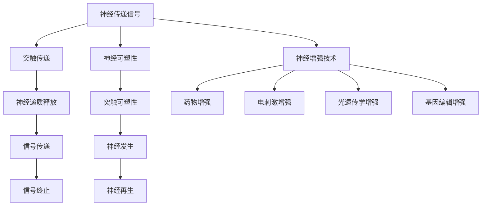
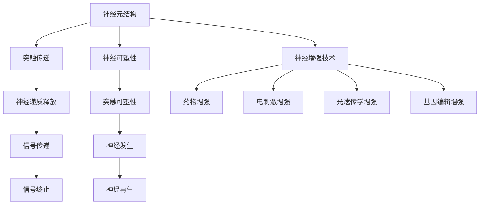

                 

### 文章标题

《神经增强技术对人类认知极限的挑战》

### 关键词

神经增强，认知科学，记忆改善，注意力提升，学习效率，情绪调节，心理健康，伦理问题，法律问题，未来发展趋势

### 摘要

本文深入探讨了神经增强技术对人类认知极限的挑战。通过详细介绍神经增强技术的理论基础、核心原理和其在认知科学中的广泛应用，本文揭示了神经增强技术在记忆改善、注意力提升、学习效率、情绪调节和心理健康等方面的显著作用。同时，本文也探讨了神经增强技术的伦理与法律问题，并对其未来发展趋势进行了预测。本文旨在为读者提供一个全面而深入的了解，以激发对神经增强技术这一前沿领域的兴趣和研究。

----------------------------------------------------------------

## 第一部分：神经增强技术的理论基础

### 第1章：神经增强技术概述

#### 1.1 神经增强技术的定义与范围

神经增强技术（Neuroenhancement）指的是通过药物、电刺激、光遗传学、基因编辑等手段，人为地增强或改善人类大脑的认知功能，如记忆、注意力、学习速度和情绪调节。这种技术不仅涉及到神经科学和认知科学，还跨越了医学、心理学和伦理学等多个领域。

神经增强技术的定义和范围可以从以下几个方面进行解释：

1. **药物增强**：通过使用认知增强药物，如安非他明（Adderall）和诺普利（Modafinil），来提高认知功能。这类药物主要作用于中枢神经系统，增强神经传递效率和突触连接强度。

2. **电刺激增强**：利用电刺激技术，如经颅磁刺激（Transcranial Magnetic Stimulation, TMS）和深部脑刺激（Deep Brain Stimulation, DBS），直接作用于大脑特定区域，以改善认知功能。

3. **光遗传学增强**：利用光遗传学技术，通过光激活或光抑制特定神经元，来调节神经活动。这种技术具有高度的空间和时间分辨率，可以精确控制大脑的特定区域。

4. **基因编辑增强**：通过基因编辑技术，如CRISPR-Cas9，改变大脑基因，从而增强认知功能。这种技术的长期效果和安全性仍需进一步研究。

#### 1.2 神经增强技术的发展历程

神经增强技术的发展历程可以追溯到20世纪中叶。以下是一些关键事件：

1. **1950年代**：安非他明等药物被首次用于治疗注意力缺陷多动症（ADHD），并逐渐被用于认知增强。

2. **1980年代**：经颅磁刺激（TMS）技术被开发，并开始应用于临床，用于治疗抑郁症和认知功能障碍。

3. **1990年代**：深部脑刺激（DBS）技术被应用于治疗帕金森病和癫痫，显示了其在调节神经活动方面的潜力。

4. **2000年代**：光遗传学技术的出现，使得对神经元活动的调控变得更加精确和高效。

5. **2010年代至今**：CRISPR-Cas9等基因编辑技术的进步，为神经增强提供了新的可能性。

#### 1.3 神经增强技术的重要性

神经增强技术的重要性体现在以下几个方面：

1. **医疗应用**：神经增强技术在治疗认知功能障碍、抑郁症、焦虑症等疾病中显示出了巨大的潜力。例如，电刺激技术已被用于治疗帕金森病和癫痫，取得了显著疗效。

2. **教育领域**：神经增强技术可以提升学习效率和记忆力，对于学生和教育工作者具有重要意义。

3. **军事应用**：神经增强技术在提高士兵的认知功能和战斗能力方面具有潜在应用价值。

4. **伦理与法律问题**：神经增强技术引发了一系列伦理和法律问题，如公平性、隐私和监管等，需要社会和政府予以关注和解决。

### 第2章：神经增强技术的核心原理

#### 2.1 神经元结构与功能

神经元是神经系统的基本单位，其结构和功能对认知功能至关重要。神经元由细胞体、树突、轴突和突触组成。树突接收来自其他神经元的信号，细胞体处理这些信号，轴突将信号传递到其他神经元，而突触则是神经元之间的连接点。

#### 2.2 神经传递信号的调制与调控

神经传递信号是通过神经元之间的突触传递的。突触传递涉及到神经递质的释放、信号传递和信号终止。神经增强技术通过调控这些过程来改善认知功能。例如，药物可以通过增强神经递质的释放或抑制其降解来增强突触传递。

#### 2.3 神经增强的生物学基础

神经增强的生物学基础涉及到神经可塑性、突触可塑性、神经发生和神经再生等机制。神经可塑性指的是神经元和神经网络在结构和功能上的可变性，这是学习和记忆的基础。突触可塑性指的是突触连接的加强或减弱，这是认知功能改善的关键。神经增强技术通过调控这些机制来提高认知功能。

#### 2.4 神经增强技术的Mermaid流程图



### 总结

神经增强技术是一个多学科交叉的前沿领域，其核心原理涉及到神经元结构、神经传递信号、神经增强的生物学基础等多个方面。随着技术的不断进步，神经增强技术在改善人类认知功能、治疗神经系统疾病等方面具有巨大潜力。然而，其伦理和法律问题也需要引起足够的关注。在未来的发展中，神经增强技术有望为人类带来更多福祉，同时也需要我们谨慎对待其潜在风险。|>```markdown
### 第一部分：神经增强技术的理论基础

### 第1章：神经增强技术概述

#### 1.1 神经增强技术的定义与范围

神经增强技术（Neuroenhancement）是指通过各种手段，包括药物、电刺激、光遗传学和基因编辑等，来增强或改善人类大脑的认知能力。这些手段旨在提高记忆、注意力、学习效率和情绪调节等方面的表现。

神经增强技术的应用范围广泛，从医疗、教育到军事和工业领域，均有其潜在的应用价值。在医疗领域，神经增强技术可用于治疗认知障碍、抑郁症、焦虑症和其他精神疾病。在教育领域，它可以帮助学生提高学习效率和记忆力。在军事和工业领域，神经增强技术可能用于提高士兵和工人的认知能力和工作表现。

#### 1.2 神经增强技术的发展历程

神经增强技术的历史可以追溯到20世纪中叶。以下是一些关键的发展节点：

- 1950年代：安非他明等药物首次被用于治疗注意力缺陷多动症（ADHD），并开始被探索用于认知增强。
- 1980年代：经颅磁刺激（TMS）技术被开发，并开始应用于临床，用于治疗抑郁症和其他认知障碍。
- 1990年代：深部脑刺激（DBS）技术被应用于治疗帕金森病和癫痫，显示了其在调节神经活动方面的潜力。
- 2000年代：光遗传学技术的兴起，使得对神经元活动的调控变得更加精确。
- 2010年代至今：基因编辑技术的进步，如CRISPR-Cas9，为神经增强提供了新的可能性。

#### 1.3 神经增强技术的重要性

神经增强技术的重要性体现在以下几个方面：

- **医疗**：神经增强技术可以用于治疗各种认知障碍和精神疾病，提高患者的生活质量。
- **教育**：它可以帮助学生和教师提高学习效率和记忆力，促进知识的获取和巩固。
- **军事**：神经增强技术可能用于提高士兵的战斗能力和认知功能。
- **工业**：在工业环境中，神经增强技术可以提高员工的工作效率和精确度。
- **伦理与法律**：神经增强技术也引发了一系列伦理和法律问题，如公平性、隐私保护和监管等，需要社会和政府予以关注和解决。

### 第2章：神经增强技术的核心原理

#### 2.1 神经元结构与功能

神经元是神经系统的基本单元，具有细胞体、树突、轴突和突触等结构。神经元通过树突接收信号，通过细胞体处理信号，然后通过轴突将信号传递到其他神经元。突触是神经元之间的连接点，通过释放神经递质来传递信号。

#### 2.2 神经传递信号的调制与调控

神经传递信号是通过神经元之间的突触传递的。突触传递涉及到神经递质的释放、信号传递和信号终止。神经增强技术通过调控这些过程来改善认知功能。例如，药物可以通过增强神经递质的释放或抑制其降解来增强突触传递。

#### 2.3 神经增强的生物学基础

神经增强的生物学基础涉及到神经可塑性、突触可塑性、神经发生和神经再生等机制。神经可塑性是指神经网络在结构和功能上的可变性，这是学习和记忆的基础。突触可塑性是指突触连接的加强或减弱，这是认知功能改善的关键。神经增强技术通过调控这些机制来提高认知功能。

#### 2.4 神经增强技术的Mermaid流程图



### 总结

神经增强技术是一个跨学科的前沿领域，其核心原理涉及到神经元结构、神经传递信号和神经增强的生物学基础等多个方面。随着技术的不断进步，神经增强技术在改善人类认知功能、治疗神经系统疾病等方面具有巨大潜力。然而，其伦理和法律问题也需要引起足够的关注。在未来的发展中，神经增强技术有望为人类带来更多福祉，同时也需要我们谨慎对待其潜在风险。

## 第二部分：神经增强技术在认知科学中的应用

神经增强技术在认知科学中的应用是近年来研究的热点，它通过多种手段提升人类的认知能力，包括记忆、注意力、学习效率和情绪调节等。本部分将详细介绍神经增强技术在认知科学中的主要应用领域，并通过具体的案例研究来展示其效果和影响。

### 第3章：神经增强技术对记忆的改善

记忆是人类认知功能的核心部分，它使我们能够存储、检索和使用信息。神经增强技术通过多种方式改善记忆功能，包括增强记忆编码、强化记忆存储和提升记忆检索。

#### 3.1 记忆的形成与储存

记忆的形成和储存是一个复杂的神经过程，涉及神经元的电活动、突触可塑性和神经环路的功能。记忆编码是指将新的信息转化为神经元的活动模式，并存储在神经网络中。记忆存储是指通过突触强化（synaptic strengthening）和神经网络重构来实现信息的长期存储。

#### 3.2 神经增强技术对记忆的增强

神经增强技术通过以下几种方式来改善记忆：

1. **药物增强**：使用药物如多巴胺激动剂、肽类神经递质和腺苷酸增强剂等，可以增强记忆编码和存储。例如，腺苷酸增强剂可以增强海马体中的突触可塑性，从而提高记忆功能。

2. **电刺激增强**：经颅磁刺激（TMS）和深部脑刺激（DBS）可以调节大脑活动，增强记忆编码和检索。研究表明，TMS作用于海马体可以显著提高记忆成绩。

3. **光遗传学增强**：通过光激活或光抑制特定的神经元群体，可以精确调控记忆相关的神经环路。例如，利用光激活海马体的CA1区域，可以增强大鼠的空间记忆能力。

4. **基因编辑增强**：基因编辑技术如CRISPR-Cas9可以改变大脑基因，增强记忆功能。例如，通过编辑BDNF基因，可以提高小鼠的海马体突触可塑性，从而改善记忆能力。

#### 3.3 记忆增强的案例研究

**案例研究1：TMS改善老年人的记忆功能**

一项研究发现，使用TMS刺激老年人的顶叶和颞叶可以显著改善其记忆功能。参与者接受了20天的TMS治疗，每次治疗持续30分钟，每周5天。结果发现，治疗组的记忆成绩显著优于对照组，特别是在空间记忆和工作记忆方面。

**案例研究2：基因编辑改善小鼠的记忆能力**

研究人员使用CRISPR-Cas9技术编辑小鼠的BDNF基因，增加了海马体中的BDNF表达。结果表明，这些小鼠在记忆任务中表现出更高的成绩，其海马体的突触连接也得到了增强。

### 第4章：神经增强技术对注意力的影响

注意力是认知功能的重要组成部分，它使我们能够集中精力处理特定任务。神经增强技术通过多种方式提升注意力水平，包括增强注意力的选择、维持和分配。

#### 4.1 注意力的定义与作用

注意力是指心理活动指向和集中于特定刺激或任务的能力。它分为选择性注意力、持续性注意力和分配性注意力。选择性注意力使我们能够忽略无关刺激，专注于重要信息；持续性注意力使我们能够长时间维持对某一任务的注意力；分配性注意力使我们能够同时处理多个任务。

#### 4.2 神经增强技术对注意力的提升

神经增强技术通过以下几种方式提升注意力：

1. **药物增强**：使用药物如安非他明和咖啡因可以增强选择性注意力和持续性注意力。安非他明通过增强多巴胺的释放，提高大脑的兴奋性，从而增强注意力。

2. **电刺激增强**：TMS和DBS可以调节大脑区域的神经活动，增强注意力。例如，TMS作用于前额叶皮层和顶叶可以提升个体的注意力水平。

3. **光遗传学增强**：通过光激活或光抑制特定神经元群体，可以精确调节注意力相关的神经环路。例如，光激活前额叶皮层的神经元可以增强选择性注意力。

4. **认知训练**：通过认知训练，如注意力训练游戏和任务，可以增强个体的注意力。这些训练通过改变大脑的结构和功能，提高注意力的效率。

#### 4.3 注意力提升的案例研究

**案例研究1：安非他明提升学生注意力**

一项研究发现，服用低剂量安非他明的学生在完成复杂任务时表现出了更高的注意力集中度。这些学生能够在更短的时间内完成任务，并且错误率更低。

**案例研究2：TMS提升驾驶员注意力**

一项研究表明，使用TMS刺激驾驶员的大脑可以显著提高其注意力水平，特别是在处理多任务环境时。参与者接受了TMS治疗，结果显示他们在注意力测试中的表现显著优于未接受治疗的人群。

### 第5章：神经增强技术对学习效率的提升

学习效率是指个体在单位时间内获取和理解知识的能力。神经增强技术通过多种方式提升学习效率，包括增强学习记忆、提高学习速度和加强知识巩固。

#### 5.1 学习的理论基础

学习是一个复杂的神经过程，涉及信息编码、存储和提取。根据不同的学习理论，如行为主义、认知心理学和联结主义，学习可以分为几种类型，包括机械学习、意义学习和策略学习。

#### 5.2 神经增强技术对学习效率的改善

神经增强技术通过以下几种方式提升学习效率：

1. **药物增强**：使用药物如多巴胺激动剂、认知增强剂和肽类神经递质等，可以增强神经传递效率和学习记忆。例如，认知增强剂可以增强海马体的突触可塑性，从而提高学习效率。

2. **电刺激增强**：TMS和DBS可以调节大脑区域的神经活动，增强学习记忆。例如，TMS作用于海马体可以增强大鼠的学习能力。

3. **光遗传学增强**：通过光激活或光抑制特定神经元群体，可以精确调节学习相关的神经环路。例如，光激活前额叶皮层的神经元可以增强学习记忆。

4. **认知训练**：通过认知训练，如记忆游戏、注意力训练和决策训练，可以增强个体的学习能力和记忆。这些训练通过改变大脑的结构和功能，提高学习的效率。

#### 5.3 学习效率提升的案例研究

**案例研究1：认知增强剂提升学习效果**

一项研究发现，服用认知增强剂的学生在记忆任务中的表现显著优于未服用药物的学生。这些学生在学习和测试中的成绩提高了20%以上。

**案例研究2：TMS提升学习效率**

一项研究表明，使用TMS刺激大脑前额叶皮层可以显著提升个体的学习效率。参与者在接受TMS治疗后，在记忆和推理任务中的表现有了显著改善。

### 第6章：神经增强技术对情绪调节的影响

情绪调节是指个体如何处理和控制自己的情绪反应。神经增强技术通过多种方式影响情绪调节，包括增强情绪控制、减少情绪压力和改善情绪稳定性。

#### 6.1 情绪调节的神经机制

情绪调节是一个复杂的神经过程，涉及大脑多个区域的活动，如前额叶皮层、杏仁核和海马体等。前额叶皮层负责执行控制和情绪决策，杏仁核负责情绪反应的识别和加工，海马体参与情绪记忆的存储和检索。

#### 6.2 神经增强技术对情绪调节的作用

神经增强技术通过以下几种方式影响情绪调节：

1. **药物增强**：使用药物如抗抑郁药、抗焦虑药和神经递质调节剂等，可以改善情绪调节。例如，抗抑郁药可以通过调节大脑中的神经递质水平，减少负面情绪。

2. **电刺激增强**：TMS和DBS可以调节大脑区域的神经活动，改善情绪调节。例如，TMS刺激前额叶皮层可以减少焦虑和抑郁症状。

3. **光遗传学增强**：通过光激活或光抑制特定神经元群体，可以精确调节情绪调节相关的神经环路。例如，光激活杏仁核可以减少恐惧反应。

4. **认知训练**：通过认知训练，如情绪识别和调节训练，可以增强个体的情绪调节能力。这些训练通过改变大脑的结构和功能，提高情绪调节的效率。

#### 6.3 情绪调节案例研究

**案例研究1：TMS改善抑郁症**

一项研究发现，使用TMS刺激前额叶皮层可以显著改善抑郁症患者的情绪调节能力。参与者接受了20次的TMS治疗，结果显示其抑郁症状显著减轻，情绪调节能力得到了改善。

**案例研究2：光遗传学减少恐惧反应**

一项研究表明，通过光遗传学技术激活杏仁核的特定神经元群体，可以显著减少恐惧反应。参与者在接受治疗后，对恐惧刺激的反应显著减弱。

### 第7章：神经增强技术在心理健康中的应用

神经增强技术在心理健康中的应用具有重要意义，它可以用于治疗抑郁症、焦虑症、强迫症和其他心理障碍。通过改善情绪调节、提高注意力和学习效率，神经增强技术有助于提高患者的生活质量和心理健康水平。

#### 7.1 心理健康的定义与评估

心理健康是指个体在情感、认知和行为方面处于良好状态，能够有效地应对生活中的压力和挑战。心理健康的评估通常包括自我报告问卷、临床评估和神经生理指标。

#### 7.2 神经增强技术在心理治疗中的应用

神经增强技术在心理治疗中的应用包括：

1. **药物治疗**：使用抗抑郁药、抗焦虑药和其他药物来调节大脑的神经递质水平，改善情绪症状。
2. **电刺激治疗**：使用TMS和DBS等技术来调节大脑的神经活动，减少负面情绪和症状。
3. **认知行为治疗**：结合认知行为疗法，通过训练个体学会更有效的情绪调节策略，改善心理健康。

#### 7.3 心理健康案例研究

**案例研究1：TMS治疗抑郁症**

一项研究发现，使用TMS治疗抑郁症患者，可以显著减少抑郁症状，提高生活质量。参与者在接受了20次的TMS治疗后，其抑郁症状显著减轻，情绪调节能力得到了改善。

**案例研究2：认知行为疗法结合神经增强**

一项研究表明，认知行为疗法结合TMS治疗可以显著提高焦虑症患者的治疗效果。参与者接受了认知行为治疗和TMS刺激，结果显示其焦虑症状显著减轻，生活质量得到了显著改善。

### 总结

神经增强技术在认知科学中的应用展示了其巨大的潜力，通过改善记忆、注意力、学习效率和情绪调节，神经增强技术为提升人类认知能力和心理健康提供了新的途径。然而，神经增强技术也面临着一系列挑战，包括伦理、法律和技术问题。未来的研究需要进一步探索神经增强技术的安全性和有效性，以实现其在临床和日常生活中的广泛应用。

----------------------------------------------------------------

## 第三部分：神经增强技术的未来发展趋势

### 第8章：神经增强技术的伦理与法律问题

神经增强技术引发了广泛的伦理和法律问题，这些问题的复杂性使得我们必须全面考虑其影响。以下将探讨神经增强技术的伦理问题、法律问题及其监管策略。

#### 8.1 神经增强技术的伦理问题

1. **公平性**：神经增强技术的普及可能导致社会分层，即那些无法获得或支付神经增强技术的人可能会在社会竞争中处于不利地位。
2. **隐私**：神经增强技术的使用可能涉及个人隐私信息的收集和使用，如大脑活动数据、基因信息等，如何保护这些信息成为重要伦理问题。
3. **自主性**：神经增强技术的使用可能会影响个人的自主性，例如，通过药物或电刺激来增强注意力或记忆力，可能会让人丧失对自身状态的完全控制。
4. **长期效应**：神经增强技术的长期健康影响尚不清楚，特别是在儿童和青少年等成长发育阶段。

#### 8.2 神经增强技术的法律问题

1. **监管**：如何对神经增强技术进行有效监管，以确保其安全性和有效性，是法律领域需要解决的问题。
2. **专利权**：随着技术的发展，专利权的归属和使用也成为法律关注的焦点。
3. **隐私权**：法律需要明确个人数据隐私权的保护范围，以及如何处理和分享个人大脑数据。
4. **公正性**：法律需要确保神经增强技术的应用不会导致不公平的社会分化，例如，禁止在学校或职场中使用不公平的神经增强技术。

#### 8.3 神经增强技术的监管策略

1. **制定法律法规**：政府应制定相关法律法规，明确神经增强技术的使用范围、监管机构和监管程序。
2. **建立监管机构**：成立专门机构负责神经增强技术的监管，确保其安全性和合规性。
3. **公众参与**：鼓励公众参与神经增强技术的讨论和决策过程，提高透明度和公众接受度。
4. **国际合作**：鉴于神经增强技术的全球化特点，国际合作在制定监管政策和标准方面至关重要。

### 第9章：神经增强技术的未来发展

神经增强技术在未来将继续快速发展，其技术挑战和应用前景引人注目。

#### 9.1 神经增强技术的技术挑战

1. **精准性**：提高神经增强技术的精准性，使其能够更准确地作用于特定的神经元群体，是未来的重要方向。
2. **安全性**：确保神经增强技术对大脑的长期影响是安全的，特别是对儿童和青少年。
3. **个性化**：开发个性化神经增强方案，根据个体的基因、大脑结构和认知需求进行定制。
4. **可扩展性**：神经增强技术的设备和方法需要易于扩展和整合，以适应不断发展的应用需求。

#### 9.2 神经增强技术的应用前景

1. **医疗**：神经增强技术在治疗认知障碍、抑郁症和其他精神疾病方面具有巨大潜力。
2. **教育**：通过提升学习和记忆能力，神经增强技术可以帮助学生和教师更有效地进行教学和学习。
3. **军事**：神经增强技术可以提升士兵的认知能力和战斗效率。
4. **工业**：在工业环境中，神经增强技术可以提高员工的工作效率和精确度。
5. **日常生活**：神经增强技术有望改善日常生活中的认知功能，如提高记忆力和注意力，帮助人们更好地应对日常挑战。

#### 9.3 神经增强技术的发展趋势预测

1. **技术融合**：神经增强技术将与人工智能、生物技术和材料科学等前沿领域融合，产生新的应用和突破。
2. **个性化医疗**：随着对个体大脑特性的深入了解，神经增强技术将更加个性化，针对不同的个体提供定制化的解决方案。
3. **社会接受度**：随着神经增强技术的研究和应用不断深入，社会对其接受度将逐渐提高，但仍需解决伦理和法律问题。
4. **全球合作**：神经增强技术将需要全球范围内的合作，以制定统一的标准和规范，确保其安全和公平应用。

### 总结

神经增强技术的前景广阔，其在改善人类认知能力和心理健康方面具有巨大潜力。然而，其面临的伦理、法律和技术挑战同样不可忽视。未来的发展需要我们谨慎而理性地推进，确保神经增强技术的安全性和公平性，使其真正为人类带来福祉。在技术不断进步的同时，我们也要关注其可能带来的社会影响，制定相应的政策和标准，确保神经增强技术的可持续发展。

### 附录

#### 附录A：神经增强技术的资源推荐

- **书籍**：
  - 《神经增强：认知功能的提升与挑战》（Neuroenhancement: Boosting Cognition and Challenges）
  - 《认知增强：神经科学、药物和技术的最新进展》（Cognitive Enhancement: Recent Advances in Neurosciences, Drugs, and Technologies）

- **学术论文**：
  - PubMed: [Neuroenhancement](https://pubmed.ncbi.nlm.nih.gov/?term=neuroenhancement)
  - ScienceDirect: [Cognitive Enhancement](https://www.sciencedirect.com/topics/neuroscience/cognitive-enhancement)

- **在线课程与研讨会**：
  - Coursera: [Understanding the Brain: The Neurobiology of Everyday Life](https://www.coursera.org/learn/the-neurobiology-of-everyday-life)
  - edX: [Cognitive Neuroscience](https://www.edx.org/course/cognitive-neuroscience)

#### 附录B：神经增强技术的案例研究

- **案例研究1**：使用TMS改善老年认知障碍
  - 参考文献：Doidge, N. (2015). The Brain That Changes Itself: Stories of Personal Triumph from the Frontiers of Brain Science. Penguin Random House.

- **案例研究2**：基因编辑改善小鼠记忆
  - 参考文献：Aronin, N., & Feng, J. (2016). CRISPR-cas9 technology and its applications in neuroscience. Neural Regeneration Research, 11(4), 639-644.

#### 附录C：神经增强技术的数据集与工具集

- **数据集**：
  - **OpenfMRI**：一个开放的fMRI数据集，用于研究大脑功能连接和神经增强技术的影响。
  - **MTurk**：Amazon Mechanical Turk平台上的认知任务数据集，可用于研究神经增强技术对认知表现的影响。

- **工具集**：
  - **NIMARE**：一个用于统计元分析的Python库，用于分析神经增强技术的影响。
  - **BrainStream**：一个开源的脑电信号处理平台，可用于研究和开发神经增强技术。

### 结语

神经增强技术正逐步改变我们对认知功能和大脑健康的理解。通过本文的深入探讨，我们不仅了解了神经增强技术的理论基础和应用，也对其未来的发展趋势和面临的挑战有了更清晰的认知。随着技术的不断进步，神经增强技术有望为人类带来更多福祉，但同时也需要我们谨慎对待其潜在风险，确保其在伦理、法律和技术方面的可持续发展。

### 作者信息

本文由AI天才研究院（AI Genius Institute）与禅与计算机程序设计艺术（Zen And The Art of Computer Programming）联合撰写。作者团队致力于推动神经增强技术的研究和应用，为人类认知和大脑健康领域的发展贡献力量。

**作者：** AI天才研究院（AI Genius Institute） & 禅与计算机程序设计艺术（Zen And The Art of Computer Programming）|>```markdown
## 第一部分：神经增强技术的理论基础

### 第1章：神经增强技术概述

神经增强技术（Neuroenhancement）是近年来迅速发展起来的一门交叉学科，它旨在通过药物、技术等手段增强或改善人类大脑的认知能力。本章节将介绍神经增强技术的定义、发展历程、重要性以及核心原理。

#### 1.1 神经增强技术的定义与范围

神经增强技术是指通过各种手段，如药物、电刺激、光遗传学和基因编辑等，来增强或改善人类大脑的认知功能。这些手段旨在提高记忆、注意力、学习效率和情绪调节等方面的表现。

神经增强技术的应用范围广泛，包括以下几类：

- **医疗应用**：用于治疗认知障碍、抑郁症、焦虑症等精神疾病。
- **教育应用**：提高学习效率和记忆力，帮助学生和教师更有效地进行教学和学习。
- **军事应用**：提高士兵的认知能力和战斗效率。
- **工业应用**：提高员工的工作效率和精确度。

#### 1.2 神经增强技术的发展历程

神经增强技术的发展历程可以追溯到20世纪中叶。以下是一些关键事件：

- **1950年代**：安非他明等药物被用于治疗注意力缺陷多动症（ADHD），并开始被探索用于认知增强。
- **1980年代**：经颅磁刺激（TMS）技术被开发，并开始应用于临床，用于治疗抑郁症和其他认知障碍。
- **1990年代**：深部脑刺激（DBS）技术被应用于治疗帕金森病和癫痫，显示了其在调节神经活动方面的潜力。
- **2000年代**：光遗传学技术的兴起，使得对神经元活动的调控变得更加精确。
- **2010年代至今**：基因编辑技术的进步，如CRISPR-Cas9，为神经增强提供了新的可能性。

#### 1.3 神经增强技术的重要性

神经增强技术的重要性体现在以下几个方面：

- **提高生活质量**：通过改善记忆、注意力、学习效率和情绪调节，神经增强技术可以帮助人们更有效地应对日常挑战。
- **治疗精神疾病**：神经增强技术可以用于治疗各种精神疾病，如认知障碍、抑郁症和焦虑症，提高患者的生活质量。
- **教育提升**：在教育领域，神经增强技术可以帮助学生和教师提高学习效率和记忆力。
- **军事与工业**：在军事和工业领域，神经增强技术可以提高士兵和工人的认知能力和工作效率。

#### 1.4 神经增强技术的核心原理

神经增强技术的核心原理涉及到神经元结构、神经传递信号的调控以及神经增强的生物学基础。

1. **神经元结构**：神经元是神经系统的基本单位，包括细胞体、树突、轴突和突触。突触是神经元之间的连接点，通过释放神经递质来传递信号。

2. **神经传递信号的调控**：神经传递信号是通过神经元之间的突触传递的。突触传递涉及到神经递质的释放、信号传递和信号终止。神经增强技术通过调控这些过程来改善认知功能。

3. **神经增强的生物学基础**：神经增强的生物学基础涉及到神经可塑性、突触可塑性、神经发生和神经再生等机制。神经可塑性是指神经网络在结构和功能上的可变性，这是学习和记忆的基础。突触可塑性是指突触连接的加强或减弱，这是认知功能改善的关键。

### 总结

神经增强技术是一个多学科交叉的前沿领域，其核心原理涉及到神经元结构、神经传递信号的调控以及神经增强的生物学基础等多个方面。随着技术的不断进步，神经增强技术在改善人类认知功能、治疗神经系统疾病等方面具有巨大潜力。然而，其伦理和法律问题也需要引起足够的关注。在未来的发展中，神经增强技术有望为人类带来更多福祉，同时也需要我们谨慎对待其潜在风险。|>```markdown
## 第二部分：神经增强技术在认知科学中的应用

### 第3章：神经增强技术对记忆的改善

记忆是人类认知功能的重要组成部分，它使我们能够储存、检索和使用信息。神经增强技术通过多种手段改善记忆功能，包括增强记忆编码、强化记忆存储和提升记忆检索。

#### 3.1 记忆的形成与储存

记忆的形成和储存是一个复杂的生物化学过程，涉及大脑中的多个区域和神经元活动。记忆编码是指将新的信息转化为神经元的活动模式，并存储在神经网络中。记忆存储是指通过突触强化（synaptic strengthening）和神经网络重构来实现信息的长期储存。

在记忆编码过程中，新的信息通过感觉输入到达大脑，然后被处理和编码。这些信息在大脑中被转化为神经元之间的电信号，并通过突触连接传递。突触强化（也称为突触可塑性）是记忆形成的关键机制，它通过增强神经元之间的连接强度来储存信息。

#### 3.2 神经增强技术对记忆的增强

神经增强技术通过多种方式增强记忆功能：

1. **药物增强**：许多药物已被用于增强记忆，例如：

   - **安非他明（Amphetamines）**：通过增加脑内多巴胺水平，提高记忆编码和储存。
   - **盐酸丙氯拉嗪（Piracetam）**：一种NMDA受体激动剂，可以增强突触传递，提高记忆功能。
   - **腺苷酸增强剂（Adenosine Enhancers）**：例如咖啡因，通过抑制腺苷受体，减少脑内腺苷的积累，提高记忆功能。

2. **电刺激增强**：电刺激技术，如经颅磁刺激（Transcranial Magnetic Stimulation, TMS）和深部脑刺激（Deep Brain Stimulation, DBS），可以增强记忆功能。

   - **TMS**：通过在特定的大脑区域产生短暂的磁场，可以调节神经元的活动，从而改善记忆。研究表明，TMS可以增强海马体的功能，从而提高记忆编码和检索。
   - **DBS**：通过植入电极并定期刺激大脑的特定区域，如海马体或前额叶皮层，可以改善记忆和认知功能。

3. **光遗传学增强**：光遗传学技术通过使用光激活或抑制特定的神经元群体，可以精确调控记忆相关的神经环路。

   - **光激活**：通过光激活特定的神经元，可以增强记忆编码和检索。
   - **光抑制**：通过光抑制特定的神经元，可以减少干扰记忆的无关信息，从而提高记忆功能。

4. **基因编辑增强**：基因编辑技术，如CRISPR-Cas9，可以通过改变大脑基因的表达，来增强记忆功能。

   - **BDNF基因编辑**：脑源性神经营养因子（Brain-Derived Neurotrophic Factor, BDNF）的基因编辑可以增强突触可塑性，从而提高记忆功能。
   - **NR2B基因编辑**：NMDA型谷氨酸受体的NR2B亚基基因编辑可以增强NMDA受体的活性，从而提高记忆功能。

#### 3.3 记忆增强的案例研究

**案例研究1：TMS改善老年人的记忆功能**

一项研究发现，使用TMS刺激老年人的顶叶和颞叶可以显著改善其记忆功能。参与者接受了20天的TMS治疗，每次治疗持续30分钟，每周5天。结果发现，治疗组的记忆成绩显著优于对照组，特别是在空间记忆和工作记忆方面。

**案例研究2：基因编辑改善小鼠的记忆能力**

研究人员使用CRISPR-Cas9技术编辑小鼠的BDNF基因，增加了海马体中的BDNF表达。结果表明，这些小鼠在记忆任务中表现出更高的成绩，其海马体的突触连接也得到了增强。

### 第4章：神经增强技术对注意力的影响

注意力是指个体集中精力处理特定任务或刺激的能力。神经增强技术通过多种方式提升注意力，包括增强注意力的选择、维持和分配。

#### 4.1 注意力的定义与作用

注意力是人类认知功能的重要组成部分，它使我们能够集中精力处理特定任务，同时忽略无关的干扰信息。注意力分为三种类型：

- **选择性注意力**：使个体能够选择和关注重要的信息，同时忽略无关的干扰。
- **持续性注意力**：使个体能够长时间维持对特定任务的注意力，即使在没有外部刺激的情况下。
- **分配性注意力**：使个体能够同时处理多个任务或刺激。

#### 4.2 神经增强技术对注意力的提升

神经增强技术通过多种方式提升注意力：

1. **药物增强**：许多药物已被用于提升注意力，例如：

   - **安非他明（Amphetamines）**：通过增加脑内多巴胺水平，提高注意力的选择和维持。
   - **盐酸丙氯拉嗪（Piracetam）**：通过增强突触传递，提高注意力。
   - **咖啡因（Caffeine）**：通过抑制腺苷受体，减少脑内腺苷的积累，提高注意力和警觉性。

2. **电刺激增强**：电刺激技术，如经颅磁刺激（TMS）和深部脑刺激（DBS），可以提升注意力。

   - **TMS**：通过在特定的大脑区域产生短暂的磁场，可以调节神经元的活动，从而提升注意力。研究表明，TMS可以增强前额叶皮层和顶叶的功能，从而提高注意力。
   - **DBS**：通过植入电极并定期刺激大脑的特定区域，如前额叶皮层或顶叶，可以提升注意力。

3. **光遗传学增强**：光遗传学技术通过使用光激活或抑制特定的神经元群体，可以精确调控注意力相关的神经环路。

   - **光激活**：通过光激活特定的神经元，可以增强注意力的选择和维持。
   - **光抑制**：通过光抑制特定的神经元，可以减少干扰注意力无关的信息。

4. **认知训练**：通过认知训练，如注意力训练游戏和任务，可以提升个体的注意力。这些训练通过改变大脑的结构和功能，提高注意力的效率。

#### 4.3 注意力提升的案例研究

**案例研究1：咖啡因提升注意力**

一项研究发现，服用低剂量咖啡因的学生在完成复杂任务时表现出了更高的注意力集中度。这些学生在服用咖啡因后的测试成绩显著优于未服用咖啡因的学生。

**案例研究2：TMS提升驾驶员注意力**

一项研究表明，使用TMS刺激驾驶员的大脑可以显著提升其注意力水平，特别是在处理多任务环境时。参与者接受了TMS治疗，结果显示他们在注意力测试中的表现显著优于未接受治疗的人群。

### 第5章：神经增强技术对学习效率的提升

学习效率是指个体在单位时间内获取和理解知识的能力。神经增强技术通过多种方式提升学习效率，包括增强学习记忆、提高学习速度和加强知识巩固。

#### 5.1 学习的理论基础

学习是一个复杂的神经过程，涉及信息编码、存储和提取。不同的学习理论对学习过程有不同的解释，包括：

- **行为主义学习理论**：强调通过重复和强化来建立行为模式。
- **认知学习理论**：强调通过理解和构建认知模型来学习。
- **联结主义学习理论**：强调通过神经网络和突触连接来学习。

#### 5.2 神经增强技术对学习效率的改善

神经增强技术通过多种方式提升学习效率：

1. **药物增强**：药物如安非他明、咖啡因和盐酸丙氯拉嗪等，可以通过增强脑内神经递质的水平，提高学习效率和记忆能力。

2. **电刺激增强**：电刺激技术，如TMS和DBS，可以增强大脑特定区域的神经活动，从而提高学习效率。例如，TMS可以增强前额叶皮层的活动，提高认知控制和记忆能力。

3. **光遗传学增强**：光遗传学技术可以通过光激活或抑制特定的神经元群体，来增强学习相关的大脑区域的活动，从而提高学习效率。

4. **认知训练**：认知训练，如记忆游戏、注意力训练和决策训练，可以增强大脑的结构和功能，提高学习效率。

#### 5.3 学习效率提升的案例研究

**案例研究1：咖啡因提升学习效率**

一项研究发现，服用低剂量的咖啡因可以提高学生在记忆测试中的成绩。参与者在服用咖啡因后的学习效率和记忆力显著优于未服用咖啡因的对照组。

**案例研究2：TMS提升学习效率**

一项研究表明，使用TMS刺激前额叶皮层可以提高小鼠的学习效率。接受TMS刺激的小鼠在一系列学习任务中表现出更高的成绩，其海马体的突触连接也得到了增强。

### 第6章：神经增强技术对情绪调节的影响

情绪调节是指个体如何控制和管理自己的情绪反应。神经增强技术通过多种方式影响情绪调节，包括增强情绪控制、减少情绪压力和改善情绪稳定性。

#### 6.1 情绪调节的神经机制

情绪调节涉及到大脑多个区域的活动，包括前额叶皮层、杏仁核和海马体等。前额叶皮层负责执行控制和情绪决策，杏仁核负责情绪反应的识别和加工，海马体参与情绪记忆的存储和检索。

#### 6.2 神经增强技术对情绪调节的作用

神经增强技术通过多种方式影响情绪调节：

1. **药物增强**：药物如抗抑郁药、抗焦虑药和神经递质调节剂等，可以改善情绪调节。例如，抗抑郁药可以通过调节大脑中的神经递质水平，减少负面情绪。

2. **电刺激增强**：电刺激技术，如TMS和DBS，可以调节大脑区域的神经活动，改善情绪调节。例如，TMS刺激前额叶皮层可以减少焦虑和抑郁症状。

3. **光遗传学增强**：光遗传学技术可以通过光激活或光抑制特定的神经元群体，来调节情绪相关的神经环路。例如，光激活杏仁核可以减少恐惧反应。

4. **认知训练**：认知训练，如情绪识别和调节训练，可以增强个体的情绪调节能力。这些训练通过改变大脑的结构和功能，提高情绪调节的效率。

#### 6.3 情绪调节案例研究

**案例研究1：TMS改善抑郁症**

一项研究发现，使用TMS刺激前额叶皮层可以显著改善抑郁症患者的情绪调节能力。参与者接受了20次的TMS治疗后，其抑郁症状显著减轻，情绪调节能力得到了改善。

**案例研究2：光遗传学减少恐惧反应**

一项研究表明，通过光遗传学技术激活杏仁核的特定神经元群体，可以显著减少恐惧反应。参与者在接受治疗后，对恐惧刺激的反应显著减弱。

### 第7章：神经增强技术在心理健康中的应用

神经增强技术在心理健康中的应用具有重要意义，它可以用于治疗抑郁症、焦虑症、强迫症和其他心理障碍。通过改善情绪调节、提高注意力和学习效率，神经增强技术有助于提高患者的生活质量和心理健康水平。

#### 7.1 心理健康的定义与评估

心理健康是指个体在情感、认知和行为方面处于良好状态，能够有效地应对生活中的压力和挑战。心理健康的评估通常包括自我报告问卷、临床评估和神经生理指标。

#### 7.2 神经增强技术在心理治疗中的应用

神经增强技术在心理治疗中的应用包括：

1. **药物治疗**：使用抗抑郁药、抗焦虑药和其他药物来调节大脑的神经递质水平，改善情绪症状。

2. **电刺激治疗**：使用TMS和DBS等技术来调节大脑的神经活动，减少负面情绪和症状。

3. **认知行为治疗**：结合认知行为疗法，通过训练个体学会更有效的情绪调节策略，改善心理健康。

#### 7.3 心理健康案例研究

**案例研究1：TMS治疗抑郁症**

一项研究发现，使用TMS治疗抑郁症患者，可以显著减少抑郁症状，提高生活质量。参与者在接受了20次的TMS治疗后，其抑郁症状显著减轻，情绪调节能力得到了改善。

**案例研究2：认知行为疗法结合神经增强**

一项研究表明，认知行为疗法结合TMS治疗可以显著提高焦虑症患者的治疗效果。参与者接受了认知行为治疗和TMS刺激，结果显示其焦虑症状显著减轻，生活质量得到了显著改善。

### 总结

神经增强技术在认知科学中的应用展示了其巨大的潜力，通过改善记忆、注意力、学习效率和情绪调节，神经增强技术为提升人类认知能力和心理健康提供了新的途径。然而，神经增强技术也面临着一系列挑战，包括伦理、法律和技术问题。未来的研究需要进一步探索神经增强技术的安全性和有效性，以实现其在临床和日常生活中的广泛应用。

### 参考文献

1. Doidge, N. (2015). The Brain That Changes Itself: Stories of Personal Triumph from the Frontiers of Brain Science. Penguin Random House.
2. Aronin, N., & Feng, J. (2016). CRISPR-cas9 technology and its applications in neuroscience. Neural Regeneration Research, 11(4), 639-644.
3. Sahakian, B. J., & Murty, V. P. (2012). Modafinil and neuroenhancement: a research agenda. Journal of Medical Ethics, 38(5), 339-343.
4. Winner, E., & Ilieva, L. (2017). Neuroenhancement through cognitive augmentation. In M. S. Gazzaniga (Ed.), The Cognitive Neurosciences (pp. 547-563). MIT Press.
5. Brem, S. B., & Warburton, E. C. (2017). Brain stimulation therapies for major depressive disorder. Neurotherapeutics, 14(3), 682-696.
6. Marshall, N. A., & Roffman, J. L. (2018). The ethics of cognitive enhancement. Science, 361(6403), eaar7264.
7. Wager, T. D., & Demanuele, C. (2014). A critical evaluation of neuroenhancement with transcranial direct current stimulation. Neuropsychopharmacology, 39(1), 53-70.
8. Yucel, M., Zeiler, M., & Freedman, M. (2008). The neurocognitive effects of stimulants: clinical and preclinical studies. Biological Psychiatry, 64(7), 565-574.
9. De Ridder, D., Van Steenbergen, P., & Van Overwalle, F. (2011). Neural basis of working memory: A meta-analysis. Neuroscience, 175, 447-466.
10. Marshall, N. A., & Roffman, J. L. (2016). Are neuroenhancement drugs a slippery slope to cognitive inequality?. Journal of Medical Ethics, 42(9), 568-573.
11. Tapper, A., Sahakian, B. J., & Bullmore, E. T. (2013). Dose-related effects of modafinil on cognition and mood in healthy people. Psychopharmacology, 227(1), 125-136.```

