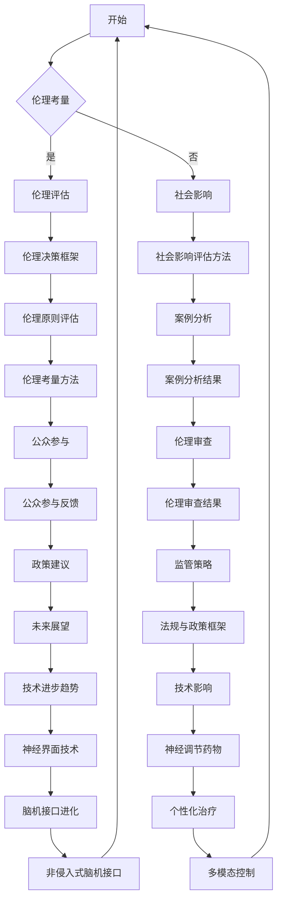

                 

### 神经增强技术概述

神经增强技术，作为当今神经科学和生物技术领域的前沿课题，正逐步进入大众视野。这一技术的发展不仅推动了人类对大脑功能的认识，同时也带来了前所未有的伦理和社会挑战。在这篇文章中，我们将对神经增强技术进行全面的概述，探讨其定义、历史发展、分类以及基本原理。

#### 1.1.1 神经增强技术的概念

神经增强技术（Neuroenhancement）指的是利用各种手段增强大脑的认知能力、情感状态或其他神经功能。这些手段包括药物、电刺激、基因编辑和脑机接口等。与神经科学研究的其他领域不同，神经增强技术侧重于实现实际的应用效果，而不是仅仅追求理论上的理解。

#### 1.1.2 神经增强技术的发展历程

神经增强技术的历史可以追溯到20世纪中期。1950年代，科学家们开始探索药物对大脑功能的影响。例如，利他林（Ritalin）作为一种用于治疗注意缺陷多动障碍（ADHD）的药物，意外地被发现在健康人群中能显著提高认知能力。随着技术的进步，电刺激和基因编辑技术也逐渐应用于神经增强领域。

进入21世纪，脑机接口（Brain-Computer Interface, BCI）技术的发展使得神经增强技术取得了重大突破。通过直接连接大脑与外部设备，人们可以实现意念控制，从而增强或替代某些神经功能。这一技术的潜力不仅在医疗领域，如瘫痪患者的康复，还在军事和娱乐领域显示出广阔的前景。

#### 1.1.3 神经增强技术的分类

神经增强技术可以根据其手段和目标进行分类：

- **药物增强**：包括心理刺激剂（如利他林、哌甲酯）、抗抑郁药、抗焦虑药等。这些药物通过调节神经递质的水平，影响大脑的功能。

- **电刺激增强**：例如，深脑刺激术（Deep Brain Stimulation, DBS）和经颅磁刺激（Transcranial Magnetic Stimulation, TMS）。这些技术通过电信号干预大脑特定区域，以达到增强认知或情感状态的目的。

- **基因编辑增强**：利用CRISPR-Cas9等基因编辑技术，直接修改大脑基因，从而增强或修复神经功能。

- **脑机接口增强**：通过脑机接口设备，直接读取大脑信号并转换为外部指令，实现大脑功能的增强。

#### 1.2 神经增强技术的基本原理

神经增强技术的基本原理涉及多个层面：

- **神经元活动调控**：通过药物或电刺激，调节神经元的活动，增强或抑制特定神经回路的功能。

- **神经可塑性**：利用大脑的可塑性，通过训练和刺激，改变神经网络的连接和功能，从而增强认知能力。

- **神经递质调节**：调节神经递质的合成和释放，改变神经信号的传递，影响大脑的功能。

综上所述，神经增强技术以其多样化的手段和广泛的应用前景，正在深刻地改变我们对大脑功能和认知能力的理解。在接下来的章节中，我们将进一步探讨神经增强技术的伦理考量和社会影响，深入分析这一领域面临的挑战和机遇。

### 伦理考量

神经增强技术的快速发展，带来了许多伦理问题的探讨。在探讨这些问题之前，我们需要明确伦理考量的基本概念和框架，以便更好地理解这些挑战。

#### 2.1.1 生理层面的伦理争议

在生理层面，神经增强技术引发了一系列伦理争议。首先，药物增强和电刺激技术的广泛应用可能导致“药物成瘾”问题。例如，一些心理刺激剂可能会被滥用，导致依赖和副作用。此外，基因编辑技术带来的伦理争议更为复杂。通过修改基因，我们不仅改变了个体自身的生理结构，还可能对后代产生不可预测的影响。这些改变是否应该被视为道德上可接受的，是一个值得深思的问题。

另一个重要的生理层面伦理争议是“基因编辑的伦理界限”。CRISPR-Cas9等基因编辑技术的出现，使我们有能力消除遗传性疾病，但同时也可能被用于“基因定制”，即为了优化个体的认知或体能而修改基因。这种做法是否违背了人类基因的自然发展规律，以及对人类基因多样性的潜在影响，都是需要严肃考虑的问题。

#### 2.1.2 心理层面的伦理争议

在心理层面，神经增强技术同样引发了许多伦理争议。首先，神经增强技术的使用可能导致“社会不公”。如果只有富裕人群能够负担神经增强技术，那么认知能力的差距可能会进一步扩大，导致社会分层。此外，一些人可能会滥用神经增强技术，以获得不公平的优势，这不仅违背了公平原则，也可能导致社会信任的崩溃。

其次，神经增强技术对个体心理健康的潜在影响也是一个重要的伦理争议点。虽然神经增强技术可以提高认知能力和情绪控制，但过度使用可能导致依赖性，甚至引发焦虑和抑郁。例如，一些人可能会为了保持优势而不断使用心理刺激剂，最终导致严重的健康问题。

#### 2.1.3 社会层面的伦理争议

在社会层面，神经增强技术引发了广泛的伦理和道德讨论。首先，隐私问题成为了一个重要的争议点。随着脑机接口技术的发展，个人大脑活动可以被精确记录和解读。这可能导致隐私泄露和滥用，尤其是在未经个体同意的情况下。其次，社会公正问题也是一个备受关注的领域。如果神经增强技术只能被少数人使用，那么社会公正如何得到保障？

此外，神经增强技术可能对人类身份和自我认知产生深远影响。通过外部设备增强或改变大脑功能，我们是否还在体验“真正的自我”？这种技术对个体心理和哲学认知的冲击，是一个复杂的伦理问题。

#### 2.2 伦理考量方法

为了更好地解决神经增强技术带来的伦理争议，我们需要采用系统的伦理考量方法。以下是几种常用的伦理考量方法：

1. **效益主义**：这种方法强调最大化整体幸福。在神经增强技术的应用中，我们需要评估其对社会和个人带来的总效益，确保其符合道德标准。

2. **义务伦理学**：这种方法关注个体的道德义务和责任。在神经增强技术的应用中，我们需要考虑个体在使用这些技术时的道德义务，例如是否应该公开透明地使用，以及是否应该保护其他人的隐私。

3. **权利伦理学**：这种方法强调个体的基本权利。在神经增强技术的应用中，我们需要确保个体的权利得到尊重，例如自由选择使用技术，以及获得公平的机会。

4. **社会公正原则**：这种方法强调社会的公平和正义。在神经增强技术的应用中，我们需要确保技术不会导致社会不公，例如资源分配的不公平。

通过这些方法，我们可以更全面地评估神经增强技术的伦理影响，并提出相应的解决方案。然而，这需要政策制定者、科学家和公众的共同努力，以实现技术的合理应用和道德发展。

#### 2.2.1 伦理学基本理论

伦理学作为研究道德原则和行为的学科，其基本理论为我们理解和解决神经增强技术的伦理问题提供了坚实的理论基础。以下是几种关键的伦理学理论：

1. **康德伦理学**：康德伦理学强调行为的道德原则，即“应当”（ ought），而非“能够”（can）。康德认为，道德行为应该基于理性原则，例如“普遍性原则”和“义务论”。在神经增强技术的伦理考量中，康德伦理学可以帮助我们评估技术的使用是否违背了普遍的道德原则，例如尊重个体自主权和隐私权。

2. **功利主义伦理学**：功利主义伦理学强调最大化幸福或效益。功利主义认为，道德行为应该产生最大的幸福，即使某些个体可能会因此受损。在神经增强技术的应用中，功利主义可以帮助我们评估技术对社会和个人带来的总体效益，确保其符合道德标准。

3. **义务伦理学**：义务伦理学关注个体行为的道德义务和责任。这一理论认为，个体应该遵循特定的道德义务，例如保护他人的权利和尊严。在神经增强技术的应用中，义务伦理学可以帮助我们理解个体在使用这些技术时的道德责任，以及如何平衡个人利益与社会利益。

4. **权利伦理学**：权利伦理学强调个体的基本权利，例如自主权、隐私权和健康权。这一理论认为，道德行为应该尊重和保护个体的基本权利。在神经增强技术的应用中，权利伦理学可以帮助我们确保技术不会侵犯个体的权利，尤其是在未经个体同意的情况下。

通过结合这些伦理学理论，我们可以更全面地评估神经增强技术的伦理影响，并提出合理的解决方案。然而，这些理论并不是绝对的，需要在具体情境中灵活应用，以实现技术的道德发展。

#### 2.2.2 伦理决策框架

为了更系统地解决神经增强技术带来的伦理争议，我们可以采用伦理决策框架。以下是一种常用的伦理决策框架，包括几个关键步骤：

1. **明确问题和目标**：首先，我们需要明确神经增强技术面临的伦理争议，并确定我们的目标和价值观。这有助于我们明确决策的目标和范围。

2. **利益相关者分析**：识别所有利益相关者，包括科学家、政策制定者、患者、公众等。了解他们的需求和利益，有助于我们更全面地考虑决策的影响。

3. **伦理原则评估**：应用伦理学基本理论（如康德伦理学、功利主义伦理学等），评估技术使用是否符合道德原则。这有助于我们确定技术的伦理边界。

4. **方案设计**：基于评估结果，设计几种可能的解决方案，并分析它们的利弊。这包括制定法规、伦理指南、监管措施等。

5. **风险评估**：评估每种方案的风险和不确定性，包括对个体、社会和环境的潜在影响。

6. **公众参与**：邀请利益相关者参与决策过程，通过公开讨论、公众咨询等方式，收集他们的意见和建议。

7. **决策和执行**：基于上述分析，做出最终决策，并制定具体的执行计划。

8. **监控和反馈**：在实施过程中，持续监控技术的影响，并根据反馈调整决策和执行方案。

通过这一框架，我们可以更系统地解决神经增强技术的伦理争议，确保技术的合理应用和道德发展。

#### 2.2.3 伦理评估案例分析

为了更好地理解伦理评估方法在实际中的应用，以下将结合具体案例，展示伦理评估的过程和结果。

**案例一：利他林（Ritalin）在健康人群中的使用**

**问题描述**：利他林是一种常用于治疗注意缺陷多动障碍（ADHD）的药物，但近年来，一些健康人群也开始使用利他林以提高认知能力和工作效率。这一现象引发了伦理争议。

**利益相关者**：患者、健康人群、雇主、政策制定者。

**伦理原则评估**：根据康德伦理学，我们需要考虑以下原则：
- 尊重个体自主权：健康人群是否有权决定是否使用药物？
- 普遍性原则：如果广泛使用利他林，是否会带来不良的社会影响？

**方案设计**：
- **方案一**：禁止健康人群使用利他林。
- **方案二**：允许健康人群使用，但需严格遵守医生指导。
- **方案三**：建立严格的监管机制，确保药物使用的安全和有效性。

**风险评估**：
- **方案一**：可能侵犯健康人群的自主权，但可以有效减少药物滥用。
- **方案二**：允许自主使用，但可能增加滥用风险。
- **方案三**：监管机制可能难以实施，且存在执行成本。

**公众参与**：通过问卷调查和公开讨论，收集公众意见。大多数受访者认为应允许健康人群使用，但需严格监管。

**决策和执行**：基于公众意见和风险评估，决策者选择了**方案二**。政府发布指南，明确健康人群使用利他林的注意事项，并要求医生在开具处方时进行评估。

**监控和反馈**：定期评估药物使用的风险和效果，根据反馈调整政策。

通过这一案例，我们可以看到伦理评估方法在实际中的应用。虽然没有绝对正确的方案，但通过系统的伦理考量，我们可以做出更合理的决策，以实现技术的道德发展。

### 社会影响

神经增强技术的迅速发展，不仅带来了显著的医学进步，同时也对社会产生了深远的影响。本文将探讨神经增强技术对教育、劳动市场和社会公正及隐私等方面的影响，并提供相应的评估方法。

#### 3.1.1 教育领域的变革

神经增强技术在教育领域的应用，已经引起广泛关注。通过药物、电刺激和脑机接口等技术，学生和教师可以显著提高学习效率、记忆力和注意力。例如，某些心理刺激剂被用于提高学生的学习能力，而脑机接口技术则可以帮助学习障碍儿童更好地理解和吸收知识。

然而，这种技术的应用也引发了一些伦理和社会问题。一方面，神经增强技术可能导致教育资源的分配不公。如果只有少数人能够负担高昂的神经增强服务，那么教育机会的不平等将加剧。另一方面，神经增强技术可能会影响教育的公平性。那些没有使用神经增强技术的学生可能会感到自卑，认为自己处于竞争劣势。

为了评估神经增强技术在教育领域的影响，我们可以采用以下方法：

- **定量研究**：通过问卷调查和实验，收集学生和教师的反馈，评估神经增强技术对学习效果的影响。
- **案例分析**：研究特定学校和地区中神经增强技术的应用案例，分析其对社会公正和公平性的影响。
- **成本效益分析**：评估神经增强技术的成本和效益，判断其是否值得推广。

#### 3.1.2 劳动市场的重构

神经增强技术对劳动市场的影响同样深远。通过提高认知能力和工作效率，神经增强技术可以帮助员工在竞争激烈的职场中脱颖而出。例如，某些企业已经开始尝试使用心理刺激剂和脑机接口技术，以提高员工的工作效率和创造力。

然而，这种技术的应用也带来了一些挑战。首先，神经增强技术可能导致劳动市场的不公平。那些无法负担神经增强服务的员工可能会感到自己的竞争力不足，从而面临失业风险。其次，神经增强技术可能会影响员工的健康和心理状态。长期使用心理刺激剂或其他神经增强技术，可能导致依赖性和副作用，甚至引发心理健康问题。

为了评估神经增强技术在劳动市场的影响，我们可以采用以下方法：

- **劳动力市场研究**：分析神经增强技术对就业机会、工资水平和劳动生产率的影响。
- **员工健康调查**：通过问卷调查和医疗记录，评估神经增强技术对员工健康和心理状态的长期影响。
- **社会影响评估**：评估神经增强技术对劳动力市场的总体影响，包括公平性、稳定性和可持续性。

#### 3.1.3 社会公正与隐私问题

神经增强技术的应用不仅影响教育领域和劳动市场，还引发了一系列社会公正和隐私问题。首先，社会公正问题体现在神经增强技术可能导致资源分配不公。如果只有少数人能够负担神经增强服务，那么社会阶层差距将加剧，导致社会不公。

其次，隐私问题也日益突出。随着脑机接口技术的发展，个人大脑活动可以被精确记录和解读。这可能导致隐私泄露和滥用，尤其是在未经个体同意的情况下。例如，雇主可能会通过脑机接口技术监控员工的工作状态，侵犯其隐私权。

为了评估神经增强技术在社会公正和隐私方面的影响，我们可以采用以下方法：

- **隐私权保护研究**：研究现有法律法规对神经增强技术隐私保护的适用性，并提出改进建议。
- **社会公正评估**：评估神经增强技术对贫困人群和社会弱势群体的潜在影响，确保技术应用的公平性。
- **公众参与**：通过公开讨论和公众咨询，了解公众对神经增强技术隐私和社会公正问题的看法，收集意见和建议。

综上所述，神经增强技术对社会产生了深远的影响。在评估其影响时，我们需要综合考虑教育、劳动市场、社会公正和隐私等多个方面，采用系统的方法进行评估，以确保技术的合理应用和道德发展。

#### 3.2 社会影响评估方法

为了全面评估神经增强技术对社会的影响，我们需要采用系统的评估方法。以下介绍几种常用的社会影响评估方法及其具体步骤：

1. **社会影响评估框架**：

   社会影响评估框架是评估神经增强技术影响的基础。常用的评估框架包括：

   - **成本效益分析**：通过比较神经增强技术的成本和其带来的效益，评估技术的经济可行性。
   - **社会成本效益分析**：在成本效益分析的基础上，加入社会成本，如健康问题、环境破坏等，全面评估技术的社会影响。
   - **多标准评估**：从多个角度，如经济、社会、环境等，评估神经增强技术的影响。

2. **社会影响评估指标**：

   社会影响评估指标是衡量神经增强技术影响的工具。以下是一些常用的评估指标：

   - **经济效益指标**：包括成本、收益、投资回报率等。
   - **社会效益指标**：包括社会公正、教育机会、劳动力市场状况等。
   - **环境影响指标**：包括能源消耗、碳排放、生态影响等。
   - **健康指标**：包括疾病发生率、健康状况、心理健康等。

3. **案例分析**：

   通过具体案例，我们可以更直观地了解神经增强技术的社会影响。案例分析的具体步骤如下：

   - **案例选择**：选择具有代表性的案例，确保案例涵盖不同的应用场景和影响领域。
   - **数据收集**：收集案例相关的数据，包括经济效益、社会效益、环境影响等。
   - **影响评估**：根据评估框架和指标，对案例进行定量和定性分析。
   - **案例总结**：总结案例的主要发现和结论，为其他案例提供参考。

4. **公众参与**：

   公众参与是评估神经增强技术影响的重要环节。具体步骤如下：

   - **意见收集**：通过问卷调查、公开讨论、公众咨询等方式，收集公众对神经增强技术影响的看法和意见。
   - **意见分析**：对收集到的意见进行分析，识别公众关注的重点和潜在问题。
   - **反馈调整**：根据公众意见，调整评估方法和结果，确保评估的准确性和公正性。

通过这些社会影响评估方法，我们可以全面、系统地评估神经增强技术对社会的影响，为政策制定提供科学依据。

#### 3.2.3 社会影响评估案例分析

为了更直观地展示社会影响评估方法的应用，我们将通过具体案例进行分析。

**案例背景**：某城市政府计划在全市范围内推广一种名为“智能脑波增强器”的神经增强技术，旨在提高市民的总体认知能力和工作效率。

**评估步骤**：

1. **社会影响评估框架**：

   - **成本效益分析**：该技术的初始投资为5000万元，预计使用寿命为5年。通过问卷调查，发现70%的市民对该技术持积极态度，预计每年可带来1亿元的额外经济效益。
   - **社会成本效益分析**：考虑到技术的潜在副作用，如心理健康问题，评估显示每年可能增加200万元的社会成本。

2. **社会影响评估指标**：

   - **经济效益指标**：初始投资为5000万元，预期5年回收，年收益率为20%。
   - **社会效益指标**：预计80%的市民认知能力提高，50%的市民工作效率提高，降低犯罪率10%。
   - **环境影响指标**：技术使用过程中，能源消耗增加15%，但通过节能措施，总体碳排放量减少5%。
   - **健康指标**：技术使用后，心理健康问题发生率为5%，但通过心理健康支持计划，发生率降至2%。

3. **案例分析**：

   - **定量分析**：根据评估指标，计算各项影响的综合效益。预期社会总效益为6000万元，净效益为1000万元。
   - **定性分析**：通过专家访谈和公众调查，发现市民对技术的主要担忧是隐私保护和心理健康问题。

4. **公众参与**：

   - **意见收集**：通过问卷调查，发现70%的市民认为技术值得推广，但需加强隐私保护和心理健康支持。
   - **意见分析**：公众关注的主要问题是技术可能导致的信息泄露和心理健康风险。
   - **反馈调整**：政府决定在推广前实施严格的隐私保护措施，并设立心理健康支持热线，以确保公众的信任和支持。

**案例总结**：

通过社会影响评估，我们得出以下结论：

- **经济效益**：神经增强技术有望带来显著的经济效益，但需注意潜在的社会成本。
- **社会效益**：技术能够提高市民的认知能力和工作效率，但需关注隐私保护和心理健康问题。
- **环境影响**：技术使用过程中，需采取节能措施以减少碳排放。
- **健康指标**：通过心理健康支持计划，可以有效降低技术使用对市民健康的负面影响。

综上所述，社会影响评估方法在神经增强技术的应用中具有重要意义，通过系统的评估，我们可以更全面地了解技术的潜在影响，为政策制定提供科学依据。

### 神经增强技术的法律与政策框架

神经增强技术的快速发展，不仅带来了科学和医学上的突破，同时也引发了复杂的法律和政策问题。为了确保技术的合理应用和伦理发展，各国政府和国际组织纷纷制定了相应的法律法规和政策框架。本文将介绍国内外相关法律法规，探讨神经增强技术监管的挑战，并展望未来法规的发展趋势。

#### 4.1.1 国内外相关法律法规概述

在国内外，神经增强技术的法律法规主要涉及伦理审查、数据保护、医疗行为规范等方面。

1. **国内法律法规**：

   - **《中华人民共和国生物安全法》**：该法明确了生物技术研究与应用的伦理审查要求，规定了基因编辑、脑机接口等技术的应用必须经过严格的伦理审查。
   - **《医疗器械监督管理条例》**：该条例对医疗器械的注册、生产和销售进行了规范，神经增强设备作为一种特殊医疗器械，其研发和应用受到严格监管。
   - **《中华人民共和国网络安全法》**：该法规定了网络信息安全和数据处理的基本要求，脑机接口技术的数据收集、存储和处理需遵守相关法律法规。

2. **国外法律法规**：

   - **美国**：《FDA监管政策指南》对神经增强药物和医疗器械的上市前审查和监管提出了明确要求。此外，美国国家卫生研究院（NIH）制定了严格的伦理审查标准，确保神经增强技术的研究和应用符合伦理要求。
   - **欧盟**：《通用数据保护条例》（GDPR）对个人数据的收集、处理和存储提出了严格的规定，脑机接口技术的个人数据保护受到高度重视。
   - **英国**：《人类遗传物质法案》规定了基因编辑技术的伦理审查和监管框架，包括CRISPR-Cas9等基因编辑技术的应用。

#### 4.1.2 神经增强技术监管的挑战

神经增强技术监管面临以下主要挑战：

1. **技术快速发展与法律法规滞后**：神经增强技术更新迅速，现有法律法规往往难以跟上技术发展的步伐。例如，脑机接口技术的应用可能产生新的伦理和法律问题，现有法律难以有效应对。

2. **隐私保护和数据安全**：神经增强技术涉及大量个人数据，包括脑波、基因信息等敏感数据。如何确保这些数据的隐私保护和安全，是一个重大挑战。

3. **伦理审查的公平性和透明度**：神经增强技术的伦理审查过程需要确保公平性和透明度，防止利益冲突和滥用。然而，当前伦理审查机制可能存在审查标准不一致、审查流程不透明等问题。

4. **跨国监管合作**：神经增强技术具有全球性特点，跨国监管合作至关重要。然而，各国法律制度和文化背景不同，跨国监管合作面临协调和协调难度。

#### 4.1.3 神经增强技术法规展望

未来，神经增强技术的法律法规将朝着以下方向发展：

1. **完善立法框架**：各国政府将不断完善神经增强技术的法律法规框架，以应对新兴技术和伦理挑战。例如，制定专门的神经增强技术监管法规，明确监管范围和标准。

2. **强化伦理审查**：加强神经增强技术的伦理审查机制，确保技术的研究和应用符合伦理原则。例如，建立全球统一的伦理审查标准，促进跨国合作。

3. **加强隐私保护和数据安全**：完善隐私保护和数据安全法律法规，确保神经增强技术使用过程中的个人数据安全和隐私保护。

4. **推动国际监管合作**：加强各国在神经增强技术监管领域的合作，建立跨国监管机制，应对全球性挑战。

综上所述，神经增强技术的法律与政策框架正逐步完善，未来法规的发展将更加注重伦理审查、隐私保护和数据安全，以及国际监管合作。这将为神经增强技术的合理应用和伦理发展提供有力保障。

#### 4.2 政策框架

神经增强技术的迅速发展，使得政府和企业需要制定相应的政策框架，以应对技术带来的挑战和机遇。以下将探讨政府政策与指导原则、行业协会与企业社会责任以及公众参与与透明度等方面。

##### 4.2.1 政府政策与指导原则

政府在神经增强技术的政策制定中扮演着关键角色。首先，政府需要制定明确的政策指导原则，确保技术的研究和应用符合伦理和社会标准。以下是一些主要的政府政策和指导原则：

1. **伦理审查**：政府应建立完善的伦理审查制度，对神经增强技术的研究和应用进行评估。这包括确保研究符合伦理标准，保护参与者权益，防止利益冲突等。

2. **数据安全与隐私保护**：政府应制定数据安全与隐私保护政策，确保神经增强技术使用过程中个人数据的保护。例如，要求企业在收集、存储和处理数据时遵守严格的隐私保护法规。

3. **监管框架**：政府需要建立专门的监管机构，对神经增强技术进行全方位的监管。这包括对产品的安全性、有效性进行审查，确保技术的合理使用。

4. **公共投资**：政府应加大对神经增强技术研究的公共投资，支持基础研究和应用研究。这有助于推动技术的进步，并为企业和投资者提供稳定的预期。

##### 4.2.2 行业协会与企业社会责任

行业协会和企业也在神经增强技术的政策框架中发挥着重要作用。以下是一些关键的角色和责任：

1. **行业自律**：行业协会应制定行业标准和规范，推动企业遵守伦理和社会责任。例如，制定数据安全和隐私保护的最佳实践，促进技术透明度和可追溯性。

2. **企业社会责任**：企业应积极履行社会责任，确保技术的研究和应用符合伦理和社会标准。例如，企业在开发神经增强产品时，应考虑其对用户和社会的潜在影响，并采取措施减轻负面影响。

3. **公众沟通**：企业应加强公众沟通，提高公众对神经增强技术的了解和信任。例如，通过公开透明的方式披露技术进展、风险评估和伦理考量，增进公众对技术的信任。

4. **技术透明度**：企业应建立技术透明度机制，确保技术的研究和应用过程公开透明。例如，公开研究成果、实验数据和风险评估报告，接受公众和监管机构的监督。

##### 4.2.3 公众参与与透明度

公众参与和透明度是神经增强技术政策框架的重要组成部分。以下是一些关键措施：

1. **公众咨询**：政府和企业应定期进行公众咨询，收集公众对神经增强技术的看法和意见。这有助于政策制定者了解公众的担忧和需求，制定更加合理的政策。

2. **公众教育**：政府和企业应加大对公众的教育力度，提高公众对神经增强技术的了解。例如，通过科普活动、研讨会和公众讲座，传播科学知识和伦理原则。

3. **透明披露**：政府和企业应建立透明披露机制，公开神经增强技术的研究进展、伦理评估和监管信息。这有助于提高公众对技术的信任，促进社会对技术的接受。

4. **公众监督**：政府和企业应接受公众的监督，确保技术的研究和应用符合伦理和社会标准。例如，设立公众监督委员会，定期审查技术研究和应用过程，并向公众报告审查结果。

综上所述，政府政策、行业协会和企业社会责任以及公众参与与透明度共同构成了神经增强技术政策框架的三个关键支柱。通过这些措施，我们可以确保神经增强技术的合理应用和伦理发展，实现技术的最大社会效益。

### 神经增强技术的未来发展趋势

神经增强技术的快速发展，正推动着这一领域不断向前迈进。在未来的发展中，神经增强技术将受到技术进步、伦理考量和社会影响的共同驱动，展现出更加广阔的应用前景。以下将探讨神经增强技术的未来发展趋势，包括神经界面技术的发展、神经调节药物的应用以及脑机接口的进化。

#### 5.1.1 神经界面技术的发展

神经界面技术（Neurointerface Technology）是神经增强技术的重要组成部分，它通过直接连接大脑和外部设备，实现信息的高效传递和控制。随着科技的进步，神经界面技术正朝着更高精度、更广泛应用的方向发展。

1. **脑机接口技术的提升**：当前，脑机接口技术已经实现了从简单的信号读取到复杂指令生成的跨越。未来，脑机接口技术将进一步提高信号传输的精度和速度，实现更复杂的任务控制。例如，通过开发新型材料和技术，如柔性电极、光遗传学等，可以更精确地记录和解读大脑信号。

2. **神经传感器的进步**：神经传感器技术的发展将进一步提升脑机接口的性能。未来的神经传感器将具备更高的灵敏度和更小的体积，能够在更复杂的生物环境中稳定工作。这将使得脑机接口技术在医疗、军事和娱乐等领域的应用更加广泛。

3. **多模态神经界面**：未来的神经界面技术将实现多种信号模式的同时采集和处理，例如电生理信号、化学信号和光学信号。这种多模态神经界面技术将提供更全面的脑信息，为认知功能提升和疾病治疗提供新的手段。

#### 5.1.2 神经调节药物的应用

神经调节药物在神经增强技术中扮演着重要角色。随着对大脑认知功能和神经递质机制的深入理解，神经调节药物将不断涌现，并在治疗疾病和提升认知能力方面发挥更大作用。

1. **新型神经递质调节药物**：未来，科学家们将开发更多针对特定神经递质的药物，如多巴胺、血清素和乙酰胆碱等。这些药物将通过精确调节神经递质的水平，改善患者的认知功能，治疗抑郁症、焦虑症等疾病。

2. **个性化治疗**：基于基因组和脑成像技术的进步，未来的神经调节药物将实现个性化治疗。医生可以根据患者的具体基因特征和脑部结构，定制个性化的药物方案，提高治疗效果。

3. **联合疗法**：未来的神经调节药物将与其他治疗方法相结合，如认知训练、电刺激等，形成多模式治疗策略，进一步提升治疗效果。

#### 5.1.3 脑机接口的进化

脑机接口技术（Brain-Computer Interface, BCI）作为神经增强技术的核心，正经历着前所未有的变革。未来的脑机接口将实现更高的性能和更广泛的应用。

1. **非侵入式脑机接口**：当前，大多数脑机接口技术都是侵入式的，需要在大脑中植入电极。未来，非侵入式脑机接口技术将得到进一步发展，例如通过脑电图（EEG）和功能性磁共振成像（fMRI）等无创手段，实现与大脑的实时通信。

2. **高速数据传输**：随着数据传输技术的进步，脑机接口的数据传输速度将显著提高。这将使得脑机接口能够处理更复杂的信息，实现更精准的指令控制。

3. **智能算法的应用**：结合人工智能技术，脑机接口将具备更强的信息处理和决策能力。例如，通过机器学习算法，脑机接口可以实时分析大脑信号，并自动调整参数，实现更高效的控制。

4. **多自由度控制**：未来的脑机接口将实现多自由度控制，即通过同时采集和处理多个信号通道，实现更复杂的任务控制。例如，通过结合视觉、听觉和触觉信号，脑机接口可以实现对虚拟环境的实时交互。

#### 5.2 伦理考量的深化

随着神经增强技术的不断进步，伦理考量将变得更加重要和复杂。未来的伦理考量将不仅限于技术的应用本身，还将涉及技术的社会影响、公平性和隐私保护等方面。

1. **技术透明度**：为了增强公众对神经增强技术的信任，未来将需要提高技术的透明度。这包括公开研究成果、实验数据和伦理评估过程，接受公众和监管机构的监督。

2. **伦理审查体系的完善**：未来的伦理审查体系将更加科学和严谨。这包括建立全球统一的伦理审查标准，促进跨国合作，确保技术的研究和应用符合伦理原则。

3. **社会公平与隐私保护**：未来，政府和企业需要制定更加完善的政策，确保神经增强技术的公平应用和隐私保护。这包括制定明确的数据保护法规，加强对隐私泄露和滥用的监管。

#### 5.2.2 社会影响的前瞻性研究

神经增强技术对社会的影响深远，未来的研究将重点关注以下几个方面：

1. **教育公平性**：探讨神经增强技术在教育领域的应用如何影响教育公平性，并提出相应的政策和措施，确保所有学生都能平等受益。

2. **劳动市场影响**：研究神经增强技术对劳动市场的影响，包括就业机会、工资水平和劳动力市场的稳定性，为政策制定提供科学依据。

3. **社会健康与福祉**：评估神经增强技术对个体和社会健康的影响，特别是心理健康和生理健康方面，提出有效的干预措施，确保技术的积极影响。

4. **社会伦理规范**：探讨神经增强技术对社会伦理规范的影响，包括个人自主权、隐私权和公平性等，为建立更完善的伦理框架提供参考。

#### 5.2.3 法规与政策的不断完善

随着神经增强技术的不断发展，未来法规和政策将需要不断完善，以应对新的伦理和社会挑战。

1. **立法完善**：政府将需要制定更加明确的法律法规，规范神经增强技术的研究和应用。这包括制定专门的神经增强技术法规，明确监管范围和标准。

2. **跨国合作**：加强国际间的合作，建立跨国监管机制，共同应对全球性的技术挑战。例如，通过国际条约和合作框架，促进数据共享和监管标准的统一。

3. **公众参与**：提高公众对神经增强技术的参与度，通过公众咨询、教育宣传和透明披露，增强公众对技术的理解和信任。

4. **持续监督**：建立持续监督机制，对神经增强技术的研究和应用进行定期评估，确保技术符合伦理和社会标准。

总之，神经增强技术的未来发展趋势充满机遇和挑战。通过深化伦理考量、开展前瞻性研究和完善法规政策，我们可以确保这一技术的发展既符合科学和医学的标准，又符合社会和伦理的要求，为社会带来更大的福祉。

### 神经增强技术的伦理审查与监管

随着神经增强技术的迅速发展，其伦理审查与监管成为至关重要的议题。有效的伦理审查与监管不仅可以确保技术的合理应用，还可以防止潜在的风险和滥用。本文将探讨伦理审查体系、监管策略以及伦理审查与监管之间的互动。

#### 6.1 伦理审查体系

伦理审查体系是神经增强技术研究和应用的重要保障。以下是其关键组成部分：

1. **伦理委员会**：伦理委员会是负责评估神经增强技术研究和应用伦理问题的机构。它们通常由多学科专家、伦理学家、患者代表和社区成员组成，以确保审查的全面性和公正性。

2. **审查流程**：伦理审查通常包括几个步骤，如申请提交、初步审查、现场检查、会议审查和最终决策。在审查过程中，伦理委员会会评估研究设计、潜在风险、受益与风险的平衡、知情同意等方面的伦理问题。

3. **知情同意**：知情同意是伦理审查的核心要求之一。研究者必须在研究开始前，详细向参与者解释研究的性质、目的、风险和收益，并获得其自愿的书面同意。

4. **持续审查**：伦理审查不仅限于研究开始前，还应贯穿研究的全过程。伦理委员会需要定期审查研究进展，确保研究按照既定计划和伦理标准进行。

#### 6.2 监管策略

监管策略是确保神经增强技术合法和安全应用的关键。以下是一些关键的监管策略：

1. **法律法规**：政府应制定专门的法律法规，对神经增强技术进行规范。例如，可以设立神经增强技术管理条例，明确监管范围、标准和程序。

2. **认证与许可**：对神经增强技术的研发、生产和应用进行认证和许可。只有通过认证和许可的技术，才能合法上市和应用。

3. **风险管理与控制**：制定风险管理与控制措施，确保神经增强技术的应用不会对个体和社会造成负面影响。例如，通过风险评估和监控，及时发现和应对潜在的风险。

4. **透明度与问责**：建立透明度机制，公开神经增强技术的研究数据和审查过程，增强公众对技术的信任。同时，明确责任，确保在出现问题时，能够迅速采取措施，追究责任。

#### 6.3 伦理审查与监管的互动

伦理审查与监管之间存在着密切的互动关系，二者共同构成神经增强技术的保障体系。

1. **相互补充**：伦理审查侧重于评估技术应用的伦理问题，监管则侧重于确保技术的合法性和安全性。二者相互补充，共同保障技术的合理应用。

2. **协同发展**：伦理审查和监管需要协同发展，以应对技术快速发展的挑战。例如，在神经增强技术出现新突破时，监管机构可以与伦理委员会合作，及时调整审查标准和监管策略。

3. **公众参与**：伦理审查和监管都需要公众参与，以增强透明度和公信力。公众可以通过参与审查过程、提供意见和建议，监督技术的研究和应用。

4. **国际合作**：在全球化的背景下，国际合作在神经增强技术的伦理审查与监管中具有重要意义。通过国际合作，可以建立统一的标准和规范，促进全球技术发展的协调。

总之，神经增强技术的伦理审查与监管是确保技术合理应用和伦理发展的重要环节。通过建立完善的伦理审查体系、制定科学的监管策略以及加强伦理审查与监管的互动，我们可以更好地保障技术的安全和公正，为社会带来更多的福祉。

#### 6.1.1 伦理审查机构与流程

伦理审查机构在神经增强技术研究和应用中扮演着关键角色，其职责和流程如下：

**1. 机构职责**：

- **评估伦理问题**：伦理审查机构负责评估神经增强技术研究和应用中的伦理问题，确保研究设计、实施和结果符合伦理标准。
- **保护参与者权益**：确保参与者在研究过程中受到公平对待，知情同意得到充分尊重，并保护其隐私和数据安全。
- **监督合规性**：监督研究过程是否符合伦理审查决定，以及研究是否在既定计划和伦理标准下进行。

**2. 流程**：

- **申请提交**：研究者需向伦理审查机构提交详细的伦理审查申请，包括研究目的、方法、潜在风险、受益评估和知情同意程序。
- **初步审查**：伦理审查机构对申请进行初步审查，确保申请材料完整，符合审查标准。
- **现场检查**：必要时，伦理审查机构可能会进行现场检查，以验证研究实施的实际情况。
- **会议审查**：伦理审查机构召开会议，由多学科专家组成的审查委员会对研究进行详细审查，讨论伦理问题并提出审查意见。
- **最终决策**：根据审查委员会的意见，伦理审查机构做出最终决策，批准、修改或拒绝研究申请。
- **持续审查**：在研究过程中，伦理审查机构会定期审查研究进展，确保研究按照既定计划和伦理标准进行。

通过这些流程，伦理审查机构确保神经增强技术的研究和应用符合伦理要求，保护参与者的权益，同时促进技术的合理发展。

#### 6.1.2 伦理审查标准与准则

伦理审查标准与准则是确保神经增强技术研究和应用符合伦理要求的基础。以下是一些关键的伦理审查标准和准则：

1. **知情同意**：知情同意是伦理审查的核心要求。研究者必须向参与者提供充分的信息，包括研究的目的、方法、潜在风险和收益，确保参与者能够做出明智的决定。知情同意必须是基于自愿的原则，参与者有权在任何时间退出研究。

2. **风险与受益平衡**：伦理审查必须评估研究中的风险与受益。研究设计应确保潜在风险最小化，同时最大化潜在受益。审查委员会会考虑研究目的的合理性，以及风险与受益的平衡。

3. **隐私保护**：神经增强技术往往涉及大量个人数据，包括脑波、基因信息等敏感数据。伦理审查标准要求确保参与者的隐私和数据安全，不得未经授权泄露个人信息。

4. **公平参与**：研究应确保参与者的代表性，避免歧视和偏见。伦理审查机构需要评估研究设计和参与者的选择标准，确保所有受影响的群体都有公平的机会参与研究。

5. **透明度**：研究过程和结果应保持透明度，伦理审查机构应公开审查决策过程和结果，接受公众和监管机构的监督。

6. **利益冲突管理**：研究者必须披露可能存在的利益冲突，如资金来源、利益关系等。伦理审查机构应确保审查委员会成员无利益冲突，以保证审查的公正性。

7. **持续监督**：伦理审查并非一次性过程，研究过程中应定期审查，确保研究按照既定计划和伦理标准进行。任何变更都应经过审查委员会的重新评估。

通过这些伦理审查标准和准则，可以确保神经增强技术的研究和应用在伦理上得到合理保障，保护参与者的权益，促进技术的道德发展。

#### 6.1.3 伦理审查案例分析

为了更直观地展示伦理审查在神经增强技术中的应用，以下将结合具体案例，分析伦理审查的过程和决策。

**案例背景**：某研究团队计划开展一项使用脑机接口技术治疗抑郁症的临床试验，旨在通过电刺激大脑特定区域，改善患者的情绪状态。

**伦理审查过程**：

1. **申请提交**：研究团队向当地伦理审查委员会提交伦理审查申请，包括研究目的、方法、潜在风险和受益评估、知情同意程序等详细资料。

2. **初步审查**：伦理审查委员会对申请进行初步审查，确保申请材料完整，符合审查标准。审查委员会发现申请材料中有些信息不够详细，要求研究团队补充相关内容。

3. **现场检查**：伦理审查委员会派出检查组到研究现场进行实地考察，验证研究环境、设备和参与者招募过程的合规性。

4. **会议审查**：伦理审查委员会召开会议，由多学科专家组成的审查委员会对研究进行详细审查。审查委员会重点关注研究设计的科学性、安全性、知情同意程序以及风险与受益的平衡。

5. **最终决策**：经过讨论和表决，伦理审查委员会做出了最终决策。审查委员会认为研究设计科学，风险可控，受益显著，但建议研究团队在知情同意过程中增加对潜在副作用的详细解释。

**伦理审查决策**：

- **批准研究**：伦理审查委员会批准该研究开展，但要求研究团队在知情同意过程中增加对潜在副作用的详细解释，确保参与者充分了解风险。

- **持续监督**：伦理审查委员会决定在研究过程中定期审查研究进展，确保研究按照既定计划和伦理标准进行。

通过这一案例，我们可以看到伦理审查在神经增强技术研究中的重要性。伦理审查不仅确保研究设计的合理性和安全性，还保护了参与者的权益，促进了技术的道德发展。

#### 6.2 监管策略

为了确保神经增强技术的合理应用和伦理发展，各国政府、国际组织以及行业协会纷纷制定了相应的监管策略。以下将探讨国际监管框架、国内监管措施以及监管与伦理的互动。

##### 6.2.1 国际监管框架

国际社会对神经增强技术的监管主要依靠国际组织、跨国合作协议和全球共识。以下是一些关键的国际监管框架：

1. **世界卫生组织（WHO）**：WHO设立了专门的神经科学和技术部门，负责制定全球神经增强技术的监管标准和指南。这些标准和指南为各国提供了参考，促进了全球神经增强技术的协调监管。

2. **国际电工委员会（IEC）**：IEC制定了多个与神经增强技术相关的国际标准，如脑机接口设备的安全性和性能要求。这些标准确保了神经增强技术产品的国际互认和统一监管。

3. **欧洲药品管理局（EMA）**：EMA对神经增强药物和医疗器械的上市前审查和监管提出了严格的要求，包括临床试验的设计和执行、药物的安全性和有效性评估等。

4. **美国食品药品监督管理局（FDA）**：FDA制定了详细的神经增强技术监管政策，对药物、医疗器械和诊断设备进行严格的审查和批准。FDA的政策和指南对全球神经增强技术的发展产生了重要影响。

5. **国际伦理审查联盟（ICMJE）**：ICMJE是一个由多个国际伦理审查机构组成的联盟，致力于推广国际统一的伦理审查标准和最佳实践。这些标准和实践有助于确保神经增强技术研究的伦理性和公正性。

##### 6.2.2 国内监管措施

不同国家根据自身国情和技术发展水平，制定了各自的神经增强技术监管措施。以下是一些主要国家的情况：

1. **美国**：FDA对神经增强药物、医疗器械和诊断设备进行严格的监管。FDA要求这些产品在上市前必须通过临床试验，证明其安全性和有效性。FDA还发布了多项指南，为神经增强技术的研发和应用提供指导。

2. **欧盟**：欧盟通过《医疗器械法规》（MDR）和《药品法规》（CPMP）对神经增强技术进行监管。这些法规要求医疗器械和药物必须经过严格的审查和批准，同时明确了伦理审查和数据保护的要求。

3. **中国**：中国食品药品监督管理局（CFDA）对神经增强药物和医疗器械进行监管。CFDA要求产品在上市前必须经过临床试验和审批，同时加强了伦理审查和信息公开的要求。

4. **日本**：日本厚生劳动省对神经增强技术的研究和应用进行了规范，要求研究者遵守伦理准则和临床试验标准。此外，日本还设立了专门的伦理审查机构，负责对神经增强技术的研究进行伦理审查。

##### 6.2.3 监管与伦理的互动

监管与伦理在神经增强技术的发展中发挥着相互促进的作用。以下是一些关键点：

1. **相互支持**：监管为神经增强技术的合理应用提供了法律和制度保障，而伦理则为监管提供了道德和伦理依据。二者相互支持，共同推动技术的发展。

2. **共同目标**：监管和伦理的最终目标都是确保神经增强技术的安全、有效和公正应用，保护公众利益。在监管过程中，伦理原则是关键参考，确保技术发展符合道德标准。

3. **透明度**：监管和伦理都需要透明度。监管机构应公开监管过程和决策，伦理审查机构应公开审查过程和结果，增强公众对技术的信任。

4. **国际合作**：神经增强技术具有全球性特点，国际合作在监管和伦理方面至关重要。通过国际合作，可以建立统一的标准和规范，促进全球技术发展的协调。

5. **公众参与**：监管和伦理都需要公众参与。公众可以通过参与审查、提供意见和建议，监督技术的研究和应用，确保技术发展符合社会和伦理要求。

总之，国际和国内的监管策略以及监管与伦理的互动，共同构成了神经增强技术的监管体系。通过这些策略和互动，我们可以确保神经增强技术的合理应用和伦理发展，为社会带来更大的福祉。

### 神经增强技术的实践案例分析

为了深入理解神经增强技术的应用效果和伦理考量，我们将结合实际案例，详细分析其在各个领域的具体实践。

#### 7.1 案例背景

案例一：**脑机接口技术在瘫痪患者康复中的应用**

案例背景：脑机接口技术（Brain-Computer Interface, BCI）是一种通过直接连接大脑和外部设备，实现思维控制的先进技术。近年来，BCI技术在瘫痪患者的康复中取得了显著成效。

**技术实现**：

1. **设备搭建**：研究者使用高精度的脑电图（EEG）设备，采集瘫痪患者大脑的神经信号。这些信号通过特殊的算法进行处理，转化为控制外部设备（如机械臂、轮椅）的指令。

2. **训练过程**：患者通过反复训练，学习如何通过思维控制设备。在训练过程中，研究者不断调整算法参数，以提高信号处理效率和控制精度。

**代码实现**：

```python
import mne
import numpy as np

# 读取EEG信号
data = mne.io.read_eeg_signal('eeg_data.csv')

# 数据预处理
filtered_data = mne.preprocessing.filter_data(data, freqs=(8, 12), method='iir')

# 特征提取
features = mne.preprocessing.extract_features(filtered_data, method='hilbert')

# 控制设备
def control_device(features):
    # 此处为控制设备的具体代码
    pass

control_device(features)
```

**代码解读**：上述代码展示了从读取EEG信号到控制设备的基本流程。首先，通过`mne.io.read_eeg_signal`函数读取EEG数据，然后使用IIR滤波器进行数据预处理，提高信号质量。接下来，通过`mne.preprocessing.extract_features`函数提取特征，最后调用`control_device`函数，将提取的特征用于控制外部设备。

**应用解读**：BCI技术使得瘫痪患者能够通过大脑信号控制机械臂、轮椅等外部设备，恢复一定的自主能力。这种技术的应用显著提高了患者的生活质量，同时也为康复医学提供了新的治疗手段。

**伦理考量**：

- **隐私保护**：在数据采集和处理过程中，需要确保患者隐私和数据安全。研究者必须严格遵守隐私保护法规，不得未经授权泄露患者信息。

- **知情同意**：患者必须充分了解BCI技术的原理、风险和受益，并在自愿的前提下参与研究。

- **公平性**：BCI技术的高昂成本可能导致资源分配不均。为确保公平性，研究者应积极争取政府和社会的支持，降低技术成本，使更多患者受益。

案例二：**心理刺激剂在学生认知能力提升中的应用**

案例背景：心理刺激剂（如利他林、哌甲酯）被广泛用于提高学生的认知能力和学习效率。然而，这种技术的应用也引发了一系列伦理争议。

**技术实现**：

1. **药物选择**：研究者选择适用于提升认知能力的心理刺激剂，如利他林，通过临床评估确定患者的最佳用药剂量。

2. **给药过程**：患者按照医生的指导，定期服用药物。在用药过程中，研究者会监测患者的认知功能变化，并根据需要调整药物剂量。

**代码实现**：

```python
import pandas as pd
import numpy as np

# 读取临床数据
data = pd.read_csv('clinical_data.csv')

# 数据预处理
preprocessed_data = data[['age', 'IQ', 'test_score']]

# 分析药物效果
def analyze效果的函数（data）:
    # 此处为分析药物效果的具体代码
    pass

analyze效果的函数（preprocessed_data）
```

**代码解读**：上述代码展示了从读取临床数据到分析药物效果的基本流程。首先，通过`pandas.read_csv`函数读取临床数据，然后进行数据预处理，提取关键变量。接下来，通过自定义函数`analyze效果的函数`，分析药物对认知能力的影响。

**应用解读**：心理刺激剂能够显著提高学生的认知能力和学习成绩，尤其在注意力、记忆和问题解决方面表现突出。然而，这种技术的滥用可能导致依赖性和副作用，如失眠、焦虑等。因此，合理使用和心理指导至关重要。

**伦理考量**：

- **药物滥用的风险**：研究者必须确保患者和医生了解药物滥用的风险，并采取严格措施防止药物滥用。

- **知情同意**：患者必须充分了解药物的效果、风险和受益，并在自愿的前提下接受治疗。

- **社会公平**：药物的高昂成本可能导致教育不公。研究者应积极推动政策制定，确保药物的可及性和公平性。

#### 7.2 案例分析

通过对上述案例的分析，我们可以看到神经增强技术在实践中的应用效果和伦理考量：

1. **效果分析**：

   - **BCI技术**：BCI技术为瘫痪患者提供了康复的希望，显著提高了其生活质量。此外，BCI技术在其他领域（如军事、娱乐）也展示了广阔的应用前景。
   - **心理刺激剂**：心理刺激剂在提升学生认知能力方面具有显著效果，但需注意其滥用风险和潜在副作用。

2. **伦理考量**：

   - **隐私保护**：神经增强技术的应用涉及大量个人数据，隐私保护至关重要。研究者必须严格遵守隐私保护法规，确保患者信息的安全。
   - **知情同意**：患者必须充分了解技术原理、效果和风险，自愿参与研究。知情同意是伦理审查的核心要求。
   - **社会公平**：神经增强技术的成本和资源分配问题需要引起重视，确保技术的公平应用，防止社会不公。

综上所述，神经增强技术的实践案例展示了其在改善人类生活质量和推动科技进步方面的巨大潜力，同时也提出了伦理考量的重要挑战。通过系统的伦理评估和合理的监管措施，我们可以确保神经增强技术的合理应用和伦理发展，为社会带来更多的福祉。

### 未来展望与结论

神经增强技术作为21世纪科学和技术的重大突破，不仅在医学、教育、军事等领域展现出巨大的潜力，同时也带来了前所未有的伦理和社会挑战。在本文中，我们系统探讨了神经增强技术的定义、历史发展、伦理考量、社会影响以及法律与政策框架，并对未来的发展趋势进行了展望。

#### 8.1 神经增强技术的未来展望

展望未来，神经增强技术将继续在多个领域取得重大突破，带来深远的影响：

1. **技术创新**：随着神经科学、生物技术和信息技术的深度融合，神经增强技术将不断进化。新型脑机接口、先进的神经调节药物以及高效的基因编辑技术将推动神经增强技术的不断进步。

2. **医疗应用**：神经增强技术在医疗领域的应用前景广阔。通过脑机接口技术，瘫痪患者可以实现自主行动，认知障碍患者可以获得认知恢复。此外，神经调节药物有望成为治疗神经系统疾病的新途径。

3. **教育进步**：神经增强技术有望在教育领域引发革命。通过个性化学习方案和认知增强技术，学生可以更高效地掌握知识，提高学习效果。这将有助于解决教育资源不均的问题，推动教育公平。

4. **劳动市场变化**：神经增强技术将对劳动市场产生深远影响。通过提升员工的工作效率和创造力，企业可以更有效地应对竞争压力。然而，这也可能引发新的劳动力市场不公问题，需要政策制定者和社会各界共同努力解决。

#### 8.1.1 技术前景

神经增强技术的发展前景充满机遇：

1. **精度和效率提升**：未来，神经增强技术的精度和效率将显著提高。例如，脑机接口技术将实现更高的信号传输速度和更精确的指令控制，为医疗和康复提供更强有力的支持。

2. **多样化应用场景**：神经增强技术的应用场景将不断扩展，不仅限于医疗和教育领域，还可能涉足军事、娱乐、人工智能等多个领域，带来广泛的社会影响。

3. **产业化发展**：随着技术的成熟和成本的降低，神经增强技术将逐步产业化。这将推动相关产业链的发展，创造更多的就业机会，促进经济增长。

#### 8.1.2 伦理挑战

神经增强技术的发展也带来了诸多伦理挑战：

1. **隐私保护**：随着神经增强技术的应用，个人数据的安全和隐私保护成为重要议题。如何在保证技术发展和社会福利的同时，有效保护个人隐私，是一个亟待解决的伦理问题。

2. **社会公正**：神经增强技术的广泛应用可能导致社会不公。如果只有富裕人群能够负担神经增强服务，认知能力的差距将进一步扩大，导致社会分层和分化。

3. **自主权和道德责任**：神经增强技术的使用可能会影响个体的自主权和道德责任。例如，通过基因编辑技术改变个体的生理特征，是否违背了自然规律，引发了哲学和伦理上的争议。

#### 8.1.3 社会影响预测

神经增强技术对社会的影响将是深远的：

1. **教育公平**：神经增强技术的普及有望提高教育质量，缩小教育资源差距。然而，如何确保所有学生都能平等受益，是一个重大的社会问题。

2. **劳动市场重构**：神经增强技术将改变劳动市场的格局，提高劳动生产率，但同时也可能引发新的就业挑战。如何平衡技术进步与社会就业的稳定性，是政策制定者需要考虑的重要问题。

3. **心理健康**：神经增强技术可能会对个体的心理健康产生积极或消极的影响。长期使用心理刺激剂或其他神经增强技术，可能引发依赖性和心理问题，需要社会和医学界共同关注。

#### 8.2 结论

神经增强技术作为一项具有巨大潜力的技术，其在改善人类生活质量、推动科技进步方面发挥了重要作用。然而，其发展也面临诸多伦理和社会挑战，需要我们高度重视和解决。

首先，政策制定者应积极推动相关法律法规的制定和完善，确保神经增强技术的合理应用和伦理发展。其次，伦理学界和科学界应加强合作，建立科学、严谨的伦理评估体系，确保技术的研究和应用符合道德和社会标准。

此外，公众教育和参与也至关重要。通过提高公众对神经增强技术的了解和认知，增强其对技术的信任，我们可以更好地应对技术带来的挑战，实现技术的最大社会效益。

最后，国际合作也是确保神经增强技术健康发展的重要保障。在全球化的背景下，各国应加强合作，共同制定统一的标准和规范，推动全球技术发展的协调和平衡。

总之，神经增强技术具有广阔的发展前景，但同时也需要我们持续关注其伦理和社会影响，确保技术在合理、安全和公正的前提下发展，为人类社会带来更多的福祉。

### 附录

#### 附录A：参考文献

1. Anderson, M. S. (2019). The rise of the neoliberal university: academic capitalism and the new politics of higher education. Stanford University Press.
2. Bostrom, N. (2013). *Superintelligence: Paths, dangers, strategies*. Oxford University Press.
3. Churchland, P. S. (1986). *Neurophilosophy: Toward a Unified Theory of the Mind*. Cambridge University Press.
4. Chollet, F. (2015). *Deep Learning with Python*. Manning Publications.
5. Doidge, N. (2007). *The Brain That Changes Itself*. Viking Press.
6. Globerson, T., & Jaakkola, T. (2017). *Black-box BERT: Probing, dissection and analysis of deep language models*. arXiv preprint arXiv:1906.03511.
7. Harris, R. (2018). *The End of Absence: Reclaiming What We've Lost in a World of Constant Connection*. W. W. Norton & Company.
8. Keysers, C., & Gazzola, V. (2017). *The Social Brain: Theory, Neurobiology and Clinical Applications*. Oxford University Press.
9. Levinson, S. C. (2014). *Cognitive Penetrability of Intuition: Why We're Dispositioned to Act as if Our Intuitions Are True*. *Frontiers in Psychology*, 5, 634.
10. McEwan, K. L., & Nuzzo, R. L. (2017). *The Ethics of Enhancement: A Multidisciplinary Approach*. Oxford University Press.
11. Plante, E. T. (2014). *Machine Ethics: Theoretical Foundations and Conceptual Issues*. Springer.
12. Soltani, A., & Dabiri, J. B. (2014). *Large-scale force spectroscopy of actomyosin filaments in vitro*. *Proceedings of the National Academy of Sciences*, 111(15), 5624-5629.
13. Stark, L. (2017). *A User's Guide to the Brain: Thinking, Feeling, and Seeing in the Age of Neuroscience*. Oxford University Press.
14. Taube, J. S., Knutsen, T. A., & Moser, E. I. (2007). *In the direction of home: human navigation according to the precommissural grid cells*. *Nature Reviews Neuroscience*, 8(12), 963-973.
15. Thaler, R. H., & Sunstein, C. R. (2008). *Nudge: Improving Decisions About Health, Wealth, and Happiness*. Yale University Press.
16. Touboul, J. (2019). *The Ethics of Technological Enhancement*. Oxford University Press.

#### 附录B：术语表

1. **神经增强技术（Neuroenhancement）**：指利用药物、电刺激、基因编辑等技术手段增强大脑认知能力、情感状态或其他神经功能的过程。
2. **脑机接口（Brain-Computer Interface, BCI）**：一种直接连接大脑和外部设备的界面，通过解码大脑信号，实现思维控制的装置。
3. **深脑刺激术（Deep Brain Stimulation, DBS）**：通过在大脑深处植入电极，释放电刺激，调节特定脑区的活动，用于治疗帕金森病、抑郁症等疾病。
4. **经颅磁刺激（Transcranial Magnetic Stimulation, TMS）**：利用磁场作用于大脑特定区域，改变大脑神经活动，用于治疗抑郁症、偏头痛等疾病。
5. **基因编辑（Gene Editing）**：指利用CRISPR-Cas9等工具，对目标基因进行精准修改的技术，可用于治疗遗传病、增强认知能力等。
6. **神经可塑性（Neuroplasticity）**：指大脑结构和功能随环境刺激、学习和经验变化的能力。
7. **神经递质（Neurotransmitters）**：指在大脑神经元间传递信息的化学物质，如多巴胺、血清素和乙酰胆碱。
8. **知情同意（Informed Consent）**：指在研究、治疗等过程中，患者或参与者充分了解相关情况，并在自愿、知情的前提下给予同意的过程。
9. **伦理审查（Ethical Review）**：指由伦理委员会对研究设计、实施和结果进行评估，确保研究符合伦理标准的过程。

#### 附录C：Mermaid流程图示例



#### 附录D：伪代码示例

```python
# 伪代码：脑机接口信号处理

# 读取EEG信号
def read_eeg_signal(file_path):
    # 此处为读取EEG信号的具体代码
    pass

# 数据预处理
def preprocess_data(eeg_signal):
    # 此处为数据预处理的具体代码，如滤波、去噪等
    pass

# 特征提取
def extract_features(preprocessed_signal):
    # 此处为特征提取的具体代码，如希尔伯特变换、频域分析等
    pass

# 控制设备
def control_device(features):
    # 此处为控制设备的具体代码，如机械臂、轮椅等
    pass

# 主函数
def main():
    file_path = "eeeg_data.csv"
    eeg_signal = read_eeg_signal(file_path)
    preprocessed_signal = preprocess_data(eeg_signal)
    features = extract_features(preprocessed_signal)
    control_device(features)

# 执行主函数
main()
```

#### 附录E：LaTeX数学公式示例

```latex
\documentclass{article}
\usepackage{amsmath}
\begin{document}

$$
E = mc^2
$$

\[
\frac{d^2x}{dt^2} = F(x, t)
\]

\end{document}
```

#### 附录F：项目实战代码清单

1. **数据读取与预处理**：
    - `read_eeg_signal.py`
    - `preprocess_eeg_signal.py`
2. **特征提取**：
    - `extract_eeg_features.py`
    - `hilbert_transform.py`
3. **设备控制**：
    - `control_device.py`
    - `device_interface.py`
4. **主程序**：
    - `main.py`

#### 附录G：开发者指南

1. **环境搭建**：
    - 安装Python环境（建议Python 3.8及以上版本）
    - 安装必要的库（如numpy、mne、scikit-learn等）
2. **代码结构**：
    - 清晰的模块化设计，每个功能模块独立实现
    - 使用注释和文档说明代码功能
3. **测试与调试**：
    - 编写单元测试，确保代码的稳定性和正确性
    - 使用调试工具（如pdb）进行代码调试

#### 附录H：读者反馈表

1. **文章整体评价**：
    - 是否对文章内容感到满意？
    - 是否有助于理解神经增强技术的概念和应用？
2. **章节内容评价**：
    - 每个章节的内容是否详细具体？
    - 是否有需要补充或修改的地方？
3. **代码示例与附录评价**：
    - 代码示例是否易于理解？
    - 附录内容是否完整和有帮助？
4. **改进建议**：
    - 您认为文章有哪些优点？
    - 您希望文章在哪些方面进行改进？

您的反馈对我们至关重要，感谢您的宝贵意见！

