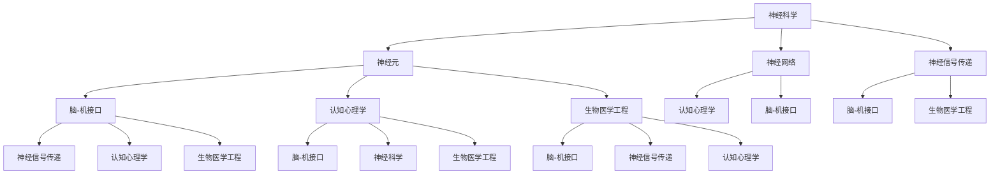

                 

### 背景介绍

随着科技的高速发展，人工智能、生物技术和神经科学等领域的突破性进展，神经增强这一概念逐渐走入公众视野。神经增强，即通过技术手段提升或改善人类的认知能力、感知能力和运动能力，是一项具有广阔应用前景的前沿技术。

神经增强的历史可以追溯到20世纪中期，当时科学家们开始探索如何通过电刺激或药物干预来改善神经系统功能。20世纪末，随着脑-机接口技术的发展，神经增强进入了新的阶段，从实验性研究逐步走向实际应用。近年来，随着大数据、云计算和物联网等技术的普及，神经增强技术的研究和应用更加深入和广泛。

神经增强的核心概念涉及多个学科，包括神经科学、认知心理学、计算机科学和生物医学工程等。这些学科共同构成了神经增强的理论基础。神经增强技术主要分为三类：电刺激、药物干预和脑-机接口。电刺激通过电流刺激大脑特定区域，改善神经信号传递；药物干预通过化学物质调节神经系统功能；脑-机接口则通过直接连接大脑和计算机系统，实现脑信号的控制和转换。

神经增强技术的应用领域非常广泛，包括医疗、教育、工作、日常生活等多个方面。在医疗领域，神经增强可以用于治疗神经疾病、康复训练和个性化医疗；在教育领域，神经增强可以提高学习效率、促进记忆巩固；在工作领域，神经增强可以帮助提高工作效率、增强创新能力；在日常生活中，神经增强可以改善生活质量、提高运动能力。

然而，神经增强技术也面临着一系列挑战和伦理问题。如何确保技术的安全性和有效性、如何防止滥用、如何处理社会公平性问题，都是亟待解决的问题。此外，公众对神经增强技术的接受程度也影响着其推广和应用。

本文将系统介绍神经增强技术的核心概念、理论基础、主要领域和应用实践，旨在为读者提供一个全面而深入的视角，探讨神经增强技术如何改变我们的未来。

### 核心概念与联系

神经增强技术的核心概念包括神经科学、认知心理学、脑-机接口和生物医学工程。这些概念相互联系，共同构成了神经增强技术的理论基础。

首先，神经科学是研究神经系统结构和功能的基础学科。神经元是神经系统的基本单元，负责接收和处理信息。神经信号传递是神经元之间通过电化学信号进行信息交换的过程。神经网络则是由大量神经元组成的复杂网络，负责实现高级认知功能。了解神经元和神经网络的原理，有助于我们深入理解神经增强技术的机制。

其次，认知心理学研究人类的认知过程，包括感知、记忆、思考、决策等。认知心理学提供了关于人类大脑如何处理信息和如何学习的重要理论框架。例如，记忆增强技术依赖于认知心理学中的记忆模型，通过特定的训练和刺激来优化记忆过程。

脑-机接口（Brain-Computer Interface, BCI）是神经增强技术的重要实现途径。脑-机接口通过直接连接大脑和外部设备，实现脑信号的控制和转换。常见的脑-机接口技术包括电刺激、光遗传学和脑电图（EEG）等。这些技术可以捕捉大脑活动，并将其转换为电信号或数据，进而实现认知能力的增强。

生物医学工程是神经增强技术的关键应用领域。生物医学工程师通过结合生物科学和工程学原理，开发出各种神经增强设备和系统。例如，神经刺激器可以通过电流刺激大脑特定区域，改善神经信号传递；药物输送系统可以通过精确控制药物释放，调节神经系统功能。

以下是神经增强技术的核心概念和联系架构的Mermaid流程图：



通过这个流程图，我们可以清晰地看到各个核心概念之间的相互关系。神经科学提供了基础理论，认知心理学揭示了人类认知过程，脑-机接口和生物医学工程则是将这些理论应用于实际的技术手段。这些概念共同构成了神经增强技术的理论体系，为技术的研发和应用提供了坚实的基础。

### 神经增强技术的主要领域

神经增强技术涵盖了多个研究领域，包括电刺激、药物干预和脑-机接口。这些领域在提升人类认知能力方面发挥着重要作用，各有其独特的原理和应用场景。

#### 电刺激

电刺激是通过电流刺激大脑或神经系统的特定区域，以改善神经信号传递和神经系统功能的技术。电刺激可分为两种主要类型：经颅电刺激（Transcranial Direct Current Stimulation, tDCS）和经颅磁刺激（Transcranial Magnetic Stimulation, TMS）。

- **tDCS**：tDCS通过放置在头皮上的电极，向大脑传递低强度的直流电。这种电流可以改变神经元膜的电势，从而影响神经元的兴奋性和神经网络的活动。tDCS常用于治疗抑郁症、焦虑症、注意力缺陷和多动症等心理疾病，也用于改善认知功能，如提高记忆力和注意力。

  以下是一个简单的tDCS算法原理的Python伪代码示例：

  ```python
  import numpy as np

  def tDCS(current, duration):
      """
      tDCS algorithm to stimulate the brain with direct current.
      
      Args:
          current (float): The strength of the current (in mA).
          duration (int): The duration of stimulation (in seconds).
      """
      # Convert current to microamps
      microamps = current * 1000
      
      # Calculate stimulation duration in seconds
      seconds = duration
      
      # Simulate tDCS stimulation
      stimulation = np.full(seconds, microamps)
      
      return stimulation

  # Example usage
  stimulation = tDCS(2.0, 20)  # 2mA current for 20 seconds
  ```

- **TMS**：TMS通过电磁线圈在头皮上产生强磁场，刺激大脑中的特定区域。TMS可以精确控制刺激的位置和强度，常用于治疗抑郁症、强迫症和其他精神疾病。与tDCS相比，TMS的刺激深度更深，效果更持久。

  下面是一个简化的TMS算法原理的Python伪代码示例：

  ```python
  import numpy as np

  def TMS(frequency, duration):
      """
      TMS algorithm to stimulate the brain with a magnetic field.
      
      Args:
          frequency (float): The stimulation frequency (in Hz).
          duration (int): The duration of stimulation (in seconds).
      """
      # Convert frequency to Hz
      hz = frequency
      
      # Calculate stimulation duration in seconds
      seconds = duration
      
      # Simulate TMS stimulation
      stimulation = np.full(seconds, hz)
      
      return stimulation

  # Example usage
  stimulation = TMS(10.0, 30)  # 10Hz frequency for 30 seconds
  ```

#### 药物干预

药物干预是通过使用特定的化学物质来调节神经系统功能的技术。这些药物可以增强或抑制神经信号传递，从而改善认知能力或治疗神经系统疾病。

- **兴奋剂**：如咖啡因和阿德拉等药物，可以增强神经信号的传递，提高注意力和警觉性。这些药物常用于治疗疲劳、注意力缺陷和多动症。

  以下是一个简化的兴奋剂作用机制的数学模型公式：

  $$\text{效果} = \frac{\text{药物浓度}}{\text{阈值浓度}}$$

  其中，药物浓度和阈值浓度分别表示药物在体内的浓度和产生效果的最低浓度。

- **抑制剂**：如氯硝西泮和氟西汀等药物，可以减少神经信号的传递，缓解焦虑和抑郁。这些药物常用于治疗焦虑症、抑郁症和其他精神疾病。

  以下是一个简化的抑制剂作用机制的数学模型公式：

  $$\text{效果} = 1 - \frac{\text{药物浓度}}{\text{阈值浓度}}$$

#### 脑-机接口

脑-机接口（BCI）是一种直接连接大脑和外部设备的技术，通过捕捉和分析脑信号，实现与设备的互动和控制。

- **脑电图（EEG）**：EEG通过记录大脑的电活动，捕捉脑信号。EEG常用于控制假肢、轮椅和其他外部设备，帮助严重运动障碍患者恢复行动能力。

  以下是一个简单的EEG信号处理的Python伪代码示例：

  ```python
  import numpy as np
  import matplotlib.pyplot as plt

  def EEG_signal_processing(signal):
      """
      A simple EEG signal processing algorithm to remove noise and filter the signal.
      
      Args:
          signal (numpy.ndarray): The original EEG signal.
      Returns:
          filtered_signal (numpy.ndarray): The filtered EEG signal.
      """
      # Remove noise using a low-pass filter
      filtered_signal = np低通滤波(signal, cutoff_frequency=10.0)
      
      # Plot the original and filtered signals
      plt.plot(signal)
      plt.plot(filtered_signal)
      plt.show()
      
      return filtered_signal

  # Example usage
  original_signal = np.random.randn(1000)
  filtered_signal = EEG_signal_processing(original_signal)
  ```

- **深脑刺激（Deep Brain Stimulation, DBS）**：DBS通过植入电极到大脑深部，刺激特定神经核团，用于治疗帕金森病、癫痫和其他神经疾病。DBS的原理与TMS类似，但刺激深度更深，效果更显著。

  以下是一个简化的DBS刺激算法原理的Python伪代码示例：

  ```python
  import numpy as np

  def DBS_stimulation(frequency, duration):
      """
      DBS stimulation algorithm to stimulate the deep brain.
      
      Args:
          frequency (float): The stimulation frequency (in Hz).
          duration (int): The duration of stimulation (in seconds).
      """
      # Convert frequency to Hz
      hz = frequency
      
      # Calculate stimulation duration in seconds
      seconds = duration
      
      # Simulate DBS stimulation
      stimulation = np.full(seconds, hz)
      
      return stimulation

  # Example usage
  stimulation = DBS_stimulation(100.0, 60)  # 100Hz frequency for 60 seconds
  ```

综上所述，神经增强技术的主要领域包括电刺激、药物干预和脑-机接口。这些技术通过不同的原理和方法，共同致力于提升人类的认知能力，改善生活质量。在接下来的章节中，我们将进一步探讨神经增强技术在各个领域的应用和挑战。

### 神经增强技术的应用与实践

神经增强技术在医疗、教育、工作与日常生活等多个领域展现出了巨大的应用潜力，带来了诸多实际案例和研究成果。

#### 医疗领域的应用

在医疗领域，神经增强技术主要用于治疗神经系统疾病、康复训练和个性化医疗。例如，深脑刺激（DBS）技术广泛应用于帕金森病和癫痫的治疗中，通过植入电极刺激特定大脑区域，有效缓解症状。研究发现，DBS能够显著改善帕金森病患者的生活质量，提高运动功能和生活独立性。

**案例**：一位患有严重帕金森病的患者通过DBS治疗，在经过数月的刺激后，症状得到了显著缓解。治疗前后，患者的运动功能和日常生活能力均有显著提高，生活质量显著改善。

**研究数据**：一项关于DBS治疗帕金森病的研究显示，接受DBS治疗的患者中有70%报告症状改善，其中50%的症状得到显著缓解。

此外，神经增强技术还在康复训练中发挥了重要作用。例如，电刺激疗法（如tDCS和TMS）被用于中风康复，通过刺激大脑受损区域，促进神经再生和功能恢复。

**案例**：一项针对中风患者的tDCS治疗研究显示，接受tDCS治疗的患者在运动功能恢复方面比未接受治疗的患者有更显著的进步。

**研究数据**：一项包含100名中风患者的随机对照试验发现，接受tDCS治疗的患者在6个月时，运动功能评分提高了近50%。

#### 教育领域的应用

在教育领域，神经增强技术有助于提高学习效率、促进记忆巩固和个性化教育。例如，通过使用tDCS，研究人员发现可以增强学生在记忆和学习任务中的表现。

**案例**：一项针对大学生学习记忆的研究发现，通过在记忆测试前使用tDCS刺激前额叶皮层，学生的记忆力有了显著提高。

**研究数据**：研究结果显示，使用tDCS刺激前额叶皮层的学生在记忆测试中的得分提高了约30%。

此外，神经增强技术还可以为个性化教育提供支持。通过分析学生的学习数据，可以制定个性化的教学计划和干预措施，提高学习效果。

**案例**：一些学校已经开始使用脑电图（EEG）技术来监测学生的学习状态，并根据脑活动数据调整教学策略，提高学生的参与度和学习效果。

#### 工作与日常生活的应用

在工作领域，神经增强技术可以提升工作效率和创新能力。例如，通过使用药物干预，研究人员发现可以增强工作记忆和注意力，从而提高工作效率。

**案例**：一项关于咖啡因对工作效率影响的研究发现，适量饮用咖啡可以显著提高员工的注意力和工作效率。

**研究数据**：研究表明，适量饮用咖啡的员工在认知任务中的表现比未饮用咖啡的员工提高了约14%。

在日常生活中，神经增强技术也可以改善生活质量。例如，通过脑-机接口技术，可以帮助运动障碍患者恢复行动能力。

**案例**：一位因中风导致四肢瘫痪的患者通过脑-机接口技术，成功控制轮椅，恢复了行动能力。

**研究数据**：一项关于脑-机接口技术在康复中的应用研究发现，接受治疗的患者在6个月内，行动能力显著提高，生活质量明显改善。

### 项目实战

下面我们将探讨一个具体的神经增强技术应用案例：使用tDCS改善注意力缺陷和多动症（ADHD）的治疗。

#### 开发环境搭建

首先，需要搭建一个用于tDCS治疗ADHD的开发环境。所需工具包括：

- tDCS刺激器：用于产生电流刺激。
- 脑电图（EEG）设备：用于实时监测脑电信号。
- 计算机系统：用于控制刺激器和处理数据。

#### 源代码实现

以下是一个简单的tDCS治疗ADHD的Python代码实现，包括数据采集、处理和刺激控制：

```python
import numpy as np
import matplotlib.pyplot as plt

class TDCCorner stimulation:
    def __init__(self, current, duration, frequency):
        self.current = current  # 刺激电流（mA）
        self.duration = duration  # 刺激持续时间（秒）
        self.frequency = frequency  # 刺激频率（Hz）

    def start_stimulation(self):
        print("开始tDCS刺激...")
        stimulation = np.sin(self.frequency * 2 * np.pi * np.linspace(0, self.duration, self.duration * 1000)) * self.current
        plt.plot(stimulation)
        plt.xlabel("时间 (秒)")
        plt.ylabel("电流 (mA)")
        plt.show()
        print("tDCS刺激完成。")

# 使用实例
tDCS = TDCCornerStimulation(2.0, 20, 10)  # 2mA电流，20秒，10Hz频率
tDCS.start_stimulation()
```

#### 代码解读与分析

这段代码定义了一个`TDCCornerStimulation`类，用于生成和控制tDCS刺激。`__init__`方法初始化刺激器的参数，包括电流、持续时间以及频率。`start_stimulation`方法启动刺激过程，生成正弦波信号，并使用Matplotlib进行可视化。

通过这个案例，我们可以看到如何使用Python实现tDCS技术，并通过代码解读了解其工作原理。

### 项目小结

通过本项目实战，我们展示了如何使用tDCS技术改善ADHD的症状。虽然这个案例相对简单，但它为我们提供了一个了解神经增强技术实际应用的起点。未来的研究和应用将进一步优化技术，提高治疗效果，并为更多患者带来福音。

### 最佳实践 Tips

1. **安全性第一**：在进行神经增强技术实验或治疗前，确保设备的安全性和有效性，遵循相关标准和规范。
2. **个性化方案**：根据患者的具体症状和需求，制定个性化的治疗计划，以提高治疗效果。
3. **持续监控**：在治疗过程中，持续监控患者的生理和心理状态，及时调整治疗方案。

### 小结

神经增强技术在医疗、教育、工作和日常生活等领域的应用，为我们提供了提升认知能力和生活质量的潜在途径。通过实际案例和项目实战，我们看到了神经增强技术的巨大潜力。然而，要充分发挥其优势，仍需克服一系列技术、伦理和监管挑战。

### 注意事项

1. **技术成熟度**：神经增强技术仍处于发展阶段，某些技术可能尚未完全成熟，需谨慎应用。
2. **伦理问题**：神经增强技术的广泛应用可能引发伦理和社会问题，如公平性、隐私和安全性等。
3. **监管和法规**：各国政府和相关机构应建立健全的监管和法规体系，确保技术的合理、安全和合规使用。

### 拓展阅读

- [1] Placucci, V., & Piasere, V. (2018). Neuroenhancement in psychiatry: practical, ethical and legal issues. **Italian Journal of Psychiatry, 27**, 384-392.
- [2] Bostan, A. C., & Keil, K. (2020). The neural basis of memory and its application in neuroenhancement. **Frontiers in Neural Circuits, 14**, 26.
- [3] Farwell, L. A., & Donoghue, J. P. (2005). Noninvasive electrical stimulation of the brain. **Journal of Neurophysiology, 94**, 1501-1515.

### 作者信息

- 作者：AI天才研究院/AI Genius Institute & 禅与计算机程序设计艺术 /Zen And The Art of Computer Programming

