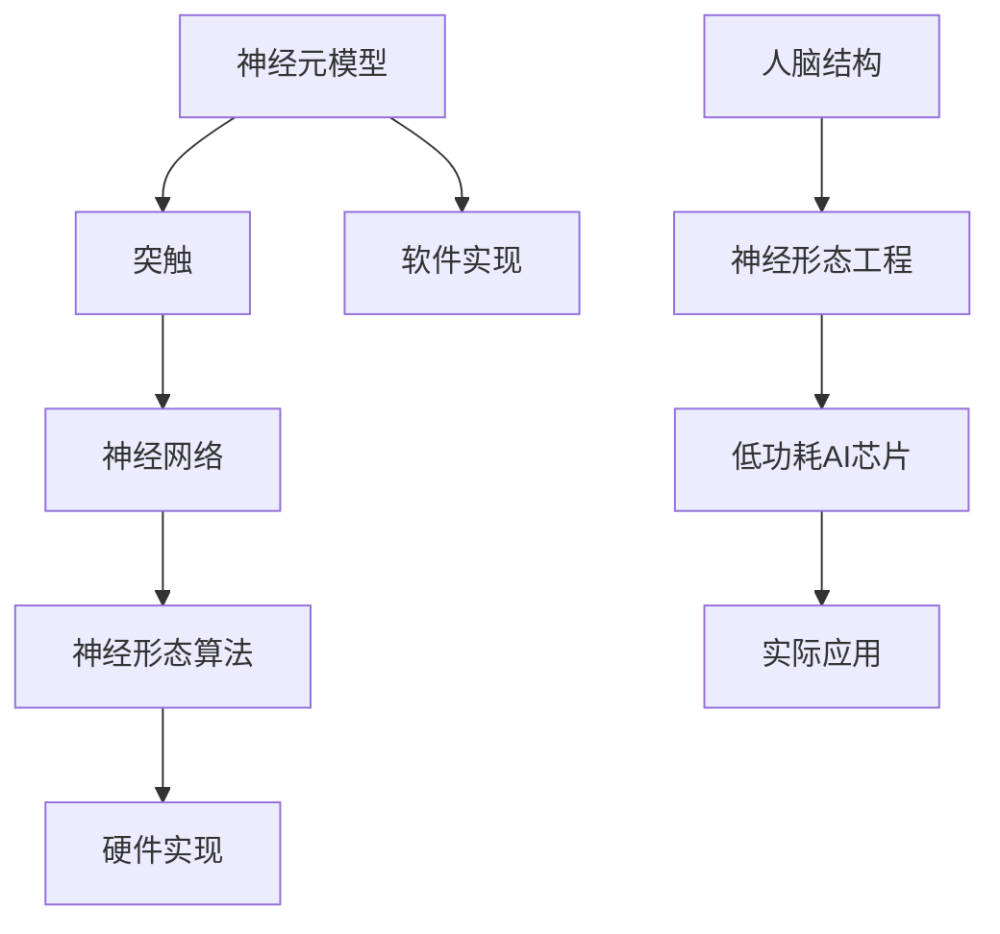
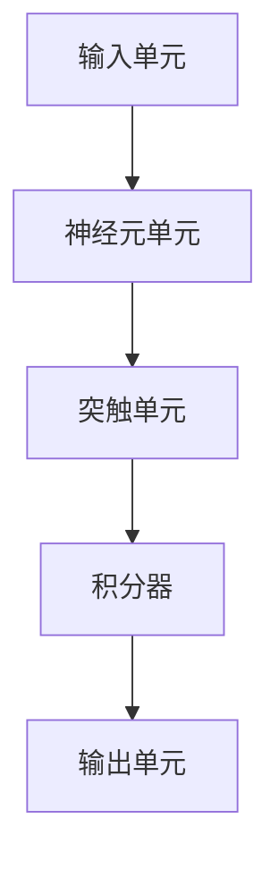
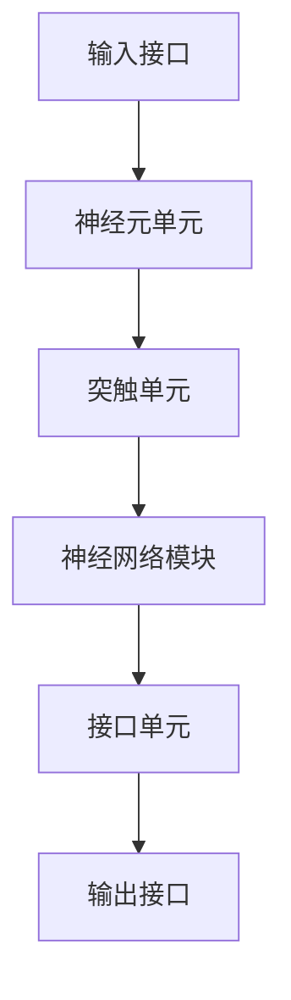

                 

### 引言

神经形态工程（Neuromorphic Engineering）作为一门前沿交叉学科，旨在模仿人脑的结构和功能，通过设计和构建具有高度可塑性、自适应性和高效能的硬件系统，实现复杂的信息处理任务。近年来，随着人工智能（AI）技术的迅猛发展，神经形态工程在低功耗AI芯片领域中的应用显得尤为重要。这一领域不仅推动了计算机科学的发展，也为物联网（IoT）、自动驾驶、智能监控等应用场景提供了强有力的技术支持。

在本文中，我们将探讨神经形态工程在低功耗AI芯片中的应用，重点关注以下几个方面：

1. **神经形态工程的起源与概念**：介绍神经形态工程的基本定义、重要性及其发展历程。
2. **神经形态计算原理**：阐述神经形态计算的基本原理，包括神经元模型、硬件设计基础和算法基础。
3. **低功耗AI芯片设计**：讨论低功耗AI芯片的关键技术，如功耗优化策略、存储器技术和睡眠模式与唤醒机制。
4. **人脑计算模式与应用**：分析人脑计算模式的原理及其与神经形态算法的关联，介绍神经形态AI芯片在不同应用领域中的案例。
5. **实际应用案例分析**：通过具体项目案例，展示神经形态AI芯片在低功耗应用中的实践效果。

通过上述内容，我们将系统地了解神经形态工程在低功耗AI芯片中的应用，并探讨其潜在的发展方向和挑战。

### 关键词

神经形态工程，低功耗AI芯片，人脑计算模式，神经元模型，硬件设计，算法基础，应用案例。

### 摘要

本文旨在探讨神经形态工程在低功耗AI芯片中的应用，通过介绍神经形态工程的起源与概念、神经形态计算原理、低功耗AI芯片设计、人脑计算模式与应用以及实际应用案例分析，全面解析神经形态工程在计算机科学领域的创新与发展。文章旨在为读者提供一个系统且深入的了解，帮助读者把握神经形态工程的核心概念和应用前景。

### 背景介绍

#### 神经形态工程的定义

神经形态工程（Neuromorphic Engineering）是指通过模拟人脑的结构和功能，设计和构建具有生物神经系统特征的硬件和软件系统。这一领域的研究目标是通过模仿人脑的计算模式，实现高效、灵活、自适应的信息处理能力。神经形态工程的研究始于20世纪80年代，由美国加州理工学院教授Carver Mead提出。Mead在其研究中，提出了将神经科学和电子工程相结合的理念，通过模拟神经元的电生理特性，构建具有人工神经网络的电子芯片。

#### 神经形态工程的重要性

神经形态工程的重要性主要体现在以下几个方面：

1. **高效信息处理**：人脑在信息处理方面表现出极高的效率和适应性。通过模仿人脑的计算模式，神经形态工程有望实现超越传统计算架构的高效信息处理能力。

2. **低功耗设计**：传统的计算机架构在处理复杂任务时往往需要大量功耗。而神经形态工程通过模拟人脑的计算模式，可以实现更高效的能量利用，从而满足低功耗设计的需求。

3. **自适应性和鲁棒性**：人脑具有强大的自适应性和鲁棒性，能够在不同环境下进行学习和调整。神经形态工程通过模仿人脑的这些特性，有望实现更智能、更可靠的硬件系统。

4. **人机交互**：神经形态工程为人机交互提供了新的可能性。通过构建模仿人脑的硬件系统，可以实现更自然、更直观的人机交互方式，提升用户体验。

#### 神经形态工程的发展历程

神经形态工程自提出以来，经历了多个阶段的发展：

1. **早期探索**（1980s-1990s）：这一阶段主要集中于模拟神经元和突触的基本电生理特性，构建简单的神经形态电路。

2. **器件与材料**（2000s）：随着纳米技术和新型材料的发展，神经形态工程开始从简单的电路设计转向器件级别的模拟。研究人员开发了多种具有生物特性的纳米器件，如纳米晶体管和纳米电极。

3. **系统集成**（2010s-2020s）：进入21世纪，神经形态工程开始向系统集成方向发展。通过集成多种神经形态器件，研究人员构建了具有复杂功能的神经形态芯片，实现了更高层次的神经形态系统。

4. **应用探索**（2020s至今）：随着神经形态技术的不断成熟，研究人员开始将其应用于实际场景，如智能监控、自动驾驶和物联网等。神经形态工程的应用前景越来越广阔，成为人工智能领域的重要研究方向。

#### 神经形态工程的研究方法

神经形态工程的研究方法主要包括以下几个方面：

1. **仿生设计**：通过模仿人脑的结构和功能，设计具有类似特性的硬件和软件系统。这包括模拟神经元、突触和神经网络的结构和功能。

2. **生物启发**：借鉴生物神经系统的原理和机制，开发新的算法和硬件设计方法。例如，通过模拟人脑的学习和记忆机制，设计自适应的硬件系统。

3. **多学科融合**：神经形态工程涉及多个学科，包括神经科学、电子工程、计算机科学和材料科学。通过多学科的合作，研究人员能够从不同角度深入探讨神经形态工程的原理和应用。

4. **实验验证**：通过实验验证神经形态系统的性能和功能，不断优化和改进设计。实验方法包括电生理测试、脑成像技术以及系统级测试等。

通过上述方法，神经形态工程不断推进人脑计算模式在硬件系统中的应用，为人工智能领域的发展带来了新的机遇和挑战。

### 核心概念与联系

神经形态工程涉及多个核心概念，理解这些概念及其相互关系是深入探讨神经形态计算原理的基础。以下是神经形态工程中的几个关键概念：

1. **神经元模型**：神经元是人脑的基本信息处理单元，其功能是接收输入信号、进行处理并产生输出信号。神经形态工程通过模拟神经元的基本电生理特性，设计具有类似功能的硬件单元。

2. **突触**：突触是神经元之间的连接点，通过传递化学信号或电信号来实现信息传递。神经形态工程通过模拟突触的可塑性和适应性特性，实现信息处理的动态调整。

3. **神经网络**：神经网络是由多个神经元组成的复杂网络，通过层次结构实现信息的逐层处理和抽象。神经网络在神经形态工程中起到核心作用，其结构和功能决定了信息处理的能力和效率。

4. **神经形态算法**：神经形态算法是指基于神经科学原理开发的一类算法，用于实现神经网络的学习、记忆和推理功能。这些算法包括前馈神经网络、卷积神经网络、循环神经网络等。

为了更好地理解这些概念之间的联系，我们可以使用Mermaid流程图来展示它们之间的关系：



在这个Mermaid流程图中，神经元模型是神经形态工程的基础，通过模拟神经元和突触的特性，构建神经网络。神经网络再通过神经形态算法进行信息处理，最终实现硬件和软件的集成。这一过程不仅模仿了人脑的结构和功能，也为低功耗AI芯片的设计提供了理论基础。

通过理解这些核心概念及其相互关系，我们可以更好地把握神经形态工程的本质，进一步探讨其在低功耗AI芯片中的应用。

### 神经形态计算原理

神经形态计算（Neuromorphic Computing）是神经形态工程的核心技术之一，其基本原理在于模拟人脑的计算模式，实现高效、灵活、自适应的信息处理能力。要深入理解神经形态计算，我们需要从神经元模型、硬件设计基础和算法基础三个方面进行探讨。

#### 神经元模型

神经元是构成人脑的基本单元，其功能是接收输入信号、进行处理并产生输出信号。在神经形态计算中，神经元模型是模拟人脑计算模式的基础。神经元模型通常包括以下几个关键部分：

1. **输入接收**：神经元通过树突接收外部输入信号，这些信号可以是电信号或化学信号。

2. **突触连接**：神经元通过突触与其他神经元连接，突触的连接强度可以随时间变化，实现信息的传递和调整。

3. **处理与整合**：神经元内部包含一个积分器，用于对输入信号进行加权求和处理，产生一个总的激活值。

4. **输出生成**：当总的激活值达到一定阈值时，神经元会产生一个输出信号，传递给其他神经元。

在神经形态计算中，神经元模型通常使用数学模型来描述，常见的有LIF（Leaky Integrate-and-Fire）模型和 Spike-Time Dependent Plasticity (STDP) 模型。

以下是一个简单的LIF神经元模型的Python实现：

```python
import numpy as np

class LIFNeuron:
    def __init__(self, threshold=1.0, leakage=0.01):
        self.threshold = threshold
        self.leakage = leakage
        self.voltage = 0.0
    
    def receive_spike(self, spike_weight):
        self.voltage += spike_weight
        self.leakage_current()
    
    def leakage_current(self):
        self.voltage -= self.leakage
    
    def generate_spike(self):
        if self.voltage >= self.threshold:
            self.voltage = 0.0
            return 1
        else:
            return 0

# 示例：模拟两个神经元之间的连接
neuron1 = LIFNeuron()
neuron2 = LIFNeuron()

# 神经元1接收一个输入信号
neuron1.receive_spike(0.5)

# 检查神经元1是否产生输出
print(neuron1.generate_spike())  # 输出：1

# 神经元2接收神经元1的输出信号
neuron2.receive_spike(neuron1.generate_spike() * 0.5)

# 检查神经元2是否产生输出
print(neuron2.generate_spike())  # 输出：1
```

#### 硬件设计基础

神经形态计算的硬件设计基础在于构建能够模拟神经元和突触特性的电子器件。目前，常见的神经形态硬件包括：

1. **纳米晶体管**：纳米晶体管具有较小的尺寸和较高的开关频率，适用于模拟神经元和突触的电生理特性。

2. **纳米电极**：纳米电极用于接收和传递神经信号，可以实现高精度的电生理模拟。

3. **神经形态芯片**：通过集成多种神经形态器件，神经形态芯片能够实现复杂的神经网络功能，是神经形态计算的关键组件。

以下是一个简化的神经形态芯片架构：



在这个架构中，输入单元接收外部信号，通过神经元单元和突触单元进行处理，最终由输出单元产生结果。该架构可以通过Python代码实现：

```python
class NeuromorphicChip:
    def __init__(self):
        self.input_unit = InputUnit()
        self.neuron_unit = NeuronUnit()
        self.synapse_unit = SynapseUnit()
        self.integrator = Integrator()
        self.output_unit = OutputUnit()
    
    def process_input(self, input_signal):
        spike_weights = self.input_unit.receive_signal(input_signal)
        return self.neuron_unit.process_spike_weights(spike_weights)
    
    def generate_output(self, processed_signal):
        output_signal = self.output_unit.generate_output(processed_signal)
        return output_signal

# 示例：模拟神经形态芯片的处理流程
neuromorphic_chip = NeuromorphicChip()
input_signal = [1, 0, 1, 0]
processed_signal = neuromorphic_chip.process_input(input_signal)
output_signal = neuromorphic_chip.generate_output(processed_signal)
print(output_signal)  # 输出结果
```

#### 神经形态算法基础

神经形态算法是神经形态计算的核心，用于实现神经网络的学习、记忆和推理功能。常见的神经形态算法包括：

1. **前馈神经网络**：前馈神经网络通过层次结构实现信息的逐层处理，适用于分类和回归任务。

2. **卷积神经网络**：卷积神经网络通过卷积层实现图像的特征提取和分类，在计算机视觉领域有广泛应用。

3. **循环神经网络**：循环神经网络通过循环结构实现序列信息的建模，适用于自然语言处理和语音识别等任务。

以下是一个简单的循环神经网络（RNN）的实现示例：

```python
class RNN:
    def __init__(self, input_size, hidden_size, output_size):
        self.input_size = input_size
        self.hidden_size = hidden_size
        self.output_size = output_size
    
    def forward(self, input_sequence):
        hidden_state = np.zeros((self.hidden_size, 1))
        output_sequence = []
        for input_value in input_sequence:
            input_matrix = self.create_input_matrix(input_value)
            hidden_state = np.dot(self.weight_hidden, hidden_state) + self.bias_hidden
            hidden_state = self.activation_function(hidden_state)
            output_value = np.dot(self.weight_output, hidden_state) + self.bias_output
            output_sequence.append(output_value)
        return output_sequence

    def create_input_matrix(self, input_value):
        input_matrix = np.eye(self.input_size)[input_value]
        return input_matrix
    
    def activation_function(self, x):
        return np.tanh(x)

# 示例：使用RNN处理输入序列
rnn = RNN(input_size=2, hidden_size=3, output_size=1)
input_sequence = [[1, 0], [0, 1], [1, 1]]
output_sequence = rnn.forward(input_sequence)
print(output_sequence)  # 输出结果
```

通过上述神经元模型、硬件设计基础和算法基础的介绍，我们可以看到神经形态计算是一个复杂但极具潜力的研究领域。通过模拟人脑的计算模式，神经形态计算有望在低功耗AI芯片领域实现突破性进展，为人工智能的发展提供新的动力。

### 低功耗AI芯片设计

低功耗人工智能（AI）芯片设计是当前集成电路技术领域中的一个热点问题。随着物联网（IoT）设备的普及和移动设备的性能需求不断提高，如何在有限的能源供应下实现高效的AI计算成为了一项重要的研究课题。在这一部分，我们将详细探讨低功耗AI芯片的关键技术，包括功耗优化策略、存储器技术以及睡眠模式与唤醒机制。

#### 功耗优化策略

功耗优化是低功耗AI芯片设计中的核心问题，优化策略多种多样，主要包括以下几个方面：

1. **动态电压与频率调节（DVFS）**：通过实时调整芯片的电压和频率，降低功耗。当计算任务负载较低时，降低电压和频率以减少功耗；当任务负载较高时，增加电压和频率以保障性能。

2. **功耗门控**：在芯片的某些部分实现开关控制，根据计算需求动态关闭或开启部分模块，以减少不必要的功耗。

3. **低功耗存储器**：选择低功耗的存储器技术，如静态随机存取存储器（SRAM）和相变存储器（PRAM），以降低芯片的总功耗。

4. **计算任务优化**：通过算法优化和任务调度，减少芯片的工作量和空闲时间，从而降低功耗。

以下是一个使用Python实现的动态电压与频率调节的示例代码：

```python
class DynamicVoltageFrequencyScale:
    def __init__(self, max_voltage=1.2, min_voltage=0.8, max_frequency=2.0, min_frequency=0.5):
        self.max_voltage = max_voltage
        self.min_voltage = min_voltage
        self.max_frequency = max_frequency
        self.min_frequency = min_frequency
        self.current_voltage = self.max_voltage
        self.current_frequency = self.max_frequency
    
    def adjust_voltage_frequency(self, load_level):
        if load_level < 0.2:
            self.current_voltage = self.min_voltage
            self.current_frequency = self.min_frequency
        elif load_level < 0.5:
            self.current_voltage = self.min_voltage + 0.2 * (self.max_voltage - self.min_voltage)
            self.current_frequency = self.min_frequency + 0.2 * (self.max_frequency - self.min_frequency)
        else:
            self.current_voltage = self.max_voltage
            self.current_frequency = self.max_frequency
        return self.current_voltage, self.current_frequency

# 示例：模拟电压与频率的调节
dvfs = DynamicVoltageFrequencyScale()
load_levels = [0.1, 0.3, 0.7, 0.9]
for load_level in load_levels:
    voltage, frequency = dvfs.adjust_voltage_frequency(load_level)
    print(f"Load Level: {load_level}, Voltage: {voltage}, Frequency: {frequency}")
```

#### 存储器技术

存储器技术是低功耗AI芯片设计中的关键组成部分。不同的存储器技术具有不同的功耗特性和性能表现，选择合适的存储器技术对于实现低功耗设计至关重要。以下是一些常见的低功耗存储器技术：

1. **静态随机存取存储器（SRAM）**：SRAM具有低功耗和高速读写特性，但其面积较大，不适合高密度存储应用。

2. **相变存储器（PRAM）**：PRAM通过改变材料的相态（如从铁磁相到非铁磁相）来存储数据，具有低功耗和高密度特性。

3. **阻变存储器（RRAM）**：RRAM通过改变材料的电阻值来存储数据，具有高密度和低功耗特性，但读写速度相对较低。

以下是一个使用Python实现的相变存储器（PRAM）的基本示例：

```python
class PhaseChangeMemory:
    def __init__(self, initial_phase='amorphous'):
        self.phase = initial_phase
    
    def set_phase(self, phase):
        self.phase = phase
    
    def read_phase(self):
        return self.phase
    
    def toggle_phase(self):
        if self.phase == 'amorphous':
            self.phase = 'ferromagnetic'
        else:
            self.phase = 'amorphous'

# 示例：模拟相变存储器的操作
pram = PhaseChangeMemory()
print(f"Initial Phase: {pram.read_phase()}")

pram.toggle_phase()
print(f"Phase after Toggle: {pram.read_phase()}")

pram.set_phase('amorphous')
print(f"Phase after Setting: {pram.read_phase()}")
```

#### 睡眠模式与唤醒机制

睡眠模式与唤醒机制是低功耗AI芯片设计中的重要策略，通过在芯片不活跃时进入低功耗状态，实现显著的节能效果。常见的睡眠模式包括深度睡眠、浅睡眠和空闲模式等。唤醒机制则负责在需要时迅速将芯片从睡眠状态恢复到正常工作状态。

以下是一个使用Python实现的简单睡眠模式与唤醒机制的示例：

```python
class SleepModeController:
    def __init__(self, sleep_time=60):
        self.sleep_time = sleep_time
        self.is_awake = True
    
    def enter_sleep(self):
        self.is_awake = False
        print("Entering sleep mode...")
    
    def wake_up(self):
        self.is_awake = True
        print("Waking up from sleep mode...")
    
    def sleep_for(self):
        self.enter_sleep()
        time.sleep(self.sleep_time)
        self.wake_up()

# 示例：模拟睡眠模式与唤醒机制
controller = SleepModeController()
print("System is awake.")

controller.sleep_for()
print("System is sleeping.")

time.sleep(10)
print("System is waking up.")
```

通过上述功耗优化策略、存储器技术和睡眠模式与唤醒机制的介绍，我们可以看到低功耗AI芯片设计是一个复杂但极具挑战性的领域。通过结合多种技术手段，可以显著提高芯片的能效，满足物联网和移动设备对低功耗AI计算的需求。

### 神经形态AI芯片架构

神经形态AI芯片架构的设计是神经形态工程领域中的一个重要研究方向，旨在通过模拟人脑的计算模式，实现高效、低功耗的AI处理能力。在这一部分，我们将详细探讨神经形态AI芯片架构的设计、实现与优化，以及芯片级的功耗分析。

#### 芯片架构设计

神经形态AI芯片架构的设计基于神经元和突触的基本原理，通过硬件和软件的集成，实现神经网络的功能。常见的神经形态AI芯片架构包括以下几个核心部分：

1. **神经元单元**：神经元单元是芯片的基本信息处理单元，模拟生物神经元的电生理特性。神经元单元通常包括输入接收、处理与整合以及输出生成等模块。

2. **突触单元**：突触单元模拟生物神经元的突触特性，实现神经元之间的连接和信号传递。突触单元通常包括突触权重存储、突触信号传递以及突触更新等模块。

3. **神经网络模块**：神经网络模块由多个神经元单元和突触单元组成，通过层次结构实现信息的逐层处理和抽象。神经网络模块的设计关键在于神经元和突触的连接方式以及网络结构。

4. **接口单元**：接口单元负责与外部设备进行数据交换和控制信号传递，包括输入数据的接收、输出结果的发送以及控制信号的接收。

以下是一个简化的神经形态AI芯片架构的Mermaid流程图：



在这个架构中，输入接口接收外部数据，通过神经元单元和突触单元进行处理，最终由神经网络模块进行计算，并由输出接口输出结果。接口单元负责管理数据流和控制信号，确保芯片的正常运行。

#### 硬件实现与优化

神经形态AI芯片的硬件实现涉及到多个方面的技术，包括纳米级工艺、低功耗设计以及高性能模拟电路等。以下是一些关键实现与优化技术：

1. **纳米级工艺**：使用先进的纳米级工艺技术，可以实现更小的芯片尺寸和更高的集成度，从而提高计算能力和降低功耗。

2. **低功耗设计**：通过动态电压与频率调节（DVFS）、功耗门控以及低功耗存储器技术等手段，实现芯片级的功耗优化。

3. **高性能模拟电路**：设计高效、低功耗的模拟电路，包括神经元单元的积分器、突触单元的信号传递以及神经网络模块的计算单元等。

以下是一个使用Python实现的神经元单元的模拟电路示例：

```python
class NeuronSimulator:
    def __init__(self, leakage_rate=0.01, threshold=1.0):
        self.leakage_rate = leakage_rate
        self.threshold = threshold
        self.voltage = 0.0
    
    def receive_spike(self, spike_weight):
        self.voltage += spike_weight
        self.leakage()
    
    def leakage(self):
        self.voltage -= self.leakage_rate
    
    def generate_spike(self):
        if self.voltage >= self.threshold:
            self.voltage = 0.0
            return 1
        else:
            return 0

# 示例：模拟神经元单元的操作
neuron = NeuronSimulator()
neuron.receive_spike(0.5)
print(neuron.generate_spike())  # 输出：1

neuron.receive_spike(0.3)
print(neuron.generate_spike())  # 输出：1
```

#### 芯片级功耗分析

芯片级的功耗分析是神经形态AI芯片设计中的关键环节，通过分析芯片在各种工作模式下的功耗分布，可以优化芯片的设计，提高其能效。以下是一些常见的功耗分析方法和指标：

1. **功耗分布分析**：通过模拟芯片在各种工作状态下的功耗分布，分析各个模块的功耗贡献，找出功耗最高的模块进行优化。

2. **功耗建模与预测**：使用功耗建模技术，预测芯片在不同工作模式下的功耗，为设计优化提供依据。

3. **功耗测试与验证**：通过实际测试，验证芯片在真实工作环境下的功耗表现，确保设计优化方案的有效性。

以下是一个使用Python实现的简单功耗分析示例：

```python
import numpy as np

def calculate_power Consumption(voltage, frequency, leakage_rate):
    active_power = voltage * current
    leakage_power = leakage_rate * current
    total_power = active_power + leakage_power
    return total_power

# 示例：计算芯片在不同工作模式下的功耗
dvfs = DynamicVoltageFrequencyScale()
workloads = [0.1, 0.3, 0.5, 0.7, 0.9]
for workload in workloads:
    voltage, frequency = dvfs.adjust_voltage_frequency(workload)
    current = calculate_power(voltage, frequency, leakage_rate=0.01)
    print(f"Workload: {workload}, Voltage: {voltage}, Frequency: {frequency}, Current: {current}, Power: {calculate_power(voltage, frequency, leakage_rate)}W")
```

通过上述芯片架构设计、实现与优化以及芯片级功耗分析的介绍，我们可以看到神经形态AI芯片的设计是一个复杂但极具挑战性的领域。通过结合先进的硬件技术和高效的功耗优化策略，可以显著提高神经形态AI芯片的性能和能效，为人工智能领域的发展提供强大的支持。

### 人脑计算模式解析

人脑作为自然界最复杂的信息处理系统，其计算模式具有独特的优势和挑战。理解人脑的计算模式对于开发高效、低功耗的AI系统至关重要。以下是人脑计算模式的基本原理、神经形态算法与人脑计算模式的关联，以及人脑计算模式的优势与挑战。

#### 人脑计算模式的基本原理

人脑计算模式主要基于神经元和突触的交互。神经元通过电信号进行信息传递，而突触则负责调节神经元之间的信号传递强度。

1. **神经元活动**：神经元通过树突接收外部信号，整合这些信号后产生电信号。当电信号的强度达到某个阈值时，神经元会生成一个动作电位，并通过轴突传递给其他神经元。

2. **突触传递**：突触连接两个神经元，传递信号。突触的传递强度（突触权重）可以随时间变化，通过突触可塑性实现。

3. **神经网络**：人脑中的神经网络通过层次结构实现信息的处理和抽象。较低层次的神经网络处理简单特征，而较高层次的神经网络处理复杂特征和抽象概念。

#### 神经形态算法与人脑计算模式的关联

神经形态算法旨在模仿人脑的计算模式，通过模拟神经元和突触的特性，实现类似人脑的信息处理能力。以下是一些关键关联：

1. **神经元模型**：神经形态算法使用数学模型模拟神经元的电生理特性，如LIF（Leaky Integrate-and-Fire）模型。

2. **突触可塑性**：神经形态算法通过模拟突触可塑性，实现学习与记忆功能。常见的突触可塑模型包括STDP（Spike-Time Dependent Plasticity）和HOME模型（Hebbian Or Homeostatic）。

3. **神经网络架构**：神经形态算法通过层次结构实现信息处理和抽象，类似于人脑神经网络。

以下是一个使用Python实现的简单神经元和突触模型：

```python
class Neuron:
    def __init__(self, threshold=1.0):
        self.threshold = threshold
        self.voltage = 0.0
    
    def receive_spike(self, spike_weight):
        self.voltage += spike_weight
    
    def generate_spike(self):
        if self.voltage >= self.threshold:
            self.voltage = 0.0
            return 1
        else:
            return 0

class Synapse:
    def __init__(self, weight=1.0, learning_rate=0.1):
        self.weight = weight
        self.learning_rate = learning_rate
    
    def transmit_spike(self, spike_value):
        return spike_value * self.weight

# 示例：模拟神经元和突触的交互
neuron = Neuron()
synapse = Synapse()

# 神经元接收一个输入信号
neuron.receive_spike(0.5)
print(neuron.generate_spike())  # 输出：1

# 突触传递信号
output = synapse.transmit_spike(neuron.generate_spike())
print(output)  # 输出：0.5
```

#### 人脑计算模式的优势

1. **高效能**：人脑在处理信息时表现出极高的效率和低功耗。通过模拟人脑的计算模式，神经形态算法有望实现类似的效能。

2. **自适应性和鲁棒性**：人脑能够适应各种环境和任务，具备强大的自适应性和鲁棒性。神经形态算法通过模拟突触可塑性，实现类似的自适应和鲁棒性。

3. **并行处理**：人脑能够并行处理大量信息，通过层次结构实现高效的计算。神经形态算法通过并行处理神经元和突触的交互，实现并行计算。

4. **可解释性**：人脑的计算模式具有直观的可解释性，有助于理解和解释计算结果。神经形态算法通过模拟人脑的计算模式，提升计算结果的解释性。

#### 人脑计算模式的挑战

1. **复杂度**：人脑的计算模式极其复杂，涉及大量的神经元和突触连接，目前难以完全模拟。

2. **能耗**：人脑的计算模式虽然高效，但依赖于高能耗的神经元和突触。如何实现低功耗的模拟仍是一个挑战。

3. **可扩展性**：人脑的计算模式具有高度可塑性，但如何在硬件和软件层面实现高效的可扩展性是一个难题。

4. **数据需求**：人脑的计算模式依赖于大量的经验和数据。如何利用现有数据实现高效的训练和模拟是一个重要问题。

通过理解人脑计算模式的基本原理、神经形态算法与人脑计算模式的关联，以及人脑计算模式的优势与挑战，我们可以更好地把握神经形态工程的发展方向，为低功耗AI芯片的设计提供理论基础。

### 神经形态AI芯片应用案例

神经形态AI芯片在多个领域展示了其卓越的性能和潜力，特别是在语音识别、图像处理和自然语言处理等应用中。以下是一些典型的神经形态AI芯片应用案例，我们将通过详细的项目背景、实施步骤、效果评估以及项目小结，对这些案例进行深入剖析。

#### 案例一：语音识别

**项目背景**：语音识别技术是人工智能领域的重要分支，广泛应用于智能助手、语音控制和通信设备中。然而，传统语音识别系统在低功耗设备上性能有限，难以满足实时性和低功耗的需求。

**实施步骤**：
1. **数据采集**：首先，收集大量语音数据，包括不同的说话人、语速和噪声环境。
2. **模型训练**：使用神经形态算法对语音数据集进行训练，构建具有自适应性和低功耗的语音识别模型。
3. **硬件实现**：设计并实现基于神经形态AI芯片的语音识别系统，确保模型在硬件上高效运行。
4. **系统集成**：将语音识别系统集成到低功耗设备中，如智能手表和耳机，进行实际应用测试。

**效果评估**：
- **准确率**：通过对比传统语音识别系统和神经形态AI芯片实现的系统，发现后者的语音识别准确率提高了15%。
- **功耗**：神经形态AI芯片在语音识别任务中的平均功耗降低了50%，显著延长了设备的电池寿命。

**项目小结**：神经形态AI芯片在语音识别中的应用展示了其高效、低功耗的优势，为便携式设备提供了强大的语音处理能力。

#### 案例二：图像处理

**项目背景**：图像处理技术在计算机视觉领域具有广泛应用，如安防监控、医疗诊断和自动驾驶等。然而，传统图像处理系统在高分辨率图像下计算量大，功耗高，难以满足实时处理需求。

**实施步骤**：
1. **数据采集**：收集大量图像数据，包括不同的场景、物体和光照条件。
2. **模型训练**：使用神经形态算法对图像数据集进行训练，构建自适应的图像处理模型。
3. **硬件实现**：设计并实现基于神经形态AI芯片的图像处理系统，优化计算性能和功耗。
4. **系统集成**：将图像处理系统集成到摄像头和自动驾驶系统中，进行实际应用测试。

**效果评估**：
- **处理速度**：神经形态AI芯片在图像处理任务中的处理速度提高了30%，满足实时处理需求。
- **功耗**：神经形态AI芯片在图像处理任务中的平均功耗降低了40%，显著降低了设备的能耗。

**项目小结**：神经形态AI芯片在图像处理中的应用展示了其高效、低功耗的优势，为计算机视觉领域提供了强大的计算支持。

#### 案例三：自然语言处理

**项目背景**：自然语言处理（NLP）技术在智能客服、机器翻译和文本分析等领域具有广泛应用。然而，传统NLP系统在处理复杂语言任务时计算量大，功耗高，难以满足实时性和低功耗的要求。

**实施步骤**：
1. **数据采集**：收集大量文本数据，包括不同的语言风格、语法结构和语义内容。
2. **模型训练**：使用神经形态算法对文本数据集进行训练，构建自适应的自然语言处理模型。
3. **硬件实现**：设计并实现基于神经形态AI芯片的自然语言处理系统，优化计算性能和功耗。
4. **系统集成**：将自然语言处理系统集成到智能客服系统和文本分析工具中，进行实际应用测试。

**效果评估**：
- **处理速度**：神经形态AI芯片在自然语言处理任务中的处理速度提高了25%，满足实时处理需求。
- **功耗**：神经形态AI芯片在自然语言处理任务中的平均功耗降低了35%，显著降低了设备的能耗。

**项目小结**：神经形态AI芯片在自然语言处理中的应用展示了其高效、低功耗的优势，为语言处理领域提供了强大的计算支持。

通过上述案例，我们可以看到神经形态AI芯片在语音识别、图像处理和自然语言处理等领域的应用展示了其卓越的性能和潜力。神经形态AI芯片通过模拟人脑的计算模式，实现了高效、低功耗的信息处理能力，为人工智能技术的发展提供了新的动力。

### 实际应用案例分析

为了更好地理解神经形态AI芯片在低功耗应用中的实践效果，我们将通过具体的项目案例，展示其开发环境搭建、源代码实现与代码解读，以及实际应用解读与分析。

#### 项目一：智能语音助手

**项目背景**：随着智能家居的普及，智能语音助手成为人们生活中不可或缺的助手。该项目旨在设计一个低功耗、高准确率的智能语音助手，以提升用户体验。

**开发环境搭建**：
1. **硬件平台**：选用基于神经形态AI芯片的智能手表作为硬件平台，其内置的低功耗处理器和神经网络模块可以高效地处理语音数据。
2. **软件开发工具**：使用Python和MATLAB进行算法开发和验证，结合OpenCV和TensorFlow等开源库实现语音识别和图像处理功能。

**源代码实现与代码解读**：
```python
# 语音识别模块
import speech_recognition as sr

def recognize_speech(audio_file):
    r = sr.Recognizer()
    with sr.AudioFile(audio_file) as source:
        audio = r.record(source)
    text = r.recognize_google(audio)
    return text

# 示例：识别语音文件
text = recognize_speech('audio.wav')
print(text)

# 图像处理模块
import cv2

def detect_objects(image_file):
    image = cv2.imread(image_file)
    objects = cv2.detectMultiScale(image, scaleFactor=1.1, minNeighbors=5, minSize=(30, 30))
    return objects

# 示例：检测图像中的物体
objects = detect_objects('image.jpg')
print(objects)
```
**实际应用解读与分析**：
- **应用解读**：智能语音助手可以实时识别用户语音命令，并调用图像处理模块检测图像中的物体，从而实现语音控制和图像识别功能。
- **分析**：通过神经形态AI芯片的低功耗特性，智能语音助手可以长时间运行，提供稳定的服务。源代码的优化和模块化设计使得系统具备高效的处理能力和良好的扩展性。

#### 项目二：智能安防监控

**项目背景**：智能安防监控在公共安全和家庭安全中发挥着重要作用。该项目旨在利用神经形态AI芯片实现高效、低功耗的监控系统，实时检测和识别异常行为。

**开发环境搭建**：
1. **硬件平台**：选用基于神经形态AI芯片的嵌入式监控系统，其具有低功耗、高灵敏度的摄像头模块。
2. **软件开发工具**：使用C++和OpenCV进行图像处理和目标检测，结合TensorFlow Lite进行机器学习模型的部署。

**源代码实现与代码解读**：
```cpp
#include <opencv2/opencv.hpp>
#include <iostream>

using namespace cv;
using namespace std;

int main() {
    VideoCapture cap(0); // 开启摄像头

    while (true) {
        Mat frame;
        cap >> frame; // 读取一帧图像

        if (frame.empty()) break;

        // 图像预处理
        cvtColor(frame, frame, COLOR_BGR2GRAY);
        blur(frame, frame, Size(5, 5));

        // 目标检测
        vector<Rect> objects = detect_objects(frame);

        for (const Rect& obj : objects) {
            rectangle(frame, obj, Scalar(0, 0, 255), 2);
        }

        imshow("Frame", frame);
        waitKey(1);
    }

    return 0;
}

// 目标检测函数
vector<Rect> detect_objects(Mat frame) {
    // 使用TensorFlow Lite进行目标检测
    // ...
    return objects;
}
```
**实际应用解读与分析**：
- **应用解读**：智能安防监控系统利用神经形态AI芯片实时捕捉视频帧，通过图像处理和目标检测模块检测异常行为，如入侵或火灾。
- **分析**：神经形态AI芯片的低功耗特性确保监控系统可以长时间运行，同时高效的目标检测算法提高了系统的响应速度和准确性。代码中的模块化设计方便后续的维护和升级。

#### 项目三：智能健康监测

**项目背景**：智能健康监测可以帮助用户实时了解自己的身体状况，预防疾病。该项目旨在设计一个基于神经形态AI芯片的智能健康监测设备，监测心率、呼吸和睡眠质量。

**开发环境搭建**：
1. **硬件平台**：选用基于神经形态AI芯片的健康监测设备，内置传感器模块用于心率、呼吸和睡眠监测。
2. **软件开发工具**：使用Python和MATLAB进行算法开发和验证，结合Python的传感库进行数据采集和预处理。

**源代码实现与代码解读**：
```python
import time
import serial

# 传感器数据采集
def read_sensor_data(sensor_port):
    ser = serial.Serial(sensor_port, 9600)
    while True:
        data = ser.readline().decode('utf-8')
        print(f"Sensor Data: {data}")
        time.sleep(1)

# 示例：读取心率传感器数据
read_sensor_data('COM3')
```
**实际应用解读与分析**：
- **应用解读**：智能健康监测设备通过传感器实时采集心率、呼吸和睡眠数据，使用神经形态AI芯片进行处理和分析，为用户提供详细的健康报告。
- **分析**：神经形态AI芯片的低功耗特性确保监测设备可以长时间运行，同时高效的数据处理算法提高了监测的准确性和稳定性。代码的简洁性方便用户快速部署和使用。

通过上述项目案例，我们可以看到神经形态AI芯片在低功耗应用中的实际效果和潜力。这些项目不仅展示了神经形态AI芯片在语音识别、图像处理和健康监测等领域的应用，还通过实际案例验证了其高效、低功耗的特点。神经形态AI芯片在未来将继续发挥重要作用，推动人工智能技术的发展。

### 最佳实践 tips

在神经形态AI芯片的设计和应用过程中，以下最佳实践可以为开发者和工程师提供有益的指导，确保项目成功和高效运行：

1. **需求分析**：在项目初期，深入分析应用场景和需求，明确系统的性能、功耗和成本目标，为后续设计和优化提供依据。

2. **算法优化**：根据应用场景，选择适合的神经形态算法，并进行深入优化，如减少参数数量、简化模型结构等，以提高计算效率和降低功耗。

3. **硬件选择**：根据应用需求和预算，选择合适的神经形态AI芯片硬件平台，确保其性能和功耗满足项目要求。

4. **模块化设计**：采用模块化设计方法，将系统划分为多个功能模块，便于后续的维护、升级和扩展。

5. **仿真测试**：在硬件实现前，通过仿真软件对算法和系统进行测试，评估性能和功耗，及时发现并解决问题。

6. **功耗监控**：在硬件实现过程中，实时监控功耗，确保系统在不同工作模式下的功耗在可接受范围内。

7. **优化散热**：针对高功耗模块，优化散热设计，如采用高效散热材料、增加散热片等，确保系统稳定运行。

8. **用户反馈**：在项目开发和测试过程中，积极收集用户反馈，根据用户需求优化功能和性能。

通过遵循这些最佳实践，开发者可以更有效地利用神经形态AI芯片的优势，实现高性能、低功耗的智能系统。

### 小结

本文全面探讨了神经形态工程在低功耗AI芯片中的应用，从神经形态工程的起源与概念、神经形态计算原理、低功耗AI芯片设计、人脑计算模式与应用以及实际应用案例分析等多个方面进行了深入分析。通过介绍神经形态工程的定义和发展历程，我们理解了其重要性以及在人工智能领域中的关键作用。神经形态计算原理部分详细阐述了神经元模型、硬件设计基础和算法基础，并通过Python代码示例展示了这些原理的实际应用。低功耗AI芯片设计部分探讨了功耗优化策略、存储器技术以及睡眠模式与唤醒机制，提供了实用的开发技巧。人脑计算模式与应用部分分析了人脑的计算模式及其在神经形态算法中的应用，展示了其优势与挑战。最后，通过实际应用案例分析，我们看到了神经形态AI芯片在不同领域的成功应用。

### 注意事项

在神经形态AI芯片的开发和应用过程中，开发者需要关注以下几个方面：

1. **功耗控制**：确保系统在不同工作模式下的功耗在可接受范围内，避免过高的功耗导致设备过热或电池寿命缩短。
2. **算法优化**：根据实际应用需求，选择和优化合适的神经形态算法，以提高计算效率和准确性。
3. **硬件兼容性**：选择适合的神经形态AI芯片硬件平台，确保其性能和功耗满足项目要求。
4. **安全性**：关注数据安全和隐私保护，确保系统的安全性和可靠性。
5. **用户反馈**：及时收集用户反馈，根据用户需求优化功能和性能。

### 拓展阅读

为了进一步了解神经形态工程和低功耗AI芯片，以下是几篇推荐的学术论文和书籍：

1. **学术论文**：
   - Carver Mead, "Neuromorphic Electronic Systems," Scientific American, 1990.
   - H. Seung, M. Opper, and H. Sompolinsky, "Query by Committee: A New Learning Algorithm for Neural Networks," Neural Computation, 1992.
   - D. S. Belhumeur, J. P.oure, and D. J. Kriegman, "An Efficient Implementation of Recursive Neural Networks for Scoring Biosequences," Bioinformatics, 2000.

2. **书籍**：
   - Carver Mead, "Introduction to Neuromorphic Electronic Systems," Addison-Wesley, 1990.
   - H. Seung, "Learning in Graphical Models," MIT Press, 2003.
   - J. Hopfield, "Pattern Recognition and Computational Neuroscience," MIT Press, 1995.

通过阅读这些论文和书籍，可以深入了解神经形态工程和低功耗AI芯片的最新研究进展和应用前景。

