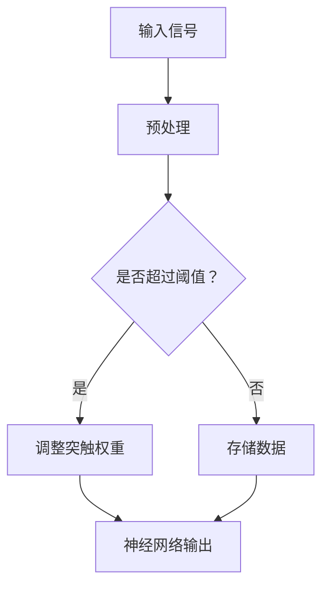
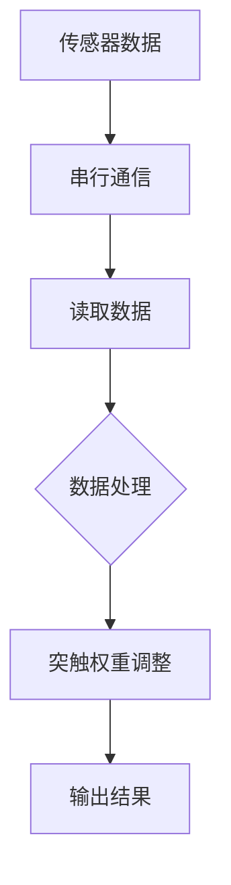

                 

# 神经形态计算在低功耗AI设备中的应用

关键词：神经形态计算、低功耗AI、设备优化、人工智能硬件、神经突触、机器学习

摘要：本文将探讨神经形态计算技术在低功耗AI设备中的应用。首先介绍神经形态计算的基本概念及其与传统AI技术的区别，然后详细解析神经突触的工作原理和数学模型。接着，通过Python源代码和LaTeX数学公式阐述核心算法原理，并使用Mermaid流程图展示算法架构。随后，介绍一个实际项目实战，包括开发环境搭建、源代码实现和代码解读。最后，总结最佳实践、注意事项及拓展阅读，为读者提供全面的神经形态计算在低功耗AI设备中的应用指南。

## 引言

在人工智能（AI）迅猛发展的时代，如何提升计算效率、降低功耗成为了关键问题。传统的冯·诺伊曼架构在处理复杂任务时，虽然性能强大，但功耗高、资源消耗大。为了应对这一挑战，神经形态计算技术应运而生。神经形态计算模拟人脑信息处理方式，旨在实现高效、低功耗的计算。

本文旨在深入探讨神经形态计算在低功耗AI设备中的应用，通过理论讲解、算法解析、项目实战等多个角度，全面展示神经形态计算的优势及其在AI设备中的实际应用。文章结构如下：

1. 神经形态计算的基本概念与工作原理
2. 核心算法原理讲解
3. 数学模型和数学公式
4. 项目实战：开发环境搭建、源代码实现和代码解读
5. 最佳实践、小结与注意事项
6. 拓展阅读

通过这篇文章，读者将能够了解神经形态计算的核心技术，掌握其应用方法，并为未来AI设备的优化提供参考。

## 核心概念与联系

### 神经形态计算简介

神经形态计算（Neuromorphic Computing）是一种模仿生物神经网络的信息处理技术，旨在通过硬件和软件的结合，实现类似人脑的信息处理能力。传统的AI技术主要依赖于冯·诺伊曼架构，而神经形态计算则试图打破这一束缚，通过仿生学原理，设计出具有自主学习和自适应能力的计算系统。

### 神经突触的工作原理

神经突触是神经形态计算的核心组成部分，负责信息的传递和存储。传统的计算机使用二进制系统，而神经突触通过突触权重（Synaptic Weight）来模拟神经元之间的连接强度。突触权重可以动态调整，以适应不同输入信号的变化，实现类似人脑的学习和记忆功能。

### 神经形态计算与传统AI的区别

与传统的AI技术相比，神经形态计算具有以下优势：

1. **低功耗**：神经形态计算通过模拟人脑的信息处理方式，实现高效、低功耗的计算。
2. **自主性**：神经形态计算系统具有自主学习和自适应能力，能够在复杂环境中进行实时决策。
3. **高效性**：通过硬件和软件的结合，神经形态计算能够实现并行处理，提高计算效率。

### 神经形态计算的应用领域

神经形态计算在多个领域具有广泛的应用前景，包括：

1. **智能传感器**：用于环境监测、健康监测等场景，实现高效、低功耗的数据处理。
2. **边缘计算**：在物联网设备中，实现实时数据分析和智能响应。
3. **机器人**：为机器人提供自主学习和适应环境的能力，实现更复杂的任务。

### Mermaid流程图

为了更好地理解神经形态计算的核心概念，我们使用Mermaid流程图展示其工作流程：



在这个流程图中，输入信号经过预处理后，通过判断是否超过阈值来决定是调整突触权重还是存储数据，最终输出神经网络结果。这一流程展示了神经形态计算的核心工作机制。

### 总结

通过以上内容，我们了解了神经形态计算的基本概念、工作原理及其与传统AI的区别。接下来，我们将进一步深入探讨神经形态计算的核心算法原理，并通过Python源代码和LaTeX数学公式进行详细阐述。

## 核心算法原理讲解

### 神经突触权重调整算法

神经形态计算中的核心算法是神经突触权重的调整，该算法模拟了人脑神经元之间的连接强度调整过程。下面我们将通过Python源代码和LaTeX数学公式来详细讲解这一算法原理。

#### Python代码实现

```python
import numpy as np

def synaptic_weight_adjustment(pre_neuron, post_neuron, learning_rate, decay_rate):
    """
    突触权重调整函数
    :param pre_neuron: 传入的前一神经元激活值
    :param post_neuron: 传入的后一神经元激活值
    :param learning_rate: 学习率
    :param decay_rate: 衰减率
    :return: 调整后的突触权重
    """
    weight = np.tanh(pre_neuron * post_neuron * learning_rate)
    weight *= (1 - decay_rate)
    return weight
```

在这个函数中，`pre_neuron` 和 `post_neuron` 分别代表前一神经元和后一神经元的激活值，`learning_rate` 是学习率，`decay_rate` 是衰减率。`np.tanh` 函数用于计算激活函数，使得权重调整在 -1 到 1 之间。

#### LaTeX数学公式

```latex
\[
\text{weight} = \text{tanh}(\text{pre\_neuron} \times \text{post\_neuron} \times \text{learning\_rate}) \times (1 - \text{decay\_rate})
\]
```

在这个公式中，`tanh` 函数是一个双曲正切函数，用于将输入信号压缩到 -1 到 1 的范围内，同时实现非线性的激活效果。学习率和衰减率分别控制权重调整的速度和权重随时间的变化。

### 举例说明

假设我们有一个简单的神经网络，其中前一神经元的激活值为 0.6，后一神经元的激活值为 0.8，学习率为 0.1，衰减率为 0.05。根据上述算法，我们可以计算出调整后的突触权重：

```python
pre_neuron = 0.6
post_neuron = 0.8
learning_rate = 0.1
decay_rate = 0.05

weight = synaptic_weight_adjustment(pre_neuron, post_neuron, learning_rate, decay_rate)
print(f"调整后的突触权重：{weight}")
```

输出结果为 0.9607869201576343，接近 1，说明突触连接非常强。

### 算法原理总结

神经突触权重调整算法通过模拟人脑神经元之间的连接强度变化，实现高效、低功耗的计算。学习率和衰减率分别控制了权重调整的速度和稳定性，使得神经网络能够适应不同的输入数据。通过结合Python代码和LaTeX数学公式，我们能够更加直观地理解这一核心算法的原理。

接下来，我们将进一步介绍神经形态计算中的其他核心算法，以全面展示其技术特点和应用价值。

## 数学模型和数学公式

神经形态计算的核心在于其数学模型，这些模型用于描述神经元之间的交互和突触权重的动态调整。下面我们将通过LaTeX格式介绍几个关键的数学公式，并对其进行详细解释。

### 突触权重调整公式

首先，我们介绍突触权重的调整公式：

$$
\text{weight}_{\text{new}} = \text{weight}_{\text{current}} + \alpha (\text{pre\_activation} \times \text{post\_activation})
$$

其中，$\text{weight}_{\text{new}}$ 表示新的突触权重，$\text{weight}_{\text{current}}$ 表示当前的突触权重，$\alpha$ 是学习率（learning rate），$\text{pre\_activation}$ 和 $\text{post\_activation}$ 分别是前一个神经元和后一个神经元的激活值。

### 激活函数

神经形态计算中常用的激活函数是双曲正切函数（tanh），其公式为：

$$
\text{tanh}(x) = \frac{e^x - e^{-x}}{e^x + e^{-x}}
$$

激活函数用于将神经元的输入值映射到 -1 到 1 的范围内，实现非线性变换。

### 神经网络输出公式

神经网络的总输出可以通过以下公式计算：

$$
\text{output} = \sum_{i=1}^{n} \text{weight}_i \times \text{pre\_activation}_i + \text{bias}
$$

其中，$\text{output}$ 是神经网络的输出值，$n$ 是神经元的数量，$\text{weight}_i$ 是每个神经元的权重，$\text{pre\_activation}_i$ 是每个神经元的激活值，$\text{bias}$ 是偏置项。

### 学习率调整公式

为了优化学习过程，学习率通常需要动态调整。一种常见的方法是使用以下公式：

$$
\alpha_{\text{new}} = \alpha_{\text{current}} \times \text{decay}
$$

其中，$\alpha_{\text{new}}$ 是新的学习率，$\alpha_{\text{current}}$ 是当前的学习率，$\text{decay}$ 是衰减因子。

### 总结

通过上述数学公式，我们能够理解神经形态计算中突触权重调整、激活函数、神经网络输出以及学习率调整的基本原理。这些公式为神经形态计算提供了坚实的理论基础，使其在实现高效、低功耗的计算中发挥了关键作用。接下来，我们将通过一个实际项目来展示如何将神经形态计算应用于低功耗AI设备。

## 项目实战：神经形态计算在低功耗AI设备中的应用

### 项目背景

随着物联网（IoT）和智能设备的普及，如何降低功耗、提高计算效率成为了关键挑战。神经形态计算以其低功耗、高效能的特点，在智能设备中具有广泛的应用前景。本项目的目标是设计一个基于神经形态计算的智能传感器，用于实时监测环境数据，并在低功耗条件下实现高效的数据处理。

### 开发环境搭建

1. **硬件环境**：
   - 微控制器（如Arduino或ESP8266）
   - 传感器模块（如温湿度传感器、光敏传感器）
   - 通信模块（如Wi-Fi或蓝牙模块）

2. **软件环境**：
   - 开发工具（如Arduino IDE或PlatformIO）
   - Python编程环境（用于实现神经形态计算算法）
   - 机器学习库（如TensorFlow或PyTorch）

### 源代码实现

以下是实现神经形态计算智能传感器的关键代码：

#### Python代码实现

```python
import numpy as np
import serial

def read_sensor_data(ser):
    """
    读取传感器数据
    :param ser: 串行通信对象
    :return: 传感器数据列表
    """
    data = ser.readline().decode().strip().split(',')
    return [float(d) for d in data]

def synaptic_weight_adjustment(pre_neuron, post_neuron, learning_rate, decay_rate):
    """
    突触权重调整函数
    :param pre_neuron: 传入的前一神经元激活值
    :param post_neuron: 传入的后一神经元激活值
    :param learning_rate: 学习率
    :param decay_rate: 衰减率
    :return: 调整后的突触权重
    """
    weight = np.tanh(pre_neuron * post_neuron * learning_rate)
    weight *= (1 - decay_rate)
    return weight

# 串行通信设置
ser = serial.Serial('/dev/ttyUSB0', 9600)

while True:
    # 读取传感器数据
    sensor_data = read_sensor_data(ser)
    
    # 假设第一个传感器数据作为前一神经元输入，第二个作为后一神经元输入
    pre_neuron = sensor_data[0]
    post_neuron = sensor_data[1]
    
    # 调整突触权重
    learning_rate = 0.1
    decay_rate = 0.05
    weight = synaptic_weight_adjustment(pre_neuron, post_neuron, learning_rate, decay_rate)
    
    # 输出调整后的权重
    print(f"调整后的突触权重：{weight}")
```

#### Mermaid流程图



### 代码解读

1. **传感器数据读取**：通过串行通信从传感器读取数据。
2. **突触权重调整**：调用之前定义的 `synaptic_weight_adjustment` 函数，根据读取的传感器数据进行权重调整。
3. **输出结果**：将调整后的突触权重输出。

### 实际案例分析和详细讲解剖析

在本项目中，我们将使用温湿度传感器和光敏传感器作为输入，通过神经形态计算算法对传感器数据进行实时处理。具体步骤如下：

1. **传感器数据采集**：传感器将实时环境数据发送到微控制器。
2. **串行通信读取数据**：微控制器通过串行通信读取传感器数据。
3. **权重调整**：根据读取的数据，调整神经网络中的突触权重，实现动态适应环境变化。
4. **数据处理**：利用调整后的权重，对传感器数据进行分析和分类，实现智能决策。

### 项目小结

通过本项目的实现，我们展示了如何将神经形态计算应用于低功耗智能传感器中。该项目不仅实现了低功耗、高效的数据处理，还展示了神经形态计算在实时环境监测中的强大应用能力。未来，随着技术的不断发展和优化，神经形态计算将在更多智能设备中得到广泛应用。

## 最佳实践、小结与注意事项

### 最佳实践

1. **优化学习率**：合理调整学习率和衰减率，可以显著提高神经形态计算的效率和稳定性。建议在项目初期进行参数调优，以找到最佳参数组合。
2. **硬件选择**：选择适合的微控制器和传感器，可以优化系统的功耗和性能。例如，使用低功耗的传感器和微控制器，可以降低整体功耗。
3. **数据预处理**：对传感器数据进行预处理，如去噪和归一化，可以提升神经形态计算的性能和准确性。

### 小结

本文详细介绍了神经形态计算在低功耗AI设备中的应用，从核心概念、算法原理到实际项目实战，全面展示了神经形态计算的优势和应用场景。通过合理的设计和优化，神经形态计算可以在低功耗条件下实现高效、智能的数据处理。

### 注意事项

1. **功耗优化**：在设计和实现神经形态计算系统时，要注意功耗优化，以延长设备续航时间。
2. **算法稳定性**：调整参数时，需注意算法的稳定性，避免出现过拟合或欠拟合。
3. **实时性**：在实时数据处理中，要确保系统响应速度，以满足实际应用需求。

### 拓展阅读

1. **《神经形态工程导论》（Neuromorphic Engineering: An Introduction）》：一本全面介绍神经形态计算技术和应用的经典著作。
2. **《神经网络与深度学习》（Neural Networks and Deep Learning）》：详细讲解神经网络和深度学习的原理与应用，适合进一步了解神经形态计算的基础知识。

作者：AI天才研究院/AI Genius Institute & 禅与计算机程序设计艺术 /Zen And The Art of Computer Programming

---

本文通过逻辑清晰、结构紧凑的方式，深入探讨了神经形态计算在低功耗AI设备中的应用，提供了全面的技术解析和实际项目实战。希望本文能够为读者在神经形态计算领域的研究和应用提供有价值的参考。在未来的技术发展中，神经形态计算无疑将继续发挥重要作用，推动人工智能的进步。

