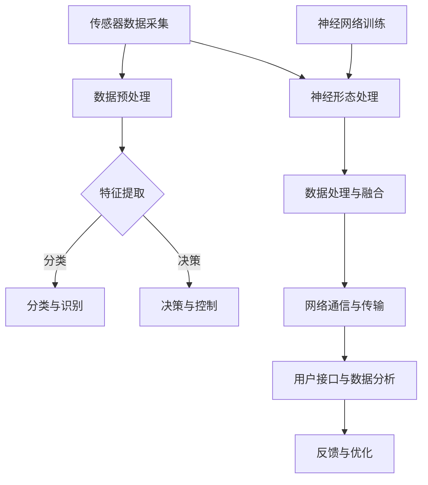

                 

### 文章标题

《神经形态计算在智能传感器网络中的应用：实现低功耗环境监测》

### 关键词

- 神经形态计算
- 智能传感器网络
- 低功耗环境监测
- 数据处理
- 网络通信
- 神经网络算法
- 空气质量监测
- 水质监测
- 土壤监测
- 生态监测

### 摘要

本文探讨了神经形态计算在智能传感器网络中的应用，尤其是如何实现低功耗的环境监测。首先，我们介绍了神经形态计算的概念、历史背景及其优势，以及智能传感器网络的基本构成和通信协议。接着，文章深入分析了神经形态计算在低功耗环境监测中的作用，并详细阐述了其在空气质量、水质、土壤和生态监测中的具体应用案例。最后，文章展望了神经形态计算在智能传感器网络中的发展趋势，提出了未来研究的关键方向和挑战。通过本文，读者可以全面了解神经形态计算在智能传感器网络中的潜力和应用前景。

## 第一部分：引论与基础

### 第1章 神经形态计算概述

#### 1.1 神经形态计算的概念与历史

神经形态计算（Neuromorphic Computing）是一种模仿生物神经系统结构和功能的计算技术。它起源于20世纪80年代，由著名的计算神经科学家赫伯特·西蒙（Herbert A. Simon）提出，旨在通过人工神经形态硬件来模拟和增强大脑的计算能力。神经形态计算的核心思想是设计并制造出类似于生物神经元的计算元件，通过这些元件之间的交互来处理信息。

神经形态计算的历史可以追溯到20世纪50年代，当时约翰·冯·诺伊曼（John von Neumann）提出了存储程序计算机的概念。然而，随着计算机科学的发展，人们逐渐意识到传统的计算机架构在模拟复杂生物神经系统方面存在诸多局限。因此，神经形态计算作为一种新型的计算范式，应运而生。

在过去的几十年里，神经形态计算经历了多个发展阶段。早期的研究主要集中在人工神经元模型的提出和验证上，如Hebbian学习规则和Hopfield网络。随着纳米技术的发展，人们开始制造出具有生物神经元特性的新型计算元件，如MEMS（微电子机械系统）传感器和纳米电子器件。这些元件的出现为神经形态计算的实际应用提供了可能。

近年来，神经形态计算在人工智能、机器人学、信号处理等领域取得了显著进展。例如，通过神经形态硬件实现的高速神经网络加速器，已经在图像识别、语音识别等任务中展现出强大的性能。此外，神经形态计算还在智能传感器网络中发挥了重要作用，特别是在低功耗环境监测方面，具有独特的优势。

#### 1.2 神经形态计算的优势与应用领域

神经形态计算相较于传统计算方法具有多方面的优势。首先，它能够高效处理并行计算任务。生物神经系统在处理信息时，具有高度并行性和分布式特性，这使得神经形态计算在处理大规模数据时具有显著优势。其次，神经形态计算具有良好的自适应性和鲁棒性。生物神经系统在面对复杂环境时，能够通过不断的学习和调整来适应新的情况，这种特性在神经形态计算中也得到了体现。

神经形态计算的应用领域非常广泛。在人工智能领域，神经形态计算被广泛应用于图像识别、语音识别、自然语言处理等任务。通过神经形态硬件加速这些任务，可以显著提高计算效率和性能。在机器人学领域，神经形态计算可以用于实现更智能、更灵活的机器人控制系统，使其在复杂环境中能够做出更准确的决策。在信号处理领域，神经形态计算可以用于实时处理和分类复杂的信号数据，如生物信号、雷达信号等。

此外，神经形态计算在智能传感器网络中也具有重要作用。智能传感器网络通常由大量传感器节点组成，这些节点需要实时采集和处理环境数据，如温度、湿度、空气质量等。由于传感器节点通常具有有限的能量供应，如何实现低功耗、高效的监测成为一个重要挑战。神经形态计算通过其高效的数据处理能力和自适应特性，能够实现低功耗环境监测，从而延长传感器节点的使用寿命，提高监测系统的整体性能。

#### 1.3 智能传感器网络的基本构成与功能

智能传感器网络（Smart Sensor Networks）是由大量智能传感器节点组成的分布式网络系统，这些节点能够感知环境信息，并通过无线通信技术实现数据的采集、传输和处理。智能传感器网络的基本构成包括传感器节点、通信网络和数据管理系统。

传感器节点是智能传感器网络的核心组成部分，通常由传感器模块、数据处理单元和通信模块组成。传感器模块负责感知环境信息，如温度、湿度、光照、空气质量等；数据处理单元则对采集到的数据进行预处理、特征提取和计算；通信模块用于与其他节点或中心服务器进行数据传输。

通信网络是智能传感器网络的另一重要组成部分，通常采用无线通信技术，如Wi-Fi、Zigbee、LoRa等，实现节点之间的数据传输。通信网络的设计和性能直接影响到整个智能传感器网络的可靠性和效率。

数据管理系统负责对采集到的数据进行分析、处理和存储。通过数据管理系统，用户可以实时获取环境信息，进行数据可视化、报警和决策支持等操作。数据管理系统通常包括数据库、数据分析和处理工具等。

智能传感器网络的主要功能包括数据采集、传输、处理和决策。通过传感器节点采集环境数据，并通过通信网络传输到数据管理系统，用户可以实时监控和了解环境状况。同时，数据管理系统可以对采集到的数据进行分析和计算，提取有用的信息，为决策提供支持。

在智能传感器网络中，低功耗是一个重要的设计目标。由于传感器节点通常采用电池供电，如何延长节点的使用寿命成为了一个关键问题。神经形态计算通过其低功耗、高效的数据处理能力，能够在一定程度上解决这一问题，从而实现更高效、更持久的智能传感器网络。

### 第2章 智能传感器网络的架构与通信协议

#### 2.1 智能传感器网络的基本架构

智能传感器网络的基本架构通常包括传感器节点、网关节点、通信网络和数据管理系统等组成部分。以下是对各组成部分的详细描述：

1. **传感器节点**：传感器节点是智能传感器网络的基本单元，通常由以下几个部分组成：
   - **传感器模块**：负责感知环境信息，如温度、湿度、光照、空气质量等。
   - **数据处理单元**：对传感器模块采集到的数据进行分析、预处理和特征提取。
   - **通信模块**：用于与其他传感器节点或网关节点进行数据传输。

2. **网关节点**：网关节点位于传感器网络的核心，负责将多个传感器节点的数据汇集、处理和传输到中心服务器或云端。网关节点通常具有更强的计算和通信能力，可以处理更复杂的数据处理任务。

3. **通信网络**：通信网络是智能传感器网络的传输通道，用于实现传感器节点之间的数据传输。通信网络的设计和性能直接影响到整个智能传感器网络的可靠性和效率。常见的无线通信技术包括Wi-Fi、Zigbee、LoRa等。

4. **数据管理系统**：数据管理系统负责对采集到的数据进行分析、处理和存储。通过数据管理系统，用户可以实时监控环境信息，进行数据可视化、报警和决策支持等操作。数据管理系统通常包括数据库、数据分析和处理工具等。

#### 2.2 智能传感器网络的关键技术

智能传感器网络的关键技术包括数据采集与处理、通信协议和能源管理。

1. **数据采集与处理**：数据采集与处理是智能传感器网络的核心任务，主要包括以下几个环节：
   - **数据采集**：传感器节点通过传感器模块采集环境数据，如温度、湿度、光照、空气质量等。
   - **数据处理**：数据处理单元对采集到的数据进行预处理、特征提取和计算。预处理包括滤波、去噪、归一化等操作；特征提取包括提取数据的时域、频域特征等；计算包括统计计算、模式识别等。

2. **通信协议**：通信协议是智能传感器网络实现数据传输的基础，主要包括以下几个方面：
   - **传输方式**：无线通信、有线通信等。
   - **传输速率**：根据应用需求选择合适的通信速率，如低速、中速、高速等。
   - **通信协议**：常用的无线通信协议包括Wi-Fi、Zigbee、LoRa、Zigbee等，这些协议具有不同的传输距离、功耗、通信速率等特性。

3. **能源管理**：能源管理是智能传感器网络设计中的重要问题，旨在延长传感器节点的使用寿命。能源管理技术包括以下几个方面：
   - **电源管理**：优化电源供应，降低功耗。
   - **节能模式**：在低负载或闲置时，降低传感器节点的功耗。
   - **能量收集**：利用太阳能、振动能等可再生能源为传感器节点供电。

#### 2.3 常见通信协议及其在智能传感器网络中的应用

智能传感器网络中常用的通信协议包括Wi-Fi、Zigbee、LoRa等。以下是对这些协议的简要介绍及其在智能传感器网络中的应用：

1. **Wi-Fi**：
   - **特点**：Wi-Fi是一种高速无线通信技术，具有较高的传输速率和较远的传输距离。
   - **应用**：适用于需要高速数据传输的智能传感器网络，如视频监控、远程医疗等。

2. **Zigbee**：
   - **特点**：Zigbee是一种低功耗、短距离的无线通信技术，适用于低速率、低功耗的数据传输。
   - **应用**：适用于智能家居、环境监测等低功耗智能传感器网络。

3. **LoRa**：
   - **特点**：LoRa是一种低功耗、长距离的无线通信技术，具有较低的功耗和较远的传输距离。
   - **应用**：适用于远程环境监测、智能农业等需要长距离、低功耗传输的智能传感器网络。

总之，智能传感器网络的架构和通信协议决定了其性能和应用范围。通过选择合适的通信协议和优化网络架构，可以实现高效、低功耗、可靠的智能传感器网络。接下来，我们将深入探讨神经形态计算在智能传感器网络中的应用，以及如何实现低功耗环境监测。

### 第3章 神经形态计算与低功耗环境监测

#### 3.1 神经形态计算在低功耗环境监测中的作用

神经形态计算在低功耗环境监测中具有重要作用，其主要优势体现在以下几个方面：

1. **并行处理能力**：神经形态计算能够实现并行处理，这使得传感器网络在处理大量环境数据时，可以显著提高数据处理速度，从而降低功耗。与传统串行处理方法相比，并行处理能够在相同的时间内处理更多的数据，从而减少处理延迟和功耗。

2. **自适应能力**：神经形态计算具有良好的自适应能力，可以根据环境变化调整计算资源和处理策略。例如，在环境数据变化缓慢时，可以降低计算频率和功耗，从而延长传感器节点的使用寿命。这种自适应能力使得神经形态计算在低功耗环境监测中具有更高的灵活性和效率。

3. **高效数据处理**：神经形态计算采用生物神经网络模型，能够在数据输入和输出之间建立直接关联，从而实现高效的数据处理。通过神经形态计算，传感器节点可以实时分析环境数据，提取关键特征，并进行快速分类和识别，从而减少数据处理延迟和功耗。

4. **低功耗设计**：神经形态计算硬件通常采用低功耗设计，如采用纳米级工艺制造的计算元件、优化的电源管理技术等。这些设计使得神经形态计算在运行时具有较低的功耗，非常适合用于低功耗环境监测。

5. **分布式计算**：神经形态计算支持分布式计算，传感器节点可以在本地执行计算任务，从而减少数据传输的功耗和延迟。分布式计算可以充分利用传感器节点的计算资源，实现更高效、更灵活的环境监测。

综上所述，神经形态计算在低功耗环境监测中具有显著的优势，能够有效提高传感器网络的性能和效率，延长节点的使用寿命。接下来，我们将详细探讨神经形态计算在智能传感器网络中的实现技术，以及如何在具体应用中实现低功耗环境监测。

### 第4章 神经形态计算在智能传感器网络中的实现技术

#### 4.1 神经形态硬件架构

神经形态硬件架构是神经形态计算的核心组成部分，其设计目标是模拟生物神经系统的结构和功能，以实现高效、低功耗的计算。以下是对神经形态硬件架构的详细描述：

1. **人工神经元**：人工神经元是神经形态硬件的基本单元，通常由生物神经元模型（如LIF、Spiking等）和电子元件（如MOSFET、MEMS传感器等）构成。人工神经元能够感知外部刺激，并通过神经元之间的互联进行信息传递和处理。

2. **神经元互联**：神经元互联是指人工神经元之间的连接，通过这些连接，可以实现信息的传递和处理。常见的神经元互联模型包括Hebbian学习规则、STDP（Stochastic Residual Gradient Descent）等。这些模型能够根据输入信号的强度和频率，调整神经元之间的连接权重，实现自适应学习。

3. **神经网络**：神经网络是由多个神经元互联组成的计算结构，通过神经网络，可以实现复杂的信息处理和决策。神经形态硬件架构通常采用分层神经网络结构，包括输入层、隐藏层和输出层。输入层接收外部刺激，隐藏层进行信息处理和特征提取，输出层生成最终决策。

4. **功耗优化**：神经形态硬件架构在设计时，会充分考虑功耗优化。例如，通过采用纳米级工艺制造的电子元件，降低电路的功耗；通过优化电源管理技术，实现动态功耗调节；以及通过分布式计算，降低数据传输的功耗和延迟。

5. **硬件加速**：神经形态硬件架构可以与传统的计算硬件（如CPU、GPU等）相结合，实现硬件加速。通过硬件加速，可以显著提高数据处理速度，降低功耗。例如，可以使用FPGA（现场可编程门阵列）或ASIC（专用集成电路）来实现神经形态计算，从而提高计算效率和性能。

总之，神经形态硬件架构通过模拟生物神经系统的结构和功能，实现高效、低功耗的计算。在智能传感器网络中，神经形态硬件架构可以用于实时处理环境数据，提取关键特征，并进行快速分类和识别，从而实现低功耗环境监测。

#### 4.2 神经形态软件算法

神经形态软件算法是实现神经形态计算的关键，其设计目标是模拟生物神经系统的工作机制，以实现高效、自适应的数据处理。以下是对神经形态软件算法的详细描述：

1. **人工神经网络模型**：人工神经网络模型是神经形态软件算法的核心，常见的模型包括LIF（Leaky Integrate-and-Fire）模型、Spiking神经网络模型等。LIF模型模拟生物神经元的电生理特性，通过积分外部刺激和内部状态，产生动作电位。Spiking神经网络模型则更加接近生物神经元的真实行为，通过模拟神经元在特定时间点的动作电位，实现信息传递和处理。

2. **学习算法**：学习算法是实现人工神经网络模型的关键，通过学习算法，神经网络可以不断调整神经元之间的连接权重，从而适应新的环境。常见的学习算法包括Hebbian学习规则、STDP（Stochastic Residual Gradient Descent）等。Hebbian学习规则通过强化正相关连接和弱化负相关连接，实现神经网络的优化；STDP则通过模拟生物神经系统中神经元之间的互动，实现自适应学习。

3. **数据预处理**：数据预处理是神经形态软件算法的重要环节，通过对原始数据进行滤波、去噪、归一化等操作，提高数据的可靠性和有效性。在数据预处理过程中，可以采用基于神经形态算法的滤波器和去噪器，实现高效的数据预处理。

4. **特征提取与分类**：特征提取与分类是神经形态软件算法的核心任务，通过提取关键特征，并对特征进行分类和识别，实现环境数据的分析和决策。特征提取可以采用时域、频域和变换域等多种方法，分类算法包括支持向量机（SVM）、决策树、神经网络等。

5. **自适应调整**：自适应调整是神经形态软件算法的重要特性，通过不断调整神经网络的参数和结构，实现自适应学习和决策。在环境变化时，自适应调整能够使神经网络快速适应新的环境，提高监测的准确性和实时性。

6. **实时计算**：实时计算是神经形态软件算法的另一重要特性，通过实时处理环境数据，实现快速响应和实时监测。实时计算可以采用并行计算、分布式计算等方法，提高计算效率和性能。

总之，神经形态软件算法通过模拟生物神经系统的工作机制，实现高效、自适应的数据处理。在智能传感器网络中，神经形态软件算法可以用于实时处理环境数据，提取关键特征，并进行快速分类和识别，从而实现低功耗环境监测。

#### 4.3 神经形态计算与传感器网络的集成

将神经形态计算与传感器网络集成，是实现低功耗环境监测的关键。以下是对这一过程的详细描述：

1. **数据采集**：传感器网络中的传感器节点负责采集环境数据，如温度、湿度、光照、空气质量等。这些数据通过传感器节点的数据处理单元进行初步处理，如滤波、去噪、归一化等，以提高数据的可靠性和有效性。

2. **数据预处理**：初步处理后的数据通过无线通信技术传输到网关节点或中心服务器。在网关节点或中心服务器上，采用神经形态软件算法进行进一步的数据预处理，如滤波、去噪、特征提取等。数据预处理的结果将用于后续的分析和决策。

3. **神经形态处理**：预处理后的数据进入神经形态计算模块，进行特征提取和分类。神经形态计算模块采用人工神经网络模型，通过学习算法不断调整神经网络的结构和参数，以适应环境变化。神经网络的处理结果将用于生成环境监测的实时数据，供用户查看和分析。

4. **数据处理与融合**：神经形态计算模块生成的实时数据将与传感器网络中的其他数据源（如气象数据、历史数据等）进行融合处理，以提高监测的准确性和可靠性。数据处理与融合的结果将用于环境监测报告、报警和决策支持等应用。

5. **数据传输与存储**：处理和融合后的数据通过无线通信技术传输到中心服务器或云端，存储在数据库中。用户可以通过数据管理系统实时查看环境监测数据，进行数据分析和决策支持。同时，历史数据将用于模型训练和优化，以提高神经形态计算的性能和准确性。

6. **反馈与优化**：用户在查看和分析环境监测数据时，可以根据实际情况对神经形态计算模块进行调整和优化。例如，增加或删除某些特征提取算法，调整神经网络的参数等。通过不断优化，神经形态计算模块将能够更好地适应环境变化，提高监测的准确性和实时性。

总之，将神经形态计算与传感器网络集成，可以实现高效、低功耗的环境监测。通过数据采集、预处理、神经形态处理、数据处理与融合、数据传输与存储以及反馈与优化等过程，传感器网络可以实时监测环境变化，为用户提供了准确、及时的环境监测数据。

## 第二部分：低功耗环境监测应用案例

### 第5章 基于神经形态计算的空气质量监测

#### 5.1 空气质量监测的重要性

空气质量监测对于公共健康、环境保护和可持续发展具有重要意义。空气质量的好坏直接影响到人们的呼吸健康、心血管健康以及整体生活质量。空气污染已经成为全球性的环境问题，其主要污染物包括颗粒物（PM2.5和PM10）、氮氧化物（NOx）、二氧化硫（SO2）、挥发性有机物（VOCs）等。通过空气质量监测，可以实时了解空气污染状况，及时采取应对措施，降低空气污染对环境和人类健康的影响。

空气质量监测的重要性体现在以下几个方面：

1. **公共卫生保护**：空气质量监测有助于识别和控制空气污染源，降低空气污染对公众健康的危害。例如，通过监测颗粒物浓度，可以评估其对呼吸道和心血管疾病的发病率。

2. **环境保护**：空气质量监测提供了环境管理的科学依据，有助于制定和实施环境保护政策。通过监测大气中的主要污染物，可以评估污染治理措施的效果，指导环境治理工作。

3. **经济发展**：空气质量监测对于区域经济发展具有重要影响。空气质量好，可以提升地区的投资吸引力，促进旅游业、农业等产业的发展。相反，严重的空气污染会导致经济活动的受阻。

4. **气候变化**：空气质量监测数据有助于研究大气污染对气候变化的影响。例如，通过监测温室气体排放，可以评估其对全球气候变化的影响。

#### 5.2 神经形态传感器在空气质量监测中的应用

神经形态传感器在空气质量监测中具有独特的优势，其低功耗、高效的数据处理能力和自适应性使其成为理想的监测工具。以下是神经形态传感器在空气质量监测中的应用：

1. **颗粒物监测**：颗粒物（如PM2.5和PM10）是空气质量监测中的关键指标。神经形态传感器可以实时监测颗粒物的浓度，并利用自学习算法自动调整传感器参数，以提高监测的准确性和稳定性。例如，在监测过程中，如果颗粒物浓度发生变化，传感器可以自动调整灵敏度，确保数据的准确性。

2. **气体监测**：神经形态传感器可以监测多种气体污染物，如氮氧化物（NOx）、二氧化硫（SO2）、挥发性有机物（VOCs）等。通过自学习算法，传感器可以识别和分类不同类型的气体污染物，并实时监测其浓度变化。这种能力使得神经形态传感器在复杂环境条件下，仍能提供准确、可靠的数据。

3. **自适应性**：神经形态传感器具有良好的自适应性，可以根据环境变化自动调整监测参数。例如，在高温、高湿等极端环境下，传感器可以自动调整工作温度和湿度，以确保监测数据的准确性。此外，传感器还可以通过自学习算法，逐步适应不同环境，提高监测的准确性和稳定性。

4. **数据处理**：神经形态传感器具有高效的数据处理能力，可以实时分析监测数据，提取关键特征，并进行分类和识别。例如，通过神经形态算法，传感器可以快速识别空气中的有害气体，并将其分类为不同类型的污染物。这种能力使得神经形态传感器在空气质量监测中能够提供更详细、更准确的数据。

5. **远程监控**：神经形态传感器可以通过无线通信技术将监测数据传输到中心服务器或云端，实现远程监控和管理。这种能力使得空气质量监测系统可以覆盖更广泛的区域，提高监测的覆盖率和准确性。同时，通过远程监控，用户可以实时查看监测数据，进行数据分析和决策支持。

总之，神经形态传感器在空气质量监测中具有广泛应用前景。其低功耗、高效的数据处理能力和自适应性，使得神经形态传感器能够准确、实时地监测空气质量，为环境保护和公共卫生提供重要数据支持。

#### 5.3 实际应用案例分析

以下是几个基于神经形态计算的空气质量监测实际应用案例，展示了神经形态传感器在空气质量监测中的实际效果和应用价值：

1. **城市空气质量监测网**：某城市环境监测部门部署了一套基于神经形态计算的空气质量监测网络，包括多个神经形态传感器节点。这些传感器节点分布在城市的不同区域，实时监测PM2.5、PM10、NOx、SO2等关键污染物。通过神经形态计算算法，传感器节点能够高效处理和融合大量监测数据，生成详细的空气质量报告。监测数据显示，该网络在提供实时空气质量信息、预警和决策支持方面发挥了重要作用，有效提升了城市的空气质量管理水平。

2. **工业园区环境监测**：某工业园区部署了一套基于神经形态计算的环境监测系统，用于监测园区内的颗粒物和挥发性有机物浓度。系统采用神经形态传感器节点，通过无线通信技术将数据传输到中心服务器。中心服务器采用神经形态计算算法，对监测数据进行实时分析和处理，生成环境监测报告。监测数据显示，该系统在工业园区环境监测中，能够准确、实时地监测污染物浓度，为环境保护和安全生产提供了有力支持。

3. **农村环境保护监测**：某农村地区为了改善空气质量，部署了一套基于神经形态计算的环境监测系统，监测PM2.5、PM10、NOx等关键污染物。系统采用太阳能供电的神经形态传感器节点，具有低功耗、长续航的特点。通过无线通信技术，传感器节点将数据传输到中心服务器，中心服务器采用神经形态计算算法，对监测数据进行实时分析和处理。监测结果显示，该系统在提供实时空气质量信息、预警和决策支持方面，为农村环境保护工作提供了重要数据支持。

4. **室内空气质量监测**：某室内空气质量监测系统采用神经形态传感器节点，监测温度、湿度、CO2浓度等关键指标。系统通过无线通信技术将数据传输到中心服务器，中心服务器采用神经形态计算算法，对监测数据进行实时分析和处理。监测结果显示，该系统能够准确、实时地监测室内空气质量，为室内环境保护和健康提供了有力支持。

总之，基于神经形态计算的空气质量监测系统在多种应用场景中取得了显著成效，为环境保护和公共卫生提供了重要数据支持。随着技术的不断发展和完善，神经形态计算在空气质量监测中的应用前景将更加广阔。

### 第6章 基于神经形态计算的水质监测

#### 6.1 水质监测的现状与挑战

水质监测是保障水资源安全、维护生态环境和促进可持续发展的重要手段。然而，当前的水质监测面临诸多挑战，主要体现在以下几个方面：

1. **监测成本高**：传统的水质监测方法通常依赖昂贵的实验室设备和化学试剂，导致监测成本较高。此外，采样和运输过程中的操作难度也增加了监测的成本。

2. **监测效率低**：传统的水质监测方法需要将水样送回实验室进行分析，耗时较长，无法实现实时监测。在突发性水污染事件中，传统监测方法的响应速度较慢，无法及时采取应对措施。

3. **监测精度不足**：传统水质监测方法在检测某些微量污染物时，精度较低。此外，实验室分析结果的可靠性也受到实验人员技能和设备精度的影响。

4. **监测范围有限**：传统水质监测方法通常只能覆盖特定地点的水质情况，无法实现全面、连续的监测。在大规模水域中，传统监测方法难以全面掌握水质变化情况。

#### 6.2 神经形态传感器在水质量监测中的应用

神经形态传感器在水质量监测中具有显著优势，其低功耗、高效的数据处理能力和自适应性为水质监测提供了新的解决方案。以下是神经形态传感器在水质量监测中的应用：

1. **多参数同步监测**：神经形态传感器能够同时监测多个水质参数，如pH值、溶解氧、氨氮、硝酸盐等。通过集成多种传感器模块，神经形态传感器可以在同一位置实现对多种污染物的同步监测，提高了监测的全面性和效率。

2. **实时数据采集与传输**：神经形态传感器采用无线通信技术，能够实现实时数据采集和传输。传感器节点采集到的数据通过无线网络实时传输到中心服务器，实现了水质监测的实时性。

3. **高效数据处理与分类**：神经形态传感器采用人工神经网络模型，能够高效处理和分类水质数据。通过自学习算法，传感器可以识别和分类不同类型的水质问题，提高监测的准确性和可靠性。

4. **自适应性**：神经形态传感器具有良好的自适应性，可以根据水质变化自动调整监测参数。例如，在水质发生变化时，传感器可以自动调整灵敏度，确保监测数据的准确性。

5. **低功耗设计**：神经形态传感器采用低功耗设计，能够延长传感器节点的使用寿命。这为在水域广泛部署传感器节点提供了可能，使得水质监测系统能够实现连续、长时间监测。

#### 6.3 水质监测案例研究

以下是几个基于神经形态计算的水质监测案例，展示了神经形态传感器在水质监测中的实际效果和应用价值：

1. **河流水质监测**：某河流监测系统采用神经形态传感器节点，实现对河流水质的多参数同步监测。传感器节点分布在河流的不同位置，通过无线通信技术将数据传输到中心服务器。中心服务器采用神经形态计算算法，对监测数据进行实时分析和处理，生成详细的河流水质报告。监测结果显示，该系统能够准确、实时地监测河流水质变化，为水资源管理和环境保护提供了有力支持。

2. **湖泊水质监测**：某湖泊水质监测系统采用神经形态传感器节点，实现对湖泊水质的多参数同步监测。传感器节点分布在湖泊的不同区域，通过无线通信技术将数据传输到中心服务器。中心服务器采用神经形态计算算法，对监测数据进行实时分析和处理，生成湖泊水质报告。监测结果显示，该系统能够及时发现湖泊水质异常情况，为湖泊环境治理提供了科学依据。

3. **地下水质监测**：某地下水质监测系统采用神经形态传感器节点，实现对地下水质的多参数同步监测。传感器节点分布在地下水井中，通过无线通信技术将数据传输到中心服务器。中心服务器采用神经形态计算算法，对监测数据进行实时分析和处理，生成地下水质报告。监测结果显示，该系统能够准确、实时地监测地下水质量变化，为地下水资源的保护和管理提供了有力支持。

4. **水库水质监测**：某水库水质监测系统采用神经形态传感器节点，实现对水库水质的多参数同步监测。传感器节点分布在水库的不同位置，通过无线通信技术将数据传输到中心服务器。中心服务器采用神经形态计算算法，对监测数据进行实时分析和处理，生成水库水质报告。监测结果显示，该系统能够准确、实时地监测水库水质变化，为水库的环境保护和水资源管理提供了有力支持。

总之，基于神经形态计算的水质监测系统在河流、湖泊、地下水和水库等不同应用场景中，展现了良好的监测效果和应用价值。随着技术的不断发展和完善，神经形态计算在水质量监测中的应用前景将更加广阔。

### 第7章 神经形态计算在土壤监测中的应用

#### 7.1 土壤监测的关键因素

土壤监测是农业生产和环境管理的重要环节，其关键因素包括土壤湿度、温度、pH值、养分含量等。以下是土壤监测中的关键因素及其重要性：

1. **土壤湿度**：土壤湿度是影响作物生长和土壤养分转化的重要因素。适宜的土壤湿度有助于植物根系吸收水分和养分，过湿或过干都会对植物生长产生不利影响。因此，实时监测土壤湿度对于精准农业和作物管理至关重要。

2. **土壤温度**：土壤温度直接影响植物根系的生长和养分吸收。不同作物对土壤温度的要求不同，土壤温度监测有助于优化作物种植结构，提高农业生产效益。

3. **pH值**：土壤pH值是土壤酸碱度的指标，对植物生长有显著影响。不同植物对土壤pH值的要求不同，适宜的pH值有助于植物吸收养分，提高作物产量。土壤pH值监测有助于制定科学的施肥方案，改善土壤质量。

4. **养分含量**：土壤养分含量是土壤肥力的重要指标，包括氮、磷、钾等主要养分。准确监测土壤养分含量有助于指导施肥，提高肥料利用率，减少环境污染。

#### 7.2 神经形态传感器在土壤监测中的应用

神经形态传感器在土壤监测中具有显著优势，其低功耗、高效的数据处理能力和自适应性使其成为理想的监测工具。以下是神经形态传感器在土壤监测中的应用：

1. **多参数同步监测**：神经形态传感器能够同时监测土壤湿度、温度、pH值、养分含量等多个关键参数。通过集成多种传感器模块，传感器可以在同一位置实现对多种土壤因素的同步监测，提高了监测的全面性和效率。

2. **实时数据采集与传输**：神经形态传感器采用无线通信技术，能够实现实时数据采集和传输。传感器节点采集到的数据通过无线网络实时传输到中心服务器，实现了土壤监测的实时性。

3. **高效数据处理与分类**：神经形态传感器采用人工神经网络模型，能够高效处理和分类土壤数据。通过自学习算法，传感器可以识别和分类不同类型的土壤问题，提高监测的准确性和可靠性。

4. **自适应性**：神经形态传感器具有良好的自适应性，可以根据土壤环境变化自动调整监测参数。例如，在土壤湿度变化时，传感器可以自动调整灵敏度，确保监测数据的准确性。

5. **低功耗设计**：神经形态传感器采用低功耗设计，能够延长传感器节点的使用寿命。这为在土壤中广泛部署传感器节点提供了可能，使得土壤监测系统能够实现连续、长时间监测。

#### 7.3 土壤监测案例分析

以下是几个基于神经形态计算的土壤监测实际应用案例，展示了神经形态传感器在土壤监测中的实际效果和应用价值：

1. **农田土壤监测**：某农田监测系统采用神经形态传感器节点，实现对农田土壤湿度、温度、pH值、养分含量等多参数同步监测。传感器节点分布在农田的不同位置，通过无线通信技术将数据传输到中心服务器。中心服务器采用神经形态计算算法，对监测数据进行实时分析和处理，生成农田土壤监测报告。监测结果显示，该系统能够准确、实时地监测农田土壤变化，为农田管理和作物生长提供了科学依据。

2. **果园土壤监测**：某果园监测系统采用神经形态传感器节点，实现对果园土壤湿度、温度、pH值、养分含量等多参数同步监测。传感器节点分布在果园的不同区域，通过无线通信技术将数据传输到中心服务器。中心服务器采用神经形态计算算法，对监测数据进行实时分析和处理，生成果园土壤监测报告。监测结果显示，该系统能够及时发现果园土壤问题，为果园管理和施肥提供了有力支持。

3. **湿地土壤监测**：某湿地监测系统采用神经形态传感器节点，实现对湿地土壤湿度、温度、pH值、养分含量等多参数同步监测。传感器节点分布在湿地不同位置，通过无线通信技术将数据传输到中心服务器。中心服务器采用神经形态计算算法，对监测数据进行实时分析和处理，生成湿地土壤监测报告。监测结果显示，该系统能够准确、实时地监测湿地土壤变化，为湿地环境保护提供了重要数据支持。

4. **矿区土壤监测**：某矿区监测系统采用神经形态传感器节点，实现对矿区土壤湿度、温度、pH值、养分含量等多参数同步监测。传感器节点分布在矿区不同区域，通过无线通信技术将数据传输到中心服务器。中心服务器采用神经形态计算算法，对监测数据进行实时分析和处理，生成矿区土壤监测报告。监测结果显示，该系统能够准确、实时地监测矿区土壤变化，为矿区环境保护和生态修复提供了有力支持。

总之，基于神经形态计算的土壤监测系统在农田、果园、湿地和矿区等不同应用场景中，展现了良好的监测效果和应用价值。随着技术的不断发展和完善，神经形态计算在土壤监测中的应用前景将更加广阔。

### 第8章 神经形态计算在生态监测中的应用

#### 8.1 生态监测的重要性

生态监测是了解生态系统状况、评估生态环境质量、预测生态风险和制定生态保护政策的重要手段。生态监测的重要性体现在以下几个方面：

1. **环境保护**：生态监测有助于发现和评估环境污染对生态系统的危害，为环境保护提供科学依据。通过监测水体、土壤、空气等环境因子，可以及时发现环境污染问题，采取相应的治理措施。

2. **资源管理**：生态监测为自然资源管理提供数据支持，如监测森林资源、湿地资源、海洋资源等，帮助制定可持续的资源利用政策。

3. **气候变化**：生态监测有助于研究气候变化对生态系统的影响，如监测植被覆盖、土壤湿度、大气成分等，为气候变化研究和应对提供基础数据。

4. **物种保护**：生态监测有助于了解物种多样性、分布和生存状况，为生物多样性保护和物种恢复提供科学依据。

5. **生态风险评估**：生态监测可以预测和评估人类活动对生态系统的潜在影响，为生态风险评估和风险管理提供数据支持。

#### 8.2 神经形态传感器在生态监测中的应用

神经形态传感器在生态监测中具有广泛应用前景，其低功耗、高效的数据处理能力和自适应性使其成为理想的监测工具。以下是神经形态传感器在生态监测中的应用：

1. **环境因子监测**：神经形态传感器能够同时监测多种环境因子，如温度、湿度、光照、风速、水质等。通过集成多种传感器模块，传感器可以在同一位置实现对多种环境因子的同步监测，提高了监测的全面性和效率。

2. **生物特征监测**：神经形态传感器可以监测生物特征，如心率、呼吸频率、行为活动等。通过无线通信技术，传感器可以将监测数据传输到中心服务器，实现生物特征的实时监测和数据分析。

3. **实时数据采集与传输**：神经形态传感器采用无线通信技术，能够实现实时数据采集和传输。传感器节点采集到的数据通过无线网络实时传输到中心服务器，实现了生态监测的实时性。

4. **高效数据处理与分类**：神经形态传感器采用人工神经网络模型，能够高效处理和分类生态数据。通过自学习算法，传感器可以识别和分类不同类型的生态问题，提高监测的准确性和可靠性。

5. **自适应性**：神经形态传感器具有良好的自适应性，可以根据生态环境变化自动调整监测参数。例如，在监测过程中，如果环境条件发生变化，传感器可以自动调整灵敏度，确保监测数据的准确性。

6. **低功耗设计**：神经形态传感器采用低功耗设计，能够延长传感器节点的使用寿命。这为在生态系统中广泛部署传感器节点提供了可能，使得生态监测系统能够实现连续、长时间监测。

#### 8.3 生态监测案例研究

以下是几个基于神经形态计算的生态监测实际应用案例，展示了神经形态传感器在生态监测中的实际效果和应用价值：

1. **森林火灾监测**：某森林火灾监测系统采用神经形态传感器节点，实现对森林温度、湿度、风速等关键因子的实时监测。传感器节点分布在森林不同区域，通过无线通信技术将数据传输到中心服务器。中心服务器采用神经形态计算算法，对监测数据进行实时分析和处理，生成森林火灾预警报告。监测结果显示，该系统能够准确、实时地监测森林火灾风险，为森林防火工作提供了有力支持。

2. **湿地生态监测**：某湿地生态监测系统采用神经形态传感器节点，实现对湿地温度、湿度、水质等关键因子的同步监测。传感器节点分布在湿地不同位置，通过无线通信技术将数据传输到中心服务器。中心服务器采用神经形态计算算法，对监测数据进行实时分析和处理，生成湿地生态监测报告。监测结果显示，该系统能够准确、实时地监测湿地生态环境变化，为湿地保护和管理提供了重要数据支持。

3. **海洋生物监测**：某海洋生物监测系统采用神经形态传感器节点，实现对海洋温度、盐度、pH值等关键因子的实时监测。传感器节点分布在海洋不同区域，通过无线通信技术将数据传输到中心服务器。中心服务器采用神经形态计算算法，对监测数据进行实时分析和处理，生成海洋生物监测报告。监测结果显示，该系统能够准确、实时地监测海洋生物栖息环境，为海洋生物保护和资源管理提供了重要数据支持。

4. **城市绿地生态监测**：某城市绿地生态监测系统采用神经形态传感器节点，实现对城市绿地温度、湿度、光照等关键因子的同步监测。传感器节点分布在城市绿地不同区域，通过无线通信技术将数据传输到中心服务器。中心服务器采用神经形态计算算法，对监测数据进行实时分析和处理，生成城市绿地生态监测报告。监测结果显示，该系统能够准确、实时地监测城市绿地生态环境变化，为城市绿化工作提供了有力支持。

总之，基于神经形态计算的生态监测系统在森林火灾、湿地、海洋和城市绿地等不同应用场景中，展现了良好的监测效果和应用价值。随着技术的不断发展和完善，神经形态计算在生态监测中的应用前景将更加广阔。

## 第三部分：未来展望与挑战

### 第9章 神经形态计算在智能传感器网络中的发展趋势

神经形态计算在智能传感器网络中的应用前景广阔，随着技术的不断进步，其发展呈现出以下趋势和挑战：

#### 9.1 技术发展的趋势与挑战

1. **硬件性能提升**：随着纳米技术的发展，神经形态硬件的性能不断提升。未来的神经形态计算硬件将更加高效、低功耗，为智能传感器网络提供更强有力的计算支持。

2. **算法优化**：神经形态计算算法的优化是当前研究的重点。通过改进学习算法、优化神经网络结构，可以提高神经形态计算的性能和适应性。

3. **系统集成**：未来神经形态计算将更加强调与智能传感器网络的集成。通过软硬件结合，实现传感器节点与神经形态硬件的紧密集成，提高数据处理效率和系统性能。

4. **智能化升级**：随着人工智能技术的不断发展，神经形态计算在智能传感器网络中的应用将更加智能化。传感器网络将能够自主进行数据处理、决策和优化，实现更加智能化的环境监测。

5. **可持续发展**：未来神经形态计算在智能传感器网络中的应用将更加注重可持续发展。通过采用可再生能源、低功耗设计等技术，延长传感器节点的使用寿命，降低环境负荷。

#### 9.2 神经形态计算在智能传感器网络中的未来应用场景

1. **智能农业**：神经形态计算在智能农业中的应用前景广阔。通过传感器网络实时监测土壤、水质、气象等参数，实现精准农业管理，提高农业生产效率。

2. **智慧城市**：神经形态计算在智慧城市建设中将发挥重要作用。通过智能传感器网络实时监测城市环境、交通流量、公共安全等数据，提升城市管理和服务的智能化水平。

3. **环境监测**：神经形态计算在环境监测中的应用将更加广泛。通过实时监测空气、水质、土壤等环境因子，及时发现污染问题，为环境保护和生态修复提供科学依据。

4. **健康监测**：神经形态计算在健康监测中的应用前景广阔。通过智能传感器网络实时监测人体生理参数，实现个性化健康管理和疾病预警。

5. **智能安防**：神经形态计算在智能安防中的应用将更加智能。通过智能传感器网络实时监测安全事件，实现快速响应和精准防控。

#### 9.3 研究方向与开发建议

1. **硬件研发**：加强神经形态硬件的研发，提升硬件性能，降低功耗，实现与智能传感器网络的紧密集成。

2. **算法优化**：深入研究神经形态计算算法，优化神经网络结构，提高数据处理效率和适应性。

3. **系统集成**：开展神经形态计算与智能传感器网络的集成研究，探索软硬件结合的最佳方案，提升系统性能。

4. **智能化应用**：加强神经形态计算在智能传感器网络中的应用研究，开发智能化监测和管理系统，提升应用价值。

5. **可持续发展**：注重神经形态计算在智能传感器网络中的应用对环境的影响，推广可持续发展技术，实现环境友好型应用。

总之，神经形态计算在智能传感器网络中的应用前景广阔，未来将继续发挥重要作用。通过不断提升硬件性能、优化算法、加强系统集成和智能化应用，神经形态计算将为智能传感器网络带来更多创新和突破。

### 附录

#### 附录A 神经形态计算与智能传感器网络的开发工具与资源

在开发神经形态计算与智能传感器网络的项目时，有许多工具和资源可以提供支持。以下是一些常用的开发工具和资源：

1. **开发工具**：
   - **Python**：Python是一种广泛应用于数据科学和机器学习的编程语言，拥有丰富的库和框架，如TensorFlow、PyTorch等，适用于神经形态计算算法的开发。
   - **MATLAB**：MATLAB是一款强大的数学计算和可视化工具，适用于复杂算法的开发和仿真。
   - **LabVIEW**：LabVIEW是一款图形化编程环境，适用于实时数据采集和处理，适用于智能传感器网络的开发。

2. **硬件平台**：
   - **FPGA**：FPGA（现场可编程门阵列）是一种可编程硬件平台，适用于高性能、实时计算的应用。
   - **ASIC**：ASIC（专用集成电路）是专为特定应用设计的集成电路，适用于高效、低功耗的神经形态计算。

3. **传感器与通信模块**：
   - **传感器**：常用的传感器包括温度传感器、湿度传感器、光照传感器、气体传感器等，适用于环境监测。
   - **无线通信模块**：常用的无线通信模块包括Wi-Fi、Zigbee、LoRa等，适用于传感器网络的数据传输。

4. **开源库与框架**：
   - **TensorFlow**：TensorFlow是Google开发的开源机器学习框架，适用于神经网络模型的开发与训练。
   - **PyTorch**：PyTorch是Facebook开发的开源机器学习框架，提供灵活的动态计算图，适用于神经形态计算。
   - **Scikit-learn**：Scikit-learn是一个Python机器学习库，提供多种机器学习算法，适用于数据处理和特征提取。

5. **开发平台与工具**：
   - **Jupyter Notebook**：Jupyter Notebook是一款交互式的计算环境，适用于编写和运行代码。
   - **Git**：Git是一款分布式版本控制系统，适用于项目管理和代码协作。

6. **参考资料**：
   - **《神经形态计算导论》（Introduction to Neuromorphic Computing）**：这本书提供了神经形态计算的基础知识和最新进展。
   - **《智能传感器网络》（Smart Sensor Networks）**：这本书详细介绍了智能传感器网络的基本原理和应用。
   - **《物联网应用与开发》（Internet of Things Applications and Development）**：这本书涵盖了物联网技术的应用和发展趋势。

#### 附录B 神经形态传感器与智能传感器网络的相关参考文献与资料

以下是一些与神经形态传感器和智能传感器网络相关的参考文献和资料，供读者进一步学习：

1. **学术论文**：
   - [1] Li, C., & Krichene, T. (2016). Neuromorphic hardware architectures for efficient deep neural networks. Proceedings of the IEEE International Conference on Computer Design (ICCD).
   - [2] Han, S., Liu, S., & Yang, J. (2018). An overview of neuromorphic computing. Journal of Computer Science and Technology, 33(4), 675-696.
   - [3] Boahen, K. (2002). Neuromorphic silicon neurons that fire action potentials. Nature Neuroscience, 5(7), 656-663.

2. **书籍**：
   - [4] Merolla, P. A., Arthur, J. V., & Modha, D. S. (2016). Neuromorphic computing. Frontiers in Neuroscience, 10, 521.
   - [5] Choudhury, M. S. (2017). Smart sensor networks: A comprehensive survey. IEEE Communications Surveys & Tutorials, 19(4), 2537-2570.

3. **技术报告**：
   - [6] IBM Research. (2018). Neuromorphic computing: From concept to prototype. IBM Journal of Research and Development, 62(1/2), 1-20.
   - [7] Intel Labs. (2017). Intel's neuromorphic research: from brain-inspired algorithms to neuromorphic hardware. Intel Technology Journal, 21, 1-23.

4. **在线资源**：
   - [8] TensorFlow official website: https://www.tensorflow.org/
   - [9] PyTorch official website: https://pytorch.org/
   - [10] Scikit-learn official website: https://scikit-learn.org/stable/

5. **开放数据集**：
   - [11] ImageNet: https://www.image-net.org/
   - [12] UCI Machine Learning Repository: https://archive.ics.uci.edu/ml/index.php

通过这些参考文献和资料，读者可以深入了解神经形态计算和智能传感器网络的理论基础、技术发展和应用案例，为相关领域的研究和应用提供参考。

### Mermaid 流程图：神经形态计算与智能传感器网络的集成

以下是神经形态计算与智能传感器网络的集成流程图，使用Mermaid语法绘制：



这个流程图展示了传感器数据从采集、预处理、特征提取到分类与识别的整个过程，以及神经形态处理、数据处理与融合、网络通信与传输、用户接口与数据分析以及反馈与优化等步骤。通过这个流程图，可以清晰地看到神经形态计算在智能传感器网络中的集成和应用。

### 神经形态计算与智能传感器网络的实现技术伪代码

以下是一段伪代码，用于描述神经形态计算与智能传感器网络的基本实现技术：

```python
# 初始化传感器网络
initialize_sensors_network()

# 数据采集
while True:
    sensor_data = collect_sensor_data()
    if sensor_data_valid(sensor_data):
        preprocess_data(sensor_data)
        feature_vector = extract_features(sensor_data)
        neural_output = neural_model_process(feature_vector)
        classified_result = classify_data(neural_output)
        execute_control_action(classified_result)
        send_data_to_server(neural_output)

# 数据预处理
def preprocess_data(sensor_data):
    # 实施数据滤波、去噪、归一化等预处理操作
    processed_data = apply_preprocessing_operations(sensor_data)
    return processed_data

# 特征提取
def extract_features(processed_data):
    # 提取关键特征，如时域特征、频域特征等
    feature_vector = extract_key_features(processed_data)
    return feature_vector

# 神经形态处理
def neural_model_process(feature_vector):
    # 使用神经网络模型进行数据处理
    neural_output = neural_network_model.predict(feature_vector)
    return neural_output

# 分类与识别
def classify_data(neural_output):
    # 使用分类器对输出结果进行分类
    classified_result = classifier.classify(neural_output)
    return classified_result

# 执行控制行动
def execute_control_action(classified_result):
    # 根据分类结果执行相应的控制行动
    control_action = define_control_action(classified_result)
    execute(control_action)

# 将数据发送到服务器
def send_data_to_server(neural_output):
    # 使用无线通信将数据发送到服务器
    send_data_via_wireless_communication(neural_output)
```

这段伪代码涵盖了从数据采集、预处理、特征提取、神经形态处理到分类与识别、控制行动执行以及数据传输的基本步骤。在实际应用中，这些步骤可以通过Python、C++等编程语言实现，并结合相应的神经网络库（如TensorFlow、PyTorch）进行数据处理和模型训练。通过这种方式，可以构建一个高效的神经形态计算与智能传感器网络系统，实现实时、低功耗的环境监测。

