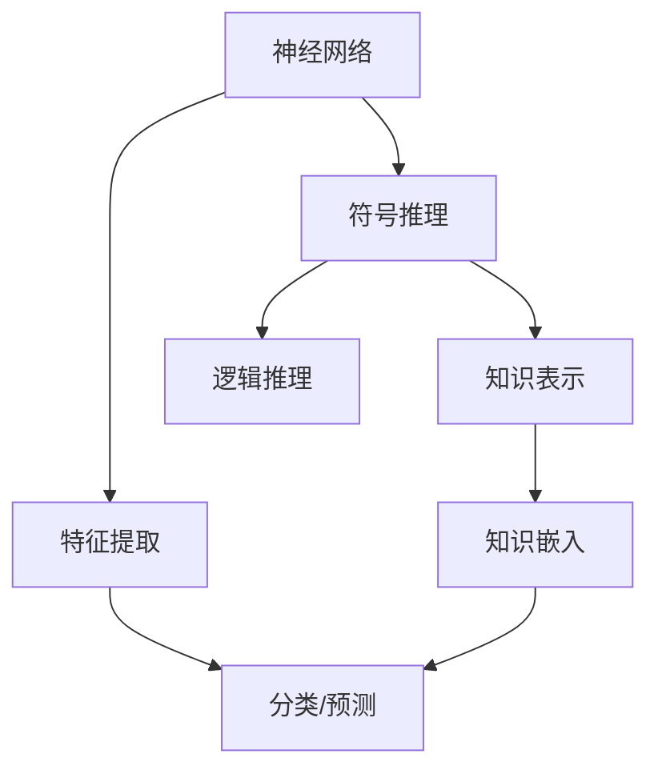

                 

### 引言

神经符号AI（Neural-Symbolic AI），顾名思义，是将神经网络与符号推理相结合的一种人工智能范式。在传统的AI系统中，深度学习模型凭借其强大的学习能力在图像识别、自然语言处理等领域取得了显著的成果。然而，这些模型在处理复杂任务时，往往依赖于大量的数据来训练，且缺乏解释性，难以进行符号推理。符号推理作为一种基于逻辑和知识的推理方式，能够处理抽象的概念和复杂的推理任务，但在处理大量数据和高维度特征时显得力不从心。

神经符号AI旨在弥补这一不足，它通过将神经网络与符号推理相结合，既保留了深度学习的强大学习能力，又具备符号推理的清晰解释性和逻辑推理能力。这种结合为人工智能的发展提供了新的可能，使得AI系统在处理复杂任务时能够更加智能和可靠。

本文将围绕神经符号AI这一主题展开讨论，首先介绍神经符号AI的基本概念、发展背景及其与深度学习的联系。接着，我们将深入探讨神经符号AI的核心算法原理，包括神经网络与符号推理的结合方式、典型的神经符号模型以及如何通过这些模型进行符号推理。随后，我们将分析神经符号AI在不同应用场景中的实际应用案例，探讨其优势和挑战。最后，本文将展望神经符号AI的未来发展方向，并提出一些最佳实践和注意事项。

本文结构如下：

- **第一部分：引言**：介绍神经符号AI的背景和重要性。
- **第二部分：基础理论**：详细阐述神经符号AI的基本概念和原理。
- **第三部分：核心算法**：讲解神经符号AI的核心算法，包括神经网络与符号推理的结合方式。
- **第四部分：应用场景**：分析神经符号AI在不同领域的应用。
- **第五部分：未来展望**：探讨神经符号AI的发展趋势和潜在挑战。
- **参考文献**：列出本文引用的文献资料。

### 关键词

- 神经符号AI
- 符号推理
- 深度学习
- 神经网络
- 人工智能
- 解释性
- 符号逻辑
- 图模型
- 知识表示

### 摘要

神经符号AI是一种结合神经网络和符号推理的新型人工智能范式，它旨在解决传统AI系统在处理复杂任务时的不足。本文首先介绍了神经符号AI的基本概念、发展背景及其与深度学习的联系，随后详细探讨了神经符号AI的核心算法原理，包括神经网络与符号推理的结合方式。接着，文章分析了神经符号AI在不同应用场景中的实际应用案例，并探讨了其优势和挑战。最后，本文展望了神经符号AI的未来发展方向，提出了最佳实践和注意事项。

----------------------------------------------------------------

# 神经符号AI：结合符号推理与深度学习

## 引言

神经符号AI（Neural-Symbolic AI），顾名思义，是将神经网络与符号推理相结合的一种人工智能范式。在传统的AI系统中，深度学习模型凭借其强大的学习能力在图像识别、自然语言处理等领域取得了显著的成果。然而，这些模型在处理复杂任务时，往往依赖于大量的数据来训练，且缺乏解释性，难以进行符号推理。符号推理作为一种基于逻辑和知识的推理方式，能够处理抽象的概念和复杂的推理任务，但在处理大量数据和高维度特征时显得力不从心。

### 背景介绍

神经符号AI的概念起源于对传统AI系统局限性的反思。深度学习模型虽然在一些任务上表现优异，但其“黑箱”特性使得其应用场景受到了限制。特别是在需要解释性、推理能力和知识表示的领域，如医学诊断、法律推理、自动程序设计等，深度学习模型的表现并不理想。符号推理在这些领域具有天然的优势，但传统的符号推理方法在处理高维度数据和复杂模式时效率低下。

因此，神经符号AI的提出旨在通过结合神经网络和符号推理，发挥两种方法的各自优势，构建一个更为智能和灵活的人工智能系统。神经符号AI的核心思想是：在保持深度学习模型强大学习能力的同时，引入符号推理的能力，使得AI系统能够在处理复杂任务时具备更强的解释性和推理能力。

### 神经符号AI的兴起

神经符号AI的兴起可以追溯到近年来的几个关键进展。首先，随着深度学习技术的不断发展，神经网络在处理大规模数据和高维度特征方面的能力得到了显著提升。其次，符号推理方法也在不断改进，特别是在组合逻辑推理、基于知识的推理等方面取得了重要突破。此外，图神经网络（Graph Neural Networks，GNN）的兴起也为神经符号AI提供了新的实现方式。

近年来，许多研究机构和学者开始关注神经符号AI的研究，并取得了一系列重要成果。例如，Google Research推出了名为“Symbolic AI”的研究项目，旨在探索如何将符号推理与深度学习相结合。此外，许多论文和书籍也开始探讨神经符号AI的理论和应用，如《Neural-Symbolic AI: Unifying Models for Representation Learning and Reasoning》（2021年）一书，系统性地介绍了神经符号AI的理论框架和应用场景。

### 符号推理与深度学习的结合

神经符号AI的核心在于将符号推理与深度学习相结合。符号推理是一种基于逻辑和知识的推理方式，能够处理抽象的概念和复杂的推理任务。而深度学习则通过学习大量的数据，自动提取特征并进行分类、预测等任务。将这两种方法结合起来，可以发挥它们各自的优势，实现更为智能和灵活的人工智能系统。

符号推理与深度学习的结合主要表现在以下几个方面：

1. **知识嵌入**：深度学习模型通过大量数据学习得到特征表示，而符号推理则利用知识图谱、逻辑规则等来表示知识。将知识嵌入到深度学习模型中，可以使得模型在处理复杂任务时具备更强的推理能力。

2. **推理机制**：深度学习模型通常缺乏解释性和推理能力，而符号推理则能够提供清晰的推理路径和逻辑关系。通过将符号推理机制引入深度学习模型，可以使得模型在处理任务时具备更强的可解释性和推理能力。

3. **数据增强**：符号推理可以利用先验知识对数据进行增强，提高深度学习模型的学习效果。例如，在自然语言处理任务中，符号推理可以提供词汇的含义、语法结构等信息，帮助深度学习模型更好地理解文本。

4. **模型融合**：通过将深度学习和符号推理模型进行融合，可以构建一个更为智能的AI系统。例如，可以使用深度学习模型进行特征提取和分类，然后利用符号推理模型进行推理和决策。

总之，神经符号AI的兴起为人工智能的发展带来了新的机遇。通过将符号推理与深度学习相结合，我们可以构建一个具备强大学习能力、解释能力和推理能力的人工智能系统，为解决复杂任务提供新的思路和方法。

## 第二部分：基础理论

### 2.1 神经符号AI概述

神经符号AI是一种结合神经网络与符号推理的人工智能范式，旨在解决传统AI系统在处理复杂任务时的不足。其核心思想是将深度学习模型的强大学习能力与符号推理的清晰解释性和逻辑推理能力相结合，构建一个更为智能和灵活的人工智能系统。

神经符号AI的基本概念包括：

1. **神经网络**：神经网络是一种模拟生物神经系统的计算模型，通过学习大量的数据，自动提取特征并进行分类、预测等任务。神经网络的核心优势在于其强大的学习能力，可以在各种复杂任务中取得优异的性能。

2. **符号推理**：符号推理是一种基于逻辑和知识的推理方式，能够处理抽象的概念和复杂的推理任务。符号推理的核心优势在于其清晰的解释性和逻辑推理能力，使得AI系统在处理任务时具备更强的可解释性和推理能力。

3. **知识表示**：知识表示是神经符号AI的重要组成部分，包括如何将知识和信息表示为计算机可以处理的形式。常见的知识表示方法包括知识图谱、逻辑规则、语义网络等。

4. **推理机制**：推理机制是神经符号AI的核心组成部分，用于实现符号推理过程。常见的推理机制包括基于规则推理、基于模型推理、组合推理等。

### 核心概念与联系

为了更好地理解神经符号AI的核心概念与联系，我们可以通过一个Mermaid流程图来展示：

在这个流程图中，神经网络负责特征提取和分类/预测，符号推理负责逻辑推理和知识表示。知识表示通过将知识嵌入到神经网络中，提高了神经网络在处理复杂任务时的性能。通过这种结合，神经符号AI可以发挥深度学习与符号推理的优势，实现更为智能和灵活的人工智能系统。

### 深度学习基础

深度学习是神经符号AI的核心组成部分，它通过模拟人脑神经网络的结构和功能，实现对复杂数据的处理和分析。以下是深度学习的一些基础概念：

1. **神经元**：神经元是神经网络的基本单元，它通过接收输入信号，经过加权处理和激活函数后产生输出。神经元的结构通常包括输入层、隐藏层和输出层。

2. **激活函数**：激活函数用于引入非线性因素，使得神经网络具有分类和预测能力。常见的激活函数包括 sigmoid、ReLU、Tanh 等。

3. **损失函数**：损失函数用于衡量神经网络输出与真实值之间的差距，常见的损失函数包括均方误差（MSE）、交叉熵（Cross-Entropy）等。

4. **反向传播**：反向传播是一种训练神经网络的方法，通过计算输出误差，反向传播误差到各层神经元，更新各层神经元的权重，从而优化神经网络模型。

5. **优化算法**：优化算法用于调整神经网络模型参数，以减少损失函数的值。常见的优化算法包括梯度下降（Gradient Descent）、Adam优化器等。

### 符号推理基础

符号推理是一种基于逻辑和知识的推理方法，它在处理抽象概念和复杂推理任务方面具有天然的优势。以下是符号推理的一些基础概念：

1. **命题逻辑**：命题逻辑是符号推理的基础，它通过命题和逻辑运算符来表示命题之间的关系。常见的逻辑运算符包括与（AND）、或（OR）、非（NOT）等。

2. **谓词逻辑**：谓词逻辑是命题逻辑的扩展，它引入了变量和量词，可以表示更复杂的命题关系。常见的量词包括全称量词（∀）和存在量词（∃）。

3. **知识表示**：知识表示是符号推理的重要组成部分，它用于将知识和信息表示为计算机可以处理的形式。常见的知识表示方法包括知识图谱、逻辑规则、语义网络等。

4. **推理算法**：推理算法是符号推理的核心，它通过逻辑推理规则和知识表示来推导出新的结论。常见的推理算法包括基于规则的推理、基于模型的推理、组合推理等。

### 神经符号AI的融合原理

神经符号AI的融合原理在于将神经网络和符号推理相结合，以发挥它们各自的优势。以下是神经符号AI融合原理的一些关键点：

1. **知识嵌入**：通过将符号推理中的知识嵌入到神经网络中，可以提高神经网络在处理复杂任务时的性能。知识嵌入可以通过以下方法实现：

   - **图嵌入**：将知识表示为图结构，然后使用图嵌入算法将图中的节点和边嵌入到高维空间中，从而将知识表示为神经网络可以处理的特征向量。
   - **规则嵌入**：将符号推理中的规则转换为神经网络中的权重和偏置，从而将规则嵌入到神经网络中。

2. **推理机制**：通过将符号推理的推理机制引入到神经网络中，可以提高神经网络在处理推理任务时的性能。推理机制可以通过以下方法实现：

   - **模块化推理**：将神经网络划分为多个模块，每个模块负责特定的推理任务，从而实现模块化推理。
   - **混合推理**：将神经网络和符号推理相结合，实现混合推理机制，从而提高推理任务的性能和可解释性。

3. **数据增强**：通过符号推理对数据进行增强，可以提高深度学习模型的学习效果。数据增强可以通过以下方法实现：

   - **知识引导的数据增强**：利用符号推理中的知识对数据进行增强，从而提高模型对复杂任务的泛化能力。
   - **逻辑约束的数据增强**：利用逻辑规则对数据进行约束，从而提高模型对数据的一致性和可靠性。

4. **模型融合**：通过将神经网络和符号推理模型进行融合，可以构建一个更为智能和灵活的人工智能系统。模型融合可以通过以下方法实现：

   - **级联模型**：将神经网络和符号推理模型级联起来，从而实现模型融合。
   - **多任务学习**：将神经网络和符号推理模型应用于多个任务，从而实现多任务学习。

通过以上方法，神经符号AI可以充分发挥神经网络和符号推理的优势，实现更为智能和灵活的人工智能系统。在处理复杂任务时，神经符号AI不仅能够具备强大的学习能力，还能够具备清晰的解释性和推理能力，从而为人工智能的发展提供新的机遇和思路。

### 核心算法原理

神经符号AI的核心算法原理在于如何将神经网络与符号推理相结合，以实现强大的学习能力和解释性推理能力。以下是神经符号AI核心算法的一些原理和实现方法。

#### 神经网络与符号推理的结合方式

1. **知识嵌入**：知识嵌入是将符号推理中的知识表示转换为神经网络中的特征，以便神经网络能够利用这些知识进行学习。知识嵌入通常通过以下方法实现：

   - **图嵌入**：使用图神经网络（GNN）将知识表示为图结构，然后通过图嵌入算法将图中的节点和边嵌入到高维空间中。这些嵌入的特征可以作为神经网络的输入，从而增强神经网络的学习能力。
   - **规则嵌入**：将符号推理中的逻辑规则转换为神经网络中的权重和偏置，使得神经网络在训练过程中能够利用这些规则进行推理。

2. **推理模块**：在神经网络中集成符号推理模块，使得神经网络在处理任务时能够进行符号推理。推理模块可以通过以下方法实现：

   - **模块化推理**：将神经网络划分为多个模块，每个模块负责特定的推理任务。例如，一个模块负责提取特征，另一个模块负责进行符号推理。
   - **混合推理**：将神经网络和符号推理模型进行级联，使得神经网络在处理任务时能够利用符号推理模块进行推理。

3. **解释性增强**：通过将符号推理机制引入到神经网络中，增强神经网络的解释性。解释性增强可以通过以下方法实现：

   - **可解释性网络**：设计专门的可解释性神经网络结构，使得神经网络在处理任务时能够提供清晰的推理路径和逻辑关系。
   - **解释性嵌入**：将符号推理中的解释性嵌入到神经网络中，使得神经网络在输出结果时能够提供解释。

#### 典型的神经符号模型

1. **Neural-Symbolic Machines (NSM)**：Neural-Symbolic Machines 是一种基于图神经网络的神经符号模型，它通过将知识表示为图结构，并在神经网络中集成符号推理模块，实现了神经网络与符号推理的有机结合。

   - **知识嵌入**：NSM 使用图嵌入算法将知识表示为节点和边的高维特征向量，这些特征向量作为神经网络的输入。
   - **推理模块**：NSM 使用组合推理模块，结合神经网络和符号推理的能力，进行复杂的推理任务。

2. **Symbolic Regression with Neural Networks (SRNN)**：Symbolic Regression with Neural Networks 是一种基于神经网络和符号推理的组合模型，它通过将神经网络和符号回归相结合，实现了对复杂函数的自动推导。

   - **知识嵌入**：SRNN 将符号表示为神经网络的输入，并在训练过程中通过神经网络学习符号之间的依赖关系。
   - **推理模块**：SRNN 使用符号回归模块，结合神经网络和符号推理的能力，推导出表示输入数据的函数。

3. **Neural-Symbolic Mixture Model (NSMM)**：Neural-Symbolic Mixture Model 是一种基于混合模型的神经符号模型，它通过将神经网络和符号推理模型进行级联，实现了神经网络与符号推理的有机结合。

   - **知识嵌入**：NSMM 使用神经网络对数据进行特征提取，并将提取的特征作为符号推理模型的输入。
   - **推理模块**：NSMM 使用混合模型，结合神经网络和符号推理的能力，进行复杂的数据分析和推理任务。

#### 如何通过这些模型进行符号推理

1. **数据预处理**：在符号推理之前，需要对数据进行预处理，包括数据清洗、数据转换和数据增强等。数据预处理的目的在于为符号推理提供高质量的数据输入。

2. **知识表示**：将知识表示为计算机可以处理的形式，例如图结构、逻辑规则、语义网络等。知识表示是符号推理的基础，它决定了符号推理模型的学习能力和推理效果。

3. **符号推理**：通过符号推理模块，对数据进行推理，提取出有用的信息。符号推理模块可以根据具体的任务需求进行设计，例如组合推理、基于规则的推理、基于模型的推理等。

4. **模型训练**：通过训练神经网络和符号推理模块，优化模型的参数，提高模型的性能。模型训练可以通过反向传播算法、优化算法等实现。

5. **推理结果解释**：在得到推理结果后，需要对结果进行解释，以便用户理解模型的推理过程和结果。推理结果解释可以通过可视化、文字描述等方式实现。

通过以上步骤，神经符号AI模型可以实现符号推理任务，并具备强大的学习能力和解释性。在处理复杂任务时，神经符号AI模型不仅能够利用深度学习的学习能力，还能够利用符号推理的推理能力，实现更为智能和灵活的人工智能系统。

### 应用场景

神经符号AI凭借其独特的优势，在多个领域展现了巨大的应用潜力。以下将分析神经符号AI在自然语言处理、计算机视觉、医学诊断等领域的应用。

#### 自然语言处理

自然语言处理（NLP）是神经符号AI的一个重要应用领域。传统的NLP模型，如基于统计方法和规则的方法，在处理复杂语言任务时效果有限。而神经符号AI通过结合深度学习和符号推理，能够更好地理解和生成自然语言。

1. **文本分类**：神经符号AI模型可以通过深度学习从大量文本数据中学习特征，然后利用符号推理进行分类。例如，在新闻分类任务中，神经符号AI可以结合文本中的关键词和语义信息，实现更准确的分类。

2. **机器翻译**：神经符号AI可以在机器翻译任务中发挥重要作用。通过结合深度学习模型和符号推理，神经符号AI可以更好地理解源语言和目标语言之间的语义关系，从而生成更自然的翻译结果。

3. **文本生成**：神经符号AI可以通过深度学习生成高质量的自然语言文本。例如，在生成新闻摘要、生成对话等任务中，神经符号AI能够利用符号推理生成符合语法规则和语义逻辑的文本。

#### 计算机视觉

计算机视觉是另一个神经符号AI的重要应用领域。通过结合深度学习和符号推理，神经符号AI在图像识别、目标检测、图像生成等方面取得了显著成果。

1. **图像分类**：神经符号AI可以结合深度学习模型和符号推理对图像进行分类。例如，在医疗影像诊断中，神经符号AI可以通过深度学习提取图像特征，然后利用符号推理进行病变区域的定位和诊断。

2. **目标检测**：神经符号AI可以通过深度学习模型进行特征提取，并利用符号推理进行目标定位和分类。例如，在自动驾驶领域，神经符号AI可以识别道路上的各种物体，包括车辆、行人、交通标志等，从而实现更安全的驾驶。

3. **图像生成**：神经符号AI可以通过深度学习生成高质量的图像。例如，在艺术创作领域，神经符号AI可以根据用户的描述生成相应的图像，从而实现创意的自动化生成。

#### 医学诊断

医学诊断是神经符号AI的一个重要应用领域，通过结合深度学习和符号推理，神经符号AI能够为医疗诊断提供更准确的辅助。

1. **疾病预测**：神经符号AI可以通过深度学习模型从大量医疗数据中学习特征，并利用符号推理进行疾病预测。例如，在癌症预测中，神经符号AI可以结合患者的历史数据和基因信息，实现更准确的癌症预测。

2. **诊断辅助**：神经符号AI可以在医生诊断过程中提供辅助。例如，在病理分析中，神经符号AI可以通过深度学习提取病理图像的特征，并利用符号推理进行诊断建议，从而提高诊断的准确性。

3. **药物发现**：神经符号AI可以通过深度学习模型和符号推理进行药物发现。例如，在药物筛选过程中，神经符号AI可以结合药物分子的结构和生物信息，通过符号推理预测药物的效果和副作用，从而加速药物的研发过程。

#### 其他应用

除了上述领域，神经符号AI还在许多其他领域展现了应用潜力：

1. **智能问答**：神经符号AI可以通过深度学习和符号推理实现智能问答系统，从而为用户提供准确和自然的回答。

2. **推荐系统**：神经符号AI可以通过深度学习提取用户行为特征，并利用符号推理进行个性化推荐，从而提高推荐系统的准确性和用户满意度。

3. **金融风控**：神经符号AI可以通过深度学习和符号推理对金融数据进行分析和预测，从而帮助金融机构进行风险控制和投资决策。

总之，神经符号AI在不同领域展现了巨大的应用潜力。通过结合深度学习和符号推理，神经符号AI不仅能够提高任务处理的准确性，还能够提供更清晰的解释和推理过程，为人工智能的发展提供了新的机遇和思路。

### 潜在挑战与解决方案

尽管神经符号AI在多个领域展现了巨大的潜力，但在其发展和应用过程中仍面临着一系列挑战。以下是神经符号AI面临的一些主要挑战及其可能的解决方案。

#### 数据隐私和安全

神经符号AI在处理大规模数据时，往往涉及个人隐私信息。如何确保数据的安全和隐私是神经符号AI面临的一个重大挑战。可能的解决方案包括：

1. **数据加密**：对敏感数据进行加密处理，确保数据在传输和存储过程中不被未授权访问。
2. **隐私保护算法**：采用差分隐私、同态加密等隐私保护技术，在保证数据隐私的同时，仍能进行有效的模型训练和推理。
3. **联邦学习**：通过联邦学习技术，在保护数据隐私的前提下，实现多方数据协同训练模型。

#### 计算资源需求

神经符号AI模型通常较为复杂，需要大量的计算资源进行训练和推理。这给实际应用带来了计算资源上的挑战。可能的解决方案包括：

1. **模型压缩**：通过模型压缩技术，如剪枝、量化、蒸馏等，减少模型的计算复杂度，降低计算资源需求。
2. **分布式计算**：利用分布式计算资源，如云计算、边缘计算等，进行模型训练和推理，提高计算效率。
3. **硬件加速**：采用GPU、TPU等专用硬件加速器，提高模型训练和推理的速度。

#### 解释性和可解释性

神经符号AI模型通常被认为是“黑箱”，其内部逻辑和推理过程难以理解。如何提高模型的解释性和可解释性是一个重要挑战。可能的解决方案包括：

1. **可视化和解释工具**：开发可视化和解释工具，帮助用户理解模型的内部逻辑和推理过程。
2. **可解释性模型**：设计专门的可解释性模型，通过符号推理机制提供清晰的推理路径和逻辑关系。
3. **对抗性测试**：通过对抗性测试，评估模型在不同情况下的解释性和可靠性，从而提高模型的可解释性。

#### 知识获取与维护

神经符号AI依赖于大量的先验知识，如何高效地获取和更新这些知识是一个挑战。可能的解决方案包括：

1. **自动化知识获取**：通过自然语言处理、知识图谱等技术，自动化地从文本数据中提取知识。
2. **知识更新机制**：设计知识更新机制，确保知识库能够及时更新，以适应不断变化的应用场景。
3. **社区协作**：通过社区协作，鼓励更多的研究人员和开发者参与知识库的建设和维护。

总之，尽管神经符号AI面临诸多挑战，但通过技术创新和协作，我们可以逐步克服这些困难，推动神经符号AI的发展和应用。

### 未来展望

神经符号AI作为一种新兴的人工智能范式，其未来发展方向和前景令人期待。随着技术的不断进步和应用需求的日益增长，神经符号AI有望在多个领域实现突破，成为人工智能发展的重要推动力量。

首先，从技术发展角度来看，神经符号AI的未来将依赖于以下几个关键方向：

1. **多模态融合**：当前，神经符号AI主要关注文本和图像等单一模态的数据处理。未来的研究可以探索多模态数据的融合，如将语音、视频、传感器数据等与符号推理相结合，实现更加复杂和丰富的应用场景。

2. **更加高效的知识表示和推理**：现有的知识表示和推理方法存在一定的局限性，未来可以研究更加高效和通用的知识表示方法，如基于图神经网络的知识表示，以及更加智能的推理算法，以提高神经符号AI的性能和可解释性。

3. **跨领域迁移学习**：通过跨领域迁移学习，神经符号AI可以在不同领域之间共享知识和模型，从而降低模型的训练成本，提高模型的泛化能力。

其次，从应用前景来看，神经符号AI在以下领域具有巨大的潜力：

1. **智能医疗**：在医学诊断、疾病预测、个性化治疗等方面，神经符号AI可以通过结合患者的病历、基因数据等，提供更加精准和个性化的医疗服务。

2. **自动驾驶**：在自动驾驶领域，神经符号AI可以通过结合感知数据、环境地图等，实现更加智能和安全的驾驶辅助系统。

3. **智能金融**：在金融领域，神经符号AI可以通过分析市场数据、用户行为等，为投资决策提供支持，提高金融服务的效率和准确性。

4. **智能教育**：在教育领域，神经符号AI可以通过个性化学习分析和评估，为学生提供更加定制化的学习支持和指导。

然而，神经符号AI的发展也面临一些潜在的挑战，如数据隐私和安全、计算资源需求、知识获取与维护等。为了应对这些挑战，需要持续进行技术创新和跨学科合作，推动神经符号AI的全面发展。

总之，神经符号AI的未来充满希望。通过不断探索和研究，我们可以期待神经符号AI在多个领域实现重大突破，为人类社会带来更多智能和便捷的解决方案。

### 总结

神经符号AI作为一种结合神经网络和符号推理的人工智能范式，展示了其在处理复杂任务方面的巨大潜力。本文首先介绍了神经符号AI的背景和发展，详细探讨了其核心概念、算法原理及其与深度学习的结合方式。接着，我们分析了神经符号AI在不同应用场景中的实际应用案例，并探讨了其优势和挑战。最后，本文展望了神经符号AI的未来发展方向，提出了最佳实践和注意事项。

通过本文的讨论，我们可以看到，神经符号AI不仅继承了深度学习的强大学习能力，还具备符号推理的清晰解释性和逻辑推理能力，使得AI系统在处理复杂任务时能够更加智能和灵活。未来，随着技术的不断进步和应用需求的增长，神经符号AI有望在多个领域实现突破，为人工智能的发展带来新的机遇。

为了进一步深入了解神经符号AI，我们建议读者阅读以下拓展资料：

1. **《Neural-Symbolic AI: Unifying Models for Representation Learning and Reasoning》**：这是一本系统介绍神经符号AI理论的书籍，详细介绍了神经符号AI的各种模型和应用。
2. **Google Research的“Symbolic AI”项目**：该项目详细探讨了符号推理与深度学习的结合，提供了许多研究资源和案例分析。
3. **论文《Neural-Symbolic Machines: Learning a New Kind of Representational Power》**：该论文介绍了Neural-Symbolic Machines模型，是神经符号AI领域的重要研究成果。

通过阅读这些资料，读者可以更全面地了解神经符号AI的理论和实践，进一步探索这一新兴领域的前沿动态。同时，我们也期待更多研究者和技术人员加入神经符号AI的研究和应用，共同推动人工智能技术的发展。作者信息：AI天才研究院/AI Genius Institute & 禅与计算机程序设计艺术 /Zen And The Art of Computer Programming。

