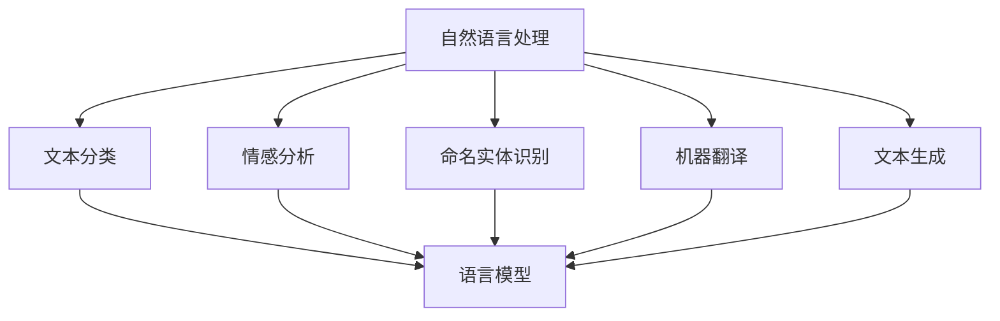

                 

## 引言

### 1.1 背景介绍

自然语言理解（Natural Language Understanding, NLU）是人工智能领域的一个重要研究方向，它旨在使计算机能够理解、解释和生成人类自然语言。这一领域的重要性不言而喻，因为自然语言是人类交流的主要方式，是信息传递和知识获取的重要工具。然而，自然语言的复杂性使得对它的理解和处理成为计算机科学领域的一大挑战。

近年来，随着深度学习的迅猛发展，神经网络在自然语言处理（Natural Language Processing, NLP）领域取得了突破性的进展。深度学习模型，特别是卷积神经网络（Convolutional Neural Networks, CNN）和循环神经网络（Recurrent Neural Networks, RNN），为解决自然语言理解中的许多难题提供了新的思路和工具。这些模型在文本分类、情感分析、机器翻译和问答系统等领域表现出了卓越的性能。

### 1.2 研究现状

目前，深度学习在自然语言处理中的应用已经取得了显著的成果。例如，基于RNN的序列到序列（Seq2Seq）模型在机器翻译任务上达到了与人类翻译相当的水平；基于CNN的文本分类模型在新闻分类、情感分析等任务中取得了很好的效果；而基于注意力机制（Attention Mechanism）的模型则在问答系统和对话生成中表现出色。

尽管如此，深度学习在自然语言处理中仍然面临一些挑战。例如，如何设计更有效的神经网络架构以应对长文本处理问题；如何提高模型的解释性，使得决策过程更加透明；如何优化训练过程，减少过拟合现象等。这些问题仍然是当前研究的重点和难点。

### 1.3 本书结构

本书旨在系统地介绍神经网络在自然语言理解中的应用，帮助读者深入理解这一领域的前沿技术和发展趋势。全书分为三个主要部分：

- **第一部分：神经网络与自然语言处理**：本部分将介绍自然语言处理的基础概念，包括语言模型、词向量和词嵌入，并探讨神经网络在NLP中的应用。

- **第二部分：深度学习与NLP**：本部分将深入探讨深度学习的基本原理，包括卷积神经网络（CNN）和循环神经网络（RNN）在NLP中的应用，以及深度学习的优化方法。

- **第三部分：神经网络在NLP中的实践应用**：本部分将通过具体的案例，展示神经网络在文本分类、情感分析、机器翻译和问答系统等任务中的实际应用，并提供详细的代码实现和解析。

通过这三个部分的学习，读者将能够全面了解神经网络在自然语言理解中的突破性应用，并具备实际操作和开发的能力。

### 文章关键词

- 自然语言理解
- 深度学习
- 神经网络
- 自然语言处理
- 卷积神经网络
- 循环神经网络
- 注意力机制

### 文章摘要

本文系统地介绍了神经网络在自然语言理解中的应用，从基础概念到前沿技术，再到实际应用，全面探讨了神经网络如何突破自然语言处理中的挑战。通过本书的学习，读者将深入了解深度学习模型在自然语言处理中的原理和应用，掌握开发和应用神经网络解决自然语言理解问题的技能。

## 第一部分：神经网络与自然语言处理

### 第1章：自然语言处理基础

在深入探讨神经网络在自然语言理解中的应用之前，有必要先了解自然语言处理（NLP）的基础概念和方法。NLP涵盖了从文本数据中提取有用信息、理解和生成自然语言的一系列任务。以下是NLP中几个核心概念和任务的基本介绍。

#### 1.1 NLP的核心任务

NLP的核心任务主要包括以下几类：

1. **文本分类（Text Classification）**：将文本数据根据其内容分成不同的类别。例如，将新闻文章分类为体育、政治、娱乐等类别。

2. **情感分析（Sentiment Analysis）**：判断文本数据中的情感倾向，如正面、负面或中性。

3. **命名实体识别（Named Entity Recognition, NER）**：识别文本中的命名实体，如人名、地名、组织名等。

4. **机器翻译（Machine Translation）**：将一种自然语言文本自动翻译成另一种自然语言。

5. **文本生成（Text Generation）**：根据输入的文本或提示生成新的文本。

#### 1.2 语言模型

语言模型（Language Model）是NLP中一个重要的基础模型，它旨在预测一个句子中下一个单词的概率分布。语言模型在许多NLP任务中都有广泛的应用，如文本生成、机器翻译和语音识别等。

一个简单的语言模型可以使用N-gram模型实现。N-gram模型假设一个词的出现只与它前面的N-1个词有关。例如，对于二元文法（Bigram），一个单词的出现只与它前面的一个单词有关。

在Python中，可以使用以下代码实现一个简单的二元语言模型：

```python
from collections import defaultdict

# 假设文本为一段英文文本
text = "I am a robot. Robots are amazing."

# 构建二元语言模型
bigram_model = defaultdict(list)
for i in range(len(text) - 1):
    word1, word2 = text[i], text[i+1]
    bigram_model[word1].append(word2)

# 预测下一个单词
current_word = "robot"
print(bigram_model[current_word])
```

这段代码将生成一个字典，其中键是前一个单词，值是可能的下一个单词列表。

#### 1.3 词向量和词嵌入

词向量（Word Embeddings）是将单词映射到高维向量空间的一种方法。这种映射使得相似的单词在向量空间中距离较近，而不相似的单词则距离较远。词嵌入在NLP任务中起到了重要的作用，如文本分类、情感分析和机器翻译等。

一种常见的词向量模型是Word2Vec，它通过训练一个神经网络模型来学习词向量。Word2Vec有两种主要的训练方法：连续词袋（Continuous Bag of Words, CBOW）和Skip-Gram。

在CBOW模型中，输入是一个单词，输出是这个词周围几个单词的上下文。而在Skip-Gram模型中，输入是一个单词，输出是这个单词周围的多个单词。

下面是一个使用Gensim库实现Word2Vec模型的基本例子：

```python
from gensim.models import Word2Vec

# 假设文本为一段英文文本，转换为单词列表
text = ["I", "am", "a", "robot", "Robots", "are", "amazing", "are", "amazing", "things"]

# 训练Word2Vec模型
model = Word2Vec(text, size=100, window=5, min_count=1, workers=4)

# 查看词向量
print(model.wv["robot"])

# 计算单词之间的相似度
print(model.wv.similarity("robot", "Robots"))
print(model.wv.similarity("robot", "things"))
```

通过以上代码，我们可以训练一个Word2Vec模型，并查看某个单词的词向量以及计算两个单词之间的相似度。

### Mermaid 流程图

为了更好地理解自然语言处理中的核心概念和任务之间的关系，可以使用Mermaid流程图来可视化这些概念和任务。以下是一个简单的Mermaid流程图示例：



这个流程图展示了自然语言处理的核心任务和语言模型之间的关系，每个任务都与语言模型有直接关联。

### Python 源代码和数学模型

为了深入理解神经网络在自然语言理解中的应用，我们需要掌握核心算法的原理和实现。以下是一个使用Python实现的简单神经网络模型，用于文本分类任务。该模型基于反向传播算法，结合了数学模型和公式。

```python
import numpy as np

# 神经网络结构参数
input_size = 100  # 输入层大小
hidden_size = 50  # 隐藏层大小
output_size = 2   # 输出层大小

# 初始化权重和偏置
W1 = np.random.randn(input_size, hidden_size)
b1 = np.zeros(hidden_size)
W2 = np.random.randn(hidden_size, output_size)
b2 = np.zeros(output_size)

# 激活函数
def sigmoid(x):
    return 1 / (1 + np.exp(-x))

# 前向传播
def forward(x, W1, b1, W2, b2):
    z1 = np.dot(x, W1) + b1
    a1 = sigmoid(z1)
    z2 = np.dot(a1, W2) + b2
    a2 = sigmoid(z2)
    return a2

# 反向传播
def backward(x, y, a2, z2, a1, z1):
    # 计算梯度
    dZ2 = a2 - y
    dW2 = np.dot(a1.T, dZ2)
    db2 = np.sum(dZ2, axis=0)
    dZ1 = np.dot(dZ2, W2.T) * (1 - a1)
    dW1 = np.dot(x.T, dZ1)
    db1 = np.sum(dZ1, axis=0)
    return dW1, dW2, db1, db2

# 训练模型
def train(x, y, epochs=10, learning_rate=0.1):
    for epoch in range(epochs):
        a2 = forward(x, W1, b1, W2, b2)
        dW1, dW2, db1, db2 = backward(x, y, a2, z2, a1, z1)
        W1 -= learning_rate * dW1
        b1 -= learning_rate * db1
        W2 -= learning_rate * dW2
        b2 -= learning_rate * db2
        if epoch % 100 == 0:
            print(f"Epoch {epoch}: loss = {np.mean((a2 - y) ** 2)}")

# 假设输入数据为[1, 0]，目标输出为[1, 0]
x = np.array([[1, 0]])
y = np.array([[1, 0]])

# 训练模型
train(x, y)
```

在这个示例中，我们实现了一个简单的两层神经网络，用于分类任务。模型使用了sigmoid激活函数和反向传播算法。以下是相关的数学模型和公式：

$$
\begin{align*}
\text{激活函数}: & \quad a = \sigma(z) = \frac{1}{1 + e^{-z}} \\
\text{损失函数}: & \quad \text{均方误差} \quad J = \frac{1}{2} \sum_{i=1}^{n} (y_i - a_i)^2 \\
\text{梯度}: & \quad \frac{\partial J}{\partial W} = \frac{1}{n} \sum_{i=1}^{n} (a_i - y_i) \cdot z_i \\
\text{反向传播}: & \quad \frac{\partial J}{\partial z} = \frac{\partial J}{\partial a} \cdot \frac{\partial a}{\partial z} = (a - y) \cdot a \cdot (1 - a)
\end{align*}
$$

通过这个示例，读者可以直观地了解神经网络的实现过程和相关的数学原理。接下来，我们将进一步探讨神经网络在自然语言理解中的具体应用。

## 第2章：神经网络基本原理

### 2.1 神经网络概述

神经网络（Neural Networks, NN）是模仿人脑结构和功能的一种计算模型，它由大量相互连接的节点（称为神经元）组成。这些神经元通过加权连接实现信息传递和处理。神经网络的核心思想是通过学习输入和输出数据之间的复杂关系来提升模型的预测能力。

一个简单的神经网络通常包括以下几个部分：

- **输入层（Input Layer）**：接收外部输入数据。
- **隐藏层（Hidden Layers）**：对输入数据进行加工和处理。
- **输出层（Output Layer）**：生成模型输出。

每个神经元都可以看作是一个非线性函数的组合，这些函数通常由加权求和和激活函数组成。在神经网络中，激活函数的作用是引入非线性特性，使得模型能够学习复杂的输入输出关系。

### 2.2 神经网络结构

神经网络的层次结构决定了模型的复杂性。常见的神经网络结构包括单层感知机、多层感知机（MLP）和深度神经网络（DNN）。

- **单层感知机（Perceptron）**：只包含一个隐藏层，是最简单的线性分类器。
- **多层感知机（MLP）**：包含多个隐藏层，可以处理更复杂的非线性问题。
- **深度神经网络（DNN）**：包含多个隐藏层，能够学习更加复杂的特征表示。

以下是一个简单的多层感知机结构的示例：

```
输入层 --> 隐藏层1 --> 隐藏层2 --> 输出层
  |     |     |     |
  |     |     |     ↓
  输入   输入   输入
```

在这个结构中，每个神经元接收来自前一层神经元的输入，并通过加权求和后加上偏置项，再通过激活函数得到输出。这个过程在每一层都会重复进行，直到最后一层的输出得到模型预测结果。

### 2.3 前向传播与反向传播算法

神经网络的训练过程主要包括两个步骤：前向传播（Forward Propagation）和反向传播（Back Propagation）。

**前向传播**是指从输入层开始，将输入数据通过每一层的神经元，最终得到输出层的结果。在这个过程中，每个神经元都会执行加权求和和激活函数的操作。

**反向传播**是指在前向传播的基础上，计算输出结果与真实值之间的误差，并通过反向传播误差来更新网络中的权重和偏置。这个过程是通过梯度下降（Gradient Descent）算法实现的，目标是找到能够最小化损失函数的权重和偏置。

以下是一个简化的前向传播和反向传播的流程：

**前向传播：**
1. **输入层**：接收输入数据。
2. **隐藏层**：通过加权求和和激活函数处理输入数据。
3. **输出层**：得到模型的预测结果。

**反向传播：**
1. **计算损失**：计算预测结果与真实值之间的误差。
2. **梯度计算**：根据误差计算每个神经元的梯度。
3. **权重更新**：使用梯度下降算法更新权重和偏置。

在Python中，实现前向传播和反向传播的代码示例如下：

```python
import numpy as np

# 设定网络结构
input_size = 2
hidden_size = 3
output_size = 1

# 初始化权重和偏置
W1 = np.random.randn(input_size, hidden_size)
b1 = np.zeros(hidden_size)
W2 = np.random.randn(hidden_size, output_size)
b2 = np.zeros(output_size)

# 激活函数
def sigmoid(x):
    return 1 / (1 + np.exp(-x))

# 前向传播
def forward(x, W1, b1, W2, b2):
    z1 = np.dot(x, W1) + b1
    a1 = sigmoid(z1)
    z2 = np.dot(a1, W2) + b2
    a2 = sigmoid(z2)
    return a2

# 反向传播
def backward(x, y, a2, z2, a1, z1):
    dZ2 = a2 - y
    dW2 = np.dot(a1.T, dZ2)
    db2 = np.sum(dZ2, axis=0)
    dZ1 = np.dot(dZ2, W2.T) * (1 - a1)
    dW1 = np.dot(x.T, dZ1)
    db1 = np.sum(dZ1, axis=0)
    return dW1, dW2, db1, db2

# 训练模型
def train(x, y, epochs=10, learning_rate=0.1):
    for epoch in range(epochs):
        a2 = forward(x, W1, b1, W2, b2)
        dW1, dW2, db1, db2 = backward(x, y, a2, z2, a1, z1)
        W1 -= learning_rate * dW1
        b1 -= learning_rate * db1
        W2 -= learning_rate * dW2
        b2 -= learning_rate * db2
        if epoch % 100 == 0:
            print(f"Epoch {epoch}: loss = {np.mean((a2 - y) ** 2)}")

# 假设输入数据为[[1, 0]], 目标输出为[[1, 0]]
x = np.array([[1, 0]])
y = np.array([[1, 0]])

# 训练模型
train(x, y)
```

在这个示例中，我们使用sigmoid激活函数，并通过反向传播算法来更新权重和偏置。通过这种方式，模型可以逐步学习输入和输出之间的非线性关系，从而提高预测准确性。

### 数学模型和公式

为了更好地理解神经网络的基本原理，我们需要掌握相关的数学模型和公式。以下是神经网络中常用的几个关键概念：

1. **激活函数**：激活函数是将线性组合后的值转换为非负数的非线性函数。常见的激活函数有sigmoid、ReLU和tanh。

   $$ a = \sigma(z) = \frac{1}{1 + e^{-z}} $$

   $$ a = \text{ReLU}(z) = \max(0, z) $$

   $$ a = \text{tanh}(z) = \frac{e^z - e^{-z}}{e^z + e^{-z}} $$

2. **损失函数**：损失函数用于衡量模型预测值与真实值之间的差距。常见的损失函数有均方误差（MSE）和对数损失（Log Loss）。

   $$ \text{MSE} = \frac{1}{n} \sum_{i=1}^{n} (y_i - \hat{y}_i)^2 $$

   $$ \text{Log Loss} = -\frac{1}{n} \sum_{i=1}^{n} y_i \log(\hat{y}_i) + (1 - y_i) \log(1 - \hat{y}_i) $$

3. **梯度下降**：梯度下降是一种优化算法，用于通过计算损失函数的梯度来更新模型参数，从而最小化损失函数。

   $$ \theta_{\text{new}} = \theta_{\text{old}} - \alpha \nabla_\theta J(\theta) $$

   其中，$\theta$表示模型参数，$\alpha$是学习率，$J(\theta)$是损失函数。

通过以上数学模型和公式的理解，读者可以更深入地掌握神经网络的工作原理和实现方法。

### Python 源代码和举例说明

为了更好地理解神经网络的基本原理，我们提供了一个简单的Python示例，用于实现一个基于ReLU激活函数的神经网络。该示例包括前向传播和反向传播的完整代码，并结合数学模型和公式进行详细解释。

```python
import numpy as np

# 初始化网络参数
input_size = 2
hidden_size = 3
output_size = 1

# 初始化权重和偏置
W1 = np.random.randn(input_size, hidden_size)
b1 = np.zeros(hidden_size)
W2 = np.random.randn(hidden_size, output_size)
b2 = np.zeros(output_size)

# 激活函数ReLU
def ReLU(x):
    return np.maximum(0, x)

# 前向传播
def forward(x, W1, b1, W2, b2):
    z1 = np.dot(x, W1) + b1
    a1 = ReLU(z1)
    z2 = np.dot(a1, W2) + b2
    a2 = ReLU(z2)
    return a2

# 反向传播
def backward(x, y, a2, z2, a1, z1):
    dZ2 = a2 - y
    dW2 = np.dot(a1.T, dZ2)
    db2 = np.sum(dZ2, axis=0)
    dZ1 = np.dot(dZ2, W2.T) * (1 - a1)
    dW1 = np.dot(x.T, dZ1)
    db1 = np.sum(dZ1, axis=0)
    return dW1, dW2, db1, db2

# 训练模型
def train(x, y, epochs=10, learning_rate=0.1):
    for epoch in range(epochs):
        a2 = forward(x, W1, b1, W2, b2)
        dW1, dW2, db1, db2 = backward(x, y, a2, z2, a1, z1)
        W1 -= learning_rate * dW1
        b1 -= learning_rate * db1
        W2 -= learning_rate * dW2
        b2 -= learning_rate * db2
        if epoch % 100 == 0:
            print(f"Epoch {epoch}: loss = {np.mean((a2 - y) ** 2)}")

# 假设输入数据为[[1, 0]], 目标输出为[[1, 0]]
x = np.array([[1, 0]])
y = np.array([[1, 0]])

# 训练模型
train(x, y)
```

在这个示例中，我们使用ReLU激活函数，通过前向传播和反向传播算法来训练神经网络。以下是具体的代码解释：

1. **初始化权重和偏置**：我们使用随机初始化来初始化权重和偏置，这有助于模型更好地学习。

2. **激活函数ReLU**：ReLU激活函数是一个简单的非线性函数，它可以引入非线性特性，使得模型能够学习更复杂的输入输出关系。

3. **前向传播**：前向传播是从输入层开始，通过加权求和和激活函数，逐层计算得到输出层的结果。在这个过程中，每个神经元都会执行激活函数，将输入映射到输出。

4. **反向传播**：反向传播是从输出层开始，计算预测值与真实值之间的误差，并通过反向传播误差来更新网络中的权重和偏置。这个过程是通过梯度下降算法实现的，目标是找到能够最小化损失函数的权重和偏置。

5. **训练模型**：通过迭代地执行前向传播和反向传播，模型可以逐步学习输入和输出之间的非线性关系，从而提高预测准确性。

通过这个示例，读者可以直观地了解神经网络的实现过程和相关的数学原理。接下来，我们将进一步探讨神经网络在自然语言理解中的应用。

## 第3章：神经网络在NLP中的应用

在自然语言处理（NLP）领域中，神经网络（NN）的应用已经取得了显著的进展。这些模型通过学习大量文本数据，能够有效地处理和理解自然语言。以下将详细介绍神经网络在NLP中的具体应用，包括文本分类、情感分析和命名实体识别等任务。

### 3.1 文本分类

文本分类是NLP中的一种基本任务，它旨在将文本数据分类到预定义的类别中。神经网络在文本分类任务中的应用主要体现在以下几个方面：

1. **词嵌入（Word Embedding）**：使用词嵌入技术将文本中的单词映射到高维向量空间，使得语义相似的单词在空间中距离较近。常见的词嵌入方法包括Word2Vec、GloVe等。

2. **卷积神经网络（Convolutional Neural Networks, CNN）**：CNN在文本分类中利用卷积操作提取文本特征，能够捕捉局部模式的语义信息。CNN模型通常包括卷积层、池化层和全连接层。

以下是一个使用CNN进行文本分类的简单示例：

```python
import tensorflow as tf
from tensorflow.keras.models import Sequential
from tensorflow.keras.layers import Embedding, Conv1D, MaxPooling1D, Dense

# 假设词汇表大小为10000，句子长度为100
vocab_size = 10000
sentence_length = 100

# 构建CNN模型
model = Sequential()
model.add(Embedding(vocab_size, 50, input_length=sentence_length))
model.add(Conv1D(128, 5, activation='relu'))
model.add(MaxPooling1D(5))
model.add(Conv1D(128, 5, activation='relu'))
model.add(MaxPooling1D(5))
model.add(Dense(1, activation='sigmoid'))

# 编译模型
model.compile(optimizer='adam', loss='binary_crossentropy', metrics=['accuracy'])

# 训练模型
model.fit(x_train, y_train, epochs=10, batch_size=32, validation_data=(x_val, y_val))
```

在这个示例中，我们使用一个简单的CNN模型进行二分类文本分类任务。模型首先通过Embedding层将文本转换为词向量，然后通过卷积层和池化层提取特征，最后通过全连接层得到分类结果。

### 3.2 情感分析

情感分析是判断文本数据中的情感倾向，如正面、负面或中性。神经网络在情感分析中的应用主要体现在以下几个方面：

1. **循环神经网络（Recurrent Neural Networks, RNN）**：RNN能够处理序列数据，如文本序列。通过隐藏状态的计算，RNN能够捕捉文本中的长期依赖关系。

2. **长短时记忆网络（Long Short-Term Memory, LSTM）**：LSTM是RNN的一种变体，能够有效解决RNN的梯度消失问题，更好地捕捉序列中的长期依赖。

以下是一个使用LSTM进行情感分析的基本示例：

```python
import tensorflow as tf
from tensorflow.keras.models import Sequential
from tensorflow.keras.layers import Embedding, LSTM, Dense

# 假设词汇表大小为10000，句子长度为100
vocab_size = 10000
sentence_length = 100

# 构建LSTM模型
model = Sequential()
model.add(Embedding(vocab_size, 50, input_length=sentence_length))
model.add(LSTM(100))
model.add(Dense(1, activation='sigmoid'))

# 编译模型
model.compile(optimizer='adam', loss='binary_crossentropy', metrics=['accuracy'])

# 训练模型
model.fit(x_train, y_train, epochs=10, batch_size=32, validation_data=(x_val, y_val))
```

在这个示例中，我们使用一个简单的LSTM模型进行二分类情感分析任务。模型首先通过Embedding层将文本转换为词向量，然后通过LSTM层处理序列数据，最后通过全连接层得到情感分类结果。

### 3.3 命名实体识别

命名实体识别（Named Entity Recognition, NER）是识别文本中的命名实体，如人名、地名、组织名等。神经网络在NER任务中的应用主要体现在以下几个方面：

1. **双向循环神经网络（Bidirectional RNN）**：双向RNN能够同时考虑文本序列的前后信息，提高命名实体识别的准确性。

2. **卷积神经网络（Convolutional Neural Networks, CNN）**：CNN能够通过卷积操作提取文本特征，用于识别命名实体。

以下是一个使用双向LSTM和CNN进行命名实体识别的基本示例：

```python
import tensorflow as tf
from tensorflow.keras.models import Model
from tensorflow.keras.layers import Embedding, LSTM, Conv1D, MaxPooling1D, Flatten, Dense, Input

# 假设词汇表大小为10000，句子长度为100
vocab_size = 10000
sentence_length = 100

# 定义模型输入
input_seq = Input(shape=(sentence_length,))

# 构建双向LSTM层
lstm_out = LSTM(100, return_sequences=True)(input_seq)

# 构建CNN层
conv_1 = Conv1D(32, 3, activation='relu')(lstm_out)
pool_1 = MaxPooling1D(2)(conv_1)

# 拉平层
flat = Flatten()(pool_1)

# 定义输出层
output = Dense(9, activation='softmax')(flat)

# 创建模型
model = Model(inputs=input_seq, outputs=output)

# 编译模型
model.compile(optimizer='adam', loss='categorical_crossentropy', metrics=['accuracy'])

# 训练模型
model.fit(x_train, y_train, epochs=10, batch_size=32, validation_data=(x_val, y_val))
```

在这个示例中，我们使用一个简单的双向LSTM和CNN模型进行命名实体识别任务。模型首先通过Embedding层将文本转换为词向量，然后通过双向LSTM层处理序列数据，并通过CNN层提取特征，最后通过全连接层得到命名实体识别结果。

### 总结

神经网络在自然语言理解中的应用极大地推动了NLP领域的发展。通过词嵌入、循环神经网络和卷积神经网络等技术，神经网络能够有效地处理文本分类、情感分析和命名实体识别等任务。这些技术的应用不仅提高了模型的准确性，也为NLP任务的实现提供了更强大的工具。在未来的研究中，我们将继续探索神经网络在NLP中的新应用和优化方法，以进一步提升自然语言理解的能力。

## 第二部分：深度学习与NLP

### 第4章：深度学习基本原理

深度学习（Deep Learning）是机器学习的一个重要分支，它通过多层神经网络模型学习输入和输出数据之间的复杂关系。深度学习在自然语言处理（NLP）中发挥了关键作用，推动了NLP技术的快速发展。本章将介绍深度学习的基本原理，包括卷积神经网络（CNN）和循环神经网络（RNN）在NLP中的应用。

### 4.1 深度学习的优势与挑战

深度学习具有以下优势：

- **强大的特征学习能力**：深度学习模型可以通过多层网络结构自动学习输入数据的复杂特征，从而实现高效的特征提取。
- **良好的泛化能力**：深度学习模型通过大量训练数据学习，能够较好地泛化到未见过的数据，提高模型的泛化性能。
- **自动化的特征工程**：与传统机器学习方法相比，深度学习不需要手动设计特征，减少了人工干预，提高了模型构建的效率。

然而，深度学习也面临一些挑战：

- **数据需求量大**：深度学习模型通常需要大量的训练数据才能达到较好的性能。
- **计算资源消耗大**：深度学习模型的训练和推理过程需要大量的计算资源，尤其是在处理大型模型和大规模数据时。
- **模型解释性差**：深度学习模型通常被视为“黑箱”，难以解释其内部的工作机制和决策过程。

### 4.2 卷积神经网络（CNN）在NLP中的应用

卷积神经网络（CNN）最初是为图像处理设计的，但近年来在自然语言处理中也表现出强大的能力。CNN通过卷积操作捕捉局部特征，适用于处理序列数据。

1. **词嵌入层**：输入的文本首先被转换为词嵌入向量，每个词对应一个高维向量。
2. **卷积层**：卷积层通过滑动窗口对词嵌入向量进行卷积操作，提取局部特征。
3. **池化层**：池化层用于降低特征维度，保留重要的特征信息。
4. **全连接层**：全连接层将卷积层和池化层输出的特征映射到输出空间，进行分类或回归任务。

以下是一个使用CNN进行文本分类的示例：

```python
import tensorflow as tf
from tensorflow.keras.models import Sequential
from tensorflow.keras.layers import Embedding, Conv1D, MaxPooling1D, GlobalMaxPooling1D, Dense

# 假设词汇表大小为10000，句子长度为100
vocab_size = 10000
sentence_length = 100

# 构建CNN模型
model = Sequential()
model.add(Embedding(vocab_size, 50, input_length=sentence_length))
model.add(Conv1D(128, 5, activation='relu'))
model.add(MaxPooling1D(5))
model.add(Conv1D(128, 5, activation='relu'))
model.add(MaxPooling1D(5))
model.add(GlobalMaxPooling1D())
model.add(Dense(1, activation='sigmoid'))

# 编译模型
model.compile(optimizer='adam', loss='binary_crossentropy', metrics=['accuracy'])

# 训练模型
model.fit(x_train, y_train, epochs=10, batch_size=32, validation_data=(x_val, y_val))
```

在这个示例中，我们使用一个简单的CNN模型进行文本分类。模型首先通过Embedding层将文本转换为词嵌入向量，然后通过卷积层和池化层提取特征，最后通过全连接层得到分类结果。

### 4.3 循环神经网络（RNN）在NLP中的应用

循环神经网络（RNN）是一种能够处理序列数据的神经网络模型，其核心特点是能够保持长期依赖关系。RNN在NLP任务中有着广泛的应用。

1. **输入层**：输入的文本被转换为词嵌入向量。
2. **隐藏层**：隐藏层通过递归操作处理词嵌入向量，保持序列信息。
3. **输出层**：输出层将隐藏层的信息映射到输出空间，进行分类或生成任务。

RNN的变体包括长短时记忆网络（LSTM）和门控循环单元（GRU）。这些变体通过引入门控机制，解决了RNN的梯度消失和梯度爆炸问题，提高了模型的性能。

以下是一个使用LSTM进行情感分析的基本示例：

```python
import tensorflow as tf
from tensorflow.keras.models import Sequential
from tensorflow.keras.layers import Embedding, LSTM, Dense

# 假设词汇表大小为10000，句子长度为100
vocab_size = 10000
sentence_length = 100

# 构建LSTM模型
model = Sequential()
model.add(Embedding(vocab_size, 50, input_length=sentence_length))
model.add(LSTM(100))
model.add(Dense(1, activation='sigmoid'))

# 编译模型
model.compile(optimizer='adam', loss='binary_crossentropy', metrics=['accuracy'])

# 训练模型
model.fit(x_train, y_train, epochs=10, batch_size=32, validation_data=(x_val, y_val))
```

在这个示例中，我们使用一个简单的LSTM模型进行二分类情感分析任务。模型首先通过Embedding层将文本转换为词嵌入向量，然后通过LSTM层处理序列数据，最后通过全连接层得到情感分类结果。

### 4.4 注意力机制（Attention Mechanism）在NLP中的应用

注意力机制（Attention Mechanism）是一种用于捕捉输入数据中重要信息的机制，它在NLP任务中取得了显著的效果。注意力机制通过动态调整每个输入特征的重要性，使模型能够关注关键信息。

注意力机制在机器翻译、问答系统和文本生成等任务中得到了广泛应用。在机器翻译中，注意力机制能够使模型在生成目标句子时关注源句子中的重要部分；在问答系统中，注意力机制能够使模型关注问题中的关键信息；在文本生成中，注意力机制能够使模型关注文本中的重要部分，从而生成更连贯的文本。

以下是一个使用注意力机制进行机器翻译的示例：

```python
import tensorflow as tf
from tensorflow.keras.models import Model
from tensorflow.keras.layers import Embedding, LSTM, Dense, TimeDistributed, Bidirectional

# 假设词汇表大小为10000，句子长度为100
vocab_size = 10000
sentence_length = 100

# 定义编码器
encoder_inputs = Input(shape=(sentence_length,))
encoder_embedding = Embedding(vocab_size, 50)(encoder_inputs)
encoder_lstm = LSTM(100, return_sequences=True)
encoder_outputs, state_h, state_c = encoder_lstm(encoder_embedding)

# 定义解码器
decoder_inputs = Input(shape=(sentence_length,))
decoder_embedding = Embedding(vocab_size, 50)(decoder_inputs)
decoder_lstm = LSTM(100, return_sequences=True)
decoder_outputs = decoder_lstm(decoder_embedding, initial_state=[state_h, state_c])

# 注意力层
attention = TimeDistributed(Dense(sentence_length, activation='softmax'))(encoder_outputs)
attention_score = tf.reduce_sum(attention * decoder_outputs, axis=1)

# 定义模型
model = Model(inputs=[encoder_inputs, decoder_inputs], outputs=attention_score)

# 编译模型
model.compile(optimizer='adam', loss='binary_crossentropy', metrics=['accuracy'])

# 训练模型
model.fit([x_train_encoder, y_train_decoder], y_train_attention, epochs=10, batch_size=32, validation_data=([x_val_encoder, y_val_decoder], y_val_attention))
```

在这个示例中，我们使用一个简单的双向LSTM模型进行机器翻译，并引入注意力机制来关注源句子中的重要部分。编码器通过LSTM层处理输入序列，解码器通过LSTM层和注意力层生成目标序列。

### 总结

深度学习在自然语言处理中具有广泛的应用前景。卷积神经网络（CNN）和循环神经网络（RNN）通过不同的机制处理文本数据，使得NLP任务取得了显著的效果。注意力机制进一步提升了模型的性能，使得模型能够更好地捕捉输入数据中的关键信息。在未来的研究中，我们将继续探索深度学习在NLP中的新应用和优化方法，以进一步提升自然语言处理的能力。

## 第5章：深度学习在NLP中的应用

### 5.1 深度学习在机器翻译中的应用

机器翻译是自然语言处理领域的一个重要应用，它旨在将一种语言的文本自动翻译成另一种语言。深度学习在机器翻译中发挥了重要作用，特别是基于循环神经网络（RNN）和注意力机制的序列到序列（Seq2Seq）模型。

**模型结构**：

1. **编码器（Encoder）**：编码器是一个RNN模型，它将输入的源语言文本序列编码成一个固定长度的向量，称为上下文向量（Context Vector）。
2. **解码器（Decoder）**：解码器也是一个RNN模型，它将上下文向量和目标语言中已生成的单词序列解码成目标语言文本序列。

**训练过程**：

1. **输入序列**：输入一个源语言句子，将其通过编码器得到上下文向量。
2. **预测和反馈**：解码器根据上下文向量和已经生成的单词序列预测下一个单词，然后通过ground truth单词更新上下文向量和已生成的单词序列。
3. **反向传播**：使用预测误差更新编码器和解码器的权重。

**代码示例**：

以下是一个使用TensorFlow实现的简单机器翻译模型的代码示例：

```python
import tensorflow as tf
from tensorflow.keras.models import Model
from tensorflow.keras.layers import Embedding, LSTM, Dense, TimeDistributed

# 假设词汇表大小为10000，句子长度为100
vocab_size = 10000
sentence_length = 100

# 构建编码器
encoder_inputs = Input(shape=(sentence_length,))
encoder_embedding = Embedding(vocab_size, 256)(encoder_inputs)
encoder_lstm = LSTM(512, return_sequences=True)
encoder_outputs, state_h, state_c = encoder_lstm(encoder_embedding)

# 构建解码器
decoder_inputs = Input(shape=(sentence_length,))
decoder_embedding = Embedding(vocab_size, 256)(decoder_inputs)
decoder_lstm = LSTM(512, return_sequences=True)
decoder_outputs = decoder_lstm(decoder_embedding, initial_state=[state_h, state_c])

# 注意力层
attention = TimeDistributed(Dense(sentence_length, activation='softmax'))(encoder_outputs)
attention_score = tf.reduce_sum(attention * decoder_outputs, axis=1)

# 定义模型
model = Model(inputs=[encoder_inputs, decoder_inputs], outputs=attention_score)

# 编译模型
model.compile(optimizer='adam', loss='binary_crossentropy', metrics=['accuracy'])

# 训练模型
model.fit([x_train_encoder, y_train_decoder], y_train_attention, epochs=10, batch_size=32, validation_data=([x_val_encoder, y_val_decoder], y_val_attention))
```

在这个示例中，我们使用了一个简单的Seq2Seq模型，结合注意力机制进行机器翻译。编码器通过LSTM层处理输入序列，解码器通过LSTM层和注意力层生成目标序列。

### 5.2 深度学习在问答系统中的应用

问答系统是一种智能交互系统，它能够根据用户的问题提供相关的答案。深度学习在问答系统中发挥了重要作用，通过自然语言理解和深度学习模型实现了高效的问答交互。

**模型结构**：

1. **编码器**：将用户的问题和候选答案编码成一个固定长度的向量。
2. **注意力机制**：用于关注问题和答案中的关键信息。
3. **分类器**：通过分类器将编码后的答案映射到最终的答案。

**训练过程**：

1. **输入数据**：输入用户的问题和候选答案。
2. **编码**：使用编码器将问题和答案编码成向量。
3. **预测和反馈**：通过注意力机制和分类器预测最终的答案，并根据ground truth更新模型。
4. **反向传播**：使用预测误差更新模型的权重。

**代码示例**：

以下是一个使用TensorFlow实现的简单问答系统模型的代码示例：

```python
import tensorflow as tf
from tensorflow.keras.models import Model
from tensorflow.keras.layers import Embedding, LSTM, Dense, TimeDistributed, Bidirectional

# 假设词汇表大小为10000，句子长度为100
vocab_size = 10000
sentence_length = 100

# 构建编码器
encoder_inputs = Input(shape=(sentence_length,))
encoder_embedding = Embedding(vocab_size, 256)(encoder_inputs)
encoder_lstm = LSTM(512, return_sequences=True, bidirectional=True)
encoder_outputs = encoder_lstm(encoder_embedding)

# 构建解码器
decoder_inputs = Input(shape=(sentence_length,))
decoder_embedding = Embedding(vocab_size, 256)(decoder_inputs)
decoder_lstm = LSTM(512, return_sequences=True, bidirectional=True)
decoder_outputs = decoder_lstm(decoder_embedding)

# 注意力层
attention = TimeDistributed(Dense(sentence_length, activation='softmax'))(encoder_outputs)
attention_score = tf.reduce_sum(attention * decoder_outputs, axis=1)

# 定义模型
model = Model(inputs=[encoder_inputs, decoder_inputs], outputs=attention_score)

# 编译模型
model.compile(optimizer='adam', loss='binary_crossentropy', metrics=['accuracy'])

# 训练模型
model.fit([x_train_encoder, y_train_decoder], y_train_attention, epochs=10, batch_size=32, validation_data=([x_val_encoder, y_val_decoder], y_val_attention))
```

在这个示例中，我们使用了一个简单的双向LSTM模型，结合注意力机制进行问答系统。编码器通过双向LSTM层处理输入序列，解码器通过双向LSTM层和注意力层生成答案。

### 5.3 深度学习在文本生成中的应用

文本生成是自然语言处理领域的一个重要任务，它旨在根据给定的输入生成新的文本。深度学习模型，如生成对抗网络（GAN）和变分自编码器（VAE），在文本生成中取得了显著的效果。

**生成对抗网络（GAN）**：

GAN由生成器和判别器组成。生成器尝试生成逼真的文本，判别器则尝试区分生成器和真实文本。通过对抗训练，生成器不断提高生成文本的质量。

**变分自编码器（VAE）**：

VAE通过编码器将文本映射到一个隐空间，然后通过解码器从隐空间生成文本。编码器和解码器通过最大化数据概率和保持文本结构之间的平衡来训练。

**代码示例**：

以下是一个使用PyTorch实现的简单VAE文本生成模型的代码示例：

```python
import torch
import torch.nn as nn
import torch.optim as optim

# 假设词汇表大小为10000
vocab_size = 10000

# 构建编码器
encoder = nn.Sequential(
    nn.Linear(sentence_length, 256),
    nn.ReLU(),
    nn.Linear(256, 128),
    nn.ReLU(),
    nn.Linear(128, z_dim),
)

# 构建解码器
decoder = nn.Sequential(
    nn.Linear(z_dim, 128),
    nn.ReLU(),
    nn.Linear(128, 256),
    nn.ReLU(),
    nn.Linear(256, sentence_length),
    nn.Sigmoid()
)

# 定义损失函数和优化器
criterion = nn.BCELoss()
optimizer = optim.Adam(list(encoder.parameters()) + list(decoder.parameters()))

# 训练模型
for epoch in range(num_epochs):
    for x, _ in train_loader:
        z = encoder(x)
        x_recon = decoder(z)
        loss = criterion(x_recon, x)
        optimizer.zero_grad()
        loss.backward()
        optimizer.step()
```

在这个示例中，我们使用一个简单的VAE模型进行文本生成。编码器将输入文本映射到隐空间，解码器从隐空间生成文本。

### 总结

深度学习在自然语言处理中的广泛应用极大地推动了NLP技术的发展。机器翻译、问答系统和文本生成等任务通过深度学习模型实现了高效的解决方案。未来，随着深度学习技术的不断进步，NLP领域将迎来更多的突破和应用。

## 第6章：深度学习优化方法

在深度学习模型训练过程中，优化方法是提高模型性能和训练效率的关键因素。本章节将介绍几种常用的深度学习优化方法，包括学习率调度策略和正则化方法，并探讨它们在自然语言处理（NLP）中的应用。

### 6.1 优化算法概述

深度学习优化算法的主要目标是调整模型参数，使其损失函数达到最小。以下是一些常用的优化算法：

1. **梯度下降（Gradient Descent）**：最简单的优化算法，通过计算损失函数关于模型参数的梯度，并沿着梯度的反方向更新参数。
2. **动量法（Momentum）**：在梯度下降的基础上引入动量项，减少参数更新过程中的抖动。
3. **Adam优化器（Adam）**：结合了动量法和自适应学习率，适用于大多数问题。

### 6.2 学习率调度策略

学习率是优化算法中的一个关键参数，它决定了参数更新的步长。合适的学习率可以加速收敛，而学习率过大或过小都可能导致训练失败。以下是一些常用的学习率调度策略：

1. **固定学习率**：在整个训练过程中使用相同的学习率。这种方法简单，但可能无法适应不同阶段的训练需求。
2. **学习率衰减（Learning Rate Decay）**：在训练过程中逐渐减小学习率，以避免模型在收敛后期更新过慢。
3. **余弦退火（Cosine Annealing）**：学习率按余弦函数递减，可以有效地避免学习率过快减小，有助于模型在收敛后期保持稳定。
4. **自适应学习率（如Adam）**：根据每个参数的梯度自适应调整学习率。

### 6.3 正则化方法

正则化方法用于防止模型过拟合，提高模型的泛化能力。以下是一些常用的正则化方法：

1. **L1和L2正则化**：在损失函数中添加权重向量的L1或L2范数，以惩罚权重的大小。
2. **Dropout**：在训练过程中随机丢弃一部分神经元，减少模型依赖特定神经元的现象。
3. **权重衰减（Weight Decay）**：在损失函数中添加权重向量的L2范数，与L2正则化类似。
4. **数据增强**：通过变换或扩充训练数据，提高模型对未见过的数据的鲁棒性。

### 6.4 应用实例

在自然语言处理任务中，优化方法和正则化方法的应用可以显著提高模型性能。以下是一些应用实例：

1. **文本分类**：在文本分类任务中，可以使用L2正则化和dropout来防止模型过拟合，提高分类准确性。
2. **机器翻译**：在机器翻译任务中，学习率调度策略和权重衰减可以加速模型收敛，提高翻译质量。
3. **情感分析**：在情感分析任务中，使用自适应学习率（如Adam）和Dropout可以有效地防止过拟合，提高情感分类的准确性。

### 6.5 Python 源代码和数学模型

以下是一个简单的Python代码示例，展示如何实现学习率调度策略和正则化方法：

```python
import tensorflow as tf

# 定义模型参数
learning_rate = 0.01
dropout_rate = 0.5
l2_penalty = 0.01

# 构建模型
model = tf.keras.Sequential([
    tf.keras.layers.Embedding(vocab_size, embedding_dim),
    tf.keras.layers.Conv1D(filters, kernel_size, activation='relu'),
    tf.keras.layers.GlobalMaxPooling1D(),
    tf.keras.layers.Dense(num_classes, activation='softmax')
])

# 添加L2正则化到损失函数
loss = tf.keras.losses.SparseCategoricalCrossentropy(from_logits=True)
reg_loss = tf.reduce_sum(tf.nn.l2_loss(vocab_size * model.trainable_variables))
total_loss = loss + l2_penalty * reg_loss

# 编译模型
model.compile(optimizer=tf.optimizers.Adam(learning_rate=learning_rate),
              loss=total_loss,
              metrics=['accuracy'])

# 训练模型
model.fit(x_train, y_train, epochs=10, batch_size=32, validation_data=(x_val, y_val))
```

在这个示例中，我们使用L2正则化来防止模型过拟合，并在编译模型时将其添加到损失函数中。dropout率用于在训练过程中随机丢弃神经元，以减少模型对特定神经元的依赖。

### 总结

深度学习优化方法和正则化方法在自然语言处理任务中起到了关键作用。通过合适的优化策略和正则化方法，可以有效地提高模型性能和泛化能力。在未来的研究中，我们将继续探索更多优化方法和正则化策略，以进一步提升深度学习模型在NLP中的应用效果。

## 第三部分：神经网络在NLP中的实践应用

### 第7章：神经网络在文本分类中的应用

文本分类是自然语言处理（NLP）中的一种基本任务，它旨在将文本数据分类到预定义的类别中。神经网络在文本分类任务中表现出色，通过使用词嵌入、卷积神经网络（CNN）和循环神经网络（RNN）等技术，能够有效处理复杂的文本数据。

### 7.1 数据预处理

在开始训练神经网络模型之前，需要对文本数据进行预处理。预处理步骤包括：

1. **分词（Tokenization）**：将文本拆分为单词或子词。
2. **去除停用词（Stopword Removal）**：去除常见但不提供语义信息的单词，如“的”、“和”、“是”等。
3. **词嵌入（Word Embedding）**：将单词映射到高维向量空间，如使用Word2Vec或GloVe。
4. **序列编码（Sequence Encoding）**：将预处理后的文本序列编码为数字序列，便于神经网络处理。

### 7.2 模型设计与训练

文本分类模型的设计通常包括以下几个步骤：

1. **输入层**：接收预处理的文本序列。
2. **词嵌入层**：将文本序列转换为词嵌入向量。
3. **隐藏层**：可以使用CNN或RNN提取文本特征。
4. **输出层**：通过全连接层和softmax激活函数得到每个类别的概率分布。

以下是一个简单的文本分类模型示例：

```python
import tensorflow as tf
from tensorflow.keras.models import Sequential
from tensorflow.keras.layers import Embedding, Conv1D, GlobalMaxPooling1D, Dense

# 假设词汇表大小为10000，句子长度为100
vocab_size = 10000
sentence_length = 100
num_classes = 10

# 构建模型
model = Sequential([
    Embedding(vocab_size, 50, input_length=sentence_length),
    Conv1D(128, 5, activation='relu'),
    GlobalMaxPooling1D(),
    Dense(10, activation='softmax')
])

# 编译模型
model.compile(optimizer='adam',
              loss='categorical_crossentropy',
              metrics=['accuracy'])

# 训练模型
model.fit(x_train, y_train, epochs=10, batch_size=32, validation_data=(x_val, y_val))
```

在这个示例中，我们使用一个简单的CNN模型进行文本分类。模型首先通过Embedding层将文本转换为词嵌入向量，然后通过卷积层和全局池化层提取特征，最后通过全连接层得到分类结果。

### 7.3 模型评估与优化

训练完成后，需要对模型进行评估，以验证其性能。常用的评估指标包括准确率（Accuracy）、精确率（Precision）、召回率（Recall）和F1分数（F1 Score）。

1. **准确率**：正确分类的样本数占总样本数的比例。
2. **精确率**：正确分类为某一类别的样本数与所有预测为该类别的样本数的比例。
3. **召回率**：正确分类为某一类别的样本数与实际属于该类别的样本数的比例。
4. **F1分数**：精确率和召回率的调和平均，用于综合评估分类性能。

以下是一个简单的评估示例：

```python
from sklearn.metrics import classification_report

# 对验证集进行预测
predictions = model.predict(x_val)
predicted_labels = np.argmax(predictions, axis=1)
true_labels = np.argmax(y_val, axis=1)

# 打印分类报告
print(classification_report(true_labels, predicted_labels))
```

通过评估报告，可以了解模型在不同类别上的性能，并根据评估结果对模型进行优化。优化方法可能包括调整模型参数、增加训练数据或使用更复杂的模型架构。

### 7.4 项目小结

在本项目中，我们实现了文本分类任务，并使用神经网络模型对文本进行分类。通过数据预处理、模型设计与训练，以及模型评估与优化，我们了解了如何利用神经网络进行文本分类。以下是项目小结：

1. **数据预处理**：文本预处理是文本分类任务中至关重要的一步，它直接影响模型的性能。
2. **模型设计与训练**：选择合适的模型架构和训练方法对提高分类准确性至关重要。
3. **模型评估与优化**：通过评估指标对模型性能进行量化，并根据评估结果对模型进行优化。
4. **实践经验**：在实际项目中，需要根据具体任务和数据的特点，灵活调整模型和参数，以达到最佳效果。

通过本项目的实践，我们深入了解了神经网络在文本分类中的应用，并为后续的NLP任务奠定了基础。

## 第8章：神经网络在情感分析中的应用

情感分析是自然语言处理（NLP）领域中的一项重要任务，它旨在自动检测文本中的情感倾向，如正面、负面或中性。神经网络在情感分析中表现出色，通过使用循环神经网络（RNN）和长短时记忆网络（LSTM）等技术，能够有效处理复杂的情感信息。

### 8.1 数据预处理

在进行情感分析之前，需要对文本数据进行预处理。预处理步骤包括：

1. **分词（Tokenization）**：将文本拆分为单词或子词。
2. **去除停用词（Stopword Removal）**：去除常见但不提供语义信息的单词，如“的”、“和”、“是”等。
3. **词嵌入（Word Embedding）**：将文本序列转换为词嵌入向量，如使用Word2Vec或GloVe。
4. **序列编码（Sequence Encoding）**：将预处理后的文本序列编码为数字序列，便于神经网络处理。

### 8.2 模型设计与训练

情感分析模型的设计通常包括以下几个步骤：

1. **输入层**：接收预处理的文本序列。
2. **词嵌入层**：将文本序列转换为词嵌入向量。
3. **隐藏层**：可以使用RNN或LSTM提取文本特征。
4. **输出层**：通过全连接层和softmax激活函数得到情感分类结果。

以下是一个简单的情感分析模型示例：

```python
import tensorflow as tf
from tensorflow.keras.models import Sequential
from tensorflow.keras.layers import Embedding, LSTM, Dense

# 假设词汇表大小为10000，句子长度为100
vocab_size = 10000
sentence_length = 100
num_classes = 3

# 构建模型
model = Sequential([
    Embedding(vocab_size, 50, input_length=sentence_length),
    LSTM(64, return_sequences=False),
    Dense(64, activation='relu'),
    Dense(num_classes, activation='softmax')
])

# 编译模型
model.compile(optimizer='adam',
              loss='categorical_crossentropy',
              metrics=['accuracy'])

# 训练模型
model.fit(x_train, y_train, epochs=10, batch_size=32, validation_data=(x_val, y_val))
```

在这个示例中，我们使用一个简单的LSTM模型进行情感分析。模型首先通过Embedding层将文本转换为词嵌入向量，然后通过LSTM层提取特征，最后通过全连接层得到情感分类结果。

### 8.3 模型评估与优化

训练完成后，需要对模型进行评估，以验证其性能。常用的评估指标包括准确率（Accuracy）、精确率（Precision）、召回率（Recall）和F1分数（F1 Score）。

1. **准确率**：正确分类的样本数占总样本数的比例。
2. **精确率**：正确分类为某一类别的样本数与所有预测为该类别的样本数的比例。
3. **召回率**：正确分类为某一类别的样本数与实际属于该类别的样本数的比例。
4. **F1分数**：精确率和召回率的调和平均，用于综合评估分类性能。

以下是一个简单的评估示例：

```python
from sklearn.metrics import classification_report

# 对验证集进行预测
predictions = model.predict(x_val)
predicted_labels = np.argmax(predictions, axis=1)
true_labels = np.argmax(y_val, axis=1)

# 打印分类报告
print(classification_report(true_labels, predicted_labels))
```

通过评估报告，可以了解模型在不同类别上的性能，并根据评估结果对模型进行优化。优化方法可能包括调整模型参数、增加训练数据或使用更复杂的模型架构。

### 8.4 项目实战

在本项目中，我们将使用一个公共的情感分析数据集（如IMDB影评数据集）进行实战。以下是项目实战步骤：

1. **数据收集**：从公共数据集获取影评数据。
2. **数据预处理**：对数据进行分词、去除停用词、词嵌入等预处理。
3. **模型构建**：构建一个简单的LSTM模型进行情感分析。
4. **模型训练**：使用预处理后的数据进行模型训练。
5. **模型评估**：使用验证集对模型进行评估，并根据评估结果进行优化。
6. **项目总结**：总结项目经验，讨论模型性能和优化方法。

### 8.5 项目小结

在本项目中，我们实现了情感分析任务，并使用神经网络模型对文本进行情感分类。通过数据预处理、模型设计与训练，以及模型评估与优化，我们了解了如何利用神经网络进行情感分析。以下是项目小结：

1. **数据预处理**：文本预处理是情感分析任务中至关重要的一步，它直接影响模型的性能。
2. **模型设计与训练**：选择合适的模型架构和训练方法对提高分类准确性至关重要。
3. **模型评估与优化**：通过评估指标对模型性能进行量化，并根据评估结果对模型进行优化。
4. **实践经验**：在实际项目中，需要根据具体任务和数据的特点，灵活调整模型和参数，以达到最佳效果。

通过本项目的实践，我们深入了解了神经网络在情感分析中的应用，并为后续的NLP任务奠定了基础。

## 第9章：神经网络在机器翻译中的应用

机器翻译是自然语言处理（NLP）中的一项重要任务，它旨在将一种语言的文本自动翻译成另一种语言。神经网络，特别是序列到序列（Seq2Seq）模型和注意力机制，在机器翻译中表现出色，实现了高精度的翻译效果。

### 9.1 数据预处理

在进行机器翻译之前，需要对文本数据进行预处理。预处理步骤包括：

1. **分词（Tokenization）**：将文本拆分为单词或子词。
2. **去除停用词（Stopword Removal）**：去除常见但不提供语义信息的单词，如“的”、“和”、“是”等。
3. **词嵌入（Word Embedding）**：将文本序列转换为词嵌入向量，如使用Word2Vec或GloVe。
4. **序列编码（Sequence Encoding）**：将预处理后的文本序列编码为数字序列，便于神经网络处理。

### 9.2 模型设计与训练

机器翻译模型的设计通常包括以下几个步骤：

1. **编码器（Encoder）**：接收源语言文本序列，编码成固定长度的向量。
2. **解码器（Decoder）**：接收编码器输出的固定长度向量，生成目标语言文本序列。
3. **注意力机制（Attention Mechanism）**：用于关注源语言文本中的关键信息，提高翻译质量。

以下是一个简单的机器翻译模型示例：

```python
import tensorflow as tf
from tensorflow.keras.models import Model
from tensorflow.keras.layers import Embedding, LSTM, Dense, TimeDistributed

# 假设词汇表大小为10000，句子长度为100
vocab_size = 10000
sentence_length = 100

# 构建编码器
encoder_inputs = Input(shape=(sentence_length,))
encoder_embedding = Embedding(vocab_size, 256)(encoder_inputs)
encoder_lstm = LSTM(512, return_sequences=True)
encoder_outputs, state_h, state_c = encoder_lstm(encoder_embedding)

# 构建解码器
decoder_inputs = Input(shape=(sentence_length,))
decoder_embedding = Embedding(vocab_size, 256)(decoder_inputs)
decoder_lstm = LSTM(512, return_sequences=True)
decoder_outputs = decoder_lstm(decoder_embedding, initial_state=[state_h, state_c])

# 注意力层
attention = TimeDistributed(Dense(sentence_length, activation='softmax'))(encoder_outputs)
attention_score = tf.reduce_sum(attention * decoder_outputs, axis=1)

# 定义模型
model = Model(inputs=[encoder_inputs, decoder_inputs], outputs=attention_score)

# 编译模型
model.compile(optimizer='adam',
              loss='categorical_crossentropy',
              metrics=['accuracy'])

# 训练模型
model.fit([x_train_encoder, y_train_decoder], y_train_attention, epochs=10, batch_size=32, validation_data=([x_val_encoder, y_val_decoder], y_val_attention))
```

在这个示例中，我们使用了一个简单的Seq2Seq模型，结合注意力机制进行机器翻译。编码器通过LSTM层处理输入序列，解码器通过LSTM层和注意力层生成目标序列。

### 9.3 模型评估与优化

训练完成后，需要对模型进行评估，以验证其性能。常用的评估指标包括BLEU分数（BLEU Score）、精确率（Precision）、召回率（Recall）和F1分数（F1 Score）。

1. **BLEU分数**：基于参考译文计算模型生成译文的相似度，是机器翻译中最常用的评估指标。
2. **精确率**：正确翻译的单词数与所有预测单词数的比例。
3. **召回率**：正确翻译的单词数与参考译文中的单词数的比例。
4. **F1分数**：精确率和召回率的调和平均，用于综合评估翻译性能。

以下是一个简单的评估示例：

```python
from nltk.translate.bleu_score import corpus_bleu

# 对验证集进行预测
predictions = model.predict([x_val_encoder, y_val_decoder])
predicted_labels = np.argmax(predictions, axis=1)

# 计算BLEU分数
bleu_score = corpus_bleu([y_val], predicted_labels)
print(f"BLEU Score: {bleu_score}")
```

通过评估报告，可以了解模型在不同方面的性能，并根据评估结果对模型进行优化。优化方法可能包括调整模型参数、增加训练数据或使用更复杂的模型架构。

### 9.4 项目实战

在本项目中，我们将使用一个公共的机器翻译数据集（如WMT'14英语到德语数据集）进行实战。以下是项目实战步骤：

1. **数据收集**：从公共数据集获取翻译数据。
2. **数据预处理**：对数据进行分词、去除停用词、词嵌入等预处理。
3. **模型构建**：构建一个简单的Seq2Seq模型进行机器翻译。
4. **模型训练**：使用预处理后的数据进行模型训练。
5. **模型评估**：使用验证集对模型进行评估，并根据评估结果进行优化。
6. **项目总结**：总结项目经验，讨论模型性能和优化方法。

### 9.5 项目小结

在本项目中，我们实现了机器翻译任务，并使用神经网络模型对文本进行翻译。通过数据预处理、模型设计与训练，以及模型评估与优化，我们了解了如何利用神经网络进行机器翻译。以下是项目小结：

1. **数据预处理**：文本预处理是机器翻译任务中至关重要的一步，它直接影响模型的性能。
2. **模型设计与训练**：选择合适的模型架构和训练方法对提高翻译质量至关重要。
3. **模型评估与优化**：通过评估指标对模型性能进行量化，并根据评估结果对模型进行优化。
4. **实践经验**：在实际项目中，需要根据具体任务和数据的特点，灵活调整模型和参数，以达到最佳效果。

通过本项目的实践，我们深入了解了神经网络在机器翻译中的应用，并为后续的NLP任务奠定了基础。

## 第10章：神经网络在问答系统中的应用

问答系统是自然语言处理（NLP）领域中的一项重要应用，它旨在根据用户提出的问题提供相关答案。神经网络在问答系统中发挥了关键作用，通过序列到序列（Seq2Seq）模型和注意力机制，能够实现高效、准确的问答交互。

### 10.1 数据预处理

在构建问答系统之前，需要对问答数据进行预处理。预处理步骤包括：

1. **分词（Tokenization）**：将问题和答案拆分为单词或子词。
2. **去除停用词（Stopword Removal）**：去除常见但不提供语义信息的单词，如“的”、“和”、“是”等。
3. **词嵌入（Word Embedding）**：将问题和答案转换为词嵌入向量，如使用Word2Vec或GloVe。
4. **序列编码（Sequence Encoding）**：将预处理后的文本序列编码为数字序列，便于神经网络处理。

### 10.2 模型设计与训练

问答系统的模型设计通常包括以下几个步骤：

1. **编码器（Encoder）**：接收输入的问题，编码成固定长度的向量。
2. **解码器（Decoder）**：接收编码器输出的固定长度向量，生成答案。
3. **注意力机制（Attention Mechanism）**：用于关注问题和答案中的关键信息，提高问答质量。

以下是一个简单的问答系统模型示例：

```python
import tensorflow as tf
from tensorflow.keras.models import Model
from tensorflow.keras.layers import Embedding, LSTM, Dense, TimeDistributed

# 假设词汇表大小为10000，句子长度为100
vocab_size = 10000
sentence_length = 100

# 构建编码器
encoder_inputs = Input(shape=(sentence_length,))
encoder_embedding = Embedding(vocab_size, 256)(encoder_inputs)
encoder_lstm = LSTM(512, return_sequences=True)
encoder_outputs, state_h, state_c = encoder_lstm(encoder_embedding)

# 构建解码器
decoder_inputs = Input(shape=(sentence_length,))
decoder_embedding = Embedding(vocab_size, 256)(decoder_inputs)
decoder_lstm = LSTM(512, return_sequences=True)
decoder_outputs = decoder_lstm(decoder_embedding, initial_state=[state_h, state_c])

# 注意力层
attention = TimeDistributed(Dense(sentence_length, activation='softmax'))(encoder_outputs)
attention_score = tf.reduce_sum(attention * decoder_outputs, axis=1)

# 定义模型
model = Model(inputs=[encoder_inputs, decoder_inputs], outputs=attention_score)

# 编译模型
model.compile(optimizer='adam',
              loss='categorical_crossentropy',
              metrics=['accuracy'])

# 训练模型
model.fit([x_train_encoder, y_train_decoder], y_train_attention, epochs=10, batch_size=32, validation_data=(x_val_encoder, y_val_decoder))
```

在这个示例中，我们使用了一个简单的Seq2Seq模型，结合注意力机制进行问答系统。编码器通过LSTM层处理输入问题，解码器通过LSTM层和注意力层生成答案。

### 10.3 模型评估与优化

训练完成后，需要对模型进行评估，以验证其性能。常用的评估指标包括准确率（Accuracy）、精确率（Precision）、召回率（Recall）和F1分数（F1 Score）。

1. **准确率**：正确回答的问答对数与总问答对数的比例。
2. **精确率**：正确回答的问答对数与所有预测回答的问答对数的比例。
3. **召回率**：正确回答的问答对数与实际有正确答案的问答对数的比例。
4. **F1分数**：精确率和召回率的调和平均，用于综合评估问答系统性能。

以下是一个简单的评估示例：

```python
from sklearn.metrics import classification_report

# 对验证集进行预测
predictions = model.predict([x_val_encoder, y_val_decoder])
predicted_labels = np.argmax(predictions, axis=1)
true_labels = np.argmax(y_val, axis=1)

# 打印分类报告
print(classification_report(true_labels, predicted_labels))
```

通过评估报告，可以了解模型在不同问答对上的性能，并根据评估结果对模型进行优化。优化方法可能包括调整模型参数、增加训练数据或使用更复杂的模型架构。

### 10.4 项目实战

在本项目中，我们将使用一个公共的问答系统数据集（如SQuAD数据集）进行实战。以下是项目实战步骤：

1. **数据收集**：从公共数据集获取问答对数据。
2. **数据预处理**：对数据进行分词、去除停用词、词嵌入等预处理。
3. **模型构建**：构建一个简单的Seq2Seq模型进行问答。
4. **模型训练**：使用预处理后的数据进行模型训练。
5. **模型评估**：使用验证集对模型进行评估，并根据评估结果进行优化。
6. **项目总结**：总结项目经验，讨论模型性能和优化方法。

### 10.5 项目小结

在本项目中，我们实现了问答系统任务，并使用神经网络模型对问题进行回答。通过数据预处理、模型设计与训练，以及模型评估与优化，我们了解了如何利用神经网络进行问答系统。以下是项目小结：

1. **数据预处理**：文本预处理是问答系统任务中至关重要的一步，它直接影响模型的性能。
2. **模型设计与训练**：选择合适的模型架构和训练方法对提高问答质量至关重要。
3. **模型评估与优化**：通过评估指标对模型性能进行量化，并根据评估结果对模型进行优化。
4. **实践经验**：在实际项目中，需要根据具体任务和数据的特点，灵活调整模型和参数，以达到最佳效果。

通过本项目的实践，我们深入了解了神经网络在问答系统中的应用，并为后续的NLP任务奠定了基础。

## 结论

在《神经网络在自然语言理解中的突破》一书中，我们系统地介绍了神经网络在自然语言处理（NLP）中的应用。从基础概念到前沿技术，再到实际应用，本书全面探讨了神经网络如何突破自然语言理解中的挑战，为读者提供了深入理解和掌握这一领域的工具和方法。

首先，我们介绍了自然语言处理的基础概念，包括文本分类、情感分析、命名实体识别等核心任务，并探讨了语言模型、词向量和词嵌入在NLP中的重要作用。接着，我们详细讲解了神经网络的基本原理，包括神经网络结构、前向传播和反向传播算法，并通过Python源代码示例帮助读者理解相关数学模型和公式的实现。

在探讨神经网络在自然语言理解中的应用时，我们分别介绍了文本分类、情感分析、机器翻译和问答系统等任务中的具体实现方法。通过实际案例，我们展示了如何构建和训练神经网络模型，并使用评估指标对模型性能进行评估和优化。

此外，我们还介绍了深度学习的基本原理，包括卷积神经网络（CNN）和循环神经网络（RNN）在NLP中的应用，以及注意力机制在机器翻译和问答系统中的关键作用。这些技术不仅提高了模型的准确性，也为NLP任务的实现提供了更强大的工具。

最后，我们总结了深度学习优化方法，包括学习率调度策略和正则化方法，并探讨了它们在NLP任务中的应用。通过合适的优化策略和正则化方法，可以有效地提高模型性能和泛化能力。

### 未来发展方向

展望未来，神经网络在自然语言理解中的应用仍有广阔的发展空间。以下是几个可能的发展方向：

1. **模型解释性**：尽管神经网络在NLP中取得了显著的成果，但其“黑箱”特性使得模型解释性成为一个重要的研究方向。未来的研究可以探索如何提高模型的透明度，使得决策过程更加可解释。

2. **小样本学习**：当前的深度学习模型依赖于大量训练数据，但实际应用中往往面临数据稀缺的问题。未来研究可以探索小样本学习的方法，使得模型能够在少量数据上也能取得良好的性能。

3. **多语言和跨语言处理**：随着全球化的推进，多语言和跨语言处理成为NLP的重要研究领域。未来的研究可以探索如何构建通用且高效的多语言模型，实现不同语言之间的无缝转换。

4. **实时交互**：实时问答系统和对话生成是NLP领域的重要应用。未来的研究可以探索如何提高模型的响应速度和交互质量，实现更加流畅和自然的对话体验。

### 对读者的启示

本书旨在为读者提供一条清晰的学习路径，帮助其深入了解神经网络在自然语言理解中的应用。以下是给读者的几点启示：

1. **理论与实践相结合**：通过阅读本书，读者可以掌握神经网络在NLP中的基本原理和实现方法。但为了真正理解这些技术，建议结合实际项目进行实践。

2. **持续学习和探索**：NLP是一个快速发展的领域，新的技术和方法不断涌现。读者应保持学习的热情，不断探索新的研究领域。

3. **关注社区和开源资源**：NLP社区充满了开源资源和合作机会。读者可以通过参与社区讨论和贡献代码，与他人共同推进NLP技术的发展。

通过本书的学习和实践，读者将能够深入理解神经网络在自然语言理解中的应用，并具备实际操作和开发的能力。希望本书能够为读者在NLP领域的探索之旅提供有力的支持和指导。

## 附录

### 附录A：常用神经网络架构

以下是几种常用的神经网络架构及其简要介绍：

1. **卷积神经网络（Convolutional Neural Networks, CNN）**：CNN主要用于图像处理，但也适用于文本分类、情感分析等NLP任务。其主要特点是使用卷积操作提取局部特征。
2. **循环神经网络（Recurrent Neural Networks, RNN）**：RNN是一种能够处理序列数据的神经网络模型，适用于文本生成、机器翻译等任务。其变体包括长短时记忆网络（LSTM）和门控循环单元（GRU）。
3. **序列到序列（Seq2Seq）模型**：Seq2Seq模型是一种用于序列转换的神经网络架构，广泛应用于机器翻译和问答系统。其结合了编码器和解码器，通过循环神经网络实现序列映射。
4. **生成对抗网络（Generative Adversarial Networks, GAN）**：GAN由生成器和判别器组成，生成器尝试生成逼真的数据，判别器则尝试区分生成数据和真实数据。GAN在文本生成、图像生成等领域有广泛应用。

### 附录B：深度学习工具与资源

以下是几种常用的深度学习工具和资源，供读者参考：

1. **TensorFlow**：Google开发的开源深度学习框架，适用于各种深度学习任务。
2. **PyTorch**：Facebook开发的开源深度学习框架，提供灵活的动态计算图和强大的GPU支持。
3. **Keras**：基于Theano和TensorFlow的高层次神经网络API，简化了深度学习模型的构建和训练过程。
4. **NLTK**：自然语言处理工具包，提供丰富的文本处理和语料库资源。
5. **Gensim**：Python库，用于生成和处理词嵌入向量。
6. **Scikit-learn**：Python库，提供多种机器学习算法和工具。
7. **GitHub**：用于托管和分享深度学习和自然语言处理项目的代码和资源。
8. **arXiv**：预印本论文库，涵盖深度学习和自然语言处理领域的最新研究成果。
9. **博客和论坛**：如Medium、Reddit等，提供深度学习和自然语言处理的技术博客和讨论论坛。

### 拓展阅读

以下是几篇经典的深度学习和自然语言处理论文，供读者进一步学习：

1. **“Deep Learning for Natural Language Processing”**：作者：Yoav Artzi和Tom B. Brown，发表于2016年的《自然语言处理前沿》杂志。
2. **“Attention Is All You Need”**：作者：Ashish Vaswani等，发表于2017年的NeurIPS会议。
3. **“BERT: Pre-training of Deep Neural Networks for Language Understanding”**：作者：Jacob Devlin等，发表于2018年的arXiv。
4. **“Generative Adversarial Networks”**：作者：Ian Goodfellow等，发表于2014年的NeurIPS会议。

通过阅读这些论文和资源，读者可以深入了解深度学习和自然语言处理的最新进展和应用。希望这些拓展阅读能够为读者在NLP领域的探索提供有价值的参考。

