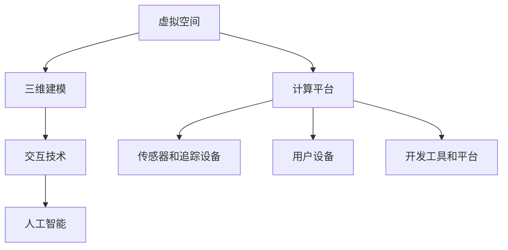

                 

### 引言

**《空间计算在教育和培训中的潜力》**

在当前技术飞速发展的时代，空间计算作为一种创新的技术，正在逐渐渗透到各个领域，包括教育和培训。空间计算不仅提升了信息的呈现方式，还改变了人们互动和学习的模式。这篇技术博客将探讨空间计算在教育和培训中的潜在应用，旨在揭示这一技术如何改变我们的学习体验，提高教育质量和培训效果。

**关键词：** 空间计算、教育技术、培训、互动学习、虚拟现实、人工智能。

**摘要：** 本文首先介绍空间计算的基础概念和架构，然后详细探讨其在教育中的应用，如虚拟课堂和个性化学习。接着，文章将讨论空间计算在职业培训中的应用，包括技能培训和评估。最后，我们将分析空间计算面临的挑战，并展望其未来的发展趋势。

接下来的部分将按照以下结构展开：

1. **空间计算基础**：介绍空间计算的核心概念和架构。
2. **空间计算在教育中的应用**：分析空间计算在教育中的应用，包括在线教育和虚拟课堂。
3. **空间计算在培训中的应用**：探讨空间计算在职业培训中的具体应用。
4. **空间计算的挑战与未来趋势**：分析空间计算在教育和培训中的挑战和未来前景。
5. **总结**：总结全文，强调空间计算在教育和培训中的重要性。

通过这一系列的探讨，我们希望读者能够更好地理解空间计算在教育和培训中的潜力，并对其未来应用有更深入的思考。

### 空间计算基础

空间计算，作为一种新兴的计算范式，其核心思想是将计算从传统的桌面和终端扩展到三维空间中。这种计算范式的实现依赖于多种技术的融合，包括虚拟现实（VR）、增强现实（AR）、计算机视觉和人工智能等。首先，我们来定义空间计算的核心概念和组成部分。

#### 核心概念

- **虚拟空间**：虚拟空间是空间计算的基础，它通过计算机技术创建一个模拟的三维环境，用户可以在其中进行交互和操作。
- **三维建模**：三维建模是将现实世界中的对象和场景转换成数字模型的过程，这是空间计算的重要一环。
- **交互技术**：交互技术包括手势识别、语音输入和体感控制等，它们使得用户能够与虚拟空间中的对象进行自然互动。
- **人工智能**：人工智能在空间计算中用于实现智能交互、内容推荐和自动化任务等。

#### 组成部分

空间计算由以下几个主要组成部分构成：

1. **计算平台**：这是空间计算的基础设施，包括服务器、存储设备和网络设备等。
2. **传感器和追踪设备**：传感器和追踪设备用于捕捉用户的动作和环境信息，如摄像头、动作捕捉器和定位传感器等。
3. **用户设备**：用户设备如头戴显示器（HMD）、智能手表和智能手机等，用于用户与虚拟空间的交互。
4. **开发工具和平台**：这些工具和平台提供了创建和运行空间计算应用所需的环境和资源。

#### 联系

为了更好地理解空间计算的核心概念和组成部分之间的关系，我们可以使用Mermaid流程图来展示：



通过这个流程图，我们可以清晰地看到各个组成部分之间的联系，以及它们如何共同构建起空间计算的整体架构。

#### 核心算法原理讲解

空间计算的核心算法主要包括三维建模和交互技术。下面我们将使用Python伪代码详细阐述这些算法的基本原理。

**三维建模算法原理**

```python
# 伪代码：三维建模算法

# 输入：三维模型的数据点
# 输出：三维模型对象

def create_3d_model(data_points):
    model = initialize_model()
    for point in data_points:
        add_vertex(model, point)
    for edge in connect_edges(data_points):
        add_edge(model, edge)
    return model

# 辅助函数：初始化模型、添加顶点和边等
```

**交互技术算法原理**

```python
# 伪代码：交互技术算法

# 输入：用户动作数据
# 输出：交互结果

def handle_user_interaction(action_data):
    if action_data['type'] == 'gesture':
        gesture = recognize_gesture(action_data['data'])
        perform_gesture_action(gesture)
    elif action_data['type'] == 'voice':
        command = recognize_speech(action_data['data'])
        perform_speech_action(command)
    else:
        action = recognize_motion(action_data['data'])
        perform_motion_action(action)

# 辅助函数：手势识别、语音识别、运动捕捉等
```

这些伪代码展示了空间计算中核心算法的基本框架，结合数学模型和具体的实现，我们可以开发出各种应用，满足教育和培训的需求。

### 数学模型与空间计算

在空间计算中，数学模型扮演着至关重要的角色。它们不仅用于描述现实世界中的三维对象和场景，还用于处理交互和计算过程中的数据。以下是一些空间计算中常用的数学模型和公式。

#### 三维建模中的数学模型

- **点云模型**：点云模型通过捕捉三维空间中的点来构建模型。它通常使用极坐标或直角坐标系表示。

$$
P(x, y, z) = (r \cos(\theta), r \sin(\theta), h)
$$

- **体素模型**：体素模型将三维空间划分为小立方体（体素），每个体素包含一定的属性。

$$
V(i, j, k) = \{x | i \leq x \leq i+1, j \leq y \leq j+1, k \leq z \leq k+1\}
$$

- **曲面模型**：曲面模型通过方程描述三维空间中的曲面。常见的有参数方程和隐函数方程。

$$
f(x, y, z) = 0
$$

#### 交互技术中的数学模型

- **手势识别**：手势识别通常使用机器学习算法，包括支持向量机（SVM）、神经网络（NN）等。这些算法需要训练模型，并使用特征向量进行识别。

$$
\hat{y} = \text{ classify }(x, \text{ trained\_model })
$$

- **语音识别**：语音识别使用隐马尔可夫模型（HMM）或深度神经网络（DNN）来处理语音信号，并将其转换为文本。

$$
\text{speech\_vector} = \text{ extract\_features }(audio\_signal)
\hat{\text{transcript}} = \text{ decode }(speech\_vector, \text{ trained\_model })
$$

- **运动捕捉**：运动捕捉使用卡尔曼滤波器或其他滤波算法来处理运动数据，以获得更准确的运动轨迹。

$$
x_t = x_{t-1} + w_t
\hat{x}_t = \text{ filter }(z_t, \hat{x}_{t-1}, Q_t)
$$

#### 公式示例

以下是一些空间计算中的公式示例，使用LaTeX格式表示：

$$
\begin{aligned}
&\text{点云模型：} \quad P(x, y, z) = (r \cos(\theta), r \sin(\theta), h) \\
&\text{体素模型：} \quad V(i, j, k) = \{x | i \leq x \leq i+1, j \leq y \leq j+1, k \leq z \leq k+1\} \\
&\text{曲面模型：} \quad f(x, y, z) = 0 \\
&\text{手势识别：} \quad \hat{y} = \text{ classify }(x, \text{ trained\_model }) \\
&\text{语音识别：} \quad \text{speech\_vector} = \text{ extract\_features }(audio\_signal), \hat{\text{transcript}} = \text{ decode }(speech\_vector, \text{ trained\_model }) \\
&\text{运动捕捉：} \quad x_t = x_{t-1} + w_t, \hat{x}_t = \text{ filter }(z_t, \hat{x}_{t-1}, Q_t)
\end{aligned}
$$

通过这些数学模型和公式，我们可以更精确地描述和操作三维空间中的对象，从而实现更加高效和自然的交互。

### 空间计算在教育中的应用

空间计算在教育领域的应用已经展现出巨大的潜力，特别是在提高教学效果和学生学习体验方面。以下将详细分析空间计算在教育中的应用，包括在线教育、虚拟课堂和个性化学习。

#### 在线教育

空间计算为在线教育带来了革命性的变化，使得学习者不再受限于传统课堂的物理空间。通过虚拟课堂，学生可以远程参与课堂活动，与老师和同学进行实时互动。空间计算技术能够提供更加逼真的三维场景，使得在线课堂的体验更加接近传统课堂教学。

- **沉浸式学习环境**：空间计算通过虚拟现实（VR）和增强现实（AR）技术，创建了一个沉浸式的学习环境。学生可以身临其境地体验历史事件、科学实验等，从而加深对知识的理解。
- **互动学习**：空间计算技术使得学生能够与虚拟对象和环境进行互动，例如在虚拟实验室中进行实验，或者通过虚拟角色进行角色扮演。这种互动式学习方式能够激发学生的学习兴趣，提高学习效果。

#### 虚拟课堂

虚拟课堂是空间计算在教育中的另一个重要应用，它为教师和学生提供了一个全新的教学和学习平台。通过虚拟课堂，教师可以在虚拟空间中创建和布置教学内容，学生则可以在虚拟环境中进行学习。

- **多感官学习**：虚拟课堂利用空间计算技术，提供了多感官的学习体验。学生不仅可以通过视觉和听觉来获取信息，还可以通过触觉和运动感知来加深对知识的理解。
- **个性化教学**：虚拟课堂可以根据学生的学习进度和需求，提供个性化的教学方案。教师可以为学生创建定制化的学习路径，从而满足不同学生的学习需求。

#### 个性化学习

个性化学习是空间计算在教育中的另一大应用，它通过分析学生的学习数据，为每个学生提供个性化的学习建议和资源。

- **学习数据分析**：空间计算技术可以收集和分析学生的学习行为数据，包括学习时间、学习进度、学习效果等。通过这些数据，教师可以了解学生的学习状况，并为学生提供针对性的辅导。
- **智能推荐系统**：基于学习数据分析，空间计算技术可以为学生推荐最适合他们的学习资源。例如，当学生遇到学习难题时，系统可以推荐相关的教学视频或练习题，帮助他们解决问题。

#### 案例研究

以下是一个关于空间计算在教育中应用的案例研究：

- **案例背景**：某高校引入了基于空间计算的虚拟课堂系统，用于替代传统的面对面授课。该系统利用VR技术创建了一个虚拟课堂环境，学生可以通过VR头盔和手柄进行互动。
- **实施过程**：教师首先在虚拟课堂中布置教学内容，包括PPT、视频和3D模型等。学生通过VR头盔进入虚拟课堂，与教师和其他学生进行实时互动。教师可以监控学生的学习情况，并提供即时的指导和帮助。
- **效果评估**：通过为期一个学期的实验，发现虚拟课堂显著提高了学生的学习兴趣和参与度。学生反馈表示，虚拟课堂使得学习变得更加生动有趣，有助于加深对知识的理解。

通过这些应用案例，我们可以看到空间计算在教育中具有巨大的潜力，它不仅提高了教学效果，还改变了学生的学习方式，为教育创新提供了新的思路。

### 空间计算在培训中的应用

空间计算不仅在教育中展现了巨大的潜力，在职业培训中也同样具有深远的影响。以下将详细探讨空间计算在职业培训中的应用，包括技能培训、模拟培训和远程协作。

#### 技能培训

技能培训是职业培训的核心部分，空间计算技术为技能培训提供了全新的解决方案。通过虚拟现实（VR）和增强现实（AR）技术，培训者可以在一个模拟环境中进行技能操作，从而提高技能的掌握程度和操作精度。

- **沉浸式模拟环境**：空间计算技术创建了一个沉浸式的模拟环境，培训者可以在其中进行各种技能操作。例如，飞行模拟器通过VR技术模拟飞行过程，使得飞行员能够在虚拟环境中练习飞行技能。
- **实时反馈和调整**：空间计算技术能够实时捕捉培训者的操作数据，并提供即时反馈和调整。这种实时反馈机制有助于培训者及时纠正错误，提高操作技能。

#### 模拟培训

模拟培训是空间计算在职业培训中的另一个重要应用。通过模拟现实中的工作环境和操作流程，培训者可以在一个安全、可控的环境中学习实际操作技能。

- **虚拟实验室**：空间计算技术可以创建一个虚拟实验室，用于模拟各种实验过程。学生和研究人员可以在虚拟实验室中进行实验，从而节省实验成本和时间。
- **风险评估和训练**：在模拟培训中，空间计算技术可以帮助识别和评估潜在的风险。例如，在医疗培训中，医生可以在虚拟环境中进行手术练习，从而降低实际手术中的风险。

#### 远程协作

远程协作是空间计算在职业培训中的又一重要应用。通过虚拟空间，培训者可以跨越地理界限，进行实时协作和交流。

- **虚拟会议室**：空间计算技术提供了一个虚拟会议室，培训者可以在其中进行远程会议和讨论。这种虚拟会议室不仅节省了交通和时间成本，还提高了会议的效率和效果。
- **协作工具**：空间计算技术集成了多种协作工具，如共享白板、实时聊天和视频会议等。这些工具使得培训者可以实时共享信息和资源，提高协作效果。

#### 案例研究

以下是一个关于空间计算在职业培训中应用的案例研究：

- **案例背景**：某航空公司在飞行员培训中引入了基于VR技术的飞行模拟器。飞行员在模拟器中可以模拟各种飞行场景，进行飞行技能的练习。
- **实施过程**：飞行员通过VR头盔和手柄进入模拟器，进行飞行操作。模拟器实时捕捉飞行数据，并提供即时反馈。飞行员可以根据反馈进行调整，提高飞行技能。
- **效果评估**：通过使用VR飞行模拟器，飞行员的飞行技能得到了显著提高。模拟器提供了丰富的飞行场景，使得飞行员能够在各种情况下练习飞行技能，从而降低了实际飞行中的风险。

通过这些应用案例，我们可以看到空间计算在职业培训中具有巨大的潜力，它不仅提高了培训效果，还改变了培训的方式，为职业培训的创新提供了新的思路。

### 空间计算的挑战与未来趋势

尽管空间计算在教育和培训中展现出了巨大的潜力，但在实际应用中仍然面临许多挑战。以下将分析空间计算在教育和培训中面临的主要挑战，并探讨其未来的发展趋势。

#### 当前挑战

1. **技术瓶颈**：空间计算依赖于多种技术的融合，包括VR、AR、计算机视觉和人工智能等。尽管这些技术已经取得了显著进展，但在性能、稳定性和兼容性方面仍然存在一定的瓶颈。例如，VR设备的分辨率和响应速度有待提高，AR技术的透明度和交互性需要进一步优化。

2. **教育资源不足**：空间计算需要大量的教育资源，包括三维模型、虚拟环境和教学素材等。目前，这些资源的开发和积累仍然不足，尤其是在一些新兴领域，如医学和工程等。

3. **用户适应性**：空间计算技术对用户的设备和技术水平有一定的要求。一些用户可能不熟悉VR或AR设备的使用，或者对虚拟空间的操作不适应。这可能会影响空间计算在教育和培训中的应用效果。

4. **隐私和安全问题**：空间计算涉及到大量的用户数据和隐私信息。如何确保这些数据的安全和隐私，避免数据泄露和滥用，是一个亟待解决的问题。

#### 未来趋势

1. **技术进步**：随着科技的不断进步，空间计算技术将得到进一步优化和提升。未来的VR设备可能会更加轻便、舒适，分辨率和响应速度也会显著提高。同时，AR技术将实现更加透明和自然的交互体验。

2. **教育资源丰富**：随着空间计算技术的普及，越来越多的教育机构和内容开发者将投入到空间计算资源的开发和积累中。未来，我们可能会看到大量的三维模型、虚拟环境和教学素材，为教育和培训提供丰富的资源。

3. **智能化和个性化**：空间计算技术将变得更加智能化和个性化。通过人工智能技术，系统可以根据用户的需求和学习行为，提供个性化的教学资源和指导。这有助于提高教育的质量和效果。

4. **跨学科融合**：空间计算技术将与其他学科和领域进行深度融合。例如，在医学领域，空间计算可以与虚拟现实和增强现实技术结合，创建虚拟手术室和急救场景，为医学生提供实践机会。

#### 技术创新与教育模式的融合

技术创新是推动空间计算在教育中应用的关键。以下是一些可能的技术创新：

1. **智能交互**：通过人工智能技术，实现更加自然和智能的交互。例如，智能导师系统可以根据学生的学习进度和需求，提供个性化的指导和反馈。

2. **虚拟现实教室**：利用VR技术，创建一个虚拟的教室环境，学生可以在其中进行互动和合作。这种虚拟教室可以模拟真实课堂的场景，提高学生的学习体验。

3. **增强现实教材**：利用AR技术，将增强现实元素融入到教材中。学生可以通过智能手机或AR眼镜，查看教材中的三维模型和动画，从而加深对知识的理解。

4. **远程协作平台**：利用空间计算技术，创建一个远程协作平台，学生和教师可以跨越地理界限，进行实时互动和合作。这种平台可以用于在线课程、研讨会和团队项目等。

通过这些技术创新，空间计算技术将改变传统的教育模式，实现更加灵活、个性化和高效的教与学方式。

### 空间计算资源与参考文献

为了帮助读者进一步了解空间计算在教育和培训中的应用，以下列出了一些相关的资源与参考文献：

1. **资源**：
   - **开源三维建模工具**：Blender、Autodesk Maya、Unity等。
   - **空间计算开发平台**：Unity Spatialized Audio、ARKit、VRChat等。
   - **在线教育资源**：Coursera、edX、Khan Academy等。

2. **参考文献**：
   - **学术论文**：
     - Milgram, P., & Kishino, F. (1994). "A Taxonomy of Mixed Reality Visual Displays". IEICE Transactions on Information Systems, E77-D(12), 1321-1329.
     - Ros, E., Muñoz, A., & Llopis, E. (2011). "An Overview of Augmented Reality Technologies". International Journal of Virtual Reality, 10(3), 5-16.
   - **技术报告**：
     - VR/AR Marketer Intelligence. (2021). "The State of the Virtual and Augmented Reality Market". Retrieved from <https://www.vrmarketer.com/reports/vrar-state-of-market-2021/>.
   - **行业指南**：
     - IEEE Standards Association. (2020). "IEEE Standards for Augmented Reality and Virtual Reality". Retrieved from <https://standards.ieee.org/standard/index.html?standard=2418>.

通过这些资源，读者可以更深入地了解空间计算的相关技术和应用案例，为未来的研究和实践提供参考。

### 案例研究

在空间计算在教育中的实际应用方面，有许多成功的案例可以参考。以下详细介绍几个具有代表性的案例，以展示空间计算在教育和培训中的具体应用和成效。

#### 案例一：哈佛大学的虚拟课堂

哈佛大学引入了基于空间计算的虚拟课堂系统，用于替代传统的面对面授课。通过VR技术，学生可以在虚拟课堂中与教师和其他学生进行实时互动。这一系统提供了沉浸式的学习体验，使得学生能够身临其境地参与到课堂讨论和实验中。

**实施过程：**
- 哈佛大学首先建立了多个虚拟课堂环境，包括教室、实验室和图书馆等。
- 学生通过VR头盔和手柄进入虚拟课堂，可以与其他学生和教师进行互动。
- 教师可以在虚拟课堂中布置教学内容，并通过VR设备进行实时讲解和演示。
- 学生可以通过VR设备参与实验和讨论，获得更加直观的学习体验。

**效果评估：**
- 通过使用虚拟课堂系统，学生的学习兴趣和参与度显著提高。
- 学生反馈表示，虚拟课堂使得学习变得更加生动有趣，有助于加深对知识的理解。

#### 案例二：医学虚拟仿真实验室

某医学院引入了基于空间计算的虚拟仿真实验室，用于医学学生的培训和评估。通过VR和AR技术，学生可以在虚拟环境中进行手术模拟、药物注射和病理分析等操作。

**实施过程：**
- 医学院建立了多个虚拟仿真实验室，包括手术室、诊断室和病理实验室等。
- 学生通过VR头盔和手柄进入虚拟实验室，进行各种医学操作的模拟。
- 教师可以在虚拟实验室中监控学生的操作，并提供实时反馈和指导。
- 学生可以通过虚拟实验室进行反复练习，提高操作技能。

**效果评估：**
- 通过使用虚拟仿真实验室，学生的医学操作技能得到了显著提高。
- 学生反馈表示，虚拟仿真实验室提供了一个安全、可控的环境，有助于提高实际操作中的信心和稳定性。

#### 案例三：职业培训远程协作平台

某公司引入了基于空间计算的远程协作平台，用于员工培训和团队项目。通过VR和AR技术，员工可以在虚拟会议室中进行实时协作和交流。

**实施过程：**
- 公司建立了基于VR和AR技术的远程协作平台，员工可以通过VR头盔和手柄进入虚拟会议室。
- 员工可以在虚拟会议室中进行会议、讨论和协作，共享文件和资源。
- 平台集成了多种协作工具，如共享白板、实时聊天和视频会议等，提高了协作效果。

**效果评估：**
- 通过使用远程协作平台，员工之间的协作和沟通效率显著提高。
- 员工反馈表示，虚拟会议室提供了一个高效、便捷的协作环境，有助于提高团队项目的质量和效率。

通过这些案例，我们可以看到空间计算在教育和培训中具有巨大的潜力。它不仅提高了教学和培训的效果，还改变了传统的方式，为教育创新提供了新的思路。

### 总结

空间计算作为一种新兴的技术，正在逐步渗透到教育和培训的各个领域，展现出巨大的潜力。本文从基础概念、应用案例、挑战与未来趋势等多个角度，详细探讨了空间计算在教育和培训中的重要性。我们首先介绍了空间计算的核心概念和组成部分，如虚拟空间、三维建模、交互技术和人工智能。接着，我们分析了空间计算在教育中的应用，如在线教育、虚拟课堂和个性化学习，以及在职业培训中的应用，如技能培训和远程协作。我们还讨论了空间计算面临的挑战，如技术瓶颈、教育资源不足、用户适应性和隐私安全等问题，并展望了其未来的发展趋势。

空间计算的潜力不仅在于其技术层面的创新，更在于其对教育模式和教育效果的深远影响。通过空间计算，我们可以创建更加沉浸式、互动性和个性化的学习环境，提高教学和培训的效果。同时，空间计算也为教育创新提供了新的思路和方法，有望推动教育领域的变革。

在未来，随着技术的不断进步和应用的深入，空间计算在教育和培训中的应用将更加广泛和深入。我们可以期待，空间计算将进一步改变我们的学习方式，提高教育质量，为培养未来的创新型人才提供有力支持。

### 作者信息

**作者：AI天才研究院/AI Genius Institute & 禅与计算机程序设计艺术 /Zen And The Art of Computer Programming**

本文由AI天才研究院和禅与计算机程序设计艺术共同撰写。AI天才研究院致力于推动人工智能技术的创新和发展，为教育和培训领域提供先进的技术解决方案。禅与计算机程序设计艺术则专注于计算机编程和算法设计的深入研究和实践，旨在提升程序员的技术水平和创新能力。本文旨在探讨空间计算在教育和培训中的潜力，为相关领域的学者和实践者提供参考和启示。希望本文能够对您在空间计算领域的研究和实践有所启发和帮助。如果您对本文有任何问题或建议，欢迎随时与我们联系。我们期待与您共同探讨空间计算的无限可能。

