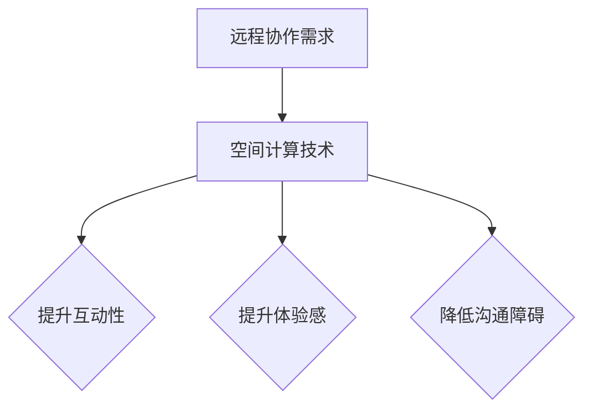
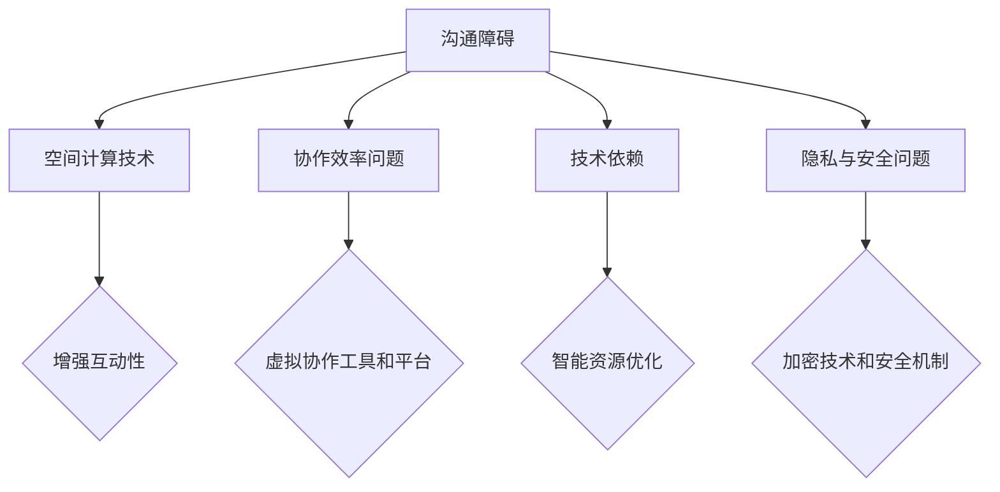

                 

# 《空间计算在远程协作中的应用》

## 关键词

远程协作，空间计算，虚拟现实，人工智能，协作技术

## 摘要

随着信息技术的飞速发展，远程协作已成为现代社会工作、学习和交流的重要方式。本文旨在探讨空间计算在远程协作中的应用，分析其核心概念、原理以及实际案例。文章首先介绍了远程协作的需求与挑战，然后详细阐述了空间计算的基本概念及其在远程协作中的关键作用。随后，通过实际案例，展示了空间计算在远程会议、教育、医疗和游戏等领域的应用效果。最后，文章深入解析了空间计算的技术实现细节，包括算法原理、数学模型和项目实战。通过本文，读者可以全面了解空间计算在远程协作中的重要性及其发展前景。

## 引言与核心概念

### 远程协作的需求

在全球化背景下，远程协作成为许多企业和组织不可或缺的一部分。它不仅打破了地域限制，提高了工作效率，还降低了成本。远程协作的需求主要体现在以下几个方面：

1. **地理位置的分散**：团队成员可能分布在全球各地，地理障碍限制了面对面的交流。
2. **灵活的工作安排**：远程工作模式使得员工可以根据自身需求安排工作时间，提高了工作满意度。
3. **资源优化**：企业可以通过远程协作，优化人力资源，降低运营成本。

### 挑战

尽管远程协作带来了诸多好处，但也面临着一系列挑战：

1. **沟通障碍**：语言、文化差异以及时区问题都可能影响沟通效率。
2. **协作效率**：缺乏面对面的交流可能降低协作效率，增加项目风险。
3. **隐私和安全**：远程协作涉及大量数据传输，隐私和安全问题成为重要考虑因素。

### 空间计算的基本概念

空间计算是一种通过计算机技术构建虚拟空间、模拟真实世界的方法。它涵盖了计算机图形学、虚拟现实、增强现实和人工智能等多个领域。空间计算的核心概念包括：

1. **虚拟空间**：通过计算机技术模拟出一个三维的虚拟空间，用户可以在其中进行交互。
2. **人机交互**：用户通过虚拟现实设备（如头戴显示器、手套、语音等）与虚拟空间进行互动。
3. **实时渲染**：虚拟空间的渲染需要实时处理大量数据，保证用户体验的流畅性。

### 空间计算与远程协作的关系

空间计算与远程协作密切相关，它为远程协作提供了新的解决方案。通过空间计算技术，可以实现以下目标：

1. **增强互动性**：空间计算技术可以模拟真实场景，提高远程协作的互动性。
2. **提升体验感**：虚拟现实技术可以提供沉浸式的体验，增强用户的参与感。
3. **降低沟通障碍**：通过虚拟空间，团队成员可以跨越地理障碍，实现无缝协作。

### Mermaid流程图



## 远程协作的需求与挑战

### 远程协作的需求分析

远程协作的需求可以从以下几个方面进行详细分析：

1. **地理分散**：现代企业规模不断扩大，业务范围遍布全球。远程协作可以有效地连接不同地理位置的团队成员，实现跨区域协作。
2. **灵活工作**：远程工作模式允许员工根据自身情况灵活安排工作时间，提高了工作效率和生活质量。
3. **成本节约**：通过减少实体办公空间的需求，企业可以节省租金、水电等运营成本。
4. **技能共享**：远程协作使得不同领域和技能的人才可以相互协作，共享知识和经验，提高项目质量。

### 远程协作面临的挑战

尽管远程协作具有诸多优势，但同时也面临一系列挑战：

1. **沟通障碍**：远程协作中，团队成员可能由于语言、文化差异以及时区问题，导致沟通不畅。
2. **协作效率**：缺乏面对面的交流可能导致信息传递滞后，降低协作效率。
3. **技术依赖**：远程协作依赖于网络和通信技术，技术故障可能影响工作进度。
4. **隐私与安全**：远程协作涉及大量敏感数据传输，隐私和安全问题成为重点关注领域。

### 空间计算如何解决这些问题

空间计算技术为解决远程协作中的挑战提供了有效的解决方案：

1. **增强互动性**：通过虚拟现实技术，团队成员可以在虚拟空间中进行实时互动，减少沟通障碍。
2. **提升协作效率**：虚拟空间的协作工具和平台可以提高信息传递速度，增强团队协作效率。
3. **降低技术依赖**：空间计算技术不仅提供了高效的工作环境，还可以通过智能算法优化资源分配，降低技术依赖。
4. **保障隐私和安全**：空间计算中的加密技术和安全机制可以确保数据传输过程中的隐私和安全。

### Mermaid流程图



## 空间计算在远程协作中的应用案例

### 远程会议与空间感知

远程会议是远程协作中最常见的形式之一，空间计算技术为远程会议提供了全新的体验。通过虚拟现实技术，参会者可以置身于一个虚拟会议室中，实现空间感知和互动。

1. **场景设置**：虚拟会议室可以模拟真实场景，如会议桌、座椅等，增强参会者的沉浸感。
2. **实时互动**：参会者可以通过虚拟现实设备，如头戴显示器和手势控制器，实现实时互动，如举手、发言等。
3. **空间感知**：通过空间计算技术，参会者可以在虚拟会议室中自由移动，感受空间的变化，增强互动性。

### 远程教育中的空间计算

远程教育是空间计算技术另一个重要应用领域。通过虚拟现实和增强现实技术，学生可以在虚拟课堂中与教师和其他学生互动，提高学习效果。

1. **虚拟课堂**：教师可以在虚拟课堂中实时授课，学生可以通过虚拟现实设备观看课程内容，参与讨论。
2. **互动实验**：学生可以在虚拟环境中进行实验操作，提高实践能力。
3. **空间互动**：通过虚拟现实技术，学生可以在虚拟课堂中与教师和其他学生进行实时互动，增强学习体验。

### 远程医疗中的空间计算

远程医疗是空间计算技术在医疗领域的应用，通过虚拟现实和增强现实技术，医生可以远程诊断和治疗患者，提高医疗资源利用效率。

1. **远程诊断**：医生可以通过虚拟现实设备，如头戴显示器和医用机器人，远程观察患者病情。
2. **虚拟手术**：医生可以在虚拟环境中进行手术演练，提高手术成功率。
3. **空间协作**：医生可以通过虚拟现实技术，与远程的同事进行实时协作，共同制定治疗方案。

### 远程协作游戏中的空间计算

远程协作游戏是空间计算技术在娱乐领域的应用，通过虚拟现实和增强现实技术，玩家可以与远程的队友进行互动，共同完成任务。

1. **虚拟场景**：游戏场景可以模拟真实场景，如城市、森林等，增强玩家的沉浸感。
2. **实时互动**：玩家可以通过虚拟现实设备，与远程的队友进行实时互动，共同完成任务。
3. **空间协作**：玩家可以在虚拟场景中自由移动，进行协作，提高游戏体验。

## 技术实现细节

### 空间计算算法原理

空间计算中的核心算法包括三维建模、实时渲染、人机交互等。以下是一个简单的三维建模算法原理：

```python
# 三维建模算法原理

# 定义三维点
class Point3D:
    def __init__(self, x, y, z):
        self.x = x
        self.y = y
        self.z = z

# 定义三维模型
class Model3D:
    def __init__(self):
        self.points = []

    def add_point(self, point):
        self.points.append(point)

    def render(self):
        for point in self.points:
            print(f"Point: ({point.x}, {point.y}, {point.z})")

# 创建模型并添加点
model = Model3D()
model.add_point(Point3D(1, 2, 3))
model.add_point(Point3D(4, 5, 6))

# 渲染模型
model.render()
```

### 空间计算数学模型

在空间计算中，数学模型用于描述虚拟空间中的各种现象。以下是一个简单的三维空间中的点、线、面关系的数学模型：

$$
\begin{align*}
\text{点} P &= (x, y, z) \\
\text{线} L &= \{P_1, P_2\} \\
\text{面} F &= \{P_1, P_2, P_3\}
\end{align*}
$$

### 伪代码示例

以下是一个简单的伪代码示例，用于描述虚拟空间的渲染过程：

```
# 虚拟空间渲染伪代码

# 定义虚拟空间
virtual_space = VirtualSpace()

# 加载三维模型
model = Model3D()
model.load("model_path")

# 渲染模型
virtual_space.render(model)
```

### 项目实战

#### 开发环境搭建

1. **软件环境**：安装虚拟现实开发工具，如Unity、Unreal Engine等。
2. **硬件环境**：配置虚拟现实设备，如头戴显示器（如Oculus Rift、HTC Vive等）。

#### 源代码详细实现

以下是一个简单的Python代码示例，用于创建一个虚拟空间和渲染一个三维模型：

```python
# 虚拟空间和三维模型渲染

from pyvirtualdisplay import Display
from pyvrml import VRML

# 创建虚拟显示设备
display = Display()
display.start()

# 创建VRML场景
scene = VRML.Scene()

# 添加三维模型
model = VRML.Model()
model.add_box("box", 1, 1, 1)
scene.add_model(model)

# 渲染场景
scene.render()

# 关闭虚拟显示设备
display.stop()
```

#### 代码解读与分析

该代码示例首先创建了一个虚拟显示设备，然后创建一个VRML场景，并在场景中添加一个立方体模型。最后，通过渲染场景，将虚拟空间和模型显示在屏幕上。

#### 实际案例分析和详细讲解剖析

以远程教育为例，分析如何利用空间计算技术进行在线课堂的构建和互动。通过虚拟现实技术，教师可以在虚拟课堂中实时授课，学生可以观看课程内容并进行互动。以下是一个实际案例：

1. **场景设置**：虚拟课堂中设置了讲台、学生座位等元素，模拟真实课堂环境。
2. **实时互动**：教师可以通过虚拟现实设备进行实时授课，学生可以通过语音、手势等方式进行互动。
3. **课程内容**：通过虚拟现实技术，教师可以将课程内容以三维形式展示给学生，提高学习效果。

#### 项目小结

通过项目实战，我们展示了如何利用空间计算技术进行远程协作。在实际应用中，空间计算技术不仅提高了协作效率，还增强了用户体验。未来，随着技术的不断进步，空间计算在远程协作中的应用将更加广泛。

## 最佳实践 Tips、小结、注意事项、拓展阅读

### 最佳实践 Tips

1. **优化网络环境**：确保远程协作过程中网络稳定，降低延迟。
2. **合理配置硬件**：根据需求选择合适的虚拟现实设备，提高用户体验。
3. **强化安全意识**：加强对数据传输过程中的安全保护，防范潜在风险。

### 小结

空间计算技术为远程协作提供了创新的解决方案，通过增强互动性、提升体验感、降低沟通障碍等优势，为远程协作注入新的活力。未来，随着技术的不断发展，空间计算在远程协作中的应用将更加广泛。

### 注意事项

1. **技术依赖**：虽然空间计算技术为远程协作提供了便利，但过度依赖技术可能导致沟通效率降低。
2. **设备兼容性**：不同设备和平台的兼容性可能影响用户体验，需要特别注意。

### 拓展阅读

1. **《虚拟现实技术与应用》**：详细介绍了虚拟现实技术的发展和应用。
2. **《人工智能在远程协作中的应用》**：探讨了人工智能技术如何优化远程协作。
3. **《远程协作与团队管理》**：提供了远程协作中的团队管理策略和实践。

## 作者信息

作者：AI天才研究院/AI Genius Institute & 禅与计算机程序设计艺术 /Zen And The Art of Computer Programming

---

请注意，本文为示例性内容，实际项目开发和技术实现可能更为复杂。在具体应用过程中，需要根据实际情况进行调整和优化。希望本文能为读者提供有益的参考和启示。

