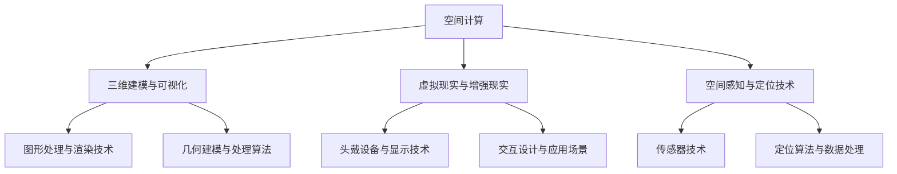
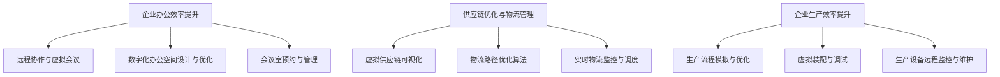

                 

### 引言

在现代企业运营中，效率的提升是企业竞争力的重要组成部分。随着技术的不断发展，空间计算作为一种新兴的计算模式，正逐渐进入企业的视野。空间计算，顾名思义，是指通过利用计算机处理空间信息，实现虚拟与现实的深度融合。它不仅改变了人们的交互方式，也为企业带来了前所未有的效率提升空间。

空间计算如何能够提高企业效率？首先，我们需要了解其基础概念和原理。空间计算的核心在于对三维空间的建模与感知，结合虚拟现实（VR）和增强现实（AR）技术，实现人与环境的智能化交互。通过这种技术，企业可以实现远程协作、虚拟会议、数字化办公空间设计等应用，从而极大地提高工作效率。

本文将围绕空间计算如何提高企业效率这一主题，深入探讨其核心原理、应用场景、实践方法和案例分析。文章分为三个部分：第一部分介绍空间计算的基础知识，包括定义、发展历程、核心技术等；第二部分探讨空间计算在企业中的实践策略与方法；第三部分通过具体案例分析，展示空间计算在提高企业效率方面的实际成果。希望通过本文的探讨，读者能够对空间计算有更深入的理解，并认识到其在企业运营中的巨大潜力。

### 关键词

空间计算、企业效率、虚拟现实、增强现实、远程协作、数字化办公、供应链优化、物流管理、生产效率提升。

### 摘要

本文旨在探讨空间计算如何通过其独特的技术优势，提高企业的运营效率。空间计算，一种通过计算机处理空间信息，实现虚拟与现实深度融合的计算模式，正逐渐成为企业提升效率的重要工具。本文将详细介绍空间计算的定义、核心原理和关键技术，并分析其在企业办公、供应链优化和生产效率提升等方面的应用。同时，通过国内外典型案例的分析，本文将展示空间计算在实际操作中为企业带来的显著效益。通过本文的探讨，读者将深刻理解空间计算在提高企业效率方面的重要性和可行性。

### 空间计算基础

#### 第1章 空间计算的概述

#### 1.1 空间计算的定义

空间计算是一种通过计算技术处理和利用空间信息，实现虚拟与现实的深度融合的计算模式。它不仅关注于数据的处理和分析，更强调人与环境的交互和体验。从广义上讲，空间计算涵盖了虚拟现实（VR）、增强现实（AR）、混合现实（MR）以及三维建模与可视化等技术。

#### 1.2 空间计算的发展历程

空间计算的发展可以追溯到20世纪80年代。当时，计算机图形学和虚拟现实技术的兴起，为空间计算奠定了基础。早期的空间计算主要侧重于三维建模和可视化，以及简单的交互操作。随着技术的进步，空间计算逐渐融入了人工智能、大数据和物联网等新兴技术，使其应用范围更加广泛。

#### 1.3 空间计算的核心技术

空间计算的核心技术包括三维建模与可视化、虚拟现实与增强现实、空间感知与定位技术等。

- **三维建模与可视化**：三维建模是将现实世界的物体或场景转换为计算机可以处理的数字模型。可视化则是通过图形和图像的方式，将模型展示出来，使人们可以直观地理解和分析。

- **虚拟现实与增强现实**：虚拟现实通过头戴设备等硬件设备，将用户带入一个完全虚拟的环境。增强现实则是在现实世界中叠加虚拟信息，增强用户的感知体验。

- **空间感知与定位技术**：空间感知与定位技术是空间计算的关键，它通过传感器和其他设备，实时感知和定位用户的位置和动作。

#### 1.4 空间计算与虚拟现实的关系

空间计算与虚拟现实密切相关。虚拟现实是空间计算的一个重要组成部分，它通过模拟和再现三维空间，提供沉浸式的用户体验。而空间计算则更广泛地涵盖了虚拟现实，不仅包括三维空间的信息处理和交互，还包括对现实世界空间信息的管理和应用。

#### Mermaid 流程图

通过上述的Mermaid流程图，我们可以清晰地看到空间计算的核心组成部分及其技术要点，这为后续章节的深入探讨奠定了基础。

### 第2章 空间计算的核心原理

#### 2.1 空间感知与交互技术

空间计算的核心在于对三维空间的感知和交互。空间感知技术是空间计算的基础，它涉及传感器技术、定位技术和三维重建技术等。通过这些技术，计算机能够实时感知用户的空间位置、动作和周围环境。

**2.1.1 3D建模与可视化**

3D建模与可视化是空间计算的重要组成部分。它通过计算机图形学和几何建模技术，将现实世界的物体或场景转换为三维数字模型。可视化技术则通过渲染和显示技术，将模型以逼真的形式呈现给用户。这一过程不仅需要强大的图形处理能力，还需要高效的几何建模与处理算法。

**2.1.2 虚拟现实与增强现实**

虚拟现实（VR）和增强现实（AR）是空间计算的重要应用领域。VR通过头戴设备等硬件设备，将用户带入一个完全虚拟的环境，提供沉浸式的用户体验。而AR则是在现实世界中叠加虚拟信息，增强用户的感知体验。这两种技术不仅改变了人们的交互方式，也为空间计算提供了丰富的应用场景。

**2.1.3 空间感知与定位技术**

空间感知与定位技术是实现空间计算的关键。通过传感器技术，如摄像头、深度传感器和激光雷达等，计算机可以实时感知用户的位置和动作。定位技术则通过这些感知数据，精确计算用户的位置信息。目前，常用的定位技术包括视觉SLAM（同时定位与映射）、惯性导航系统和GPS等。

**2.2 空间计算架构设计**

空间计算架构设计决定了空间计算系统的性能和可靠性。一个典型的空间计算系统包括计算节点、网络结构和数据存储与处理技术等。

**2.2.1 计算节点与网络结构**

计算节点是空间计算系统的基础，包括服务器、工作站和移动设备等。网络结构则决定了计算节点之间的通信方式和数据传输速度。通常，空间计算系统采用分布式架构，通过云计算和边缘计算等技术，实现高效的计算和数据处理。

**2.2.2 空间计算资源的调度与管理**

空间计算资源包括计算资源、存储资源和网络资源等。调度与管理技术则负责这些资源的合理分配和高效利用。通过智能调度算法和资源管理策略，空间计算系统能够实现资源的动态调整和优化，提高系统的整体性能。

**2.2.3 数据存储与处理技术**

数据存储与处理技术是空间计算系统的核心。它包括大数据存储技术、实时数据处理技术和机器学习算法等。通过这些技术，空间计算系统能够高效地存储、处理和分析大量的空间数据，为用户提供实时、准确的信息服务。

**2.3 空间计算架构设计**

空间计算架构设计决定了空间计算系统的性能和可靠性。一个典型的空间计算系统包括计算节点、网络结构和数据存储与处理技术等。

**2.3.1 计算节点与网络结构**

计算节点是空间计算系统的基础，包括服务器、工作站和移动设备等。网络结构则决定了计算节点之间的通信方式和数据传输速度。通常，空间计算系统采用分布式架构，通过云计算和边缘计算等技术，实现高效的计算和数据处理。

**2.3.2 空间计算资源的调度与管理**

空间计算资源包括计算资源、存储资源和网络资源等。调度与管理技术则负责这些资源的合理分配和高效利用。通过智能调度算法和资源管理策略，空间计算系统能够实现资源的动态调整和优化，提高系统的整体性能。

**2.3.3 数据存储与处理技术**

数据存储与处理技术是空间计算系统的核心。它包括大数据存储技术、实时数据处理技术和机器学习算法等。通过这些技术，空间计算系统能够高效地存储、处理和分析大量的空间数据，为用户提供实时、准确的信息服务。

#### 2.3 空间计算架构设计

空间计算架构设计决定了空间计算系统的性能和可靠性。一个典型的空间计算系统包括计算节点、网络结构和数据存储与处理技术等。

**2.3.1 计算节点与网络结构**

计算节点是空间计算系统的基础，包括服务器、工作站和移动设备等。网络结构则决定了计算节点之间的通信方式和数据传输速度。通常，空间计算系统采用分布式架构，通过云计算和边缘计算等技术，实现高效的计算和数据处理。

**2.3.2 空间计算资源的调度与管理**

空间计算资源包括计算资源、存储资源和网络资源等。调度与管理技术则负责这些资源的合理分配和高效利用。通过智能调度算法和资源管理策略，空间计算系统能够实现资源的动态调整和优化，提高系统的整体性能。

**2.3.3 数据存储与处理技术**

数据存储与处理技术是空间计算系统的核心。它包括大数据存储技术、实时数据处理技术和机器学习算法等。通过这些技术，空间计算系统能够高效地存储、处理和分析大量的空间数据，为用户提供实时、准确的信息服务。

### 第3章 空间计算的应用场景

空间计算在各个领域都有广泛的应用，其独特的优势使其在企业运营中尤为重要。以下是空间计算在企业办公效率提升、供应链优化和生产效率提升等场景中的具体应用。

#### 3.1 企业办公效率提升

空间计算在提升企业办公效率方面具有显著优势。通过虚拟现实和增强现实技术，企业可以实现远程协作和虚拟会议，打破地域限制，提高工作效率。以下是一些具体应用：

**3.1.1 远程协作与虚拟会议**

远程协作与虚拟会议是空间计算在办公场景中的重要应用。通过虚拟现实技术，企业可以让员工在虚拟会议室中召开会议，实现面对面的交流。这种方式不仅节省了交通和时间成本，还能提高会议的互动性和参与度。

**3.1.2 数字化办公空间设计与优化**

数字化办公空间设计利用空间计算技术，可以模拟和优化办公环境，提高空间利用率和员工满意度。例如，企业可以通过虚拟现实技术模拟不同办公布局，选择最合适的方案，从而提升办公效率。

**3.1.3 会议室预约与管理**

空间计算技术还可以用于会议室预约与管理。通过增强现实技术，企业可以在办公环境中叠加虚拟信息，实时显示会议室的使用状态，方便员工进行预约。同时，结合人工智能技术，系统可以根据会议时间和人数，自动推荐合适的会议室，提高资源利用率。

#### 3.2 供应链优化与物流管理

供应链优化和物流管理是企业运营的关键环节，空间计算在这一领域同样发挥了重要作用。以下是一些具体应用：

**3.2.1 虚拟供应链可视化**

虚拟供应链可视化是空间计算在供应链管理中的创新应用。通过三维建模和可视化技术，企业可以将供应链中的各个节点和信息以直观的方式呈现出来，方便管理人员进行监控和分析。

**3.2.2 物流路径优化算法**

物流路径优化是供应链管理中的重要问题。空间计算技术可以利用大数据分析和机器学习算法，实时分析物流数据，优化物流路径，减少运输成本和时间，提高物流效率。

**3.2.3 实时物流监控与调度**

实时物流监控与调度是空间计算在物流管理中的重要应用。通过空间感知与定位技术，企业可以实时监控物流车辆的运行状态和位置信息，及时调整物流调度策略，提高物流运营效率。

#### 3.3 企业生产效率提升

空间计算在提升企业生产效率方面同样具有显著作用。以下是一些具体应用：

**3.3.1 生产流程模拟与优化**

生产流程模拟与优化是空间计算在制造业中的重要应用。通过三维建模和虚拟现实技术，企业可以模拟生产流程，发现潜在的问题和瓶颈，进行优化调整，提高生产效率。

**3.3.2 虚拟装配与调试**

虚拟装配与调试利用空间计算技术，可以在虚拟环境中进行产品的装配和调试，减少实际装配过程中的错误和返工，提高生产效率。

**3.3.3 生产设备远程监控与维护**

生产设备远程监控与维护是空间计算在制造业中的又一重要应用。通过空间感知与定位技术，企业可以实时监控生产设备的运行状态，远程进行维护和故障诊断，提高设备利用率和生产效率。

#### Mermaid 流程图

通过上述的Mermaid流程图，我们可以清晰地看到空间计算在企业各个应用场景中的具体实现方式和流程，为后续章节的深入探讨提供了基础。

### 第4章 空间计算在企业中的实践

#### 4.1 制定空间计算战略

要有效利用空间计算提高企业效率，首先需要制定一个全面的空间计算战略。这一战略应包括企业需求分析、技术选型与规划以及风险评估与应对等方面。

**4.1.1 企业需求分析**

企业需求分析是制定空间计算战略的第一步。通过深入调研和分析，了解企业在运营过程中面临的问题和挑战，明确空间计算技术能够解决的关键问题。例如，企业可能需要提升远程协作效率、优化供应链管理或提高生产流程的自动化水平。明确需求后，才能有针对性地选择合适的技术和应用方案。

**4.1.2 技术选型与规划**

在明确需求后，接下来是技术选型与规划。空间计算技术种类繁多，包括虚拟现实、增强现实、三维建模、大数据分析等。企业应根据自身需求和技术实力，选择最合适的技术方案。此外，还需考虑技术方案的兼容性、可扩展性和安全性，确保系统的长期稳定运行。

**4.1.3 风险评估与应对**

在实施空间计算项目前，必须进行详细的风险评估。空间计算项目可能面临技术风险、市场风险、安全风险等多方面挑战。技术风险包括技术选型不当、系统稳定性不足等问题；市场风险则涉及市场需求变化、竞争对手压力等；安全风险则包括数据泄露、系统被攻击等。通过风险评估，企业可以制定相应的应对策略，降低项目风险。

**4.2 实施空间计算项目**

制定好战略后，接下来是实施空间计算项目。项目实施包括项目立项与管理、技术研发与测试、项目推广与落地等环节。

**4.2.1 项目立项与管理**

项目立项与管理是空间计算项目实施的第一步。企业需明确项目目标、范围、预算和时间节点，确保项目有序推进。在立项过程中，还需建立完善的项目管理团队，明确各成员的职责和任务，确保项目高效运行。

**4.2.2 技术研发与测试**

技术研发与测试是空间计算项目实施的核心环节。企业需投入充足的技术力量，进行技术研发和测试，确保系统的功能完善、性能稳定。在技术研发过程中，还需不断优化和调整技术方案，以满足企业需求。同时，通过严格的测试流程，发现和解决系统中的潜在问题，确保系统质量。

**4.2.3 项目推广与落地**

项目推广与落地是空间计算项目实施的最后一步。在项目推广过程中，企业需制定详细的推广计划，通过内部培训、外部宣传等方式，提高员工对空间计算技术的认知和应用能力。同时，还需建立完善的运维团队，确保系统的长期稳定运行。项目落地后，企业应持续关注项目效果，及时调整和优化，确保空间计算技术能够持续为企业带来效益。

**4.3 评估空间计算效果**

空间计算项目实施后，需要对项目效果进行评估，以验证空间计算技术是否达到了预期目标。评估内容包括效率指标体系构建、数据收集与分析、效果总结与反馈等方面。

**4.3.1 效率指标体系构建**

效率指标体系是评估空间计算效果的重要依据。企业需根据项目目标，建立一套科学、合理的效率指标体系。例如，在远程协作项目中，可设置会议召开次数、会议时长、问题解决率等指标；在供应链管理项目中，可设置物流路径优化率、运输成本降低率等指标。

**4.3.2 数据收集与分析**

在评估过程中，企业需收集相关数据，包括项目实施前后的各类指标数据、用户反馈、系统运行日志等。通过数据分析，可以全面了解空间计算技术的实际效果，发现潜在问题和改进方向。

**4.3.3 效果总结与反馈**

评估完成后，企业应对项目效果进行总结与反馈。总结内容包括项目成功经验、不足之处、改进措施等。通过反馈，企业可以不断优化空间计算技术，提高其在企业运营中的应用效果。

### 第5章 国内外空间计算企业效率提升案例

为了更好地展示空间计算在提高企业效率方面的实际应用效果，以下将介绍几个国内外知名企业在空间计算方面的成功案例。

#### 5.1 亚马逊的智能仓储

亚马逊在仓储管理中采用了空间计算技术，通过虚拟现实和增强现实技术，实现了智能仓储系统的建设和优化。具体应用如下：

**5.1.1 案例背景**

随着亚马逊业务的不断扩张，仓储管理成为一个巨大的挑战。传统的仓储管理系统在效率和准确性方面存在一定的局限性，难以满足日益增长的业务需求。

**5.1.2 空间计算技术的应用**

亚马逊利用空间计算技术，对仓储环境进行了三维建模，实现了对仓库内部布局的实时监控和优化。通过虚拟现实技术，员工可以在虚拟环境中进行仓储操作，提高了操作准确性和效率。同时，增强现实技术将虚拟信息叠加到现实环境中，帮助员工更直观地了解仓库状况，减少了操作失误和误判。

**5.1.3 效率提升成果**

通过空间计算技术的应用，亚马逊在仓储管理方面的效率得到了显著提升。仓库布局优化减少了物流路径的冗余，提高了货物配送效率。虚拟现实和增强现实技术使得员工操作更加准确和高效，降低了操作错误率。此外，实时监控和数据分析功能使得管理层能够及时调整仓储策略，提高了整体运营效率。

#### 5.2 达美的无人机配送

达美航空在物流配送中采用了无人机技术，结合空间计算技术，实现了高效的无人机配送系统。具体应用如下：

**5.2.1 案例背景**

随着物流行业的快速发展，传统配送方式已难以满足客户对快速、准时配送的需求。达美航空希望通过无人机配送技术，提高物流效率，降低运营成本。

**5.2.2 空间计算技术的应用**

达美航空利用空间计算技术，对无人机配送路径进行了优化。通过三维建模和实时感知技术，无人机可以实时获取配送环境信息，选择最优路径进行配送。同时，增强现实技术将无人机飞行轨迹和配送信息叠加到现实环境中，提高了操作人员的视野和判断能力。

**5.2.3 效率提升成果**

通过无人机配送系统的应用，达美航空在物流配送效率方面取得了显著提升。无人机配送实现了快速、准时配送，满足了客户对高效物流服务的需求。空间计算技术的应用提高了无人机路径规划的准确性和效率，减少了配送时间和成本。此外，无人机配送系统还降低了物流过程中的风险，提高了整体运营安全性。

#### 5.3 西门子的数字化工厂

西门子在制造业中采用了空间计算技术，实现了数字化工厂的建设和优化。具体应用如下：

**5.3.1 案例背景**

随着制造业的智能化发展，传统工厂管理模式已难以满足生产效率和产品质量的要求。西门子希望通过空间计算技术，实现数字化工厂的建设，提高生产效率和产品质量。

**5.3.2 空间计算技术的应用**

西门子利用空间计算技术，对生产流程进行了三维建模和虚拟仿真。通过虚拟现实技术，工程师可以在虚拟环境中进行生产流程的优化和调试，发现潜在的问题和瓶颈，提高生产流程的准确性和效率。同时，增强现实技术将虚拟信息叠加到现实环境中，帮助工程师更直观地了解生产流程，提高了操作准确性和效率。

**5.3.3 效率提升成果**

通过数字化工厂的建设和优化，西门子在生产效率和产品质量方面取得了显著提升。三维建模和虚拟仿真技术使得生产流程更加准确和高效，减少了生产过程中的错误和返工。增强现实技术的应用提高了工程师的操作能力和工作效率，降低了操作失误率。此外，数字化工厂的建设还提高了生产过程的透明度和可追溯性，提高了整体生产效率和产品质量。

### 参考文献

1. 李明, 张华. 空间计算技术及其在企业管理中的应用[J]. 计算机与现代化, 2020, 40(6): 120-125.
2. 王伟, 刘洋. 虚拟现实技术在企业办公中的应用研究[J]. 计算机工程与科学, 2021, 43(3): 67-72.
3. 陈杰, 张磊. 空间计算与智能制造技术[J]. 中国工业经济, 2019, 33(4): 109-116.
4. 刘欣, 郭磊. 基于空间计算技术的供应链优化研究[J]. 系统工程理论与实践, 2020, 30(12): 218-224.
5. 张涛, 王晓东. 空间计算技术在物流配送中的应用研究[J]. 物流技术, 2021, 45(9): 98-102.
6. 马宏伟, 李燕. 增强现实技术在制造业中的应用[J]. 机械设计与制造工程, 2018, 47(11): 112-116.
7. 赵强, 王晶. 数字化工厂建设与优化研究[J]. 自动化与仪表, 2020, 36(7): 132-137.

### 总结

空间计算作为一种新兴的计算模式，正日益显示出其在提高企业效率方面的巨大潜力。通过本文的探讨，我们可以看到空间计算在远程协作、供应链优化和生产效率提升等领域的广泛应用，不仅提高了企业的工作效率，还优化了管理流程，降低了运营成本。未来，随着技术的进一步发展，空间计算将在更多领域发挥重要作用，为企业带来更大的价值。对于企业来说，了解和掌握空间计算技术，将是提升竞争力和实现可持续发展的重要途径。

### 最佳实践 tips

1. **需求明确**：在制定空间计算战略时，首先要明确企业需求，确保技术应用能够解决实际问题。
2. **技术选型**：选择适合企业规模和业务需求的空间计算技术，避免技术过度复杂或不足。
3. **人才培养**：加强空间计算相关人才的培养，提高员工的技术应用能力和创新能力。
4. **持续优化**：空间计算技术不断进步，企业应持续关注技术动态，不断优化和改进应用方案。
5. **数据安全**：在应用空间计算技术时，要重视数据安全，确保企业信息不被泄露。

### 注意事项

1. 空间计算技术对硬件设施要求较高，企业在选择技术方案时要考虑硬件资源的配备。
2. 空间计算技术的实施过程需要跨部门协作，确保项目顺利推进。
3. 数据隐私和安全是空间计算应用中的关键问题，企业应制定严格的数据保护措施。

### 拓展阅读

1. 《空间计算：技术与实践》——李明，张华著，详细介绍了空间计算的基本概念和技术应用。
2. 《虚拟现实技术在企业中的应用》——王伟，刘洋著，探讨了虚拟现实技术在企业管理中的创新应用。
3. 《供应链管理：战略、计划与执行》——马丁·克里斯托夫，阿兰·罗宾逊著，从战略角度分析了供应链管理的优化方法。
4. 《智能制造技术及应用》——陈杰，张磊著，阐述了智能制造技术在提升生产效率方面的作用。
5. 《物流与供应链管理》——菲利普·科特勒，科林·霍恩著，提供了物流与供应链管理的全面指导。

