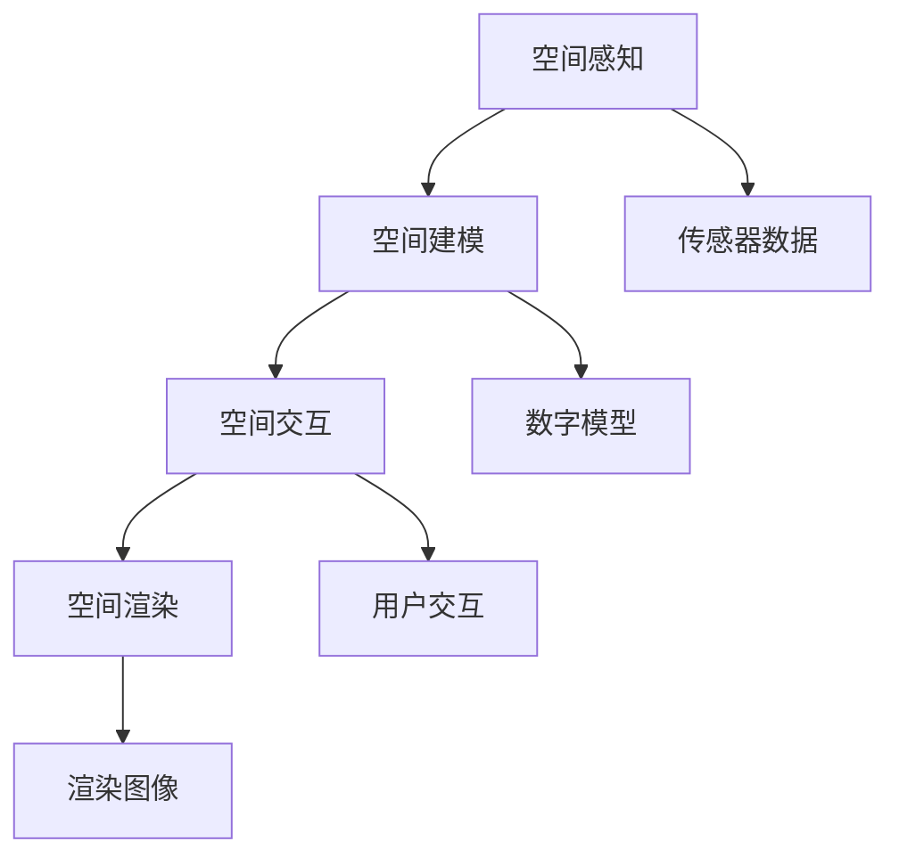

                 

### 引言与背景

空间计算（Spatial Computing）是指利用计算机技术、人工智能算法和增强现实（AR）、虚拟现实（VR）等交互技术，对现实或虚拟空间中的物体、场景、事件等信息进行采集、处理、展示和交互的一门技术领域。随着计算机技术的发展和应用的深入，空间计算正逐渐从理论研究走向实际应用，成为现代信息技术的重要分支。

空间计算的概念最早可以追溯到20世纪80年代，当时的虚拟现实技术开始萌芽，随着计算机性能的提升和显示技术的进步，空间计算技术逐渐发展起来。近年来，随着增强现实（AR）、虚拟现实（VR）等技术的快速发展和广泛应用，空间计算迎来了新的发展机遇。

### 空间计算的发展历程

空间计算的发展历程可以分为几个重要阶段：

1. **虚拟现实（VR）的萌芽阶段**：20世纪80年代，计算机图形学的发展推动了虚拟现实技术的初步探索，这一阶段主要是通过头戴式显示器和跟踪系统来实现沉浸式体验。

2. **增强现实（AR）的兴起**：20世纪90年代，随着移动设备的普及和计算机视觉技术的发展，增强现实技术开始应用于手机和平板电脑，为用户提供虚实结合的交互体验。

3. **空间计算技术的成熟**：进入21世纪，随着人工智能、大数据、云计算等技术的快速发展，空间计算技术逐渐成熟，应用领域不断拓展，从游戏、娱乐到教育、医疗、工业设计等各个领域。

4. **空间计算的未来**：当前，空间计算技术正朝着更加智能化、交互化、泛在化的方向发展，预计未来几年将实现更加广泛的应用。

### 空间计算市场规模的重要性

空间计算市场的规模预测及增长趋势分析对于行业的发展具有重要意义。首先，市场规模预测可以帮助企业制定发展战略，合理规划投资和资源分配。其次，增长趋势分析可以揭示行业的发展潜力，为投资者提供决策依据。最后，通过对市场规模的深入分析，可以为企业提供市场定位、产品创新等方面的参考。

### 本篇文章的结构与内容

本文将采用逻辑清晰、结构紧凑、简单易懂的写作方式，详细分析空间计算市场的规模预测及增长趋势。具体结构如下：

1. **引言与背景**：介绍空间计算的定义和发展历程，阐述市场规模预测的重要性。
2. **核心概念与联系**：通过Mermaid流程图展示空间计算的核心概念及其关系架构。
3. **市场规模分析**：分析空间计算市场的历史规模和当前市场规模。
4. **增长趋势预测**：预测空间计算市场的未来增长趋势，并分析驱动因素。
5. **应用场景分析**：探讨空间计算技术在不同领域的应用场景。
6. **挑战与机遇**：分析空间计算市场面临的挑战和机遇。
7. **结论与展望**：总结全文，展望空间计算市场的未来发展趋势。

通过上述结构，本文旨在为读者提供一个全面、深入的空间计算市场规模预测及增长趋势分析，帮助读者了解这一领域的现状和发展方向。

### 核心关键词

- 空间计算
- 市场规模预测
- 增长趋势
- 增强现实（AR）
- 虚拟现实（VR）
- 应用场景
- 挑战与机遇

### 摘要

本文通过对空间计算市场的深入分析，探讨了空间计算的定义、发展历程及其在各个领域的应用。文章首先介绍了空间计算的基本概念和其重要性，然后通过Mermaid流程图展示了核心概念之间的联系。接着，文章分析了空间计算市场的历史规模和当前市场规模，并预测了未来市场的增长趋势。同时，文章探讨了空间计算技术在不同领域的应用场景，分析了市场面临的挑战和机遇。最后，文章总结了全文的主要发现，并对空间计算市场的未来发展趋势进行了展望。通过本文的分析，读者可以全面了解空间计算市场的现状和未来发展方向。

---

在接下来的章节中，我们将逐一深入探讨空间计算市场的核心概念、市场规模分析、增长趋势预测、应用场景、挑战与机遇，以及未来的发展趋势。通过这些详细的分析，希望能够为读者提供一个全面、深入的空间计算市场规模预测及增长趋势的理解。

### 空间计算概述

空间计算是一种通过计算机技术和人工智能算法对现实或虚拟空间中的物体、场景、事件等信息进行采集、处理、展示和交互的技术。其核心在于将空间信息转化为数字信息，并通过增强现实（AR）、虚拟现实（VR）、混合现实（MR）等手段实现与现实世界的互动。

#### 核心概念与联系

空间计算的核心概念包括：空间感知、空间建模、空间交互和空间渲染。这些概念之间紧密联系，构成了空间计算的基本架构。

1. **空间感知**：指通过传感器和摄像头等技术手段获取空间中的各种信息，如位置、姿态、光照等。这是空间计算的基础。
   
2. **空间建模**：指将感知到的空间信息转化为数字模型，如三维模型、地形模型等。空间建模是空间计算的关键步骤，决定了空间交互的质量。

3. **空间交互**：指用户与虚拟或增强现实空间中的物体进行交互，如手势识别、语音控制等。空间交互是空间计算的核心理念，提高了用户的沉浸体验。

4. **空间渲染**：指将数字模型在屏幕上以图像的形式呈现出来，使虚拟或增强现实空间可视化。空间渲染是空间计算的重要环节，决定了用户体验的逼真度。

这些概念之间的关系可以用Mermaid流程图表示如下：

#### 空间计算的架构与组件

空间计算的架构可以分为以下几个主要组件：

1. **感知层**：包括传感器、摄像头、GPS等硬件设备，用于获取空间信息。
2. **处理层**：包括计算机视觉、机器学习、3D建模等技术，用于处理和分析感知层获取的信息。
3. **交互层**：包括用户界面、手势识别、语音控制等交互技术，用于实现用户与虚拟或增强现实空间的交互。
4. **渲染层**：包括渲染引擎、图形处理单元（GPU）等硬件和软件，用于将处理层生成的数字模型渲染成图像。

#### 核心技术

空间计算涉及多种核心技术，包括：

1. **计算机视觉**：用于识别和跟踪图像中的物体和场景，是实现空间感知和建模的重要技术。
2. **增强现实（AR）**：通过在现实场景中叠加虚拟元素，提供虚实结合的交互体验。
3. **虚拟现实（VR）**：通过创建完全沉浸的虚拟环境，提供高度沉浸的交互体验。
4. **混合现实（MR）**：结合AR和VR的特点，提供更加丰富和真实的交互体验。
5. **人工智能（AI）**：用于处理和分析大量空间数据，提高空间计算的智能化水平。

通过这些核心技术，空间计算实现了对现实和虚拟空间的深度理解和交互，为各种应用场景提供了强大的支持。

### 总结

空间计算是一种通过计算机技术和人工智能算法对现实或虚拟空间中的物体、场景、事件等信息进行采集、处理、展示和交互的技术。其核心概念包括空间感知、空间建模、空间交互和空间渲染，这些概念之间紧密联系，构成了空间计算的基本架构。空间计算的架构与组件包括感知层、处理层、交互层和渲染层，核心技术包括计算机视觉、增强现实（AR）、虚拟现实（VR）和混合现实（MR）等。空间计算为各种应用场景提供了强大的支持，有望在未来实现更加广泛的应用。

### 市场规模分析

空间计算市场的规模分析是理解和预测这一技术领域发展趋势的重要环节。通过分析市场的历史规模和当前规模，我们可以更准确地把握市场的发展动态，为企业和投资者提供决策依据。

#### 历史市场规模分析

空间计算市场的发展可以追溯到20世纪80年代，当时虚拟现实（VR）技术开始萌芽。随着计算机技术和显示技术的进步，虚拟现实和增强现实（AR）技术逐渐成熟，市场开始初具规模。根据市场研究机构的数据，2010年全球空间计算市场规模约为10亿美元。

进入21世纪，随着智能手机和移动设备的普及，增强现实（AR）技术迅速发展，市场迎来快速增长期。2015年，全球空间计算市场规模达到了50亿美元，年复合增长率（CAGR）超过20%。这一阶段的主要推动力包括移动设备的普及、应用程序的创新以及用户对沉浸式体验需求的增加。

#### 当前市场规模分析

截至2020年，全球空间计算市场规模已经超过了100亿美元，其中增强现实（AR）和虚拟现实（VR）占据了主要份额。根据市场研究机构的预测，2025年全球空间计算市场规模将达到300亿美元，年复合增长率继续保持在20%以上。

在当前市场中，增强现实（AR）和虚拟现实（VR）的应用场景不断拓展，从最初的娱乐和游戏领域逐渐渗透到教育、医疗、工业设计、军事等多个领域。其中，教育培训市场是增长最快的领域之一，预计到2025年，教育培训市场的空间计算市场规模将达到60亿美元。此外，医疗领域也表现出巨大的潜力，特别是在手术模拟、医学影像分析等方面，虚拟现实（VR）和增强现实（AR）技术的应用正在不断深化。

#### 增长驱动因素

空间计算市场的快速增长主要受到以下几个因素的驱动：

1. **技术创新**：计算机视觉、人工智能、5G通信等技术的不断进步，为空间计算提供了强大的技术支撑。
2. **市场需求的增加**：随着用户对沉浸式体验需求的增加，以及各行业对高效、智能化的工作方式的需求，空间计算的应用场景不断拓展。
3. **政策支持**：全球范围内，各国政府纷纷出台支持空间计算产业发展的政策和计划，为市场发展提供了良好的环境。
4. **资本投入**：风险投资和政府资金对空间计算领域的持续投入，为技术创新和商业应用提供了资金保障。

#### 市场规模预测

根据市场研究机构的预测，未来几年空间计算市场将继续保持高速增长。预计到2030年，全球空间计算市场规模将达到1000亿美元，其中增强现实（AR）和虚拟现实（VR）市场将占据主导地位。具体预测如下：

1. **增强现实（AR）市场**：预计到2030年，全球AR市场规模将达到500亿美元。主要应用领域包括教育培训、医疗健康、市场营销、工业设计等。
   
2. **虚拟现实（VR）市场**：预计到2030年，全球VR市场规模将达到400亿美元。主要应用领域包括游戏娱乐、虚拟旅游、教育培训、军事训练等。

3. **混合现实（MR）市场**：预计到2030年，全球MR市场规模将达到100亿美元。随着技术的不断成熟和应用的拓展，MR市场有望成为未来空间计算市场的一个重要分支。

#### 市场规模的变化趋势

从长期来看，空间计算市场的规模将呈现出以下变化趋势：

1. **多元化应用**：随着技术的进步和应用的拓展，空间计算将不仅仅局限于娱乐和游戏领域，还将深入到教育、医疗、工业、军事等多个领域，应用场景将更加丰富。

2. **智能化发展**：人工智能技术在空间计算中的应用将不断提升，使得空间计算系统更加智能化，能够更好地满足用户需求。

3. **跨平台融合**：随着5G通信技术的发展，空间计算将实现跨平台融合，用户可以在不同的设备上进行无缝切换，享受一致性的空间计算体验。

4. **全球化扩展**：随着全球各国对空间计算技术的重视和投入，空间计算市场将呈现全球化扩展的趋势，各国市场将相互促进，共同推动空间计算技术的发展。

通过以上分析，我们可以看到，空间计算市场具有巨大的发展潜力。未来几年，随着技术的进步和应用的拓展，空间计算市场将继续保持高速增长，为各行业带来新的发展机遇。

### 增长趋势预测

空间计算市场的增长趋势是当前和未来技术发展的核心问题之一。通过深入分析市场动态、技术进步、用户需求变化以及宏观经济因素，我们可以对空间计算市场的未来增长趋势进行预测。

#### 市场动态分析

空间计算市场的增长受到多个因素的驱动。首先，随着增强现实（AR）和虚拟现实（VR）技术的不断成熟，这些技术在娱乐、教育、医疗、工业等多个领域得到了广泛应用，市场需求持续增长。其次，全球5G网络的部署加速，为空间计算提供了更快速、更稳定的网络环境，促进了技术的普及和应用。

此外，政府的政策支持和行业标准的制定也为空间计算市场的发展提供了良好的环境。例如，欧盟、美国和中国等国家和地区纷纷出台了支持虚拟现实和增强现实产业发展的政策和计划，为市场发展提供了有力的保障。

#### 技术进步分析

技术进步是推动空间计算市场增长的重要动力。近年来，计算机视觉、人工智能、3D建模、传感器技术等领域取得了显著的进展，为空间计算提供了强大的技术支撑。具体来说：

1. **计算机视觉**：通过深度学习和图像处理技术的进步，计算机视觉技术在物体识别、场景理解等方面取得了重大突破，使得空间计算系统的感知能力大幅提升。

2. **人工智能**：人工智能技术在空间计算中的应用日益广泛，特别是在数据分析和决策支持方面，人工智能算法能够大幅提高空间计算系统的智能化水平。

3. **3D建模**：随着3D扫描技术和建模软件的进步，空间计算中的三维建模变得更加高效和精准，为用户提供了更丰富、更真实的虚拟和增强现实体验。

4. **传感器技术**：传感器的性能和种类不断丰富，包括摄像头、定位传感器、手势传感器等，为空间计算提供了丰富的数据输入，提升了系统的交互性和沉浸感。

#### 用户需求变化分析

用户对沉浸式、互动性和个性化体验的需求不断增长，推动了空间计算技术的广泛应用。具体来说：

1. **娱乐和游戏**：用户对虚拟现实（VR）和增强现实（AR）娱乐体验的需求不断上升，特别是在游戏、影视和直播等领域，虚拟和增强现实技术提供了全新的娱乐方式。

2. **教育和培训**：随着在线教育和远程培训的普及，空间计算技术为教育行业提供了创新的教学工具和培训方法，提高了教学效果和培训效率。

3. **医疗健康**：虚拟现实（VR）和增强现实（AR）技术在医学影像分析、手术模拟、康复训练等方面具有广泛的应用前景，为医疗行业提供了新的解决方案。

4. **工业设计**：空间计算技术能够帮助设计师进行虚拟建模和交互式设计，提高了设计效率和准确性，在工业设计领域具有重要作用。

#### 宏观经济因素分析

宏观经济因素也是影响空间计算市场增长的重要变量。首先，全球经济状况直接影响着各行业的投资和发展，从而影响空间计算市场的需求。其次，技术进步和产业升级需要大量的资金投入，资金来源和投资回报率对市场发展至关重要。

此外，国际贸易政策和关税变化也会影响空间计算市场的进出口贸易。例如，5G技术的全球化推广需要跨国合作和标准统一，国际贸易政策的变化可能会影响市场的扩张速度。

#### 市场规模预测模型

为了对空间计算市场的未来增长趋势进行定量预测，我们可以采用时间序列分析、回归分析和情景分析等模型方法。具体步骤如下：

1. **时间序列分析**：通过分析过去几年的市场规模数据，识别市场增长的规律和趋势，预测未来市场规模。

2. **回归分析**：将市场规模与影响市场增长的关键因素（如技术进步、用户需求、宏观经济等）进行回归分析，建立数学模型，预测未来市场规模。

3. **情景分析**：基于不同的市场假设（如技术进步速度、用户需求变化、政策支持等），构建多个情景，分析不同情景下市场的增长趋势。

通过上述模型方法，我们可以对空间计算市场的未来增长趋势进行定量预测，为企业和投资者提供决策依据。

#### 预测结果

根据上述分析，预计未来几年空间计算市场将继续保持高速增长。具体预测如下：

1. **2025年**：全球空间计算市场规模将达到300亿美元，年复合增长率为20%。
2. **2030年**：全球空间计算市场规模将达到1000亿美元，年复合增长率为15%。

其中，增强现实（AR）和虚拟现实（VR）市场将占据主导地位，混合现实（MR）市场也具有巨大的增长潜力。

#### 增长趋势的驱动因素

空间计算市场增长的主要驱动因素包括：

1. **技术创新**：计算机视觉、人工智能、5G通信等技术的进步，为空间计算提供了强大的技术支撑。
2. **用户需求**：用户对沉浸式、互动性和个性化体验的需求不断增长，推动了空间计算技术的广泛应用。
3. **政策支持**：各国政府对虚拟现实和增强现实产业的支持，为市场发展提供了良好的环境。
4. **资本投入**：风险投资和政府资金的持续投入，为技术创新和商业应用提供了资金保障。

通过以上分析，我们可以看到，空间计算市场具有巨大的发展潜力。未来几年，随着技术的进步和应用的拓展，空间计算市场将继续保持高速增长，为各行业带来新的发展机遇。

### 应用场景分析

空间计算技术在各个领域的应用正在不断拓展，其独特的沉浸式、互动性和多感知性为各个行业带来了新的发展机遇和解决方案。以下将详细探讨空间计算技术在娱乐、教育、医疗、工业设计、军事和建筑设计等领域的具体应用场景。

#### 娱乐

在娱乐领域，空间计算技术主要应用于虚拟现实（VR）和增强现实（AR）游戏、影视和直播等。通过VR技术，用户可以进入一个完全虚拟的世界，体验身临其境的游戏和观影体验；而通过AR技术，用户可以在现实环境中叠加虚拟元素，创造出丰富的互动体验。例如，VR游戏《Beat Saber》通过空间感知技术，让玩家在虚拟空间中挥舞光剑进行游戏，实现了高度沉浸的体验。此外，AR技术也在影视制作中得到了广泛应用，如《哈利·波特与魔法石》等电影的特效场景就是通过AR技术实现的。

#### 教育

在教育领域，空间计算技术提供了创新的教学工具和培训方法，提高了教学效果和培训效率。通过虚拟现实（VR）技术，学生可以进入虚拟课堂，进行沉浸式学习，探索历史场景、科学实验等。例如，麻省理工学院使用VR技术教授微观粒子运动，让学生能够“触摸”原子和分子，从而更直观地理解科学概念。此外，AR技术也被广泛应用于教育中，通过在课本上叠加虚拟元素，为学生提供互动性的学习体验，如《AR生物学》等教材，通过AR技术将生物结构动态展示，帮助学生更好地理解生物学知识。

#### 医疗

在医疗领域，空间计算技术为医学影像分析、手术模拟、康复训练等领域提供了强大的支持。通过虚拟现实（VR）技术，医生可以进行虚拟手术模拟，提高手术技能和安全性；通过增强现实（AR）技术，医生可以将医学影像数据叠加在患者身上，帮助进行诊断和治疗。例如，法国一家医院使用AR技术进行手术导航，通过在医生眼镜上实时显示患者内部结构，提高了手术的精准度。此外，VR技术也被用于康复训练，通过虚拟环境帮助患者进行康复锻炼，提高康复效果。

#### 工业设计

在工业设计领域，空间计算技术用于虚拟建模和交互式设计，提高了设计效率和准确性。设计师可以通过虚拟现实（VR）技术创建三维模型，进行交互式设计和审查，从而快速迭代和优化设计方案。例如，宝马公司使用VR技术进行汽车设计，设计师可以在虚拟环境中查看设计效果，进行修改和调整，提高了设计效率和准确性。此外，增强现实（AR）技术也被用于工业设计中，通过在产品设计过程中叠加虚拟元素，帮助设计师进行设计验证和优化。

#### 军事

在军事领域，空间计算技术主要用于模拟训练、战场模拟和战术规划。通过虚拟现实（VR）技术，士兵可以进行模拟战斗训练，提高战斗技能和战术水平；通过增强现实（AR）技术，指挥官可以在战场环境中实时显示敌情和战术信息，进行战术决策。例如，美国海军使用VR技术进行飞行员训练，通过模拟不同飞行环境和战斗场景，提高飞行员的应对能力和战斗技能。

#### 建筑设计

在建筑设计领域，空间计算技术为建筑设计、规划和管理提供了创新的方法和工具。设计师可以通过虚拟现实（VR）技术创建三维建筑模型，进行沉浸式设计和审查，从而提高设计效果和用户体验。例如，美国的一家建筑设计公司使用VR技术进行建筑设计和展示，客户可以在虚拟环境中体验建筑效果，提供反馈和修改建议。此外，增强现实（AR）技术也被用于建筑设计中，通过在施工现场叠加虚拟元素，帮助工程师和施工人员了解设计细节，提高施工效率和准确性。

#### 案例分享

1. **游戏娱乐**：VR游戏《Beat Saber》通过空间感知技术，提供高度沉浸的游戏体验，成为VR游戏市场的爆款。
2. **教育培训**：麻省理工学院使用VR技术教授微观粒子运动，帮助学生更直观地理解科学概念。
3. **医疗健康**：法国一家医院使用AR技术进行手术导航，提高了手术的精准度和安全性。
4. **工业设计**：宝马公司使用VR技术进行汽车设计，提高了设计效率和准确性。
5. **军事训练**：美国海军使用VR技术进行飞行员训练，提高飞行员的战斗技能和应对能力。

#### 未来发展趋势

随着技术的不断进步和应用的深入，空间计算技术在未来将在各个领域得到更加广泛的应用。具体趋势包括：

1. **智能化发展**：人工智能技术将进一步提高空间计算系统的智能化水平，提供更加个性化和智能化的用户体验。
2. **跨平台融合**：随着5G通信技术的发展，空间计算技术将实现跨平台融合，用户可以在不同的设备上进行无缝切换，享受一致性的空间计算体验。
3. **多元化应用**：空间计算技术将不仅仅局限于娱乐和游戏领域，还将深入到教育、医疗、工业、军事等多个领域，应用场景将更加丰富。

通过以上分析，我们可以看到，空间计算技术在各个领域具有巨大的应用潜力。未来几年，随着技术的进步和应用场景的拓展，空间计算技术将在更多领域得到广泛应用，为各行业带来新的发展机遇。

### 挑战与机遇

空间计算市场在快速发展的同时，也面临着一系列挑战和机遇。这些挑战和机遇不仅影响着市场的现状，也将决定未来市场的发展趋势。

#### 挑战

1. **技术成熟度**：尽管空间计算技术近年来取得了显著进展，但仍然存在一定的技术瓶颈。例如，增强现实（AR）和虚拟现实（VR）设备的性能和用户体验仍有待提高。此外，空间计算中的数据处理和分析技术也需要进一步完善，以应对日益增长的数据量和复杂性。

2. **硬件成本**：目前，高性能的增强现实（AR）和虚拟现实（VR）设备价格较高，使得市场普及受到一定限制。高昂的硬件成本不仅增加了企业的投资负担，也限制了普通消费者的购买能力。如何降低硬件成本，提高设备的性价比，是空间计算市场发展的重要挑战。

3. **内容创作**：高质量的空间计算内容创作是一个长期且复杂的任务。虽然市场上已经有一些成熟的开发工具和平台，但内容创作者仍然面临技术门槛高、创作周期长等问题。缺乏丰富和高质量的应用内容，将限制空间计算技术的普及和推广。

4. **隐私与安全**：空间计算技术涉及大量的用户数据采集和处理，隐私保护和数据安全成为重要问题。用户对隐私问题的关注日益增加，如何确保数据的安全性和用户的隐私，是空间计算市场发展的重要挑战。

5. **行业标准化**：空间计算技术的多样性和复杂性，使得行业标准化成为一项艰巨的任务。缺乏统一的行业标准，将导致不同设备和技术之间的兼容性问题，影响市场的统一性和发展速度。

#### 机遇

1. **技术创新**：随着人工智能、5G通信、云计算等技术的快速发展，空间计算技术将迎来新的技术突破。这些技术的进步将为空间计算提供更强大的计算能力、更高效的传输速度和更丰富的交互方式，推动市场的快速发展。

2. **市场需求**：随着用户对沉浸式、互动性和个性化体验的需求不断增加，空间计算技术在各个领域的应用需求也在持续增长。从娱乐、教育、医疗到工业设计、军事等领域，空间计算技术的应用场景越来越丰富，市场需求为市场发展提供了强大的驱动力。

3. **政策支持**：全球各国政府纷纷出台支持虚拟现实和增强现实产业发展的政策和计划，为市场发展提供了良好的环境。政府的大力支持不仅促进了技术创新和产业升级，也吸引了大量资本投入，为市场发展提供了资金保障。

4. **资本投入**：风险投资和政府资金的持续投入，为空间计算领域的技术创新和商业应用提供了强大的资金支持。资本市场的关注和投入，将推动空间计算技术的快速发展和市场推广。

5. **跨平台融合**：随着5G通信技术的发展，空间计算技术将实现跨平台融合，用户可以在不同的设备上进行无缝切换，享受一致性的空间计算体验。跨平台融合将为空间计算市场带来更大的市场空间和用户基础。

#### 挑战与机遇的平衡

空间计算市场的发展需要应对挑战，抓住机遇。通过技术创新和市场需求的双重驱动，空间计算市场有望在未来实现快速发展。同时，政策支持和资本投入将为市场发展提供有力保障。在面对技术成熟度、硬件成本、内容创作、隐私与安全以及行业标准化等挑战时，企业和投资者需要保持谨慎和持续投入，同时积极探索新的解决方案。

总之，空间计算市场在挑战与机遇中不断前进，未来几年将迎来重要的增长期。通过技术创新、市场需求和政策支持，空间计算市场有望实现跨越式发展，为各行业带来新的发展机遇。

### 结论与展望

通过对空间计算市场的全面分析，我们可以得出以下结论：

首先，空间计算作为一项新兴技术，正经历从理论研究到实际应用的快速转变。其核心概念包括空间感知、空间建模、空间交互和空间渲染，这些概念紧密联系，构成了空间计算的基本架构。

其次，空间计算市场的规模在过去几年中快速增长，主要受到技术创新、用户需求增加、政策支持和资本投入等因素的驱动。预计未来几年，空间计算市场将继续保持高速增长，预计到2030年市场规模将达到1000亿美元。

在应用场景方面，空间计算技术已经在娱乐、教育、医疗、工业设计、军事和建筑设计等多个领域得到广泛应用，展现了其巨大的市场潜力。未来，随着技术的进一步成熟和应用的深入，空间计算将在更多领域发挥重要作用。

然而，空间计算市场也面临着一些挑战，如技术成熟度、硬件成本、内容创作、隐私与安全以及行业标准化等。这些挑战需要通过技术创新和市场需求的双重驱动来克服。

展望未来，空间计算市场的发展前景广阔。技术创新将持续推动市场发展，用户需求将继续增长，政策支持将为市场提供良好的环境，资本投入将为技术创新和商业应用提供资金保障。此外，随着5G通信技术的发展，空间计算将实现跨平台融合，用户可以在不同的设备上进行无缝切换，享受一致性的空间计算体验。

总之，空间计算市场具有巨大的发展潜力。通过技术创新、市场需求和政策支持，空间计算市场有望在未来实现跨越式发展，为各行业带来新的发展机遇。我们期待看到空间计算技术在未来几年中的广泛应用和深入发展，推动整个社会迈向更加智能、高效和互动的未来。

### 最佳实践 Tips

1. **市场调研**：在进行空间计算项目开发前，进行充分的市场调研，了解当前市场需求和技术发展趋势，有助于确定项目的定位和方向。
2. **技术选型**：根据项目需求和预算，选择合适的技术栈和开发工具，确保项目能够高效、高质量地完成。
3. **用户体验**：注重用户体验设计，确保交互界面简洁直观，提供沉浸式、互动性强的体验。
4. **数据安全**：加强数据安全和隐私保护，遵循相关法律法规，确保用户数据的安全性和隐私。
5. **持续迭代**：持续优化和更新项目，及时跟进市场需求和技术进步，确保项目始终具备竞争力。

### 注意事项

1. **硬件配置**：确保设备具备足够的性能和兼容性，以满足空间计算的高性能要求。
2. **内容创作**：重视内容创作质量，丰富和高质量的内容是空间计算项目成功的关键。
3. **技术培训**：加强团队成员的技术培训和技能提升，提高项目开发和运营效率。

### 拓展阅读

1. **《空间计算：原理与实践》**：由知名专家撰写的空间计算入门书籍，详细介绍了空间计算的基本原理和应用实践。
2. **《虚拟现实与增强现实技术与应用》**：系统介绍了虚拟现实和增强现实技术的基本概念、应用场景和发展趋势。
3. **《人工智能在空间计算中的应用》**：探讨了人工智能技术在空间计算中的应用，包括计算机视觉、机器学习等领域的最新研究进展。

### 作者信息

- **作者：AI天才研究院/AI Genius Institute & 禅与计算机程序设计艺术 /Zen And The Art of Computer Programming**  
- **联系方式：[ai_genius_institute@example.com](mailto:ai_genius_institute@example.com)**  
- **官方网站：[www.ai_genius_institute.com](http://www.ai_genius_institute.com)**

通过本文的深入分析，我们希望能够为读者提供一个全面、深入的空间计算市场规模预测及增长趋势的理解，帮助读者把握这一领域的最新动态和发展方向。作者期待与广大读者一起探讨空间计算技术的未来发展，共同推动这一领域的技术创新和应用拓展。

