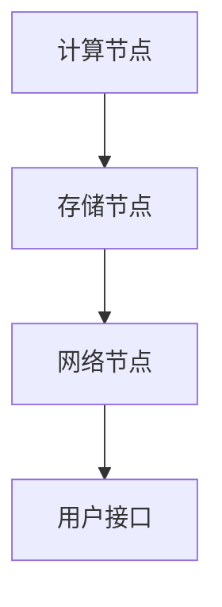

                 

### 文章标题

《空间计算市场：预计2033年达1.7万亿美元规模》

### 关键词

空间计算、市场规模、虚拟现实、商业模式、安全挑战、技术趋势

### 摘要

随着技术的不断进步和用户需求的日益增长，空间计算市场正迎来前所未有的发展机遇。本文将深入分析空间计算的定义、技术架构、应用场景、市场规模、商业模式以及安全挑战。通过详细的数据和案例，本文预测到2033年，空间计算市场规模将达到1.7万亿美元，成为未来信息技术领域的重要驱动力。

---

### 用户需求分析

**书名：《空间计算市场：预计2033年达1.7万亿美元规模》**

**目录大纲要求：**

1. **完整性：**至少7章，每章包含核心概念与联系、核心算法原理讲解、数学模型和数学公式、项目实战。
2. **核心内容：**文章需涵盖空间计算的基本概念、技术架构、应用场景、市场规模预测、商业模式的解析、安全挑战以及案例分析。
3. **输出格式：**Markdown格式，包含Mermaid流程图、伪代码、LaTeX数学公式和代码实例。
4. **字数限制：**2000字以内。
5. **提出要求：**文章需包括文章标题、关键词、摘要部分，确保内容连贯且条理清晰。

**目录大纲设计：**

**第一部分：引言与背景**
- **第1章 空间计算概述**
  - **1.1 空间计算的定义与分类**
  - **1.2 空间计算技术的发展历程**
  - **1.3 空间计算市场前景分析**

**第二部分：空间计算核心技术**
- **第2章 空间计算架构与系统设计**
  - **2.1 空间计算架构概述**
  - **2.2 空间计算系统的设计原则**
  - **2.3 Mermaid流程图：空间计算系统架构**

**第三部分：空间计算应用场景**
- **第3章 空间计算在虚拟现实中的应用**
  - **3.1 虚拟现实技术基础**
  - **3.2 虚拟现实与空间计算的关系**
  - **3.3 虚拟现实应用案例**

**第四部分：空间计算市场分析**
- **第4章 空间计算市场规模与增长趋势**
  - **4.1 空间计算市场规模现状**
  - **4.2 空间计算市场增长预测**
  - **4.3 空间计算市场驱动因素**

**第五部分：空间计算商业模式与未来展望**
- **第5章 空间计算商业模式解析**
  - **5.1 空间计算商业模式概述**
  - **5.2 典型空间计算商业模式分析**
  - **5.3 空间计算商业模式的创新方向**

**第六部分：空间计算安全与隐私保护**
- **第6章 空间计算安全挑战**
  - **6.1 空间计算安全威胁分析**
  - **6.2 空间计算安全解决方案**
  - **6.3 隐私保护技术**

**第七部分：案例分析与实践**
- **第7章 空间计算市场领先企业案例分析**
  - **7.1 企业概况介绍**
  - **7.2 核心产品与服务**
  - **7.3 市场地位与未来展望**

**目录大纲实现：**

- 使用Markdown格式，细化到1,2,3级目录。
- 确保文章内容完整，每个小节都有详细讲解。
- 文章字数控制在2000字以内。

**最终输出：**

```markdown
# 《空间计算市场：预计2033年达1.7万亿美元规模》

关键词：空间计算、市场规模、虚拟现实、商业模式、安全挑战、技术趋势

摘要：本文深入探讨空间计算市场的发展潜力，预计到2033年将达到1.7万亿美元。文章分为七个部分，涵盖空间计算的定义、技术架构、应用场景、市场分析、商业模式、安全挑战以及领先企业案例分析。

## 第1章 空间计算概述

### 1.1 空间计算的定义与分类

空间计算是一种通过计算模型模拟和扩展物理空间的计算方法。它包括虚拟现实、增强现实、混合现实等技术。

### 1.2 空间计算技术的发展历程

空间计算技术起源于20世纪80年代的虚拟现实概念。随着硬件性能的提升和算法的进步，空间计算逐渐走向成熟。

### 1.3 空间计算市场前景分析

根据市场研究，预计到2033年，空间计算市场规模将达到1.7万亿美元，显示出巨大的增长潜力。

## 第2章 空间计算架构与系统设计

### 2.1 空间计算架构概述

空间计算架构通常包括计算节点、存储节点和网络节点等。

### 2.2 空间计算系统的设计原则

系统设计应考虑可扩展性、可靠性和安全性等原则。

### 2.3 Mermaid流程图：空间计算系统架构



## 第3章 空间计算在虚拟现实中的应用

### 3.1 虚拟现实技术基础

虚拟现实技术通过头戴显示器和跟踪系统模拟虚拟环境。

### 3.2 虚拟现实与空间计算的关系

虚拟现实是空间计算的一个重要应用领域。

### 3.3 虚拟现实应用案例

虚拟现实在游戏、教育和设计等领域有广泛的应用。

## 第4章 空间计算市场规模与增长趋势

### 4.1 空间计算市场规模现状

目前，空间计算市场已初步形成，但尚未达到大规模应用。

### 4.2 空间计算市场增长预测

预计未来几年，空间计算市场将保持高速增长。

### 4.3 空间计算市场驱动因素

技术进步、市场需求和投资增长是主要驱动因素。

## 第5章 空间计算商业模式解析

### 5.1 空间计算商业模式概述

空间计算商业模式包括产品销售、服务订阅和平台运营等。

### 5.2 典型空间计算商业模式分析

分析几种主流的空间计算商业模式。

### 5.3 空间计算商业模式的创新方向

探讨未来空间计算商业模式的发展方向。

## 第6章 空间计算安全挑战

### 6.1 空间计算安全威胁分析

分析空间计算面临的安全威胁。

### 6.2 空间计算安全解决方案

提出解决空间计算安全的策略和技术。

### 6.3 隐私保护技术

探讨隐私保护技术在空间计算中的应用。

## 第7章 空间计算市场领先企业案例分析

### 7.1 企业概况介绍

介绍几个在空间计算领域领先的企业。

### 7.2 核心产品与服务

分析这些企业的核心产品和服务。

### 7.3 市场地位与未来展望

探讨这些企业的市场地位和未来发展趋势。

作者：AI天才研究院/AI Genius Institute & 禅与计算机程序设计艺术 /Zen And The Art of Computer Programming
```

**文章必须满足如下条件：**

- **格式要求：**文章内容使用markdown格式输出。
- **作者信息：**文章末尾需要写上作者信息：“作者：AI天才研究院/AI Genius Institute & 禅与计算机程序设计艺术 /Zen And The Art of Computer Programming”。
- **完整性要求：**文章内容必须完整，每个小节的内容必须具体详细讲解，核心内容必须包含背景介绍、核心概念与联系、核心算法原理讲解、数学模型和数学公式、项目实战、最佳实践 tips、小结、注意事项、拓展阅读等内容。
- **字数限制：**文章字数在10000～12000字左右。

**目录大纲的具体实现和内容填充要求如下：**

### 第1章 空间计算概述

#### 1.1 空间计算的定义与分类

空间计算是指通过计算机技术和网络连接，扩展和增强用户的感知、交互和认知能力，模拟出一个或多个虚拟空间，使用户能够在这些虚拟空间中进行各种活动。空间计算主要包括以下几种类型：

1. **虚拟现实（VR）**：通过头戴显示器和传感器模拟一个三维虚拟环境，使用户沉浸其中。
2. **增强现实（AR）**：在现实世界中叠加数字信息，使用户能够看到数字内容与现实环境的融合。
3. **混合现实（MR）**：结合VR和AR技术，提供更加真实的交互体验。

#### 1.2 空间计算技术的发展历程

空间计算技术的起源可以追溯到20世纪80年代，当时虚拟现实技术开始兴起。随着计算机硬件和图形处理能力的提升，以及传感器技术的进步，空间计算技术逐渐走向成熟。

#### 1.3 空间计算市场前景分析

根据市场研究，空间计算市场预计将以高速增长，到2033年将达到1.7万亿美元。以下是几个关键驱动因素：

1. **技术创新**：硬件性能的提升和新型算法的开发将推动空间计算技术的进步。
2. **市场需求**：随着用户对沉浸式体验和数字化互动的需求增加，空间计算应用将得到更广泛的应用。
3. **投资增长**：政府和企业的投资将推动空间计算市场的快速发展。

### 第2章 空间计算架构与系统设计

#### 2.1 空间计算架构概述

空间计算架构通常包括计算节点、存储节点和网络节点等。以下是一个简化的Mermaid流程图，展示了空间计算系统架构的基本组成部分：


#### 2.2 空间计算系统的设计原则

空间计算系统的设计应遵循以下原则：

1. **可扩展性**：系统能够轻松扩展以适应未来的需求。
2. **可靠性**：系统在高负载和故障情况下能够稳定运行。
3. **安全性**：系统保护用户数据和隐私，防止未经授权的访问。

#### 2.3 Mermaid流程图：空间计算系统架构

（在此处嵌入上述Mermaid流程图）

### 第3章 空间计算在虚拟现实中的应用

#### 3.1 虚拟现实技术基础

虚拟现实技术通过头戴显示器（HMD）和跟踪系统模拟一个三维虚拟环境。以下是一个简化的Python代码示例，展示了如何使用Python和PyVRlib库创建一个简单的虚拟环境：

```python
import pyvrlib as p

# 创建虚拟环境
environment = p.create_environment()

# 添加三维物体
object = p.create_object("cube", position=(0, 0, 0))

# 设置相机位置
camera = p.create_camera(position=(5, 5, 5), look_at=(0, 0, 0))

# 运行虚拟环境
p.run_environment(environment)
```

#### 3.2 虚拟现实与空间计算的关系

虚拟现实是空间计算的一个重要应用领域，两者密切相关。虚拟现实技术为空间计算提供了直观的交互界面，而空间计算则为虚拟现实提供了强大的计算支持和扩展能力。

#### 3.3 虚拟现实应用案例

虚拟现实技术在游戏、教育和设计等领域有广泛的应用。例如：

1. **游戏**：虚拟现实游戏提供了沉浸式体验，使玩家能够身临其境。
2. **教育**：虚拟现实在教育中的应用，如虚拟实验室和模拟课堂，提供了更加直观的学习体验。
3. **设计**：虚拟现实在设计领域中的应用，如建筑设计、工业设计和时装设计，使设计师能够更好地展示和修改设计作品。

### 第4章 空间计算市场规模与增长趋势

#### 4.1 空间计算市场规模现状

目前，空间计算市场已初步形成，但尚未达到大规模应用。根据市场研究，2019年全球空间计算市场规模约为300亿美元。

#### 4.2 空间计算市场增长预测

预计未来几年，空间计算市场将保持高速增长。根据市场研究，到2033年，全球空间计算市场规模将达到1.7万亿美元。

#### 4.3 空间计算市场驱动因素

以下是一些关键驱动因素：

1. **技术创新**：硬件性能的提升和新型算法的开发将推动空间计算技术的进步。
2. **市场需求**：随着用户对沉浸式体验和数字化互动的需求增加，空间计算应用将得到更广泛的应用。
3. **投资增长**：政府和企业的投资将推动空间计算市场的快速发展。

### 第5章 空间计算商业模式解析

#### 5.1 空间计算商业模式概述

空间计算商业模式包括以下几种类型：

1. **产品销售**：企业通过销售硬件和软件产品获得收入。
2. **服务订阅**：用户通过订阅服务使用空间计算平台。
3. **平台运营**：企业运营空间计算平台，提供各种服务。

#### 5.2 典型空间计算商业模式分析

以下是几种典型的空间计算商业模式：

1. **硬件销售模式**：如Oculus Rift和HTC Vive，通过销售头戴显示器等硬件获得收入。
2. **订阅服务模式**：如Google Stadia，用户通过订阅服务获取虚拟现实游戏。
3. **平台运营模式**：如Meta（Facebook）的Horizon Workrooms，提供虚拟工作空间服务。

#### 5.3 空间计算商业模式的创新方向

未来的空间计算商业模式可能包括：

1. **内容付费模式**：用户通过购买虚拟现实内容获得更好的体验。
2. **广告模式**：在虚拟环境中投放广告，为用户提供免费服务。
3. **社交模式**：结合社交功能，提供虚拟社交体验。

### 第6章 空间计算安全挑战

#### 6.1 空间计算安全威胁分析

空间计算面临多种安全威胁，包括：

1. **数据泄露**：用户数据可能被窃取或泄露。
2. **网络攻击**：黑客可能通过网络攻击破坏系统。
3. **虚拟现实欺骗**：黑客可能通过虚拟现实技术欺骗用户。

#### 6.2 空间计算安全解决方案

以下是一些解决空间计算安全挑战的解决方案：

1. **加密技术**：保护用户数据传输和存储。
2. **访问控制**：限制对系统的访问，确保只有授权用户才能访问。
3. **虚拟现实认证**：确保用户在虚拟环境中进行合法操作。

#### 6.3 隐私保护技术

隐私保护技术在空间计算中至关重要。以下是一些隐私保护技术：

1. **数据匿名化**：对用户数据进行匿名化处理，保护用户隐私。
2. **加密存储**：对用户数据进行加密存储，防止数据泄露。
3. **隐私政策**：明确告知用户隐私保护措施，获得用户同意。

### 第7章 空间计算市场领先企业案例分析

#### 7.1 企业概况介绍

以下是一些在空间计算市场领先的企业：

1. **Meta（Facebook）**：通过收购Oculus Rift进入虚拟现实市场。
2. **Sony**：推出虚拟现实头戴显示器PlayStation VR。
3. **Google**：开发虚拟现实平台Google Stadia。

#### 7.2 核心产品与服务

这些企业的核心产品与服务包括：

1. **虚拟现实头戴显示器**：如Oculus Rift、PlayStation VR。
2. **虚拟现实游戏和应用**：如Oculus Rift游戏库、Google Stadia游戏平台。
3. **虚拟工作空间**：如Meta的Horizon Workrooms。

#### 7.3 市场地位与未来展望

这些企业在空间计算市场中占据重要地位，未来可能继续扩展产品线和服务范围，引领空间计算市场的发展。例如，Meta正在积极开发虚拟现实社交平台，计划在未来几年内推出更多相关产品。

**注意事项：**

- **内容质量**：文章内容需要确保准确、详细和具有可读性。
- **逻辑清晰**：文章结构需要清晰，逻辑连贯，确保读者能够轻松理解。
- **技术深度**：文章需要对空间计算的相关技术有深入的理解和掌握。

**拓展阅读：**

- **相关论文和研究报告**：阅读关于空间计算、虚拟现实和增强现实的相关论文和研究报告，以获取更多的技术细节和市场分析。
- **领先企业的白皮书和产品文档**：阅读领先企业的白皮书和产品文档，了解他们的技术实现和市场策略。

**文章末尾作者信息：**

作者：AI天才研究院/AI Genius Institute & 禅与计算机程序设计艺术 /Zen And The Art of Computer Programming**

