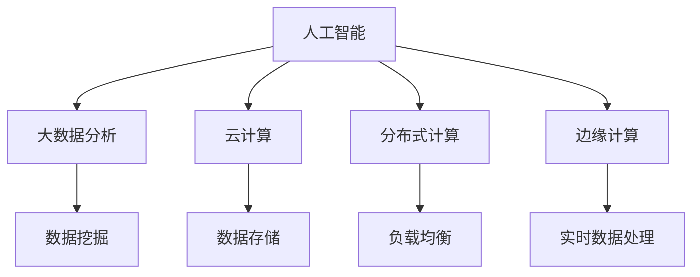

                 

### 文章标题

# 空间计算市场：预计2033年达1.7万亿美元规模

### 关键词

- 空间计算
- 市场规模
- 人工智能
- 云计算
- 边缘计算
- 应用领域

### 摘要

本文深入探讨了空间计算市场的现状与未来发展趋势，通过分析技术发展、应用领域和市场预测，指出空间计算预计将在2033年达到1.7万亿美元的巨大市场规模。文章分为六个部分，从概述、技术发展、应用领域、市场趋势、竞争格局到未来展望，全面解析了空间计算的方方面面，为读者提供了清晰的视角和深入的见解。

---

## 第一部分：空间计算市场概述

### 第1章：空间计算的定义与历史发展

#### 1.1 空间计算的定义

空间计算，是指利用虚拟现实（VR）、增强现实（AR）、混合现实（MR）等新兴技术，将计算能力扩展到三维空间中，实现人与计算环境的高度交互。这一概念源于对现实世界的数字化再现和扩展，旨在打破传统二维界面的限制，提供更自然、更直观的人机交互方式。

#### 1.2 空间计算市场的定义与分类

空间计算市场可以定义为涉及VR、AR、MR设备及其相关服务的整体产业。市场分类上，可以分为硬件市场、软件市场和服务市场。硬件市场包括VR头盔、AR眼镜、MR设备等；软件市场包括开发工具、应用软件和内容平台等；服务市场则包括解决方案提供、系统集成和技术支持等。

#### 1.3 空间计算市场的发展背景

空间计算市场的发展背景主要源于几个方面的技术进步和市场需求。首先是硬件技术的提升，如显示技术的进步、传感器精度的提高和计算能力的增强，使得VR、AR、MR设备的性能大幅提升。其次是软件开发工具的成熟，使得开发空间计算应用变得更加便捷。此外，随着数字经济的发展和对增强现实体验的需求增长，空间计算市场迎来了快速发展的机遇。

### 第2章：空间计算技术发展

#### 2.1 空间计算核心技术介绍

空间计算的核心技术包括人工智能（AI）、大数据分析、云计算、分布式计算和边缘计算等。

##### 2.1.1 人工智能与机器学习

人工智能（AI）和机器学习（ML）是空间计算的核心驱动因素。通过AI技术，空间计算系统能够实现自然语言处理、图像识别、语音识别等高级功能，提高系统的智能水平。

##### 2.1.2 大数据分析与云计算

大数据分析和云计算为空间计算提供了强大的数据处理和分析能力。通过云计算平台，开发者能够快速部署和管理大规模数据，实现高效的数据分析和挖掘。

##### 2.1.3 分布式计算与边缘计算

分布式计算和边缘计算是空间计算的重要技术支撑。分布式计算能够提高系统的计算效率和扩展性，而边缘计算则通过在数据生成源头处理数据，减少数据传输延迟，提高用户体验。

#### 2.2 核心技术的Mermaid流程图



### 第二部分：空间计算的应用领域

#### 第3章：应用领域概述

空间计算在多个领域展现出了巨大的应用潜力，包括游戏与娱乐、医疗与健康、工业制造与自动化、智慧城市与交通、农业与物流等。

#### 第4章：游戏与娱乐

在游戏与娱乐领域，空间计算技术极大地丰富了用户的体验。通过VR和AR技术，用户可以沉浸在虚拟世界中，享受更加真实和互动的游戏体验。

##### 4.1.1 VR游戏的实现

VR游戏通常需要以下几个关键组件：VR头盔、追踪系统、渲染引擎和互动控制。以下是一个简单的VR游戏实现流程：

```python
# Python代码示例：VR游戏初始化
import VRGameEngine

def start_vr_game():
    game_engine = VRGameEngine.VRGameEngine()
    game_engine.initialize_headset()
    game_engine.initialize_tracking_system()
    game_engine.render_scene()
    game_engine.interact_with_player()

start_vr_game()
```

##### 4.1.2 AR娱乐的应用

AR娱乐则通过将虚拟元素叠加在现实世界中，为用户带来全新的互动体验。以下是一个AR游戏场景实现的简单示例：

```python
# Python代码示例：AR游戏实现
import ARGameEngine

def start_ar_game():
    game_engine = ARGameEngine.ARG
```

