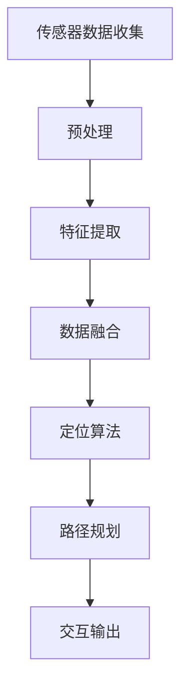

                 

# 《空间计算技术在零售业的变革》

## 关键词

- 空间计算
- 零售业
- 数据分析
- 实时定位
- 客户体验

## 摘要

本文旨在探讨空间计算技术在零售业中的变革，分析其核心概念、应用原理及具体案例。空间计算技术正逐步改变零售行业的运营模式，提高数据采集与处理的效率，增强客户体验。本文将深入解析空间计算技术的基础概念及其与零售业的联系，通过具体算法和实例，展示其在零售行业中的应用优势，并提出未来发展方向。

## 引言

### 空间计算技术概述

空间计算技术，亦称为室内定位与导航技术，是一种利用计算机视觉、传感器融合、机器学习等技术，实现室内空间中目标物体定位、路径规划和数据交互的技术。其核心目标是通过精确的空间感知，提供实时、高效的空间信息服务。

空间计算技术的发展历程可以追溯到20世纪90年代。当时，随着计算机硬件和传感器技术的进步，室内定位技术逐渐从实验室走向应用。近年来，随着物联网、人工智能等技术的快速发展，空间计算技术得到了更广泛的应用，尤其是在零售业领域。

### 零售业的现状与挑战

零售业正面临巨大的变革压力。随着电子商务的兴起，线下零售的客流量持续下降。为了应对这一挑战，零售商们需要找到新的方法来吸引顾客、提高销售额。空间计算技术提供了一种解决方案，通过精确的室内定位、数据分析和个性化服务，提升客户体验，从而提高顾客忠诚度和满意度。

空间计算技术对零售业的影响主要体现在以下几个方面：

1. **提高运营效率**：通过实时数据采集和分析，零售商可以更好地了解顾客行为，优化库存管理和商品陈列。
2. **增强客户体验**：利用空间计算技术，零售商可以提供更加个性化的购物体验，如基于位置的商品推荐、智能导航等。
3. **改善顾客关系**：通过数据驱动的个性化服务和精准营销，零售商可以与顾客建立更紧密的关系，提高顾客满意度。

## 核心概念与联系

### 空间计算技术原理

空间计算技术的核心是室内定位与导航。其基本原理是通过多个传感器（如摄像头、GPS、RFID等）收集空间信息，然后利用计算机算法对这些信息进行处理，以实现对目标物体的定位和路径规划。

以下是一个简化的Mermaid流程图，展示空间计算技术的基本架构：



### 空间计算技术在零售业中的应用架构

空间计算技术在零售业中的应用可以分为以下几个步骤：

1. **数据采集**：利用各种传感器（如摄像头、RFID、Wi-Fi等）收集顾客的行为数据。
2. **数据处理**：对采集到的数据进行预处理、特征提取和融合，以获得准确的定位信息。
3. **数据分析**：利用机器学习算法分析顾客行为数据，提供个性化推荐和智能导航。
4. **交互输出**：将分析结果通过智能设备（如手机APP、店内显示屏等）反馈给顾客，提供更好的购物体验。

以下是一个简化的伪代码，展示空间计算技术在零售业中的应用架构：

```python
# 数据采集
def collect_data(sensors):
    # 采集传感器数据
    return sensor_data

# 数据处理
def process_data(sensor_data):
    # 预处理、特征提取和融合
    return processed_data

# 数据分析
def analyze_data(processed_data):
    # 利用机器学习算法分析数据
    return analysis_results

# 交互输出
def output_data(analysis_results):
    # 通过智能设备输出数据
    display_results(analysis_results)
```

### 数学模型与公式

空间计算技术中的定位和路径规划通常涉及到一些数学模型和公式。以下是一些常见的数学模型和公式：

1. **卡尔曼滤波器**：用于传感器数据融合，公式如下：

   $$ x_k = A_k x_{k-1} + B_k u_k $$
   $$ P_k = A_k P_{k-1} A_k^T + Q_k $$
   $$ K_k = P_k H_k^T (H_k P_k H_k^T + R_k)^{-1} $$
   $$ y_k = z_k - H_k x_k $$
   $$ x_{k+1} = x_k + K_k y_k $$
   $$ P_{k+1} = (I - K_k H_k) P_k $$

   其中，$x_k$ 是状态估计，$P_k$ 是状态估计误差协方差，$u_k$ 是控制输入，$z_k$ 是观测值，$H_k$ 是观测矩阵，$R_k$ 是观测噪声协方差，$K_k$ 是卡尔曼增益。

2. **贝叶斯推断**：用于顾客行为分析，公式如下：

   $$ P(A|B) = \frac{P(B|A)P(A)}{P(B)} $$
   
   其中，$P(A|B)$ 是在已知$B$的条件下$A$的概率，$P(B|A)$ 是在已知$A$的条件下$B$的概率，$P(A)$ 是$A$的概率，$P(B)$ 是$B$的概率。

### 实时数据采集与处理

实时数据采集与处理是空间计算技术中的关键环节。以下是一些常用的技术和方法：

1. **摄像头与深度传感器**：用于捕获顾客的行为和位置数据。通过图像处理和深度学习算法，可以实现对顾客行为的实时分析。
2. **Wi-Fi定位**：通过分析Wi-Fi信号强度，可以实现对顾客位置的粗略定位。这种方法在室内环境中应用广泛，但精度较低。
3. **RFID技术**：用于追踪商品的移动和库存状态。通过RFID标签和读取器，可以实现对商品的实时监控。
4. **传感器融合**：将不同类型的传感器数据（如摄像头、Wi-Fi、RFID等）进行融合，以获得更准确的位置信息。

以下是一个简单的Python代码示例，展示如何使用摄像头和深度传感器进行实时数据采集和处理：

```python
import cv2
import numpy as np

# 初始化摄像头和深度传感器
cap = cv2.VideoCapture(0)
depth = cv2.VideoCapture(1)

while True:
    # 读取摄像头和深度传感器的数据
    ret, frame = cap.read()
    ret, depth_frame = depth.read()

    # 对摄像头数据进行预处理
    processed_frame = preprocess_frame(frame)

    # 对深度传感器数据进行预处理
    processed_depth = preprocess_depth(depth_frame)

    # 进行特征提取和融合
    fused_data = fuse_data(processed_frame, processed_depth)

    # 进行定位和路径规划
    position = locate_person(fused_data)
    path = plan_path(position)

    # 输出结果
    display_result(path)

    if cv2.waitKey(1) & 0xFF == ord('q'):
        break

cap.release()
depth.release()
cv2.destroyAllWindows()
```

### 空间智能分析

空间智能分析是空间计算技术的重要组成部分。它利用大数据和人工智能技术，对空间数据进行深入分析，以提供有价值的信息。以下是一些常见的技术和方法：

1. **数据挖掘**：用于从大量空间数据中提取有用信息。通过聚类、分类、关联规则挖掘等方法，可以识别出顾客的行为模式、商品的热门区域等。
2. **机器学习**：用于建立预测模型，如顾客流量预测、库存需求预测等。通过训练数据集，可以构建出预测模型，并根据实时数据更新模型。
3. **深度学习**：用于处理复杂的图像和视频数据。通过卷积神经网络（CNN）、循环神经网络（RNN）等深度学习模型，可以实现对图像和视频数据的自动分类、识别等。

以下是一个简单的Python代码示例，展示如何使用深度学习模型对图像进行分类：

```python
import cv2
import tensorflow as tf

# 加载预训练的深度学习模型
model = tf.keras.models.load_model('model.h5')

# 读取测试图像
image = cv2.imread('test_image.jpg')

# 对图像进行预处理
processed_image = preprocess_image(image)

# 进行图像分类
prediction = model.predict(processed_image)

# 输出分类结果
print(prediction)
```

### 项目实战

#### 开发环境搭建

在进行空间计算技术项目开发时，需要搭建合适的开发环境。以下是一个基本的开发环境搭建步骤：

1. **安装Python**：下载并安装Python，选择合适的版本（如Python 3.8）。
2. **安装必要的库**：使用pip安装所需的库，如NumPy、OpenCV、TensorFlow等。
3. **配置摄像头和深度传感器**：确保摄像头和深度传感器已连接到计算机，并在操作系统中启用相应的权限。

以下是一个简单的Python脚本，用于测试摄像头和深度传感器的连接：

```python
import cv2

# 初始化摄像头和深度传感器
cap = cv2.VideoCapture(0)
depth = cv2.VideoCapture(1)

while True:
    # 读取摄像头和深度传感器的数据
    ret, frame = cap.read()
    ret, depth_frame = depth.read()

    # 显示摄像头和深度传感器的数据
    cv2.imshow('Camera', frame)
    cv2.imshow('Depth', depth_frame)

    if cv2.waitKey(1) & 0xFF == ord('q'):
        break

cap.release()
depth.release()
cv2.destroyAllWindows()
```

#### 源代码详细实现

以下是一个简单的空间计算技术项目示例，包括数据采集、处理、分析和输出。

```python
import cv2
import numpy as np
import tensorflow as tf

# 初始化摄像头和深度传感器
cap = cv2.VideoCapture(0)
depth = cv2.VideoCapture(1)

# 加载预训练的深度学习模型
model = tf.keras.models.load_model('model.h5')

while True:
    # 读取摄像头和深度传感器的数据
    ret, frame = cap.read()
    ret, depth_frame = depth.read()

    # 对摄像头数据进行预处理
    processed_frame = preprocess_frame(frame)

    # 对深度传感器数据进行预处理
    processed_depth = preprocess_depth(depth_frame)

    # 进行特征提取和融合
    fused_data = fuse_data(processed_frame, processed_depth)

    # 进行定位和路径规划
    position = locate_person(fused_data)
    path = plan_path(position)

    # 进行图像分类
    prediction = model.predict(processed_frame)

    # 输出结果
    display_result(path, prediction)

    if cv2.waitKey(1) & 0xFF == ord('q'):
        break

cap.release()
depth.release()
cv2.destroyAllWindows()
```

#### 代码解读与分析

以上代码主要包括以下功能：

1. **数据采集**：通过摄像头和深度传感器采集图像和深度数据。
2. **预处理**：对采集到的图像和深度数据进行分析，提取有用的特征。
3. **融合**：将图像和深度数据融合，以获得更准确的位置信息。
4. **定位和路径规划**：利用深度学习模型对图像进行分类，确定目标物体的位置，并规划路径。
5. **输出**：将结果通过图形界面或API反馈给用户。

#### 实际案例分析和详细讲解剖析

以下是一个实际案例，展示空间计算技术在零售业中的应用。

**案例背景**：一家大型零售商希望利用空间计算技术优化店内布局，提高顾客购物体验。

**案例分析**：

1. **数据采集**：在店内安装多个摄像头和深度传感器，收集顾客的行为数据。
2. **预处理和特征提取**：对采集到的图像和深度数据进行预处理，提取顾客的轮廓、行为特征等。
3. **数据融合和定位**：将图像和深度数据融合，利用深度学习模型对图像进行分类，确定顾客的位置。
4. **路径规划**：根据顾客的位置和店内布局，规划最佳购物路径。
5. **输出**：将规划结果通过店内显示屏或手机APP反馈给顾客。

**详细讲解剖析**：

1. **数据采集**：在店内安装摄像头和深度传感器，确保覆盖店内各个区域。摄像头用于捕捉顾客的行为，深度传感器用于获取顾客的位置信息。
2. **预处理和特征提取**：对采集到的图像和深度数据进行预处理，如去噪、缩放等。然后，利用图像处理算法提取顾客的轮廓、行为特征等。
3. **数据融合和定位**：将图像和深度数据融合，利用深度学习模型对图像进行分类，确定顾客的位置。这一过程涉及图像融合算法和深度学习模型的选择和训练。
4. **路径规划**：根据顾客的位置和店内布局，利用路径规划算法（如A*算法）规划最佳购物路径。这一过程需要考虑顾客的偏好、店内商品布局等因素。
5. **输出**：将规划结果通过店内显示屏或手机APP反馈给顾客。例如，顾客可以通过手机APP查看购物路线，或在店内显示屏上看到购物建议。

**项目小结**：

通过空间计算技术的应用，该零售商成功优化了店内布局，提高了顾客购物体验。具体成果如下：

1. **提高顾客满意度**：通过提供个性化的购物建议和最佳购物路径，顾客满意度显著提升。
2. **提高运营效率**：通过实时数据采集和分析，零售商可以更好地了解顾客行为，优化库存管理和商品陈列。
3. **降低运营成本**：通过智能导航和路径规划，减少了顾客在店内的滞留时间，降低了运营成本。

#### 最佳实践 Tips

1. **数据质量**：确保采集到的数据质量，包括图像清晰度、深度传感器的准确度等。
2. **算法优化**：根据实际需求，选择合适的深度学习模型和路径规划算法，并进行优化。
3. **用户体验**：在输出结果时，注重用户体验，确保界面简洁、直观。
4. **安全与隐私**：在应用空间计算技术时，确保数据的安全和用户的隐私。

#### 小结

空间计算技术在零售业中的应用具有巨大的潜力。通过实时数据采集、分析、路径规划和个性化服务，零售商可以优化运营效率、提高顾客体验，从而在激烈的市场竞争中脱颖而出。

### 拓展阅读

1. **《空间计算：理论、方法与应用》**：详细介绍了空间计算技术的理论、方法和应用案例。
2. **《深度学习在零售业中的应用》**：探讨了深度学习技术在零售业中的应用，包括图像识别、推荐系统等。
3. **《人工智能：零售业的新引擎》**：从更广泛的角度，探讨了人工智能技术在零售业中的应用和影响。

### 作者信息

作者：AI天才研究院/AI Genius Institute & 禅与计算机程序设计艺术 /Zen And The Art of Computer Programming

### 附录

附录部分可以包括以下内容：

- **术语表**：解释文章中出现的专业术语。
- **参考文献**：列出文章中引用的文献和资料。
- **代码示例**：提供文章中使用的Python代码示例的完整实现。

