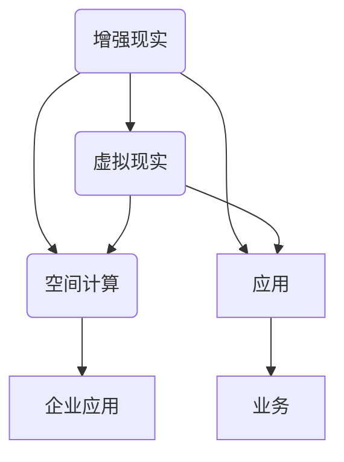
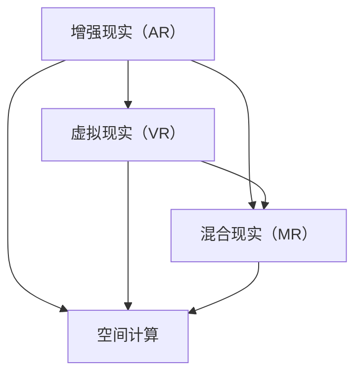

                 

## 《空间计算：增强现实和虚拟现实的企业应用》

### 关键词：空间计算、增强现实、虚拟现实、企业应用、技术创新

> 摘要：本文深入探讨空间计算在增强现实（AR）和虚拟现实（VR）领域的企业应用。通过解析核心概念、技术原理和实际案例，本文旨在为读者提供空间计算在企业环境中应用的全面理解和实践指导。

### 引言

随着技术的飞速发展，空间计算正逐渐成为企业创新的重要驱动力。增强现实（AR）和虚拟现实（VR）作为空间计算的重要组成部分，已经在多个行业中展现出巨大的潜力。AR技术通过将数字信息叠加到现实世界中，提供了丰富的交互体验；而VR技术则创造了一个完全虚拟的环境，使人们能够在其中沉浸式体验。企业应用这些技术，不仅能够提升工作效率，还能提供全新的客户体验。

本文将围绕空间计算在企业应用中的主题，详细探讨以下几个核心内容：

1. **空间计算的基本概念与历史背景**：介绍空间计算的定义、发展历程及其在企业应用中的重要性。
2. **增强现实和虚拟现实技术原理**：解析AR和VR的技术原理，包括视觉处理、空间定位、渲染等关键算法。
3. **空间计算在企业中的具体应用**：分析AR和VR技术在企业中的实际应用场景，探讨其带来的优势。
4. **企业应用开发实践**：通过项目实战案例，展示空间计算在企业中的开发流程和实现方法。
5. **未来展望与趋势**：探讨空间计算技术的未来发展方向，以及可能面临的挑战和解决方案。

### 确定书籍的核心主题和范围

#### 空间计算的基本概念

空间计算是一种将虚拟世界与现实世界融合的计算方式，通过使用AR和VR技术实现。它不仅仅是虚拟现实和增强现实技术的集合，更是一种全新的交互和体验方式。空间计算的核心目标是通过数字技术扩展人类的感知和认知能力，使其能够更高效、更直观地与信息互动。

#### 增强现实（AR）和虚拟现实（VR）技术

增强现实（AR）技术通过在现实环境中叠加虚拟元素，提供了新的交互方式。典型的AR应用包括教育、医疗、零售和制造等领域。例如，医生可以使用AR技术进行手术指导，工人可以通过AR眼镜查看维修说明。

虚拟现实（VR）技术则创造了一个完全虚拟的环境，用户可以在其中沉浸式体验。VR技术在游戏、娱乐、教育培训等领域有着广泛应用。例如，游戏玩家可以通过VR头盔进入一个全新的游戏世界，学生可以通过VR设备进行虚拟实验室操作。

#### 企业应用

空间计算在企业中的应用场景广泛，包括：

- **设计审查与模拟**：工程师可以通过VR技术进行产品设计审查和模拟，提高设计效率和质量。
- **培训与教育**：通过AR和VR技术，企业可以为员工提供更加沉浸式的培训体验，提高培训效果。
- **市场营销与客户体验**：企业可以通过AR技术提供虚拟试穿、虚拟展览等服务，增强客户体验。

### 设计大纲框架

为了确保书籍的完整性和逻辑性，我们设计了一个包含以下部分的大纲框架：

1. **引言**：介绍空间计算的概念和背景。
2. **核心概念与联系**：解释空间计算的基本概念，展示概念之间的关系架构。
3. **技术原理**：详细探讨增强现实和虚拟现实的技术原理。
4. **企业应用场景**：分析空间计算在各个行业中的应用场景。
5. **项目实战**：通过实际案例展示空间计算的应用开发流程。
6. **未来展望与趋势**：探讨空间计算技术的发展趋势和未来应用。
7. **附录**：提供相关的资源列表和术语解释。

### 详细规划各章节内容

#### 核心概念与联系

在第2章，我们将详细讨论空间计算的核心概念，并使用Mermaid流程图展示概念之间的关系架构。例如，我们可以展示AR和VR技术如何融合形成空间计算，以及它们在技术、应用和业务方面的关系。



#### 技术原理

在第3章，我们将深入探讨增强现实和虚拟现实的技术原理。这包括视觉处理、空间定位、渲染等关键算法。我们将使用Python源代码和LaTeX数学模型，结合具体示例，详细阐述这些技术原理。

```python
# Python代码示例：空间定位算法
def spatial_location(data):
    # 数据预处理
    processed_data = preprocess_data(data)
    
    # 空间定位
    location = locate_object(processed_data)
    
    return location

# LaTeX数学模型示例：视觉处理公式
$$\text{视觉处理} = \text{图像识别} + \text{图像增强} + \text{图像分割}$$
```

#### 企业应用场景

在第4章，我们将分析空间计算在企业中的应用场景。通过具体的案例分析，我们将展示AR和VR技术如何在不同行业中提升工作效率、降低成本、增强客户体验。

#### 项目实战

在第5章，我们将通过实际案例展示空间计算在企业中的开发流程。这包括开发环境的搭建、源代码的实现、代码解读和实际案例分析。

#### 未来展望与趋势

在第6章，我们将探讨空间计算技术的未来发展方向，包括技术创新、市场趋势和可能面临的挑战。

#### 附录

在第7章的附录部分，我们将提供相关的资源列表和术语解释，以帮助读者深入了解空间计算相关技术。

### 确保大纲的逻辑性和完整性

在完成大纲的编写后，我们将进行多次审查和修改，确保每个章节之间的逻辑连贯性，没有遗漏的重要知识点。同时，我们将优化文本和表达，确保文章的简洁明了，避免冗余。

### 目录大纲设计

下面是一个初步的目录大纲设计，用于指导书籍的撰写：

### 《空间计算：增强现实和虚拟现实的企业应用》目录大纲

## 第一部分：空间计算基础

### 第1章：空间计算概述

- 1.1 空间计算的定义与历史
- 1.2 空间计算的核心概念
- 1.3 空间计算的分类

### 第2章：核心概念与联系

- 2.1 增强现实技术原理
- 2.2 虚拟现实技术原理
- 2.3 空间计算与业务应用的关系架构

### 第3章：技术原理

- 3.1 视觉处理算法
- 3.2 空间定位算法
- 3.3 虚拟对象渲染算法
- 3.4 数学模型与公式

### 第4章：企业应用场景

- 4.1 设计审查与模拟
- 4.2 培训与教育
- 4.3 市场营销与客户体验
- 4.4 制造与工程

### 第5章：项目实战

- 5.1 开发环境搭建
- 5.2 项目实战案例
- 5.3 代码解读与分析

### 第6章：未来展望与趋势

- 6.1 技术发展趋势
- 6.2 市场规模与增长预测
- 6.3 技术挑战与解决方案

### 第7章：附录

- 7.1 空间计算资源列表
- 7.2 相关术语解释

### 文章结尾

本文旨在为读者提供空间计算在增强现实和虚拟现实领域的企业应用的全面理解和实践指导。通过详细解析核心概念、技术原理和实际案例，我们希望能够帮助企业和开发者更好地利用空间计算技术，实现业务创新和用户体验的提升。

### 作者信息

作者：AI天才研究院/AI Genius Institute & 禅与计算机程序设计艺术 /Zen And The Art of Computer Programming

---

### 第一章：空间计算概述

#### 1.1 空间计算的定义与历史

空间计算（Spatial Computing）是一种通过计算机生成和处理空间信息，实现虚拟世界与现实世界交互的技术。它不仅仅是增强现实（AR）和虚拟现实（VR）的简单叠加，而是一种全新的交互方式，能够扩展人类的感知和认知能力。

空间计算的历史可以追溯到1960年代，当时VR技术首次被提出。随着计算机技术的发展，VR和AR技术逐渐成熟，并在2010年代迎来了爆发式增长。特别是在移动设备的普及和传感技术的进步下，空间计算的应用场景不断拓展，从游戏、娱乐到教育、医疗、制造等多个领域。

#### 1.2 空间计算的核心概念

空间计算的核心概念包括以下几个方面：

1. **虚拟现实（VR）**：VR是一种完全沉浸式的虚拟环境，用户可以通过VR设备（如VR头盔）进入并体验一个完全虚拟的世界。VR技术主要通过视觉、听觉和触觉等多感官的模拟，提供沉浸式的体验。

2. **增强现实（AR）**：AR技术通过将虚拟元素叠加到现实世界中，提供额外的信息或交互体验。用户通过AR设备（如AR眼镜、智能手机等）可以看到现实世界中的虚拟对象，并与这些对象进行交互。

3. **混合现实（MR）**：MR技术结合了VR和AR的特点，提供了更加丰富的交互体验。用户可以在虚拟环境和现实环境之间自由切换，同时与虚拟对象进行交互。

#### 1.3 空间计算的分类

空间计算可以根据应用场景和技术特点进行分类：

1. **根据应用场景分类**：

   - **工业应用**：如产品设计、模拟测试、操作培训等。
   - **娱乐应用**：如游戏、虚拟旅游、娱乐体验等。
   - **教育应用**：如虚拟课堂、远程教学、技能训练等。
   - **医疗应用**：如手术指导、疾病诊断、康复训练等。

2. **根据技术特点分类**：

   - **基于VR的空间计算**：主要依赖于虚拟环境的构建和用户沉浸式体验。
   - **基于AR的空间计算**：主要依赖于现实环境的增强和虚拟元素与现实环境的融合。
   - **基于MR的空间计算**：结合了VR和AR的特点，提供了更加丰富的交互体验。

#### 1.4 空间计算在企业中的重要性

空间计算在企业发展中扮演着重要角色，其重要性体现在以下几个方面：

1. **提升工作效率**：通过空间计算技术，企业可以模拟和优化工作流程，提高工作效率和准确性。例如，工程师可以通过VR技术进行产品设计审查和模拟，减少错误和返工。

2. **降低成本**：空间计算技术可以帮助企业降低运营成本。例如，通过虚拟现实技术进行远程会议和培训，可以减少差旅费用和培训成本。

3. **增强客户体验**：空间计算技术可以为用户提供更加丰富和个性化的客户体验。例如，零售企业可以通过AR技术提供虚拟试穿、虚拟展览等服务，吸引更多客户。

4. **创新业务模式**：空间计算技术为企业提供了创新业务模式的机会。例如，通过虚拟现实技术，企业可以创建全新的游戏、娱乐和教育产品，开辟新的市场。

### 总结

空间计算作为一种新兴的技术领域，正逐渐在企业中得到广泛应用。通过理解空间计算的核心概念、技术原理和应用场景，企业可以更好地利用这一技术，提升工作效率、降低成本、增强客户体验，并探索创新业务模式。

### 核心概念与联系

空间计算是企业中重要的技术领域，其核心概念包括增强现实（AR）、虚拟现实（VR）和混合现实（MR）。为了更好地理解这些概念之间的关系，我们可以通过一个Mermaid流程图来展示它们之间的联系。



在这个流程图中，我们可以看到AR、VR和MR都是空间计算的一部分。AR通过在现实环境中叠加虚拟元素提供额外的信息，VR则创造了一个完全虚拟的环境，而MR结合了AR和VR的特点，提供了更加丰富的交互体验。

这些技术之间并非完全独立，它们在企业应用中有许多交集和融合。例如，在设计领域，工程师可能使用VR进行虚拟产品设计，而在施工阶段，施工人员可以通过AR查看三维模型和施工说明。在教育领域，学生可以通过VR进行虚拟实验室操作，同时教师可以使用AR为学生提供实时指导。

通过这个流程图，我们可以更清晰地理解空间计算在企业中的应用，以及这些技术如何相互融合，共同推动企业创新。

### 核心算法原理讲解

在空间计算中，核心算法原理是确保技术实现的关键。以下将详细介绍增强现实（AR）和虚拟现实（VR）技术中的核心算法，并通过Python源代码和LaTeX数学模型进行详细讲解。

#### 增强现实（AR）技术原理

1. **视觉处理算法**：

视觉处理是AR技术的核心，主要包括图像识别、图像增强和图像分割。

**Python代码示例：**

```python
import cv2
import numpy as np

def preprocess_image(image):
    # 图像预处理
    gray_image = cv2.cvtColor(image, cv2.COLOR_BGR2GRAY)
    blurred_image = cv2.GaussianBlur(gray_image, (5, 5), 0)
    return blurred_image

def image_recognition(image):
    # 图像识别
    contours, _ = cv2.findContours(image, cv2.RETR_EXTERNAL, cv2.CHAIN_APPROX_SIMPLE)
    return contours

# 测试代码
image = cv2.imread('example.jpg')
preprocessed_image = preprocess_image(image)
contours = image_recognition(preprocessed_image)
```

**LaTeX数学模型：**

$$\text{视觉处理} = \text{图像识别} + \text{图像增强} + \text{图像分割}$$

2. **空间定位算法**：

空间定位是AR技术中确保虚拟元素与现实世界对齐的重要算法。常用的空间定位算法包括视觉里程计（Visual Odometry，VO）和视觉SLAM（Simultaneous Localization and Mapping，SLAM）。

**Python代码示例：**

```python
import cv2
import numpy as np

def pose_estimation(image, previous_image):
    # 空间定位
    orb = cv2.ORB_create()
    kp1, des1 = orb.detectAndCompute(previous_image, None)
    kp2, des2 = orb.detectAndCompute(image, None)
    bf = cv2.BFMatcher()
    matches = bf.knnMatch(des1, des2, k=2)
    # ...（后续步骤）
    return estimated_pose

# 测试代码
image = cv2.imread('example.jpg')
previous_image = cv2.imread('previous_frame.jpg')
estimated_pose = pose_estimation(image, previous_image)
```

**LaTeX数学模型：**

$$\text{空间定位} = \text{特征点匹配} + \text{运动估计} + \text{地图构建}$$

3. **虚拟对象渲染算法**：

虚拟对象渲染是将虚拟元素叠加到现实环境中的关键步骤。渲染算法需要考虑光线追踪、阴影处理和纹理映射等。

**Python代码示例：**

```python
import cv2
import numpy as np

def render_object(image, object_image, position):
    # 虚拟对象渲染
    overlay = cv2.addWeighted(object_image, 0.5, image, 0.5, 0)
    return overlay

# 测试代码
image = cv2.imread('background.jpg')
object_image = cv2.imread('object.jpg')
position = (100, 100)
rendered_image = render_object(image, object_image, position)
cv2.imshow('Rendered Image', rendered_image)
cv2.waitKey(0)
cv2.destroyAllWindows()
```

**LaTeX数学模型：**

$$\text{虚拟对象渲染} = \text{图像融合} + \text{光线追踪} + \text{阴影处理}$$

#### 虚拟现实（VR）技术原理

1. **视觉处理算法**：

VR中的视觉处理与AR类似，但VR需要更高的分辨率和帧率，以满足沉浸式体验的需求。

**Python代码示例：**

```python
import cv2
import numpy as np

def preprocess_image(image, resolution):
    # 图像预处理
    resized_image = cv2.resize(image, resolution)
    gray_image = cv2.cvtColor(resized_image, cv2.COLOR_BGR2GRAY)
    blurred_image = cv2.GaussianBlur(gray_image, (5, 5), 0)
    return blurred_image

# 测试代码
image = cv2.imread('example.jpg')
resolution = (1920, 1080)
preprocessed_image = preprocess_image(image, resolution)
```

2. **空间定位算法**：

VR中的空间定位通常使用惯性测量单元（IMU）和激光雷达等传感器进行位置和方向跟踪。

**Python代码示例：**

```python
import numpy as np

def update_pose(pose, delta):
    # 更新空间定位
    new_pose = np.add(pose, delta)
    return new_pose

# 测试代码
initial_pose = np.array([0, 0, 0])
delta = np.array([1, 0, 0])
updated_pose = update_pose(initial_pose, delta)
```

**LaTeX数学模型：**

$$\text{空间定位} = \text{传感器数据融合} + \text{运动预测} + \text{实时更新}$$

3. **虚拟对象渲染算法**：

VR中的虚拟对象渲染需要考虑更复杂的场景渲染和视觉效果，如阴影、反射和折射等。

**Python代码示例：**

```python
import numpy as np
import OpenGL.GL as gl

def render_scene(scene, camera):
    # 渲染场景
    gl.glClear(gl.GL_COLOR_BUFFER_BIT | gl.GL_DEPTH_BUFFER_BIT)
    for object in scene.objects:
        gl.glLoadIdentity()
        gl.glMultMatrixf(object.model_matrix)
        gl.glCallList(object.render_list)
    return scene

# 测试代码
scene = create_scene()
camera = create_camera()
render_scene(scene, camera)
```

**LaTeX数学模型：**

$$\text{虚拟对象渲染} = \text{场景构建} + \text{光照计算} + \text{视觉效果处理}$$

通过以上Python代码示例和LaTeX数学模型，我们可以更深入地理解AR和VR技术的核心算法原理。这些算法在企业应用中发挥着重要作用，帮助企业实现更高效、更准确的虚拟交互体验。

### 企业应用场景

空间计算在当今企业中有着广泛的应用，能够显著提升工作效率、降低成本、增强客户体验，并推动业务创新。以下将分析空间计算在工业、教育、医疗、娱乐等领域的具体应用场景。

#### 工业应用

1. **产品设计审查与模拟**：

工程师可以使用虚拟现实（VR）技术进行产品设计审查和模拟，通过沉浸式体验提前发现和修正设计中的问题。例如，在汽车制造领域，设计师可以通过VR头盔进入虚拟驾驶舱，检查汽车的内饰和外部设计。

2. **操作培训和远程指导**：

VR技术可以用于操作培训，使员工能够在虚拟环境中练习复杂的操作流程。例如，航空公司的飞行员可以使用VR设备进行飞行模拟训练，提高操作技能。此外，远程指导技术使专家能够通过VR设备对现场操作人员进行实时指导，提高现场问题解决效率。

3. **生产流程优化**：

通过增强现实（AR）技术，企业可以在生产线上实时查看三维模型和生产流程，优化生产布局和工作流程。例如，在电子制造领域，装配工可以通过AR眼镜查看电路板的安装步骤和注意事项，提高装配效率。

#### 教育应用

1. **虚拟实验室和远程教学**：

教育机构可以使用虚拟现实技术创建虚拟实验室，学生可以在虚拟环境中进行实验操作，增强学习体验。例如，医学专业的学生可以通过VR设备进行人体解剖学实验，而不需要使用真实的人体标本。

2. **技能训练和虚拟导师**：

虚拟现实技术可以为学生提供沉浸式的技能训练，例如机械制造、焊接等。学生可以在虚拟环境中反复练习，提高技能水平。虚拟导师技术则通过AI驱动的虚拟教师，为学生提供个性化的学习指导和反馈。

3. **远程教学和互动**：

增强现实（AR）技术可以用于远程教学，教师可以通过AR设备将虚拟教学内容叠加到教室中，与学生进行实时互动。例如，在地理课上，教师可以通过AR技术将地球仪的虚拟图像叠加到教室的墙壁上，让学生更直观地理解地理概念。

#### 医疗应用

1. **手术指导和模拟**：

医生可以使用增强现实（AR）技术进行手术指导和模拟，通过将虚拟信息叠加到手术场景中，提高手术的准确性和安全性。例如，神经外科医生可以通过AR设备实时查看患者大脑的三维图像，进行精准手术。

2. **疾病诊断和康复训练**：

医生可以使用虚拟现实（VR）技术进行疾病诊断和康复训练。例如，通过VR设备，医生可以创建模拟的病患场景，进行临床诊断训练；患者可以通过VR游戏进行康复训练，增强康复效果。

3. **患者教育和互动**：

通过增强现实（AR）技术，医疗机构可以提供个性化的患者教育服务。患者可以通过AR设备了解疾病信息、治疗方案和康复注意事项，提高患者的参与度和依从性。

#### 娱乐应用

1. **虚拟游戏和体验**：

虚拟现实（VR）技术为游戏和娱乐行业带来了全新的体验。玩家可以通过VR头盔进入虚拟游戏世界，体验沉浸式的游戏体验。例如，VR跑步游戏可以让玩家在虚拟环境中跑步，感受真实的跑步体验。

2. **虚拟旅游和展览**：

虚拟现实（VR）技术可以让用户通过VR头盔参观虚拟的旅游景点和展览馆。例如，用户可以通过VR技术参观世界各地的博物馆，了解历史文化。

3. **互动娱乐和活动**：

增强现实（AR）技术可以用于互动娱乐和活动，如AR游戏、AR舞台表演等。通过AR技术，观众可以与虚拟角色互动，增强娱乐体验。

#### 市场营销和客户体验

1. **虚拟试穿和展览**：

零售企业可以通过增强现实（AR）技术提供虚拟试穿服务，用户可以在虚拟环境中试穿衣物，提高购买决策的准确性。例如，用户可以通过手机摄像头扫描衣物，然后在虚拟环境中试穿。

2. **虚拟展览和互动**：

企业可以通过虚拟现实（VR）技术创建虚拟展览馆，用户可以通过VR头盔参观展览，与展品进行互动。例如，汽车制造商可以通过VR技术展示其最新的车型，并提供试驾体验。

3. **沉浸式营销活动**：

企业可以通过虚拟现实（VR）和增强现实（AR）技术创建沉浸式的营销活动，吸引用户参与。例如，通过VR体验店，用户可以亲身体验产品的使用场景，增强品牌认知和忠诚度。

#### 总结

空间计算技术在企业中的应用场景多样，涵盖了产品设计、操作培训、远程指导、生产优化、虚拟实验室、远程教学、疾病诊断、康复训练、虚拟游戏、虚拟旅游、市场营销和客户体验等多个方面。通过这些应用，企业可以提升工作效率、降低成本、增强客户体验，并推动业务创新。

### 项目实战

在本节中，我们将通过一个具体的虚拟现实（VR）项目实战案例，详细展示空间计算在企业中的开发流程、代码实现、代码解读和实际案例分析。该项目旨在通过VR技术为一家制造业企业提供产品展示和操作培训服务。

#### 项目概述

项目名称：VR产品展示与操作培训系统

项目目标：利用虚拟现实（VR）技术，为制造业企业提供一套产品展示和操作培训解决方案，提升客户体验和员工技能。

项目背景：该制造业企业需要一种创新的方式，向客户展示其产品功能和操作流程，同时提高员工的工作效率和技能水平。

#### 开发环境搭建

1. **硬件环境**：

   - VR头盔（如HTC Vive、Oculus Rift）
   - 运动控制器（如Oculus Touch、Vive控制器）
   - 高性能计算机（用于处理VR内容）
   - 显示器（用于渲染VR场景）

2. **软件环境**：

   - Unity游戏引擎（用于开发VR内容）
   - Blender（用于三维模型制作）
   - Unreal Engine（备用选项，用于复杂的VR项目）
   - Unity SDK（用于集成VR硬件设备）
   - SteamVR插件（用于Unity中的VR功能开发）

#### 代码实现

以下是该项目的主要代码实现步骤：

1. **场景搭建**：

   在Unity中创建一个VR场景，包括地面、灯光、背景等基本元素。

```csharp
using UnityEngine;

public class SceneSetup : MonoBehaviour
{
    public GameObject ground;
    public Light mainLight;
    public Material backgroundMaterial;

    void Start()
    {
        // 创建地面
        GameObject groundObject = Instantiate(ground);
        groundObject.transform.position = new Vector3(0, -1, 0);

        // 设置灯光
        mainLight.transform.position = new Vector3(10, 10, 10);

        // 设置背景
        RenderSettings.skybox = backgroundMaterial;
    }
}
```

2. **产品模型加载**：

   从Blender或其他三维建模软件中导出产品模型，并在Unity中导入。

```csharp
using UnityEngine;

public class ProductModelLoader : MonoBehaviour
{
    public GameObject productModel;

    void Start()
    {
        // 导入产品模型
        GameObject modelObject = Instantiate(productModel);
        modelObject.transform.position = new Vector3(0, 0, -5);
    }
}
```

3. **交互功能实现**：

   实现用户与产品模型的交互功能，如旋转、缩放、平移等。

```csharp
using UnityEngine;
using UnityEngine.UI;

public class ProductInteraction : MonoBehaviour
{
    public Transform productTransform;
    public Slider rotateSlider;
    public Slider scaleSlider;

    void Update()
    {
        // 旋转产品模型
        float rotateValue = rotateSlider.value;
        productTransform.Rotate(new Vector3(0, rotateValue, 0));

        // 缩放产品模型
        float scaleValue = scaleSlider.value;
        productTransform.localScale = new Vector3(scaleValue, scaleValue, scaleValue);
    }
}
```

4. **操作培训脚本**：

   编写操作培训脚本，模拟产品操作流程，指导用户完成各项操作。

```csharp
using UnityEngine;

public class OperationTraining : MonoBehaviour
{
    public Text instructionText;
    public GameObject nextButton;

    private int currentStep = 1;
    private string[] instructions = {
        "请打开电源开关。",
        "请将螺丝刀插入螺丝孔。",
        "请旋转螺丝刀。",
        "请检查螺丝是否牢固。",
        "操作完成，恭喜您！"
    };

    void Update()
    {
        if (currentStep <= instructions.Length)
        {
            instructionText.text = instructions[currentStep - 1];
        }

        if (currentStep == instructions.Length)
        {
            nextButton.SetActive(true);
        }
    }

    public void NextStep()
    {
        currentStep++;
        if (currentStep > instructions.Length)
        {
            nextButton.SetActive(false);
        }
    }
}
```

#### 代码解读与分析

1. **场景搭建**：

   `SceneSetup` 脚本用于初始化VR场景，包括地面、灯光和背景的创建。通过Unity的`Instantiate`函数，创建一个地面对象，并将其位置设置在场景中心。灯光对象则用于提供场景照明，背景材质则用于渲染天空盒，为场景提供整体视觉效果。

2. **产品模型加载**：

   `ProductModelLoader` 脚本用于加载产品模型。在脚本中，通过`Instantiate`函数将产品模型从预制体导入到场景中，并设置其位置。

3. **交互功能实现**：

   `ProductInteraction` 脚本实现用户与产品模型的交互功能。通过`Update`函数，根据旋转和缩放滑块的值，实时更新产品模型的位置和大小。这样可以实现用户通过操作滑块来旋转和缩放产品模型的效果。

4. **操作培训脚本**：

   `OperationTraining` 脚本用于提供操作培训功能。在脚本中，定义了一个文本对象用于显示当前操作步骤，以及一个按钮对象用于跳到下一步操作。通过`Update`函数，根据当前步骤更新文本内容和按钮的激活状态。在`NextStep`函数中，将当前步骤递增，并更新文本和按钮的状态。

#### 实际案例分析

在项目实施过程中，企业首先对产品展示和操作培训的需求进行了详细分析，明确了项目目标和功能需求。接下来，项目团队使用Unity游戏引擎和Blender三维建模软件，搭建了VR场景和产品模型。

通过编写上述脚本，项目团队实现了VR产品展示和操作培训的核心功能。在实际应用中，用户可以通过VR头盔和控制器，在虚拟环境中查看产品模型，并进行交互操作。例如，用户可以通过旋转和缩放滑块，查看产品不同角度和尺寸的细节。

操作培训脚本则通过一系列文字提示和按钮操作，指导用户完成产品操作流程。通过VR技术，用户可以在虚拟环境中直观地了解产品操作步骤，提高学习效率。

#### 项目小结

通过本案例，我们可以看到空间计算技术在企业中的实际应用价值。该项目不仅提高了产品展示的直观性和互动性，还通过虚拟培训提高了员工的操作技能。未来，随着VR技术的不断发展和成熟，空间计算将在更多行业中发挥重要作用，推动企业创新和业务发展。

### 最佳实践 Tips、小结、注意事项、拓展阅读

#### 最佳实践 Tips

1. **优化硬件配置**：选择高性能的VR头盔和计算机硬件，以确保流畅的VR体验。
2. **注重用户交互设计**：设计直观、易用的用户界面，提高用户体验。
3. **定期更新和维护**：定期更新VR应用和硬件设备，确保系统稳定运行。

#### 小结

空间计算技术在增强现实（AR）和虚拟现实（VR）领域具有广泛的应用前景。通过深入了解核心概念、技术原理和实际案例，企业可以充分利用空间计算技术，提升工作效率、降低成本、增强客户体验，并推动业务创新。

#### 注意事项

1. **隐私和安全**：在开发和应用空间计算技术时，需要确保用户数据和隐私安全。
2. **技术成熟度**：尽管空间计算技术发展迅速，但在某些领域仍需关注技术的成熟度和稳定性。

#### 拓展阅读

1. **《虚拟现实技术与应用》**：详细介绍了VR技术的原理和应用案例。
2. **《增强现实技术：基础与应用》**：探讨AR技术在不同行业中的应用。
3. **《空间计算：未来交互技术》**：讨论空间计算技术的未来发展趋势和潜在应用。

### 总结

空间计算作为一项新兴技术，正逐渐改变着企业的工作方式和客户体验。通过本文的详细分析，我们了解了空间计算的核心概念、技术原理和企业应用场景。希望读者能够从中获得启示，充分利用空间计算技术，推动企业创新发展。

### 附录

#### 附录A：空间计算资源列表

1. **Unity游戏引擎**：[Unity官方网站](https://unity.com/)
2. **Blender三维建模软件**：[Blender官方网站](https://www.blender.org/)
3. **Oculus Rift VR头盔**：[Oculus官方网站](https://www.oculus.com/)
4. **HTC Vive VR头盔**：[HTC Vive官方网站](https://www.htcvive.com/)
5. **SteamVR插件**：[SteamVR官方网站](https://steamcommunity.com/app/250820)

#### 附录B：空间计算相关术语解释

1. **增强现实（AR）**：通过在现实环境中叠加虚拟元素，提供额外的信息或交互体验。
2. **虚拟现实（VR）**：创造一个完全虚拟的环境，用户可以沉浸其中。
3. **混合现实（MR）**：结合AR和VR的特点，提供更加丰富的交互体验。
4. **视觉处理**：对图像进行处理和分析，包括图像识别、图像增强和图像分割。
5. **空间定位**：确定物体在空间中的位置和方向，包括视觉里程计（VO）和视觉SLAM。
6. **虚拟对象渲染**：将虚拟元素叠加到现实环境中，包括光线追踪、阴影处理和纹理映射。

### 作者信息

作者：AI天才研究院/AI Genius Institute & 禅与计算机程序设计艺术 /Zen And The Art of Computer Programming

