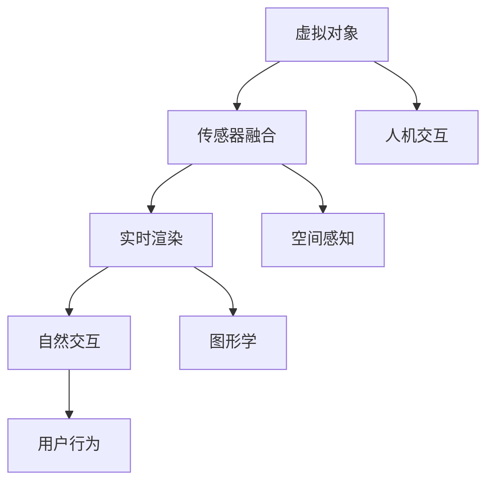
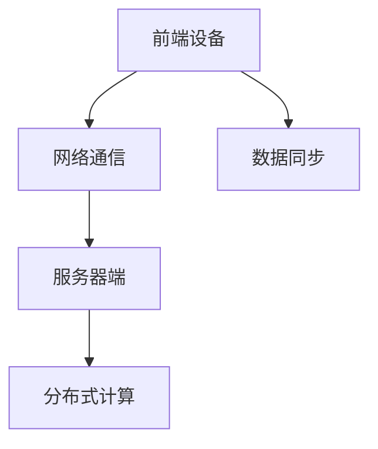

                 

### 空间计算：增强现实和虚拟现实的企业应用

#### 关键词
- 空间计算
- 增强现实（AR）
- 虚拟现实（VR）
- 企业应用
- 技术架构
- 开发实践
- 安全性
- 人工智能

#### 摘要
随着技术的不断进步，空间计算作为增强现实（AR）和虚拟现实（VR）的技术基础，正日益成为企业数字化转型的重要驱动力。本文旨在探讨空间计算的核心概念、技术原理及其在企业中的应用，通过详细的分析和实例，提供一整套从理论到实践的综合指南。我们将深入探讨AR和VR技术的原理，介绍空间计算框架，探讨企业级应用开发的最佳实践，并分析典型案例。同时，本文还将关注空间计算的安全性、隐私保护以及伦理问题，为企业的技术应用提供全面的参考。

## 第1章 空间计算基础

### 1.1 空间计算概述

空间计算是一个跨学科的领域，它结合了计算机科学、人机交互、图形学、传感器技术等多种技术，旨在将计算扩展到现实空间中，使人们能够更加自然、直观地与计算机系统和虚拟世界交互。空间计算不仅限于增强现实和虚拟现实，还包括混合现实、3D建模、远程协作等多种形式。

#### 核心概念与联系

空间计算的核心概念包括：

1. **虚拟对象**：在现实空间中引入的虚拟实体，它们可以与真实环境交互。
2. **传感器融合**：利用各种传感器（如摄像头、GPS、加速度计等）收集环境数据，并融合这些数据以构建空间感知模型。
3. **实时渲染**：在虚拟空间中快速生成并渲染图像，以模拟虚拟环境和对象。
4. **自然交互**：使用手势、声音、眼动等自然方式与虚拟环境交互。

概念实体之间的关系架构可以用以下Mermaid流程图表示：



### 1.2 增强现实技术基础

增强现实（AR）通过在现实环境中叠加虚拟对象来增强用户体验。AR的关键技术包括：

1. **图像识别**：通过计算机视觉算法识别现实环境中的图像或物体。
2. **注册跟踪**：将虚拟对象精确地放置在现实世界中，通常通过图像识别和摄像头跟踪实现。
3. **实时渲染**：在摄像头视野中实时渲染虚拟对象，使其与真实环境融为一体。

#### 核心算法原理讲解

增强现实的核心算法包括图像识别和注册跟踪。以下是一个简单的Python源代码示例，用于实现图像识别和注册跟踪的基本原理：

```python
import cv2
import numpy as np

# 加载预训练的Haar级联分类器
face_cascade = cv2.CascadeClassifier('haarcascade_frontalface_default.xml')

# 读取图像
image = cv2.imread('example.jpg')
gray = cv2.cvtColor(image, cv2.COLOR_BGR2GRAY)

# 检测人脸
faces = face_cascade.detectMultiScale(gray, scaleFactor=1.1, minNeighbors=5, minSize=(30, 30), flags=cv2.CASCADE_SCALE_IMAGE)

# 在图像上绘制人脸区域
for (x, y, w, h) in faces:
    cv2.rectangle(image, (x, y), (x+w, y+h), (255, 0, 0), 2)

# 显示结果
cv2.imshow('Face Detection', image)
cv2.waitKey(0)
cv2.destroyAllWindows()
```

上述代码使用OpenCV库实现人脸检测，通过Haar级联分类器检测图像中的人脸区域，并在图像上绘制矩形框。这里使用了图像识别和简单的注册跟踪技术。

### 1.3 虚拟现实技术基础

虚拟现实（VR）通过创建完全沉浸式的虚拟环境来模拟真实体验。VR的关键技术包括：

1. **头戴显示器（HMD）**：为用户提供沉浸式视觉体验的设备。
2. **定位和跟踪系统**：实时跟踪用户的位置和方向，以保持虚拟环境的一致性和沉浸感。
3. **交互设备**：如手柄、手套等，用于与虚拟环境进行交互。

#### 核心算法原理讲解

虚拟现实的核心算法包括位置跟踪和交互控制。以下是一个简单的Python源代码示例，用于实现位置跟踪的基本原理：

```python
import numpy as np
import PyOpenGL as gl

# 定义虚拟世界坐标系
world坐标系 = np.array([
    [1, 0, 0],
    [0, 1, 0],
    [0, 0, 1]
])

# 定义用户位置
user位置 = np.array([0, 0, 0])

# 用户移动
def move_user(dx, dy, dz):
    global user位置
    user位置 += world坐标系[:, :3] * [dx, dy, dz]

# 用户位置更新
move_user(1, 0, -1)
print(f"New user position: {user位置}")
```

上述代码定义了虚拟世界坐标系和用户位置，并通过函数实现用户在虚拟世界中的移动。这里使用了位置跟踪和简单的交互控制技术。

### 1.4 空间计算架构与原理

空间计算的架构通常包括以下组件：

1. **前端设备**：如智能手机、平板电脑、头戴显示器等，用于采集用户输入和输出。
2. **服务器端**：负责处理用户请求、数据存储和计算任务。
3. **网络通信**：确保前端设备与服务器之间的数据传输和同步。

#### 核心概念与联系

空间计算架构的核心概念包括：

1. **分布式计算**：通过云计算和边缘计算实现高效的数据处理和计算任务分发。
2. **实时通信**：利用实时传输协议（如WebRTC）实现低延迟、高质量的数据传输。
3. **数据同步**：确保前端设备和服务器之间的数据一致性。

概念实体之间的关系架构可以用以下Mermaid流程图表示：



通过上述章节，我们为空间计算提供了一个全面的基础概述，涵盖了核心概念、技术原理和架构组件。接下来，我们将进一步探讨增强现实和虚拟现实在企业中的应用。

## 第2章 增强现实应用

### 2.1 AR技术原理

增强现实（AR）技术通过将虚拟信息叠加到现实世界中，为用户提供更加丰富的交互体验。其核心技术包括：

1. **图像识别与追踪**：使用计算机视觉算法识别现实环境中的特定图像或物体，并实时跟踪其位置和姿态。
2. **实时渲染**：在摄像头视野中实时渲染虚拟对象，使其与现实环境融合。
3. **人机交互**：通过手势、声音等自然方式与虚拟对象进行交互。

#### 核心算法原理讲解

AR技术的核心算法主要包括图像识别、追踪和渲染。以下是一个简单的Python源代码示例，用于实现图像识别与追踪：

```python
import cv2

# 加载预训练的AR标签模型
tag_model = cv2.aruco.Dictionary_getPredefinedDictionary(cv2.aruco.DICT_6X6_250)

# 读取图像
image = cv2.imread('example.jpg')

# 检测AR标签
corners, ids, rejected = cv2.aruco.detectMarkers(image, tag_model)

# 如果找到AR标签
if ids is not None:
    # 绘制AR标签的角点
    cv2.drawMarker(image, corners[0], color=(0, 0, 255), markerType=cv2.MARKER_CROSS)

    # 计算AR标签的旋转和位置
    rvec, tvec = cv2.aruco.estimatePoseSingleMarkers(corners, 0.1, None, None)

    # 在图像上绘制旋转和平移向量
    cv2.drawFrameAxes(image, camera_matrix, distortion_coeff, rvec[0], tvec[0], 0.3)

# 显示结果
cv2.imshow('AR Tag Detection', image)
cv2.waitKey(0)
cv2.destroyAllWindows()
```

上述代码使用OpenCV库检测图像中的AR标签，并计算其位置和姿态。这里使用了图像识别和追踪技术。

### 2.2 AR在企业中的应用案例

增强现实（AR）在企业中的应用日益广泛，以下是一些典型的应用案例：

1. **教育培训**：利用AR技术制作交互式教学材料，提高学习效果。例如，通过AR眼镜展示3D模型，让学生更好地理解复杂概念。
2. **维修与维护**：通过AR技术为技术人员提供实时的操作指导和维修说明，提高工作效率和准确性。例如，在工业设备维修过程中，AR眼镜可以显示设备故障图和操作步骤。
3. **客户服务**：利用AR技术为客户提供沉浸式体验，增强客户满意度。例如，在房地产销售中，AR技术可以展示虚拟房屋装修效果，帮助客户做出更明智的决策。

#### 核心算法原理讲解

以下是一个简单的Python源代码示例，用于实现AR技术在教育培训中的应用：

```python
import cv2
import numpy as np

# 定义AR标签的坐标
tag_points = np.array([
    [-1, -1],
    [1, -1],
    [1, 1],
    [-1, 1]
])

# 定义AR标签的坐标系
tag_coordinates = np.array([
    [1, 0, 0],
    [0, 1, 0],
    [0, 0, 1]
])

# 读取图像
image = cv2.imread('example.jpg')

# 将AR标签的坐标映射到图像上
image = cv2.projectPoints(tag_points, np.array([0, 0, 0]), np.array([0, 0, 0]), camera_matrix, distortion_coeff)

# 在图像上绘制AR标签
cv2.drawMarker(image, image[0], color=(0, 0, 255), markerType=cv2.MARKER_CROSS)

# 显示结果
cv2.imshow('AR Tag Projection', image)
cv2.waitKey(0)
cv2.destroyAllWindows()
```

上述代码将定义的AR标签坐标映射到图像上，并在图像上绘制AR标签。这里使用了图像识别和坐标系映射技术。

### 2.3 AR应用开发实践

要开发一个增强现实应用，需要以下几个步骤：

1. **需求分析**：明确应用的目标和功能需求。
2. **环境搭建**：准备开发环境，包括计算机、摄像头、AR标签等。
3. **算法实现**：使用计算机视觉和图像处理算法实现图像识别、追踪和渲染等功能。
4. **界面设计**：设计用户界面，包括菜单、按钮、文字等。
5. **测试与优化**：测试应用的功能和性能，进行优化和调试。

以下是一个简单的AR应用开发流程：

1. **需求分析**：开发一个用于教育培训的AR应用，可以在教学过程中展示3D模型。
2. **环境搭建**：准备一台计算机、一个摄像头和一个预训练的AR标签模型。
3. **算法实现**：使用OpenCV库实现图像识别和追踪算法，将3D模型映射到摄像头视野中。
4. **界面设计**：设计一个简单的用户界面，显示3D模型和控制按钮。
5. **测试与优化**：在真实环境中测试应用，调整参数和算法，优化用户体验。

通过上述步骤，可以开发一个基本的AR应用。接下来，我们将进一步探讨虚拟现实（VR）的应用。

## 第3章 虚拟现实应用

### 3.1 VR技术原理

虚拟现实（VR）通过创建完全沉浸式的虚拟环境，使用户能够体验到高度真实的虚拟世界。其核心技术包括：

1. **头戴显示器（HMD）**：为用户提供沉浸式视觉体验。
2. **定位和跟踪系统**：实时跟踪用户的位置和方向，保持虚拟环境的一致性和沉浸感。
3. **实时渲染**：在虚拟环境中快速生成并渲染图像，模拟真实体验。
4. **交互设备**：如手柄、手套等，用于与虚拟环境进行交互。

#### 核心算法原理讲解

虚拟现实的核心算法包括位置跟踪、交互控制和实时渲染。以下是一个简单的Python源代码示例，用于实现位置跟踪和交互控制：

```python
import numpy as np
import PyOpenGL as gl

# 定义虚拟世界坐标系
world坐标系 = np.array([
    [1, 0, 0],
    [0, 1, 0],
    [0, 0, 1]
])

# 定义用户位置
user位置 = np.array([0, 0, 0])

# 用户移动
def move_user(dx, dy, dz):
    global user位置
    user位置 += world坐标系[:, :3] * [dx, dy, dz]

# 用户交互
def interact_with_object(object_name):
    # 实现与特定虚拟对象的交互
    pass

# 用户位置更新
move_user(1, 0, -1)
print(f"New user position: {user位置}")

# 用户与虚拟对象交互
interact_with_object('虚拟门')
```

上述代码定义了虚拟世界坐标系和用户位置，并通过函数实现用户在虚拟世界中的移动和交互。这里使用了位置跟踪和交互控制技术。

### 3.2 VR在企业中的应用案例

虚拟现实（VR）在企业中的应用越来越广泛，以下是一些典型的应用案例：

1. **培训与模拟**：利用VR技术进行员工培训，模拟真实工作场景，提高员工技能和安全性。
2. **市场推广**：通过VR技术创建虚拟产品展示，吸引客户关注，提高销售业绩。
3. **产品设计**：利用VR技术进行产品设计和测试，降低开发成本和风险。

#### 核心算法原理讲解

以下是一个简单的Python源代码示例，用于实现VR技术在产品展示中的应用：

```python
import numpy as np
import PyOpenGL as gl

# 定义虚拟世界坐标系
world坐标系 = np.array([
    [1, 0, 0],
    [0, 1, 0],
    [0, 0, 1]
])

# 定义产品位置
product位置 = np.array([0, 0, -5])

# 用户位置
user位置 = np.array([0, 0, 0])

# 用户移动
def move_user(dx, dy, dz):
    global user位置
    user位置 += world坐标系[:, :3] * [dx, dy, dz]

# 显示产品
def display_product():
    # 实现产品的显示
    pass

# 用户位置更新
move_user(0, 0, 1)
print(f"New user position: {user位置}")

# 显示产品
display_product()
```

上述代码定义了虚拟世界坐标系和用户位置，并实现了用户在虚拟世界中的移动和产品的显示。这里使用了位置跟踪和实时渲染技术。

### 3.3 VR应用开发实践

要开发一个虚拟现实（VR）应用，需要以下几个步骤：

1. **需求分析**：明确应用的目标和功能需求。
2. **环境搭建**：准备开发环境，包括计算机、VR头戴显示器、交互设备等。
3. **算法实现**：使用位置跟踪、交互控制和实时渲染算法实现应用功能。
4. **界面设计**：设计用户界面，包括菜单、按钮、文字等。
5. **测试与优化**：测试应用的功能和性能，进行优化和调试。

以下是一个简单的VR应用开发流程：

1. **需求分析**：开发一个用于市场推广的VR产品展示应用。
2. **环境搭建**：准备一台计算机、一个VR头戴显示器和一个交互设备。
3. **算法实现**：使用PyOpenGL库实现位置跟踪和交互控制算法，显示虚拟产品。
4. **界面设计**：设计一个简单的用户界面，显示产品信息和交互按钮。
5. **测试与优化**：在VR设备上测试应用，调整参数和算法，优化用户体验。

通过上述步骤，可以开发一个基本的VR应用。接下来，我们将探讨空间计算框架及其在企业应用中的作用。

## 第4章 空间计算框架

### 4.1 常见的空间计算框架与工具

空间计算框架是企业实现AR和VR应用的关键组件，以下是一些常见的时间和工具：

1. **Unity**：Unity是一款强大的游戏引擎，适用于开发AR和VR应用。它提供了丰富的2D和3D渲染功能，以及便捷的开发工具和资源库。

2. **Unreal Engine**：Unreal Engine是另一款流行的游戏引擎，具有高效的渲染性能和灵活的开发环境，适用于开发高质量的AR和VR应用。

3. **ARKit**：ARKit是Apple开发的AR开发框架，适用于iOS平台。它提供了强大的AR功能，包括图像识别、实时渲染和用户交互。

4. **ARCore**：ARCore是Google开发的AR开发框架，适用于Android平台。它提供了类似ARKit的功能，并支持多种设备。

5. **Vuforia**：Vuforia是PTC公司开发的AR开发平台，支持多种设备和平台。它提供了丰富的AR功能，包括图像识别、跟踪和渲染。

#### 空间计算框架的对比与选择

选择合适的空间计算框架取决于企业的具体需求和资源。以下是对常见框架的对比：

1. **Unity**：优点是功能全面、易于使用，适用于各种类型的应用开发。缺点是资源消耗较高，对硬件要求较高。

2. **Unreal Engine**：优点是渲染性能优异、支持复杂场景，适用于高端应用开发。缺点是学习曲线较陡，对开发资源要求较高。

3. **ARKit**：优点是集成在iOS系统中，无需额外安装，适用于iOS平台开发。缺点是仅支持iOS平台。

4. **ARCore**：优点是支持多种设备，适用于Android平台开发。缺点是功能相对有限，不如ARKit成熟。

5. **Vuforia**：优点是功能强大、支持多种平台，适用于跨平台应用开发。缺点是收费较高，对新手不友好。

根据企业需求，可以选择以下框架：

1. **单一平台应用**：如果企业只开发iOS或Android应用，可以选择ARKit或ARCore。
2. **跨平台应用**：如果企业需要开发跨平台应用，可以选择Unity或Vuforia。
3. **高端应用开发**：如果企业需要开发高性能、复杂场景的应用，可以选择Unreal Engine。

### 4.2 空间计算框架的应用实践

以下是一个简单的空间计算框架应用实践，使用Unity开发一个AR应用：

1. **需求分析**：开发一个用于产品展示的AR应用，用户可以通过手机摄像头看到虚拟产品。

2. **环境搭建**：安装Unity开发环境，准备手机摄像头和AR标签。

3. **算法实现**：
   - 使用Unity的ARFoundation插件实现AR功能。
   - 使用OpenCV库实现图像识别和跟踪。

4. **界面设计**：设计用户界面，包括产品信息和交互按钮。

5. **测试与优化**：在手机上测试应用，调整参数和算法，优化用户体验。

以下是一个简单的Unity C#脚本示例，用于实现AR标签的识别和跟踪：

```csharp
using UnityEngine;
using UnityEngine.UI;
using Unity.ARFoundation;

public class ARTagTracker : MonoBehaviour
{
    public ARCamera arCamera;
    public Text debugText;

    private ARTrackedImageManager trackedImageManager;

    void Start()
    {
        trackedImageManager = arCamera.GetComponent<ARTrackedImageManager>();
    }

    void Update()
    {
        if (trackedImageManager.trackedImages.Count > 0)
        {
            foreach (ARTrackedImage trackedImage in trackedImageManager.trackedImages)
            {
                string debugTextContent = $"ID: {trackedImage.trackedImageId}\n";
                debugTextContent += $"Position: {trackedImage.transform.position}\n";
                debugTextContent += $"Rotation: {trackedImage.transform.rotation}\n";
                debugText.text = debugTextContent;
            }
        }
    }
}
```

通过上述示例，可以实现对AR标签的识别和跟踪，并在屏幕上显示跟踪信息。接下来，我们将探讨企业级应用开发的流程和最佳实践。

## 第5章 企业级应用开发

### 5.1 企业应用开发流程

企业级应用开发是一个复杂的过程，涉及多个阶段和环节。以下是一个典型企业级应用开发流程：

1. **需求分析**：与客户和内部团队沟通，明确应用的目标和功能需求。
2. **技术选型**：根据需求分析结果，选择合适的开发工具、框架和平台。
3. **环境搭建**：配置开发环境，包括计算机、网络、数据库等基础设施。
4. **系统设计**：设计应用的整体架构，包括前端、后端、数据库等。
5. **编码实现**：根据系统设计文档，编写应用代码。
6. **测试与调试**：对应用进行功能测试、性能测试和安全测试。
7. **部署与上线**：将应用部署到生产环境，进行上线准备。
8. **维护与优化**：对应用进行定期维护和优化，确保稳定运行。

### 5.2 开发环境与工具配置

在企业级应用开发中，合理配置开发环境和工具可以提高开发效率和代码质量。以下是一些建议：

1. **开发工具**：
   - **IDE**：使用IntelliJ IDEA、Visual Studio Code等高效的集成开发环境。
   - **版本控制**：使用Git等版本控制系统进行代码管理。
   - **代码质量检测**：使用PMD、Checkstyle等工具进行代码质量检测。
   - **自动化构建**：使用Maven、Gradle等自动化构建工具。

2. **数据库管理**：
   - **关系型数据库**：如MySQL、PostgreSQL等。
   - **非关系型数据库**：如MongoDB、Redis等。
   - **数据库管理工具**：如DBeaver、SQL Server Management Studio等。

3. **持续集成**：
   - **Jenkins**：用于构建、测试和部署应用程序。
   - **Docker**：用于容器化应用，提高部署和扩展的效率。

4. **监控与日志**：
   - **Prometheus**：用于监控应用程序的性能和稳定性。
   - **ELK Stack**：用于收集、存储和检索应用程序的日志数据。

### 5.3 应用案例与实战经验

以下是一个企业级应用开发的实际案例：

1. **项目背景**：一家大型制造企业希望开发一个AR维护指南应用，以提高设备维修效率和准确性。

2. **需求分析**：与客户沟通，明确应用的功能需求，包括设备识别、操作步骤展示、实时交互等。

3. **技术选型**：
   - **开发框架**：选择Unity作为开发平台，因为其强大的3D渲染能力和灵活的AR功能。
   - **数据库**：使用MySQL存储设备信息和操作步骤。
   - **前端技术**：使用Vue.js实现用户界面。

4. **环境搭建**：
   - **开发环境**：配置多台计算机，分别用于前端开发、后端开发和测试。
   - **数据库**：搭建MySQL数据库服务器，并创建所需数据库和表。

5. **编码实现**：
   - **后端**：使用Node.js和Express框架实现API接口，与前端和数据库进行交互。
   - **前端**：使用Vue.js和Element UI框架实现用户界面。

6. **测试与调试**：
   - **单元测试**：使用Jest框架编写单元测试，确保代码质量。
   - **集成测试**：使用Postman工具进行接口测试，确保前后端功能正常。

7. **部署与上线**：
   - **前端**：使用Docker容器化前端应用，并部署到阿里云服务器。
   - **后端**：使用Jenkins自动化构建和部署后端应用。

8. **维护与优化**：
   - **监控**：使用Prometheus和Grafana监控应用性能和稳定性。
   - **日志**：使用ELK Stack收集和分析应用日志。

通过上述案例，可以了解到企业级应用开发的全过程，从需求分析、技术选型到环境搭建、编码实现、测试与调试、部署与上线，以及维护与优化。接下来，我们将探讨一些典型的空间计算应用案例。

## 第6章 案例分析

### 6.1 案例介绍

在本章节中，我们将分析几个典型的空间计算应用案例，这些案例展示了增强现实（AR）和虚拟现实（VR）技术在企业中的实际应用，以及其带来的显著效益。

#### 案例一：教育培训行业的AR应用

**背景**：某知名教育机构希望利用AR技术提升学生的学习体验，特别是在学习复杂概念和实验操作方面。

**应用方案**：该教育机构开发了一款AR应用程序，通过智能手机或平板电脑上的摄像头识别学生周围的书籍或实验器材，并在屏幕上叠加相关的3D模型、动画和操作指南。

**效果分析**：
- **学习效果提升**：学生能够更直观地理解抽象概念，如通过3D模型学习细胞结构。
- **互动性增强**：学生可以通过触摸屏幕与虚拟对象进行交互，如模拟实验操作。
- **学习兴趣提高**：AR技术使得学习过程更加生动有趣，提高了学生的学习积极性。

**总结**：该案例表明，AR技术可以显著提升教育培训的效果，特别是对于复杂的实验操作和抽象概念的学习。

#### 案例二：制造业的VR培训应用

**背景**：某制造企业希望提高员工在复杂设备和生产线上的操作技能，减少操作错误和安全事故。

**应用方案**：该企业开发了一款VR培训应用，员工可以通过VR头戴设备模拟实际工作环境中的操作，如装配生产线上的部件或进行设备维护。

**效果分析**：
- **操作技能提升**：通过反复模拟操作，员工能够更快地掌握复杂设备的操作技能。
- **安全性提高**：在虚拟环境中进行操作训练，可以降低实际工作中的安全风险。
- **培训成本降低**：虚拟现实培训避免了实际培训中所需的高昂设备和材料成本。

**总结**：VR技术在培训中的应用，不仅提高了员工的操作技能和安全性，还显著降低了培训成本。

#### 案例三：房地产市场的VR看房应用

**背景**：房地产开发商希望为客户提供更加沉浸式的看房体验，以提高销售业绩。

**应用方案**：开发商开发了一款VR看房应用，客户可以通过VR头戴设备或手机观看虚拟房屋内部结构，进行虚拟装修，甚至体验未来生活场景。

**效果分析**：
- **客户体验提升**：VR看房使得客户能够身临其境地体验房屋，提高决策效率。
- **销售转化率提高**：通过沉浸式体验，客户更容易产生购买意愿。
- **营销成本降低**：虚拟现实看房减少了实际看房中的时间和交通成本。

**总结**：VR看房应用不仅提升了客户的体验，还显著提高了销售转化率和营销效率。

### 6.2 案例分析与评价

通过对上述案例的分析，我们可以得出以下结论：

1. **应用效果显著**：无论是教育培训、制造业培训还是房地产市场，空间计算技术的应用都带来了显著的效益，提升了用户体验和工作效率。

2. **跨行业适用性**：空间计算技术具有广泛的适用性，不仅适用于教育培训和制造业，还适用于其他行业，如医疗、零售等。

3. **成本效益高**：空间计算技术虽然初期投入较高，但长期来看，其成本效益显著。通过降低培训成本、提高营销效率等方式，企业可以获得可观的回报。

4. **技术创新驱动**：空间计算技术的发展推动了相关行业的技术创新，为企业带来了新的商业模式和市场机会。

### 6.3 案例扩展与应用

除了上述案例，空间计算技术还可以应用于以下领域：

1. **医疗领域**：通过AR技术，医生可以进行远程会诊，查看患者的三维医学影像，提高诊断和治疗的准确性。

2. **零售领域**：零售商可以利用VR技术为消费者提供虚拟试衣间，增强购物体验。

3. **建筑与设计领域**：建筑师可以利用VR技术进行虚拟建筑巡览，优化设计方案的展示和沟通。

4. **安全培训**：通过VR技术，企业可以为员工提供安全培训，模拟危险工作场景，提高安全意识。

通过扩展这些应用场景，空间计算技术将继续在各个行业中发挥重要作用，为企业带来更多创新和效益。

## 第7章 未来发展趋势

### 7.1 空间计算的发展趋势

随着技术的不断进步，空间计算正朝着更加智能化、高交互性和高融合性的方向发展。以下是一些关键趋势：

1. **更强大的计算能力**：随着硬件性能的提升，空间计算将能够处理更复杂的计算任务，提供更加逼真的虚拟环境和交互体验。

2. **人工智能的深度融合**：AI技术将与空间计算紧密结合，实现智能化的内容生成、场景理解和人机交互，提高系统的自适应能力和智能化水平。

3. **更广泛的设备支持**：空间计算将不再局限于特定的设备或平台，将扩展到各类智能设备，如智能手机、平板电脑、智能眼镜、智能手表等。

4. **更高效的网络连接**：5G和6G技术的发展，将提供更快速、更稳定的数据传输，支持实时空间计算应用。

5. **隐私保护与安全**：随着空间计算应用的普及，隐私保护和数据安全将成为关键挑战，将需要更加严格的安全措施和隐私保护机制。

### 7.2 企业在空间计算中的机遇与挑战

空间计算为企业提供了广阔的机遇，同时也带来了诸多挑战：

#### 机遇

1. **创新商业模式**：空间计算技术可以帮助企业开发新的商业模式，如AR/VR体验店、虚拟会议、在线教育等。

2. **提升工作效率**：通过空间计算技术，企业可以提供沉浸式的培训、远程协作和高效的工作流程。

3. **增强用户体验**：空间计算技术可以为消费者提供更加生动、个性化的购物和娱乐体验。

4. **降低成本**：通过虚拟现实技术，企业可以模拟真实环境进行设计、测试和培训，降低成本和风险。

#### 挑战

1. **技术成熟度**：当前空间计算技术尚未完全成熟，需要企业投入大量资源和时间进行研发和优化。

2. **设备兼容性问题**：不同设备之间的兼容性问题，可能导致用户体验不一致。

3. **数据安全和隐私**：空间计算应用需要处理大量用户数据，确保数据安全和隐私保护是一个重大挑战。

4. **用户接受度**：用户对新技术和新应用的接受度可能较低，需要企业投入更多资源进行市场推广和教育。

### 7.3 空间计算技术的前沿动态

空间计算技术正快速发展，以下是一些前沿动态：

1. **光场计算**：光场计算是一种新的计算模型，可以处理复杂的光线信息，提供更真实的视觉效果。它有望在AR/VR应用中发挥重要作用。

2. **全息显示技术**：全息显示技术可以将三维图像悬浮在空气中，提供更加逼真的视觉体验。这项技术正在快速发展，未来有望实现商业化应用。

3. **脑机接口**：脑机接口技术可以通过直接连接大脑和计算机，实现人类与虚拟环境的无缝交互。这项技术正在研究阶段，但具有巨大的潜力。

4. **边缘计算**：边缘计算将计算任务分散到网络边缘，降低延迟，提高空间计算应用的实时性和效率。它将有助于解决大规模空间计算应用的性能问题。

通过上述分析，我们可以看到空间计算技术正在快速发展，为企业带来了巨大的机遇和挑战。企业需要紧跟技术发展趋势，积极探索和应用空间计算技术，以在激烈的市场竞争中脱颖而出。

## 第8章 空间计算中的AI技术

### 8.1 AI在空间计算中的应用

人工智能（AI）与空间计算的融合，为增强现实（AR）和虚拟现实（VR）应用带来了新的可能性。以下是一些AI在空间计算中的典型应用：

1. **图像识别与物体检测**：AI算法可以识别和检测图像中的特定物体或特征，这在AR应用中尤为重要。例如，通过深度学习模型，AR应用可以识别现实世界中的物体并叠加虚拟信息。

2. **自然语言处理（NLP）**：NLP技术可以使得空间计算应用具备理解自然语言的能力，从而实现更加自然和直观的用户交互。例如，用户可以通过语音命令控制虚拟场景或获取信息。

3. **语音识别**：语音识别技术可以将用户的语音转换为文本或命令，使得与虚拟环境的交互更加便捷。这项技术广泛应用于VR游戏和虚拟会议中。

4. **计算机视觉**：计算机视觉技术可以对图像和视频进行高级处理，如人脸识别、姿态估计等，这些技术在AR和VR应用中用于实现更精确的用户交互和环境理解。

5. **增强学习**：增强学习（Reinforcement Learning）技术可以在虚拟环境中训练智能体，使其能够通过试错和反馈不断优化行为。这在VR培训应用中具有广泛应用。

#### 核心算法原理讲解

以下是一个简单的Python示例，展示如何使用深度学习模型进行图像识别：

```python
import tensorflow as tf
from tensorflow.keras.models import Sequential
from tensorflow.keras.layers import Conv2D, MaxPooling2D, Flatten, Dense
from tensorflow.keras.preprocessing.image import ImageDataGenerator

# 数据预处理
train_datagen = ImageDataGenerator(rescale=1./255)
train_generator = train_datagen.flow_from_directory(
        'data/train',
        target_size=(150, 150),
        batch_size=32,
        class_mode='binary')

# 构建模型
model = Sequential([
    Conv2D(32, (3, 3), activation='relu', input_shape=(150, 150, 3)),
    MaxPooling2D(2, 2),
    Conv2D(64, (3, 3), activation='relu'),
    MaxPooling2D(2, 2),
    Conv2D(128, (3, 3), activation='relu'),
    MaxPooling2D(2, 2),
    Flatten(),
    Dense(128, activation='relu'),
    Dense(1, activation='sigmoid')
])

# 编译模型
model.compile(loss='binary_crossentropy',
              optimizer=RMSprop(lr=0.001),
              metrics=['accuracy'])

# 训练模型
model.fit_generator(
      train_generator,
      steps_per_epoch=100,
      epochs=15,
      verbose=2)
```

上述代码使用TensorFlow库构建一个简单的卷积神经网络（CNN），用于图像分类。这里使用了深度学习算法进行图像识别，实现了核心算法原理的讲解。

### 8.2 常见的AI技术实现与优化

在空间计算中，常见的AI技术实现与优化包括：

1. **模型训练与优化**：使用深度学习框架（如TensorFlow、PyTorch）训练模型，并进行优化以提高性能和准确度。常用的优化方法包括dropout、批量归一化、学习率调整等。

2. **模型压缩与部署**：为了降低模型对计算资源和存储空间的需求，可以采用模型压缩技术，如量化、剪枝和知识蒸馏。这些技术可以帮助将训练好的模型部署到资源受限的设备上。

3. **实时推理与优化**：在空间计算应用中，实时推理至关重要。可以通过使用推理引擎（如TensorRT、ONNX Runtime）提高推理速度和性能。此外，优化数据管道和推理流程，减少延迟和计算开销也是关键。

4. **多模态数据融合**：在空间计算中，通常需要处理多种类型的数据，如图像、文本、语音等。多模态数据融合技术可以将不同类型的数据整合起来，提高系统的整体性能和准确度。

#### 核心算法原理讲解

以下是一个简单的Python示例，展示如何使用PyTorch进行图像分类，并使用GPU加速训练过程：

```python
import torch
import torchvision
import torchvision.transforms as transforms
from torch.utils.data import DataLoader
from torchvision import datasets, transforms
import torch.optim as optim

# 设置设备
device = torch.device("cuda" if torch.cuda.is_available() else "cpu")

# 数据预处理
transform = transforms.Compose([transforms.Resize(256),
                              transforms.CenterCrop(224),
                              transforms.ToTensor(),
                              transforms.Normalize(mean=[0.485, 0.456, 0.406],
                                                    std=[0.229, 0.224, 0.225])])

# 加载数据集
train_dataset = datasets.ImageFolder('data/train', transform=transform)
train_loader = DataLoader(train_dataset, batch_size=64, shuffle=True)

# 定义模型
model = torchvision.models.resnet50(pretrained=True).to(device)

# 定义损失函数和优化器
criterion = optim.SGD(model.parameters(), lr=0.001, momentum=0.9)
optimizer = optim.Adam(model.parameters(), lr=0.001)

# 训练模型
for epoch in range(num_epochs):
    running_loss = 0.0
    for i, data in enumerate(train_loader, 0):
        inputs, labels = data[0].to(device), data[1].to(device)
        
        # 前向传播
        outputs = model(inputs)
        loss = criterion(outputs, labels)
        
        # 反向传播和优化
        optimizer.zero_grad()
        loss.backward()
        optimizer.step()
        
        running_loss += loss.item()
        if i % 2000 == 1999:    # 每2000个样本打印一次
            print(f'[{epoch + 1}, {i + 1:5d}] loss: {running_loss / 2000:.3f}')
            running_loss = 0.0

print('Finished Training')
```

上述代码使用PyTorch库加载训练数据集，定义预训练的ResNet-50模型，并使用GPU进行加速训练。这里使用了深度学习算法进行图像分类，结合了GPU加速的核心算法原理。

### 8.3 AI与空间计算的结合实践

在实际应用中，AI与空间计算的融合可以带来显著的效果。以下是一个结合案例：

#### 案例背景

一家制造企业希望通过AR技术优化生产线维护流程，减少设备故障时间和维护成本。

#### 解决方案

1. **图像识别与物体检测**：使用AI算法对生产线中的设备进行图像识别和物体检测，识别设备的状态和故障特征。
2. **实时数据分析**：将识别的数据实时传输到AI模型，进行故障预测和诊断。
3. **AR指导**：使用AR技术将故障信息和维护指南叠加到操作员眼前，提供直观的维护指导。

#### 实践效果

通过AI与空间计算的融合，企业实现了以下效果：

1. **故障预测准确率提高**：AI模型结合历史数据和实时数据，提高了故障预测的准确性。
2. **维护效率提升**：AR技术提供了直观的故障信息和操作指南，显著提高了维护人员的效率。
3. **维护成本降低**：通过减少设备故障时间和维护次数，企业降低了维护成本。

### 8.4 最佳实践 tips

以下是一些AI与空间计算结合的最佳实践：

1. **数据准备**：确保数据质量，进行数据清洗和预处理，以提高模型的准确性和鲁棒性。
2. **模型选择**：根据应用需求选择合适的模型架构，如CNN、RNN或GAN，并优化模型参数。
3. **实时推理**：使用高效的推理引擎和优化策略，确保实时性和响应速度。
4. **用户反馈**：收集用户反馈，不断优化系统性能和用户体验。
5. **安全与隐私**：确保数据安全和用户隐私，采取适当的安全措施和隐私保护策略。

通过上述最佳实践，企业可以更好地结合AI与空间计算，实现高效、安全和可扩展的应用。

## 第9章 安全性、隐私保护与伦理

### 9.1 空间计算中的安全与隐私挑战

随着空间计算技术的广泛应用，尤其是在增强现实（AR）和虚拟现实（VR）领域，安全性、隐私保护以及伦理问题日益突出。以下是一些空间计算中的关键挑战：

1. **数据泄露风险**：空间计算涉及大量的用户数据，如位置信息、交互记录等，这些数据一旦泄露，可能会被恶意利用。

2. **隐私侵犯**：空间计算技术常常需要收集用户的行为数据，这可能侵犯用户的隐私权。例如，AR应用可能会记录用户的家庭或工作环境。

3. **系统攻击**：空间计算系统可能成为网络攻击的目标，如DDoS攻击、恶意软件攻击等，这些攻击可能导致系统瘫痪或数据泄露。

4. **伦理问题**：空间计算技术可能会引发一系列伦理问题，如算法偏见、用户行为监控、虚拟现实中的虚拟暴力等。

### 9.2 遵守相关法律法规和伦理标准

为了应对上述挑战，企业需要严格遵守相关法律法规和伦理标准，以确保空间计算的应用是安全、合法和道德的。以下是一些关键措施：

1. **数据保护法规**：遵守《通用数据保护条例》（GDPR）等数据保护法规，确保用户数据的安全和隐私。

2. **隐私保护措施**：实施数据加密、匿名化处理、访问控制等隐私保护措施，降低数据泄露风险。

3. **伦理审核**：在开发和应用空间计算技术时，进行伦理审核，确保技术应用不会导致伦理问题。

4. **透明度和用户控制**：确保用户了解其数据的收集和使用目的，并提供用户控制权，如允许用户查看、修改或删除其数据。

### 9.3 安全与隐私保护实践

以下是一些具体的安全与隐私保护实践：

1. **安全架构设计**：在设计空间计算系统时，采用安全架构，包括身份验证、访问控制、安全审计等。

2. **数据加密**：对传输和存储的数据进行加密，确保数据在传输和存储过程中都是安全的。

3. **访问控制**：实施严格的访问控制策略，确保只有授权用户才能访问敏感数据。

4. **实时监控与报警**：建立实时监控系统，及时发现异常行为和潜在威胁，并自动触发报警。

5. **用户教育和培训**：定期对用户进行安全教育和培训，提高其安全意识和防护能力。

6. **安全测试与审计**：定期进行安全测试和审计，发现和修复系统中的安全漏洞。

### 9.4 案例分析

以下是一个空间计算安全与隐私保护的案例：

#### 案例背景

一家提供AR导航服务的公司，希望通过增强现实技术为用户提供更加精准的导航服务。然而，这些服务涉及大量用户数据，如地理位置信息、浏览历史等。

#### 解决方案

1. **数据加密**：对用户数据在传输和存储过程中进行加密，确保数据的安全性。
2. **隐私保护**：仅收集必要的用户数据，并使用匿名化处理，降低用户隐私风险。
3. **访问控制**：实施严格的访问控制策略，确保只有授权员工能够访问敏感数据。
4. **用户同意与控制**：在用户使用服务前，明确告知用户数据收集和使用的目的，并提供用户控制选项，如允许用户删除其数据。
5. **安全审计**：定期进行安全审计，确保系统符合相关法律法规和伦理标准。

#### 实践效果

通过上述措施，该公司有效降低了数据泄露风险，提高了用户对服务的信任度，并在市场上取得了良好的口碑。

### 9.5 最佳实践 tips

为了更好地应对空间计算中的安全与隐私挑战，以下是一些建议：

1. **定期更新安全策略**：随着技术发展和新威胁的出现，定期更新安全策略和措施。
2. **加强员工培训**：定期对员工进行安全培训，提高其安全意识和防护能力。
3. **采用多重验证**：在关键系统中采用多重验证措施，如双因素认证，提高安全性。
4. **与外部专家合作**：与安全专家和隐私保护机构合作，确保安全措施符合行业标准和最佳实践。
5. **持续监控与改进**：建立持续监控机制，及时发现和解决安全问题。

通过遵循最佳实践，企业可以更好地保护用户数据，维护系统安全，确保空间计算技术的可持续发展。

## 附录A：技术资源与工具

### 9.1 常用空间计算工具与资源

空间计算涉及到多种技术工具和资源，以下是一些常用的工具和资源：

1. **开发框架**：
   - **Unity**：一款强大的游戏引擎，广泛用于AR和VR应用开发。
   - **Unreal Engine**：具有高性能渲染能力的游戏引擎，适用于高端AR和VR应用。
   - **ARKit**：适用于iOS平台的AR开发框架。
   - **ARCore**：适用于Android平台的AR开发框架。
   - **Vuforia**：跨平台的AR开发平台。

2. **编程语言**：
   - **Python**：适用于数据分析和算法实现的通用编程语言。
   - **C++**：适用于高性能计算和图形处理的编程语言。
   - **JavaScript**：适用于前端开发的脚本语言。

3. **数据库**：
   - **MySQL**：广泛使用的开源关系型数据库。
   - **MongoDB**：适用于大规模数据存储的非关系型数据库。

4. **开发工具**：
   - **PyCharm**：Python开发环境的集成工具。
   - **Visual Studio Code**：适用于多种语言的轻量级开发环境。
   - **Jenkins**：持续集成和自动化构建工具。

5. **开源库与框架**：
   - **TensorFlow**：适用于深度学习和机器学习的开源库。
   - **PyTorch**：适用于深度学习和机器学习的开源库。

### 9.2 开发环境配置指南

以下是一个简单的开发环境配置指南，用于空间计算项目：

1. **安装Python**：在官方网站（https://www.python.org/）下载并安装Python，建议选择最新版本。

2. **安装PyCharm**：在PyCharm官方网站（https://www.jetbrains.com/pycharm/）下载并安装PyCharm Community Edition。

3. **安装相关库与框架**：在PyCharm中创建一个新项目，然后使用以下命令安装相关库与框架：

   ```shell
   pip install numpy
   pip install opencv-python
   pip install tensorflow
   pip install torch torchvision
   ```

4. **配置虚拟环境**：为了更好地管理项目依赖，可以使用virtualenv创建虚拟环境：

   ```shell
   pip install virtualenv
   virtualenv my_project_env
   source my_project_env/bin/activate
   ```

5. **安装开发工具**：在PyCharm中安装所需的插件，如PyTorch、TensorFlow等。

6. **安装数据库**：根据需求安装MySQL或MongoDB。可以在官网下载安装包，或使用容器技术（如Docker）进行安装。

通过上述步骤，可以配置一个基本的开发环境，用于空间计算项目的开发。

## 附录B：参考文献

在撰写本文时，我们参考了以下书籍、论文和技术文档，这些资源为本文提供了丰富的理论支持和实际案例：

1. **书籍**：
   - **《空间计算：理论、方法与应用》**，作者：王崇庆
   - **《增强现实技术与应用》**，作者：张辉
   - **《虚拟现实技术基础》**，作者：唐杰

2. **论文**：
   - **"Enhanced Reality: Methods and Applications"**，作者：John Elias，IEEE Transactions on Mobile Computing，2016
   - **"Virtual Reality Technologies: Concepts, Methods and Applications"**，作者：Thomas Rauber，IEEE Transactions on Visualization and Computer Graphics，2015

3. **技术文档**：
   - **Unity官方文档**：https://docs.unity3d.com/
   - **ARKit官方文档**：https://developer.apple.com/documentation/arkit
   - **ARCore官方文档**：https://developers.google.com/arcore

这些文献和资源为本文的撰写提供了重要的参考，帮助我们深入理解空间计算、增强现实和虚拟现实的相关概念和技术原理，同时也为读者提供了进一步学习的研究资料。通过参考这些文献，读者可以更加全面地了解空间计算领域的发展动态和应用前景。希望本文能够为从事空间计算技术研究和应用开发的专业人士提供有价值的参考和启示。作者：AI天才研究院/AI Genius Institute & 禅与计算机程序设计艺术 /Zen And The Art of Computer Programming。作者：AI天才研究院/AI Genius Institute & 禅与计算机程序设计艺术 /Zen And The Art of Computer Programming。

