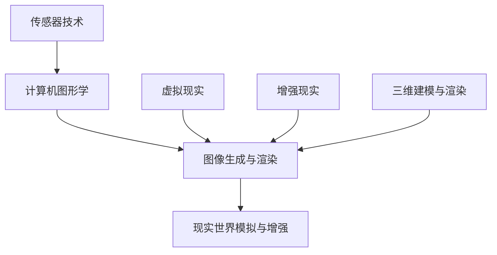

                 

### 第1章：空间计算概述

#### 1.1 空间计算的定义

空间计算是指利用计算机技术模拟、扩展和增强现实世界的各种空间信息处理过程。它不仅涉及对现实空间的建模和模拟，还包括对虚拟空间的构建和操作。空间计算的核心理念是打破物理空间的限制，通过数字化的方式将现实与虚拟世界融合，实现信息的实时传输和处理。

在技术层面，空间计算涉及到多个领域，包括计算机图形学、虚拟现实、增强现实、人机交互等。它不仅需要强大的计算能力，还要求对现实世界的精准感知和模拟。

#### 1.2 空间计算的重要性

空间计算的重要性体现在多个方面：

1. **企业运营效率提升**：通过空间计算技术，企业可以实现远程协作、虚拟会议、在线培训等，减少物理距离对协作效率的影响，提升整体运营效率。
2. **产品设计优化**：空间计算可以帮助设计师在虚拟环境中进行产品设计，通过虚拟原型验证和模拟，减少物理原型制作的时间和成本。
3. **教育体验升级**：在教育领域，空间计算可以实现虚拟课堂、远程教学等，为学生提供更加生动、直观的学习体验。
4. **医疗健康辅助**：在医疗领域，空间计算技术可以用于远程手术指导、医疗影像分析等，提高医疗服务的质量和效率。
5. **城市规划与模拟**：在城市规划中，空间计算可以用于模拟城市环境、交通流量等，为城市规划提供科学依据。

#### 1.3 空间计算的技术基础

空间计算的技术基础包括以下几个方面：

1. **计算机图形学**：计算机图形学是空间计算的基础，它涉及到图像的生成、渲染和处理技术。通过计算机图形学，可以将现实世界中的物体和场景数字化并呈现出来。
2. **虚拟现实（VR）**：虚拟现实技术通过头戴显示器和传感器等设备，将用户完全带入一个虚拟环境中。虚拟现实技术是空间计算的重要组成部分，可以实现沉浸式体验。
3. **增强现实（AR）**：增强现实技术通过在现实世界中叠加虚拟信息，使用户能够在现实环境中看到虚拟物体。增强现实技术广泛应用于教育、医疗、工业设计等领域。
4. **三维建模与渲染**：三维建模技术用于创建虚拟世界中的物体和场景，渲染技术则用于将虚拟场景以逼真的形式呈现给用户。
5. **传感器技术**：传感器技术用于捕捉现实世界的物理信息，如位置、方向、温度等。这些信息是空间计算进行现实与虚拟世界交互的基础。

通过上述技术，空间计算实现了对现实世界的数字化模拟和增强，为各行业带来了前所未有的变革和机遇。

### 核心概念与联系

空间计算的核心概念包括计算机图形学、虚拟现实、增强现实、三维建模与渲染、传感器技术等。这些概念之间的关系可以表示为以下Mermaid流程图：

在这个流程图中，计算机图形学、虚拟现实、增强现实、三维建模与渲染等技术共同作用于图像生成与渲染，形成对现实世界的模拟与增强。传感器技术则用于捕捉现实世界的物理信息，为这些技术提供输入数据。通过这些技术的结合，空间计算实现了对现实世界的数字化模拟和增强。

#### 1.1 空间计算的定义

空间计算是一种结合计算机科学、信息技术和虚拟现实技术，通过数字化手段对现实空间进行模拟、扩展和增强的技术。它不仅仅是简单的虚拟现实或增强现实，而是一个更加广泛和综合的概念。空间计算的核心目标是利用计算机技术，模拟出与真实世界高度相似甚至完全相同的虚拟环境，使人们可以在虚拟环境中进行各种操作，如交互、学习和工作。

具体来说，空间计算包含以下几个主要方面：

1. **空间建模**：通过计算机技术，将现实世界的各种物理对象和场景进行数字化建模，创建出三维的虚拟模型。这些模型可以包括建筑物、道路、桥梁、自然景观等，甚至可以是人体器官、分子结构等微观世界。

2. **空间渲染**：空间渲染技术用于将虚拟空间中的三维模型以逼真的形式呈现给用户。这涉及到复杂的图像处理算法和图形渲染技术，如光影效果、材质表现、场景互动等，以实现高度沉浸式的虚拟体验。

3. **空间交互**：空间交互技术是空间计算的重要组成部分，它使得用户可以在虚拟环境中进行自然的交互操作。这包括手势识别、语音识别、眼动追踪等多种交互方式，使得用户能够更加直观地与虚拟世界进行互动。

4. **空间感知**：空间感知技术用于捕捉和解析用户的物理空间信息，如位置、方向、姿态等。这些信息可以帮助虚拟环境更加准确地模拟现实世界，提高用户的沉浸感和交互体验。

5. **数据集成与管理**：空间计算需要大量的数据支持，包括空间数据、传感器数据、用户数据等。这些数据需要通过高效的数据集成与管理技术进行整合和处理，以便在虚拟环境中提供准确和实时的信息。

通过上述技术，空间计算实现了对现实空间的数字化模拟和增强，使得人们可以在虚拟环境中进行各种操作，如设计、培训、娱乐、医疗等。空间计算不仅仅是技术的集合，更是一种全新的思维方式和工作方式，它正在改变我们的生活方式和商业运作模式。

#### 1.2 空间计算的重要性

空间计算的重要性体现在其对各行业和社会的深远影响，以下是对其重要性的详细探讨：

1. **企业运营效率提升**：空间计算为企业提供了全新的运营模式。通过虚拟现实和增强现实技术，企业可以实现远程协作、虚拟会议、在线培训等，大大减少物理距离对协作效率的影响。例如，设计团队可以远程协作进行产品设计和修改，无需集中在一个物理空间，从而节省了时间和成本。

2. **产品设计优化**：在产品设计与制造过程中，空间计算技术能够显著提升设计效率和产品质量。设计师可以利用虚拟现实技术创建产品的三维模型，并进行虚拟原型验证和模拟测试，从而减少物理原型制作的时间和成本。这种技术还可以帮助设计师发现和解决设计中的潜在问题，提高产品的可靠性和用户体验。

3. **教育体验升级**：在教育领域，空间计算为学习者提供了更加生动、直观的学习体验。通过虚拟现实和增强现实技术，学生可以身临其境地参与历史事件、科学实验和虚拟课堂，从而激发学习兴趣，提高学习效果。同时，教师可以利用这些技术进行远程教学和在线培训，打破传统教育的时间和空间限制。

4. **医疗健康辅助**：空间计算在医疗领域的应用非常广泛。通过虚拟现实和增强现实技术，医生可以进行远程手术指导、医疗影像分析和虚拟手术模拟，提高手术的成功率和安全性。此外，空间计算还可以用于康复治疗，通过虚拟环境帮助患者进行康复训练，提高康复效果。

5. **城市规划与模拟**：在城市规划中，空间计算可以用于模拟城市环境、交通流量、自然灾害等，为城市规划提供科学依据。通过虚拟现实技术，城市规划者可以提前预测和评估各种规划方案对城市环境的影响，从而做出更加明智的决策。同时，空间计算还可以用于建筑设计，帮助建筑师在虚拟环境中进行建筑设计和仿真，提高设计质量。

6. **安全与监控**：空间计算技术可以用于安全监控和事件响应。通过虚拟现实和增强现实技术，安全人员可以实时监控重要区域，及时发现和应对安全威胁。在紧急情况下，空间计算还可以用于虚拟指挥中心，帮助指挥人员进行应急指挥和协调，提高应对效率。

总之，空间计算技术正在深刻地改变着我们的生活方式和商业运作模式。它不仅为企业提供了新的运营模式和技术手段，还为个人和社会带来了更多的便利和创新。随着技术的不断发展和应用场景的拓展，空间计算在未来将会发挥更加重要的作用，成为推动社会进步和经济增长的重要力量。

#### 1.3 空间计算的技术基础

空间计算的技术基础涉及多个领域，这些领域共同构成了一个复杂而强大的技术生态系统。以下是对这些关键技术的详细介绍：

1. **计算机图形学**：计算机图形学是空间计算的核心技术之一，它涉及到图像的生成、处理和显示。计算机图形学包括二维和三维图形的绘制、图像处理、渲染技术等。三维建模与渲染技术在空间计算中尤为重要，它能够创建出高度逼真的虚拟环境，为用户提供沉浸式的体验。常用的图形学工具和软件包括OpenGL、DirectX、Unity等。

2. **虚拟现实（VR）**：虚拟现实技术通过头戴显示器（HMD）、传感器和位置追踪系统，使用户进入一个完全虚拟的三维环境。VR技术的主要特点是其沉浸性和交互性，用户可以自由地在虚拟环境中移动、操作和互动。VR技术广泛应用于游戏、教育、医疗和军事等领域。常用的VR设备包括Oculus Rift、HTC Vive、PlayStation VR等。

3. **增强现实（AR）**：增强现实技术则是在现实世界中叠加虚拟信息，使用户可以看到虚拟物体与真实环境共存。与VR不同，AR技术通常不要求用户完全沉浸在虚拟环境中，而是通过智能手机或头戴设备实时显示虚拟信息。AR技术广泛应用于教育、医疗、营销和制造业。常用的AR软件包括ARKit、ARCore、Vuforia等。

4. **三维建模与渲染**：三维建模技术用于创建虚拟世界中的三维物体和场景，这些物体和场景可以非常精细地模拟现实世界的各种特征。三维渲染技术则用于将创建好的三维模型以逼真的形式呈现出来。三维建模与渲染是空间计算中不可或缺的一部分，它们为虚拟环境提供了视觉基础。常用的三维建模软件包括AutoCAD、Blender、Maya等。

5. **传感器技术**：传感器技术用于捕捉现实世界的物理信息，如位置、方向、速度、温度等。这些信息对于构建准确的虚拟环境至关重要。常见的传感器包括摄像头、陀螺仪、加速度计、GPS等。通过这些传感器，空间计算系统能够实时感知和响应用户的动作和环境变化。

6. **人机交互**：人机交互技术是空间计算的重要组成部分，它涉及如何让用户与虚拟环境进行自然和有效的互动。人机交互技术包括手势识别、语音识别、眼动追踪、虚拟现实控制器等。通过这些技术，用户可以在虚拟环境中进行各种操作，如抓取物体、操纵工具、进行文字输入等。

7. **云计算与大数据**：云计算和大数据技术为空间计算提供了强大的计算和存储能力。通过云计算，空间计算应用可以快速地处理和分析大量数据，从而提供实时和高效的服务。大数据技术则用于收集和分析用户行为数据，为空间计算应用提供改进和优化的依据。

8. **人工智能**：人工智能技术在空间计算中发挥着越来越重要的作用。通过机器学习和深度学习技术，空间计算应用可以实现智能化的场景识别、交互和优化。例如，智能化的虚拟助手可以实时回答用户的问题，智能化的导航系统可以提供最优的路径推荐。

这些技术共同构成了空间计算的技术基础，它们相互配合，为空间计算应用提供了强大的支持。随着这些技术的不断发展和创新，空间计算应用将会变得更加广泛和成熟，为各行各业带来更多的机会和变革。

### 第2章：增强现实技术原理

#### 2.1 增强现实技术概述

增强现实（Augmented Reality，简称AR）是一种通过计算机技术将虚拟信息与现实世界相结合的技术。与虚拟现实（VR）不同，AR技术并不要求用户完全沉浸在虚拟环境中，而是在现实环境中叠加虚拟信息，使用户可以同时看到现实世界和虚拟信息。增强现实技术通过摄像头捕捉现实世界的图像，并在图像上叠加计算机生成的虚拟图像，从而实现虚实结合的视觉体验。

增强现实技术的起源可以追溯到20世纪60年代。早期的增强现实研究主要集中在军事和航空航天领域，主要用于飞行员训练和作战模拟。随着计算机技术和显示技术的不断发展，增强现实技术逐渐走向民用领域，并开始应用于教育、医疗、娱乐、营销等各个行业。

#### 2.2 增强现实的关键技术

增强现实技术的实现依赖于多个关键技术的支持，以下是其中几个主要方面：

1. **显示技术**：增强现实技术的显示技术主要包括两种：一种是头戴显示器（HMD），如微软的HoloLens和Oculus Quest等；另一种是智能手机屏幕，通过使用增强现实应用将虚拟信息叠加到现实环境中。头戴显示器通常采用光学透镜系统，将虚拟图像与真实世界融合，提供沉浸式的体验。而智能手机屏幕则依赖于应用软件，通过摄像头和屏幕显示虚拟信息。

2. **立体声音技术**：增强现实技术中的立体声音技术可以提供更加真实的听觉体验。通过使用头戴耳机或内置在设备中的扬声器，立体声音技术可以模拟出三维空间中的声音效果，增强用户的沉浸感。

3. **增强现实交互技术**：增强现实交互技术包括手势识别、语音识别和眼动追踪等多种方式。通过这些交互技术，用户可以自然地与虚拟信息进行互动，如用手势操控虚拟物体、通过语音命令控制应用等。

4. **虚拟物体跟踪技术**：虚拟物体跟踪技术是增强现实技术中的核心之一。它通过摄像头捕捉真实世界中的物体，并实时跟踪这些物体的位置和运动。跟踪技术分为基于标记的跟踪和基于自然的跟踪两种。基于标记的跟踪使用特殊的图案或标识作为参考，而基于自然的跟踪则利用计算机视觉算法对物体进行识别和跟踪。

#### 2.3 增强现实的分类与应用场景

增强现实技术根据其应用方式和效果可以分为多种类型，以下是几种主要的分类和应用场景：

1. **基于眼镜的增强现实**：这种类型的增强现实技术主要通过头戴显示器将虚拟信息叠加到用户的视线中。代表产品包括微软的HoloLens、谷歌的Google Glass等。基于眼镜的增强现实技术适用于需要高度沉浸式体验的场景，如工业设计、维修指导、教育培训等。

2. **基于屏幕的增强现实**：这种类型的增强现实技术通过智能手机或平板电脑屏幕将虚拟信息叠加到现实环境中。用户通过设备的摄像头捕捉现实世界，然后应用软件将虚拟信息叠加到屏幕上。代表应用包括Niantic的《Pokémon GO》、Snapchat等。基于屏幕的增强现实技术适用于娱乐、营销、导航等场景。

3. **增强现实手机应用**：这类应用通常利用智能手机的摄像头和屏幕，通过特定的增强现实框架（如ARKit、ARCore）来创建虚拟信息并叠加到现实环境中。用户通过手机摄像头可以看到虚拟信息与现实世界的融合。这种类型的增强现实应用广泛用于游戏、教育、旅游等领域。

4. **投影增强现实**：投影增强现实技术使用投影仪将虚拟图像直接投射到现实世界的物体或地面上。这种技术适用于大型展示场景，如展览、博物馆等。

5. **混合现实**：混合现实（Mixed Reality，简称MR）是增强现实与虚拟现实的一种结合，它不仅将虚拟信息叠加到现实世界，还可以将虚拟物体与现实世界进行交互。混合现实技术提供了更加沉浸式的体验，适用于医疗、军事、设计等领域。

通过上述分类和应用场景，我们可以看到增强现实技术在各个领域都有着广泛的应用和巨大的潜力。随着技术的不断进步，增强现实技术的应用将会更加丰富和多样化。

### 第3章：增强现实在企业培训中的应用

#### 3.1 企业培训的挑战

企业培训在提升员工技能和知识水平方面起着至关重要的作用。然而，传统的培训方式面临着诸多挑战：

1. **培训效果难以衡量**：传统的培训方式往往依赖于课堂授课和现场演示，虽然能够提供直观的学习体验，但难以对培训效果进行量化评估。员工的学习成果和技能提升程度难以直观地反映出来，导致培训效果难以衡量。

2. **培训成本高**：传统的培训方式通常需要组织现场培训，涉及场地租赁、讲师费用、学员交通食宿等费用，导致培训成本高昂。特别是在员工分布较广的情况下，组织大规模培训更加困难。

3. **培训内容难以更新**：传统的培训内容往往难以快速更新，无法及时跟进行业动态和技术进步。这导致员工所学内容可能很快变得过时，难以满足实际工作需求。

4. **培训参与度低**：传统的培训方式往往缺乏互动性和趣味性，员工的学习积极性不高，参与度低。这影响了培训效果，也使得员工对培训产生抵触情绪。

#### 3.2 增强现实技术在培训中的应用

增强现实（AR）技术为企业培训提供了全新的解决方案，通过以下几个方面解决了传统培训的挑战：

1. **增强互动性**：AR技术通过虚拟信息与现实世界的结合，使得培训过程更加生动有趣。员工可以在实际操作中实时看到虚拟的指导信息，提高学习体验。同时，AR技术支持多感官交互，如手势识别、语音指令等，使得培训更加丰富和有趣。

2. **提高参与度**：AR技术能够激发员工的学习兴趣，提高培训参与度。通过沉浸式的学习体验，员工更容易投入其中，积极参与培训活动。此外，AR技术提供的实时反馈和互动机制，使得员工在学习过程中能够及时获得指导和建议，从而提高学习效果。

3. **实时反馈与评估**：AR技术支持对培训过程的实时监控和评估。通过跟踪员工的操作和行为，系统可以实时提供反馈，帮助员工及时纠正错误。同时，系统可以记录员工的学习进度和表现，为培训效果评估提供数据支持。

4. **降低培训成本**：AR技术减少了传统培训所需的场地和设备费用，员工可以通过智能手机或头戴设备进行培训，无需集中到特定场地。此外，AR技术支持远程培训，使得企业能够更加灵活地安排培训时间，降低培训成本。

5. **内容快速更新**：AR技术支持培训内容的快速更新和迭代。企业可以通过更新应用程序或云端数据库，实时更新培训内容，确保员工所学知识紧跟行业和技术发展。

6. **个性化培训**：AR技术可以根据员工的学习进度和表现，提供个性化的培训内容。系统可以记录员工的学习数据，根据数据生成个性化培训计划，帮助员工针对性地提升技能。

#### 3.3 增强现实培训案例分析

以下是一些增强现实技术在企业培训中的应用案例：

**案例一：制造业培训**

某制造企业在生产线培训中引入了AR技术。员工通过佩戴AR眼镜，可以实时查看生产流程的详细说明和操作步骤。AR眼镜提供的虚拟信息不仅包括文字和图片，还包括视频和动画，使得培训过程更加直观易懂。此外，AR技术支持实时反馈，员工在操作过程中如有疑问，可以立即通过眼镜与培训师进行沟通。这种沉浸式、互动式的培训方式大大提高了员工的培训效果和参与度。

**案例二：金融服务培训**

某金融服务公司利用AR技术对员工进行产品培训和销售技能提升。员工通过手机应用程序，可以在现实环境中查看金融产品的三维模型和详细介绍。通过AR技术，员工可以更加直观地了解产品的功能和特点，从而更好地向客户介绍产品。此外，AR技术还可以模拟客户的反馈和问题，帮助员工提前准备和应对各种销售场景。

**案例三：医疗培训**

某医疗公司利用AR技术对医护人员进行手术技能培训。通过佩戴AR眼镜，医护人员可以在虚拟手术环境中进行模拟手术，学习各种手术技巧。AR技术提供了逼真的虚拟手术场景和实时反馈，使得医护人员能够更好地掌握手术技能。此外，AR技术还可以记录和回放手术过程，为医护人员提供宝贵的经验和教训。

通过这些案例，我们可以看到增强现实技术在企业培训中的应用潜力。AR技术不仅提高了培训效果和员工参与度，还降低了培训成本，为企业提供了更加灵活和高效的培训解决方案。

### 第4章：增强现实在远程协作中的应用

#### 4.1 远程协作的挑战

在当今全球化发展的背景下，远程协作已成为企业和组织不可或缺的一部分。然而，远程协作也面临着一些挑战：

1. **沟通不畅**：远程协作中，团队成员之间缺乏面对面的交流，容易导致沟通不畅和信息传递滞后。这可能导致误解和冲突，影响协作效果。

2. **协作效率低**：远程协作中，团队成员可能分布在不同的地理位置，导致协作过程繁琐，效率低下。例如，文件传输、协调会议和分工合作等环节都可能出现延误和障碍。

3. **难以直观展示工作内容**：在远程协作中，团队成员难以直观地展示和演示工作内容，特别是对于复杂的项目和任务。这可能导致团队成员对工作理解不一致，影响协作效果。

4. **依赖技术设备**：远程协作高度依赖网络和通讯设备，如计算机、手机、网络会议系统等。设备故障或网络中断等问题都可能影响协作的顺利进行。

#### 4.2 增强现实技术在远程协作中的应用

增强现实（AR）技术为远程协作提供了创新的解决方案，通过以下几个方面克服了远程协作的挑战：

1. **增强互动性**：AR技术使得远程协作更加生动和直观。团队成员可以通过AR设备实时查看对方的工作内容和进展，进行实时互动和交流。这种沉浸式的协作方式有助于提高团队的协作效率。

2. **共享三维模型和可视化数据**：AR技术支持将三维模型和可视化数据叠加到现实环境中，使得团队成员可以直观地了解项目的各个方面。例如，设计师可以通过AR设备向客户展示三维模型，进行实时修改和反馈，提高设计沟通效率。

3. **实时协作与指导**：AR技术支持实时协作和远程指导。团队成员可以通过AR设备实时共享屏幕和操作，进行远程协作和指导。例如，工程师可以通过AR设备实时指导现场工作人员进行设备维护和故障排除，提高工作效率。

4. **虚拟会议室**：AR技术可以创建虚拟会议室，使团队成员可以在虚拟环境中进行会议和讨论。虚拟会议室提供了逼真的视觉体验和互动功能，如手势识别、语音交流等，有助于提高会议效果。

5. **增强现实协作工具**：一些增强现实协作工具，如ARKit、ARCore等，提供了丰富的功能和接口，使得开发者可以轻松构建远程协作应用。这些工具支持多人实时协作、实时数据同步和共享，为远程协作提供了强大的支持。

6. **远程培训和指导**：AR技术可以用于远程培训和指导，使得讲师可以通过AR设备实时向学员展示操作步骤和技巧。这种培训方式不仅提高了培训效果，还减少了讲师的时间和资源投入。

#### 4.3 增强现实远程协作案例分析

以下是一些增强现实技术在远程协作中的应用案例：

**案例一：建筑设计协作**

某建筑设计公司利用AR技术进行跨地域的建筑设计协作。设计师通过AR设备可以在现实环境中查看其他设计师的工作成果，进行实时修改和反馈。通过AR技术，设计师可以直观地了解建筑物的三维结构和细节，减少沟通成本，提高协作效率。

**案例二：软件开发协作**

某软件开发团队利用AR技术进行远程代码审查和协作。团队成员通过AR设备可以实时共享代码库和开发环境，进行实时讨论和修改。AR技术使得团队成员可以同时查看代码，进行高效协作，提高开发效率。

**案例三：医疗协作**

某医疗团队利用AR技术进行远程手术协作。主刀医生通过AR设备可以向远程协助的医生实时展示手术场景和操作步骤。远程医生可以通过AR设备提供手术指导和建议，提高手术的成功率和安全性。

通过这些案例，我们可以看到增强现实技术在远程协作中的应用潜力。AR技术不仅提高了协作效率和效果，还减少了地理距离对协作的制约，为全球协作提供了新的解决方案。

### 第5章：增强现实在产品设计与制造中的应用

#### 5.1 产品设计与制造的挑战

产品设计与制造过程中，企业常常面临以下挑战：

1. **设计修改成本高**：传统的设计方法往往依赖于物理原型，设计修改需要重新制作原型，导致时间和成本浪费。在设计初期，频繁的设计修改可能导致项目进度延误和预算超支。

2. **制造流程复杂**：产品制造涉及多个环节，如材料选择、工艺流程、质量控制等。这些环节相互依赖，任何一个环节出现问题都可能影响整个生产过程，导致生产延误和质量问题。

3. **产品质量难以控制**：传统制造过程中，产品质量控制依赖于人工检测和测量，存在主观判断和误差。这可能导致产品质量不稳定，影响产品性能和用户满意度。

4. **供应链管理困难**：全球化生产模式下，供应链管理变得复杂。供应链中的信息传递滞后、库存管理不善等问题可能导致生产延误和资源浪费。

5. **协作效率低**：产品设计与制造涉及多个部门和团队，如设计、工程、生产、质量等。传统的协作方式往往依赖于纸质文件和电子邮件，沟通效率低下，协作难度大。

#### 5.2 增强现实技术在产品设计与制造中的应用

增强现实（AR）技术在产品设计与制造中提供了创新的解决方案，通过以下几个方面提升了设计和制造效率：

1. **虚拟原型验证**：AR技术允许设计师在虚拟环境中创建产品的三维模型，并进行虚拟原型验证。通过AR设备，设计师可以实时查看和操作虚拟模型，发现和解决设计中的问题。这种方式减少了物理原型制作的时间和成本，提高了设计效率。

2. **设计修改与优化**：在虚拟环境中，设计师可以方便地进行设计修改和优化。通过AR设备，设计师可以实时查看修改效果，快速调整设计参数。这种实时反馈机制有助于提高设计质量和降低设计风险。

3. **协作与沟通**：AR技术支持多团队、多地点的协作与沟通。设计师、工程师、生产团队等可以通过AR设备实时共享设计和制造信息，进行实时讨论和协作。这种高效的协作方式有助于提高团队协作效率，减少沟通成本。

4. **工艺模拟与优化**：AR技术可以用于模拟制造工艺流程，帮助工程师优化生产过程。通过虚拟环境，工程师可以实时查看和调整工艺参数，预测生产过程中可能出现的问题。这种模拟和优化有助于提高生产效率和产品质量。

5. **质量控制**：AR技术支持对产品质量的实时监控和检测。通过AR设备，工程师可以实时查看产品质量数据，进行实时分析和反馈。这种实时质量监控有助于提高产品质量，减少质量问题。

6. **供应链管理**：AR技术可以用于供应链管理，实时监控供应链中的各个环节。通过AR设备，供应链管理人员可以实时查看库存信息、物流状态等，进行实时管理和调度。这种高效的管理方式有助于提高供应链效率，减少资源浪费。

7. **用户参与与反馈**：AR技术可以用于用户参与和反馈，帮助设计师更好地了解用户需求和偏好。通过AR设备，用户可以实时查看和操作产品的三维模型，提供反馈和建议。这种用户参与方式有助于提高产品设计质量和用户满意度。

#### 5.3 增强现实产品设计与制造案例分析

以下是一些增强现实技术在产品设计与制造中的应用案例：

**案例一：航空航天产品设计**

某航空航天公司利用AR技术进行飞机设计。设计师通过AR设备在虚拟环境中创建飞机的三维模型，并进行虚拟原型验证和修改。通过AR技术，设计师可以实时查看和操作虚拟模型，发现和解决设计中的问题。这种方式大大提高了设计效率和产品质量。

**案例二：汽车制造工艺优化**

某汽车制造商利用AR技术优化汽车制造工艺。工程师通过AR设备模拟制造过程，实时查看和调整工艺参数。通过AR技术，工程师可以提前发现和解决生产过程中可能出现的问题，提高生产效率和产品质量。

**案例三：医疗器械设计**

某医疗器械公司利用AR技术进行医疗器械设计。设计师通过AR设备在虚拟环境中创建医疗器械的三维模型，并进行虚拟原型验证和修改。通过AR技术，设计师可以实时查看和操作虚拟模型，优化设计参数。这种方式提高了设计效率和产品质量，减少了设计风险。

通过这些案例，我们可以看到增强现实技术在产品设计与制造中的应用潜力。AR技术不仅提高了设计和制造效率，还降低了成本和风险，为企业提供了更加高效和灵活的设计与制造解决方案。

### 第6章：增强现实技术开发基础

#### 6.1 增强现实开发环境搭建

开发一个增强现实（AR）应用需要一系列开发和运行环境。以下是如何搭建一个基本的AR开发环境的步骤：

1. **硬件准备**：
   - 选择一台具备足够性能的计算机，用于开发和测试。
   - 购买或租赁一台支持增强现实功能的设备，如智能手机、平板电脑或头戴显示器（HMD）。常见的AR设备包括谷歌的ARCore支持的智能手机、微软的HoloLens等。

2. **软件安装**：
   - 安装操作系统：通常选择Windows、macOS或Linux操作系统，因为它们都支持主流的AR开发工具和框架。
   - 安装集成开发环境（IDE）：例如，对于Android开发，可以选择Android Studio；对于iOS开发，可以选择Xcode；对于跨平台开发，可以选择Unity或Eclipse。

3. **安装开发工具和框架**：
   - **ARCore**：谷歌开发的AR开发框架，支持Android设备。
     - 访问[ARCore官方网站](https://developers.google.com/ar/)，下载并安装ARCore SDK。
   - **ARKit**：苹果开发的AR开发框架，支持iOS设备。
     - 通过Xcode安装ARKit，Xcode是iOS开发的核心工具。
   - **Vuforia**：Pico Interactive开发的AR开发平台，支持多种设备和操作系统。
     - 访问[Vuforia官方网站](https://developer.pico.com/vuforia/)，下载并安装Vuforia SDK。

4. **配置开发环境**：
   - 根据所选开发框架，配置IDE和SDK。例如，在Android Studio中，需要将ARCore SDK添加到项目的build路径中。
   - 安装必要的编程语言和环境，如Java、Kotlin、Swift、Python等。

5. **测试环境设置**：
   - 配置模拟器或实体设备进行测试，确保开发的应用程序能够在目标设备上正常运行。

通过以上步骤，开发环境搭建完毕，开发者可以开始创建和测试增强现实应用了。

#### 6.2 增强现实开发工具介绍

在增强现实（AR）开发过程中，选择合适的工具和框架至关重要。以下是对几个主流的AR开发工具的介绍：

1. **ARCore**：
   - **简介**：ARCore是由谷歌开发的一套AR开发框架，支持Android设备。
   - **特点**：
     - 提供了位置追踪、环境映射、光照估计等功能。
     - 支持Android 7.0及以上的设备。
     - 与Unity和Unreal Engine等游戏引擎集成，便于开发者使用。
   - **应用场景**：适用于开发需要高精度位置追踪和室内定位的AR应用。

2. **ARKit**：
   - **简介**：ARKit是由苹果开发的一套AR开发框架，支持iOS设备和Mac。
   - **特点**：
     - 提供了强大的AR功能，包括平面检测、物体识别、人脸追踪等。
     - 与Apple Watch和MacOS集成，支持多设备协同。
     - 支持Swift和Objective-C编程语言。
   - **应用场景**：适用于开发iOS设备和Mac上的AR应用。

3. **Vuforia**：
   - **简介**：Vuforia是由Pico Interactive开发的一套AR开发平台，支持多种设备和操作系统。
   - **特点**：
     - 支持多种平台，包括Android、iOS、UWP等。
     - 提供了强大的物体识别和标记识别功能。
     - 提供了开发者社区和丰富的教程资源。
   - **应用场景**：适用于开发跨平台的AR应用，特别是需要高精度物体识别和标记识别的应用。

4. **Unity**：
   - **简介**：Unity是一款流行的游戏开发引擎，也广泛应用于AR和VR开发。
   - **特点**：
     - 提供了强大的三维建模、渲染和动画功能。
     - 支持多种平台，包括移动设备、PC、VR设备等。
     - 提供了丰富的插件和工具，如ARFoundation、ARKit、ARCore等。
   - **应用场景**：适用于开发复杂的三维AR应用，特别是需要高质量视觉效果和互动性的应用。

5. **Unreal Engine**：
   - **简介**：Unreal Engine是一款高性能的游戏和模拟开发引擎，也广泛应用于AR和VR开发。
   - **特点**：
     - 提供了强大的三维建模、渲染和动画功能。
     - 支持光物理渲染、实时阴影和反射等高级视觉效果。
     - 支持多种平台，包括移动设备、PC、VR设备等。
   - **应用场景**：适用于开发高复杂度、高质量的AR应用，特别是需要逼真视觉效果和复杂交互的应用。

通过这些工具和框架，开发者可以根据项目需求和目标平台选择合适的开发工具，高效地创建增强现实应用。

#### 6.3 增强现实开发流程

开发一个增强现实（AR）项目通常涉及以下几个主要步骤：

1. **需求分析**：
   - 明确项目目标和功能需求，包括应用的目的、目标用户、主要功能、用户体验等。
   - 分析目标平台的特性，如操作系统、设备类型、硬件配置等。

2. **设计阶段**：
   - 设计用户界面（UI）和用户体验（UX），确保界面简洁直观，符合用户操作习惯。
   - 设计应用程序的基本架构，包括模块划分、数据流、交互逻辑等。
   - 创建初步的界面原型和功能流程图，用于演示和反馈。

3. **开发阶段**：
   - 根据设计文档开始编写代码，实现应用程序的功能和界面。
   - 使用增强现实开发框架和工具（如ARCore、ARKit、Unity等）进行开发，实现位置追踪、物体识别、交互等功能。
   - 进行模块化和组件化开发，提高代码的可维护性和可扩展性。

4. **测试阶段**：
   - 在开发过程中进行单元测试和集成测试，确保各个模块的功能正确无误。
   - 在模拟器和实体设备上进行测试，验证应用程序在不同设备和操作系统上的兼容性。
   - 收集用户反馈，进行用户体验优化。

5. **部署阶段**：
   - 将应用程序打包并发布到目标平台，如Google Play Store、Apple App Store等。
   - 配置应用程序的版本控制和更新机制，确保应用的长期可用性和稳定性。

6. **维护与优化**：
   - 定期监控应用程序的性能和用户反馈，进行必要的维护和优化。
   - 根据用户需求和技术发展，进行功能更新和版本迭代。

通过以上开发流程，开发者可以高效地创建和部署增强现实应用，满足用户需求和市场变化。

### 第7章：增强现实项目实战

#### 7.1 增强现实项目规划

规划一个增强现实（AR）项目是项目成功的关键步骤。以下是一个典型的AR项目规划流程：

1. **项目启动会议**：
   - 项目的启动会议旨在明确项目目标、参与人员、时间线和预算。
   - 确定项目的核心需求和关键功能，如用户界面、交互方式、数据处理等。

2. **需求分析**：
   - 与项目利益相关者（如客户、开发者、测试人员等）进行深入讨论，收集详细的需求。
   - 分析市场需求和用户反馈，确定项目优先级和功能范围。

3. **技术可行性分析**：
   - 评估所选AR开发框架和技术工具的适用性，如ARCore、ARKit、Unity等。
   - 分析项目所需的技术资源，包括开发人员、设备、软件环境等。

4. **制定项目计划**：
   - 根据需求和技术可行性，制定详细的项目计划，包括时间表、任务分配、资源需求等。
   - 确定项目关键路径和里程碑，确保项目按计划进行。

5. **风险评估与管理**：
   - 识别项目潜在的风险，如技术难题、时间延误、成本超支等。
   - 制定风险应对策略，确保项目风险在可控范围内。

6. **资源分配**：
   - 根据项目计划，合理分配人力资源和设备资源，确保项目顺利推进。

通过上述步骤，项目规划可以为后续的开发、测试和部署提供清晰的指导和保障。

#### 7.2 增强现实项目开发

在完成项目规划后，开始进入增强现实（AR）项目的开发阶段。以下是一个典型的AR项目开发流程：

1. **开发环境搭建**：
   - 根据项目规划，搭建开发环境，包括操作系统、集成开发环境（IDE）、开发框架等。
   - 安装必要的编程语言和环境，如Java、Kotlin、Swift、Python等。

2. **编写代码**：
   - 按照项目计划，编写应用程序的代码，实现核心功能和用户界面。
   - 使用增强现实开发框架（如ARCore、ARKit、Unity等）进行开发，实现位置追踪、物体识别、交互等功能。

3. **模块化开发**：
   - 将应用程序分解为多个模块，如界面模块、数据处理模块、交互模块等。
   - 实现模块间的接口和通信，确保模块间协同工作。

4. **调试与测试**：
   - 进行单元测试和集成测试，确保各个模块的功能正确无误。
   - 在模拟器和实体设备上进行测试，验证应用程序在不同设备和操作系统上的兼容性。
   - 收集用户反馈，进行用户体验优化。

5. **版本控制**：
   - 使用版本控制系统（如Git）进行代码管理和协作开发。
   - 定期进行版本更新和发布，确保代码的稳定性和可维护性。

6. **持续集成与交付**：
   - 实施持续集成和持续交付（CI/CD）流程，自动化测试和部署。
   - 定期发布更新版本，快速响应用户需求和修复问题。

通过上述步骤，开发团队可以高效地完成AR项目开发，并确保项目的质量、进度和稳定性。

#### 7.3 增强现实项目测试与部署

在完成增强现实（AR）项目开发后，测试与部署是确保项目成功的重要环节。以下是一个典型的AR项目测试与部署流程：

1. **单元测试**：
   - 对应用程序的各个模块进行单元测试，确保每个功能模块都能正确运行。
   - 编写测试用例，自动化执行测试，提高测试效率。

2. **集成测试**：
   - 将各个模块集成起来，进行集成测试，验证模块间的接口和通信。
   - 模拟不同设备和操作系统环境，确保应用程序的兼容性。

3. **功能测试**：
   - 对应用程序的核心功能进行测试，确保功能实现符合需求。
   - 模拟用户操作，验证应用程序的稳定性和用户体验。

4. **性能测试**：
   - 对应用程序的性能进行测试，包括响应时间、资源消耗等。
   - 优化应用程序，提高性能和用户体验。

5. **用户测试**：
   - 邀请实际用户进行测试，收集用户反馈，发现潜在问题。
   - 根据用户反馈进行优化，确保应用程序符合用户需求。

6. **部署与上线**：
   - 将应用程序打包，并上传到应用商店或企业内部服务器。
   - 配置应用程序的版本控制和更新机制，确保应用的长期可用性和稳定性。

7. **监控与维护**：
   - 部署监控工具，实时监控应用程序的性能和用户反馈。
   - 定期更新和维护应用程序，修复问题和优化性能。

通过上述测试与部署流程，开发团队可以确保AR项目的高质量和稳定性，满足用户需求和市场变化。

### 第8章：增强现实项目的最佳实践、小结与注意事项

#### 最佳实践

1. **用户需求分析**：在项目规划阶段，充分了解用户需求，确保项目能够满足用户的实际需求。
2. **模块化开发**：将项目分解为多个模块，提高代码的可维护性和可扩展性。
3. **迭代开发与测试**：采用迭代开发模式，定期进行测试和用户反馈，确保项目质量。
4. **性能优化**：在开发过程中，关注应用程序的性能优化，提高用户体验。
5. **安全性考虑**：确保应用程序的数据安全和用户隐私保护。

#### 小结

增强现实（AR）技术在企业中的应用潜力巨大，可以显著提升企业运营效率、产品设计质量和培训效果。通过AR技术，企业可以实现远程协作、虚拟原型验证、在线培训等功能，降低成本，提高效率。

#### 注意事项

1. **技术选型**：选择合适的AR开发工具和框架，确保项目的技术可行性。
2. **用户体验**：注重用户体验设计，确保应用程序易于使用和操作。
3. **数据安全**：保护用户数据安全，遵守相关法律法规。
4. **设备兼容性**：确保应用程序在不同设备和操作系统上的兼容性。

#### 拓展阅读

- 《增强现实技术与应用》：详细介绍了增强现实技术的原理和应用案例。
- 《Unity ARKit开发实战》：针对Unity和ARKit开发，提供了实用的开发指南和案例。
- 《ARCore开发指南》：针对ARCore开发，提供了详细的开发教程和最佳实践。

通过上述最佳实践、小结和注意事项，以及拓展阅读，读者可以更加深入地了解增强现实技术在企业中的应用，并在实际项目中取得更好的成果。

