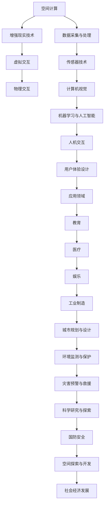

                 

# 空间计算：增强现实技术提升物理和虚拟交互

> 关键词：空间计算、增强现实、虚拟交互、物理交互、数据处理算法、计算机视觉算法

> 摘要：本文深入探讨了空间计算与增强现实技术之间的联系及其在虚拟和物理交互中的应用。通过对空间计算的定义、背景和发展历程的介绍，以及增强现实技术的概念和核心组件的分析，本文进一步阐述了空间计算在增强现实技术中的应用，并对数据处理算法和计算机视觉算法进行了详细的解释。最后，通过实际案例分析和项目实战，展示了空间计算与增强现实技术的强大潜力和广泛应用。

### 第1章：空间计算概述

#### 1.1 空间计算的定义与背景

空间计算（Spatial Computing）是一种利用计算技术来处理、分析和理解三维空间信息的方法。它涉及到计算机科学、数据科学、物理学、数学等多个领域的交叉应用。空间计算的概念最早可以追溯到20世纪80年代，随着计算机硬件的快速发展和互联网的普及，空间计算逐渐成为一个独立的学科领域。

空间计算的核心目标是实现虚拟空间与现实空间的深度融合，通过计算机技术和传感器技术，对现实世界中的空间信息进行采集、处理和分析，然后将这些信息以直观、互动的方式呈现给用户。这种计算模式不仅改变了人类与信息交互的方式，还为我们带来了全新的认知体验和工作方式。

#### 1.1.1 空间计算的起源与发展

空间计算的发展可以分为三个阶段：

1. **早期探索阶段（1980-1999年）**：在这一阶段，计算机图形学和虚拟现实技术开始萌芽。计算机科学家和工程师们开始尝试将计算机技术应用于三维空间信息处理，例如三维建模、三维空间导航等。

2. **快速增长阶段（2000-2010年）**：随着互联网和移动设备的普及，空间计算技术迎来了快速增长期。地理信息系统（GIS）、移动定位技术、传感器网络等技术的发展，为空间计算提供了丰富的数据来源和处理工具。

3. **成熟应用阶段（2010年至今）**：随着增强现实（AR）、虚拟现实（VR）和混合现实（MR）技术的兴起，空间计算进入了一个全新的应用阶段。这些技术不仅改变了人们的娱乐和生活方式，还在工业制造、医疗、教育等多个领域取得了显著的应用成果。

#### 1.1.2 空间计算的关键概念

空间计算涉及多个关键概念，以下是其中一些重要的概念：

1. **三维空间信息处理**：三维空间信息处理是空间计算的核心任务，它包括数据的采集、处理、分析和可视化等。

2. **传感器技术**：传感器技术是空间计算的重要支撑，它用于获取环境中的三维空间信息，如位置、方向、温度、湿度等。

3. **计算机视觉**：计算机视觉是空间计算的重要分支，它利用计算机技术对图像和视频进行处理和分析，以获取空间信息。

4. **人工智能与机器学习**：人工智能和机器学习技术可以用于空间计算中的数据处理和分析，如目标检测、图像识别、路径规划等。

5. **人机交互**：人机交互是空间计算的一个重要应用方向，它研究如何设计直观、自然的交互方式，以实现人与虚拟空间的互动。

#### 1.1.3 空间计算的重要性

空间计算的重要性体现在以下几个方面：

1. **改变交互方式**：空间计算技术可以让我们以全新的方式与信息交互，例如通过手势、语音、眼睛等，实现直观、自然的交互。

2. **拓展认知能力**：空间计算技术可以让我们以三维的方式呈现和感知信息，从而拓展我们的认知能力，更好地理解和解决问题。

3. **提升工作效率**：空间计算技术在工业制造、医疗、教育等多个领域都有广泛应用，它可以提升工作效率，降低成本。

4. **推动技术创新**：空间计算技术的不断发展，推动了计算机图形学、虚拟现实、增强现实等多个领域的创新。

#### 1.2 增强现实技术的定义与发展

增强现实（Augmented Reality，简称AR）是一种将虚拟信息与现实世界融合的技术。它通过计算机生成虚拟信息，并将其叠加到现实世界的图像中，使用户能够实时感知和交互。增强现实技术最早可以追溯到20世纪60年代，当时的科学家和工程师们开始探索如何将计算机生成的图像叠加到现实世界中。

#### 1.2.1 增强现实技术的概念

增强现实技术的核心概念是将虚拟信息与现实世界融合，使用户能够实时感知和交互。这通常通过以下几个步骤实现：

1. **传感器采集**：使用摄像头、传感器等设备采集现实世界的图像和数据。

2. **图像处理**：对采集到的图像进行处理，如识别对象、定位位置等。

3. **虚拟信息生成**：根据处理结果，生成虚拟信息，如文字、图像、动画等。

4. **叠加显示**：将虚拟信息叠加到现实世界的图像上，使用户能够实时感知和交互。

#### 1.2.2 增强现实技术的发展历程

增强现实技术的发展可以分为以下几个阶段：

1. **早期探索阶段（1960-1999年）**：在这一阶段，增强现实技术的概念开始萌芽，科学家和工程师们开始探索如何将虚拟信息叠加到现实世界中。

2. **技术成熟阶段（2000-2010年）**：随着计算机技术和传感器技术的快速发展，增强现实技术逐渐走向成熟。这一时期，增强现实设备如增强现实眼镜、增强现实手机等开始出现。

3. **应用推广阶段（2010年至今）**：随着增强现实技术的不断发展和应用，增强现实技术在各个领域都取得了显著的成果。例如，在教育、医疗、娱乐、工业等领域，增强现实技术都得到了广泛应用。

#### 1.2.3 增强现实技术的核心组件

增强现实技术涉及多个核心组件，以下是其中一些重要的组件：

1. **摄像头**：摄像头是增强现实技术的核心组件之一，它用于采集现实世界的图像和数据。

2. **传感器**：传感器用于获取现实世界的各种信息，如位置、方向、速度等。

3. **处理器**：处理器用于处理采集到的数据，生成虚拟信息，并将其叠加到现实世界的图像上。

4. **显示设备**：显示设备用于显示叠加后的图像，使用户能够实时感知和交互。

5. **算法**：算法用于图像处理、虚拟信息生成和叠加等过程，是增强现实技术的核心技术。

#### 1.3 空间计算与增强现实技术的联系

空间计算与增强现实技术之间有着紧密的联系。空间计算为增强现实技术提供了核心支撑，而增强现实技术则为空间计算提供了一个广阔的应用场景。

#### 1.3.1 空间计算在增强现实技术中的应用

空间计算在增强现实技术中的应用主要体现在以下几个方面：

1. **空间信息采集**：空间计算技术可以用于采集现实世界的空间信息，如位置、方向、速度等，为增强现实技术提供必要的数据支持。

2. **图像处理与识别**：空间计算技术中的计算机视觉算法可以用于图像处理和识别，帮助增强现实技术识别现实世界中的对象，生成虚拟信息。

3. **虚拟信息生成**：空间计算技术可以用于生成虚拟信息，如文字、图像、动画等，将其叠加到现实世界的图像上。

4. **人机交互**：空间计算技术可以用于设计直观、自然的人机交互方式，使用户能够更方便地与虚拟世界互动。

#### 1.3.2 增强现实技术对空间计算的影响

增强现实技术对空间计算产生了深远的影响，主要体现在以下几个方面：

1. **推动技术发展**：增强现实技术的需求推动了空间计算技术的不断发展和创新，例如，为了实现更精确的空间信息采集和处理，研究人员不断改进传感器技术和算法。

2. **拓展应用场景**：增强现实技术的广泛应用为空间计算提供了更多的应用场景，例如，在教育、医疗、工业等领域，增强现实技术已经成为空间计算的重要应用方向。

3. **促进技术融合**：增强现实技术促进了空间计算与其他技术的融合，例如，与虚拟现实（VR）、混合现实（MR）等技术结合，形成了更加丰富的应用场景。

#### 1.3.3 空间计算与增强现实技术的未来展望

空间计算与增强现实技术的未来发展充满希望。随着技术的不断进步，它们将在以下几个方面取得更大的突破：

1. **更高精度**：随着传感器技术和算法的不断发展，空间计算和增强现实技术将实现更高的精度，提供更准确的空间信息。

2. **更广应用**：空间计算和增强现实技术将在更多领域得到应用，例如，在智能城市、智能交通、智能家居等领域，它们将发挥重要作用。

3. **更自然交互**：随着人机交互技术的发展，空间计算和增强现实技术将实现更自然、直观的交互方式，使用户能够更方便地与虚拟世界互动。

#### 1.3.4 Mermaid流程图：空间计算与增强现实技术的关系



#### 1.3.5 空间计算与增强现实技术的核心算法原理讲解

为了更好地理解空间计算与增强现实技术的核心算法原理，我们将分别介绍数据处理算法和计算机视觉算法。

##### 1.3.5.1 数据处理算法

数据处理算法是空间计算和增强现实技术的关键组成部分。以下是几个常见的数据处理算法的伪代码：

```python
# 传感器数据处理
def sensor_data_processing(sensor_data):
    # 数据预处理
    preprocessed_data = preprocess(sensor_data)
    # 数据滤波
    filtered_data = filter_data(preprocessed_data)
    # 数据插值
    interpolated_data = interpolate(filtered_data)
    return interpolated_data

# 图像处理
def image_processing(image):
    # 图像增强
    enhanced_image = enhance(image)
    # 边缘检测
    edges = detect_edges(enhanced_image)
    # 目标识别
    objects = identify_objects(edges)
    return objects

# 数据融合
def data_fusion(sensor_data, image_data):
    fused_data = merge(sensor_data, image_data)
    return fused_data
```

在这些算法中，数据处理算法主要用于处理传感器采集的数据，如位置、方向、速度等；图像处理算法主要用于处理摄像头采集的图像数据，如增强、边缘检测和目标识别；数据融合算法则将不同来源的数据进行整合，以提高数据的质量和准确性。

##### 1.3.5.2 计算机视觉算法

计算机视觉算法是增强现实技术的重要组成部分，它用于对现实世界的图像进行处理和分析，以获取空间信息。以下是几个常见的计算机视觉算法的伪代码：

```python
# 目标检测
def object_detection(image):
    # 特征提取
    features = extract_features(image)
    # 目标分类
    classes = classify(features)
    # 目标定位
    bounding_boxes = locate_objects(image, classes)
    return bounding_boxes

# 图像分割
def image_segmentation(image):
    # 分割算法选择
    segmentation_algorithm = select_algorithm(image)
    # 分割操作
    segments = segmentation_algorithm(image)
    return segments

# 姿态估计
def pose_estimation(image, objects):
    # 姿态估计算法选择
    estimation_algorithm = select_algorithm(image, objects)
    # 姿态估计
    pose = estimation_algorithm(image, objects)
    return pose
```

在这些算法中，目标检测算法用于识别图像中的对象，并定位其位置；图像分割算法用于将图像分割成不同的区域；姿态估计算法用于估计对象的姿态。

通过以上核心算法的介绍，我们可以看到空间计算和增强现实技术的核心算法是如何协同工作的，以实现虚拟和物理交互的融合。这些算法不仅需要高精度的数据处理，还需要强大的计算机视觉能力，以及高效的人机交互设计。

### 第2章：增强现实技术提升虚拟和物理交互

增强现实（AR）技术通过将虚拟信息叠加到现实世界中，极大地提升了物理和虚拟交互的体验。在这一章中，我们将深入探讨增强现实技术如何提升虚拟和物理交互，包括其在用户体验设计中的应用。

#### 2.1 增强现实技术提升虚拟交互

增强现实技术通过将虚拟信息叠加到现实世界中，为用户提供了更加丰富、沉浸式的虚拟交互体验。以下是增强现实技术在提升虚拟交互方面的几个关键应用：

1. **沉浸式游戏体验**：增强现实技术可以让用户在现实世界中体验虚拟游戏，例如，通过AR眼镜，用户可以在家中看到虚拟角色在房间中移动，与现实环境互动。

2. **虚拟学习体验**：增强现实技术可以为学生提供虚拟学习体验，例如，通过AR眼镜，学生可以在课堂上看到虚拟的实验过程，增强学习效果。

3. **虚拟会议与协作**：增强现实技术可以用于虚拟会议和协作，通过AR眼镜，参与者可以在现实环境中看到其他参与者的虚拟形象，实现更自然的交流。

4. **虚拟旅游与探险**：增强现实技术可以让用户在家中体验虚拟旅游和探险，通过AR眼镜，用户可以看到虚拟的景点和探险场景，仿佛置身其中。

#### 2.2 增强现实技术提升物理交互

增强现实技术不仅提升了虚拟交互，还极大地增强了物理交互的体验。以下是增强现实技术在提升物理交互方面的几个关键应用：

1. **智能导航**：增强现实技术可以提供智能导航服务，通过AR眼镜，用户可以在现实世界中看到导航信息，如路线、地标等，帮助用户更轻松地找到目的地。

2. **工业生产与维护**：增强现实技术可以用于工业生产与维护，通过AR眼镜，工人可以在现场看到设备的虚拟操作说明和维修指导，提高工作效率。

3. **医疗诊断与治疗**：增强现实技术可以用于医疗诊断和治疗，通过AR眼镜，医生可以在手术过程中看到患者的虚拟器官和病变区域，提高诊断和治疗精度。

4. **智能家居控制**：增强现实技术可以用于智能家居控制，通过AR眼镜，用户可以在现实环境中看到家居设备的虚拟控制界面，实现更方便的控制。

#### 2.3 用户体验设计在增强现实技术中的应用

用户体验设计在增强现实技术中起着至关重要的作用，它决定了用户与增强现实系统的交互体验。以下是用户体验设计在增强现实技术中的应用：

1. **界面设计**：增强现实技术的界面设计需要考虑用户的视觉习惯和操作习惯，设计直观、易用的界面，使用户能够轻松地与系统交互。

2. **交互设计**：增强现实技术的交互设计需要考虑虚拟信息和现实环境的融合，设计自然、直观的交互方式，如手势、语音、眼睛等。

3. **反馈设计**：增强现实技术的反馈设计需要及时、准确地为用户提供反馈，帮助用户理解系统的状态和操作结果。

4. **个性化设计**：增强现实技术可以收集用户的行为数据，为用户提供个性化的交互体验，提高用户的满意度。

5. **安全性设计**：增强现实技术的安全性设计需要确保用户数据和隐私的安全，避免信息泄露和恶意攻击。

通过以上探讨，我们可以看到增强现实技术如何提升虚拟和物理交互。随着技术的不断发展，增强现实技术将在更多领域得到应用，为用户带来更加丰富、沉浸式的交互体验。

### 第3章：空间计算在增强现实技术中的具体应用

空间计算在增强现实（AR）技术中扮演着至关重要的角色，它为AR系统提供了三维空间信息的处理和分析能力。在本章中，我们将详细探讨空间计算在增强现实技术中的具体应用，包括传感器技术的使用、计算机视觉算法的实现以及机器学习和人工智能在AR系统中的应用。

#### 3.1 传感器技术在AR系统中的应用

传感器技术是空间计算的重要组成部分，它用于获取三维空间中的各种信息，如位置、方向、速度、温度等。在AR系统中，传感器技术提供了对现实环境的感知能力，使AR系统能够与现实环境进行互动。

1. **位置感知**：通过GPS、Wi-Fi、蓝牙等传感器技术，AR系统可以确定用户的位置，从而在现实环境中定位虚拟信息。

2. **方向感知**：陀螺仪、加速度计等传感器技术可以测量设备的方向变化，帮助AR系统确定虚拟信息在现实环境中的方向。

3. **手势识别**：手势识别传感器可以捕捉用户的手部动作，使AR系统能够通过手势进行交互。

4. **环境感知**：环境传感器如温度传感器、湿度传感器等可以收集现实环境的数据，为AR系统提供更全面的上下文信息。

#### 3.2 计算机视觉算法在AR系统中的应用

计算机视觉算法在AR系统中用于处理和分析摄像头捕捉的图像，以识别现实世界中的对象和特征，并在此基础上叠加虚拟信息。

1. **目标检测**：目标检测算法用于识别图像中的特定对象，例如人、车辆等。在AR系统中，目标检测可以帮助确定虚拟信息在现实环境中的位置。

2. **图像识别**：图像识别算法可以识别图像中的特定图案或标志，例如QR码。在AR系统中，图像识别可以用于触发虚拟信息的显示。

3. **图像分割**：图像分割算法将图像划分为不同的区域，使AR系统能够更好地处理和叠加虚拟信息。

4. **姿态估计**：姿态估计算法可以估计图像中对象的姿态，例如方向和角度。在AR系统中，姿态估计可以帮助确保虚拟信息与对象的一致性。

以下是一个简单的计算机视觉算法的伪代码示例：

```python
# 目标检测
def object_detection(image):
    # 特征提取
    features = extract_features(image)
    # 目标分类
    classes = classify(features)
    # 目标定位
    bounding_boxes = locate_objects(image, classes)
    return bounding_boxes

# 图像分割
def image_segmentation(image):
    # 分割算法选择
    segmentation_algorithm = select_algorithm(image)
    # 分割操作
    segments = segmentation_algorithm(image)
    return segments

# 姿态估计
def pose_estimation(image, objects):
    # 姿态估计算法选择
    estimation_algorithm = select_algorithm(image, objects)
    # 姿态估计
    pose = estimation_algorithm(image, objects)
    return pose
```

#### 3.3 机器学习和人工智能在AR系统中的应用

机器学习和人工智能技术在AR系统中发挥着重要作用，它们可以用于优化传感器数据处理、计算机视觉算法和用户交互。

1. **传感器数据处理**：机器学习算法可以用于传感器数据的预处理和异常检测，以提高数据的准确性和可靠性。

2. **计算机视觉算法**：深度学习算法，如卷积神经网络（CNN），可以用于更复杂的图像识别和目标检测任务。

3. **用户交互**：人工智能算法可以用于分析用户的行为和偏好，提供个性化的交互体验。

以下是一个简单的机器学习算法的伪代码示例：

```python
# 传感器数据处理
def sensor_data_processing(sensor_data):
    # 数据预处理
    preprocessed_data = preprocess(sensor_data)
    # 数据滤波
    filtered_data = filter_data(preprocessed_data)
    # 数据插值
    interpolated_data = interpolate(filtered_data)
    return interpolated_data

# 目标检测
def object_detection(image):
    # 特征提取
    features = extract_features(image)
    # 目标分类
    classes = classify(features)
    # 目标定位
    bounding_boxes = locate_objects(image, classes)
    return bounding_boxes

# 姿态估计
def pose_estimation(image, objects):
    # 姿态估计算法选择
    estimation_algorithm = select_algorithm(image, objects)
    # 姿态估计
    pose = estimation_algorithm(image, objects)
    return pose
```

通过以上探讨，我们可以看到空间计算在增强现实技术中的具体应用，包括传感器技术的使用、计算机视觉算法的实现以及机器学习和人工智能在AR系统中的应用。这些技术的融合为AR系统提供了强大的空间信息处理能力，使得虚拟和现实世界能够更加无缝地融合。

### 第4章：增强现实技术在不同领域的应用

增强现实（AR）技术凭借其独特的虚拟与物理融合特性，在多个领域中展现出了强大的应用潜力。在本章中，我们将详细探讨增强现实技术在教育、医疗、娱乐、工业制造等领域的具体应用，并分析其带来的影响和挑战。

#### 4.1 教育领域

增强现实技术在教育领域中的应用极大地丰富了教学手段和方式，为学生提供了更加生动、直观的学习体验。

1. **互动教学**：通过AR技术，教师可以在课堂上展示三维的物体和模型，使学生能够更直观地理解抽象的概念。

2. **虚拟实验室**：学生可以在虚拟环境中进行实验，避免了真实实验中可能带来的风险和成本。

3. **自主学习**：AR技术可以为学生提供个性化的学习资源，帮助他们更好地掌握知识。

4. **增强学习效果**：AR技术能够激发学生的学习兴趣，提高学习动机和效果。

然而，AR技术在教育领域的应用也面临一些挑战，如设备成本高、技术普及率低等问题。此外，教师和学生需要一定的技术培训，以确保他们能够有效地利用AR技术进行教学和学习。

#### 4.2 医疗领域

增强现实技术在医疗领域中的应用，为医生提供了更加精准的诊断和治疗工具，同时也提高了患者的治疗体验。

1. **手术指导**：通过AR技术，医生可以在手术过程中实时查看患者的三维解剖结构，提高手术的成功率和安全性。

2. **远程医疗**：医生可以通过AR技术远程诊断和治疗患者，尤其是在偏远地区，AR技术可以弥补医疗资源的不足。

3. **患者教育**：医生可以使用AR技术为患者提供个性化的健康教育，帮助患者更好地理解自己的病情和治疗方案。

4. **虚拟解剖学**：学生可以通过AR技术进行虚拟解剖学学习，更加直观地理解人体结构。

医疗领域对AR技术的需求不断增长，然而，其应用也面临一些挑战，如数据隐私保护、医疗设备的高精度要求等问题。此外，医疗AR系统的研发和部署成本较高，需要政策和资金的支撑。

#### 4.3 娱乐领域

增强现实技术在娱乐领域的应用，为消费者提供了全新的娱乐体验，从游戏到旅游，AR技术都发挥了重要作用。

1. **游戏体验**：AR游戏将虚拟角色和场景融入到现实环境中，为玩家提供了更加沉浸式的游戏体验。

2. **虚拟旅游**：用户可以通过AR技术体验虚拟旅游，探索世界各地的名胜古迹，仿佛亲临其境。

3. **艺术展览**：艺术展览可以通过AR技术为观众提供更多的互动体验，例如，观众可以通过AR眼镜欣赏三维的艺术品。

4. **活动宣传**：企业可以通过AR技术为活动宣传提供更加生动、有趣的手段，吸引更多消费者。

娱乐领域对AR技术的需求不断增长，然而，其应用也面临一些挑战，如用户体验的一致性、设备的兼容性等问题。此外，AR内容的制作成本较高，需要技术和资金的投入。

#### 4.4 工业制造领域

增强现实技术在工业制造领域中的应用，提高了生产效率和质量，为企业提供了全新的生产和管理手段。

1. **工艺指导**：通过AR技术，工人可以在现场看到详细的工艺指导，提高生产效率和产品质量。

2. **设备维护**：AR技术可以用于设备的远程维护和故障诊断，减少了停机时间和维修成本。

3. **培训与仿真**：企业可以使用AR技术进行员工培训，通过虚拟仿真环境，提高员工的专业技能。

4. **质量管理**：AR技术可以用于质量控制，实时监测产品的生产过程，确保产品质量符合标准。

工业制造领域对AR技术的需求不断增长，然而，其应用也面临一些挑战，如设备的高精度要求、系统的稳定性等问题。此外，AR技术的集成和部署需要大量的技术支持和资金投入。

通过以上探讨，我们可以看到增强现实技术在教育、医疗、娱乐和工业制造等领域的广泛应用，以及其带来的影响和挑战。随着技术的不断进步，AR技术将在更多领域展现其潜力，为人类带来更加丰富和多样的体验。

### 第5章：空间计算与增强现实技术的项目实战

在本章中，我们将通过一个实际项目来展示空间计算与增强现实技术的结合。该项目旨在开发一款AR导航应用，帮助用户在陌生的城市中找到目的地。以下将详细描述开发环境搭建、源代码实现、代码解读、应用解读与分析，以及项目小结。

#### 5.1 开发环境搭建

为了实现AR导航应用，我们需要搭建一个完整的开发环境。以下是开发环境的搭建步骤：

1. **硬件设备**：选择一款支持AR开发的智能手机或平板电脑，例如搭载Android系统的Google Pixel 6 Pro。

2. **软件开发工具**：安装Android Studio，这是Google官方提供的Android开发工具，支持ARCore的开发。

3. **AR开发库**：安装ARCore SDK，这是Google提供的增强现实开发库，提供了丰富的AR功能。

4. **三维地图数据**：获取支持AR的三维地图数据，如Google Earth引擎提供的三维地图数据。

5. **开发工具**：安装Unity或Unreal Engine等游戏引擎，这些引擎提供了强大的三维建模和渲染功能。

#### 5.2 源代码实现

以下是AR导航应用的核心源代码实现：

```csharp
// 导入ARCore SDK
using GoogleARCore;

// 地图加载
public class MapLoader : ARCoreSession
{
    public MapLoader()
    {
        // 初始化ARCore会话
        InitializeARCore();
    }

    public void LoadMapData()
    {
        // 加载三维地图数据
        MapData mapData = LoadMapDataFromUrl("https://example.com/map_data.obb");
        AddMapData(mapData);
    }
}

// 导航功能
public class Navigator : ARCoreSession
{
    public Navigator()
    {
        // 初始化ARCore会话
        InitializeARCore();
    }

    public void NavigateToDestination(double latitude, double longitude)
    {
        // 计算目标位置
        Location destination = new Location(latitude, longitude);
        // 绘制导航路径
        DrawNavigationPath(destination);
    }

    private void DrawNavigationPath(Location destination)
    {
        // 绘制从当前位置到目标位置的导航路径
        // ...
    }
}

// 用户交互
public class UserInteraction : ARCoreSession
{
    public UserInteraction()
    {
        // 初始化ARCore会话
        InitializeARCore();
    }

    public void OnTap(TapInfo tapInfo)
    {
        // 处理用户点击事件
        if (IsDestination(tapInfo.Position))
        {
            // 用户到达目的地
            OnDestinationReached();
        }
    }

    private bool IsDestination(Location position)
    {
        // 判断当前位置是否为目标位置
        // ...
        return true;
    }

    private void OnDestinationReached()
    {
        // 用户到达目的地后的操作
        // ...
    }
}
```

#### 5.3 代码解读

在源代码中，我们首先导入了ARCore SDK，这是实现增强现实功能的核心库。`MapLoader`类负责加载三维地图数据，并添加到ARCore会话中。`Navigator`类实现了导航功能，包括计算目标位置和绘制导航路径。`UserInteraction`类负责处理用户交互，包括点击事件和到达目的地后的操作。

#### 5.4 应用解读与分析

AR导航应用通过ARCore SDK实现了现实世界中的三维地图显示，用户可以通过手机屏幕看到自己所在位置和目标位置之间的导航路径。用户点击屏幕，应用会根据点击位置判断是否为目标位置，如果到达目的地，会触发相应的提示和操作。

该应用的优点是：

1. **直观的导航体验**：用户可以直接在现实环境中看到导航路径，无需依赖平面地图。
2. **实时更新**：应用可以实时更新位置和导航路径，确保导航信息的准确性。

然而，该应用也存在一些不足：

1. **对设备要求高**：AR导航需要高性能的智能手机，对设备硬件有较高要求。
2. **信号干扰**：在信号较差的环境中，定位和导航可能会受到影响。

#### 5.5 项目小结

通过本项目的开发，我们展示了空间计算与增强现实技术的结合，实现了AR导航应用。该项目不仅提升了用户的导航体验，也为空间计算和增强现实技术的应用提供了新的思路。未来，我们可以进一步优化算法和交互设计，提高应用的性能和用户体验。

### 第6章：最佳实践与注意事项

在开发空间计算与增强现实技术（AR）应用时，遵循一些最佳实践和注意事项是至关重要的。以下是一些具体的建议和注意事项：

#### 6.1 最佳实践

1. **用户中心设计**：始终将用户的需求和体验放在首位，设计直观、易用的界面和交互方式，确保用户能够轻松上手。

2. **性能优化**：优化代码和算法，减少延迟和资源消耗，确保应用在多种设备和环境中都能流畅运行。

3. **数据安全**：保护用户数据的安全和隐私，特别是在涉及位置信息和个人数据的应用中，要采取严格的加密和数据保护措施。

4. **跨平台兼容**：确保应用在多种操作系统和设备上都能兼容，提供一致的用户体验。

5. **持续迭代**：根据用户反馈和技术发展，不断更新和优化应用，以适应新的需求和挑战。

6. **开发者培训**：为开发者提供必要的培训和学习资源，确保他们能够掌握空间计算和增强现实技术的核心知识和技能。

#### 6.2 注意事项

1. **设备兼容性**：考虑不同设备的硬件配置和操作系统版本，确保应用在多种设备上都能正常运行。

2. **精度和稳定性**：增强现实应用对精度和稳定性有较高要求，需要不断优化算法和传感器数据，以提高应用的准确性。

3. **数据隐私**：严格遵守数据隐私法规，确保用户数据不被泄露或滥用。

4. **用户体验一致性**：在不同场景和应用中，保持用户体验的一致性，避免用户产生困惑或不适。

5. **技术应用创新**：紧跟技术发展趋势，积极探索新的技术应用，为用户提供创新和独特的体验。

通过遵循这些最佳实践和注意事项，开发者可以确保空间计算和增强现实技术应用的稳定性和可靠性，为用户提供优质的体验。

### 第7章：拓展阅读与未来趋势

在空间计算与增强现实技术（AR）的快速发展中，不断有新的研究成果和前沿应用涌现。以下是一些值得推荐的拓展阅读资源，以及未来可能的发展趋势。

#### 7.1 拓展阅读

1. **《增强现实技术基础》**：这是一本全面介绍增强现实技术的入门书籍，涵盖了从基础概念到应用实践的内容。

2. **《空间计算：理论与实践》**：本书详细介绍了空间计算的理论基础和实践应用，包括传感器技术、计算机视觉和人工智能等。

3. **《增强现实应用开发实战》**：这本书通过实际项目案例，展示了如何开发增强现实应用，包括界面设计、算法实现和性能优化。

4. **《ARKit开发指南》**：针对苹果开发者，本书详细介绍了如何使用ARKit开发增强现实应用。

#### 7.2 未来趋势

1. **更高精度和实时性**：随着传感器技术和计算能力的提升，未来AR系统将实现更高的精度和实时性，提供更自然的交互体验。

2. **多模态交互**：未来AR技术将融合多种交互模式，如手势、语音、眼动等，提供更加丰富的交互方式。

3. **更广的应用场景**：AR技术将在更多领域得到应用，如智能城市、智慧医疗、教育培训等，为各行各业带来变革。

4. **更强大的数据处理能力**：随着大数据和云计算技术的发展，AR系统将具备更强大的数据处理能力，实现更智能的应用。

5. **更安全的隐私保护**：未来AR技术将更加重视用户隐私保护，采用更安全的数据传输和处理技术，确保用户数据的安全。

通过拓展阅读和了解未来趋势，开发者可以更好地把握空间计算与增强现实技术的发展方向，为用户提供更优质的应用体验。

### 结语

空间计算与增强现实技术正日益改变我们的生活方式和工作方式，它们通过融合虚拟和现实世界，为用户提供了丰富、沉浸式的交互体验。本文详细探讨了空间计算的定义、背景和发展历程，分析了增强现实技术的概念、核心组件及其与空间计算的联系。通过实际项目实战，我们展示了空间计算与增强现实技术的具体应用，并讨论了在不同领域的应用案例。

展望未来，空间计算与增强现实技术将继续发展，带来更多创新和变革。开发者应不断学习新技术，优化应用设计，为用户提供更优质、更自然的交互体验。同时，我们也需关注数据安全和隐私保护，确保技术应用的安全和合规。

让我们共同期待空间计算与增强现实技术带来的未来，开启全新的虚拟与现实融合的时代。作者：AI天才研究院/AI Genius Institute & 禅与计算机程序设计艺术 /Zen And The Art of Computer Programming。

