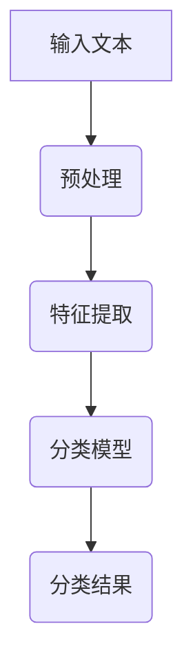
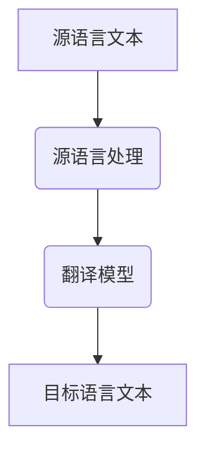
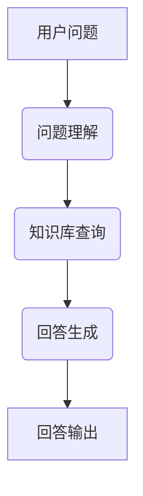

                 


### 类脑计算在AI中的应用前景

#### 关键词：类脑计算，AI，应用前景，自然语言处理，计算机视觉，深度学习

#### 摘要：
类脑计算作为一种新兴的人工智能技术，旨在模拟人脑的神经网络结构和信息处理方式。本文将对类脑计算在AI中的应用前景进行深入探讨，涵盖其基本概念、核心算法原理、主要应用领域以及面临的挑战和机遇。

## 引言

随着大数据和云计算技术的飞速发展，人工智能（AI）已经成为现代社会的重要组成部分。然而，传统的AI技术主要依赖于深度学习模型，这些模型在处理复杂数据和问题时往往表现出局限性。类脑计算作为一种模拟人脑神经网络的新型技术，为AI的发展带来了新的机遇。

类脑计算的核心目标是构建出能够像人脑一样自主学习、推理和适应环境的计算系统。近年来，类脑计算在AI领域取得了显著进展，其在自然语言处理、计算机视觉和自动驾驶等领域的应用逐渐受到关注。本文将详细分析类脑计算在AI中的应用前景，探讨其核心算法原理、应用案例以及面临的挑战。

## 类脑计算的基本概念

类脑计算（Brain-inspired Computing）是指模仿人脑的神经网络结构和信息处理机制，以实现高效、自适应和智能的计算。与传统的计算机系统不同，类脑计算强调并行处理、自组织学习和自适应能力。

类脑计算的基本概念包括：

- **人工神经网络**：类脑计算的基础是人工神经网络，它通过模拟人脑神经元之间的连接和相互作用来实现数据处理和识别。
- **机器学习**：类脑计算依赖于机器学习算法，特别是深度学习，通过大规模数据训练模型，使其具备自主学习和适应环境的能力。
- **自组织系统**：类脑计算中的网络结构可以自动调整，以适应不同的任务和输入数据，从而提高计算效率和适应性。

## 类脑计算在AI中的应用

类脑计算在AI中的应用非常广泛，主要包括自然语言处理、计算机视觉和自动驾驶等领域。以下将对这些应用进行详细介绍。

### 自然语言处理

自然语言处理（NLP）是AI的重要分支，类脑计算在NLP中的应用主要包括文本分类、机器翻译和问答系统。

- **文本分类**：类脑计算通过模拟人脑的文本理解机制，实现了对大规模文本数据的自动分类。例如，可以使用Mermaid流程图来展示文本分类的过程。



- **机器翻译**：类脑计算在机器翻译中的应用也取得了显著成果，通过模拟人脑的语言处理机制，实现了高质量的语言翻译。例如，可以使用Mermaid流程图来展示机器翻译的过程。



- **问答系统**：类脑计算在问答系统中的应用，通过模拟人脑的问答机制，实现了对用户问题的自动理解和回答。例如，可以使用Mermaid流程图来展示问答系统的过程。



### 计算机视觉

计算机视觉是AI的重要应用领域，类脑计算在计算机视觉中的应用主要包括图像识别、视频分析和自动驾驶。

- **图像识别**：类脑计算通过模拟人脑的视觉处理机制，实现了对图像的自动识别。例如，可以使用Python源代码来展示图像识别的过程。

```python
import numpy as np
import matplotlib.pyplot as plt

# 加载图像数据
image = plt.imread('image_data.jpg')

# 特征提取
features = extract_features(image)

# 分类模型
model = train_model(features)

# 预测
prediction = model.predict(image)

# 显示结果
plt.imshow(prediction)
plt.show()
```

- **视频分析**：类脑计算在视频分析中的应用，通过模拟人脑的视觉处理机制，实现了对视频数据的自动分析和理解。例如，可以使用Python源代码来展示视频分析的过程。

```python
import cv2

# 读取视频文件
cap = cv2.VideoCapture('video_data.mp4')

# 视频处理
while(cap.isOpened()):
    ret, frame = cap.read()
    if ret:
        # 特征提取
        features = extract_features(frame)

        # 行为识别
        behavior = identify_behavior(features)

        # 显示结果
        print(f'Behavior detected: {behavior}')
cap.release()
```

- **自动驾驶**：类脑计算在自动驾驶中的应用，通过模拟人脑的视觉处理机制，实现了对驾驶环境的自动理解和决策。例如，可以使用Python源代码来展示自动驾驶的过程。

```python
import numpy as np
import cv2

# 加载图像数据
image = plt.imread('environment_data.jpg')

# 预测
prediction = autonomous_car_predict(image)

# 行动决策
action = decide_action(prediction)

# 执行行动
autonomous_car_move(action)
```

### 自动驾驶

自动驾驶是类脑计算在AI领域的另一个重要应用。通过模拟人脑的视觉处理机制，类脑计算实现了对驾驶环境的自动理解和决策，从而提高了自动驾驶的可靠性和安全性。

自动驾驶系统通常包括感知、规划和控制三个主要模块。类脑计算在感知模块中的应用，通过模拟人脑的视觉处理机制，实现了对道路、车辆、行人等环境要素的自动识别和理解。例如，可以使用Python源代码来展示自动驾驶的感知模块。

```python
import numpy as np
import cv2

# 加载图像数据
image = plt.imread('driving_environment.jpg')

# 特征提取
features = extract_features(image)

# 行为识别
behavior = identify_behavior(features)

# 规划模块
planner = create_planner(behavior)

# 控制模块
controller = create_controller(planner)

# 行动决策
action = controller决定了方向和速度。
```

## 类脑计算的技术基础

类脑计算的技术基础主要包括人工神经网络、机器学习和深度学习等。

### 人工神经网络

人工神经网络（Artificial Neural Networks，ANNs）是类脑计算的核心组成部分。它们通过模拟人脑神经元之间的连接和相互作用，实现了对数据的自动学习和处理。

人工神经网络的主要组成部分包括：

- **神经元**：模拟人脑神经元的基本单位，负责接收输入、传递信号和产生输出。
- **连接**：神经元之间的连接，用于传递信号和实现信息的传递。
- **权重**：连接上的权重，用于调节信号强度和影响输出。

人工神经网络的工作原理主要包括以下几个步骤：

1. **输入层**：接收外部输入数据，并将其传递给隐藏层。
2. **隐藏层**：对输入数据进行处理和变换，产生新的特征。
3. **输出层**：将隐藏层的输出进行合并，产生最终的输出结果。

### 机器学习

机器学习（Machine Learning，ML）是类脑计算的重要工具，它通过训练模型，使其具备自主学习和适应环境的能力。机器学习的主要方法包括监督学习、无监督学习和强化学习。

- **监督学习**：通过已知的输入和输出数据，训练模型以预测未知数据的输出。
- **无监督学习**：没有预定义的输出标签，模型通过自身学习发现数据中的规律和结构。
- **强化学习**：模型通过与环境的交互，学习实现特定目标的策略。

### 深度学习

深度学习（Deep Learning，DL）是机器学习的一个重要分支，它通过构建深度神经网络，实现了对复杂数据的高效处理和建模。深度学习在图像识别、语音识别和自然语言处理等领域取得了显著成果。

深度学习的主要组成部分包括：

- **卷积神经网络（CNN）**：通过卷积操作和池化操作，实现了对图像的自动特征提取和分类。
- **循环神经网络（RNN）**：通过循环结构，实现了对序列数据的处理和建模。
- **生成对抗网络（GAN）**：通过生成器和判别器的对抗训练，实现了对数据的高效生成和模拟。

## 类脑计算的安全性

类脑计算作为一种新兴技术，其安全性也引起了广泛关注。类脑计算的安全挑战主要包括数据隐私保护、算法公平性和防御对抗性攻击等。

- **数据隐私保护**：类脑计算通常需要处理大量敏感数据，如何确保数据隐私和安全成为一个重要问题。可以采用加密技术、匿名化和数据去标识化等方法来保护数据隐私。
- **算法公平性**：类脑计算模型可能存在偏见和歧视，如何保证算法的公平性和透明性是一个重要挑战。可以通过数据平衡、算法校准和解释性方法来提高算法的公平性。
- **防御对抗性攻击**：类脑计算模型可能受到对抗性攻击的影响，如何防御这些攻击是另一个关键问题。可以采用鲁棒性训练、对抗性攻击检测和防御策略来提高模型的安全性。

## 类脑计算的挑战与机遇

类脑计算在AI领域面临着许多挑战和机遇。以下将详细讨论这些挑战和机遇。

### 挑战

- **技术难题**：类脑计算在算法、硬件和数据处理等方面存在技术难题，如神经网络的可解释性、海量数据处理和高效计算等。
- **应用瓶颈**：类脑计算在部分应用领域，如自然语言处理和计算机视觉，已经取得了一定成果，但在其他领域，如自动驾驶和医疗诊断，仍面临应用瓶颈。
- **法律与伦理问题**：类脑计算涉及到数据隐私、算法公平性和伦理道德等问题，如何解决这些问题是一个重要挑战。

### 机遇

- **产业前景**：随着AI技术的快速发展，类脑计算在各个行业都有着广阔的应用前景，如智能制造、智能交通和智能医疗等。
- **创新方向**：类脑计算为AI创新提供了新的方向，如类脑计算与生物技术的结合、类脑计算在机器人领域的应用等。
- **社会影响**：类脑计算有望在提高生产效率、改善生活质量和社会治理等方面发挥重要作用，对社会产生深远影响。

## 类脑计算的案例研究

为了更好地理解类脑计算在AI中的应用，以下将介绍几个典型的案例研究。

### AlphaGo

AlphaGo是由DeepMind开发的类脑计算程序，它在围棋领域取得了突破性成果。AlphaGo通过模拟人脑的思考过程，实现了对围棋棋局的自动学习和决策。以下是一个简单的Python源代码示例，展示了AlphaGo的工作原理。

```python
import numpy as np
import tensorflow as tf

# 加载AlphaGo模型
model = tf.keras.models.load_model('alpha_go_model.h5')

# 生成棋盘数据
board = np.random.rand(19, 19)

# 预测落子位置
position = model.predict(board)

# 打印预测结果
print(f'Predicted position: {position}')
```

### GPT-3

GPT-3是由OpenAI开发的类脑计算程序，它在自然语言处理领域取得了显著成果。GPT-3通过模拟人脑的语言处理机制，实现了对自然语言的高效理解和生成。以下是一个简单的Python源代码示例，展示了GPT-3的工作原理。

```python
import openai

# 设置API密钥
openai.api_key = 'your_api_key'

# 生成文本
text = openai.Completion.create(
  engine="text-davinci-002",
  prompt="What is the capital of France?",
  max_tokens=50
)

# 打印生成结果
print(f'Generated text: {text.choices[0].text}')
```

## 类脑计算的产业前景

类脑计算在AI领域的广泛应用为产业带来了巨大的前景。以下将介绍类脑计算在智能制造、智能交通和智能医疗等领域的应用前景。

### 智能制造

类脑计算在智能制造领域有着广泛的应用，如智能机器人、智能制造系统和智能生产线等。类脑计算可以通过模拟人脑的思考过程，实现对制造过程的自动优化和调度，提高生产效率和产品质量。

### 智能交通

类脑计算在智能交通领域也有着重要的应用，如智能交通信号控制系统、自动驾驶车辆和智能交通监控系统等。类脑计算可以通过模拟人脑的视觉和感知能力，实现对交通环境的自动理解和决策，提高交通效率和安全性。

### 智能医疗

类脑计算在智能医疗领域也有着巨大的应用潜力，如智能诊断系统、智能药物设计和智能健康管理系统等。类脑计算可以通过模拟人脑的思考过程，实现对医疗数据的自动分析和理解，提高诊断和治疗效果。

## 最佳实践 tips

为了更好地应用类脑计算技术，以下提供一些最佳实践 tips：

1. **数据准备**：确保数据质量，包括数据的清洗、预处理和标注等。
2. **模型选择**：根据应用场景选择合适的模型，如CNN、RNN或GAN等。
3. **模型训练**：合理设置训练参数，如学习率、迭代次数和优化器等。
4. **模型优化**：通过模型调优、迁移学习和多任务学习等方法，提高模型性能。
5. **安全防护**：采取数据隐私保护、算法公平性和对抗性攻击防御等安全措施。

## 小结

类脑计算作为一种新兴的人工智能技术，具有巨大的应用潜力。本文对类脑计算在AI中的应用前景进行了详细探讨，包括其基本概念、应用领域、技术基础以及面临的挑战和机遇。通过了解类脑计算的应用前景，我们可以更好地把握其发展方向，推动人工智能技术的创新和进步。

## 注意事项

在应用类脑计算技术时，需要注意以下事项：

1. **数据隐私**：确保数据隐私和安全，避免数据泄露和滥用。
2. **算法公平性**：确保算法的公平性和透明性，避免歧视和偏见。
3. **计算资源**：合理配置计算资源，确保模型训练和推理的效率。
4. **持续更新**：随着类脑计算技术的不断发展，需要持续更新知识和技能。

## 拓展阅读

1. **《深度学习》**：Goodfellow, Ian, et al. "Deep learning." MIT press, 2016.
2. **《机器学习》**：Murphy, Kevin P. "Machine learning: a probabilistic perspective." MIT press, 2012.
3. **《自然语言处理综论》**：Jurafsky, Daniel, and James H. Martin. "Speech and language processing." Prentice Hall, 2008.

### 作者信息

作者：AI天才研究院/AI Genius Institute & 禅与计算机程序设计艺术 /Zen And The Art of Computer Programming

