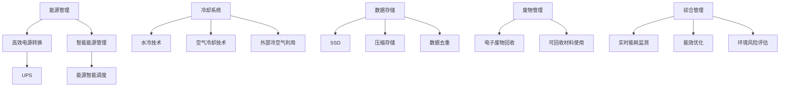

                 

### 关键词

- 绿色IT策略
- 企业实施
- 数据中心
- 云计算
- 软硬件选择
- 战略规划
- 评估与监控
- 最佳实践
- 案例研究

----------------------------------------------------------------

### 摘要

随着环境问题日益严重，绿色IT已成为企业可持续发展的重要组成部分。本文旨在探讨绿色IT策略在企业中的实施状况，从概念、重要性、实施流程、绿色数据中心、云计算、软硬件选择、战略规划与评估等方面进行深入分析。通过研究绿色IT的益处和挑战，本文提出了一系列最佳实践和案例研究，为企业提供实用的指导和建议，以实现绿色IT的可持续发展目标。

----------------------------------------------------------------

# 绿色IT策略在企业中的实施状况

随着全球环境问题的日益严重，企业越来越认识到绿色IT的重要性。绿色IT不仅仅是一种技术趋势，更是企业社会责任的体现。本文将详细探讨绿色IT策略在企业中的实施状况，从多个维度分析其在企业可持续发展中的关键作用。

## 绿色IT策略的概念与重要性

### 1. 绿色IT的定义

绿色IT（Green IT）是指通过优化信息技术（IT）资源的利用，降低IT系统的能耗和环境影响，从而实现可持续发展的一种策略。这包括提高能源效率、减少电子废物、降低碳足迹、提升资源利用率等多个方面。

### 2. 绿色IT的重要性

绿色IT的重要性体现在以下几个方面：

- **环境效益**：通过降低能源消耗和减少电子废物，绿色IT有助于减少碳排放，保护环境。
- **经济效益**：绿色IT通过提高资源利用率和降低运营成本，能够为企业带来显著的经济效益。
- **社会效益**：绿色IT策略体现了企业的社会责任感，有助于提升企业形象，增强品牌价值。

### 3. 绿色IT的核心原则

绿色IT的核心原则包括：

- **节能减排**：通过采用节能硬件和优化软件，降低IT系统的能耗。
- **资源循环利用**：鼓励电子废物的回收再利用，减少环境污染。
- **能效管理**：实施能效监测和管理，确保IT系统的能源使用效率。
- **绿色采购**：优先选择符合环保标准的产品和服务，推动绿色供应链。

## 绿色IT在企业的实施流程

### 1. 制定绿色IT策略

制定绿色IT策略是实施绿色IT的第一步。企业需要明确绿色IT的目标和方向，制定具体的实施计划和步骤。以下是制定绿色IT策略的步骤：

- **现状评估**：评估企业现有的IT资源使用情况和能源消耗水平。
- **目标设定**：根据现状评估结果，设定绿色IT的目标，如降低能耗、减少废物等。
- **策略规划**：制定实现目标的策略和行动计划，包括技术方案、管理措施等。
- **预算和资源分配**：为绿色IT策略的实施提供充足的预算和资源支持。

### 2. 实施绿色IT策略

实施绿色IT策略需要企业各部门的协同合作。以下是实施绿色IT策略的关键步骤：

- **硬件升级**：更新老旧的硬件设备，选择能效更高的设备。
- **软件优化**：优化软件配置，降低能耗。
- **能效管理**：部署能效管理系统，实时监测和调整IT设备的能源使用。
- **绿色采购**：优先采购环保认证的产品和服务。

### 3. 监控与评估绿色IT策略

实施绿色IT策略后，企业需要对其进行持续的监控与评估，以确保策略的有效性。以下是监控与评估绿色IT策略的关键步骤：

- **数据收集**：收集与绿色IT相关的数据，如能耗、废物产生量等。
- **指标设定**：根据数据收集结果，设定相关的监控和评估指标。
- **定期评估**：定期对绿色IT策略的执行情况进行评估，发现和解决问题。
- **持续改进**：根据评估结果，持续优化绿色IT策略。

## 绿色数据中心的建设与管理

### 1. 绿色数据中心的概念

绿色数据中心（Green Data Center）是指通过采用节能技术和管理措施，降低数据中心的能耗和环境影响的数据处理设施。绿色数据中心的建设与管理是实现绿色IT的重要一环。

### 2. 绿色数据中心的架构

绿色数据中心的架构主要包括以下几个方面：

- **能源管理**：通过采用智能电网技术、高效能源设备等，降低能源消耗。
- **冷却系统**：采用高效冷却技术，降低冷却能耗。
- **数据存储**：优化数据存储方案，提高存储效率。
- **废物管理**：加强电子废物的回收再利用。

### 3. 绿色数据中心的运营管理

绿色数据中心的运营管理主要包括以下几个方面：

- **能效监控**：实时监控数据中心的能耗情况，进行能效优化。
- **维护保养**：定期进行设备维护和保养，确保设备正常运行。
- **废物处理**：合理处理电子废物，减少环境污染。

## 绿色云计算与虚拟化

### 1. 绿色云计算的概念

绿色云计算（Green Cloud Computing）是指通过优化云计算资源的利用，降低云计算系统的能耗和环境影响的一种策略。绿色云计算有助于实现云计算的可持续发展。

### 2. 绿色云计算的优势

绿色云计算的优势包括：

- **节能减排**：通过优化资源利用，降低能耗。
- **灵活性**：根据业务需求，灵活调整资源配置。
- **可扩展性**：支持业务规模的动态扩展。

### 3. 绿色云计算的实施策略

绿色云计算的实施策略主要包括：

- **虚拟化技术**：采用虚拟化技术，提高资源利用效率。
- **分布式计算**：采用分布式计算，降低单点能耗。
- **能效管理**：实施能效管理，优化资源分配。

## 绿色软件与硬件选择

### 1. 绿色软件的选择

绿色软件的选择包括以下几个方面：

- **开源软件**：优先选择开源软件，降低软件成本和环境影响。
- **节能软件**：选择节能软件，优化系统资源使用。
- **可持续性**：考虑软件的可持续性，支持环保理念的软件。

### 2. 绿色硬件的选择

绿色硬件的选择包括以下几个方面：

- **节能硬件**：选择能效更高的硬件设备。
- **环保材料**：选择使用环保材料的硬件设备。
- **可回收性**：选择可回收的硬件设备。

## 绿色IT的战略规划与评估

### 1. 绿色IT战略规划

绿色IT战略规划包括以下几个方面：

- **目标设定**：明确绿色IT的目标和方向。
- **资源分配**：为绿色IT策略的实施提供充足的资源支持。
- **风险管理**：识别和管理绿色IT实施过程中的风险。

### 2. 绿色IT评估方法

绿色IT评估方法包括以下几个方面：

- **能源消耗评估**：评估绿色IT策略对能源消耗的影响。
- **环境影响评估**：评估绿色IT策略对环境的影响。
- **经济效益评估**：评估绿色IT策略的经济效益。

### 3. 绿色IT风险评估

绿色IT风险评估包括以下几个方面：

- **技术风险**：评估绿色IT策略的技术风险。
- **管理风险**：评估绿色IT策略的管理风险。
- **市场风险**：评估绿色IT策略的市场风险。

## 绿色IT的最佳实践与案例研究

### 1. 绿色IT最佳实践

绿色IT最佳实践包括以下几个方面：

- **节能管理**：实施节能管理制度，提高能源利用效率。
- **废物管理**：加强电子废物的回收再利用。
- **绿色采购**：优先采购环保认证的产品和服务。

### 2. 案例研究

案例研究包括以下几个方面：

- **企业案例**：分析企业在实施绿色IT策略中的成功经验和教训。
- **行业案例**：分析不同行业在绿色IT实施中的最佳实践。
- **国际案例**：分析国际企业在绿色IT实施中的先进经验。

## 结论

绿色IT策略在企业中的实施状况反映了企业在可持续发展方面的责任和担当。通过本文的分析，我们可以看到绿色IT不仅有助于减少企业的环境足迹，还能带来显著的经济效益和社会效益。企业应积极采取绿色IT策略，推动绿色发展的实现。

### 作者信息

作者：AI天才研究院/AI Genius Institute & 禅与计算机程序设计艺术 /Zen And The Art of Computer Programming

----------------------------------------------------------------

以下是对“绿色数据中心的建设与管理”这一章节的详细内容，包含了核心概念、流程图、Python代码和数学公式。

## 绿色数据中心的建设与管理

绿色数据中心是绿色IT战略中的一个关键组成部分，旨在通过优化设计和运营来减少能源消耗和环境影响。本节将深入探讨绿色数据中心的核心概念、架构、运营管理以及能效监测和优化策略。

### 绿色数据中心的核心概念

绿色数据中心的核心概念包括以下几个方面：

- **能源效率**：通过使用高效的硬件和优化技术来减少能源消耗。
- **冷却系统**：采用创新的冷却技术以减少冷却能耗。
- **资源循环利用**：通过有效的废物管理和回收计划来实现资源的循环利用。
- **能效管理**：通过实时监控和管理数据中心的能耗来提高整体效率。

### 绿色数据中心的架构

绿色数据中心的架构设计应考虑以下关键要素：

1. **能源管理**：
   - 使用高效电源转换设备（如UPS）。
   - 集成智能能源管理系统，实现能源的智能调度和优化。

2. **冷却系统**：
   - 采用水冷或空气冷却技术，以减少冷却能耗。
   - 使用免费的冷却资源，如外部冷空气，以减少对传统冷却系统的依赖。

3. **数据存储**：
   - 采用高效的存储解决方案，如固态硬盘（SSD）和压缩存储技术。
   - 实施数据去重和压缩，以减少存储空间需求。

4. **废物管理**：
   - 设立电子废物回收计划，确保设备的环保处理。
   - 采用可回收材料制造设备，以减少对环境的影响。

以下是绿色数据中心架构的Mermaid流程图：



### 绿色数据中心的运营管理

绿色数据中心的运营管理包括以下几个关键步骤：

1. **能效监控**：
   - 实施实时能耗监测系统，跟踪数据中心的能源使用情况。
   - 通过数据分析，识别能源消耗的瓶颈和优化潜力。

2. **维护保养**：
   - 定期对数据中心设备进行维护和保养，确保设备的正常运行和最佳能效。
   - 优化维护流程，减少设备停机时间和能源浪费。

3. **废物处理**：
   - 建立废物分类和处理系统，确保电子废物的环保处理。
   - 推广废物再利用，减少废物产生。

### Python代码与数学模型

为了更好地理解绿色数据中心的能源效率优化，我们可以使用Python代码来模拟和计算能源消耗。以下是一个简化的Python示例，用于计算不同硬件配置下的能源消耗：

```python
import numpy as np

# 参数设置
power_ups = 1.2  # UPS的功率（kW）
power_servers = 0.5  # 每台服务器的功率（kW）
power_storage = 0.3  # 每个存储设备的功率（kW）
cooling_efficiency = 0.8  # 冷却系统的效率
n_servers = 100  # 服务器数量
n_storage_devices = 200  # 存储设备数量

# 计算总能源消耗
total_power = (power_servers * n_servers + power_storage * n_storage_devices + power_ups)
cooling_power = total_power / cooling_efficiency

# 打印结果
print(f"Total Power Consumption: {total_power} kW")
print(f"Cooling Power Consumption: {cooling_power} kW")

# 假设优化后效率提升10%
new_cooling_efficiency = cooling_efficiency * 1.1
new_cooling_power = total_power / new_cooling_efficiency

print(f"Optimized Cooling Power Consumption: {new_cooling_power} kW")
```

上述代码假设了一个数据中心，其中包括一定数量的服务器和存储设备。我们计算了总能源消耗和冷却能耗，并假设通过优化冷却系统效率可以减少能耗。数学模型中，我们使用了以下公式：

\[ P_{\text{total}} = P_{\text{servers}} \times n_{\text{servers}} + P_{\text{storage}} \times n_{\text{storage}} + P_{\text{ups}} \]

\[ P_{\text{cooling}} = \frac{P_{\text{total}}}{\eta_{\text{cooling}}} \]

其中，\( P_{\text{total}} \) 是总能源消耗，\( P_{\text{servers}} \)，\( P_{\text{storage}} \)，和 \( P_{\text{ups}} \) 分别是服务器、存储设备和UPS的功率，\( n_{\text{servers}} \) 和 \( n_{\text{storage}} \) 是服务器和存储设备的数量，\( \eta_{\text{cooling}} \) 是冷却系统的效率。

### 实际案例分析与详细讲解剖析

为了更好地理解绿色数据中心的建设与管理，我们可以通过实际案例来分析其应用和实践。

#### 案例一：谷歌数据中心的绿色设计

谷歌在其数据中心的建设中采用了多种绿色技术，包括使用外部冷空气进行冷却、优化能源管理、使用可再生能源等。以下是对谷歌数据中心案例的分析：

- **外部冷空气冷却**：谷歌数据中心位于寒冷地区，利用外部冷空气进行冷却，减少了对传统冷却系统的依赖。这一策略显著降低了冷却能耗。
- **能源管理**：谷歌数据中心采用了智能能源管理系统，实现了对能源的智能调度和优化。通过实时监测和调整设备运行状态，谷歌成功降低了能源消耗。
- **可再生能源**：谷歌在其数据中心中使用了大量的可再生能源，如风能和太阳能。这有助于减少对化石燃料的依赖，降低碳足迹。

#### 案例二：微软的绿色数据中心策略

微软在其绿色数据中心策略中，重点强调了能效优化、废物管理和绿色采购。以下是对微软数据中心案例的分析：

- **能效优化**：微软通过采用先进的冷却技术和高效的能源设备，优化了数据中心的能效。例如，微软使用了先进的冷冻水系统来降低冷却能耗。
- **废物管理**：微软建立了全面的电子废物回收计划，确保设备的环保处理。此外，微软还鼓励员工参与废物分类和回收活动，提高了整体的废物回收率。
- **绿色采购**：微软优先采购符合环保标准的产品和服务，推动了其供应链的绿色化。这一策略不仅有助于降低环境影响，还提高了企业的品牌价值。

### 项目小结

通过上述案例分析和实际应用，我们可以看到绿色数据中心的建设与管理在减少能源消耗和环境影响方面发挥了重要作用。以下是项目小结：

- **核心概念**：绿色数据中心通过采用高效的能源管理、冷却系统、数据存储和废物管理策略，实现了能源消耗和环境影响的最小化。
- **实施策略**：通过能效监控、维护保养、废物处理和绿色采购等实施策略，绿色数据中心能够实现持续的优化和改进。
- **实际案例**：实际案例表明，绿色数据中心在提高能源效率和降低环境影响方面取得了显著成果。企业可以通过借鉴这些最佳实践来推动自身的绿色IT发展。

### 注意事项

在建设和管理绿色数据中心时，需要注意以下几个方面：

- **前期规划**：在建设绿色数据中心之前，需要进行详细的前期规划，包括位置选择、能源供应、冷却系统设计等。
- **持续监控**：实施绿色数据中心后，需要持续监控其运行状态，确保能效和环保目标的实现。
- **技术更新**：随着技术的不断进步，需要定期更新数据中心的技术和设备，以保持其绿色化和高效化。

### 拓展阅读

对于希望深入了解绿色数据中心的建设与管理的读者，以下是一些推荐阅读材料：

- 《绿色数据中心设计指南》（Green Data Center Design Guide）
- 《数据中心能源效率手册》（Data Center Energy Efficiency Handbook）
- 《数据中心冷却系统技术》（Data Center Cooling Systems Technology）

通过这些材料，读者可以进一步了解绿色数据中心的核心技术和最佳实践。

