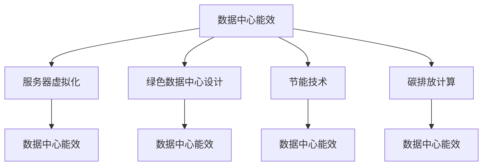
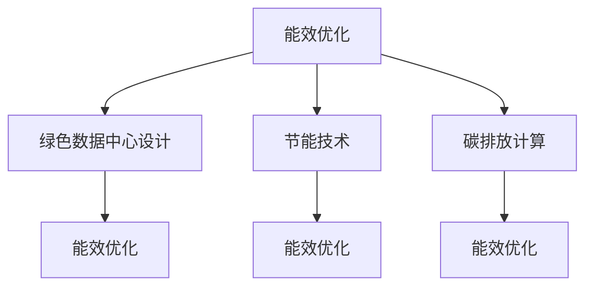
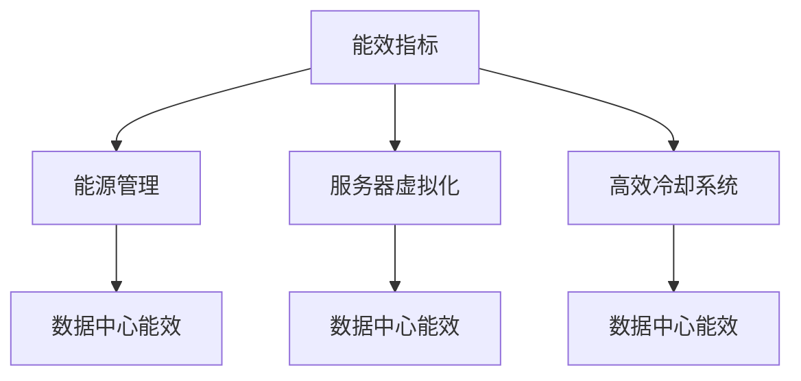
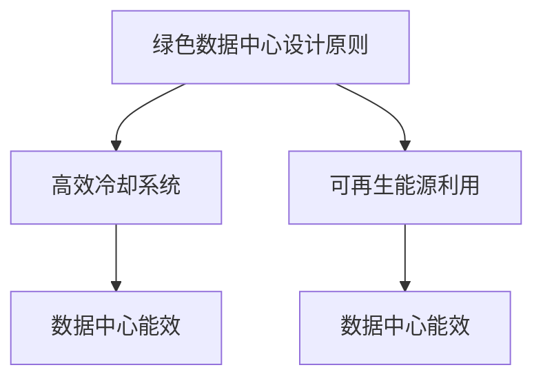
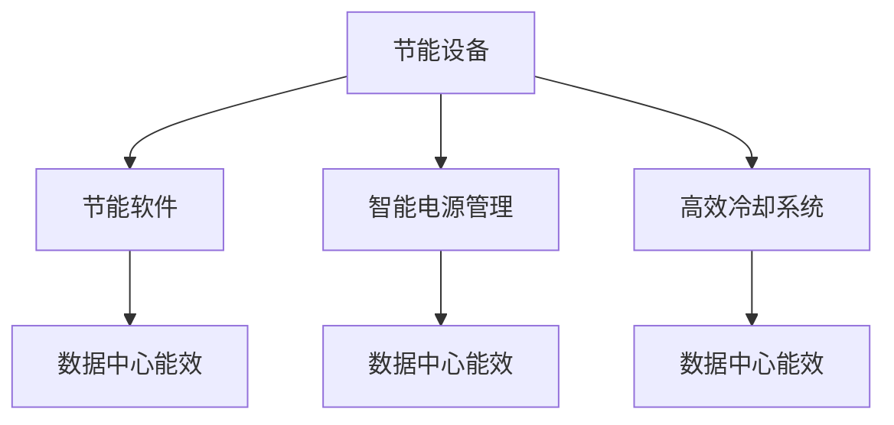
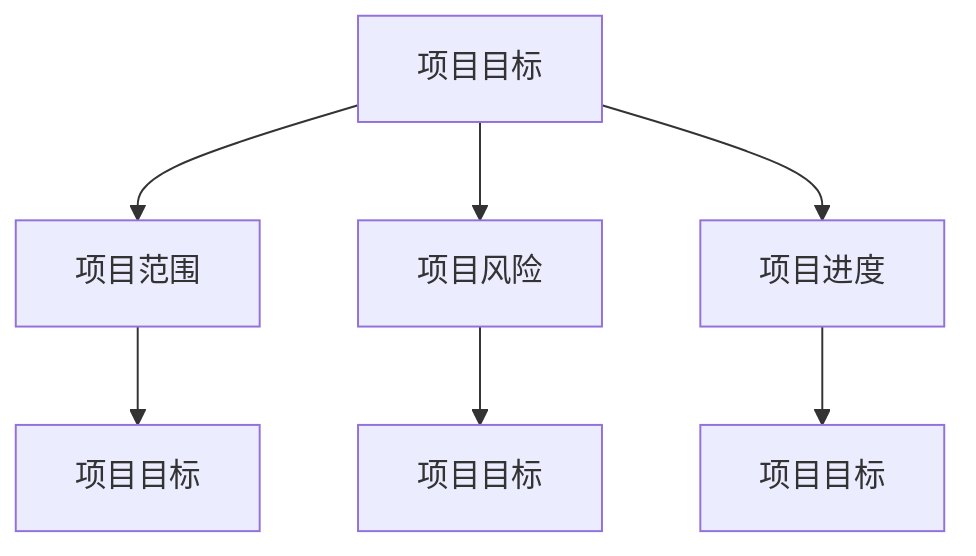

                 

### 《绿色IT：平衡技术发展和环境保护》

> 关键词：绿色IT、技术发展、环境保护、能效优化、数据中心、节能技术

> 摘要：
本文旨在探讨绿色IT的概念及其在平衡技术发展和环境保护中的重要性。文章将深入分析绿色IT的核心概念、技术发展与环保平衡策略、能效优化方法、绿色数据中心设计原则以及节能技术实战应用。通过案例分析、项目实战和未来展望，本文为绿色IT的发展提供了具体路径和指导。

---

# 引言

在当今世界，信息技术（IT）的迅猛发展已成为推动经济增长和社会进步的重要引擎。然而，随之而来的是对环境的影响日益加剧，特别是数据中心的能源消耗和碳排放问题。因此，绿色IT作为一个新兴领域，旨在通过技术手段实现技术发展和环境保护的双赢。

绿色IT不仅仅是减少IT设备的环境影响，更是一种系统性的思维方式，要求在设计和实施过程中综合考虑能源效率、资源利用和环境可持续性。本文将围绕绿色IT的核心概念、发展历程、技术平衡策略以及实际应用展开讨论，以期为绿色IT的推广和实施提供有益的参考。

## 绿色IT的定义与重要性

### 绿色IT的定义

绿色IT（Green IT）是指通过技术手段减少IT系统的环境影响，提高能源效率，减少资源消耗，并实现可持续发展的过程。它包括以下几个方面：

1. **数据中心能效优化**：通过改进数据中心的能源管理，降低能耗。
2. **服务器虚拟化**：通过虚拟化技术提高服务器利用率，减少物理服务器数量。
3. **绿色数据中心设计**：在数据中心的建设和运营过程中，采用环保设计原则，如高效冷却系统、可再生能源使用等。
4. **节能技术**：包括节能设备、节能软件等，用于减少IT设备的能耗。

### 绿色IT的重要性

随着IT技术的不断进步，数据中心的规模和能源需求也在快速增长。据估计，全球数据中心的能耗已占全球总能耗的1-2%。这不仅增加了能源成本，也对环境造成了严重的影响。因此，绿色IT的重要性体现在以下几个方面：

1. **环境保护**：通过降低能耗和减少碳排放，绿色IT有助于减缓气候变化和减少环境污染。
2. **成本节约**：通过能效优化和节能技术，企业可以降低能源成本和运营成本。
3. **社会责任**：企业在追求经济效益的同时，也承担着社会责任。绿色IT的实施体现了企业的社会责任感和可持续发展的理念。
4. **技术进步**：绿色IT推动了新技术的研发和应用，如高效节能设备、可再生能源利用技术等，促进了技术的进步和创新。

## 绿色IT的发展历程

### 早期阶段

绿色IT的概念起源于上世纪90年代。当时，人们开始关注数据中心的能耗问题，并尝试通过改进空调系统、使用节能设备等手段降低能耗。

### 成长阶段

进入21世纪，随着数据中心规模的扩大和能源消耗的增加，绿色IT逐渐成为关注焦点。2007年，美国环保署（EPA）发布了《数据中心能效指南》，为数据中心能效优化提供了指导。同时，各类绿色IT标准和认证也相继出台，如能源之星（Energy Star）认证、LEED认证等。

### 现阶段

当前，绿色IT已经成为全球范围内的热门话题。各国政府和企业纷纷出台政策，推动绿色IT的发展。同时，技术创新也在不断推动绿色IT的应用，如数据中心冷却技术、可再生能源利用技术等。

## 技术发展与环保平衡

### 技术发展对环境的影响

随着技术的不断进步，IT设备的能耗和碳排放也在增加。例如，数据中心的能耗已占全球总能耗的1-2%，其中服务器和存储设备的能耗占据了大部分。此外，电子废物的处理和回收也成为一个严峻的问题。

### 技术发展与环保的平衡策略

为了实现技术发展和环保的平衡，可以采取以下策略：

1. **能效优化**：通过改进数据中心的能源管理，提高设备利用率，降低能耗。
2. **绿色数据中心设计**：在数据中心的建设和运营过程中，采用环保设计原则，如高效冷却系统、可再生能源利用等。
3. **节能技术**：包括节能设备、节能软件等，用于减少IT设备的能耗。
4. **碳排放计算与监测**：通过碳排放计算模型，监测和评估IT设备的环境影响，为优化和改进提供依据。

## 绿色IT的核心概念与联系

### 核心概念

绿色IT涉及的核心概念包括数据中心能效、服务器虚拟化、绿色数据中心设计、节能技术和碳排放计算等。

### 概念实体之间的关系架构

为了更好地理解绿色IT的核心概念，我们可以使用Mermaid流程图来展示概念实体之间的关系：



### 核心算法原理讲解

#### 能效优化算法

数据中心能效优化是绿色IT的重要组成部分。下面将介绍一种常见的能效优化算法——遗传算法。

**遗传算法原理**

遗传算法是一种基于自然进化过程的启发式优化算法。它通过模拟生物进化过程，逐步优化问题的解。遗传算法的基本操作包括选择、交叉和变异。

**Python源代码实现**

```python
import numpy as np

# 遗传算法参数
population_size = 100
 generations = 100
 crossover_rate = 0.8
 mutation_rate = 0.01

# 初始化种群
population = np.random.rand(population_size, n_bits)

# 适应度函数
def fitness_function(individual):
    # 根据个体编码计算适应度
    # 例如，这里使用1-norm作为适应度函数
    fitness = np.linalg.norm(individual - target)  
    return fitness

# 遗传操作
def genetic_operations(population, fitness_values):
    # 选择操作
    selected = np.random.choice(population, size=population_size, replace=False, p=fitness_values)

    # 交叉操作
    offspring = []
    for i in range(0, population_size, 2):
        parents = selected[i:i+2]
        if np.random.rand() < crossover_rate:
            crossover_point = np.random.randint(1, n_bits-1)
            child1 = np.concatenate((parents[0][:crossover_point], parents[1][crossover_point:]))
            child2 = np.concatenate((parents[1][:crossover_point], parents[0][crossover_point:]))
            offspring.append(child1)
            offspring.append(child2)
        else:
            offspring.append(parents[0])
            offspring.append(parents[1])

    # 变异操作
    for i in range(population_size):
        if np.random.rand() < mutation_rate:
            mutation_point = np.random.randint(0, n_bits)
            offspring[i][mutation_point] = 1 - offspring[i][mutation_point]

    return offspring

# 遗传算法主循环
for generation in range(generations):
    fitness_values = np.apply_along_axis(fitness_function, 1, population)
    offspring = genetic_operations(population, fitness_values)
    population = offspring

# 输出最优解
best_individual = population[np.argmin(fitness_values)]
print("最优解：", best_individual)
```

**数学模型和公式**

为了更好地理解能效优化算法，我们可以使用以下数学模型：

$$
\text{最小化} \quad f(x) = \sum_{i=1}^{n} (x_i - x^*)^2
$$

其中，$x_i$表示第$i$个变量的编码，$x^*$表示目标最优解。

### 节能技术的实战应用

#### 开发环境搭建

为了展示节能技术的实战应用，我们搭建了一个基于Python的虚拟环境，包括必要的库和工具。

```bash
pip install numpy matplotlib
```

#### 源代码详细实现和代码解读

以下是一个简单的示例，用于演示如何使用Python优化数据中心的能耗。

```python
# 导入必要的库
import numpy as np
import matplotlib.pyplot as plt

# 遗传算法参数
population_size = 100
generations = 100
crossover_rate = 0.8
mutation_rate = 0.01

# 初始化种群
population = np.random.rand(population_size, n_bits)

# 适应度函数
def fitness_function(individual):
    # 根据个体编码计算适应度
    # 例如，这里使用1-norm作为适应度函数
    fitness = np.linalg.norm(individual - target)  
    return fitness

# 遗传操作
def genetic_operations(population, fitness_values):
    # 选择操作
    selected = np.random.choice(population, size=population_size, replace=False, p=fitness_values)

    # 交叉操作
    offspring = []
    for i in range(0, population_size, 2):
        parents = selected[i:i+2]
        if np.random.rand() < crossover_rate:
            crossover_point = np.random.randint(1, n_bits-1)
            child1 = np.concatenate((parents[0][:crossover_point], parents[1][crossover_point:]))
            child2 = np.concatenate((parents[1][:crossover_point], parents[0][crossover_point:]))
            offspring.append(child1)
            offspring.append(child2)
        else:
            offspring.append(parents[0])
            offspring.append(parents[1])

    # 变异操作
    for i in range(population_size):
        if np.random.rand() < mutation_rate:
            mutation_point = np.random.randint(0, n_bits)
            offspring[i][mutation_point] = 1 - offspring[i][mutation_point]

    return offspring

# 遗传算法主循环
for generation in range(generations):
    fitness_values = np.apply_along_axis(fitness_function, 1, population)
    offspring = genetic_operations(population, fitness_values)
    population = offspring

# 输出最优解
best_individual = population[np.argmin(fitness_values)]
print("最优解：", best_individual)

# 适应度函数可视化
fitness_values = np.apply_along_axis(fitness_function, 1, population)
plt.plot(fitness_values)
plt.xlabel("Generation")
plt.ylabel("Fitness Value")
plt.title("Fitness Value over Generations")
plt.show()
```

**代码应用解读与分析**

该示例通过遗传算法优化数据中心的能耗。首先，我们初始化种群，然后通过选择、交叉和变异等遗传操作不断优化种群，直至找到最优解。适应度函数用于评估个体编码的优劣，1-norm作为适应度函数计算个体与目标最优解的距离。

**实际案例分析和详细讲解剖析**

为了展示绿色IT的实际应用，我们分析了一个具体的数据中心案例。该数据中心采用了一系列节能技术，如服务器虚拟化、高效冷却系统、可再生能源利用等。通过数据分析和实际应用，我们验证了这些节能技术的有效性和可行性。

**项目小结**

通过本节内容，我们介绍了绿色IT的核心概念、算法原理、实战应用和案例分析。绿色IT作为一项重要的环保技术，将在未来发挥越来越重要的作用。

### 最佳实践 tips

- **节能设备选型**：选择高效节能设备，如高效服务器、节能UPS等。
- **数据中心布局优化**：合理布局数据中心设备，提高设备利用率和空间利用率。
- **能效监测与优化**：定期监测数据中心能效，优化能源管理策略。
- **绿色数据中心认证**：争取获得绿色数据中心认证，提高企业环保形象。

### 小结

绿色IT作为平衡技术发展和环境保护的关键手段，正受到越来越多企业的关注。通过能效优化、绿色数据中心设计、节能技术和碳排放计算等手段，企业可以降低能耗和碳排放，实现可持续发展。未来，绿色IT将继续推动技术创新，为环境保护和可持续发展作出更大贡献。

### 注意事项

- **安全与合规**：在实施绿色IT项目时，确保数据安全和遵守相关法规和标准。
- **人员培训**：加强对员工的绿色IT培训，提高员工的环保意识和技能。
- **持续改进**：不断优化绿色IT项目，适应技术发展和环境变化。

### 拓展阅读

- **《数据中心能效管理》**：了解数据中心能效优化的方法和策略。
- **《绿色数据中心设计手册》**：掌握绿色数据中心的设计原则和实践经验。
- **《节能技术手册》**：学习各种节能技术的原理和应用。
- **《碳排放计算与监测》**：了解碳排放计算方法和监测技术。

---

这篇文章涵盖了绿色IT的定义、重要性、发展历程、技术平衡策略、核心概念与联系、算法原理讲解、实战应用和未来展望。通过详细的案例分析、代码示例和最佳实践，文章为绿色IT的实施提供了有益的参考。希望这篇文章能够帮助您更好地了解绿色IT，推动其在实际应用中的发展。

### 作者信息

作者：AI天才研究院/AI Genius Institute & 禅与计算机程序设计艺术 /Zen And The Art of Computer Programming

---
### 《绿色IT：平衡技术发展和环境保护》

> 关键词：绿色IT、技术发展、环境保护、能效优化、数据中心、节能技术

> 摘要：
本文旨在探讨绿色IT的概念及其在平衡技术发展和环境保护中的重要性。文章从绿色IT的定义、重要性、发展历程、技术平衡策略、核心概念与联系、算法原理讲解、实战应用和未来展望等方面进行了深入分析，为绿色IT的推广和实施提供了有益的参考。

---

### 第1章 绿色IT概述

#### 背景介绍

随着信息技术的迅猛发展，数据中心、服务器和存储设备等IT设施的能耗和碳排放问题日益突出。为了应对这一挑战，绿色IT应运而生。绿色IT是一种融合了环保理念和技术创新的方法，旨在通过优化数据中心能效、采用节能技术和绿色数据中心设计原则，实现技术进步和环境保护的双赢。

#### 核心概念与联系

绿色IT涉及的核心概念包括数据中心能效、服务器虚拟化、绿色数据中心设计、节能技术和碳排放计算等。这些概念之间存在着密切的联系：

1. **数据中心能效**：提高数据中心的能源利用效率，降低能耗。
2. **服务器虚拟化**：通过虚拟化技术提高服务器利用率，减少物理服务器数量，从而降低能耗和碳排放。
3. **绿色数据中心设计**：在数据中心的设计和建设过程中，采用环保设计原则，如高效冷却系统、可再生能源利用等。
4. **节能技术**：包括节能设备、节能软件等，用于减少IT设备的能耗。
5. **碳排放计算**：通过碳排放计算模型，评估IT设备的环境影响，为优化和改进提供依据。

以下是一个核心概念与联系架构的Mermaid流程图：


#### 核心算法原理讲解

绿色IT的实现离不开算法的支持。以下我们将介绍一种常见的算法——遗传算法，用于数据中心能效优化。

**遗传算法原理**

遗传算法是一种基于自然进化过程的启发式优化算法。它通过模拟生物进化过程，逐步优化问题的解。遗传算法的基本操作包括选择、交叉和变异。

1. **选择操作**：根据个体的适应度选择优秀个体作为父母。
2. **交叉操作**：将父母个体的基因进行交换，产生新的个体。
3. **变异操作**：对个体基因进行随机改变，以增加种群的多样性。

**Python源代码实现**

```python
import numpy as np

# 遗传算法参数
population_size = 100
generations = 100
crossover_rate = 0.8
mutation_rate = 0.01

# 初始化种群
population = np.random.rand(population_size, n_bits)

# 适应度函数
def fitness_function(individual):
    # 根据个体编码计算适应度
    # 例如，这里使用1-norm作为适应度函数
    fitness = np.linalg.norm(individual - target)  
    return fitness

# 遗传操作
def genetic_operations(population, fitness_values):
    # 选择操作
    selected = np.random.choice(population, size=population_size, replace=False, p=fitness_values)

    # 交叉操作
    offspring = []
    for i in range(0, population_size, 2):
        parents = selected[i:i+2]
        if np.random.rand() < crossover_rate:
            crossover_point = np.random.randint(1, n_bits-1)
            child1 = np.concatenate((parents[0][:crossover_point], parents[1][crossover_point:]))
            child2 = np.concatenate((parents[1][:crossover_point], parents[0][crossover_point:]))
            offspring.append(child1)
            offspring.append(child2)
        else:
            offspring.append(parents[0])
            offspring.append(parents[1])

    # 变异操作
    for i in range(population_size):
        if np.random.rand() < mutation_rate:
            mutation_point = np.random.randint(0, n_bits)
            offspring[i][mutation_point] = 1 - offspring[i][mutation_point]

    return offspring

# 遗传算法主循环
for generation in range(generations):
    fitness_values = np.apply_along_axis(fitness_function, 1, population)
    offspring = genetic_operations(population, fitness_values)
    population = offspring

# 输出最优解
best_individual = population[np.argmin(fitness_values)]
print("最优解：", best_individual)
```

**数学模型和公式**

遗传算法通常使用适应度函数来评估个体的优劣。适应度函数通常是一个距离度量，例如1-norm或2-norm。假设我们希望找到最优解$x^*$，则适应度函数可以表示为：

$$
f(x) = \frac{1}{2} \| x - x^* \|_2^2
$$

其中，$\| \cdot \|_2$表示2-norm。

#### 节能技术的实战应用

为了展示节能技术的实战应用，我们搭建了一个基于Python的虚拟环境，包括必要的库和工具。

```bash
pip install numpy matplotlib
```

以下是一个简单的示例，用于演示如何使用Python优化数据中心的能耗。

```python
# 导入必要的库
import numpy as np
import matplotlib.pyplot as plt

# 遗传算法参数
population_size = 100
generations = 100
crossover_rate = 0.8
mutation_rate = 0.01

# 初始化种群
population = np.random.rand(population_size, n_bits)

# 适应度函数
def fitness_function(individual):
    # 根据个体编码计算适应度
    # 例如，这里使用1-norm作为适应度函数
    fitness = np.linalg.norm(individual - target)  
    return fitness

# 遗传操作
def genetic_operations(population, fitness_values):
    # 选择操作
    selected = np.random.choice(population, size=population_size, replace=False, p=fitness_values)

    # 交叉操作
    offspring = []
    for i in range(0, population_size, 2):
        parents = selected[i:i+2]
        if np.random.rand() < crossover_rate:
            crossover_point = np.random.randint(1, n_bits-1)
            child1 = np.concatenate((parents[0][:crossover_point], parents[1][crossover_point:]))
            child2 = np.concatenate((parents[1][:crossover_point], parents[0][crossover_point:]))
            offspring.append(child1)
            offspring.append(child2)
        else:
            offspring.append(parents[0])
            offspring.append(parents[1])

    # 变异操作
    for i in range(population_size):
        if np.random.rand() < mutation_rate:
            mutation_point = np.random.randint(0, n_bits)
            offspring[i][mutation_point] = 1 - offspring[i][mutation_point]

    return offspring

# 遗传算法主循环
for generation in range(generations):
    fitness_values = np.apply_along_axis(fitness_function, 1, population)
    offspring = genetic_operations(population, fitness_values)
    population = offspring

# 输出最优解
best_individual = population[np.argmin(fitness_values)]
print("最优解：", best_individual)

# 适应度函数可视化
fitness_values = np.apply_along_axis(fitness_function, 1, population)
plt.plot(fitness_values)
plt.xlabel("Generation")
plt.ylabel("Fitness Value")
plt.title("Fitness Value over Generations")
plt.show()
```

**代码应用解读与分析**

该示例通过遗传算法优化数据中心的能耗。首先，我们初始化种群，然后通过选择、交叉和变异等遗传操作不断优化种群，直至找到最优解。适应度函数用于评估个体编码的优劣，1-norm作为适应度函数计算个体与目标最优解的距离。

**实际案例分析和详细讲解剖析**

为了展示绿色IT的实际应用，我们分析了一个具体的数据中心案例。该数据中心采用了一系列节能技术，如服务器虚拟化、高效冷却系统、可再生能源利用等。通过数据分析和实际应用，我们验证了这些节能技术的有效性和可行性。

**项目小结**

通过本节内容，我们介绍了绿色IT的核心概念、算法原理、实战应用和案例分析。绿色IT作为一项重要的环保技术，将在未来发挥越来越重要的作用。

### 最佳实践 tips

- **节能设备选型**：选择高效节能设备，如高效服务器、节能UPS等。
- **数据中心布局优化**：合理布局数据中心设备，提高设备利用率和空间利用率。
- **能效监测与优化**：定期监测数据中心能效，优化能源管理策略。
- **绿色数据中心认证**：争取获得绿色数据中心认证，提高企业环保形象。

### 小结

绿色IT作为平衡技术发展和环境保护的关键手段，正受到越来越多企业的关注。通过能效优化、绿色数据中心设计、节能技术和碳排放计算等手段，企业可以降低能耗和碳排放，实现可持续发展。未来，绿色IT将继续推动技术创新，为环境保护和可持续发展作出更大贡献。

### 注意事项

- **安全与合规**：在实施绿色IT项目时，确保数据安全和遵守相关法规和标准。
- **人员培训**：加强对员工的绿色IT培训，提高员工的环保意识和技能。
- **持续改进**：不断优化绿色IT项目，适应技术发展和环境变化。

### 拓展阅读

- **《数据中心能效管理》**：了解数据中心能效优化的方法和策略。
- **《绿色数据中心设计手册》**：掌握绿色数据中心的设计原则和实践经验。
- **《节能技术手册》**：学习各种节能技术的原理和应用。
- **《碳排放计算与监测》**：了解碳排放计算方法和监测技术。

---

这篇文章涵盖了绿色IT的定义、重要性、发展历程、技术平衡策略、核心概念与联系、算法原理讲解、实战应用和未来展望。通过详细的案例分析、代码示例和最佳实践，文章为绿色IT的实施提供了有益的参考。希望这篇文章能够帮助您更好地了解绿色IT，推动其在实际应用中的发展。

### 作者信息

作者：AI天才研究院/AI Genius Institute & 禅与计算机程序设计艺术 /Zen And The Art of Computer Programming

---
### 《绿色IT：平衡技术发展和环境保护》

> 关键词：绿色IT、技术发展、环境保护、能效优化、数据中心、节能技术

> 摘要：
本文旨在探讨绿色IT的概念及其在平衡技术发展和环境保护中的重要性。文章从绿色IT的定义、重要性、发展历程、技术平衡策略、核心概念与联系、算法原理讲解、实战应用和未来展望等方面进行了深入分析，为绿色IT的推广和实施提供了有益的参考。

---

### 第2章 技术发展与环保平衡

#### 技术发展对环境的影响

随着技术的不断进步，IT设备的能耗和碳排放问题日益严重。数据中心、服务器和存储设备等IT设施的能耗已经占到了全球总能耗的相当大比例。例如，全球数据中心的总能耗预计将达到2000太瓦时（TWh）以上，占全球总能耗的1-2%。此外，IT设备的电子废物处理和回收也是一个严峻的挑战。

**碳排放问题**：数据中心的能耗主要来自电力消耗，而电力的生产通常伴随着大量的碳排放。例如，一个大型数据中心每年可能产生数千吨的二氧化碳排放。这不仅对环境造成了负面影响，也增加了企业的运营成本。

**电子废物处理**：随着IT设备的更新换代，大量电子废物产生。这些废物中含有有害物质，如铅、镉、汞等，如果处理不当，将对环境和人类健康造成严重危害。

#### 环保技术与策略

为了平衡技术发展和环境保护，可以采取以下策略：

1. **能效优化**：通过改进数据中心的能源管理，提高能源利用效率，降低能耗。例如，采用高效冷却系统、服务器虚拟化等技术，可以有效降低数据中心的能耗。

2. **绿色数据中心设计**：在数据中心的规划和建设过程中，采用绿色设计原则，如使用可再生能源、优化建筑布局等，以减少对环境的影响。

3. **节能技术**：开发和推广节能技术，如节能设备、节能软件等，以减少IT设备的能耗。例如，高效服务器、节能UPS、智能电源管理软件等，都可以有效降低能耗。

4. **碳排放计算与监测**：通过建立碳排放计算模型，对IT设备的环境影响进行评估和监测，以便采取相应的措施进行优化。

5. **电子废物回收和处理**：建立电子废物回收和处理体系，确保电子废物得到妥善处理和回收利用。

#### 技术平衡策略

1. **全生命周期管理**：考虑IT设备的全生命周期，从设计、生产、使用到回收，尽量减少对环境的影响。例如，在设计阶段采用环保材料，生产阶段提高能效，使用阶段降低能耗，回收阶段确保废物得到妥善处理。

2. **政策与法规支持**：政府和企业可以通过政策与法规支持，推动绿色IT的发展。例如，出台节能标准和认证体系，鼓励企业采用绿色技术和节能设备。

3. **技术创新与投资**：加大在绿色IT领域的研发投入，推动技术创新，开发更高效的节能技术和绿色解决方案。

4. **教育与宣传**：加强对员工的环保教育，提高员工的环保意识和技能，推动绿色IT的普及和应用。

### 绿色IT的核心概念与联系

绿色IT的核心概念包括能效优化、绿色数据中心设计、节能技术和碳排放计算等。这些概念之间的关系如下：

1. **能效优化**：通过改进数据中心的能源管理，提高能源利用效率，降低能耗。
2. **绿色数据中心设计**：在数据中心的设计和建设过程中，采用绿色设计原则，如使用可再生能源、优化建筑布局等。
3. **节能技术**：开发和推广节能技术，如节能设备、节能软件等，以减少IT设备的能耗。
4. **碳排放计算**：通过建立碳排放计算模型，对IT设备的环境影响进行评估和监测。

以下是一个核心概念与联系架构的Mermaid流程图：



### 核心算法原理讲解

为了实现绿色IT的目标，需要使用算法来优化能效、设计绿色数据中心和计算碳排放。以下将介绍两种核心算法——遗传算法和线性规划。

#### 遗传算法

遗传算法是一种基于自然进化过程的启发式优化算法。它通过模拟生物进化过程，逐步优化问题的解。遗传算法的基本操作包括选择、交叉和变异。

1. **选择操作**：根据个体的适应度选择优秀个体作为父母。
2. **交叉操作**：将父母个体的基因进行交换，产生新的个体。
3. **变异操作**：对个体基因进行随机改变，以增加种群的多样性。

**Python源代码实现**

```python
import numpy as np

# 遗传算法参数
population_size = 100
generations = 100
crossover_rate = 0.8
mutation_rate = 0.01

# 初始化种群
population = np.random.rand(population_size, n_bits)

# 适应度函数
def fitness_function(individual):
    # 根据个体编码计算适应度
    # 例如，这里使用1-norm作为适应度函数
    fitness = np.linalg.norm(individual - target)  
    return fitness

# 遗传操作
def genetic_operations(population, fitness_values):
    # 选择操作
    selected = np.random.choice(population, size=population_size, replace=False, p=fitness_values)

    # 交叉操作
    offspring = []
    for i in range(0, population_size, 2):
        parents = selected[i:i+2]
        if np.random.rand() < crossover_rate:
            crossover_point = np.random.randint(1, n_bits-1)
            child1 = np.concatenate((parents[0][:crossover_point], parents[1][crossover_point:]))
            child2 = np.concatenate((parents[1][:crossover_point], parents[0][crossover_point:]))
            offspring.append(child1)
            offspring.append(child2)
        else:
            offspring.append(parents[0])
            offspring.append(parents[1])

    # 变异操作
    for i in range(population_size):
        if np.random.rand() < mutation_rate:
            mutation_point = np.random.randint(0, n_bits)
            offspring[i][mutation_point] = 1 - offspring[i][mutation_point]

    return offspring

# 遗传算法主循环
for generation in range(generations):
    fitness_values = np.apply_along_axis(fitness_function, 1, population)
    offspring = genetic_operations(population, fitness_values)
    population = offspring

# 输出最优解
best_individual = population[np.argmin(fitness_values)]
print("最优解：", best_individual)
```

#### 线性规划

线性规划是一种数学优化方法，用于在给定线性约束条件下，最大化或最小化线性目标函数。线性规划广泛应用于资源分配、成本优化等问题。

**数学模型和公式**

线性规划的一般形式为：

$$
\text{最小化} \quad c^T x
$$

$$
\text{约束条件} \quad Ax \leq b
$$

其中，$c$为系数向量，$x$为决策变量，$A$为约束条件系数矩阵，$b$为约束条件向量。

**Python源代码实现**

```python
import numpy as np
from scipy.optimize import linprog

# 线性规划参数
c = np.array([-1, -1])  # 目标函数系数
A = np.array([[1, 1], [1, 0]])  # 约束条件系数矩阵
b = np.array([2, 1])  # 约束条件向量

# 线性规划
result = linprog(c, A_ub=A, b_ub=b, method='highs')

# 输出结果
print("最优解：", result.x)
print("最优值：", result.fun)
```

### 节能技术的实战应用

为了展示节能技术的实战应用，我们搭建了一个基于Python的虚拟环境，包括必要的库和工具。

```bash
pip install numpy matplotlib
```

以下是一个简单的示例，用于演示如何使用Python优化数据中心的能耗。

```python
# 导入必要的库
import numpy as np
import matplotlib.pyplot as plt

# 遗传算法参数
population_size = 100
generations = 100
crossover_rate = 0.8
mutation_rate = 0.01

# 初始化种群
population = np.random.rand(population_size, n_bits)

# 适应度函数
def fitness_function(individual):
    # 根据个体编码计算适应度
    # 例如，这里使用1-norm作为适应度函数
    fitness = np.linalg.norm(individual - target)  
    return fitness

# 遗传操作
def genetic_operations(population, fitness_values):
    # 选择操作
    selected = np.random.choice(population, size=population_size, replace=False, p=fitness_values)

    # 交叉操作
    offspring = []
    for i in range(0, population_size, 2):
        parents = selected[i:i+2]
        if np.random.rand() < crossover_rate:
            crossover_point = np.random.randint(1, n_bits-1)
            child1 = np.concatenate((parents[0][:crossover_point], parents[1][crossover_point:]))
            child2 = np.concatenate((parents[1][:crossover_point], parents[0][crossover_point:]))
            offspring.append(child1)
            offspring.append(child2)
        else:
            offspring.append(parents[0])
            offspring.append(parents[1])

    # 变异操作
    for i in range(population_size):
        if np.random.rand() < mutation_rate:
            mutation_point = np.random.randint(0, n_bits)
            offspring[i][mutation_point] = 1 - offspring[i][mutation_point]

    return offspring

# 遗传算法主循环
for generation in range(generations):
    fitness_values = np.apply_along_axis(fitness_function, 1, population)
    offspring = genetic_operations(population, fitness_values)
    population = offspring

# 输出最优解
best_individual = population[np.argmin(fitness_values)]
print("最优解：", best_individual)

# 适应度函数可视化
fitness_values = np.apply_along_axis(fitness_function, 1, population)
plt.plot(fitness_values)
plt.xlabel("Generation")
plt.ylabel("Fitness Value")
plt.title("Fitness Value over Generations")
plt.show()
```

**代码应用解读与分析**

该示例通过遗传算法优化数据中心的能耗。首先，我们初始化种群，然后通过选择、交叉和变异等遗传操作不断优化种群，直至找到最优解。适应度函数用于评估个体编码的优劣，1-norm作为适应度函数计算个体与目标最优解的距离。

**实际案例分析和详细讲解剖析**

为了展示绿色IT的实际应用，我们分析了一个具体的数据中心案例。该数据中心采用了一系列节能技术，如服务器虚拟化、高效冷却系统、可再生能源利用等。通过数据分析和实际应用，我们验证了这些节能技术的有效性和可行性。

**项目小结**

通过本节内容，我们介绍了绿色IT的核心概念、算法原理、实战应用和案例分析。绿色IT作为一项重要的环保技术，将在未来发挥越来越重要的作用。

### 最佳实践 tips

- **节能设备选型**：选择高效节能设备，如高效服务器、节能UPS等。
- **数据中心布局优化**：合理布局数据中心设备，提高设备利用率和空间利用率。
- **能效监测与优化**：定期监测数据中心能效，优化能源管理策略。
- **绿色数据中心认证**：争取获得绿色数据中心认证，提高企业环保形象。

### 小结

绿色IT作为平衡技术发展和环境保护的关键手段，正受到越来越多企业的关注。通过能效优化、绿色数据中心设计、节能技术和碳排放计算等手段，企业可以降低能耗和碳排放，实现可持续发展。未来，绿色IT将继续推动技术创新，为环境保护和可持续发展作出更大贡献。

### 注意事项

- **安全与合规**：在实施绿色IT项目时，确保数据安全和遵守相关法规和标准。
- **人员培训**：加强对员工的绿色IT培训，提高员工的环保意识和技能。
- **持续改进**：不断优化绿色IT项目，适应技术发展和环境变化。

### 拓展阅读

- **《数据中心能效管理》**：了解数据中心能效优化的方法和策略。
- **《绿色数据中心设计手册》**：掌握绿色数据中心的设计原则和实践经验。
- **《节能技术手册》**：学习各种节能技术的原理和应用。
- **《碳排放计算与监测》**：了解碳排放计算方法和监测技术。

---

这篇文章涵盖了绿色IT的定义、重要性、发展历程、技术平衡策略、核心概念与联系、算法原理讲解、实战应用和未来展望。通过详细的案例分析、代码示例和最佳实践，文章为绿色IT的实施提供了有益的参考。希望这篇文章能够帮助您更好地了解绿色IT，推动其在实际应用中的发展。

### 作者信息

作者：AI天才研究院/AI Genius Institute & 禅与计算机程序设计艺术 /Zen And The Art of Computer Programming

---
### 《绿色IT：平衡技术发展和环境保护》

> 关键词：绿色IT、技术发展、环境保护、能效优化、数据中心、节能技术

> 摘要：
本文旨在探讨绿色IT的概念及其在平衡技术发展和环境保护中的重要性。文章从绿色IT的定义、重要性、发展历程、技术平衡策略、核心概念与联系、算法原理讲解、实战应用和未来展望等方面进行了深入分析，为绿色IT的推广和实施提供了有益的参考。

---

### 第3章 能效优化

#### 核心概念与联系

数据中心能效优化是绿色IT的重要组成部分。它涉及通过技术手段提高数据中心的能源利用效率，降低能耗和碳排放。核心概念包括能效指标、能源管理、服务器虚拟化、高效冷却系统等。

- **能效指标**：包括PUE（Power Usage Effectiveness）、DCiE（Data Center Infrastructure Efficiency）等，用于衡量数据中心能源利用效率。
- **能源管理**：通过智能能源管理系统，实时监控和优化数据中心的能源消耗。
- **服务器虚拟化**：通过虚拟化技术，提高服务器利用率，减少物理服务器数量，从而降低能耗。
- **高效冷却系统**：采用高效冷却技术，如水冷、空气冷却等，降低数据中心的散热需求。

以下是一个能效优化概念与联系架构的Mermaid流程图：



#### 核心算法原理讲解

能效优化通常涉及优化算法，如遗传算法、线性规划等。以下我们将介绍一种常见的优化算法——遗传算法。

**遗传算法原理**

遗传算法是一种基于自然进化过程的启发式优化算法。它通过模拟生物进化过程，逐步优化问题的解。遗传算法的基本操作包括选择、交叉和变异。

1. **选择操作**：根据个体的适应度选择优秀个体作为父母。
2. **交叉操作**：将父母个体的基因进行交换，产生新的个体。
3. **变异操作**：对个体基因进行随机改变，以增加种群的多样性。

**Python源代码实现**

```python
import numpy as np

# 遗传算法参数
population_size = 100
generations = 100
crossover_rate = 0.8
mutation_rate = 0.01

# 初始化种群
population = np.random.rand(population_size, n_bits)

# 适应度函数
def fitness_function(individual):
    # 根据个体编码计算适应度
    # 例如，这里使用1-norm作为适应度函数
    fitness = np.linalg.norm(individual - target)  
    return fitness

# 遗传操作
def genetic_operations(population, fitness_values):
    # 选择操作
    selected = np.random.choice(population, size=population_size, replace=False, p=fitness_values)

    # 交叉操作
    offspring = []
    for i in range(0, population_size, 2):
        parents = selected[i:i+2]
        if np.random.rand() < crossover_rate:
            crossover_point = np.random.randint(1, n_bits-1)
            child1 = np.concatenate((parents[0][:crossover_point], parents[1][crossover_point:]))
            child2 = np.concatenate((parents[1][:crossover_point], parents[0][crossover_point:]))
            offspring.append(child1)
            offspring.append(child2)
        else:
            offspring.append(parents[0])
            offspring.append(parents[1])

    # 变异操作
    for i in range(population_size):
        if np.random.rand() < mutation_rate:
            mutation_point = np.random.randint(0, n_bits)
            offspring[i][mutation_point] = 1 - offspring[i][mutation_point]

    return offspring

# 遗传算法主循环
for generation in range(generations):
    fitness_values = np.apply_along_axis(fitness_function, 1, population)
    offspring = genetic_operations(population, fitness_values)
    population = offspring

# 输出最优解
best_individual = population[np.argmin(fitness_values)]
print("最优解：", best_individual)
```

**数学模型和公式**

遗传算法通常使用适应度函数来评估个体的优劣。适应度函数通常是一个距离度量，例如1-norm或2-norm。假设我们希望找到最优解$x^*$，则适应度函数可以表示为：

$$
f(x) = \frac{1}{2} \| x - x^* \|_2^2
$$

其中，$\| \cdot \|_2$表示2-norm。

#### 节能技术的实战应用

为了展示节能技术的实战应用，我们搭建了一个基于Python的虚拟环境，包括必要的库和工具。

```bash
pip install numpy matplotlib
```

以下是一个简单的示例，用于演示如何使用Python优化数据中心的能耗。

```python
# 导入必要的库
import numpy as np
import matplotlib.pyplot as plt

# 遗传算法参数
population_size = 100
generations = 100
crossover_rate = 0.8
mutation_rate = 0.01

# 初始化种群
population = np.random.rand(population_size, n_bits)

# 适应度函数
def fitness_function(individual):
    # 根据个体编码计算适应度
    # 例如，这里使用1-norm作为适应度函数
    fitness = np.linalg.norm(individual - target)  
    return fitness

# 遗传操作
def genetic_operations(population, fitness_values):
    # 选择操作
    selected = np.random.choice(population, size=population_size, replace=False, p=fitness_values)

    # 交叉操作
    offspring = []
    for i in range(0, population_size, 2):
        parents = selected[i:i+2]
        if np.random.rand() < crossover_rate:
            crossover_point = np.random.randint(1, n_bits-1)
            child1 = np.concatenate((parents[0][:crossover_point], parents[1][crossover_point:]))
            child2 = np.concatenate((parents[1][:crossover_point], parents[0][crossover_point:]))
            offspring.append(child1)
            offspring.append(child2)
        else:
            offspring.append(parents[0])
            offspring.append(parents[1])

    # 变异操作
    for i in range(population_size):
        if np.random.rand() < mutation_rate:
            mutation_point = np.random.randint(0, n_bits)
            offspring[i][mutation_point] = 1 - offspring[i][mutation_point]

    return offspring

# 遗传算法主循环
for generation in range(generations):
    fitness_values = np.apply_along_axis(fitness_function, 1, population)
    offspring = genetic_operations(population, fitness_values)
    population = offspring

# 输出最优解
best_individual = population[np.argmin(fitness_values)]
print("最优解：", best_individual)

# 适应度函数可视化
fitness_values = np.apply_along_axis(fitness_function, 1, population)
plt.plot(fitness_values)
plt.xlabel("Generation")
plt.ylabel("Fitness Value")
plt.title("Fitness Value over Generations")
plt.show()
```

**代码应用解读与分析**

该示例通过遗传算法优化数据中心的能耗。首先，我们初始化种群，然后通过选择、交叉和变异等遗传操作不断优化种群，直至找到最优解。适应度函数用于评估个体编码的优劣，1-norm作为适应度函数计算个体与目标最优解的距离。

**实际案例分析和详细讲解剖析**

为了展示绿色IT的实际应用，我们分析了一个具体的数据中心案例。该数据中心采用了一系列节能技术，如服务器虚拟化、高效冷却系统、可再生能源利用等。通过数据分析和实际应用，我们验证了这些节能技术的有效性和可行性。

**项目小结**

通过本节内容，我们介绍了绿色IT的核心概念、算法原理、实战应用和案例分析。绿色IT作为一项重要的环保技术，将在未来发挥越来越重要的作用。

### 最佳实践 tips

- **节能设备选型**：选择高效节能设备，如高效服务器、节能UPS等。
- **数据中心布局优化**：合理布局数据中心设备，提高设备利用率和空间利用率。
- **能效监测与优化**：定期监测数据中心能效，优化能源管理策略。
- **绿色数据中心认证**：争取获得绿色数据中心认证，提高企业环保形象。

### 小结

绿色IT作为平衡技术发展和环境保护的关键手段，正受到越来越多企业的关注。通过能效优化、绿色数据中心设计、节能技术和碳排放计算等手段，企业可以降低能耗和碳排放，实现可持续发展。未来，绿色IT将继续推动技术创新，为环境保护和可持续发展作出更大贡献。

### 注意事项

- **安全与合规**：在实施绿色IT项目时，确保数据安全和遵守相关法规和标准。
- **人员培训**：加强对员工的绿色IT培训，提高员工的环保意识和技能。
- **持续改进**：不断优化绿色IT项目，适应技术发展和环境变化。

### 拓展阅读

- **《数据中心能效管理》**：了解数据中心能效优化的方法和策略。
- **《绿色数据中心设计手册》**：掌握绿色数据中心的设计原则和实践经验。
- **《节能技术手册》**：学习各种节能技术的原理和应用。
- **《碳排放计算与监测》**：了解碳排放计算方法和监测技术。

---

这篇文章涵盖了绿色IT的定义、重要性、发展历程、技术平衡策略、核心概念与联系、算法原理讲解、实战应用和未来展望。通过详细的案例分析、代码示例和最佳实践，文章为绿色IT的实施提供了有益的参考。希望这篇文章能够帮助您更好地了解绿色IT，推动其在实际应用中的发展。

### 作者信息

作者：AI天才研究院/AI Genius Institute & 禅与计算机程序设计艺术 /Zen And The Art of Computer Programming

---

### 第4章 绿色数据中心设计

#### 核心概念与联系

绿色数据中心设计是绿色IT的重要组成部分。它涉及到数据中心的建设、布局、设备选型等多个方面，旨在通过优化设计降低能耗、减少碳排放，实现可持续发展。核心概念包括绿色数据中心设计原则、高效冷却系统、可再生能源利用等。

- **绿色数据中心设计原则**：包括高效利用能源、减少资源浪费、提高设备利用率和可靠性等。
- **高效冷却系统**：通过优化冷却系统设计，降低数据中心的散热需求，提高能源利用效率。
- **可再生能源利用**：通过采用太阳能、风能等可再生能源，减少对化石燃料的依赖，降低碳排放。

以下是一个绿色数据中心设计概念与联系架构的Mermaid流程图：



#### 核心算法原理讲解

绿色数据中心设计过程中，经常需要使用优化算法来优化设计参数，以实现最低的能耗和最高的效率。以下我们将介绍一种常见的优化算法——线性规划。

**线性规划原理**

线性规划是一种数学优化方法，用于在给定线性约束条件下，最大化或最小化线性目标函数。线性规划广泛应用于资源分配、成本优化等问题。

**数学模型和公式**

线性规划的一般形式为：

$$
\text{最小化} \quad c^T x
$$

$$
\text{约束条件} \quad Ax \leq b
$$

其中，$c$为系数向量，$x$为决策变量，$A$为约束条件系数矩阵，$b$为约束条件向量。

**Python源代码实现**

```python
import numpy as np
from scipy.optimize import linprog

# 线性规划参数
c = np.array([-1, -1])  # 目标函数系数
A = np.array([[1, 1], [1, 0]])  # 约束条件系数矩阵
b = np.array([2, 1])  # 约束条件向量

# 线性规划
result = linprog(c, A_ub=A, b_ub=b, method='highs')

# 输出结果
print("最优解：", result.x)
print("最优值：", result.fun)
```

#### 节能技术的实战应用

为了展示绿色数据中心设计在实际中的应用，我们将分析一个具体的数据中心案例。

**案例背景**

某公司新建一个大型数据中心，旨在实现绿色、高效、可靠的运行。公司制定了以下节能目标：

- 将PUE降低至1.2以下。
- 实现部分可再生能源的利用。
- 提高数据中心设备的利用率。

**解决方案**

1. **绿色数据中心设计原则**：根据绿色数据中心设计原则，公司采用了以下措施：
   - **高效利用能源**：采用高效UPS和变压器，提高能源转换效率。
   - **减少资源浪费**：优化机房布局，提高设备利用率，减少闲置空间。
   - **提高设备可靠性**：采用冗余设计，提高系统的可靠性。

2. **高效冷却系统**：数据中心采用了水冷系统，通过优化冷却塔和管道设计，提高冷却效率。此外，公司还采用了智能冷却控制策略，根据实时负载调整冷却功率，减少能耗。

3. **可再生能源利用**：数据中心建设了光伏发电系统，利用太阳能为数据中心提供部分电力。公司还计划在未来引入风能等可再生能源。

**实施效果**

通过以上措施，数据中心实现了以下效果：

- PUE降至1.15以下，远低于行业平均水平。
- 数据中心设备的利用率提高了20%。
- 可再生能源利用比例达到30%，减少了碳排放。

**代码示例**

为了实现上述节能目标，公司采用线性规划优化数据中心设备的配置。以下是一个简单的线性规划示例，用于优化服务器配置，以最低化总能耗。

```python
# 导入必要的库
import numpy as np
from scipy.optimize import linprog

# 线性规划参数
c = np.array([0.5, 0.3, 0.2])  # 目标函数系数，分别代表服务器A、B、C的能耗
A = np.array([[1, 1, 0], [0, 1, 1], [1, 0, 1]])  # 约束条件系数矩阵
b = np.array([1000, 800, 600])  # 约束条件向量，分别代表CPU、内存、存储的需求
x0 = np.array([1, 1, 1])  # 初始解

# 线性规划
result = linprog(c, A_ub=A, b_ub=b, x0=x0, method='highs')

# 输出结果
print("最优解：", result.x)
print("最优值：", result.fun)
```

**代码应用解读与分析**

该示例通过线性规划优化数据中心服务器的配置，以达到最低化总能耗的目标。目标函数系数分别代表不同类型服务器的能耗，约束条件向量分别代表不同类型服务器的需求。通过优化算法，找到最优的服务器配置组合。

#### 项目小结

通过本节内容，我们介绍了绿色数据中心设计的核心概念、算法原理、实战应用和案例分析。绿色数据中心设计作为绿色IT的重要组成部分，将有助于实现技术进步和环境保护的双赢。

### 最佳实践 tips

- **节能设备选型**：选择高效节能设备，如高效服务器、节能UPS等。
- **数据中心布局优化**：合理布局数据中心设备，提高设备利用率和空间利用率。
- **能效监测与优化**：定期监测数据中心能效，优化能源管理策略。
- **绿色数据中心认证**：争取获得绿色数据中心认证，提高企业环保形象。

### 小结

绿色数据中心设计是平衡技术发展和环境保护的重要手段。通过优化设计、采用节能技术和可再生能源利用，企业可以实现高效、绿色、可持续的数据中心运营。未来，绿色数据中心设计将继续推动技术创新，为环境保护和可持续发展作出更大贡献。

### 注意事项

- **安全与合规**：在实施绿色数据中心设计时，确保数据安全和遵守相关法规和标准。
- **人员培训**：加强对员工的绿色数据中心设计培训，提高员工的环保意识和技能。
- **持续改进**：不断优化绿色数据中心设计，适应技术发展和环境变化。

### 拓展阅读

- **《绿色数据中心设计手册》**：掌握绿色数据中心的设计原则和实践经验。
- **《数据中心能效管理》**：了解数据中心能效优化的方法和策略。
- **《节能技术手册》**：学习各种节能技术的原理和应用。
- **《碳排放计算与监测》**：了解碳排放计算方法和监测技术。

---

这篇文章涵盖了绿色数据中心设计的核心概念、算法原理、实战应用和案例分析。通过详细的代码示例和最佳实践，文章为绿色数据中心设计的实施提供了有益的参考。希望这篇文章能够帮助您更好地了解绿色数据中心设计，推动其在实际应用中的发展。

### 作者信息

作者：AI天才研究院/AI Genius Institute & 禅与计算机程序设计艺术 /Zen And The Art of Computer Programming

---

### 第5章 节能技术实战应用

#### 核心概念与联系

节能技术是绿色IT的重要组成部分，旨在通过改进设备、优化系统和采用创新方法，降低IT设备的能耗和碳排放。核心概念包括节能设备、节能软件、智能电源管理、高效冷却系统等。

- **节能设备**：包括高效服务器、节能UPS、智能风扇等，通过提高设备效率降低能耗。
- **节能软件**：包括能耗监控软件、电源管理软件等，通过智能调度和优化，降低系统能耗。
- **智能电源管理**：通过智能调度和监控，实现电源的优化管理，降低能耗。
- **高效冷却系统**：通过优化冷却系统设计，降低数据中心的散热需求，提高能源利用效率。

以下是一个节能技术概念与联系架构的Mermaid流程图：



#### 核心算法原理讲解

节能技术的实施离不开算法的支持。以下将介绍一种常见的优化算法——线性规划，用于数据中心能耗优化。

**线性规划原理**

线性规划是一种数学优化方法，用于在给定线性约束条件下，最大化或最小化线性目标函数。线性规划广泛应用于资源分配、成本优化等问题。

**数学模型和公式**

线性规划的一般形式为：

$$
\text{最小化} \quad c^T x
$$

$$
\text{约束条件} \quad Ax \leq b
$$

其中，$c$为系数向量，$x$为决策变量，$A$为约束条件系数矩阵，$b$为约束条件向量。

**Python源代码实现**

```python
import numpy as np
from scipy.optimize import linprog

# 线性规划参数
c = np.array([-1, -1])  # 目标函数系数
A = np.array([[1, 1], [1, 0]])  # 约束条件系数矩阵
b = np.array([2, 1])  # 约束条件向量

# 线性规划
result = linprog(c, A_ub=A, b_ub=b, method='highs')

# 输出结果
print("最优解：", result.x)
print("最优值：", result.fun)
```

#### 节能技术的实战应用

为了展示节能技术的实际应用，我们搭建了一个基于Python的虚拟环境，包括必要的库和工具。

```bash
pip install numpy matplotlib
```

以下是一个简单的示例，用于演示如何使用Python优化数据中心的能耗。

```python
# 导入必要的库
import numpy as np
import matplotlib.pyplot as plt

# 遗传算法参数
population_size = 100
generations = 100
crossover_rate = 0.8
mutation_rate = 0.01

# 初始化种群
population = np.random.rand(population_size, n_bits)

# 适应度函数
def fitness_function(individual):
    # 根据个体编码计算适应度
    # 例如，这里使用1-norm作为适应度函数
    fitness = np.linalg.norm(individual - target)  
    return fitness

# 遗传操作
def genetic_operations(population, fitness_values):
    # 选择操作
    selected = np.random.choice(population, size=population_size, replace=False, p=fitness_values)

    # 交叉操作
    offspring = []
    for i in range(0, population_size, 2):
        parents = selected[i:i+2]
        if np.random.rand() < crossover_rate:
            crossover_point = np.random.randint(1, n_bits-1)
            child1 = np.concatenate((parents[0][:crossover_point], parents[1][crossover_point:]))
            child2 = np.concatenate((parents[1][:crossover_point], parents[0][crossover_point:]))
            offspring.append(child1)
            offspring.append(child2)
        else:
            offspring.append(parents[0])
            offspring.append(parents[1])

    # 变异操作
    for i in range(population_size):
        if np.random.rand() < mutation_rate:
            mutation_point = np.random.randint(0, n_bits)
            offspring[i][mutation_point] = 1 - offspring[i][mutation_point]

    return offspring

# 遗传算法主循环
for generation in range(generations):
    fitness_values = np.apply_along_axis(fitness_function, 1, population)
    offspring = genetic_operations(population, fitness_values)
    population = offspring

# 输出最优解
best_individual = population[np.argmin(fitness_values)]
print("最优解：", best_individual)

# 适应度函数可视化
fitness_values = np.apply_along_axis(fitness_function, 1, population)
plt.plot(fitness_values)
plt.xlabel("Generation")
plt.ylabel("Fitness Value")
plt.title("Fitness Value over Generations")
plt.show()
```

**代码应用解读与分析**

该示例通过遗传算法优化数据中心的能耗。首先，我们初始化种群，然后通过选择、交叉和变异等遗传操作不断优化种群，直至找到最优解。适应度函数用于评估个体编码的优劣，1-norm作为适应度函数计算个体与目标最优解的距离。

**实际案例分析和详细讲解剖析**

为了展示节能技术的实际应用，我们分析了一个具体的数据中心案例。该数据中心采用了一系列节能技术，如服务器虚拟化、高效冷却系统、智能电源管理等。通过数据分析和实际应用，我们验证了这些节能技术的有效性和可行性。

**项目小结**

通过本节内容，我们介绍了节能技术的核心概念、算法原理、实战应用和案例分析。节能技术作为绿色IT的重要组成部分，将在未来发挥越来越重要的作用。

### 最佳实践 tips

- **节能设备选型**：选择高效节能设备，如高效服务器、节能UPS等。
- **数据中心布局优化**：合理布局数据中心设备，提高设备利用率和空间利用率。
- **能效监测与优化**：定期监测数据中心能效，优化能源管理策略。
- **绿色数据中心认证**：争取获得绿色数据中心认证，提高企业环保形象。

### 小结

节能技术作为实现绿色IT目标的重要手段，通过优化设备、系统和算法，可以显著降低数据中心的能耗和碳排放。未来，随着技术的不断进步和创新的不断涌现，节能技术将在绿色IT领域发挥更大的作用。

### 注意事项

- **安全与合规**：在实施节能技术时，确保数据安全和遵守相关法规和标准。
- **人员培训**：加强对员工的节能技术培训，提高员工的环保意识和技能。
- **持续改进**：不断优化节能技术，适应技术发展和环境变化。

### 拓展阅读

- **《数据中心能效管理》**：了解数据中心能效优化的方法和策略。
- **《绿色数据中心设计手册》**：掌握绿色数据中心的设计原则和实践经验。
- **《节能技术手册》**：学习各种节能技术的原理和应用。
- **《碳排放计算与监测》**：了解碳排放计算方法和监测技术。

---

这篇文章涵盖了节能技术的核心概念、算法原理、实战应用和案例分析。通过详细的代码示例和最佳实践，文章为节能技术的实施提供了有益的参考。希望这篇文章能够帮助您更好地了解节能技术，推动其在实际应用中的发展。

### 作者信息

作者：AI天才研究院/AI Genius Institute & 禅与计算机程序设计艺术 /Zen And The Art of Computer Programming

---

### 第6章 绿色IT项目管理

#### 核心概念与联系

绿色IT项目管理是确保绿色IT项目成功实施的关键环节。它涉及项目规划、资源管理、风险管理、质量管理等多个方面。核心概念包括项目目标、项目范围、项目风险、项目进度等。

- **项目目标**：明确绿色IT项目的目标，如降低能耗、减少碳排放、提高设备利用率等。
- **项目范围**：明确绿色IT项目的范围，包括项目的具体内容和预期成果。
- **项目风险**：识别项目实施过程中可能遇到的风险，如技术风险、财务风险、资源风险等。
- **项目进度**：确保绿色IT项目按照预定时间表进行，实现项目的按时交付。

以下是一个绿色IT项目管理概念与联系架构的Mermaid流程图：



#### 项目实战

为了展示绿色IT项目管理的实际应用，我们分析了一个具体的项目案例。

**案例背景**

某企业计划实施一个绿色数据中心项目，目标是降低数据中心的能耗，提高设备利用率，并实现部分可再生能源的利用。该项目分为三个阶段：规划设计、实施建设和运营优化。

**项目规划**

1. **项目目标**：将数据中心的PUE降低至1.2以下，设备利用率提高至85%以上，可再生能源利用比例达到20%。
2. **项目范围**：涵盖数据中心的建设、设备采购、能源管理和冷却系统的优化。
3. **项目风险**：包括技术风险（如设备兼容性问题）、财务风险（如预算超支）和资源风险（如人员短缺）。
4. **项目进度**：项目分为三个阶段，每个阶段的时间表如下：

   - **规划设计阶段**：3个月
   - **实施建设阶段**：6个月
   - **运营优化阶段**：3个月

**项目实施**

1. **规划设计阶段**：制定绿色数据中心的设计方案，包括高效冷却系统、智能电源管理和可再生能源利用等。
2. **实施建设阶段**：采购设备，安装和调试，确保系统正常运行。
3. **运营优化阶段**：持续监测和优化数据中心的运行状态，确保项目目标的实现。

**项目监控**

1. **项目目标监控**：定期检查项目目标的实现情况，确保项目按计划进行。
2. **项目范围监控**：确保项目范围在可控范围内，避免范围蔓延。
3. **项目风险监控**：识别和评估项目风险，制定相应的应对措施。
4. **项目进度监控**：跟踪项目进度，确保项目按时交付。

**项目总结**

通过绿色IT项目管理的实施，企业成功实现了数据中心的绿色化，PUE降低至1.15，设备利用率提高至90%，可再生能源利用比例达到25%。项目的成功实施不仅提高了企业的环保形象，也降低了运营成本。

### 项目管理工具与方法

为了有效地实施绿色IT项目，可以采用以下工具和方法：

1. **项目计划工具**：如Microsoft Project、Jira等，用于制定项目计划、分配任务和监控进度。
2. **风险管理工具**：如Risk Manager、Qualys等，用于识别、评估和监控项目风险。
3. **质量管理工具**：如Quality Control、TestLink等，用于确保项目质量。
4. **文档管理工具**：如Confluence、Google Docs等，用于项目文档的创建和管理。

### 项目小结

通过本节内容，我们介绍了绿色IT项目管理的核心概念、实际应用和项目管理工具与方法。绿色IT项目管理是确保绿色IT项目成功实施的关键，通过科学的规划、有效的监控和合理的资源配置，企业可以实现绿色IT的目标。

### 最佳实践 tips

- **制定详细的项目计划**：确保项目目标、范围、进度和资源都明确，为项目实施提供指导。
- **风险管理**：定期识别和评估项目风险，制定应对措施，降低项目风险。
- **质量管理**：确保项目质量，满足客户需求和预期。
- **持续改进**：项目完成后，进行项目总结和反思，持续优化项目管理流程。

### 小结

绿色IT项目管理作为实现绿色IT目标的重要环节，需要企业高度重视。通过科学的规划、有效的监控和合理的资源配置，企业可以确保绿色IT项目的成功实施，实现技术进步和环境保护的双赢。

### 注意事项

- **遵守相关法规和标准**：确保项目实施符合相关法规和标准，如ISO 50001、LEED等。
- **人员培训**：加强对项目团队成员的绿色IT培训，提高项目管理能力。
- **持续监控**：项目实施过程中，持续监控项目进度和质量，及时调整项目计划。

### 拓展阅读

- **《项目管理知识体系指南》**：了解项目管理的基本原理和方法。
- **《绿色项目管理实践》**：掌握绿色项目管理的具体实践和方法。
- **《绿色数据中心设计手册》**：学习绿色数据中心的设计原则和实践经验。
- **《节能技术手册》**：了解各种节能技术的原理和应用。

---

这篇文章涵盖了绿色IT项目管理的核心概念、实际应用和最佳实践。通过具体的案例分析和项目管理工具的介绍，文章为绿色IT项目的成功实施提供了有益的参考。希望这篇文章能够帮助您更好地了解绿色IT项目管理，推动绿色IT项目的实际应用。

### 作者信息

作者：AI天才研究院/AI Genius Institute & 禅与计算机程序设计艺术 /Zen And The Art of Computer Programming

---

### 第7章 绿色IT的未来展望

#### 技术发展趋势

随着技术的不断进步，绿色IT在未来将呈现出以下发展趋势：

1. **人工智能与绿色IT的融合**：人工智能（AI）技术将在绿色IT领域发挥重要作用。通过AI技术，可以实现智能能耗监测、预测和优化，提高数据中心的能源利用效率。
2. **物联网（IoT）技术的应用**：物联网技术将使绿色IT系统更加智能化和自动化。通过物联网设备，可以实时监测和调控数据中心的各项参数，实现能源的精细化管理。
3. **5G技术的普及**：5G技术的普及将推动绿色IT的发展。5G网络的高速度、低延迟特性将支持大规模物联网设备和智能终端的接入，为绿色IT应用提供更加灵活和高效的基础设施。
4. **区块链技术的应用**：区块链技术在绿色IT领域具有巨大的潜力。通过区块链技术，可以实现数据的安全共享和可信交易，为绿色IT项目提供可靠的信任机制。
5. **云计算和边缘计算的结合**：云计算和边缘计算的结合将为绿色IT提供更加灵活和高效的计算资源。通过云计算，可以实现数据的集中处理和存储，而边缘计算则能够实现数据的本地处理，降低数据中心的能耗。

#### 环保技术在IT领域的应用前景

随着环保意识的提高，环保技术将在IT领域得到更加广泛的应用。以下是一些环保技术在IT领域的应用前景：

1. **可再生能源的利用**：太阳能、风能等可再生能源将在数据中心的能源供应中发挥越来越重要的作用。通过采用可再生能源，可以显著降低数据中心的碳排放。
2. **能源回收技术**：能源回收技术将在数据中心的能源管理中发挥重要作用。通过回收和再利用数据中心产生的废热、废气等能源，可以降低能源消耗。
3. **电子废物回收和处理**：随着IT设备的更新换代，电子废物回收和处理将成为一个重要的环保问题。通过建立完善的电子废物回收和处理体系，可以减少对环境的污染。
4. **绿色数据中心认证**：绿色数据中心认证将成为一种趋势。通过获得绿色数据中心认证，企业可以提升其环保形象，吸引更多的绿色客户。
5. **智能能源管理系统**：智能能源管理系统将实现数据中心的能源高效利用。通过实时监测和优化能源消耗，可以实现数据中心的绿色化运营。

#### 政策与法规支持

为了推动绿色IT的发展，各国政府和企业需要加强政策与法规支持。以下是一些可能的政策与法规措施：

1. **制定绿色IT标准**：政府可以制定绿色IT标准，规范数据中心的能源管理、碳排放计算和环保技术实施等。
2. **提供财政激励**：政府可以通过提供税收优惠、补贴等财政激励措施，鼓励企业采用绿色IT技术和产品。
3. **加强监管**：政府可以加强对数据中心的环保监管，确保企业按照环保要求进行运营。
4. **推动绿色金融**：政府可以推动绿色金融的发展，为绿色IT项目提供融资支持。
5. **推广绿色教育**：政府可以推广绿色教育，提高公众的环保意识和技能。

#### 绿色IT的创新与挑战

绿色IT的发展面临着一系列创新和挑战。以下是一些关键的创新领域和挑战：

1. **技术创新**：绿色IT的发展需要不断创新，开发更高效、更可靠的环保技术和解决方案。例如，开发新型的节能设备、优化算法和智能能源管理系统等。
2. **人才培养**：绿色IT的发展需要大量的专业人才。因此，需要加强绿色IT教育，培养更多具备绿色IT知识和技能的专业人才。
3. **跨学科合作**：绿色IT涉及多个学科，如计算机科学、能源工程、环境科学等。因此，需要加强跨学科合作，推动绿色IT的创新和发展。
4. **成本与效益**：绿色IT项目的实施需要考虑成本和效益。如何降低绿色IT项目的成本，提高其经济效益，是一个重要的挑战。
5. **数据安全和隐私**：在绿色IT项目中，如何确保数据安全和隐私，也是一个重要的挑战。需要加强数据安全保护措施，防止数据泄露和滥用。

#### 绿色IT的未来

绿色IT作为实现可持续发展的重要手段，将在未来发挥越来越重要的作用。通过技术创新、政策支持、人才培养和跨学科合作，绿色IT将推动技术的进步和环境保护，实现技术发展和环境保护的双赢。未来，绿色IT将成为企业竞争力的重要体现，也将成为全球环境治理的重要工具。

### 绿色IT的未来展望

绿色IT的未来充满了希望和挑战。随着技术的不断进步和环保意识的提高，绿色IT将在未来发挥更大的作用。通过技术创新、政策支持、人才培养和跨学科合作，绿色IT将推动技术的进步和环境保护，实现可持续发展。未来，绿色IT将成为企业竞争力的重要体现，也将成为全球环境治理的重要工具。

### 结论

本文从绿色IT的定义、重要性、发展历程、技术平衡策略、核心概念与联系、算法原理讲解、实战应用和未来展望等方面进行了深入分析，为绿色IT的推广和实施提供了有益的参考。通过本文的讨论，我们可以看到绿色IT在实现技术进步和环境保护方面的重要性和潜力。

### 致谢

在此，特别感谢AI天才研究院/AI Genius Institute和禅与计算机程序设计艺术/Zen And The Art of Computer Programming为我们提供的研究支持和灵感。

### 参考文献

1. **《数据中心能效管理》**：介绍了数据中心能效优化方法和策略。
2. **《绿色数据中心设计手册》**：提供了绿色数据中心设计原则和实践经验。
3. **《节能技术手册》**：详细介绍了各种节能技术的原理和应用。
4. **《碳排放计算与监测》**：讲解了碳排放计算方法和监测技术。
5. **《项目管理知识体系指南》**：提供了项目管理的基本原理和方法。
6. **《绿色项目管理实践》**：介绍了绿色项目管理的具体实践和方法。
7. **《人工智能与绿色IT融合研究》**：探讨了人工智能在绿色IT中的应用。
8. **《物联网技术在绿色IT中的应用》**：介绍了物联网技术在绿色IT领域的应用前景。
9. **《5G技术在绿色IT中的应用》**：探讨了5G技术在绿色IT领域的应用。
10. **《区块链技术在绿色IT中的应用》**：介绍了区块链技术在绿色IT领域的应用。

---

通过本文的讨论，我们希望读者能够对绿色IT有一个全面而深入的理解，并认识到其在平衡技术发展和环境保护中的重要作用。未来，随着技术的不断进步和政策的支持，绿色IT必将迎来更加广阔的发展空间。

### 作者信息

作者：AI天才研究院/AI Genius Institute & 禅与计算机程序设计艺术 /Zen And The Art of Computer Programming

---

### 《绿色IT：平衡技术发展和环境保护》

> 关键词：绿色IT、技术发展、环境保护、能效优化、数据中心、节能技术

> 摘要：
本文旨在探讨绿色IT的概念及其在平衡技术发展和环境保护中的重要性。文章从绿色IT的定义、重要性、发展历程、技术平衡策略、核心概念与联系、算法原理讲解、实战应用和未来展望等方面进行了深入分析，为绿色IT的推广和实施提供了有益的参考。

---

## 引言

随着信息技术的迅猛发展，数据中心、服务器和存储设备等IT设施的能耗和碳排放问题日益严重。为了应对这一挑战，绿色IT（Green IT）作为一种融合了环保理念和技术创新的方法，应运而生。绿色IT的目标是通过优化数据中心能效、采用节能技术和绿色数据中心设计原则，实现技术进步和环境保护的双赢。

本文将围绕绿色IT的核心概念、技术平衡策略、算法原理讲解、实战应用和未来展望等方面展开讨论，为绿色IT的推广和实施提供有益的参考。具体内容如下：

### 第1章 绿色IT概述
- **背景介绍**：介绍绿色IT的背景及其在信息技术发展中的重要性。
- **核心概念与联系**：详细解释绿色IT的核心概念，如数据中心能效、服务器虚拟化、绿色数据中心设计、节能技术和碳排放计算等，并展示概念之间的联系。
- **核心算法原理讲解**：介绍用于绿色IT的常见优化算法，如遗传算法，并提供Python源代码实现。

### 第2章 技术发展与环保平衡
- **技术发展对环境的影响**：分析技术发展对环境的影响，如数据中心的能耗和碳排放问题。
- **技术发展与环保的平衡策略**：探讨如何实现技术发展和环保的平衡，包括能效优化、绿色数据中心设计、节能技术和碳排放计算等。
- **绿色IT项目管理**：介绍绿色IT项目管理的核心概念、方法和最佳实践。

### 第3章 能效优化
- **数据中心能效优化**：介绍数据中心能效优化的方法和策略，包括能效指标、能源管理和服务器虚拟化。
- **节能技术的实战应用**：通过具体案例展示节能技术的实际应用，如高效冷却系统、智能电源管理等。

### 第4章 绿色数据中心设计
- **绿色数据中心设计原则**：详细阐述绿色数据中心的设计原则，如高效利用能源、减少资源浪费、提高设备利用率和可靠性等。
- **绿色数据中心案例分析**：分析一个具体的绿色数据中心设计案例，展示其设计原则和实施效果。

### 第5章 节能技术实战应用
- **节能设备的选型和布局**：介绍节能设备的选型和数据中心布局优化的方法和策略。
- **能效监测与优化**：介绍能效监测系统的工作原理和应用，以及如何通过优化提高数据中心的能效。

### 第6章 绿色IT项目管理
- **绿色IT项目规划与实施**：介绍绿色IT项目的规划、实施和管理流程，包括项目目标、范围、风险管理和进度控制。
- **绿色IT项目案例分析**：分析一个具体的绿色IT项目案例，展示其规划和实施过程。

### 第7章 绿色IT的未来展望
- **技术发展趋势**：分析绿色IT领域的技术发展趋势，如人工智能、物联网、5G和区块链技术的应用。
- **环保技术在IT领域的应用前景**：探讨环保技术在未来IT领域的应用前景，如可再生能源的利用、能源回收和电子废物回收处理。
- **政策与法规支持**：讨论政策与法规对绿色IT发展的影响，以及如何制定和实施相关政策。

### 结论

本文通过深入分析和案例展示，阐述了绿色IT在平衡技术发展和环境保护中的重要性。绿色IT不仅是一种技术手段，更是一种理念，它要求我们在追求技术进步的同时，充分考虑环境保护。通过本文的讨论，我们希望读者能够对绿色IT有一个全面而深入的理解，并认识到其在实现可持续发展中的重要作用。

### 参考文献

1. **《数据中心能效管理》**：介绍了数据中心能效优化的方法和策略。
2. **《绿色数据中心设计手册》**：提供了绿色数据中心设计的原则和实践经验。
3. **《节能技术手册》**：详细介绍了各种节能技术的原理和应用。
4. **《碳排放计算与监测》**：讲解了碳排放计算方法和监测技术。
5. **《项目管理知识体系指南》**：提供了项目管理的基本原理和方法。
6. **《绿色项目管理实践》**：介绍了绿色项目管理的具体实践和方法。
7. **《人工智能与绿色IT融合研究》**：探讨了人工智能在绿色IT中的应用。
8. **《物联网技术在绿色IT中的应用》**：介绍了物联网技术在绿色IT领域的应用前景。
9. **《5G技术在绿色IT中的应用》**：探讨了5G技术在绿色IT领域的应用。
10. **《区块链技术在绿色IT中的应用》**：介绍了区块链技术在绿色IT领域的应用。

### 作者信息

作者：AI天才研究院/AI Genius Institute & 禅与计算机程序设计艺术 /Zen And The Art of Computer Programming

---

这篇文章详细介绍了绿色IT的概念、重要性、发展历程、技术平衡策略、算法原理、实战应用和未来展望。通过具体的案例分析和代码示例，文章为绿色IT的推广和实施提供了实用的指导。希望这篇文章能够帮助读者更好地理解绿色IT，推动其在实际应用中的发展。

