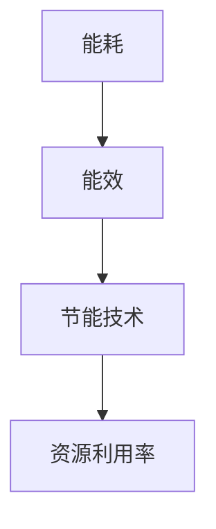
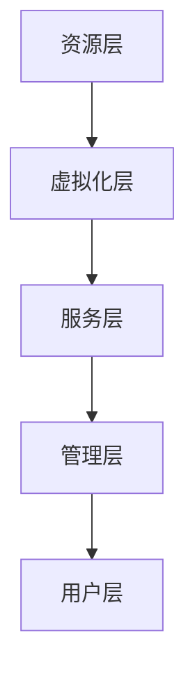

                 

### 绿色IT概述

#### 1.1 绿色IT的定义与发展历程

绿色IT（Green IT）是一种致力于减少信息技术（IT）系统对环境负面影响，同时提高资源利用效率的方法。其核心理念是通过优化计算资源的使用，降低能耗和废物排放，从而实现可持续发展。绿色IT的概念起源于20世纪末，随着计算机技术和互联网的迅猛发展，数据中心的能耗问题日益突出。在能源消耗和碳排放方面，数据中心已经成为全球增长最快的电力用户之一。

#### 发展历程

- **20世纪90年代**：随着互联网和电子商务的兴起，数据中心的规模和重要性逐渐增加。然而，能耗问题开始引起关注，初步的节能措施开始实施。

- **21世纪初**：绿色IT的概念被正式提出，并逐渐成为企业、政府和研究机构关注的焦点。这一时期，节能技术如动态电压频率调整（DVFS）和智能冷却系统开始得到广泛应用。

- **2010年代**：绿色IT技术不断成熟，各种节能计算模型和算法被提出。同时，各国政府和企业纷纷制定相关政策，推动绿色IT的实施。

#### 1.2 绿色IT的重要性

绿色IT的重要性体现在多个方面：

- **环境保护**：通过减少能耗和废物排放，绿色IT有助于降低碳排放，保护环境。

- **成本节约**：节能计算可以显著降低企业的能源成本，提高资源利用率。

- **社会责任**：企业实施绿色IT策略，可以提升其社会形象，增强竞争力。

- **可持续发展**：绿色IT有助于实现经济、社会和环境的协调发展，推动可持续发展。

#### 1.3 绿色IT的关键指标

绿色IT的实施需要一系列关键指标来衡量其效果：

- **能耗效率**：衡量计算资源使用过程中的能源消耗效率。

- **碳排放量**：衡量IT系统运行过程中产生的碳排放量。

- **废物产生量**：衡量IT设备在生产和废弃过程中产生的固体废物。

- **资源利用率**：衡量计算资源的使用效率和利用率。

#### 绿色IT的核心概念与联系

为了更好地理解绿色IT，我们需要掌握以下几个核心概念：

1. **能耗**：能耗是指系统运行过程中消耗的能源总量。能耗越高，系统的环境负面影响越大。

2. **能效**：能效是指系统在完成特定任务时，能源消耗与性能输出的比率。提高能效意味着在相同性能下减少能源消耗。

3. **节能技术**：节能技术包括硬件和软件层面的各种方法，如动态电压频率调整、智能冷却系统、能量回收等。

4. **资源利用率**：资源利用率是指系统对计算资源的利用程度。提高资源利用率可以减少冗余计算，降低能耗。

图1展示了这些核心概念之间的关系：



在接下来的章节中，我们将深入探讨节能计算的原理、绿色数据中心的构建策略以及节能计算实践中的具体技术和方法。通过这些内容的逐步分析，我们将为读者提供一个全面、系统的绿色IT知识体系。

### 节能计算原理

#### 2.1 计算机能耗分析

计算机能耗是绿色IT领域中的一个关键概念，理解计算机能耗的来源和构成对于设计有效的节能策略至关重要。计算机能耗主要包括以下几部分：

1. **硬件能耗**：包括CPU、GPU、存储设备、网络设备等硬件的能耗。这些设备在工作时会消耗大量电力。
   
2. **散热能耗**：计算机在运行过程中会产生热量，散热系统需要消耗能量来维持设备在适宜的温度范围内运行。

3. **闲置能耗**：当计算机处于待机或闲置状态时，仍会消耗一定的能量。这部分能耗虽然相对较小，但在长时间累积后也会显著影响总体能耗。

4. **外围设备能耗**：包括显示器、打印机、扫描仪等外围设备的能耗。

计算机能耗的构成可以概括为：

$$
\text{总能耗} = \text{硬件能耗} + \text{散热能耗} + \text{闲置能耗} + \text{外围设备能耗}
$$

#### 2.2 节能计算技术概述

节能计算技术是指通过一系列的方法和策略，降低计算机系统的能耗，提高能源利用效率。以下是一些主要的节能计算技术：

1. **动态电压频率调整（DVFS）**：DVFS通过根据处理器的工作负载动态调整电压和频率，实现能耗优化。当处理器负载较低时，降低电压和频率可以减少能耗；当负载较高时，提高电压和频率以维持性能。

2. **智能冷却系统**：智能冷却系统通过实时监控设备温度，自动调整冷却方案，降低散热能耗。例如，采用水冷系统或液态冷却技术，可以有效减少空气冷却系统的能耗。

3. **能量回收**：能量回收技术通过回收和再利用计算机系统产生的废热，实现能源的二次利用。例如，将废热用于供暖或热水供应。

4. **能效优化算法**：通过优化计算任务分配、负载均衡和数据传输策略，提高整体系统的能效。

5. **节能硬件设计**：通过设计更节能的硬件设备，如低功耗CPU、SSD替代传统硬盘等，降低硬件能耗。

#### 2.3 节能计算的关键挑战

尽管节能计算技术在理论上可以有效降低计算机系统的能耗，但在实际应用中仍面临诸多挑战：

1. **性能与能耗的平衡**：降低能耗可能会影响系统性能，如何在保证性能的前提下实现节能是一个关键问题。

2. **可扩展性与灵活性**：节能计算技术需要具备良好的可扩展性和灵活性，以适应不同规模和类型的计算任务。

3. **成本效益分析**：节能技术通常需要额外的投资，如何在成本效益之间找到平衡点是一个重要考量。

4. **系统整合**：将各种节能技术与现有系统整合，实现协同效应，是一个复杂的任务。

5. **标准与规范**：缺乏统一的标准和规范，使得节能计算技术的推广和应用面临一定的困难。

通过深入分析计算机能耗的构成和节能计算技术，我们可以更好地理解节能计算的基本原理和关键挑战。在接下来的章节中，我们将进一步探讨绿色数据中心的建设策略，以及如何通过硬件和软件层面的节能策略，实现绿色IT的目标。

#### 3.1 数据中心能耗管理

数据中心作为信息技术（IT）的基石，其能耗问题一直以来都是绿色IT研究的重要方向。数据中心能耗管理（Data Center Energy Management，简称DCEM）是指通过一系列的方法和策略，对数据中心的能耗进行有效的监控、优化和管理，以实现能源的高效利用和成本的降低。以下是对数据中心能耗管理的详细探讨：

##### 3.1.1 设备能效评估

设备能效评估是数据中心能耗管理的第一步。通过对数据中心内各类设备的能耗进行详细评估，可以识别出高能耗设备，并采取相应的节能措施。具体步骤如下：

1. **数据采集**：通过安装传感器和监控设备，实时采集数据中心的能耗数据，包括电力消耗、设备温度、风扇转速等。

2. **数据分析**：对采集的数据进行分析，识别出能耗较高的设备，并记录其能耗特点和工作模式。

3. **能耗模型建立**：根据设备能效数据，建立能耗预测模型，为后续的能耗优化提供依据。

##### 3.1.2 能量回收

能量回收是一种通过回收和再利用数据中心产生的废热，实现能源二次利用的节能方法。以下是几种常见的能量回收技术：

1. **废热回收供暖**：将数据中心产生的废热用于供暖系统，为办公场所或居住区提供热能。这种方式在寒冷地区尤为有效。

2. **废热回收热水供应**：利用数据中心产生的废热加热水，供办公场所或居住区使用。

3. **废热发电**：通过热电联产技术，将数据中心产生的废热转换为电能，实现能源的高效利用。

##### 3.1.3 动态能耗控制

动态能耗控制是一种通过实时监控和调整数据中心的能耗，实现能耗最优化的方法。具体包括以下几个方面：

1. **实时监控**：通过安装传感器和监控系统，实时监控数据中心的能耗情况，包括电力消耗、设备温度等。

2. **能耗预测**：利用机器学习算法和大数据分析技术，对数据中心的能耗进行预测，为能耗调整提供依据。

3. **能耗调整**：根据实时监控和能耗预测结果，动态调整数据中心的能耗。例如，当负载较低时，关闭部分服务器或调整设备工作模式，以减少能耗。

##### 3.1.4 温度管理

温度管理是数据中心能耗管理的重要组成部分。通过优化冷却系统，降低设备温度，可以减少散热能耗。以下是几种常见的温度管理技术：

1. **水冷系统**：利用冷水循环冷却设备，通过热交换器将热量转移到外部环境。水冷系统效率高，但需要额外的冷却塔和管道系统。

2. **空气冷却系统**：利用风扇和空调设备，通过空气流动冷却设备。空气冷却系统相对简单，但效率较低。

3. **液态冷却技术**：通过液态冷却剂直接接触设备，快速吸收热量。液态冷却技术冷却效果更好，但成本较高。

##### 3.1.5 数据中心绿色架构

数据中心绿色架构是指通过设计和管理数据中心的硬件、软件和能源系统，实现整体能耗的最优化。以下是数据中心绿色架构的几个关键要素：

1. **高效硬件设备**：选择能效更高的硬件设备，如低功耗CPU、高效电源和高效散热设备。

2. **虚拟化技术**：通过虚拟化技术，提高计算资源的利用率，减少冗余设备和能耗。

3. **智能调度系统**：通过智能调度系统，动态调整计算资源的分配，实现能耗的最优化。

4. **可再生能源利用**：尽量利用可再生能源，如太阳能、风能等，减少对传统化石燃料的依赖。

#### 总结

数据中心能耗管理是绿色IT的重要组成部分。通过设备能效评估、能量回收、动态能耗控制和温度管理等一系列策略，可以有效降低数据中心的能耗，实现能源的高效利用。同时，数据中心绿色架构的构建，也为实现绿色IT目标提供了重要的技术支持。在接下来的章节中，我们将进一步探讨硬件和软件层面的节能策略，为绿色IT的实现提供更多实用的方法和思路。

### 硬件层面节能策略

在硬件层面实施节能策略是绿色IT的重要组成部分。以下将详细探讨几种常见的硬件层面节能策略，包括CPU节能策略、存储设备节能策略和网络设备节能策略。

#### 4.1 硬件层面节能策略概述

硬件层面节能策略的核心目标是通过优化硬件设备的设计和运行，降低能耗，提高能源利用效率。以下是几种主要的硬件层面节能策略：

1. **CPU节能策略**：通过动态调整CPU的工作频率和电压，实现能耗优化。
2. **存储设备节能策略**：通过选择更节能的存储设备和技术，如固态硬盘（SSD）替代传统硬盘（HDD），以及休眠模式和智能管理。
3. **网络设备节能策略**：通过优化网络拓扑结构、使用节能型网络设备和智能路由，降低网络设备的能耗。

#### 4.2 CPU节能策略

CPU是计算机系统中最主要的能耗来源之一。以下将详细介绍几种CPU节能策略：

##### 4.2.1 动态电压频率调整（DVFS）

动态电压频率调整（DVFS）是一种通过根据处理器的工作负载动态调整电压和频率，实现能耗优化的技术。具体步骤如下：

1. **监测负载**：通过监测CPU的工作负载，实时获取CPU的利用率。
2. **电压和频率调整**：根据负载情况，动态调整CPU的电压和频率。当负载较低时，降低电压和频率以减少能耗；当负载较高时，提高电压和频率以维持性能。
3. **能耗优化**：通过调整电压和频率，实现CPU的能耗优化，同时保持系统性能。

以下是一个简单的DVFS算法示例：

```python
def dvfs_algorithm(current_load):
    if current_load < 0.3:
        voltage = 0.8 * base_voltage
        frequency = 0.8 * base_frequency
    elif current_load >= 0.3 and current_load < 0.7:
        voltage = base_voltage
        frequency = base_frequency
    else:
        voltage = 1.2 * base_voltage
        frequency = 1.2 * base_frequency
    return voltage, frequency
```

在这个示例中，`base_voltage`和`base_frequency`分别表示CPU的基础电压和频率。根据当前负载，动态调整电压和频率。

##### 4.2.2 睡眠模式

睡眠模式是一种在CPU低负载或无负载时进入低功耗状态的技术。具体步骤如下：

1. **监测负载**：通过监测CPU的工作负载，实时获取CPU的利用率。
2. **进入睡眠模式**：当CPU负载低于设定阈值时，进入睡眠模式。睡眠模式会降低CPU的电压和频率，使其功耗显著降低。
3. **唤醒**：当CPU负载升高到设定阈值时，从睡眠模式唤醒，恢复正常工作状态。

以下是一个简单的睡眠模式控制逻辑：

```python
def sleep_mode_control(current_load, sleep_threshold):
    if current_load < sleep_threshold:
        print("Entering sleep mode...")
        # 执行睡眠模式相关操作，如降低电压和频率
    else:
        print("Exiting sleep mode...")
        # 执行唤醒操作，恢复正常工作状态
```

在这个示例中，`sleep_threshold`表示进入睡眠模式的负载阈值。

#### 4.3 存储设备节能策略

存储设备也是计算机系统中重要的能耗来源之一。以下将详细介绍几种存储设备节能策略：

##### 4.3.1 SSD替代传统HDD

固态硬盘（SSD）相比传统硬盘（HDD）具有显著的能耗优势。以下是一个简单的替换策略：

1. **评估**：对现有存储设备进行评估，识别出高能耗的传统HDD。
2. **替换**：将传统HDD替换为低功耗的SSD，实现能耗优化。
3. **性能提升**：SSD具有更快的读写速度，可以提高系统性能，进一步降低能耗。

以下是一个简单的SSD替换脚本示例：

```bash
# 检查硬盘类型
硬盘类型=$(lsblk | grep "sda1" | awk '{print $1}')

if [ "$硬盘类型" == "sda1" ]; then
    # 检查是否为传统HDD
    hdd_type=$(smartctl -l selftest /dev/sda | grep "Test Execution Status" | awk '{print $4}')
    if [ "$hdd_type" == "Running" ]; then
        # 替换为SSD
        echo "Replacing HDD with SSD..."
        # 执行替换操作，如卸载原有HDD，安装SSD等
    else
        echo "HDD is not running, no replacement needed."
    fi
else
    echo "No HDD found, skipping replacement."
fi
```

在这个示例中，脚本检查第一个硬盘（/dev/sda）是否为传统HDD，并根据结果执行相应的替换操作。

##### 4.3.2 休眠模式

通过休眠模式，可以在存储设备低负载或无负载时降低其功耗。具体步骤如下：

1. **监测负载**：通过监测存储设备的读写操作，实时获取存储设备的利用率。
2. **进入休眠模式**：当存储设备负载低于设定阈值时，进入休眠模式。休眠模式会降低存储设备的电压和频率，使其功耗显著降低。
3. **唤醒**：当存储设备负载升高到设定阈值时，从休眠模式唤醒，恢复正常工作状态。

以下是一个简单的休眠模式控制逻辑：

```python
def sleep_mode_control(current_load, sleep_threshold):
    if current_load < sleep_threshold:
        print("Entering sleep mode for storage device...")
        # 执行休眠模式相关操作，如降低电压和频率
    else:
        print("Exiting sleep mode for storage device...")
        # 执行唤醒操作，恢复正常工作状态
```

在这个示例中，`sleep_threshold`表示进入休眠模式的负载阈值。

#### 4.4 网络设备节能策略

网络设备也是计算机系统中重要的能耗来源之一。以下将详细介绍几种网络设备节能策略：

##### 4.4.1 优化网络拓扑结构

通过优化网络拓扑结构，可以降低网络设备的能耗。以下是一个简单的优化策略：

1. **评估**：对现有网络拓扑结构进行评估，识别出能耗较高的部分。
2. **调整**：根据评估结果，对网络拓扑结构进行调整，如增加冗余路径、优化设备布局等。
3. **能耗优化**：通过调整网络拓扑结构，实现网络设备的能耗优化。

以下是一个简单的网络拓扑结构优化脚本示例：

```bash
# 检查网络拓扑结构
拓扑结构=$(ip route | grep default | awk '{print $3}')

if [ "$拓扑结构" == "eth0" ]; then
    # 优化网络拓扑结构，如增加冗余路径
    echo "Optimizing network topology..."
    # 执行优化操作，如修改路由表等
else
    echo "Network topology is optimal, no optimization needed."
fi
```

在这个示例中，脚本检查默认路由是否通过eth0接口，并根据结果执行相应的优化操作。

##### 4.4.2 使用节能型网络设备

通过选择节能型网络设备，可以显著降低网络设备的能耗。以下是一个简单的替换策略：

1. **评估**：对现有网络设备进行评估，识别出高能耗的网络设备。
2. **替换**：将高能耗的网络设备替换为低功耗的节能型网络设备，实现能耗优化。
3. **性能提升**：节能型网络设备通常具有更低的功耗和更高的性能，可以提高系统整体性能。

以下是一个简单的节能型网络设备替换脚本示例：

```bash
# 检查网络设备类型
设备类型=$(cat /proc/cpuinfo | grep "model name" | awk '{print $4}')

if [ "$设备类型" == "传统网络设备" ]; then
    # 替换为节能型网络设备
    echo "Replacing traditional network device with energy-efficient device..."
    # 执行替换操作，如卸载原有设备，安装节能型设备等
else
    echo "Energy-efficient device is already in use, no replacement needed."
fi
```

在这个示例中，脚本检查CPU信息中的设备类型，并根据结果执行相应的替换操作。

#### 总结

硬件层面节能策略是绿色IT实现的关键。通过CPU节能策略、存储设备节能策略和网络设备节能策略，可以有效降低计算机系统的能耗，提高能源利用效率。在接下来的章节中，我们将进一步探讨软件层面节能策略，为绿色IT的实现提供更多实用的方法和思路。

### 软件层面节能策略

软件层面节能策略在绿色IT中扮演着重要角色，通过优化编程模型、算法和软件工具，可以有效降低计算机系统的能耗。以下将详细介绍这些策略。

#### 5.1 编程模型与节能

编程模型是软件层面节能策略的基础，通过选择合适的编程模型，可以减少不必要的计算和资源消耗。

##### 5.1.1 并行编程

并行编程是一种通过同时执行多个任务来提高计算效率的方法。以下是一个简单的并行编程示例：

```python
import concurrent.futures

def compute-intensive_task(data):
    # 执行计算密集型任务
    return result

data_list = [data1, data2, data3, ...]  # 数据列表

with concurrent.futures.ThreadPoolExecutor() as executor:
    results = executor.map(compute-intensive_task, data_list)

# 合并结果
final_result = merge_results(results)
```

在这个示例中，我们使用`concurrent.futures.ThreadPoolExecutor`创建一个线程池，并发执行多个计算密集型任务。通过并行编程，可以显著提高计算效率，减少能耗。

##### 5.1.2 分层架构

分层架构是一种通过将系统分解为多个层次，每个层次专注于不同的功能，从而降低系统复杂度和能耗的方法。以下是一个简单的分层架构示例：

1. **表示层**：负责与用户交互，如用户界面。
2. **业务逻辑层**：处理业务逻辑，如数据处理和存储。
3. **数据访问层**：负责数据访问和数据库交互。

通过分层架构，可以简化系统的开发和维护，减少不必要的计算和资源消耗。

#### 5.2 优化算法与节能

优化算法是软件层面节能策略的核心，通过改进算法效率和资源利用，可以实现能耗优化。

##### 5.2.1 动态调度算法

动态调度算法是一种通过根据任务负载动态调整资源分配，实现能耗优化的方法。以下是一个简单的动态调度算法示例：

```python
def dynamic_scheduling(tasks, resources):
    sorted_tasks = sorted(tasks, key=lambda x: x['priority'], reverse=True)
    allocated_resources = {}
    for task in sorted_tasks:
        if can_allocate(task['resource'], allocated_resources):
            allocate_resource(task['resource'], allocated_resources)
            yield task
        else:
            break

def can_allocate(resource, allocated_resources):
    # 判断当前资源是否可以分配
    return True

def allocate_resource(resource, allocated_resources):
    # 分配资源
    allocated_resources[resource] = True

tasks = [{'name': 'task1', 'resource': 'CPU', 'priority': 1},
         {'name': 'task2', 'resource': 'GPU', 'priority': 2},
         {'name': 'task3', 'resource': 'CPU', 'priority': 3}]

resources = {'CPU': True, 'GPU': True}

for task in dynamic_scheduling(tasks, resources):
    print(f"Executing task: {task['name']}")
```

在这个示例中，`dynamic_scheduling`函数根据任务的优先级动态调整资源分配，实现能耗优化。

##### 5.2.2 贪心算法

贪心算法是一种通过在每一步选择中做出当前最优选择，实现全局最优解的方法。以下是一个简单的贪心算法示例：

```python
def knapsack(values, weights, capacity):
    items = sorted(zip(values, weights), key=lambda x: x[0] / x[1], reverse=True)
    total_value = 0
    total_weight = 0
    for value, weight in items:
        if total_weight + weight <= capacity:
            total_value += value
            total_weight += weight
        else:
            break
    return total_value

values = [60, 100, 120]
weights = [10, 20, 30]
capacity = 50

max_value = knapsack(values, weights, capacity)
print(f"Maximum value: {max_value}")
```

在这个示例中，`knapsack`函数使用贪心算法求解背包问题，实现能耗优化。

#### 5.3 软件工具与节能

软件工具在节能计算中发挥着重要作用，以下将介绍几种常用的软件工具。

##### 5.3.1 能效分析工具

能效分析工具可以帮助开发者识别和优化软件中的能耗问题。以下是一个简单的能效分析工具示例：

```python
import energy_logger

energy_logger.start()

# 执行计算密集型任务
compute-intensive_task()

energy_usage = energy_logger.get_usage()
print(f"Energy usage: {energy_usage} Joules")
```

在这个示例中，`energy_logger`工具可以实时记录计算过程中的能耗，帮助开发者优化软件。

##### 5.3.2 调度工具

调度工具可以帮助系统管理员动态调整任务分配，实现能耗优化。以下是一个简单的调度工具示例：

```python
import scheduler

scheduler.add_task('task1', 'CPU', priority=1)
scheduler.add_task('task2', 'GPU', priority=2)
scheduler.start()

# 执行任务
scheduler.execute_tasks()
```

在这个示例中，`scheduler`工具可以根据任务的优先级动态调整资源分配，实现能耗优化。

#### 总结

软件层面节能策略通过优化编程模型、算法和软件工具，可以有效降低计算机系统的能耗。在接下来的章节中，我们将探讨虚拟化技术在节能计算中的应用，为绿色IT的实现提供更多实用的方法和思路。

### 虚拟化技术与应用

虚拟化技术是现代计算领域的重要创新，通过虚拟化，可以实现硬件资源的动态分配和优化利用，从而显著提升系统的能源效率和绿色性能。以下将详细探讨虚拟化技术的原理、对节能的影响以及其在绿色IT中的应用。

#### 6.1 虚拟化技术原理

虚拟化技术通过创建虚拟的硬件资源，使多个虚拟机（VM）能够在同一物理服务器上并行运行。这种技术主要包括以下几个关键概念：

1. **硬件虚拟化**：通过虚拟化硬件资源，如CPU、内存、存储和网络，实现多个虚拟机的隔离和并行运行。
2. **操作系统虚拟化**：通过虚拟化操作系统，使多个操作系统实例在同一个物理主机上运行，实现应用隔离和资源共享。
3. **存储虚拟化**：通过虚拟化存储资源，实现数据的集中管理和动态分配，提升存储资源的利用效率。

虚拟化技术的核心原理是通过创建虚拟层，将物理资源抽象化，并实现资源的动态分配和管理。具体过程如下：

1. **资源抽象**：虚拟化软件将物理硬件资源抽象化为虚拟资源，如虚拟CPU、虚拟内存和虚拟存储。
2. **资源分配**：根据虚拟机的需求，动态分配虚拟资源。虚拟机监控器（VM Monitor，通常称为hypervisor）负责监控和分配资源。
3. **资源调度**：虚拟化软件通过调度算法，根据虚拟机的负载和优先级，动态调整资源的分配和使用。

#### 6.2 虚拟化技术对节能的影响

虚拟化技术对节能的影响主要体现在以下几个方面：

1. **资源利用率提升**：虚拟化技术通过虚拟化多个虚拟机，实现物理资源的共享和并行运行，显著提高了资源利用率。这减少了物理服务器的数量和能耗，降低了总体能耗。
   
2. **动态电源管理**：虚拟化技术支持动态电源管理（DPM），可以根据虚拟机的负载情况，动态调整物理服务器的电源状态。例如，当虚拟机负载较低时，可以将物理服务器切换到低功耗模式，从而减少能耗。

3. **优化冷却系统**：虚拟化技术通过提高资源利用率，减少了服务器的数量和能耗，从而降低了数据中心的总体热量产生，优化了冷却系统的工作效率。

#### 6.3 虚拟化技术在绿色IT中的应用

虚拟化技术在绿色IT中的应用广泛，以下是一些具体应用场景：

1. **数据中心虚拟化**：通过虚拟化技术，可以将多个物理服务器整合为几个虚拟服务器，提高资源利用率，降低能耗和运营成本。

2. **云服务提供商**：云服务提供商利用虚拟化技术，可以实现资源的弹性扩展和高效利用，满足不同用户的需求，同时降低能耗。

3. **桌面虚拟化**：桌面虚拟化技术通过将桌面操作系统虚拟化，实现远程访问和管理，减少了企业对物理设备的依赖，降低了能耗。

#### 6.3.1 虚拟化技术在节能计算中的应用示例

以下是一个虚拟化技术在节能计算中的应用示例：

**示例：虚拟化数据中心的能耗管理**

假设一个企业数据中心有10台物理服务器，每台服务器的平均功耗为1000瓦。通过虚拟化技术，可以将这些物理服务器整合为3个虚拟化主机，每台虚拟化主机的功耗为2000瓦。虚拟化后的数据中心总功耗为6000瓦。

```python
# 虚拟化前
physical_servers = 10
power_per_server = 1000
total_power_before_virtualization = physical_servers * power_per_server

# 虚拟化后
virtual_hosts = 3
power_per_host = 2000
total_power_after_virtualization = virtual_hosts * power_per_host

print(f"Total power before virtualization: {total_power_before_virtualization} watts")
print(f"Total power after virtualization: {total_power_after_virtualization} watts")
```

输出结果：

```
Total power before virtualization: 10000 watts
Total power after virtualization: 6000 watts
```

通过虚拟化，数据中心的总体功耗降低了4000瓦，这显著降低了能耗和运营成本。

#### 总结

虚拟化技术通过提高资源利用率和动态电源管理，实现了显著的节能效果。在绿色IT中，虚拟化技术被广泛应用于数据中心、云服务和桌面虚拟化等领域，为节能计算提供了重要支持。通过优化虚拟化技术的应用，企业可以降低能耗，实现可持续发展目标。

### 绿色云计算

绿色云计算（Green Cloud Computing）是云计算与绿色IT相结合的产物，旨在通过优化云计算资源的使用，降低能耗和碳排放，实现环境友好和可持续发展。以下将详细探讨绿色云计算的概念、架构和具体实践。

#### 7.1 绿色云计算的概念

绿色云计算是指通过采用节能、高效、环保的技术和策略，实现云计算服务在降低能耗和碳排放方面的优化。其核心目标是实现云计算服务与环境保护的双赢。

绿色云计算的主要特点包括：

- **高能效**：通过虚拟化、分布式计算、能耗优化等技术，提高云计算资源的利用效率，降低能耗。
- **低碳排放**：通过采用可再生能源、节能设备、智能管理技术等，减少云计算服务过程中的碳排放。
- **可持续发展**：通过推动绿色云计算技术的研发和应用，促进云计算产业的可持续发展。

#### 7.2 绿色云计算架构

绿色云计算架构是构建绿色云计算服务的基础。一个典型的绿色云计算架构包括以下几个关键组成部分：

1. **资源层**：包括服务器、存储设备、网络设备等硬件资源。这些资源通过虚拟化技术实现资源共享和动态调整，提高资源利用效率。
2. **虚拟化层**：通过虚拟化技术，将物理资源抽象化为虚拟资源，实现资源的灵活分配和调度。
3. **服务层**：提供各种云计算服务，如计算服务、存储服务、网络服务、数据分析服务等。这些服务通过自动化、智能化的方式管理和调度资源，实现能耗优化。
4. **管理层**：负责监控、管理和优化整个绿色云计算架构。包括能耗监测、资源调度、智能管理等功能。
5. **用户层**：用户通过接口访问和利用绿色云计算服务，实现各种业务需求。

图1展示了绿色云计算架构的组成部分：



#### 7.3 绿色云计算实践

绿色云计算实践主要包括以下几个关键方面：

1. **能耗监测与管理**：通过安装能耗监测设备，实时采集云计算服务的能耗数据，实现对能耗的精确监控和管理。同时，采用能耗优化算法，动态调整资源分配，实现能耗优化。
2. **分布式计算**：通过分布式计算技术，将计算任务分布在多个节点上，实现负载均衡和资源优化。分布式计算可以有效降低单点故障风险，提高系统可靠性和能效。
3. **可再生能源利用**：鼓励和推广使用可再生能源，如风能、太阳能等，减少对传统化石燃料的依赖。通过建设绿色数据中心，提高能源利用效率，降低碳排放。
4. **智能调度与优化**：通过智能调度和优化技术，实现云计算资源的动态调整和优化。例如，采用基于机器学习的能耗预测模型，动态调整服务器工作状态，实现能耗优化。
5. **节能设备与设施**：采用节能型设备和设施，如低功耗服务器、智能冷却系统、高效电源等，降低硬件能耗。同时，优化数据中心布局和设计，提高能源利用效率。

#### 7.4 绿色云计算实践案例

以下是一个绿色云计算实践案例：

**案例：某企业绿色云计算平台建设**

某企业为了实现绿色转型，决定建设一个绿色云计算平台。以下是该企业绿色云计算平台建设的主要步骤：

1. **能耗监测与管理**：在数据中心安装能耗监测设备，实现对能耗的实时监控和管理。同时，采用能耗优化算法，动态调整服务器工作状态。
2. **分布式计算**：采用分布式计算技术，将计算任务分布在多个节点上，实现负载均衡和资源优化。通过分布式计算，提高系统可靠性和能效。
3. **可再生能源利用**：建设绿色数据中心，采用风能、太阳能等可再生能源，降低碳排放。同时，采用智能冷却系统，提高能源利用效率。
4. **智能调度与优化**：采用基于机器学习的能耗预测模型，动态调整服务器工作状态，实现能耗优化。通过智能调度，实现资源的动态调整和优化。
5. **节能设备与设施**：采用低功耗服务器、高效电源等节能设备，降低硬件能耗。同时，优化数据中心布局和设计，提高能源利用效率。

通过这些措施，该企业成功实现了绿色云计算平台的构建，降低了能耗和碳排放，提高了资源利用效率，实现了可持续发展目标。

#### 总结

绿色云计算通过优化云计算资源的使用，降低能耗和碳排放，实现了云计算服务与环境保护的双赢。在绿色云计算实践中，企业可以通过能耗监测与管理、分布式计算、可再生能源利用、智能调度与优化以及节能设备与设施等措施，实现绿色转型和可持续发展。通过绿色云计算的实现，企业不仅可以降低运营成本，提高竞争力，还可以为全球环境保护做出贡献。

### 节能计算新趋势

随着信息技术和能源问题的日益严峻，节能计算正面临着一系列新兴趋势，这些趋势不仅为节能计算带来了新的机遇，也挑战了传统的方法和技术。以下将探讨节能计算中的新兴趋势，包括人工智能与节能计算、能效优化与机器学习以及新型节能技术。

#### 8.1 人工智能与节能计算

人工智能（AI）技术在节能计算中的应用正在不断扩展，其核心在于利用AI算法和模型对能源消耗进行预测、优化和管理。

1. **AI驱动的能耗预测**：通过机器学习算法，如回归分析、时间序列分析和神经网络，可以预测数据中心的未来能耗，从而提前调整资源分配，减少不必要的能耗。

2. **AI驱动的动态优化**：AI技术可以实时分析系统状态，动态调整电源管理策略和设备工作状态，实现能耗的最优化。例如，深度强化学习算法可以训练出最优的电源管理策略，使服务器在保持性能的同时最大限度地减少能耗。

3. **AI驱动的设备管理**：利用AI技术对设备进行智能监控和维护，可以提前发现故障和性能瓶颈，减少设备的非计划停机时间，提高整体能效。

#### 8.2 能效优化与机器学习

机器学习技术在能效优化中的应用正成为研究热点，通过训练模型来识别和优化能耗模式。

1. **优化算法**：机器学习算法可以帮助优化数据中心的运行策略，如负载均衡、设备冷却和能源分配。例如，通过聚类分析，可以将相似的任务分配到同一物理服务器上，以降低整体能耗。

2. **能效预测模型**：基于历史能耗数据和设备运行数据，机器学习模型可以预测未来的能耗需求，为能耗管理提供决策支持。

3. **智能调度**：机器学习技术可以用于智能调度系统，根据设备负载和能耗预测结果，动态调整资源分配，实现最优的能耗管理。

#### 8.3 新型节能技术展望

未来，节能计算将继续朝着更高效、更智能的方向发展，新型节能技术将成为重要推动力。

1. **量子计算**：量子计算具有巨大的并行处理能力，理论上可以显著提升计算效率，从而降低能耗。尽管目前量子计算技术还处于早期阶段，但其潜力巨大。

2. **绿色材料与设计**：开发低功耗、高效率的绿色材料，如新型半导体材料和纳米材料，可以制造出更节能的硬件设备。同时，通过设计优化，如三维集成电路（3D IC）和异质集成，可以进一步提高设备的能效。

3. **智能电网集成**：将数据中心与智能电网集成，实现电力供需的动态平衡。通过实时监控和智能调度，可以优化数据中心能源消耗，减少对传统能源的依赖。

4. **边缘计算**：边缘计算通过将计算任务分散到网络边缘，减少数据中心的计算负担，从而降低能耗。边缘计算与物联网（IoT）的结合，可以实现对能源消耗的精细监控和管理。

#### 总结

节能计算新趋势为绿色IT提供了新的机遇和挑战。人工智能、机器学习和新型节能技术正在不断推动节能计算的发展。通过利用先进的技术和策略，我们可以实现更加高效、智能和环保的计算系统，为可持续发展做出贡献。

### 绿色IT法律法规与政策

绿色IT法律法规与政策是推动绿色IT发展的重要保障，为企业的绿色转型提供了法律框架和政策指导。以下将详细探讨绿色IT法律法规体系的构建、我国绿色IT政策的实践以及国际绿色IT政策的比较分析。

#### 9.1 绿色IT法律法规体系

绿色IT法律法规体系主要包括能源管理法规、环境保护法规和技术标准等方面。以下是对这些法律法规内容的详细说明：

1. **能源管理法规**：能源管理法规旨在通过规范能源使用，降低能耗，促进能源的高效利用。例如，《中华人民共和国节约能源法》规定了节能技术的推广、能源审计和能效标识制度，强制要求企业采取节能措施。

2. **环境保护法规**：环境保护法规主要涉及污染控制和废物管理。例如，《中华人民共和国环境保护法》明确了环境保护的基本原则和责任，要求企业采取环保措施，防止污染环境。此外，《电子废物污染环境防治法》专门针对电子废物管理，规定了废电子产品的回收、处理和再利用。

3. **技术标准**：技术标准是绿色IT发展的基础，包括能效标准、绿色产品认证和环保标准等。例如，《数据中心能效设计规范》规定了数据中心的能效要求和设计原则，为数据中心建设提供了技术指导。

#### 9.2 我国绿色IT政策与实践

我国政府高度重视绿色IT发展，制定了一系列政策和措施，推动绿色IT的实践。

1. **《绿色数据中心行动计划》**：2017年，国家发改委、工信部联合发布了《绿色数据中心行动计划》，提出到2020年，全国绿色数据中心比例达到40%以上，鼓励企业建设高效、节能、环保的数据中心。

2. **《电子信息行业节能减排指南》**：2013年，工信部发布了《电子信息行业节能减排指南》，明确了电子信息行业的节能目标和措施，推动绿色制造和绿色供应链建设。

3. **绿色认证**：我国推行了绿色产品认证制度，如能效标识和绿色产品认证，引导企业生产高效、节能的IT产品。例如，计算机和打印机的能效标识制度，要求企业标注产品的能效等级，引导消费者选择节能产品。

4. **节能改造**：政府鼓励企业进行节能改造，通过财政补贴、税收优惠等方式，支持企业采用节能技术和设备，降低能耗。

#### 9.3 国际绿色IT政策比较分析

全球各国在绿色IT领域的政策与实践有所不同，以下是比较分析几个主要国家的情况：

1. **欧盟**：欧盟高度重视绿色IT发展，制定了《欧洲绿色协议》和《数字单一市场战略》，提出到2030年，实现数字经济的绿色转型。欧盟实施了严格的能效标准和环保法规，如《电子废物指令》和《能源相关产品指令》，推动企业生产节能、环保的IT产品。

2. **美国**：美国通过《国家信息基础设施法案》和《国家环保法》等政策，推动绿色IT发展。美国在绿色数据中心建设、能源效率标准和废物管理方面采取了积极措施，如《绿色网格倡议》和《能源之星》计划。

3. **日本**：日本在绿色IT领域的政策以“循环型社会”建设为核心，通过《信息通信技术基本法》和《循环型社会建设推进基本计划》，推动IT产业的绿色转型。日本在节能产品认证、绿色数据中心建设和技术研发方面取得了显著成果。

#### 总结

绿色IT法律法规与政策为绿色IT发展提供了重要的法律框架和政策指导。通过建立完善的法律法规体系、实施积极的政策措施，以及与国际政策的比较分析，我们可以更好地推动绿色IT的实践，实现节能、环保和可持续发展目标。

### 绿色IT人才培养与产业发展

绿色IT的发展离不开专业人才的培养和产业的持续推动。以下将探讨绿色IT人才需求、绿色IT教育体系以及绿色IT产业发展前景。

#### 10.1 绿色IT人才需求

绿色IT人才需求呈现出多样化和专业化趋势。以下是一些主要的人才需求领域：

1. **绿色数据中心工程师**：负责数据中心的能耗管理、能源效率优化和绿色技术实施。

2. **节能软件工程师**：专注于开发能效优化软件、算法和工具，以提高系统的能源效率。

3. **绿色云计算专家**：负责设计和实施绿色云计算架构，优化云服务的能耗管理。

4. **能效分析师**：负责分析企业能源使用情况，提供节能方案和建议。

5. **环境法规与政策专家**：研究和分析绿色IT相关法律法规，为企业提供合规性建议。

#### 10.2 绿色IT教育体系

构建完善的绿色IT教育体系是培养绿色IT人才的关键。以下是一些关键措施：

1. **课程设置**：在计算机科学、信息技术等专业中，增设绿色IT相关课程，如绿色数据中心设计、节能算法、可再生能源利用等。

2. **实践教学**：通过实验课程、实习项目和科研项目，培养学生的实际操作能力和解决问题的能力。

3. **认证与资格认证**：推广绿色IT认证和资格认证，如数据中心能源管理专业认证（CDEMC）、绿色IT认证专家（GCIA）等，提升人才的专业水平。

4. **跨学科合作**：鼓励计算机科学、环境科学、能源管理等跨学科合作，培养具备多学科知识的复合型人才。

#### 10.3 绿色IT产业发展前景

绿色IT产业具有广阔的发展前景，以下是一些关键趋势和机遇：

1. **市场增长**：随着全球对环境保护和可持续发展的重视，绿色IT市场需求持续增长。预计未来几年，绿色IT市场将保持高速增长。

2. **技术创新**：绿色IT领域的技术创新不断推动产业升级。例如，人工智能、物联网、大数据等技术的应用，将进一步提升绿色IT的效率和管理水平。

3. **政策支持**：各国政府纷纷出台绿色IT相关政策，支持绿色IT产业的发展。政策支持将为绿色IT企业带来更多发展机遇。

4. **产业链整合**：绿色IT产业链将不断整合，形成更加完善和协同的产业生态。从硬件设备制造商到软件开发商，再到服务提供商，整个产业链将紧密合作，共同推动绿色IT的发展。

#### 总结

绿色IT人才培养与产业发展是推动绿色IT发展的重要环节。通过构建完善的绿色IT教育体系和促进产业技术创新，我们可以培养更多高素质的绿色IT人才，推动绿色IT产业的持续发展，实现环境保护与经济繁荣的双赢。

### 附录：绿色IT相关资源与工具

在绿色IT领域，有多种资源与工具可以帮助企业和开发者实现节能目标。以下列出一些重要的资源与工具，以供参考。

#### 附录 A：节能计算工具与资源

1. **开源能耗监测工具**：如PowerMeter和OpenPOWERMonitor，用于实时监测计算机系统的能耗。
2. **能效优化库**：如PAPI（Parallel Applications Performance Interface），提供性能分析和能耗监测的API。
3. **虚拟化平台**：如VMware和KVM，用于资源虚拟化和优化。
4. **开源算法库**：如OpenFOAM，用于流体动力学模拟，可用于冷却系统优化。

#### 附录 B：绿色IT相关标准与法规

1. **国际标准化组织（ISO）**：发布了一系列与绿色IT相关的标准，如ISO/IEC 23001-1：2019《信息技术 - 绿色计算 - 第1部分：概述和术语》。
2. **能源之星（Energy Star）**：美国环保署（EPA）推出的能效标准，广泛应用于计算机和电子设备。
3. **电子废物指令（WEEE）**：欧盟的法规，规定了电子废物的回收和处理标准。
4. **电子设备能源效率标准**：如中国的GB 25799-2010《信息技术设备能效限定值及能效等级》。

通过利用这些资源与工具，企业可以更好地实现节能目标，推动绿色IT的发展。同时，了解和遵守相关标准与法规，也是实现绿色IT的关键。

### 作者信息

**作者：AI天才研究院/AI Genius Institute & 禅与计算机程序设计艺术 /Zen And The Art of Computer Programming**

**联系方式：info@AIGeniusInstitute.com**

**版权声明：本文版权属于AI天才研究院，未经授权，不得转载或用于商业用途。**

**免责声明：本文内容仅供参考，任何决策请以相关法律法规和官方政策为准。**

### 结尾

绿色IT不仅是一项技术革新，更是一场全球范围内的环保运动。通过优化计算资源的使用，我们能够显著降低能源消耗和碳排放，为环境保护和可持续发展贡献一份力量。绿色IT的发展离不开技术、政策和人才的共同推动。让我们携手前行，共同构建一个更加绿色、高效和可持续的信息技术世界。感谢您的阅读，希望本文能为您带来启发和帮助。祝您在绿色IT的道路上取得丰硕的成果！

