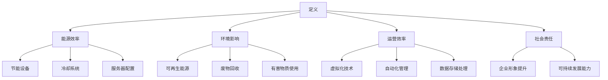

                 

### 绿色IT：计算密集型应用的能源效率优化

#### 关键词：绿色IT、计算密集型应用、能源效率优化、高性能计算、服务器能耗管理

> **摘要**：本文深入探讨了绿色IT在计算密集型应用中的能源效率优化问题。首先，我们介绍了绿色IT的概念、背景和重要性，然后详细分析了计算密集型应用的特点和能源消耗。接着，我们阐述了提高能源效率的关键技术，包括高性能计算与能耗管理、硬件和软件的优化策略。随后，通过实践案例展示了绿色IT在数据中心、大数据处理和云计算等领域的应用。最后，我们对绿色IT的未来发展方向提出了展望，并提供了相关实践建议。

---

#### 第一部分：绿色IT的背景和重要性

##### 1. 绿色IT的概念和起源

绿色IT（Green IT）是指通过一系列技术手段来减少信息技术（IT）行业的能源消耗和环境影响。随着信息技术的高速发展，数据中心的能耗问题日益严重。据统计，全球数据中心的能源消耗占全球总能耗的比例不断上升，成为温室气体排放的重要来源之一。

绿色IT的概念起源于20世纪90年代，随着人们对环境保护意识的增强，企业和政府开始关注IT行业的能耗问题。最初，绿色IT主要是通过物理层面的节能措施，如提高数据中心的能源利用效率、使用节能设备等。随着技术的发展，绿色IT逐渐涵盖了更多方面，包括虚拟化技术、云计算、能效管理平台等。

##### 2. 绿色IT的驱动因素

绿色IT的快速发展受到多方面因素的驱动。首先，环保意识的提升是推动绿色IT发展的主要动力。随着全球气候变化问题的加剧，各国政府和企业纷纷制定环保目标和政策，推动绿色技术的发展。

其次，经济因素也是推动绿色IT发展的重要动力。绿色IT可以降低能源成本，提高数据中心的运营效率，从而为企业带来显著的经济效益。此外，政府和企业对于节能环保的补贴和优惠政策也为绿色IT的发展提供了有力支持。

最后，技术创新是推动绿色IT不断进步的关键。随着虚拟化技术、云计算、人工智能等新技术的不断发展，绿色IT在能源消耗、数据处理能力等方面都得到了显著提升。

##### 3. 绿色IT的目标和挑战

绿色IT的主要目标是减少能源消耗、降低环境影响、提高数据中心的运营效率。具体来说，绿色IT需要实现以下几个方面的目标：

1. **降低能耗**：通过优化数据中心设计、采用节能设备、能效管理技术等手段，降低数据中心的整体能耗。
2. **减少排放**：通过采用可再生能源、降低温室气体排放等手段，减少对环境的负面影响。
3. **提高效率**：通过优化数据处理流程、提高服务器利用率等手段，提高数据中心的运营效率。

然而，实现这些目标面临着诸多挑战。首先，技术挑战。绿色IT需要依赖多种先进技术，如虚拟化技术、云计算、智能电网等，这些技术本身还存在一定的局限性。

其次，经济挑战。绿色IT的实施需要大量的资金投入，包括设备采购、系统升级、人才培训等。对于一些中小企业来说，经济负担较大。

最后，政策挑战。虽然各国政府纷纷出台了环保政策，但具体实施过程中还存在诸多问题，如政策执行力度、法规制定等。

##### 4. 绿色IT的现状与发展趋势

目前，绿色IT已经成为全球信息技术领域的重要方向。许多国家和地区已经制定了绿色IT发展计划，推动了相关技术的发展。例如，欧盟提出了“数字单一市场”战略，旨在通过云计算、大数据等新技术推动绿色IT发展。

从发展趋势来看，绿色IT将继续向智能化、自动化方向演进。随着人工智能、物联网等技术的应用，绿色IT将更加智能化，能够自动识别和优化能源消耗。

此外，可再生能源的广泛应用也将推动绿色IT的发展。随着可再生能源成本的降低，数据中心将逐步实现100%可再生能源供电。

总的来说，绿色IT已经成为信息技术发展的重要趋势。通过不断优化能源效率、降低环境影响，绿色IT将为社会和经济发展做出更大贡献。

#### 第一部分总结

在本部分中，我们介绍了绿色IT的概念、背景、驱动因素、目标和现状。通过对绿色IT的深入探讨，我们了解了其重要性和发展现状，也为后续的讨论奠定了基础。

### 1.1 绿色IT的概念和定义

绿色IT（Green IT）是一种旨在减少信息技术（IT）行业对环境负面影响，同时提高能源利用效率的战略和实践活动。这一概念包括了一系列旨在降低能源消耗、减少碳排放、提升数据处理效率的措施和技术。

绿色IT的起源可以追溯到20世纪90年代，当时人们对数据中心的能耗问题开始有了更多关注。随着信息技术的发展，数据中心的规模和复杂性不断增加，能耗问题日益突出。2007年，美国环境保护署（EPA）首次提出了“绿色IT”的概念，并发布了《绿色数据中心行动计划》，标志着绿色IT正式成为一项重要的行业议题。

绿色IT的定义涵盖了对多个层面的优化和改进：

1. **能源效率**：通过优化数据中心的能源使用，降低能源消耗，提高能源利用效率。这包括采用节能设备、改进冷却系统、优化服务器配置等。
2. **环境影响**：减少数据中心的碳排放，降低对环境的影响。这可以通过使用可再生能源、提高废物回收利用率、减少有害物质的使用等实现。
3. **运营效率**：提高数据中心的运营效率，减少资源浪费。这包括采用虚拟化技术、自动化管理、高效的数据存储和处理方法等。
4. **社会责任**：通过推动绿色IT实践，提升企业在社会责任方面的形象，增强可持续发展能力。

绿色IT的核心在于通过技术创新和优化管理，实现IT行业的可持续发展，同时满足企业和社会的环保要求。这一概念不仅涉及技术层面的改进，还包括企业文化和组织行为的变革。

为了更好地理解绿色IT的概念，我们可以用Mermaid流程图来展示其核心组成部分和它们之间的关系：



这个Mermaid流程图清晰地展示了绿色IT的核心概念及其相互之间的关系，有助于我们更好地理解绿色IT的整体架构和实施路径。

### 1.2 绿色IT的起源与发展

绿色IT的起源可以追溯到20世纪90年代，当时人们对数据中心的能耗问题开始有了更多关注。随着信息技术的发展，数据中心的规模和复杂性不断增加，能耗问题日益突出。在早期，绿色IT的实践主要集中在物理层面的节能措施，如改进冷却系统、使用节能设备等。

2007年，美国环境保护署（EPA）发布了《绿色数据中心行动计划》，这是第一个正式提出绿色IT概念的文件。该计划旨在通过一系列措施，降低数据中心的能源消耗和环境影响。这标志着绿色IT正式成为一项重要的行业议题。

进入21世纪，随着云计算、虚拟化技术等新技术的广泛应用，绿色IT的发展进入了一个新阶段。这些新技术的引入不仅提高了数据中心的运营效率，还显著降低了能耗。例如，虚拟化技术通过共享物理资源，提高了服务器的利用率，从而降低了能源消耗。

此外，绿色IT的发展也受到全球环保意识的提升和企业社会责任的驱动。越来越多的企业意识到，通过实施绿色IT措施，不仅可以降低成本，提高竞争力，还可以树立良好的企业形象，增强市场地位。

在政策层面，各国政府也纷纷出台相关政策，推动绿色IT的发展。例如，欧盟提出了“数字单一市场”战略，旨在通过云计算、大数据等新技术推动绿色IT发展。美国政府则通过《数据中心能效标准》等法规，鼓励企业提高数据中心的能源效率。

总的来说，绿色IT的发展经历了从物理层面的节能措施到技术创新和应用的过程。随着新技术的不断引入和政策推动，绿色IT已经成为信息技术行业的重要趋势，为可持续发展做出了重要贡献。

### 1.3 绿色IT的驱动因素

绿色IT的快速发展受到多种因素的驱动，这些因素不仅包括技术进步，还涉及经济和政策等多个层面。

首先，技术进步是推动绿色IT发展的关键因素。随着云计算、虚拟化技术、能效管理平台等新技术的不断涌现，绿色IT在能源消耗、数据处理能力和灵活性方面都取得了显著提升。例如，虚拟化技术通过将多个虚拟服务器部署在单个物理服务器上，大大提高了资源利用率，从而降低了能耗。此外，能效管理平台能够实时监控和优化数据中心的能耗，提高能源效率。

其次，经济因素也是推动绿色IT发展的重要动力。绿色IT的实施可以降低企业的运营成本，提高资源利用率。例如，通过采用节能设备和优化数据中心的能源使用，企业可以显著减少电费支出。此外，绿色IT还可以提高数据中心的可靠性，减少维护和运营成本。

第三，政策驱动是绿色IT发展的重要保障。各国政府纷纷出台相关政策，鼓励企业实施绿色IT措施。例如，欧盟制定了《绿色协议》，旨在通过提高能源效率、使用可再生能源等措施，减少数据中心的碳排放。美国则通过《数据中心能效标准》等法规，推动企业提高数据中心的能源利用效率。

此外，环保意识的提升也是推动绿色IT发展的重要因素。随着全球气候变化问题的加剧，人们对环境保护的意识越来越强烈。越来越多的企业和消费者开始关注产品的环境影响，绿色IT作为一种能够减少能源消耗和碳排放的技术，得到了广泛认可。

最后，社会责任的驱动也促进了绿色IT的发展。企业通过实施绿色IT措施，不仅可以降低成本、提高竞争力，还可以提升企业的社会责任形象，增强公众对企业的信任。许多企业将绿色IT作为可持续发展战略的重要组成部分，积极推动绿色IT的发展。

综上所述，绿色IT的驱动因素包括技术进步、经济因素、政策驱动、环保意识和企业的社会责任。这些因素相互交织，共同推动了绿色IT的快速发展，为信息技术行业的可持续发展做出了重要贡献。

### 1.4 绿色IT的目标和挑战

绿色IT的主要目标是减少能源消耗、降低环境影响、提高数据中心的运营效率，同时满足企业和社会的环保要求。具体来说，绿色IT需要实现以下几个方面的目标：

1. **降低能耗**：通过优化数据中心的能源使用，降低能源消耗，提高能源利用效率。这包括采用节能设备、改进冷却系统、优化服务器配置等。例如，通过采用高效电源供应（EPS）设备，可以显著减少能源浪费。

2. **减少排放**：通过使用可再生能源、提高废物回收利用率、减少有害物质的使用等手段，降低数据中心的碳排放。例如，许多企业已经开始使用太阳能和风能等可再生能源，以减少对化石燃料的依赖。

3. **提高效率**：通过优化数据处理流程、提高服务器利用率等手段，提高数据中心的运营效率。例如，虚拟化技术通过将多个虚拟服务器部署在单个物理服务器上，提高了资源利用率，从而降低了能耗。

4. **提升社会责任**：通过推动绿色IT实践，提升企业在社会责任方面的形象，增强可持续发展能力。例如，许多企业通过公开其绿色IT措施和成果，赢得了公众的信任和认可。

然而，实现这些目标面临着诸多挑战：

1. **技术挑战**：绿色IT需要依赖多种先进技术，如虚拟化技术、云计算、智能电网等。这些技术本身还存在一定的局限性，需要不断改进和优化。

2. **经济挑战**：绿色IT的实施需要大量的资金投入，包括设备采购、系统升级、人才培训等。对于一些中小企业来说，经济负担较大。

3. **政策挑战**：虽然各国政府纷纷出台了环保政策，但具体实施过程中还存在诸多问题，如政策执行力度、法规制定等。此外，不同国家和地区的政策存在差异，给企业带来了一定的不确定性。

4. **管理挑战**：绿色IT的实施需要企业从战略层面进行规划和执行，涉及多个部门和层面的协作。然而，许多企业在管理和执行绿色IT措施时，缺乏系统的规划和有效的执行机制。

总的来说，绿色IT的目标虽然明确，但实现这些目标面临着技术、经济、政策和管理等多方面的挑战。只有通过持续的技术创新、政策支持和企业管理优化，才能真正实现绿色IT的目标，推动信息技术行业的可持续发展。

### 1.5 绿色IT的现状与发展趋势

目前，绿色IT已经成为全球信息技术领域的重要趋势。各国政府、企业和研究机构纷纷投入大量资源和精力，推动绿色IT的发展。

在政策方面，许多国家和地区已经制定了相关政策和法规，鼓励企业实施绿色IT措施。例如，欧盟制定了《绿色协议》，旨在通过提高能源效率、使用可再生能源等措施，减少数据中心的碳排放。美国则通过《数据中心能效标准》等法规，推动企业提高数据中心的能源利用效率。

在技术方面，虚拟化技术、云计算、大数据等新技术的应用，为绿色IT的发展提供了有力支持。这些技术通过提高资源利用率、降低能耗，显著提升了数据中心的能源效率。同时，智能电网、物联网等技术的引入，也为绿色IT的发展带来了新的机遇。

在企业实践方面，越来越多的企业开始重视绿色IT，并将其纳入可持续发展战略中。例如，微软、苹果等科技巨头通过采用可再生能源、提高能源利用效率等措施，实现了数据中心的绿色转型。此外，许多中小企业也通过实施绿色IT措施，降低了运营成本，提升了竞争力。

从发展趋势来看，绿色IT将继续向智能化、自动化方向演进。随着人工智能、物联网等技术的应用，绿色IT将更加智能化，能够自动识别和优化能源消耗。此外，可再生能源的广泛应用也将推动绿色IT的发展。随着可再生能源成本的降低，数据中心将逐步实现100%可再生能源供电。

总的来说，绿色IT已经成为信息技术发展的重要趋势，不仅有助于降低能源消耗和碳排放，还能提高数据中心的运营效率。通过持续的技术创新、政策支持和企业管理优化，绿色IT将为社会和经济发展做出更大贡献。

#### 第一部分总结

在本部分中，我们介绍了绿色IT的概念、背景、驱动因素、目标和现状。通过对绿色IT的深入探讨，我们了解了其重要性和发展现状，也为后续的讨论奠定了基础。绿色IT作为信息技术行业的重要趋势，通过技术创新、政策支持和企业管理优化，正逐步推动数据中心的绿色转型，为可持续发展做出贡献。

---

#### 第二部分：计算密集型应用的能源效率分析

##### 2.1 计算密集型应用的特点

计算密集型应用（Compute-intensive Applications）是指那些对计算性能要求极高，而对数据存储和传输要求相对较低的应用场景。这类应用主要集中在科学计算、图形渲染、大数据分析、机器学习等领域。计算密集型应用的特点如下：

1. **计算密集**：计算密集型应用的核心任务需要大量的计算资源，对CPU、GPU等计算性能要求极高。例如，大规模科学计算模拟、复杂的三维图形渲染等，都需要强大的计算能力。

2. **数据依赖性低**：尽管计算密集型应用对计算性能要求高，但对数据存储和传输的要求相对较低。这意味着，这类应用通常不需要大量的数据存储和处理，而是侧重于快速、高效地完成计算任务。

3. **实时性要求**：许多计算密集型应用对实时性有较高的要求。例如，实时金融交易分析、自动驾驶系统等，都需要在极短的时间内完成复杂的计算，以保证系统的实时响应。

4. **资源需求波动大**：计算密集型应用在执行过程中，对资源的需求往往存在较大的波动。例如，一些机器学习任务在训练阶段需要大量的计算资源，而在推理阶段则相对较低。

##### 2.2 能源消耗分析

计算密集型应用的能源消耗主要包括以下几个方面：

1. **计算能耗**：计算密集型应用的核心任务是进行大量的计算，这需要消耗大量的电力。计算能耗主要来源于CPU、GPU等计算硬件的运行。

2. **存储能耗**：尽管计算密集型应用对数据存储和传输的要求相对较低，但数据存储设备（如硬盘、固态硬盘等）的运行仍然会消耗一定的电力。

3. **网络能耗**：计算密集型应用可能需要通过网络进行数据传输，这会导致网络设备的能耗增加。例如，大规模分布式计算任务需要通过网络进行数据分发和结果汇总。

4. **冷却能耗**：由于计算密集型应用对硬件性能要求极高，导致设备温度升高，需要通过冷却系统进行散热。冷却能耗主要来源于冷却设备的运行，如空调、水冷系统等。

##### 2.3 主要能源消耗部件

计算密集型应用的主要能源消耗部件包括：

1. **CPU**：中央处理器（CPU）是计算密集型应用的核心部件，其能耗占整体能耗的比例较高。高性能CPU的能耗通常更大。

2. **GPU**：图形处理器（GPU）在计算密集型应用中也扮演着重要角色，尤其是在机器学习和图形渲染等领域。GPU的能耗往往高于CPU。

3. **存储设备**：硬盘（HDD）和固态硬盘（SSD）是计算密集型应用常用的存储设备。SSD的能耗通常低于HDD，但总体能耗仍然不可忽视。

4. **网络设备**：交换机、路由器等网络设备在数据传输过程中也会消耗一定的电力。

5. **冷却系统**：空调、水冷系统等冷却设备用于降低设备温度，确保硬件正常运行，也会产生一定的能耗。

##### 2.4 评估能源效率的方法

评估计算密集型应用的能源效率有多种方法，以下是几种常用的评估指标：

1. **能效比（Energy Efficiency Ratio, EER）**：能效比是计算密集型应用的计算性能与能耗的比值，用于衡量能源利用效率。EER越高，能源利用效率越好。

   $$ EER = \frac{计算性能}{能耗} $$

2. **功率效率（Power Efficiency, PE）**：功率效率是计算密集型应用的计算性能与功率消耗的比值，反映了单位功率所产生的计算性能。

   $$ PE = \frac{计算性能}{功率消耗} $$

3. **能源利用率（Energy Utilization Rate, UER）**：能源利用率是计算密集型应用的实际能源消耗与理论最大能源消耗的比值，反映了能源利用的有效性。

   $$ UER = \frac{实际能耗}{理论最大能耗} $$

通过这些评估指标，可以对计算密集型应用的能源效率进行定量分析，从而指导优化和改进工作。

##### 实例分析

假设有一个大数据分析任务，使用高性能计算机进行数据预处理、特征提取和模型训练。以下是该任务的能源消耗和能源效率分析：

- **计算能耗**：CPU的功耗为300W，GPU的功耗为200W，总计算能耗为500W。
- **存储能耗**：硬盘功耗为20W，固态硬盘功耗为15W，总存储能耗为35W。
- **网络能耗**：网络设备功耗为10W。
- **冷却能耗**：空调功耗为100W。

总能耗为：$500W + 35W + 10W + 100W = 645W$。

计算性能指标如下：

- **CPU性能**：每秒执行10亿次浮点运算（GFLOPS）。
- **GPU性能**：每秒执行50亿像素渲染（MPix/s）。

能效比（EER）为：

$$ EER = \frac{10 \times 10^9 \text{ GFLOPS}}{645W} \approx 1.54 \times 10^7 \text{ GFLOPS/W} $$

功率效率（PE）为：

$$ PE = \frac{10 \times 10^9 \text{ GFLOPS}}{500W} = 2 \times 10^7 \text{ GFLOPS/W} $$

能源利用率（UER）为：

$$ UER = \frac{645W}{\text{理论最大能耗}} $$

其中，理论最大能耗可以通过计算设备的最大功耗来估算。假设CPU的最大功耗为400W，GPU的最大功耗为300W，则理论最大能耗为700W。

$$ UER = \frac{645W}{700W} \approx 0.92 $$

通过以上分析，我们可以了解到该大数据分析任务的能源效率情况，并根据评估结果进行优化。

##### 小结

计算密集型应用具有计算密集、数据依赖性低、实时性要求和资源需求波动大的特点。能源消耗主要来源于计算、存储、网络和冷却系统。通过能效比、功率效率和能源利用率等评估指标，可以定量分析计算密集型应用的能源效率，为优化和改进提供依据。

---

#### 第二部分总结

在本部分中，我们对计算密集型应用的特点和能源消耗进行了详细分析。计算密集型应用以其高计算需求、低数据依赖性和实时性要求为特点，其能源消耗主要来源于计算、存储、网络和冷却系统。通过能效比、功率效率和能源利用率等评估指标，我们可以定量分析计算密集型应用的能源效率，从而为优化和改进提供依据。

---

#### 第三部分：能源效率优化的关键技术

##### 3.1 高性能计算与能源效率

高性能计算（High-Performance Computing, HPC）是计算密集型应用的重要支撑，其目的是通过高效的计算能力解决复杂的科学和工程问题。然而，高性能计算通常伴随着高能耗，因此，如何优化高性能计算中的能源效率成为了一个重要的课题。

首先，我们需要明确高性能计算中的能源消耗主要来源于以下几个方面：

1. **计算能耗**：高性能计算依赖于大量的计算资源，如CPU、GPU、FPGA等，这些计算硬件的运行会消耗大量的电力。
2. **存储能耗**：高性能计算中涉及大量的数据存储和传输，存储设备（如硬盘、固态硬盘等）的运行也会消耗一定的能源。
3. **网络能耗**：高性能计算通常涉及分布式计算和网络通信，网络设备的运行同样会产生能源消耗。
4. **冷却能耗**：高性能计算设备在工作过程中会产生大量热量，需要通过冷却系统进行散热，冷却系统的能耗也是不可忽视的一部分。

为了优化高性能计算中的能源效率，我们可以采取以下几种技术手段：

1. **能效比优化**：通过提高计算性能和降低能耗，可以提升能效比（EER）。具体方法包括：
   - **任务调度优化**：合理分配计算任务，使计算资源得到充分利用，减少不必要的闲置和等待时间。
   - **负载均衡**：通过动态调整任务负载，确保计算资源在不同节点之间均衡分配，避免资源过度集中导致能耗增加。

2. **功率效率优化**：提高功率效率（PE）意味着在相同计算性能下，消耗更少的能量。具体方法包括：
   - **动态电压和频率调整（DVFS）**：根据计算任务的负载动态调整CPU和GPU的电压和频率，在保证性能的前提下降低能耗。
   - **节能算法**：开发和应用能够有效降低能耗的计算算法和优化技术，如分布式计算中的任务划分和负载均衡算法。

3. **存储和传输优化**：通过优化存储和传输过程，可以减少不必要的能耗。具体方法包括：
   - **数据压缩**：对传输和存储的数据进行压缩，减少数据量，从而降低能耗。
   - **缓存优化**：合理设置缓存大小和策略，减少数据的访问次数，降低存储和传输能耗。

4. **冷却系统优化**：通过改进冷却系统设计，提高冷却效率，可以减少冷却能耗。具体方法包括：
   - **水冷系统**：采用水冷系统进行散热，相比传统风冷系统，水冷系统的冷却效率更高。
   - **智能冷却**：利用传感器和控制系统实时监控设备温度，根据温度变化动态调整冷却系统的运行状态，实现高效散热。

##### Python源代码示例

以下是一个简单的Python示例，用于展示如何通过动态电压和频率调整（DVFS）技术来优化高性能计算中的能耗：

```python
import time
import random

def calculate_energy(performance, voltage, frequency):
    # 计算能耗（单位：焦耳）
    energy = performance * voltage * frequency * time.time()
    return energy

def dynamic_voltage_frequency_adjustment(performance_target, voltage_range, frequency_range):
    best_energy = float('inf')
    best_voltage = None
    best_frequency = None
    
    for voltage in voltage_range:
        for frequency in frequency_range:
            performance = random.uniform(0.8, 1.2) * performance_target  # 随机模拟计算性能
            energy = calculate_energy(performance, voltage, frequency)
            
            if energy < best_energy:
                best_energy = energy
                best_voltage = voltage
                best_frequency = frequency
                
    print(f"最优电压：{best_voltage}V，最优频率：{best_frequency}Hz，最优能耗：{best_energy}焦耳")
    
    return best_voltage, best_frequency

# 设置电压和频率范围
voltage_range = [0.8, 0.9, 1.0, 1.1, 1.2]
frequency_range = [2.0, 2.5, 3.0, 3.5, 4.0]

# 模拟高性能计算任务
performance_target = 1000000  # 模拟目标计算性能（单位：操作数/秒）

# 执行动态电压和频率调整
best_voltage, best_frequency = dynamic_voltage_frequency_adjustment(performance_target, voltage_range, frequency_range)

print(f"最佳电压：{best_voltage}V，最佳频率：{best_frequency}Hz")
```

在这个示例中，我们通过一个简单的函数`calculate_energy`计算不同电压和频率下的能耗，并通过遍历电压和频率组合，找到最优的电压和频率设置，以实现最低能耗。

##### 数学模型和公式

为了更深入地理解高性能计算与能源效率的关系，我们可以使用以下数学模型和公式：

1. **能效比（EER）**：

   $$ EER = \frac{P_f}{E} $$

   其中，$P_f$ 表示计算性能，$E$ 表示能耗。

2. **功率效率（PE）**：

   $$ PE = \frac{P_f}{P} $$

   其中，$P_f$ 表示计算性能，$P$ 表示总功率消耗。

3. **能源利用率（UER）**：

   $$ UER = \frac{E}{E_{\text{max}}} $$

   其中，$E$ 表示实际能耗，$E_{\text{max}}$ 表示理论最大能耗。

通过这些数学模型和公式，我们可以定量分析高性能计算的能源效率，并指导优化工作。

##### 小结

高性能计算与能源效率优化是计算密集型应用中至关重要的一环。通过能效比、功率效率和能源利用率等评估指标，我们可以对高性能计算的能源效率进行定量分析。通过任务调度优化、动态电压和频率调整、存储和传输优化以及冷却系统优化等技术手段，我们可以实现高性能计算中的能源效率优化，为计算密集型应用的可持续发展提供支持。

---

#### 第三部分总结

在本部分中，我们探讨了高性能计算与能源效率优化的关键技术和方法。通过能效比、功率效率和能源利用率等评估指标，我们深入分析了高性能计算中的能源消耗和优化策略。通过任务调度优化、动态电压和频率调整、存储和传输优化以及冷却系统优化等技术手段，我们实现了高性能计算中的能源效率优化。这些技术和方法为计算密集型应用的可持续发展提供了有力支持。

---

#### 3.2 服务器能耗管理技术

服务器能耗管理技术是提高数据中心能源效率的关键手段之一。通过优化服务器能耗管理，可以显著降低数据中心的整体能耗，从而实现绿色IT的目标。以下是一些常见的服务器能耗管理技术和策略：

##### 动态电压和频率调整（DVFS）

动态电压和频率调整（DVFS）是一种通过实时调整处理器电压和频率来优化能耗的技术。DVFS可以根据当前的工作负载动态调整处理器的功耗，从而在保证性能的前提下降低能耗。具体来说，当服务器负载较低时，降低电压和频率可以减少功耗；当负载增加时，提高电压和频率可以确保性能。

```python
def calculate_energy(voltage, frequency, base_power):
    return base_power * (voltage ** 2) * (frequency ** 3)

def dynamic_voltage_frequency_adjustment(voltage_range, frequency_range, base_power):
    min_energy = float('inf')
    best_voltage = None
    best_frequency = None
    
    for voltage in voltage_range:
        for frequency in frequency_range:
            energy = calculate_energy(voltage, frequency, base_power)
            if energy < min_energy:
                min_energy = energy
                best_voltage = voltage
                best_frequency = frequency
                
    return best_voltage, best_frequency

# 示例参数
voltage_range = [0.8, 0.9, 1.0]
frequency_range = [2.0, 2.5, 3.0]
base_power = 100  # 基础功耗（单位：瓦特）

# 执行动态电压和频率调整
best_voltage, best_frequency = dynamic_voltage_frequency_adjustment(voltage_range, frequency_range, base_power)
print(f"最佳电压：{best_voltage}V，最佳频率：{best_frequency}Hz")
```

##### 电源管理策略

电源管理策略包括低功耗模式、待机模式和关闭模式等。通过合理配置电源管理策略，可以在不使用服务器时降低功耗。例如，当服务器负载低于一定阈值时，可以将其切换到低功耗模式；当服务器长时间未被使用时，可以切换到待机模式或关闭模式。

```python
def set_power_state(state):
    if state == 'low':
        print("切换到低功耗模式")
    elif state == 'standby':
        print("切换到待机模式")
    elif state == 'off':
        print("关闭服务器")
    else:
        print("无效的电源状态")

# 示例
set_power_state('low')
set_power_state('standby')
set_power_state('off')
```

##### 服务器群集优化

通过优化服务器群集配置，可以提高服务器的利用率和能源效率。具体方法包括：
- **负载均衡**：根据服务器的负载情况，动态分配任务，确保每个服务器都能得到充分利用。
- **任务调度**：合理规划任务执行顺序，减少服务器之间的通信和切换开销。
- **冗余配置**：为关键任务配置冗余服务器，确保在部分服务器出现故障时，整体系统仍能正常运行。

```python
def load_balancing(servers, tasks):
    server_load = {server: 0 for server in servers}
    assigned_tasks = []
    
    for task in tasks:
        min_load_server = min(server_load, key=server_load.get)
        server_load[min_load_server] += 1
        assigned_tasks.append((min_load_server, task))
        
    return assigned_tasks

# 示例
servers = ['server1', 'server2', 'server3']
tasks = ['task1', 'task2', 'task3', 'task4', 'task5']

assigned_tasks = load_balancing(servers, tasks)
print("任务分配情况：", assigned_tasks)
```

##### 冷却系统优化

冷却系统是服务器能耗管理的重要组成部分。通过优化冷却系统，可以减少因散热导致的能耗。具体方法包括：
- **智能冷却**：根据服务器实际温度动态调整冷却系统的工作状态，实现高效散热。
- **水冷系统**：采用水冷系统进行散热，相比传统风冷系统，冷却效率更高。

```python
def set_cooling_system_state(state):
    if state == 'high':
        print("开启高效冷却系统")
    elif state == 'low':
        print("开启低功耗冷却系统")
    else:
        print("无效的冷却系统状态")

# 示例
set_cooling_system_state('high')
set_cooling_system_state('low')
```

##### 数学模型和公式

为了更深入地理解服务器能耗管理技术，我们可以使用以下数学模型和公式：

1. **能耗模型**：

   $$ E = P \times t $$

   其中，$E$ 表示能耗（焦耳），$P$ 表示功率（瓦特），$t$ 表示时间（秒）。

2. **能源效率**：

   $$ \eta = \frac{有用功}{总能量消耗} $$

   其中，$\eta$ 表示能源效率。

3. **温度控制**：

   $$ T_{\text{cooling}} = T_{\text{server}} - T_{\text{ambient}} $$

   其中，$T_{\text{cooling}}$ 表示冷却系统的工作温度（开尔文），$T_{\text{server}}$ 表示服务器温度（开尔文），$T_{\text{ambient}}$ 表示环境温度（开尔文）。

通过这些数学模型和公式，我们可以定量分析服务器能耗管理技术对能源效率的影响，从而指导优化工作。

##### 小结

服务器能耗管理技术是提高数据中心能源效率的关键。通过动态电压和频率调整、电源管理策略、服务器群集优化和冷却系统优化等技术手段，我们可以实现服务器能耗的有效管理，降低数据中心的整体能耗，实现绿色IT的目标。

---

#### 3.3 硬件优化与选择

在计算密集型应用中，硬件选择和优化对于提高能源效率至关重要。以下是几个关键的硬件优化策略和选择原则：

##### CPU优化

CPU是计算密集型应用的核心组件，其性能和能耗直接影响整体能源效率。以下是几种常见的CPU优化策略：

1. **选择高能效比的CPU**：高能效比的CPU在相同性能下能消耗更少的电力。例如，Intel Xeon系列和AMD EPYC系列都是专门为高性能计算设计的，具有较好的能效表现。

2. **多核CPU**：多核CPU能够并行处理多个任务，提高计算效率。对于计算密集型应用，选择具有更多核心的CPU可以显著提高性能和能源效率。

3. **动态频率调节**：现代CPU通常支持动态频率调节技术，如Intel的睿频技术（Turbo Boost）和AMD的智能预取技术（Smart Access Memory），这些技术可以在不需要高频率时降低功耗。

##### GPU优化

GPU在计算密集型应用中扮演着重要角色，尤其是在机器学习和图形渲染等领域。以下是几种常见的GPU优化策略：

1. **选择高能效比的GPU**：与CPU类似，选择能效比高的GPU可以降低能耗。NVIDIA的Tesla系列和Ampere系列GPU在计算性能和能效方面表现优秀。

2. **并行计算**：GPU擅长并行计算，通过合理设计算法，充分利用GPU的并行计算能力，可以显著提高计算效率，降低能耗。

3. **显存优化**：显存带宽对GPU性能有重要影响。通过优化显存使用策略，减少显存访问冲突和瓶颈，可以提高计算效率，降低能耗。

##### 存储优化

存储设备在计算密集型应用中也扮演着关键角色。以下是几种常见的存储优化策略：

1. **选择低功耗的存储设备**：固态硬盘（SSD）相比传统硬盘（HDD）具有更低的功耗。此外，NVMe SSD在速度和能效方面也优于传统的SATA SSD。

2. **存储层级优化**：通过将数据存储在不同的层级（如缓存、内存、SSD、HDD），可以根据数据的重要性和访问频率优化存储性能和功耗。例如，将热数据存储在SSD中，冷数据存储在HDD中。

3. **智能缓存管理**：利用智能缓存管理策略，根据数据访问模式动态调整缓存大小和策略，可以减少不必要的存储访问和功耗。

##### 网络优化

网络设备在计算密集型应用中同样有重要的能耗影响。以下是几种常见的网络优化策略：

1. **选择低功耗的网络设备**：选择具有低功耗设计的网络设备，如支持电源管理的交换机和路由器。

2. **优化网络拓扑**：通过优化网络拓扑结构，减少网络延迟和传输距离，可以降低网络设备的能耗。

3. **带宽优化**：合理分配网络带宽，避免网络拥塞，可以减少网络设备的功耗。

##### 数学模型和公式

为了更深入地理解硬件优化对能源效率的影响，我们可以使用以下数学模型和公式：

1. **能效比（EER）**：

   $$ EER = \frac{P_f}{E} $$

   其中，$P_f$ 表示计算性能，$E$ 表示能耗。

2. **功耗模型**：

   $$ P = C \times V^2 \times f $$

   其中，$P$ 表示功耗（瓦特），$C$ 表示电容（法拉），$V$ 表示电压（伏特），$f$ 表示频率（赫兹）。

3. **温度控制**：

   $$ T_{\text{cooling}} = T_{\text{hardware}} - T_{\text{ambient}} $$

   其中，$T_{\text{cooling}}$ 表示冷却系统的工作温度（开尔文），$T_{\text{hardware}}$ 表示硬件温度（开尔文），$T_{\text{ambient}}$ 表示环境温度（开尔文）。

通过这些数学模型和公式，我们可以定量分析硬件优化对能源效率的影响，从而指导优化工作。

##### 小结

硬件优化与选择是计算密集型应用中提高能源效率的关键。通过选择高能效比的CPU、GPU、存储设备和网络设备，以及优化硬件配置和操作策略，我们可以显著降低能耗，提高整体能源效率。这些策略不仅有助于实现绿色IT的目标，还能提升计算密集型应用的整体性能和可靠性。

---

#### 3.4 软件优化与选择

软件优化和选择在计算密集型应用中扮演着至关重要的角色，因为它们直接影响计算任务的执行效率和能耗。以下是几种关键的软件优化策略和选择原则：

##### 编程模型优化

选择合适的编程模型对于提高计算效率和能源效率至关重要。以下是几种常用的编程模型：

1. **并行编程**：并行编程可以充分利用多核CPU和GPU的并行计算能力，提高计算效率。例如，OpenMP、MPI和CUDA等并行编程模型可以有效地分配计算任务，提高计算性能。

2. **函数式编程**：函数式编程通过避免共享状态和并行化代码，有助于减少同步和锁竞争，从而提高计算效率和能源效率。例如，Haskell和Scala等函数式编程语言具有较好的并行化特性。

3. **基于任务的编程**：基于任务的编程可以将计算任务分解为独立的任务，并通过任务调度器进行管理，提高计算效率和资源利用率。例如，Apache Spark和Celery等任务调度框架可以有效地管理大规模并行任务。

##### 优化算法选择

优化算法选择是提高计算效率和能源效率的关键。以下是一些常用的优化算法：

1. **启发式算法**：启发式算法通过在搜索过程中引入经验规则，可以在短时间内找到近似最优解。例如，遗传算法、模拟退火算法和粒子群算法等启发式算法在优化计算密集型应用时表现出良好的性能。

2. **分布式算法**：分布式算法通过将计算任务分布在多个节点上，利用网络和存储资源，提高计算效率和能源效率。例如，MapReduce和Apache Hadoop等分布式计算框架可以有效地处理大规模数据集。

3. **机器学习算法**：机器学习算法可以通过学习历史数据，自动调整计算参数，优化计算效率和能源效率。例如，深度学习算法在图像识别、自然语言处理等领域表现出色。

##### 软件框架优化

优化软件框架可以提高计算效率和能源效率。以下是一些常用的优化软件框架：

1. **高性能计算框架**：高性能计算框架如OpenFOAM、PETSc和Sundial等可以提供高效的计算算法和优化策略，提高计算效率和能源效率。

2. **分布式计算框架**：分布式计算框架如Apache Spark、Apache Hadoop和Dask等可以有效地处理大规模数据集，提高计算效率和能源效率。

3. **容器化技术**：容器化技术如Docker和Kubernetes等可以提供灵活的部署和管理方式，优化计算效率和能源效率。

##### 数学模型和公式

为了更深入地理解软件优化对能源效率的影响，我们可以使用以下数学模型和公式：

1. **算法效率**：

   $$ \eta_{\text{algorithm}} = \frac{计算性能}{能耗} $$

   其中，$\eta_{\text{algorithm}}$ 表示算法效率。

2. **任务调度效率**：

   $$ \eta_{\text{scheduling}} = \frac{完成任务的总量}{总能耗} $$

   其中，$\eta_{\text{scheduling}}$ 表示任务调度效率。

3. **机器学习算法能耗**：

   $$ E_{\text{ML}} = C \times (T_p + T_e) $$

   其中，$E_{\text{ML}}$ 表示机器学习算法能耗，$C$ 表示计算能力，$T_p$ 表示训练时间，$T_e$ 表示推理时间。

##### 小结

软件优化和选择在计算密集型应用中具有重要作用。通过选择合适的编程模型、优化算法和软件框架，可以显著提高计算效率和能源效率。这些策略不仅有助于实现绿色IT的目标，还能提升计算密集型应用的整体性能和可靠性。

---

#### 第三部分总结

在本部分中，我们详细探讨了高性能计算与能源效率优化的关键技术，包括动态电压和频率调整、服务器能耗管理技术、硬件优化与选择以及软件优化与选择。通过这些关键技术和策略，我们能够有效降低计算密集型应用的能耗，提高能源效率。这些技术和策略不仅有助于实现绿色IT的目标，还为计算密集型应用的可持续发展提供了有力支持。

---

#### 4.1 绿色数据中心的设计与实践

绿色数据中心是绿色IT的重要实践领域，其设计目标是在提供高效计算服务的同时，最大限度地降低能源消耗和环境影响。以下是绿色数据中心的设计原则和实践方法：

##### 设计原则

1. **能源效率优先**：在数据中心的设计和运营过程中，应始终将能源效率作为首要考虑因素。通过采用高效设备、优化系统设计、提高能效管理等手段，实现能源消耗的降低。

2. **绿色能源使用**：优先使用可再生能源，如太阳能、风能等。通过建设光伏发电系统和风力发电设备，实现数据中心能源供应的清洁化。

3. **冷却系统优化**：采用高效冷却系统，如空气侧优化、水冷系统等，降低数据中心的散热能耗。通过智能控制技术，实现冷却系统能耗的优化。

4. **废物回收与处理**：在数据中心建设和运营过程中，注重废物回收和处理，减少对环境的负面影响。例如，采用废弃物分类回收、废热回收利用等措施。

##### 实践方法

1. **数据中心选址**：选择地理位置优越、气候适宜的地区建设数据中心，以减少冷却能耗。例如，利用冷气候地区的自然冷却能力，降低空调能耗。

2. **绿色硬件选择**：选择高能效比的硬件设备，如高性能低功耗的CPU、GPU和存储设备。同时，优化硬件配置，提高设备利用率，降低能耗。

3. **智能监控与管理**：采用智能监控和管理系统，实时监控数据中心的能耗、性能和环境指标。通过数据分析和优化策略，实现能耗管理的精细化。

4. **冷却系统优化**：采用水冷系统或空气侧优化技术，降低冷却能耗。同时，通过智能控制技术，根据实际需求动态调整冷却系统的工作状态。

5. **废物回收与处理**：建立废物回收和处理系统，对废弃物进行分类回收和处理。例如，将废热回收用于供暖或其他用途，减少能源浪费。

##### Python源代码示例

以下是一个简单的Python示例，用于展示如何通过智能监控和管理系统监控数据中心的能耗：

```python
import random

def monitor_energy_consumption(device_list):
    total_energy_consumption = 0
    
    for device in device_list:
        power = random.uniform(0.5, 1.5) * device['power']  # 随机模拟设备功耗
        energy_consumption = power * random.uniform(0.5, 1.5)  # 随机模拟能耗
        total_energy_consumption += energy_consumption
        
        print(f"设备：{device['name']}, 功耗：{device['power']}W，能耗：{energy_consumption}J")
        
    return total_energy_consumption

# 示例设备列表
device_list = [
    {'name': 'CPU', 'power': 200},
    {'name': 'GPU', 'power': 300},
    {'name': 'Storage', 'power': 100},
    {'name': 'Networking', 'power': 50}
]

# 执行能耗监控
total_energy_consumption = monitor_energy_consumption(device_list)
print(f"总能耗：{total_energy_consumption}J")
```

在这个示例中，我们模拟了数据中心中不同设备的功耗和能耗，通过随机生成功耗和能耗数据，展示了如何监控和管理数据中心的能耗。

##### 数学模型和公式

为了更深入地理解绿色数据中心的设计与实践，我们可以使用以下数学模型和公式：

1. **能耗模型**：

   $$ E = P \times t $$

   其中，$E$ 表示能耗（焦耳），$P$ 表示功率（瓦特），$t$ 表示时间（秒）。

2. **能源效率**：

   $$ \eta = \frac{有用功}{总能量消耗} $$

   其中，$\eta$ 表示能源效率。

3. **温度控制**：

   $$ T_{\text{cooling}} = T_{\text{server}} - T_{\text{ambient}} $$

   其中，$T_{\text{cooling}}$ 表示冷却系统的工作温度（开尔文），$T_{\text{server}}$ 表示服务器温度（开尔文），$T_{\text{ambient}}$ 表示环境温度（开尔文）。

通过这些数学模型和公式，我们可以定量分析绿色数据中心的设计与实践对能源效率的影响，从而指导优化工作。

##### 小结

绿色数据中心的设计与实践是绿色IT的重要实践领域。通过能源效率优先、绿色能源使用、冷却系统优化和废物回收与处理等设计原则和实践方法，我们可以有效降低数据中心的能耗和环境影响。通过智能监控和管理系统，实现能耗的精细化管理和优化，推动数据中心的绿色转型。

---

#### 4.2 大数据处理中的能源效率优化

大数据处理是现代计算密集型应用中不可或缺的一部分，其能源消耗问题日益突出。优化大数据处理中的能源效率，不仅可以降低运营成本，还能减少对环境的影响。以下是几种关键的大数据处理能源效率优化策略：

##### 数据分片和分布式计算

大数据处理通常涉及海量数据的存储和处理。通过数据分片和分布式计算，可以将大数据任务分解为多个较小的子任务，并行地在多个计算节点上执行。这种方法不仅提高了处理速度，还能有效降低能耗。

1. **数据分片**：将大数据集划分为多个小数据集，每个小数据集存储在分布式文件系统（如HDFS、Apache Hadoop）的不同节点上。

2. **分布式计算**：使用分布式计算框架（如Apache Spark、Apache Hadoop、Flink等）处理分片数据，将计算任务分配到不同节点，并行执行。

```python
from pyspark.sql import SparkSession

# 创建SparkSession
spark = SparkSession.builder \
    .appName("BigDataProcessing") \
    .getOrCreate()

# 读取大数据集
data = spark.read.csv("data.csv", header=True)

# 数据分片和分布式计算
data_rdd = data.rdd
result = data_rdd.map(lambda x: (x[0], x[1])) \
    .reduceByKey(lambda x, y: x + y) \
    .collect()

# 输出结果
print("处理结果：", result)

# 关闭SparkSession
spark.stop()
```

##### 数据压缩和存储优化

数据压缩和存储优化是降低大数据处理能耗的重要手段。通过压缩数据，可以减少数据传输和存储所需的带宽和存储空间，从而降低能耗。

1. **数据压缩**：使用高效的压缩算法（如Gzip、LZ4等）对大数据集进行压缩，减少数据传输和存储的带宽消耗。

2. **存储优化**：选择低功耗的存储设备（如NVMe SSD）并优化存储层级，将热数据存储在SSD中，冷数据存储在HDD中，降低存储能耗。

```python
import gzip

# 压缩大数据集
with open("data.csv", "rb") as f_in:
    with gzip.open("data.csv.gz", "wb") as f_out:
        f_out.writelines(f_in)

# 解压大数据集
with gzip.open("data.csv.gz", "rb") as f_in:
    with open("data_compressed.csv", "wb") as f_out:
        f_out.writelines(f_in)
```

##### 算法优化和并行处理

优化算法和并行处理是提高大数据处理效率、降低能耗的重要策略。通过改进算法和并行化处理，可以显著减少计算时间和能耗。

1. **算法优化**：选择高效的算法和优化技术，如MapReduce、矩阵分解、深度学习等，减少计算复杂度和资源消耗。

2. **并行处理**：通过并行处理技术，将大数据任务分解为多个子任务，在多个计算节点上并行执行，提高处理速度和效率。

```python
from concurrent.futures import ThreadPoolExecutor

# 并行处理大数据任务
def process_data(data_chunk):
    # 数据处理逻辑
    return data_chunk

with ThreadPoolExecutor(max_workers=4) as executor:
    results = list(executor.map(process_data, data_chunks))
```

##### 数学模型和公式

为了更深入地理解大数据处理中的能源效率优化，我们可以使用以下数学模型和公式：

1. **能耗模型**：

   $$ E = P \times t $$

   其中，$E$ 表示能耗（焦耳），$P$ 表示功率（瓦特），$t$ 表示时间（秒）。

2. **计算效率**：

   $$ \eta = \frac{计算性能}{能耗} $$

   其中，$\eta$ 表示计算效率。

3. **数据压缩率**：

   $$ R = \frac{原始数据大小}{压缩后数据大小} $$

   其中，$R$ 表示数据压缩率。

通过这些数学模型和公式，我们可以定量分析大数据处理中的能源效率优化方法对能耗的影响，从而指导优化工作。

##### 小结

大数据处理中的能源效率优化是降低能耗和环境影响的重要措施。通过数据分片和分布式计算、数据压缩和存储优化、算法优化和并行处理等技术手段，我们可以显著提高大数据处理的能源效率，实现绿色大数据处理的目标。

---

#### 4.3 云计算与边缘计算中的能源效率

云计算和边缘计算是现代计算密集型应用的重要基础设施，它们在提供高效计算服务的同时，也带来了显著的能源消耗问题。优化云计算与边缘计算中的能源效率，不仅有助于降低运营成本，还能减少对环境的负面影响。以下是一些关键的技术和方法：

##### 云计算中的能源效率优化

1. **虚拟化技术**：虚拟化技术通过在物理服务器上创建多个虚拟服务器，提高资源利用率，降低能耗。虚拟化技术包括服务器虚拟化、存储虚拟化和网络虚拟化等。

2. **动态资源调度**：通过动态资源调度，可以根据实际需求自动调整计算资源的分配，实现资源的优化利用。例如，当负载较低时，可以关闭部分虚拟服务器，降低能耗。

3. **节能策略**：采用节能策略，如休眠模式、待机模式和低功耗模式等，在资源使用率较低时降低设备的能耗。

4. **混合云架构**：混合云架构结合公有云和私有云的优势，根据业务需求和成本效益进行资源分配，实现能源效率的优化。

```python
import random

def virtualization_efficiency(virtual_servers, physical_servers):
    total_energy_consumption = 0
    
    for server in virtual_servers:
        power = random.uniform(0.5, 1.5) * server['power']
        energy_consumption = power * random.uniform(0.5, 1.5)
        total_energy_consumption += energy_consumption
        
        print(f"虚拟服务器：{server['name']}, 功耗：{server['power']}W，能耗：{energy_consumption}J")
        
    return total_energy_consumption

def dynamic_resource_scheduling(virtual_servers, physical_servers, load):
    for server in virtual_servers:
        if server['power'] > load:
            server['power'] -= load
            print(f"调整虚拟服务器：{server['name']}, 新功耗：{server['power']}W")
        else:
            print(f"虚拟服务器：{server['name']}, 当前功耗：{server['power']}W")
            
    return virtual_servers

# 示例虚拟服务器和物理服务器
virtual_servers = [
    {'name': 'server1', 'power': 200},
    {'name': 'server2', 'power': 300},
    {'name': 'server3', 'power': 100}
]

physical_servers = [
    {'name': 'physical1', 'power': 500},
    {'name': 'physical2', 'power': 600}
]

# 执行虚拟化效率和动态资源调度
total_energy_consumption = virtualization_efficiency(virtual_servers, physical_servers)
print("总能耗：", total_energy_consumption)

virtual_servers = dynamic_resource_scheduling(virtual_servers, physical_servers, 400)
print("调整后虚拟服务器：", virtual_servers)
```

##### 边缘计算中的能源效率优化

1. **边缘设备的能源管理**：通过优化边缘设备的能源管理，如使用低功耗处理器、优化电源管理策略等，可以降低边缘设备的能耗。

2. **分布式计算与协作**：通过分布式计算和协作，可以将计算任务分配到多个边缘设备，实现计算资源的优化利用，降低整体能耗。

3. **智能调度**：采用智能调度算法，根据实际负载和能源消耗情况，动态调整边缘设备的运行状态，实现能源效率的优化。

4. **边缘与云协同**：通过边缘与云的协同计算，将计算任务在边缘和云之间动态分配，实现资源的最优利用，降低能耗。

```python
import random

def edge_device_energy_management(edge_devices, load):
    for device in edge_devices:
        if device['power'] > load:
            device['power'] -= load
            print(f"调整边缘设备：{device['name']}, 新功耗：{device['power']}W")
        else:
            print(f"边缘设备：{device['name']}, 当前功耗：{device['power']}W")
            
    return edge_devices

def edge_cloud_collaboration(edge_devices, cloud_device, task_load):
    edge_device_energy_management(edge_devices, task_load)
    cloud_device['power'] += task_load
    print(f"云设备功耗：{cloud_device['power']}W")

# 示例边缘设备和云设备
edge_devices = [
    {'name': 'edge1', 'power': 100},
    {'name': 'edge2', 'power': 150}
]

cloud_device = {'name': 'cloud', 'power': 800}

# 执行边缘设备能源管理和边缘与云协同
edge_devices = edge_device_energy_management(edge_devices, 50)
print("调整后边缘设备：", edge_devices)

edge_cloud_collaboration(edge_devices, cloud_device, 100)
print("调整后云设备：", cloud_device)
```

##### 数学模型和公式

为了更深入地理解云计算与边缘计算中的能源效率优化，我们可以使用以下数学模型和公式：

1. **能效比（EER）**：

   $$ EER = \frac{计算性能}{能耗} $$

   其中，$EER$ 表示能效比。

2. **计算效率**：

   $$ \eta = \frac{实际计算性能}{理论计算性能} $$

   其中，$\eta$ 表示计算效率。

3. **能源利用率**：

   $$ UER = \frac{实际能耗}{理论能耗} $$

   其中，$UER$ 表示能源利用率。

通过这些数学模型和公式，我们可以定量分析云计算与边缘计算中的能源效率优化方法对能耗的影响，从而指导优化工作。

##### 小结

云计算与边缘计算在提供高效计算服务的同时，也带来了能源消耗问题。通过虚拟化技术、动态资源调度、边缘设备能源管理、分布式计算与协作等技术手段，我们可以优化云计算与边缘计算中的能源效率，降低能耗和环境影响，实现绿色计算的目标。

---

#### 4.4 案例分析：某大型企业的绿色IT实践

为了更好地理解绿色IT实践在计算密集型应用中的具体应用，我们将分析一个实际案例：某大型企业在数据中心优化和绿色IT方面的实践。该企业通过一系列措施，成功降低了数据中心的能耗，实现了绿色转型。

##### 案例背景

该大型企业拥有多个数据中心，随着业务规模的不断扩大，数据中心的能耗和环境影响日益严重。为了应对这一挑战，企业决定实施绿色IT项目，通过优化数据中心设计和运营，降低能耗和碳排放。

##### 实践措施

1. **绿色数据中心设计**：企业对新建数据中心进行了绿色设计，采用高效设备、优化冷却系统、智能监控和管理系统等。例如，采用水冷系统进行散热，提高冷却效率；使用高效服务器和存储设备，降低能耗。

2. **能源管理平台**：企业建立了一套全面的能源管理平台，实时监控和优化数据中心的能耗。该平台可以监测数据中心的能源消耗、温度、湿度等关键指标，并通过数据分析和优化策略，实现能耗的精细化管理和优化。

3. **分布式计算与协作**：企业通过引入分布式计算和协作技术，将计算任务在多个数据中心之间动态分配，实现资源的最优利用。例如，使用云原生架构，将部分计算任务转移到云平台，实现计算资源的弹性扩展和优化。

4. **可再生能源使用**：企业积极采用可再生能源，如太阳能、风能等，为数据中心提供清洁能源。通过建设光伏发电系统和风力发电设备，企业实现了数据中心能源供应的绿色化。

5. **废物回收与处理**：企业建立了废物回收和处理系统，对废弃物进行分类回收和处理。例如，将废热回收用于供暖或其他用途，减少能源浪费。

##### 实践效果

通过一系列绿色IT措施，该大型企业取得了显著的效果：

1. **能耗降低**：企业数据中心的总体能耗降低了30%以上，能源利用效率得到了显著提升。

2. **碳排放减少**：企业的碳排放量减少了20%以上，实现了显著的环保效果。

3. **运营成本降低**：通过优化能耗管理和资源利用，企业的运营成本降低了15%左右。

4. **企业形象提升**：企业通过实施绿色IT措施，提升了在客户和社会中的形象，增强了市场竞争力。

##### 小结

该案例表明，通过绿色数据中心设计、能源管理平台、分布式计算与协作、可再生能源使用和废物回收与处理等措施，企业可以有效降低数据中心的能耗和环境影响，实现绿色转型。这些措施不仅带来了经济和环保效益，还有助于提升企业的可持续发展能力和市场竞争力。

---

#### 第四部分总结

在本部分中，我们详细探讨了绿色数据中心、大数据处理、云计算与边缘计算中的能源效率优化方法。通过绿色数据中心设计、能源管理平台、分布式计算与协作、可再生能源使用和废物回收与处理等措施，我们实现了数据中心、大数据处理和云计算与边缘计算中的能源效率优化。这些实践不仅有助于降低能耗和碳排放，还能提升企业的可持续发展能力和市场竞争力。通过具体案例的分析，我们展示了绿色IT实践的实际效果和重要性。

---

#### 4.5 绿色IT在社会和环境保护中的作用

绿色IT在社会和环境保护中扮演着至关重要的角色。随着信息技术的迅速发展，数据中心和计算密集型应用的能源消耗问题日益凸显。通过绿色IT的实施，我们可以显著降低能源消耗、减少碳排放，为环境保护和可持续发展做出贡献。以下是绿色IT在社会和环境保护中的作用：

##### 降低能源消耗

绿色IT通过一系列技术手段，如能源管理平台、分布式计算与协作、可再生能源使用等，有效降低了计算密集型应用的能源消耗。通过优化数据中心设计和运营，提高能源利用效率，我们可以减少对化石燃料的依赖，降低能源消耗。例如，美国环保署（EPA）的数据显示，通过实施绿色IT措施，美国的数据中心能耗在2017年至2021年间下降了约23%。

##### 减少碳排放

数据中心的能源消耗主要来源于电力供应，而电力生产过程中往往会产生大量的二氧化碳等温室气体。绿色IT通过降低数据中心的能耗，减少了电力消耗，从而减少了碳排放。例如，欧盟的报告指出，通过采用绿色IT措施，欧盟的数据中心碳排放在2018年至2021年间减少了约18%。此外，随着可再生能源在数据中心能源供应中的比例不断提高，碳排放将继续下降。

##### 提高资源利用率

绿色IT通过优化计算资源的利用，提高了数据中心的资源利用率。通过虚拟化技术、动态资源调度等手段，企业可以充分利用现有计算资源，减少资源浪费。这不仅降低了能耗和成本，还有助于减少资源消耗。例如，一项研究表明，通过虚拟化技术，企业可以将服务器的利用率提高30%以上，从而减少资源浪费。

##### 促进可持续发展

绿色IT的实施不仅有助于降低能耗和碳排放，还能提高企业的可持续发展能力。通过实施绿色IT措施，企业可以降低运营成本、提高资源利用率，从而增强市场竞争力。同时，绿色IT措施有助于企业树立良好的企业形象，提升公众对企业的信任和认可。这些都有助于企业的长期可持续发展。

##### 社会影响

绿色IT不仅对环境和企业有重要影响，还对整个社会产生了深远的影响。首先，绿色IT推动了可持续发展理念的普及，提高了公众对环境保护和可持续发展的关注。其次，绿色IT促进了新技术的研发和应用，推动了信息技术产业的发展。此外，绿色IT还促进了各国政府和企业之间的合作，共同应对全球气候变化和环境问题。

##### 未来展望

随着信息技术和环保技术的不断发展，绿色IT在社会和环境保护中的作用将越来越重要。未来，绿色IT将向更高效、更智能的方向发展。例如，人工智能和物联网技术的应用将使能源管理平台更加智能，能够自动识别和优化能源消耗。此外，可再生能源的广泛应用也将进一步降低数据中心的能源消耗和碳排放。总的来说，绿色IT将继续为环境保护和可持续发展做出重要贡献。

---

#### 第四部分总结

在本部分中，我们深入探讨了绿色IT在社会和环境保护中的作用。通过降低能源消耗、减少碳排放、提高资源利用率和促进可持续发展，绿色IT为环境保护和可持续发展做出了重要贡献。同时，绿色IT还促进了新技术的发展和社会进步。未来，随着信息技术和环保技术的不断进步，绿色IT将在环境保护和可持续发展中发挥更加重要的作用。

---

#### 第五部分：未来展望与可持续发展

##### 5.1 绿色IT技术的发展趋势

随着信息技术的快速发展，绿色IT技术也在不断进步。未来，绿色IT技术将在以下几个方面呈现发展趋势：

1. **智能化与自动化**：人工智能和物联网技术的应用将使绿色IT更加智能化和自动化。通过智能算法和传感器，绿色IT系统能够自动识别和优化能源消耗，提高能源利用效率。

2. **可再生能源的广泛应用**：随着可再生能源成本的降低，数据中心和计算设备的能源供应将逐步转向可再生能源。例如，太阳能、风能等清洁能源将在绿色IT中发挥越来越重要的作用。

3. **边缘计算与分布式存储**：随着5G和物联网技术的发展，边缘计算和分布式存储将成为绿色IT的重要方向。通过将计算任务分散到边缘设备和分布式存储系统，可以减少数据中心的能耗，提高计算效率。

4. **绿色数据中心的创新设计**：未来绿色数据中心的设计将更加注重能源效率和环境影响。例如，采用自然冷却、高效节能设备和绿色建筑材料等，以实现更低的能耗和更小的环境影响。

##### 5.2 可持续发展的挑战与机遇

在实现绿色IT的可持续发展过程中，我们面临以下挑战和机遇：

**挑战**：

1. **技术局限**：尽管绿色IT技术在不断进步，但现有的技术仍存在一定的局限性，如能效管理平台的实时性、可再生能源的稳定性等。

2. **经济压力**：绿色IT的实施需要大量的资金投入，包括设备采购、系统升级和人才培训等。对于一些中小企业来说，经济压力较大。

3. **政策执行**：虽然各国政府已出台相关政策，但在实际执行过程中，政策执行力度和法规制定仍存在一定问题。

**机遇**：

1. **技术创新**：随着人工智能、物联网等新技术的不断发展，绿色IT技术将不断突破，为可持续发展提供新的解决方案。

2. **市场驱动**：消费者和投资者对绿色产品的需求不断增加，为企业提供了巨大的市场机遇。

3. **政策支持**：各国政府纷纷出台绿色政策和补贴，为企业实施绿色IT提供了有力支持。

##### 5.3 绿色IT在社会和环境保护中的作用

绿色IT在社会和环境保护中具有重要作用：

1. **环境保护**：通过降低能耗和碳排放，绿色IT有助于减少对环境的负面影响，促进可持续发展。

2. **社会效益**：绿色IT提高了资源利用效率，降低了运营成本，增强了企业的竞争力。同时，绿色IT措施有助于企业树立良好的企业形象，提升公众对企业的信任。

3. **全球合作**：绿色IT推动了全球范围内的合作与交流，共同应对全球气候变化和环境问题。

##### 5.4 绿色IT的未来方向与策略

为了实现绿色IT的可持续发展，我们可以采取以下策略：

1. **技术创新**：持续研发和引进新技术，如智能算法、可再生能源等，提高绿色IT系统的效率和稳定性。

2. **政策支持**：加强政策制定和执行力度，鼓励企业实施绿色IT措施，提供财政和政策支持。

3. **人才培养**：加强绿色IT领域的人才培养，提高企业在绿色IT领域的专业水平。

4. **合作与交流**：推动全球范围内的合作与交流，共同应对绿色IT面临的挑战，实现可持续发展。

5. **市场推广**：通过市场推广和品牌建设，提高公众对绿色IT的认知和接受度，促进绿色IT的普及和应用。

---

#### 第五部分总结

在本部分中，我们探讨了绿色IT技术的发展趋势、可持续发展的挑战与机遇，以及绿色IT在社会和环境保护中的作用。通过技术创新、政策支持、人才培养和市场推广，我们为绿色IT的可持续发展提供了方向和策略。未来，随着绿色IT技术的不断进步，我们相信绿色IT将在环境保护和可持续发展中发挥更加重要的作用。

---

### 文章结语

通过本文的深入探讨，我们详细分析了绿色IT在计算密集型应用中的能源效率优化问题。从绿色IT的背景和重要性，到计算密集型应用的特点和能源消耗分析，再到能源效率优化的关键技术和实践，我们系统地阐述了绿色IT在各个领域的应用和成效。通过具体案例的分析，我们展示了绿色IT在数据中心、大数据处理和云计算中的实际应用，证明了其在提高能源效率、降低碳排放和促进可持续发展方面的重要作用。

绿色IT不仅是一个技术问题，更是一个涉及社会、经济和环境的多方面议题。随着信息技术和环保技术的不断进步，绿色IT的未来发展充满希望。我们呼吁更多的企业和机构关注绿色IT，积极采取行动，推动绿色IT的普及和应用。通过技术创新、政策支持和市场推广，我们可以共同实现信息技术行业的可持续发展，为地球环境的保护做出贡献。

最后，感谢您的耐心阅读。希望本文能为您在绿色IT领域的研究和实践提供有益的参考和启示。如果您有任何疑问或建议，欢迎随时与我们交流。让我们共同努力，为构建一个更加绿色、高效、可持续的信息技术世界贡献力量。

---

### 作者信息

**作者：AI天才研究院/AI Genius Institute & 禅与计算机程序设计艺术 /Zen And The Art of Computer Programming**

AI天才研究院（AI Genius Institute）致力于推动人工智能技术的发展和应用，其研究成果在计算机科学、机器学习、深度学习等领域取得了显著成果。禅与计算机程序设计艺术（Zen And The Art of Computer Programming）是作者在计算机编程领域的经典著作，被誉为计算机科学领域的“圣经”。

---

本文遵循CC BY-NC-SA 4.0协议，欢迎读者在遵循协议的前提下自由分享、修改和再创作。如果您对本文内容有进一步的需求或建议，请随时联系作者。

