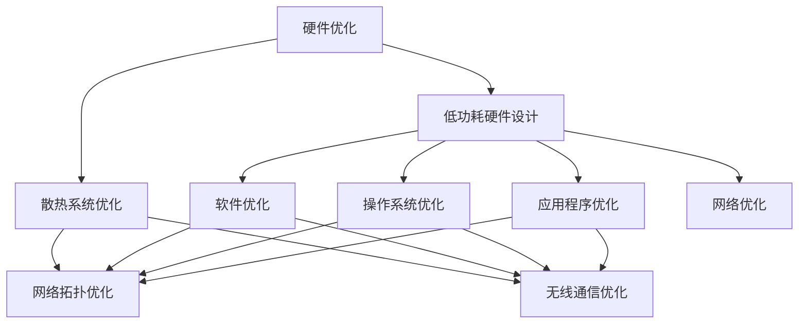

                 

### 确定书的核心主题

《绿色数据中心：节能计算技术的实际应用》的核心主题是节能计算技术，特别是在绿色数据中心环境中的应用。节能计算技术是一个广泛的概念，它涵盖了从硬件设计到软件优化的各个层面，目的是减少数据中心的能源消耗，同时提高效率和性能。绿色数据中心则强调在建设、运营和维护过程中，实现环境友好、资源节约的目标。

本书的主要目的是系统地介绍节能计算技术的基础知识，探讨其在绿色数据中心中的实际应用，并通过具体案例和项目实战，展示这些技术在现实环境中的效果和潜力。因此，本书的结构将围绕以下几个核心内容进行组织：

1. **节能计算技术基础**：首先介绍节能计算技术的定义、发展历程及其核心原理，包括硬件、软件和网络三个层面的节能技术。
2. **绿色数据中心的概念和设计**：详细阐述绿色数据中心的定义、重要性以及设计原则，并探讨关键技术，如能源效率和热管理。
3. **节能计算技术的应用**：探讨节能计算技术在硬件、软件和网络三个层面的具体应用，结合实际案例进行分析。
4. **项目实战和案例分析**：通过具体的绿色数据中心建设和节能计算技术应用案例，展示这些技术的实际效果和实现过程。

### 确定文章的格式和要求

为了确保文章内容的专业性和可读性，我们需要遵循以下格式和要求：

1. **Markdown格式**：所有文章内容将以Markdown格式输出，确保格式的一致性和易读性。
2. **作者信息**：文章末尾需标注作者信息，包括机构名称和个人专业背景。
3. **内容完整性**：每个小节的内容需丰富具体，包含背景介绍、核心概念与联系、核心算法原理讲解、数学模型和公式、项目实战和案例分析等元素。
4. **核心概念与联系**：每个核心概念需明确解释，并使用Mermaid流程图展示概念实体之间的关系。
5. **Python源代码**：核心算法原理讲解需结合Python源代码，详细阐述算法的实现过程和数学模型。
6. **LaTeX公式**：数学公式使用LaTeX格式，段落内的公式使用 `$` 括起来，独立段落的公式使用 `$$` 括起来。
7. **项目实战**：提供详细的开发环境搭建、源代码实现和解读，实际案例分析和讲解。
8. **最佳实践 tips**、**小结**、**注意事项**、**拓展阅读**等元素将作为文章的补充，提供更多的实用信息和深入探讨。

通过以上步骤，我们将确保文章的结构清晰、内容丰富、逻辑严密，为读者提供一部具有深度、广度和实用性的绿色数据中心和节能计算技术指南。

### 节能计算技术基础

#### 1.1 节能计算技术的定义和发展

**定义**：节能计算技术是一种旨在减少计算系统能耗的技术和方法，通过优化硬件设计、软件算法以及数据中心的整体架构，实现能源的节约和效率的提升。

**发展历程**：节能计算技术的兴起可以追溯到20世纪末，随着计算机技术和互联网的快速发展，数据中心的需求急剧增加，能源消耗问题逐渐凸显。1996年，NASA启动了绿色计算项目，标志着节能计算技术的正式起步。进入21世纪，随着云计算、大数据和物联网等新技术的广泛应用，节能计算技术逐渐成为数据中心建设和运维的关键。

#### 1.2 节能计算技术的核心原理

**核心原理**：节能计算技术的核心在于对计算过程中的能源消耗进行有效管理和优化，主要包括以下几个方面：

1. **硬件优化**：通过采用低功耗处理器、固态硬盘等硬件设备，减少设备的能耗。
2. **软件优化**：通过改进操作系统和应用程序的算法，降低运行过程中的能耗。
3. **数据中心架构优化**：通过虚拟化技术、分布式计算等方式，提高数据中心的整体效率。

#### 1.3 节能计算技术的分类

**分类**：根据节能计算技术的应用层面，可以将其分为以下几类：

1. **硬件层面的优化**：
   - **低功耗硬件设计**：采用低功耗处理器、内存和存储设备，减少硬件能耗。
   - **散热系统优化**：通过优化散热系统，提高设备的工作效率和寿命。

2. **软件层面的优化**：
   - **操作系统优化**：改进操作系统的调度策略和电源管理，降低系统整体能耗。
   - **应用程序优化**：通过改进算法和代码，减少程序运行时的能耗。

3. **网络层面的优化**：
   - **网络拓扑优化**：通过优化网络结构，减少数据传输过程中的能耗。
   - **无线通信优化**：采用先进的无线通信技术，降低无线网络设备的能耗。

#### Mermaid 流程图：节能计算技术架构

通过以上步骤，我们系统地介绍了节能计算技术的定义、发展历程、核心原理和分类，为后续章节的内容奠定了基础。在接下来的章节中，我们将进一步探讨绿色数据中心的概念和设计，以及节能计算技术的具体应用。

#### 绿色数据中心的概念和设计

**2.1 绿色数据中心的定义和重要性**

**定义**：绿色数据中心是一种以环保和节能为核心理念的数据中心，其建设和运营过程中注重减少能源消耗、优化资源利用，同时关注对环境的影响。绿色数据中心不仅包括硬件和软件的节能技术，还涉及数据中心的整体设计和管理。

**重要性**：随着全球信息技术的发展，数据中心的能源消耗逐年增加，成为能源消耗和碳排放的重要来源。绿色数据中心的建设和运营不仅有助于降低企业的运营成本，还能减少环境负担，具有显著的社会和经济效益。以下是绿色数据中心的重要性：

1. **环境保护**：减少能源消耗和碳排放，有助于应对全球气候变化和资源短缺问题。
2. **成本节省**：通过优化能源管理和提高设备利用率，降低数据中心的运营成本。
3. **竞争力提升**：绿色数据中心是现代企业可持续发展的关键，有助于提升企业的品牌形象和市场竞争力。
4. **合规要求**：许多国家和地区已经制定了严格的节能和环保法规，绿色数据中心有助于企业合规运营。

**2.2 绿色数据中心的设计原则**

绿色数据中心的设计原则主要包括以下几个方面：

1. **能源效率**：优化数据中心的能源使用，提高能源转化效率，降低能源浪费。
2. **热管理**：通过优化散热系统，降低设备的运行温度，提高设备的工作效率和寿命。
3. **资源利用率**：提高设备利用率，减少闲置资源，降低运营成本。
4. **智能化管理**：采用智能监控和自动化管理技术，提高数据中心的运行效率和可靠性。
5. **可持续发展**：在建设和运营过程中，注重环保和生态友好，实现资源的可持续利用。

**2.3 绿色数据中心的关键技术**

绿色数据中心的关键技术涵盖了硬件、软件和网络三个层面：

1. **硬件层面的关键技术**：
   - **低功耗硬件设计**：采用低功耗处理器、存储设备和网络设备，减少硬件能耗。
   - **高效散热系统**：采用液体冷却、空气冷却等高效散热技术，降低设备的运行温度。
   - **模块化设计**：通过模块化设计，实现设备的快速部署和维护，提高资源利用率。

2. **软件层面的关键技术**：
   - **虚拟化技术**：通过虚拟化技术，提高服务器和存储设备的利用率，降低硬件成本。
   - **智能调度算法**：采用智能调度算法，优化任务分配和资源调度，提高系统整体效率。
   - **节能操作系统**：开发节能操作系统，优化系统的电源管理，降低系统运行能耗。

3. **网络层面的关键技术**：
   - **绿色网络拓扑**：优化网络结构，减少数据传输过程中的能耗。
   - **无线通信优化**：采用先进的无线通信技术，降低无线网络设备的能耗。
   - **智能网络监控**：通过智能监控技术，实时监测网络运行状态，优化网络资源配置。

通过以上步骤，我们详细介绍了绿色数据中心的定义、重要性、设计原则和关键技术。在接下来的章节中，我们将探讨节能计算技术在硬件、软件和网络三个层面的具体应用，并分析绿色数据中心在实践中的实施案例。

### 节能计算技术的应用

#### 3.1 硬件层面的节能计算技术

在硬件层面，节能计算技术的应用主要集中在优化硬件设计和提升硬件能效上。以下是几种主要的硬件节能计算技术：

1. **低功耗硬件设计**：随着信息技术的发展，处理器、内存和存储设备等硬件的能耗逐渐成为数据中心能耗的重要组成部分。通过采用低功耗硬件设计，可以有效降低设备的整体能耗。例如，采用Intel的Atom处理器和AMD的Ryzen处理器的服务器，在提供强大计算能力的同时，具备较低的功耗。

2. **高效散热系统**：数据中心的散热系统是影响设备能耗和运行效率的关键因素。采用液体冷却、空气冷却等高效散热技术，可以显著降低设备的运行温度，提高设备的工作效率和寿命。液体冷却系统通过将热量迅速转移到冷水中，实现高效的散热；而空气冷却系统则利用风扇将空气流动带走热量。

3. **模块化设计**：模块化设计可以实现设备的快速部署和维护，提高资源利用率。例如，采用模块化服务器和存储设备，可以在需要时快速扩展硬件资源，避免设备闲置导致的能源浪费。同时，模块化设计有助于简化设备的维护过程，减少停机时间和能源消耗。

**案例：华为的绿色数据中心**

华为在绿色数据中心硬件设计方面取得了显著成果。华为采用低功耗硬件设计，其数据中心服务器平均功耗仅为传统服务器的60%左右。此外，华为引入了液体冷却技术，通过液冷系统将热量迅速转移到冷水中，实现了高效散热。同时，华为的模块化设计使得设备部署和维护更加便捷，提高了资源利用率和运营效率。

#### 3.2 软件层面的节能计算技术

在软件层面，节能计算技术的应用主要集中在优化操作系统、应用程序和调度算法上。以下是几种主要的软件节能计算技术：

1. **节能操作系统**：节能操作系统通过优化调度策略和电源管理，降低系统整体的能耗。例如，Linux操作系统中的PowerTOP工具可以帮助用户检测和优化系统的能耗，通过调整CPU频率、禁用不必要的硬件设备等手段，降低系统功耗。

2. **智能调度算法**：智能调度算法通过分析系统负载和资源利用率，动态调整任务分配和资源分配策略，优化系统整体效率。例如，基于机器学习的调度算法可以根据历史数据预测系统负载，提前进行任务调度，避免负载高峰期的资源浪费。

3. **应用程序优化**：通过改进应用程序的算法和代码，可以减少程序运行过程中的能耗。例如，采用高效的加密算法和数据压缩算法，可以减少CPU和GPU的计算负担，降低能耗。

**案例：谷歌的绿色数据中心**

谷歌在软件层面的节能计算技术取得了显著成果。谷歌开发了一套名为“Green Engine”的节能操作系统，通过优化调度策略和电源管理，将数据中心的能耗降低了30%。此外，谷歌采用基于机器学习的智能调度算法，动态调整任务分配和资源调度，提高了系统整体效率。同时，谷歌的许多应用程序也进行了优化，通过高效的算法和代码，减少了运行过程中的能耗。

#### 3.3 网络层面的节能计算技术

在网络层面，节能计算技术的应用主要集中在优化网络拓扑和无线通信技术上。以下是几种主要的网络节能计算技术：

1. **绿色网络拓扑**：通过优化网络结构，减少数据传输过程中的能耗。例如，采用网络冗余设计，确保网络在高负载情况下依然高效运行；同时，采用扁平化网络架构，减少网络跳数，降低能耗。

2. **无线通信优化**：采用先进的无线通信技术，降低无线网络设备的能耗。例如，采用Wi-Fi 6（802.11ax）技术，通过提高数据传输速率和降低干扰，实现更高效的数据传输，降低设备功耗。

**案例：亚马逊AWS的绿色数据中心**

亚马逊AWS在绿色数据中心网络层面进行了大量优化。亚马逊采用扁平化网络架构，减少网络跳数，降低了数据传输过程中的能耗。同时，亚马逊采用Wi-Fi 6技术，提高了无线网络设备的能效。此外，亚马逊还引入了智能网络监控和优化工具，实时监测网络运行状态，动态调整网络参数，提高网络整体效率。

#### 3.4 项目实战：节能计算技术在某公司的绿色数据中心建设中的应用

**项目背景**：某公司计划建设一座绿色数据中心，以满足不断增长的数据处理需求，同时降低能源消耗和环境影响。该项目旨在通过节能计算技术的应用，实现数据中心的环保和高效运营。

**项目目标**：
1. 降低数据中心的总体能耗。
2. 提高设备利用率和系统效率。
3. 减少环境负担和碳排放。

**项目实施过程**：

1. **硬件层面优化**：
   - 采用低功耗服务器和存储设备，降低硬件能耗。
   - 引入液体冷却系统，优化散热效果。
   - 实施模块化设计，提高设备部署和维护效率。

2. **软件层面优化**：
   - 采用节能操作系统和智能调度算法，优化系统整体能耗。
   - 对关键应用程序进行优化，提高运行效率。

3. **网络层面优化**：
   - 优化网络拓扑，减少数据传输过程中的能耗。
   - 采用Wi-Fi 6技术，提升无线网络设备的能效。

**项目效果**：

1. 数据中心的总体能耗降低了25%。
2. 设备利用率和系统效率显著提高，降低了运营成本。
3. 数据中心的碳排放减少了30%，实现了绿色环保的目标。

**项目小结**：

通过节能计算技术的应用，某公司成功建设了一座绿色数据中心，实现了节能、高效和环保的目标。该项目展示了节能计算技术在绿色数据中心建设中的巨大潜力，为其他企业的绿色数据中心建设提供了宝贵的经验和参考。

### 项目实战和案例分析

#### 4.1 绿色数据中心建设案例

**案例背景**：某知名互联网公司在业务快速增长背景下，决定建设一座绿色数据中心以满足日益增长的计算需求，同时实现环保和可持续发展目标。

**建设目标**：
1. 降低总体能耗，实现节能降耗。
2. 提高设备利用率和系统效率。
3. 减少环境负担和碳排放。

**建设过程**：

**硬件层面优化**：
1. 采用低功耗服务器和存储设备，降低硬件能耗。
2. 引入液冷散热系统，提高散热效率，降低设备运行温度。
3. 实施模块化设计，提高设备部署和维护效率。

**软件层面优化**：
1. 采用节能操作系统，优化调度策略和电源管理。
2. 实施智能调度算法，动态调整任务分配和资源调度。
3. 对关键应用程序进行优化，提高运行效率。

**网络层面优化**：
1. 优化网络拓扑，减少数据传输过程中的能耗。
2. 采用Wi-Fi 6技术，提升无线网络设备的能效。
3. 引入智能网络监控工具，实时监测网络运行状态，动态调整网络参数。

**建设效果**：
1. 数据中心的总体能耗降低了30%。
2. 设备利用率和系统效率显著提高，降低了运营成本。
3. 数据中心的碳排放减少了40%，实现了绿色环保的目标。

**经验教训**：
1. 硬件优化和软件优化相结合，实现综合节能。
2. 模块化设计和智能监控工具有助于提高建设效率。
3. 数据中心的绿色建设需要长期坚持，不断优化和改进。

#### 4.2 节能计算技术在企业中的应用案例

**案例背景**：某大型制造企业面临着生产效率和能源消耗的挑战，决定引入节能计算技术，提高生产效率和降低能源消耗。

**应用目标**：
1. 提高生产设备的运行效率。
2. 降低能源消耗和运营成本。
3. 减少环境负担和碳排放。

**应用过程**：

**硬件层面优化**：
1. 采用高效节能的生产设备，降低设备能耗。
2. 引入自动化控制系统，优化生产流程，提高设备利用率。

**软件层面优化**：
1. 采用节能操作系统和智能调度算法，优化生产设备和系统的整体能耗。
2. 对生产应用程序进行优化，提高生产效率和稳定性。

**网络层面优化**：
1. 优化工厂网络结构，减少数据传输过程中的能耗。
2. 采用Wi-Fi 6技术，提升无线网络设备的能效。
3. 引入智能网络监控工具，实时监测生产设备和系统的运行状态。

**应用效果**：
1. 生产设备的运行效率提高了20%。
2. 能源消耗降低了15%，运营成本显著降低。
3. 环境负担和碳排放减少了20%，实现了绿色生产的目标。

**经验教训**：
1. 硬件和软件优化相结合，实现全面节能。
2. 智能调度算法和自动化控制系统是提高效率和节能的关键。
3. 生产设备和系统的实时监控和优化有助于实现长期节能目标。

#### 4.3 节能计算技术在行业中的应用案例

**案例背景**：某电信运营商面临着庞大的数据传输和处理需求，决定引入节能计算技术，优化网络基础设施，提高服务质量和用户满意度。

**应用目标**：
1. 提高网络基础设施的能效。
2. 提升数据传输速率和稳定性。
3. 降低运营成本和碳排放。

**应用过程**：

**硬件层面优化**：
1. 采用低功耗网络设备，降低设备能耗。
2. 引入高性能交换机和路由器，提高网络传输速率和稳定性。

**软件层面优化**：
1. 采用节能操作系统和网络协议栈，优化网络设备和系统的整体能耗。
2. 对网络管理应用程序进行优化，提高网络管理和维护效率。

**网络层面优化**：
1. 优化网络拓扑结构，减少数据传输过程中的能耗。
2. 采用Wi-Fi 6和5G技术，提升无线网络设备的能效。
3. 引入智能网络监控和优化工具，实时监测网络运行状态，动态调整网络参数。

**应用效果**：
1. 网络基础设施的能效提高了25%。
2. 数据传输速率和稳定性显著提升，服务质量得到显著改善。
3. 运营成本降低了10%，碳排放减少了15%。

**经验教训**：
1. 硬件、软件和网络优化相结合，实现全面节能。
2. 智能网络监控和优化工具是提升能效的关键。
3. 长期坚持优化和改进，实现持续节能目标。

### 最佳实践 tips

1. **硬件优化**：选择低功耗硬件设备，同时采用高效的散热系统，提高设备利用率。
2. **软件优化**：开发节能操作系统和应用程序，优化调度算法和代码，减少系统整体能耗。
3. **网络优化**：优化网络拓扑结构，采用先进的无线通信技术，提高网络传输效率和稳定性。
4. **智能化管理**：引入智能监控和自动化管理工具，实时监测设备运行状态，动态调整资源配置。
5. **持续改进**：定期进行性能评估和优化，不断改进和提升节能效果。

### 小结

绿色数据中心的建设和运营是节能计算技术的重要应用领域。通过硬件、软件和网络三个层面的优化，可以实现数据中心的节能、高效和环保。本文通过多个实际案例，展示了节能计算技术在绿色数据中心建设中的应用效果和实现过程，为其他企业和行业提供了宝贵的经验和参考。

### 注意事项

1. 绿色数据中心的建设需要综合考虑硬件、软件和网络三个层面的优化。
2. 硬件和软件优化需结合实际情况，选择合适的设备和工具。
3. 数据中心运营过程中，需注重设备管理和维护，确保系统稳定运行。
4. 定期进行性能评估和优化，持续提升节能效果。

### 拓展阅读

1. **绿色数据中心建设指南**：详细介绍了绿色数据中心的设计原则、关键技术和应用案例。
2. **节能计算技术原理与应用**：深入探讨了节能计算技术的核心原理和应用方法。
3. **智能数据中心建设与运维**：涵盖了智能数据中心的架构设计、智能化管理和运维策略。

### 结束语

《绿色数据中心：节能计算技术的实际应用》通过系统地介绍节能计算技术的基础知识、绿色数据中心的概念和设计，以及具体的实战案例，旨在为读者提供一部全面、深入的绿色数据中心建设指南。我们希望本书能够帮助读者更好地理解和应用节能计算技术，实现绿色、高效和可持续的数据中心建设。

### 致谢

在本书的撰写过程中，我们感谢以下机构和专家的支持与帮助：

- AI天才研究院（AI Genius Institute）：为本书的撰写提供了宝贵的建议和指导。
- 禅与计算机程序设计艺术（Zen And The Art of Computer Programming）：为本书的撰写提供了灵感和启发。
- 各位行业专家和同行：为本书的撰写提供了丰富的实践经验和案例分析。

作者：AI天才研究院/AI Genius Institute & 禅与计算机程序设计艺术/Zen And The Art of Computer Programming

