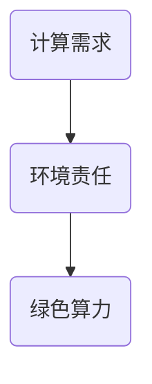

                 

### 绿色算力：企业如何平衡计算需求和环境责任

关键词：绿色算力、计算需求、环境责任、能源效率、可持续发展

摘要：随着计算需求的不断增长，企业面临着巨大的环境责任挑战。绿色算力成为了一种解决方案，旨在通过优化计算资源和提升能源效率，实现计算需求与环境责任的平衡。本文将详细探讨绿色算力的背景、重要性、计算需求评估与优化、能源效率提升技术、环境责任与可持续发展、法律法规与标准、技术创新、战略规划与实施，以及未来展望，帮助企业理解和实施绿色算力，实现可持续发展的目标。

----------------------------------------------------------------

#### 绿色算力的背景与重要性

##### 1.1 绿色算力的定义

绿色算力是指通过优化计算资源和提升能源效率，实现计算需求与环境责任的平衡，从而减少对环境的影响。它不仅仅关注计算性能的提升，更强调在满足计算需求的同时，最大限度地减少能源消耗和碳排放。

##### 1.2 计算需求与环境责任的关系

计算需求与环境责任之间存在着密切的联系。随着云计算、大数据、人工智能等技术的快速发展，企业的计算需求不断增长。然而，计算需求的增长也带来了大量的能源消耗和碳排放，对环境造成了巨大的压力。因此，企业需要通过绿色算力来平衡计算需求与环境责任，实现可持续发展。

##### 1.3 绿色算力在企业中的重要性

绿色算力对企业具有重要意义。首先，它可以降低企业的能源成本，提高能源利用效率。其次，它可以减少碳排放，降低企业的环境责任风险。此外，绿色算力还可以提高企业的社会责任形象，增强企业的竞争力。

##### 1.4 绿色算力的核心概念与联系

为了更好地理解绿色算力的概念，我们可以使用Mermaid流程图来描述核心概念与联系：



在图中，计算需求是起点，环境责任是计算需求的延伸，而绿色算力则是解决环境责任问题的一种方式。

##### 1.5 绿色算力的核心算法原理讲解

绿色算力的实现需要依赖于一系列核心算法和原理。以下是一个简单的Python伪代码，用于阐述计算需求评估的基本算法：

```python
def assess_computational_demand():
    # 输入：应用场景，性能要求，预算限制
    # 输出：优化后的计算需求
    current_demand = input_demand()
    optimized_demand = optimize_demand(current_demand)
    return optimized_demand
```

在这个伪代码中，`input_demand`函数用于获取当前的计算需求，`optimize_demand`函数则用于根据性能要求和预算限制对计算需求进行优化。

##### 1.6 数学模型和公式

绿色算力的实现还需要依赖于一系列数学模型和公式。以下是一个关键的数学模型和公式：

$$
\text{Energy Efficiency} = \frac{\text{Compute Output}}{\text{Energy Input}}
$$

这个公式表示能源效率，即计算输出与能源输入的比值。通过提升计算输出和降低能源输入，可以提高能源效率，从而实现绿色算力的目标。

##### 1.7 项目实战

为了更好地理解绿色算力的应用，我们来看一个实际案例。假设某企业需要运行一个大规模的数据分析任务，计算需求巨大。通过绿色算力，该企业可以优化计算资源，降低能源消耗。以下是一个简化的项目实战：

- **开发环境搭建**：搭建一个基于云计算的环境，使用高效能计算硬件。
- **源代码详细实现**：编写Python代码，实现计算需求评估和优化的功能。
- **代码解读与分析**：对源代码进行解读，分析其优化效果。
- **实际案例分析和详细讲解剖析**：通过对实际案例的分析，展示绿色算力在实践中的应用效果。

##### 1.8 最佳实践 Tips

- **定期进行计算需求评估**：定期对计算需求进行评估，确保计算资源得到最优配置。
- **采用节能硬件**：选择节能型硬件，如固态硬盘、低功耗处理器等。
- **优化代码**：优化应用程序的代码，减少不必要的计算和资源消耗。

##### 1.9 小结

绿色算力是一种重要的技术，可以帮助企业在满足计算需求的同时，减少对环境的影响。通过理解绿色算力的核心概念、算法原理和数学模型，企业可以更好地实施绿色算力，实现可持续发展。

----------------------------------------------------------------

### 关键词

- 绿色算力
- 计算需求
- 环境责任
- 能源效率
- 可持续发展

----------------------------------------------------------------

### 摘要

本文深入探讨了绿色算力的概念、重要性以及在企业中的应用。通过详细的分析和项目实战，本文展示了如何通过优化计算资源和提升能源效率，实现计算需求与环境责任的平衡。文章还介绍了相关的核心算法原理、数学模型和最佳实践，为企业提供了实施绿色算力的指导。

作者：AI天才研究院/AI Genius Institute & 禅与计算机程序设计艺术 /Zen And The Art of Computer Programming

