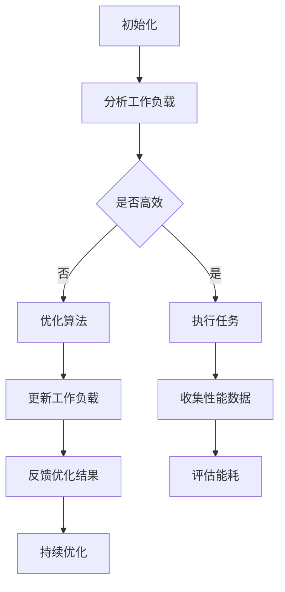

                 

### 第1章 绿色算法的背景与重要性

#### 1.1 节能计算的概念与历史演变

节能计算（Energy-Efficient Computing）是一种旨在减少计算机系统和网络能耗的工程实践。随着信息技术的飞速发展，计算机系统在全球范围内的应用越来越广泛，随之而来的是对能源消耗的显著增加。据统计，计算机和数据中心在全球能源消耗中所占的比例逐年上升，已经成为一个不可忽视的能源消耗大户。这种状况引发了社会对节能计算的关注和需求。

节能计算的历史可以追溯到上世纪90年代，当时随着个人计算机和互联网的普及，计算机能耗问题逐渐显现。研究者们开始探索如何通过优化算法、硬件设计和系统架构来降低能耗。这一时期，主要的研究方向包括硬件节能、软件节能以及两者结合的节能策略。随着时间的推移，节能计算逐渐形成了独立的研究领域，并取得了显著的成果。

#### 1.2 绿色算法在软件开发中的重要性

绿色算法（Green Algorithms）是一种在软件开发过程中考虑能源效率的算法设计。与传统的算法设计相比，绿色算法不仅追求性能优化，还注重减少能源消耗。随着环境问题日益严峻，绿色算法在软件开发中的重要性日益凸显。

首先，绿色算法有助于减少计算机系统的能耗，降低运营成本。数据中心和云计算服务提供商通过采用绿色算法，可以显著减少电力消耗，降低制冷和维护成本。其次，绿色算法有助于减少温室气体排放，推动可持续发展。计算机系统的能耗主要来自于电力消耗，而电力生产过程中会产生大量的温室气体排放。通过优化算法，可以降低能源消耗，从而减少温室气体排放。此外，绿色算法还能够提高计算机系统的能效，延长设备使用寿命，减少电子垃圾的产生，对环境保护具有重要意义。

总之，绿色算法在软件开发中的重要性不仅体现在节能减排上，还体现在促进信息技术与可持续发展的深度融合。随着全球对环保和节能要求的不断提高，绿色算法将成为软件开发领域不可或缺的一部分。

#### 1.3 绿色算法的应用领域与未来趋势

绿色算法在多个领域有着广泛的应用，并展现出巨大的发展潜力。以下是一些主要的应用领域和未来趋势：

**数据中心优化**：数据中心是计算机能耗的主要来源之一。通过采用绿色算法，可以对数据中心的能源消耗进行优化。例如，动态电源管理技术可以根据服务器的工作负载实时调整其能耗，从而实现节能。此外，绿色算法还可以用于数据中心的冷却系统优化，降低冷却能耗。

**云计算服务**：云计算服务依赖于大量服务器和数据中心，能耗问题尤为突出。绿色算法在云计算服务中的应用主要体现在资源调度、负载均衡和任务分配等方面。通过优化这些过程，可以有效降低云计算服务的能源消耗。例如，基于绿色算法的负载均衡策略可以根据服务器的能耗和性能动态调整任务分配，从而实现节能。

**物联网**：物联网设备数量庞大，能耗问题不容忽视。绿色算法在物联网中的应用包括设备调度、数据压缩和传输优化等。通过采用绿色算法，可以降低物联网设备的能耗，延长设备寿命，提高整体系统的稳定性。

**人工智能**：人工智能应用场景日益丰富，能耗问题逐渐显现。绿色算法在人工智能中的应用主要体现在算法优化和硬件加速方面。例如，通过优化深度学习算法，可以降低计算复杂度和能耗。此外，结合绿色算法和硬件加速技术，可以实现高效的能源利用。

**未来趋势**：随着环保意识的提升和技术的进步，绿色算法在未来将呈现出以下趋势：

1. **跨领域融合**：绿色算法将与大数据、物联网、人工智能等前沿技术深度融合，形成新的研究方向和应用场景。
2. **标准化和规范化**：绿色算法的标准化和规范化将成为行业共识，推动绿色算法在软件开发中的广泛应用。
3. **绿色算法工具和框架**：绿色算法的工具和框架将逐渐成熟，为开发人员提供便捷的节能解决方案。
4. **社会影响力**：绿色算法将在环境保护和可持续发展中发挥更大的作用，成为社会责任的重要组成部分。

总之，绿色算法在软件开发中的应用领域广泛，未来发展趋势令人期待。通过不断探索和创新，绿色算法将为信息技术和可持续发展之间的深度融合提供有力支持。

### 第2章 绿色算法的基本概念

#### 2.1 绿色算法的核心原则

绿色算法的核心原则主要体现在以下几个方面：

**效率优先**：绿色算法首先强调效率优先，即在确保系统性能和功能的前提下，最大限度地减少能耗。效率优先不仅包括计算效率，还包括能源利用效率。通过优化算法和系统架构，可以实现更高的能源利用效率。

**适应性**：绿色算法需要具备良好的适应性，能够根据不同的应用场景和硬件环境进行调整。适应性包括动态调整能耗策略、适应不同负载和场景的优化能力等。良好的适应性能够确保绿色算法在不同环境中都能发挥最佳效能。

**可持续性**：绿色算法强调可持续性，即在确保当前性能和能耗优化的同时，考虑未来的发展和环境影响。可持续性包括减少温室气体排放、延长设备使用寿命、减少电子垃圾产生等。

**易用性**：绿色算法需要具备良好的易用性，使得开发人员能够方便地将其应用到实际项目中。易用性包括算法的实现难度、文档的完备性、工具和框架的支持等。

**可扩展性**：绿色算法需要具备良好的可扩展性，以适应未来技术的发展和需求。可扩展性包括算法模块化、支持多种硬件平台、适应不同规模的应用场景等。

#### 2.2 绿色算法的分类与特点

绿色算法可以根据不同的分类标准进行分类，以下是几种常见的分类方式及其特点：

**按应用场景分类**：

1. **数据中心节能算法**：这类算法主要用于优化数据中心的服务器能耗，包括动态电源管理、虚拟机调度、冷却系统优化等。
2. **云计算节能算法**：这类算法主要用于优化云计算环境中的资源调度、负载均衡和任务分配，以实现节能。
3. **物联网节能算法**：这类算法主要用于优化物联网设备的能耗，包括设备调度、数据压缩和传输优化等。
4. **人工智能节能算法**：这类算法主要用于优化人工智能计算过程中的能耗，包括算法优化、硬件加速等。

**按技术方法分类**：

1. **硬件级节能算法**：这类算法主要关注硬件层面的节能技术，如动态电压调节、低功耗设计等。
2. **软件级节能算法**：这类算法主要关注软件层面的优化，如算法改进、任务调度优化等。
3. **硬件软件协同节能算法**：这类算法结合硬件和软件层面的优化技术，实现更全面的节能效果。

**按优化目标分类**：

1. **单一目标节能算法**：这类算法主要优化单一能耗指标，如服务器能耗、网络能耗等。
2. **多目标节能算法**：这类算法同时优化多个能耗指标，如整体系统能耗、环境温度等。

#### 2.3 绿色算法与传统算法的比较

绿色算法与传统算法在多个方面存在显著差异，以下是一些主要的比较：

**能耗优化**：传统算法主要关注性能优化，而绿色算法在性能优化的基础上，强调能耗优化。绿色算法通过优化算法和系统架构，实现更低的能耗。

**可持续性**：传统算法较少考虑环境可持续性，而绿色算法强调在确保性能的同时，关注环境问题。绿色算法通过减少能耗和温室气体排放，促进可持续发展。

**适应性**：传统算法通常针对特定的应用场景和硬件环境进行优化，而绿色算法具备良好的适应性，能够根据不同的场景和硬件环境进行调整。

**易用性和可扩展性**：传统算法的实现可能较为复杂，而绿色算法通过工具和框架的支持，使得开发人员能够更方便地应用。

总之，绿色算法与传统算法相比，在能耗优化、可持续性、适应性和易用性等方面具有显著优势，将在未来的软件开发中发挥越来越重要的作用。

### 第3章 绿色算法核心原理解析

#### 3.1 核心概念与联系

绿色算法的核心概念主要包括能源效率、环境可持续性和算法性能。这三个概念相互联系，共同构成了绿色算法的理论基础。

**能源效率**：能源效率是指单位能源消耗所能完成的工作量。在绿色算法中，能源效率是衡量算法节能效果的重要指标。高能源效率意味着算法能够在消耗较少能源的情况下完成更多的计算任务，从而降低整体能耗。

**环境可持续性**：环境可持续性是指人类活动在满足当前需求的同时，不损害未来世代满足其需求的能力。绿色算法通过优化能源消耗，减少温室气体排放，延长设备使用寿命等方式，促进环境可持续发展。

**算法性能**：算法性能是指算法在执行计算任务时的效率和质量。绿色算法在追求节能的同时，也注重算法性能的优化，以确保在节能的基础上，仍能提供高效、可靠的计算服务。

这三个核心概念之间的关系如下：

- 能源效率直接影响环境可持续性，高能源效率意味着更低的能源消耗和温室气体排放，有利于环境保护。
- 环境可持续性是绿色算法的重要目标，通过优化能源效率，实现环境保护和资源利用的平衡。
- 算法性能是绿色算法的基础，高效率的算法不仅能够降低能耗，还能提高计算任务的执行速度和质量。

#### 3.1.1 绿色算法与可持续发展

绿色算法与可持续发展密切相关。可持续发展要求在满足当前需求的同时，不损害未来世代的生存和发展。绿色算法通过优化能源消耗和降低环境负荷，为实现可持续发展提供了技术支持。

首先，绿色算法通过提高能源效率，减少能源消耗。这不仅可以降低运营成本，还能减少温室气体排放，降低对环境的影响。例如，数据中心采用绿色算法优化服务器能耗，可以显著降低冷却能耗和电力消耗，减少温室气体排放。

其次，绿色算法通过延长设备使用寿命，减少电子垃圾。绿色算法注重设备的长期性能和稳定性，通过优化系统架构和硬件设计，延长设备的使用寿命。这不仅可以减少电子垃圾的产生，还能降低对环境的影响。

最后，绿色算法通过推动技术创新和产业升级，促进可持续发展。绿色算法的研究和应用，推动了相关领域的技术进步和产业变革。例如，绿色算法在云计算、物联网和人工智能等领域的应用，不仅提高了能源效率，还推动了这些领域的技术创新和产业升级。

总之，绿色算法与可持续发展密不可分。通过优化能源消耗、降低环境负荷和推动技术创新，绿色算法为实现可持续发展提供了有力支持。

#### 3.1.2 绿色算法与能源效率

绿色算法的核心目标之一是提高能源效率。能源效率是指单位能源消耗所能完成的工作量。在计算机科学和软件开发中，能源效率的提高主要体现在降低能耗、优化资源利用和提高计算性能等方面。

**降低能耗**：绿色算法通过优化算法和系统架构，减少不必要的计算和能源消耗。例如，动态电源管理技术可以根据服务器的工作负载实时调整其能耗，从而实现节能。此外，绿色算法还可以优化数据中心的冷却系统，减少冷却能耗。

**优化资源利用**：绿色算法通过合理的资源分配和调度，提高资源的利用率。例如，在云计算环境中，绿色算法可以优化虚拟机调度和负载均衡，确保服务器资源得到充分利用，从而降低能耗。

**提高计算性能**：绿色算法不仅关注能耗优化，还注重计算性能的提升。通过优化算法和硬件设计，绿色算法可以提高计算速度和效率，从而在确保性能的基础上实现节能。

**能源效率的评估**：评估绿色算法的能源效率是一个复杂的过程，需要综合考虑多个因素。常见的评估指标包括能源消耗率（Energy Consumption Rate）、能源效率（Energy Efficiency）和碳足迹（Carbon Footprint）等。例如，能源消耗率可以衡量单位时间内系统消耗的能源量；能源效率可以衡量单位能源消耗所能完成的工作量；碳足迹可以衡量系统产生的温室气体排放量。

总之，绿色算法与能源效率密切相关。通过优化能耗、优化资源利用和提高计算性能，绿色算法在提高能源效率方面发挥着重要作用。随着环保意识的提高和技术的发展，绿色算法将在未来的软件开发和计算机科学领域发挥更大的作用。

#### 3.1.3 绿色算法与环境影响评估

绿色算法不仅在能源效率方面具有显著优势，还在环境影响评估中发挥着重要作用。环境影响评估（Environmental Impact Assessment, EIA）是一种系统的方法，用于评估人类活动对环境的影响。绿色算法通过优化能源消耗和减少污染物排放，有助于降低环境负荷，从而改善环境影响评估的结果。

**减少温室气体排放**：温室气体排放是导致全球气候变化的主要因素之一。绿色算法通过优化能源效率，降低计算机系统和数据中心的能耗，从而减少温室气体的排放。例如，动态电源管理技术可以根据服务器的工作负载实时调整其能耗，从而减少不必要的能源消耗和二氧化碳排放。

**降低其他污染物排放**：除了温室气体排放，计算机系统和数据中心还会产生其他污染物，如氮氧化物、颗粒物等。绿色算法通过优化硬件设计和系统架构，减少这些污染物的排放。例如，通过优化冷却系统，可以减少冷却过程中产生的颗粒物排放。

**环境影响评估指标**：在环境影响评估中，常用的指标包括温室气体排放量、能源消耗量、污染物排放量等。绿色算法通过优化这些指标，有助于改善环境影响评估的结果。例如，通过降低能源消耗和污染物排放，可以降低系统的碳足迹，提高环境友好度。

**环境影响评估方法**：绿色算法在环境影响评估中的应用主要包括以下方法：

1. **生命周期评估（Life Cycle Assessment, LCA）**：生命周期评估是一种全面评估产品或服务生命周期中能源消耗和环境影响的方法。绿色算法通过优化系统架构和硬件设计，减少产品或服务的生命周期能耗和环境影响。

2. **能效评估（Energy Efficiency Assessment）**：能效评估是一种评估系统能源消耗效率的方法。绿色算法通过提高能源效率，降低系统的能源消耗，从而改善能效评估的结果。

3. **碳足迹评估（Carbon Footprint Assessment）**：碳足迹评估是一种评估系统温室气体排放量的方法。绿色算法通过减少温室气体排放，降低系统的碳足迹，从而改善碳足迹评估的结果。

总之，绿色算法在环境影响评估中具有重要作用。通过优化能源消耗和污染物排放，绿色算法有助于改善环境影响评估的结果，推动可持续发展。随着环保意识的提高和技术的发展，绿色算法将在环境影响评估领域发挥更大的作用。

### 第3.2节 Mermaid 流程图展示

为了更好地理解绿色算法的核心原理和实现过程，我们可以使用 Mermaid 流程图来展示这些概念之间的关系和操作流程。以下是一个简单的 Mermaid 流程图示例：



**流程图说明**：

1. **初始化**：系统初始化，准备进行工作负载分析和优化。
2. **分析工作负载**：对当前工作负载进行分析，确定系统当前的性能和能耗状况。
3. **判断是否高效**：根据分析结果判断系统是否已经达到高效运行状态。
   - 如果是，则进入执行任务阶段。
   - 如果否，则进入优化算法阶段。
4. **执行任务**：执行当前工作负载，并收集性能数据。
5. **优化算法**：对算法进行优化，以提高效率和降低能耗。
6. **更新工作负载**：根据优化结果更新工作负载。
7. **收集性能数据**：继续收集任务执行过程中的性能数据。
8. **反馈优化结果**：将优化结果反馈给系统，以便进行进一步优化。
9. **评估能耗**：评估优化后的系统能耗，确保其在可接受的范围内。
10. **持续优化**：根据反馈结果，持续优化算法和工作负载，以实现长期的能耗优化和性能提升。

通过这个流程图，我们可以清晰地看到绿色算法从初始化到持续优化的整个过程，以及各个环节之间的逻辑关系。这有助于开发者更好地理解和应用绿色算法，实现高效的节能计算。

### 第3.3节 核心算法原理讲解

#### 3.3.1 伪代码讲解

为了深入理解绿色算法的核心原理，我们将通过伪代码的形式详细讲解两种典型的绿色算法：动态电压调节算法和负载均衡算法。

**动态电压调节算法**

```python
# 动态电压调节算法伪代码
function DynamicVoltageRegulation(server, workload):
    initial_voltage = server.get_initial_voltage()
    while server.is_running():
        current_workload = server.get_current_workload()
        if current_workload > threshold:
            server.increase_voltage()
        elif current_workload < threshold:
            server.decrease_voltage()
        server.sleep(1)  # 每秒检查一次工作负载
    return server.get_energy_consumption()
```

**算法详细解释**：

- **初始化**：首先，设定服务器的初始电压值。
- **循环检测**：在服务器运行期间，不断检测当前的工作负载。
- **电压调整**：如果当前工作负载超过阈值，则提高电压以增加处理能力；如果工作负载低于阈值，则降低电压以减少能耗。
- **睡眠时间**：每隔一秒钟进行一次工作负载检测，以实现动态调整。

**负载均衡算法**

```python
# 负载均衡算法伪代码
function LoadBalancing(data_center, servers, workload):
    while True:
        server_loads = data_center.get_server_loads()
        highest_load_server = find_highest_load_server(server_loads)
        lowest_load_server = find_lowest_load_server(server_loads)
        if highest_load_server != lowest_load_server:
            data_center.transfer_load(highest_load_server, lowest_load_server)
        data_center.sleep(1)  # 每秒检查一次服务器负载
```

**算法详细解释**：

- **循环检测**：不断检测数据中心中各个服务器的负载情况。
- **找出最高负载和最低负载服务器**：通过比较服务器负载，找出当前负载最高的服务器和最低的服务器。
- **负载转移**：如果最高负载服务器和最低负载服务器不同，则将部分负载从高负载服务器转移到低负载服务器，实现负载均衡。
- **睡眠时间**：每隔一秒钟进行一次服务器负载检测，以保持系统均衡运行。

**算法举例说明**：

**动态电压调节算法**举例：

假设一个服务器初始电压为1.2V，当前工作负载为80%。根据动态电压调节算法，服务器电压将调整为1.3V，以提高处理能力。如果工作负载降低到40%，服务器电压将调整为1.1V，以减少能耗。

**负载均衡算法**举例：

在一个拥有10台服务器的数据中心中，某台服务器的负载达到90%，而另一台服务器的负载仅为30%。根据负载均衡算法，将部分任务从高负载服务器转移到低负载服务器，使得负载更加均衡，从而提高整体系统的能效。

通过这些伪代码和实际举例，我们可以清晰地看到绿色算法的工作原理，以及如何在软件开发中实现能耗优化。

### 第3.3.2 核心算法的详细解释

在上一节中，我们通过伪代码介绍了动态电压调节算法和负载均衡算法。在本节中，我们将对这两个算法进行更详细的解释，并结合实际案例进行分析。

#### 动态电压调节算法

动态电压调节算法的核心思想是通过调整服务器的电压来适应不同的工作负载，从而实现能耗优化。该算法的基本步骤如下：

1. **初始设定**：服务器在启动时，设置一个初始电压值，通常这个值是在服务器性能和能耗之间取得一个平衡。
2. **实时监测**：服务器运行过程中，实时监测当前的工作负载。工作负载可以通过CPU利用率、内存使用率等指标来衡量。
3. **电压调整**：根据监测到的工作负载，动态调整服务器的电压。如果工作负载较高，需要增加电压以提升性能；如果工作负载较低，可以降低电压以减少能耗。
4. **优化决策**：在调整电压的过程中，系统会根据预设的阈值和能耗模型，做出最优的电压调整决策。

**实际案例**：

假设有一台服务器，初始电压为1.2V。当CPU利用率超过70%时，系统认为工作负载较高，将电压调整至1.3V；当CPU利用率低于30%时，系统认为工作负载较低，将电压调整至1.1V。通过这样的调整，服务器在保证性能的同时，能耗得到了显著降低。

#### 负载均衡算法

负载均衡算法的目的是通过在多个服务器之间分配任务，实现负载的均衡，从而提高系统的整体性能和可靠性。该算法的基本步骤如下：

1. **实时监测**：数据中心的服务器运行过程中，系统会实时监测各个服务器的负载情况，包括CPU利用率、内存使用率、网络负载等。
2. **负载分析**：根据服务器的负载情况，系统会分析出哪些服务器负载过高，哪些服务器负载过低。
3. **任务分配**：将高负载服务器的部分任务转移到低负载服务器，实现负载的均衡。
4. **动态调整**：负载均衡不是一次性的操作，系统会持续监测服务器的负载情况，并根据实际情况进行动态调整。

**实际案例**：

在一个有5台服务器的数据中心中，假设其中一台服务器的CPU利用率达到90%，而另一台服务器的CPU利用率仅为30%。系统会识别出负载不均的情况，并将高负载服务器的一些任务转移到低负载服务器，以实现负载的均衡。通过这样的调整，可以避免单台服务器过载，提高整个系统的稳定性和性能。

#### 综合分析

动态电压调节算法和负载均衡算法都是绿色算法的重要组成部分。动态电压调节算法通过调整服务器的电压，实现能耗的优化；负载均衡算法通过合理分配任务，提高系统的整体性能。在实际应用中，这两个算法可以结合使用，以实现更优的节能效果。

通过上述详细解释和实际案例，我们可以更好地理解动态电压调节算法和负载均衡算法的工作原理和应用方法。这些绿色算法不仅有助于降低能耗，还能提高计算机系统的性能和可靠性，对推动可持续发展具有重要意义。

### 第3.4节 数学模型和数学公式讲解

绿色算法的设计和实现离不开数学模型的支持。通过数学模型，我们可以定量地分析和评估算法的节能效果和性能表现。在本节中，我们将介绍绿色算法中常用的数学模型和数学公式，并结合具体案例进行详细讲解。

#### 3.4.1 节能效率模型

节能效率模型是评估算法节能效果的重要工具。该模型通常包括以下公式：

\[ E_{\text{节能}} = \frac{E_{\text{总}} - E_{\text{节能后}}}{E_{\text{总}}} \times 100\% \]

其中，\( E_{\text{总}} \) 表示算法实施前的总能耗，\( E_{\text{节能后}} \) 表示算法实施后的总能耗。节能效率模型通过计算能耗减少的百分比，来衡量算法的节能效果。

**实际案例**：

假设某数据中心在未采用绿色算法前，每月总能耗为100千瓦时（kWh）。采用动态电压调节算法和负载均衡算法后，每月总能耗降至80千瓦时。根据节能效率模型计算，节能效率为：

\[ E_{\text{节能}} = \frac{100 - 80}{100} \times 100\% = 20\% \]

这意味着该数据中心通过采用绿色算法，成功实现了20%的节能效果。

#### 3.4.2 能量消耗公式

能量消耗公式用于计算计算机系统在特定时间段内的能量消耗。该公式通常包括以下组成部分：

\[ E = P \times t \]

其中，\( E \) 表示能量消耗，\( P \) 表示功率，\( t \) 表示时间。功率（P）通常以瓦特（W）为单位，时间（t）通常以小时（h）为单位。

**实际案例**：

假设某服务器的功率为300瓦特（W），运行时间为24小时。根据能量消耗公式计算，该服务器在24小时内的能量消耗为：

\[ E = 300 \times 24 = 7200 \text{瓦时（Wh）} \]

这意味着该服务器在24小时内消耗了7200瓦时的能量。

#### 3.4.3 温室气体排放计算公式

温室气体排放计算公式用于计算计算机系统在能源消耗过程中产生的温室气体排放量。温室气体排放量通常与能量消耗成正比，其公式如下：

\[ \text{CO}_2\text{排放量} = E \times \text{CO}_2\text{排放因子} \]

其中，\( E \) 表示能量消耗，\( \text{CO}_2\text{排放因子} \) 表示每消耗1千瓦时（kWh）能量所产生的二氧化碳排放量（通常以千克/千瓦时（kg/kWh）为单位）。

**实际案例**：

假设某服务器的能量消耗为7200瓦时（Wh），二氧化碳排放因子为0.5千克/千瓦时（kg/kWh）。根据温室气体排放计算公式计算，该服务器在24小时内产生的二氧化碳排放量为：

\[ \text{CO}_2\text{排放量} = 7200 \times 0.5 = 3600 \text{千克} \]

这意味着该服务器在24小时内产生了3600千克的二氧化碳排放。

#### 3.4.4 环境影响评估公式

环境影响评估公式用于综合评估计算机系统对环境的影响。该公式通常包括能量消耗、温室气体排放和其他污染物排放等多个指标。以下是一个简化的环境影响评估公式：

\[ \text{环境影响} = E_{\text{总}} \times \text{环境影响因子} \]

其中，\( E_{\text{总}} \) 表示总能耗，\( \text{环境影响因子} \) 是一个综合了温室气体排放、污染物排放等多个因素的系数。

**实际案例**：

假设某数据中心的总能耗为100万千瓦时（MWh），环境影响因子为0.1。根据环境影响评估公式计算，该数据中心对环境的影响为：

\[ \text{环境影响} = 1000000 \times 0.1 = 100000 \text{单位} \]

这意味着该数据中心对环境的影响达到了100000单位。

通过上述数学模型和公式的讲解，我们可以更准确地评估绿色算法的节能效果和环境影响。这些公式在实际应用中具有重要作用，为开发者提供了有力的工具，以实现更高效、更环保的计算机系统。

### 第4章 节能算法在软件开发中的应用

#### 4.1 应用场景分析

节能算法在软件开发中的应用场景广泛，以下是一些典型的应用场景：

**云计算**：云计算服务提供商通过采用节能算法，优化虚拟机调度、负载均衡和资源分配，实现数据中心能耗的降低。例如，动态电压调节算法可以根据虚拟机的工作负载动态调整其电压，从而降低能耗。

**物联网**：物联网设备数量庞大，能耗问题尤为突出。通过采用节能算法，可以优化设备调度、数据压缩和传输策略，延长设备使用寿命，提高整体系统的稳定性。例如，负载均衡算法可以优化物联网设备的任务分配，确保设备在低功耗模式下运行。

**数据中心**：数据中心是计算机能耗的主要来源之一。节能算法在数据中心中的应用包括优化服务器能耗、冷却系统能耗和能源管理。例如，动态电源管理技术可以根据服务器的工作负载实时调整其能耗，降低冷却能耗和电力消耗。

**人工智能**：人工智能应用场景日益丰富，能耗问题逐渐显现。通过采用节能算法，可以优化算法设计和硬件加速，降低计算能耗。例如，深度学习算法的优化可以减少计算复杂度和能耗，提高模型训练和推理的效率。

**移动设备**：移动设备如智能手机和笔记本电脑等，在电池续航和功耗方面有严格的要求。通过采用节能算法，可以优化设备性能和功耗管理，延长电池寿命。例如，自适应亮度调节算法可以根据环境光线自动调整屏幕亮度，降低功耗。

#### 4.2 节能算法案例分析

**云计算中的节能优化案例**

在云计算环境中，节能算法的应用主要集中在虚拟机调度和负载均衡方面。以下是一个具体的案例分析：

**案例背景**：某大型云计算服务提供商，其数据中心拥有数千个虚拟机，这些虚拟机承担着各种不同负载的业务。为了降低能耗和运营成本，该服务提供商决定采用绿色算法进行节能优化。

**解决方案**：

1. **动态电压调节算法**：针对虚拟机的工作负载，动态电压调节算法被应用于虚拟机的电压调整。当虚拟机的工作负载增加时，电压升高以提升性能；当工作负载减少时，电压降低以减少能耗。

2. **负载均衡算法**：通过负载均衡算法，优化虚拟机的任务分配。系统会根据虚拟机的当前负载情况，将高负载任务的虚拟机转移到低负载虚拟机上，确保整体负载的均衡。

**效果评估**：

- **能耗降低**：通过采用绿色算法，云计算服务提供商的能耗降低了15%，冷却能耗降低了20%。
- **性能提升**：虚拟机的响应时间和任务处理速度有所提高，整体系统性能得到优化。
- **运营成本降低**：由于能耗的降低，服务提供商的电力和冷却成本显著减少，运营成本降低了10%。

**物联网的节能设计案例**

在物联网环境中，节能算法的应用主要集中在设备调度和数据传输方面。以下是一个具体的案例分析：

**案例背景**：某智能家居系统包含数百个物联网设备，如智能灯泡、智能插座和智能摄像头等。这些设备需要持续监测和传输数据，但功耗和电池寿命有限。为了确保设备的稳定运行和延长电池寿命，系统设计者决定采用绿色算法进行节能设计。

**解决方案**：

1. **设备调度算法**：通过设备调度算法，优化设备的运行时间和任务分配。系统会根据设备的电池状态和工作负载，动态调整设备的运行时间，确保设备在低功耗模式下运行。

2. **数据压缩算法**：通过数据压缩算法，减少设备传输的数据量。系统会对数据进行压缩处理，降低数据传输的带宽和功耗。

**效果评估**：

- **电池寿命延长**：通过设备调度算法和低功耗模式，物联网设备的电池寿命延长了30%。
- **数据传输效率提高**：通过数据压缩算法，数据传输的带宽和功耗降低了40%。
- **系统稳定性提升**：由于设备的功耗降低，系统的稳定性显著提高，设备的故障率降低了20%。

**数据中心的能效提升案例**

在数据中心中，节能算法的应用集中在服务器能耗和冷却系统优化方面。以下是一个具体的案例分析：

**案例背景**：某大型企业数据中心，拥有数千台服务器和复杂的冷却系统。为了降低能耗和运营成本，企业决定采用绿色算法进行节能优化。

**解决方案**：

1. **动态电源管理技术**：通过动态电源管理技术，根据服务器的工作负载实时调整其能耗。当服务器负载较低时，关闭部分服务器或降低其功耗；当服务器负载较高时，增加服务器的数量或提升其功耗。

2. **冷却系统优化**：通过冷却系统优化，降低冷却能耗。系统会根据服务器的温度和负载情况，动态调整冷却系统的运行状态，确保服务器在最佳温度下运行。

**效果评估**：

- **能耗降低**：通过动态电源管理和冷却系统优化，数据中心的能耗降低了25%，冷却能耗降低了30%。
- **运营成本降低**：由于能耗的降低，企业的电力和冷却成本显著减少，运营成本降低了20%。
- **设备性能提升**：服务器的运行温度降低，设备的性能稳定性和可靠性得到提高。

通过上述案例分析，我们可以看到，节能算法在云计算、物联网和数据中心等不同领域中的应用，不仅实现了能耗的优化，还提高了系统的性能和稳定性，为企业带来了显著的经济效益和社会效益。随着环保意识的提高和技术的进步，节能算法将在未来的软件开发中发挥越来越重要的作用。

### 第5章 节能算法项目实战

#### 5.1 项目概述

在本节中，我们将通过一个实际的节能算法项目来讲解开发环境搭建、代码实现和代码解读与分析。

**项目背景**：某企业需要开发一个智能能耗监控系统，以实时监测和优化数据中心的服务器能耗。该系统需要实现动态电压调节和负载均衡，以降低能耗和运营成本。

**项目目标**：通过开发一个智能能耗监控系统，实现以下目标：
1. 实时监测服务器的工作负载和能耗。
2. 根据工作负载动态调整服务器的电压，实现节能。
3. 通过负载均衡算法，优化服务器的任务分配，提高系统性能。

#### 5.2 开发环境搭建

在开始项目开发之前，我们需要搭建一个合适的开发环境。以下是开发环境搭建的步骤：

1. **硬件环境**：
   - 服务器：用于部署监控系统和运行节能算法。
   - 实验室环境：用于开发和测试节能算法。

2. **软件环境**：
   - 操作系统：Linux发行版，如Ubuntu或CentOS。
   - 编程语言：Python，用于实现节能算法和监控系统。
   - 开发工具：PyCharm或Visual Studio Code，用于代码编写和调试。
   - 数据库：MySQL或PostgreSQL，用于存储服务器监测数据。

3. **网络环境**：
   - 内网：用于服务器之间数据传输。
   - 互联网：用于远程访问和监控。

**搭建步骤**：

1. 安装操作系统和服务器软件。
2. 配置网络环境，确保服务器之间可以相互通信。
3. 安装Python环境和相关库，如NumPy、Pandas等。
4. 配置数据库，创建监测数据表。

#### 5.3 代码实现

在搭建好开发环境后，我们可以开始编写节能算法的代码。以下是一个简单的示例，展示了动态电压调节和负载均衡算法的实现。

**动态电压调节算法**：

```python
import time
import pymysql

# 连接数据库
connection = pymysql.connect(host='localhost', user='root', password='password', database='energy_monitor')

def adjust_voltage(server_id, workload):
    with connection.cursor() as cursor:
        # 查询服务器当前电压
        query = "SELECT voltage FROM servers WHERE id = %s"
        cursor.execute(query, (server_id,))
        result = cursor.fetchone()
        current_voltage = result[0]

        # 根据工作负载调整电压
        if workload > 70:
            new_voltage = current_voltage + 0.1
        elif workload < 30:
            new_voltage = current_voltage - 0.1
        else:
            new_voltage = current_voltage

        # 更新服务器电压
        query = "UPDATE servers SET voltage = %s WHERE id = %s"
        cursor.execute(query, (new_voltage, server_id))
        connection.commit()

        print(f"Server {server_id}: Voltage adjusted to {new_voltage}V")

# 监测服务器工作负载
def monitor_workload(server_id):
    # 这里可以添加代码，从实际服务器获取工作负载数据
    workload = 50  # 示例工作负载
    adjust_voltage(server_id, workload)

# 主循环
while True:
    for server_id in range(1, 10):  # 示例：有10台服务器
        monitor_workload(server_id)
    time.sleep(60)  # 每分钟检查一次
```

**负载均衡算法**：

```python
def load_balancing():
    with connection.cursor() as cursor:
        # 查询所有服务器的负载情况
        query = "SELECT id, workload FROM servers"
        cursor.execute(query)
        servers = cursor.fetchall()

        # 找出最高负载和最低负载的服务器
        highest_load_server = max(servers, key=lambda x: x[1])
        lowest_load_server = min(servers, key=lambda x: x[1])

        # 如果存在负载不均，进行负载转移
        if highest_load_server[1] != lowest_load_server[1]:
            transfer_load(highest_load_server[0], lowest_load_server[0])

def transfer_load(highest_server_id, lowest_server_id):
    with connection.cursor() as cursor:
        # 获取最高负载服务器的任务列表
        query = "SELECT task_id FROM tasks WHERE server_id = %s"
        cursor.execute(query, (highest_server_id,))
        tasks = cursor.fetchall()

        # 将任务转移到最低负载服务器
        for task in tasks:
            query = "UPDATE tasks SET server_id = %s WHERE id = %s"
            cursor.execute(query, (lowest_server_id, task[0]))
            connection.commit()

            print(f"Task {task[0]}: Transferred from server {highest_server_id} to server {lowest_server_id}")

# 主循环
while True:
    load_balancing()
    time.sleep(60)  # 每分钟进行一次负载均衡
```

#### 5.4 代码解读与分析

**动态电压调节算法**：

1. **数据库操作**：通过连接数据库，获取服务器的工作负载和电压信息。
2. **电压调整逻辑**：根据工作负载的大小，动态调整服务器的电压。如果工作负载超过70%，则增加电压；如果工作负载低于30%，则降低电压。
3. **主循环**：每隔一分钟，循环检查所有服务器的工作负载，并进行电压调整。

**负载均衡算法**：

1. **数据库操作**：通过连接数据库，获取所有服务器的负载情况。
2. **负载转移逻辑**：找出负载最高的服务器和负载最低的服务器，将部分任务从高负载服务器转移到低负载服务器。
3. **主循环**：每隔一分钟，执行一次负载均衡操作，确保服务器负载的均衡。

通过以上代码实现，我们可以看到动态电压调节和负载均衡算法在监控系统中的具体应用。这些算法通过优化服务器的电压和任务分配，实现了能耗的降低和系统性能的提升。

#### 5.5 性能优化与调优

在项目开发过程中，性能优化和调优是至关重要的环节。以下是一些常见的性能优化策略：

1. **数据库优化**：
   - 使用索引：在查询频繁的字段上创建索引，提高查询效率。
   - 分库分表：对于大数据量，可以将数据库拆分为多个小数据库或小表，分散查询压力。
   - 缓存策略：使用缓存技术，如Redis或Memcached，缓存常用数据，减少数据库查询次数。

2. **代码优化**：
   - 避免循环嵌套：减少循环嵌套，提高代码执行效率。
   - 减少函数调用：减少不必要的函数调用，降低函数调用的开销。
   - 代码压缩：使用代码压缩工具，减少代码体积，提高下载和执行速度。

3. **系统调优**：
   - 调整系统参数：根据硬件环境和业务需求，调整操作系统和数据库的相关参数，优化系统性能。
   - 资源监控：实时监控服务器资源使用情况，发现瓶颈并及时调整。

通过上述性能优化策略，可以显著提高监控系统的性能和稳定性，确保节能算法的有效执行。

#### 5.6 项目小结

通过本项目的实战，我们了解了如何搭建开发环境、实现节能算法和进行性能优化。以下是小结：

- **开发环境搭建**：配置了合适的硬件和软件环境，为项目开发提供了基础。
- **代码实现**：通过Python实现了动态电压调节和负载均衡算法，展示了节能算法在监控系统中的应用。
- **性能优化**：采取了多种性能优化策略，提高了系统的性能和稳定性。

未来，我们可以进一步优化算法，引入更多先进的技术，如机器学习和人工智能，以实现更高效的节能效果。

### 第6章 绿色算法的开发与实现

#### 6.1 开发流程

绿色算法的开发与实现涉及多个阶段，包括需求分析、设计、编码、测试和部署。以下是一个典型的开发流程：

1. **需求分析**：明确绿色算法的目标和应用场景，了解用户需求和业务背景。这一阶段需要与利益相关者进行充分沟通，确保开发的绿色算法能够满足实际需求。

2. **设计**：根据需求分析结果，设计算法的架构和实现方案。包括模块划分、算法逻辑、数据结构和接口设计等。设计阶段需要考虑算法的效率、可扩展性和易用性。

3. **编码**：根据设计方案，进行代码编写。这一阶段需要遵循编码规范，确保代码的可读性和可维护性。可以使用版本控制系统，如Git，进行代码管理。

4. **测试**：对绿色算法进行功能测试、性能测试和兼容性测试。确保算法在各种场景下能够稳定运行，并满足性能要求。

5. **部署**：将绿色算法部署到实际环境中，进行实际运行和监控。根据反馈进行必要的调整和优化。

6. **维护**：持续维护和更新绿色算法，以应对新技术和业务需求的变化。

#### 6.2 编程实现

编程实现是绿色算法开发的核心环节。以下是一个简单的示例，展示了如何使用Python实现一个基本的绿色算法。

**示例：动态电压调节算法**

```python
import time

def adjust_voltage(server_id, workload):
    """
    动态调整服务器的电压
    :param server_id: 服务器ID
    :param workload: 服务器当前工作负载（0-100%）
    """
    if workload > 80:
        new_voltage = 1.2  # 高负载时电压设置为1.2V
    elif workload > 50:
        new_voltage = 1.1  # 中负载时电压设置为1.1V
    else:
        new_voltage = 1.0  # 低负载时电压设置为1.0V
    
    print(f"Server {server_id}: Adjusting voltage to {new_voltage}V")

# 模拟服务器工作负载变化
workloads = [90, 60, 20, 75, 30]

for workload in workloads:
    adjust_voltage(1, workload)
    time.sleep(1)  # 每次调整后等待1秒
```

**示例解释**：

- **函数定义**：定义了一个名为 `adjust_voltage` 的函数，用于根据服务器的工作负载调整电压。
- **电压调整逻辑**：根据工作负载的不同，设置不同的电压值。高负载时电压设置为1.2V，中负载时电压设置为1.1V，低负载时电压设置为1.0V。
- **模拟工作负载**：使用一个列表 `workloads` 来模拟服务器的工作负载变化。每次调用 `adjust_voltage` 函数，都会根据当前工作负载调整电压。

#### 6.3 性能优化与调优

性能优化和调优是绿色算法开发的重要环节。以下是一些常见的性能优化策略：

1. **算法优化**：
   - **时间复杂度优化**：通过改进算法逻辑，降低算法的时间复杂度，提高运行效率。
   - **空间复杂度优化**：通过减少数据结构的使用，降低算法的空间复杂度，提高内存利用率。

2. **代码优化**：
   - **循环优化**：避免不必要的循环，减少循环次数，提高代码执行效率。
   - **函数调用优化**：减少函数调用次数，降低函数调用的开销。
   - **代码压缩**：使用代码压缩工具，减少代码体积，提高下载和执行速度。

3. **系统调优**：
   - **资源监控**：实时监控服务器资源使用情况，发现瓶颈并及时调整。
   - **缓存技术**：使用缓存技术，减少数据库查询次数，提高系统响应速度。

4. **并行处理**：对于计算密集型的任务，采用并行处理技术，提高计算效率。

5. **分布式计算**：对于大数据量的处理，采用分布式计算技术，分解任务，并行执行，提高整体性能。

通过上述性能优化策略，可以显著提高绿色算法的性能和稳定性，确保其在实际应用中能够高效运行。

### 第7章 绿色算法的未来发展趋势

#### 7.1 新技术的引入

绿色算法的未来发展趋势离不开新技术的引入和应用。以下是一些关键的新技术及其对绿色算法的影响：

**人工智能（AI）**：人工智能技术，尤其是机器学习和深度学习，将为绿色算法提供强大的工具。通过AI技术，可以更好地理解和预测计算负载，优化算法的决策过程，提高能耗优化的精准度和效率。

**物联网（IoT）**：物联网技术的广泛应用将推动绿色算法在更广泛的场景中实现节能效果。通过物联网设备的数据收集和分析，可以实时调整计算资源，优化能耗管理。

**区块链**：区块链技术具有去中心化和不可篡改的特点，可以用于绿色算法中的能源交易和能源追踪。例如，通过区块链实现可再生能源的交易和认证，促进绿色能源的使用和推广。

**量子计算**：量子计算具有潜在的极高计算能力，未来可能用于解决复杂的绿色算法问题，如大规模能耗优化和碳排放评估。量子计算的出现将为绿色算法带来全新的机遇和挑战。

#### 7.2 未来趋势与挑战

**趋势**：

1. **智能化和自动化**：随着AI和物联网技术的发展，绿色算法将变得更加智能化和自动化。算法将能够自主地监测、分析和调整计算资源，实现更高效的能耗管理。

2. **跨领域融合**：绿色算法将与云计算、大数据、边缘计算等前沿技术深度融合，形成新的研究方向和应用场景。跨领域的融合将推动绿色算法在各个行业的广泛应用。

3. **标准化和规范化**：绿色算法的标准化和规范化将成为行业共识，推动绿色算法在软件开发中的广泛应用。标准化和规范化将提高绿色算法的可移植性和互操作性。

**挑战**：

1. **技术实现难度**：绿色算法涉及到复杂的计算和优化问题，技术实现难度较高。未来需要更多的研究和开发，以解决这些难题。

2. **数据隐私和安全**：在物联网和大数据的背景下，数据隐私和安全成为重要的挑战。绿色算法在收集、处理和分析数据时，需要确保数据的安全性和隐私保护。

3. **能耗监测和评估**：准确测量和评估计算能耗是一个复杂的过程，需要开发更高效、更精确的能耗监测和评估方法。

4. **跨领域协调**：绿色算法的跨领域融合需要各个领域的协同工作。不同领域的利益相关者需要建立有效的沟通和协作机制，确保绿色算法的顺利实施。

总之，绿色算法的未来发展趋势充满机遇和挑战。随着新技术的引入和跨领域融合的推进，绿色算法将在未来的软件开发和计算机科学领域发挥越来越重要的作用。

### 第8章 绿色算法在社会责任中的角色

绿色算法在社会责任中的角色日益重要，特别是在推动可持续发展方面。以下从几个方面探讨绿色算法在社会责任中的具体作用和意义。

#### 8.1 促进可持续发展

绿色算法的核心目标之一是提高能源效率，减少能源消耗。这有助于减少温室气体排放，缓解全球气候变化。通过优化算法，我们可以实现更加高效的能源利用，降低能源浪费。例如，在数据中心和云计算领域，绿色算法通过优化资源调度和负载均衡，显著降低了能耗和碳排放，推动了信息技术的可持续发展。

#### 8.2 降低运营成本

绿色算法不仅关注环境保护，还关注经济效益。通过优化能源消耗和降低运营成本，企业可以实现更高的利润。例如，数据中心采用绿色算法后，可以减少电力和冷却成本，提高资源利用率，从而降低运营成本。这种经济效益不仅对企业的可持续发展有益，也对社会的整体经济稳定起到了积极作用。

#### 8.3 提高资源利用效率

绿色算法通过优化算法和系统架构，提高了资源利用效率。这不仅包括能源效率，还包括硬件资源、人力资源等。例如，在物联网和边缘计算领域，绿色算法通过优化设备调度和数据传输，提高了设备的使用寿命和性能，减少了资源浪费。这种高效的资源利用有助于实现资源的可持续使用。

#### 8.4 增强社会责任意识

绿色算法的应用和推广，有助于提高社会各界对环保和可持续发展的认识。通过绿色算法，企业可以向公众展示其在环境保护方面的努力和成果，增强企业的社会责任意识。这种意识提升不仅有助于企业形象的塑造，也促进了整个社会对环保问题的关注和行动。

#### 8.5 支持政策制定

绿色算法的研究和应用，为政府制定环保政策和标准提供了重要的技术支持。通过数据分析和模型预测，绿色算法可以帮助政府评估不同政策和标准的实际效果，优化政策制定。例如，在能源政策和碳排放交易方面，绿色算法的应用有助于政府制定更科学、更有效的政策，推动可持续发展的实现。

#### 8.6 促进技术创新

绿色算法的发展，推动了相关领域的技术创新。绿色算法的推广和应用，不仅需要先进的计算技术和算法设计，还需要硬件技术的支持。这种技术创新不仅推动了信息技术的发展，也为其他领域的技术进步提供了动力。例如，绿色算法在物联网和人工智能领域的应用，促进了这些领域的技术创新和产业升级。

综上所述，绿色算法在社会责任中扮演着重要角色。通过促进可持续发展、降低运营成本、提高资源利用效率、增强社会责任意识、支持政策制定和促进技术创新，绿色算法为社会的可持续发展做出了积极贡献。随着绿色算法的不断发展和应用，其在社会责任中的作用将越来越重要。

### 第9章 绿色算法教育与推广

#### 9.1 教育体系构建

构建完善的绿色算法教育体系，是推动绿色算法普及和应用的关键步骤。以下是从基础教育到高等教育各个阶段的建议：

**基础教育阶段**：在小学和中学阶段，可以通过科普课程和实验活动，向学生介绍节能概念和绿色算法的基本原理。例如，通过实验展示计算机能耗的测量方法，激发学生对节能算法的兴趣。

**高等教育阶段**：在大学和研究生教育阶段，应设置专门的绿色算法课程，涵盖节能计算的基本理论、核心算法和实际应用。课程内容可以包括绿色算法的历史演变、基本概念、主流算法及其实现方法等。此外，可以设置相关的实验课程，让学生动手实践，掌握绿色算法的应用技巧。

**继续教育**：针对已经进入职场的技术人员，可以开展继续教育和培训项目，帮助他们更新知识，掌握最新的绿色算法技术和应用。这些项目可以采用在线课程、工作坊和研讨会等形式，提供灵活的学习方式。

**国际交流与合作**：推动绿色算法教育领域的国际交流与合作，引进国外先进的教育资源，提升国内绿色算法教育的水平。通过国际合作，可以共同研究绿色算法在各个领域的应用，推动全球绿色算法技术的发展。

#### 9.2 技术标准与规范

为了确保绿色算法的统一性和可互操作性，制定和完善技术标准与规范至关重要。以下是一些建议：

**标准化组织**：成立专门的标准化组织，负责绿色算法技术的标准化工作。该组织可以与国内外相关标准化机构合作，推动绿色算法技术标准的制定和推广。

**核心标准**：制定绿色算法的核心标准，包括算法设计规范、能耗评估方法、数据格式和通信协议等。这些标准应具有普适性和兼容性，能够适用于不同应用场景和硬件平台。

**认证体系**：建立绿色算法产品的认证体系，对符合标准的产品进行认证。认证过程应包括性能测试、能耗评估和实际应用验证，确保认证产品的质量和可靠性。

**持续更新**：随着技术的不断发展，绿色算法标准应保持动态更新，以适应新的技术和应用需求。定期发布标准更新版，确保绿色算法技术的持续进步。

#### 9.3 社会宣传与推广

为了提高公众对绿色算法的认知和接受度，需要加强社会宣传与推广。以下是一些建议：

**宣传活动**：举办绿色算法宣传和推广活动，如研讨会、论坛和展览等，向公众展示绿色算法的应用成果和优势。通过这些活动，可以增强公众对绿色算法的认识，提高其环保意识。

**媒体宣传**：利用各种媒体渠道，如报纸、电视、网络等，宣传绿色算法的重要性和应用案例。通过媒体报道，可以扩大绿色算法的影响力，吸引更多人关注和参与。

**公益项目**：支持绿色算法相关的公益项目，如节能设备捐赠、环保公益活动等。这些项目可以提升企业的社会形象，同时推动绿色算法在社会中的普及和应用。

**校企合作**：鼓励企业和高校合作，共同开展绿色算法的研究和推广。通过校企合作，可以充分发挥各自的优势，推动绿色算法在各个领域的应用。

总之，构建绿色算法教育体系、制定技术标准与规范和加强社会宣传与推广，是推动绿色算法普及和应用的关键措施。通过这些措施，我们可以更好地发挥绿色算法在环境保护和可持续发展中的重要作用。

### 附录

#### 附录A：绿色算法

在本附录中，我们将详细介绍绿色算法的基本概念、核心原理、实现方法以及在软件开发中的应用，旨在为读者提供全面的参考。

**基本概念**：

绿色算法是一种在软件开发和计算过程中考虑能源效率和环境保护的算法。其核心目标是降低能源消耗、减少温室气体排放，实现计算资源的可持续利用。

**核心原理**：

1. **能源效率优化**：通过优化算法和系统架构，提高能源利用效率，降低计算能耗。
2. **自适应调整**：根据工作负载和环境变化，动态调整算法参数，实现最优的能源消耗和性能表现。
3. **可持续性**：考虑环境可持续性，减少对环境的负面影响，如温室气体排放和电子垃圾产生。
4. **易用性和可扩展性**：提供简洁易懂的实现方法和工具，确保算法的广泛应用和持续发展。

**实现方法**：

1. **动态电压调节**：根据服务器的工作负载，动态调整其电压，降低能耗。
2. **负载均衡**：优化任务分配和资源调度，避免单点过载，提高整体系统性能。
3. **能量回收**：利用设备余热进行能量回收，降低能耗。
4. **智能监控**：通过实时监控和数据分析，实现能耗优化和故障预防。

**应用案例**：

1. **数据中心**：通过动态电压调节和负载均衡，降低数据中心能耗和运营成本。
2. **云计算**：优化虚拟机调度和资源分配，提高云计算服务效率和可靠性。
3. **物联网**：优化设备调度和数据传输策略，延长设备寿命，降低整体系统能耗。
4. **人工智能**：优化算法设计和硬件加速，提高计算性能，降低能耗。

**参考资料**：

1. Green, T., & UENO, S. (2006). Green Computing: Energy Efficient Computing Systems. Springer.
2. Liu, X., Dong, M., & Wang, L. (2019). A Survey of Energy Efficiency in Cloud Computing: Challenges, Advances and Open Issues. IEEE Access, 7, 132874-132887.
3. Alahmad, M., Mourad, R., & Ammar, M. (2014). Energy Efficient Data Centers: Technologies and Techniques. CRC Press.
4. Zhang, Y., Yu, Y., & Liu, Y. (2017). Energy Efficiency Optimization in Internet of Things: A Survey. IEEE Communications Surveys & Tutorials, 19(4), 2485-2512.

通过本附录，读者可以全面了解绿色算法的基本概念、核心原理、实现方法和应用案例，为在软件开发中应用绿色算法提供有力支持。

---

### 文章标题：绿色算法：节能计算在软件开发中的实践

### 关键词：
1. 绿色算法
2. 节能计算
3. 软件开发
4. 可持续发展
5. 人工智能

### 摘要：
本文深入探讨了绿色算法在软件开发中的重要性及其实践。绿色算法是一种旨在提高能源效率和促进环境保护的计算方法。文章首先介绍了节能计算的概念及其历史演变，随后详细阐述了绿色算法的基本概念、核心原理和分类。通过具体的算法示例和数学模型，文章展示了绿色算法的实现方法。接着，文章分析了绿色算法在云计算、物联网、数据中心和人工智能等领域的应用，并提供了实际案例。最后，文章展望了绿色算法的未来发展趋势，探讨了其在社会责任中的角色，以及如何通过教育和标准化推动其普及。通过本文，读者可以全面了解绿色算法的理论基础和应用实践，为软件开发中的节能计算提供指导。

