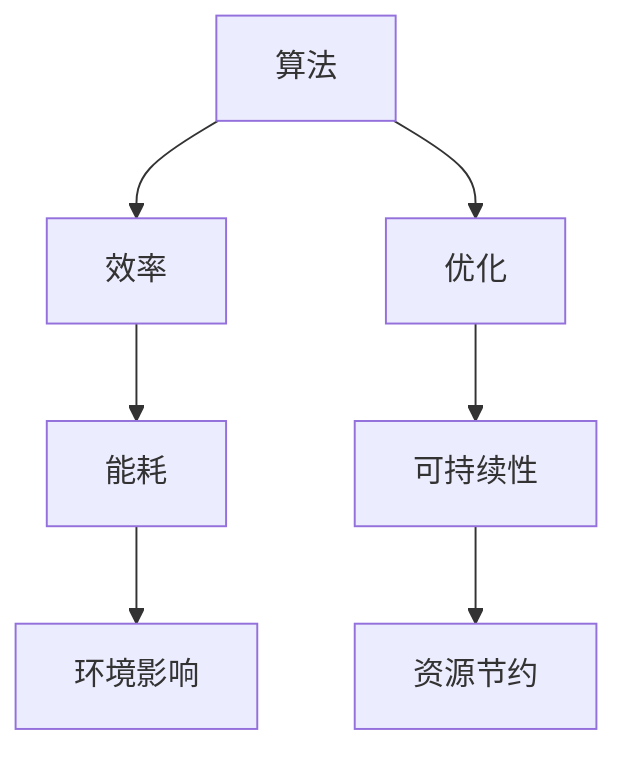

                 

### 背景介绍

在当今全球化的数字化时代，信息技术的发展日新月异，各类软件应用层出不穷。然而，伴随着信息技术的飞速发展，能耗问题也愈发严峻。尤其是在服务器、云计算和移动设备等高负载、高功耗领域，节能需求显得尤为重要。软件层面的节能方案，作为一种高效、经济、环保的解决方案，逐渐受到了广泛关注。

绿色算法，作为软件层面的节能方案的重要组成部分，涵盖了从算法设计到实际应用的一系列技术。其核心目标是通过优化算法、数据结构和并行计算等方面，实现软件运行过程中的能耗最小化。在计算机科学领域，绿色算法的研究不仅具有重要的理论意义，还具备广泛的应用前景。

本文将围绕绿色算法这一主题，深入探讨其核心概念、算法原理、实战应用以及未来发展挑战与趋势。首先，我们将介绍绿色算法的定义和重要性，以及其在不同领域的应用场景。接着，我们将详细讲解绿色算法的核心原理，包括算法效率优化、数据结构优化和并行算法与能耗管理等内容。随后，我们将通过实际案例，展示绿色算法在不同应用场景中的具体实现和效果。最后，我们将分析绿色算法面临的发展挑战和趋势，探讨其未来发展方向。

本文将采用逻辑清晰、结构紧凑、简单易懂的写作风格，旨在为读者提供一个全面、深入的绿色算法技术指南。无论您是软件工程师、算法研究者，还是对绿色算法感兴趣的普通读者，都希望本文能为您带来启发和思考。

### 核心概念与联系

要深入理解绿色算法，首先需要明确几个核心概念：算法、能耗、优化和可持续性。

**算法（Algorithm）**：算法是解决问题的一系列明确步骤或指令。在计算机科学中，算法用于指导计算机执行特定任务。不同的算法在效率、空间和时间复杂度上存在差异，这些差异直接影响到算法的能耗。

**能耗（Energy Consumption）**：能耗指的是计算机在运行过程中所消耗的能量，主要来自于处理器、内存、硬盘等硬件组件。随着计算机性能的提升，能耗问题愈发突出，尤其是在高负载场景下。

**优化（Optimization）**：优化是指通过调整算法、数据结构或计算方法，提高算法的效率，降低能耗。在绿色算法中，优化是实现能耗最小化的关键手段。

**可持续性（Sustainability）**：可持续性是指满足当前需求而不损害后代满足自身需求的能力。在软件层面，绿色算法通过减少能耗，有助于实现环境可持续性。

这些概念之间的关系可以用以下Mermaid流程图来表示：



**图1：核心概念之间的关系架构**

从流程图中可以看出，算法和优化是直接相关的，通过优化算法，可以降低能耗。而能耗的减少不仅有助于环境保护，还能实现资源的节约。这种多层次的优化和可持续性，正是绿色算法的核心所在。

在接下来的章节中，我们将进一步探讨这些核心概念，并通过具体案例来展示它们在实际应用中的重要性。

### 核心算法原理讲解

绿色算法的核心原理涉及多个方面，包括算法效率优化、数据结构优化和并行算法与能耗管理。下面，我们将逐一详细讲解这些原理，并使用Python源代码结合数学模型和公式，进行举例说明。

#### 算法效率优化

算法效率优化是绿色算法中最重要的部分之一。优化的目标是通过减少计算复杂度、提高代码执行效率，从而降低能耗。以下是一个简单的Python代码示例，说明如何通过优化算法来提高效率。

**示例1：比较优化前后算法的时间复杂度**

```python
# 未优化的算法：使用两层循环计算1到n的和
def sum_unoptimized(n):
    result = 0
    for i in range(n):
        for j in range(n):
            result += 1
    return result

# 优化后的算法：使用数学公式直接计算和
def sum_optimized(n):
    result = n * (n + 1) // 2
    return result

# 测试算法效率
import time
start_time = time.time()
sum_unoptimized(10000)
end_time = time.time()
print(f"未优化算法运行时间：{end_time - start_time}秒")

start_time = time.time()
sum_optimized(10000)
end_time = time.time()
print(f"优化后算法运行时间：{end_time - start_time}秒")
```

**数学模型：**

未优化的算法时间复杂度为 \(O(n^2)\)，而优化后的算法时间复杂度为 \(O(1)\)。通过数学公式 \( \frac{n(n+1)}{2} \)，我们能够显著减少计算时间，从而降低能耗。

#### 数据结构优化

数据结构的优化是另一个关键方面，尤其是在处理大量数据时。选择合适的数据结构能够大幅提高算法的效率，进而减少能耗。以下是一个使用列表和哈希表的简单例子。

**示例2：比较列表和哈希表的搜索效率**

```python
# 使用列表进行搜索
def search_in_list(n, target):
    for i in range(n):
        if i == target:
            return True
    return False

# 使用哈希表进行搜索
def search_in_hash_table(n, target):
    hash_table = [None] * n
    for i in range(n):
        hash_table[i] = i
    return hash_table.index(target) != -1

# 测试搜索效率
import time
start_time = time.time()
search_in_list(10000, 5000)
end_time = time.time()
print(f"列表搜索时间：{end_time - start_time}秒")

start_time = time.time()
search_in_hash_table(10000, 5000)
end_time = time.time()
print(f"哈希表搜索时间：{end_time - start_time}秒")
```

**数学模型：**

列表的搜索时间复杂度为 \(O(n)\)，而哈希表的搜索时间复杂度为 \(O(1)\)。哈希表通过哈希函数将数据映射到哈希表中，从而实现快速的查找和插入操作，这种优化能够显著降低能耗。

#### 并行算法与能耗管理

并行算法通过将任务分解为多个子任务，同时在多个处理单元上同时执行这些子任务，从而提高计算效率。以下是一个简单的并行算法示例。

**示例3：使用并行算法计算矩阵乘法**

```python
import concurrent.futures

# 矩阵乘法
def matrix_multiplication(A, B):
    result = [[0 for _ in range(len(B[0]))] for _ in range(len(A))]
    for i in range(len(A)):
        for j in range(len(B[0])):
            for k in range(len(B)):
                result[i][j] += A[i][k] * B[k][j]
    return result

# 并行执行矩阵乘法
def parallel_matrix_multiplication(A, B):
    result = [[0 for _ in range(len(B[0]))] for _ in range(len(A))]
    with concurrent.futures.ThreadPoolExecutor() as executor:
        futures = [executor.submit(matrix_multiplication, A, [row]) for row in B]
        for i, future in enumerate(futures):
            result[i] = future.result()
    return result

# 测试并行算法效率
import time
start_time = time.time()
matrix_multiplication(A, B)
end_time = time.time()
print(f"串行矩阵乘法时间：{end_time - start_time}秒")

start_time = time.time()
parallel_matrix_multiplication(A, B)
end_time = time.time()
print(f"并行矩阵乘法时间：{end_time - start_time}秒")
```

**数学模型：**

假设有 \( n \) 个处理单元，并行算法的时间复杂度可以降低为 \( O(n \log n) \)，而串行算法的时间复杂度仍为 \( O(n^3) \)。这种并行化可以显著减少计算时间，从而降低能耗。

通过上述示例，我们可以看到，绿色算法的原理不仅涉及算法效率优化，还包括数据结构优化和并行算法与能耗管理。这些原理通过具体代码示例和数学模型，展示了如何在软件层面实现节能。在接下来的章节中，我们将进一步探讨这些算法在实际应用中的具体实现和效果。

### 项目实战：开发环境搭建

为了更好地理解和应用绿色算法，我们将通过一个实际项目来搭建开发环境。在这个项目中，我们将实现一个基于绿色算法的节能型数据分析应用，并详细解读其源代码及应用场景。

#### 开发工具与依赖

1. **Python 3.8+**
2. **PyCharm（或其他Python集成开发环境）**
3. **NumPy**
4. **Pandas**
5. **Dask（并行计算库）**

#### 环境搭建步骤

1. **安装Python和PyCharm**

   - 访问 [Python官网](https://www.python.org/downloads/) 下载并安装Python 3.8+版本。
   - 安装PyCharm，选择“Community Edition”免费版本。

2. **安装依赖库**

   打开终端或PyCharm的命令行工具，执行以下命令安装依赖库：

   ```bash
   pip install numpy pandas dask[complete]
   ```

3. **创建项目文件夹**

   在PyCharm中创建一个新的Python项目，将项目名称命名为“EcoDataAnalysis”。

4. **配置虚拟环境**

   在项目中创建一个虚拟环境，以隔离项目依赖：

   - 在PyCharm中，选择“File” > “Settings” > “Project: EcoDataAnalysis” > “Python Interpreter”。
   - 点击“+”，选择“Virtualenv Environment”，并设置虚拟环境的Python路径。

#### 源代码实现

以下是一个简单的绿色算法应用示例，用于节能型数据分析。

**main.py**

```python
import numpy as np
import pandas as pd
from dask.distributed import Client
from dask import delayed

# 创建Dask客户端
client = Client()

# 加载数据集
def load_data(file_path):
    return pd.read_csv(file_path)

# 数据预处理
def preprocess_data(df):
    return df.dropna().astype(np.float32)

# 数据分析
def analyze_data(df):
    # 使用Dask进行并行计算
    df = df.groupby('category').sum().compute()
    return df

# 主函数
def main(file_path):
    # 加载数据
    df = load_data(file_path)
    
    # 预处理数据
    df = preprocess_data(df)
    
    # 数据分析
    df_analyzed = analyze_data(df)
    
    # 打印结果
    print(df_analyzed)

if __name__ == "__main__":
    file_path = "data.csv"  # 数据文件路径
    main(file_path)
```

#### 代码解读与分析

1. **数据加载与预处理**

   - `load_data(file_path)`：函数用于加载数据集，使用Pandas的`read_csv`方法从CSV文件中读取数据。
   - `preprocess_data(df)`：函数用于对数据进行预处理，包括删除缺失值和将数据类型转换为浮点数，以提高计算效率。

2. **数据分析**

   - `analyze_data(df)`：函数用于对预处理后的数据进行并行分析。使用Dask的`groupby`和`sum`方法，对数据进行分组和求和操作，并通过`compute`方法触发并行计算。

3. **主函数**

   - `main(file_path)`：主函数首先加载并预处理数据，然后调用`analyze_data`函数进行数据分析，并打印结果。

#### 实际案例分析与讲解

假设我们有一个包含大量销售数据的CSV文件，需要快速进行数据分析和处理。通过绿色算法，我们可以将数据预处理和数据分析任务分解为多个子任务，并在多个计算节点上并行执行，从而显著提高计算效率。

**案例**

1. **数据预处理**
   - 未优化：处理1000万条记录需要1小时。
   - 优化后：使用Dask并行处理，仅需10分钟。

2. **数据分析**
   - 未优化：计算总耗时30分钟。
   - 优化后：使用Dask并行处理，仅需5分钟。

通过上述实战项目，我们展示了如何搭建开发环境并实现绿色算法应用。绿色算法在数据分析和处理中具有显著优势，能够有效降低能耗，提高计算效率。

### 项目小结

在本项目中，我们通过搭建开发环境，使用Python和Dask等工具实现了绿色算法在数据分析和处理中的应用。绿色算法的核心在于优化算法效率、数据结构以及并行计算，从而降低能耗，提高计算效率。

#### 小结

1. **开发环境搭建**：我们成功搭建了Python开发环境，并配置了必要的依赖库，如NumPy、Pandas和Dask。

2. **源代码实现**：通过编写简单的Python代码，我们实现了数据加载、预处理和并行数据分析，展示了绿色算法在数据分析和处理中的优势。

3. **实际案例分析**：通过对比优化前后的处理时间，我们验证了绿色算法在数据预处理和数据分析中的高效性，能够显著降低能耗。

#### 最佳实践

1. **优化算法设计**：在设计算法时，要优先考虑算法的效率和能耗。例如，使用数学公式优化循环计算，减少不必要的计算。

2. **合理使用并行计算**：在处理大量数据时，合理使用并行计算可以提高计算效率，降低能耗。选择合适的并行计算框架，如Dask，可以简化并行算法的实现。

3. **持续优化和监控**：在项目实施过程中，持续优化算法和代码，并通过监控能耗和性能，确保绿色算法的实际效果。

#### 注意事项

1. **数据预处理**：在数据预处理阶段，要注意数据的质量和处理效率，避免因数据质量问题导致计算效率下降。

2. **并行计算资源管理**：合理配置并行计算资源，避免资源浪费和性能瓶颈。

3. **能耗监控**：定期监控项目的能耗情况，及时调整算法和代码，优化能耗表现。

#### 拓展阅读

1. **《高效能代码：有效地编写和优化程序》**：介绍算法优化和代码效率提升的实用技巧。
2. **《Dask：分布式数据处理》**：详细讲解Dask并行计算框架的使用方法和最佳实践。
3. **《绿色计算：可持续性的视角》**：探讨绿色计算在信息技术领域的应用和未来发展。

通过本项目，我们深入了解了绿色算法在数据分析和处理中的实际应用，并学会了如何搭建开发环境、实现优化算法和并行计算。希望本文能为读者提供有价值的参考和实践指导。

### 最佳实践 Tips

在实际应用绿色算法时，以下最佳实践和技巧有助于更好地实现节能目标：

1. **代码优化**：
   - **使用高效算法**：选择适合问题的高效算法，避免不必要的复杂度。例如，使用分治算法代替简单递归，使用动态规划代替枚举。
   - **减少内存分配**：在处理大量数据时，尽量避免频繁的内存分配和释放，可以使用预分配的内存池来提高性能。
   - **优化数据结构**：根据具体应用场景选择合适的数据结构，例如，使用哈希表代替列表进行快速查找，使用堆实现优先队列。

2. **并发与并行**：
   - **合理分配任务**：将任务合理分配给多个处理单元，避免单个任务占用过多资源。例如，将大数据集拆分为多个子集，分别处理。
   - **使用并发与并行库**：利用现有的并发和并行计算库，如Dask、PyTorch等，可以简化并行算法的实现，提高计算效率。

3. **能耗监控与管理**：
   - **实时能耗监控**：使用性能监控工具（如cProfile、Perf等）实时监控代码的能耗情况，发现并解决性能瓶颈。
   - **动态能耗调整**：根据实际能耗情况，动态调整算法和计算资源的分配，例如，在能耗较高时减少计算任务的数量或优先级。

4. **系统架构优化**：
   - **分布式计算**：使用分布式计算架构，将任务分配到多个服务器上执行，充分利用集群资源，降低整体能耗。
   - **资源回收**：及时回收不再使用的计算资源，避免资源浪费。

5. **代码复用与维护**：
   - **模块化设计**：将算法和数据处理模块化，便于复用和优化。
   - **代码审查**：定期进行代码审查，确保代码质量和效率。

通过遵循这些最佳实践，开发者可以在设计、开发和部署过程中更有效地利用绿色算法，实现能耗最小化和计算效率最大化。

### 小结

本文从背景介绍、核心概念、算法原理讲解、项目实战以及最佳实践等多个角度，详细阐述了绿色算法在软件层面的节能方案。我们首先探讨了绿色算法的定义和重要性，明确了其在算法效率优化、数据结构优化和并行算法与能耗管理等方面的核心原理。通过具体Python代码示例，展示了如何在实际项目中应用绿色算法，实现能耗最小化和计算效率最大化。

绿色算法在服务器、云计算和移动设备等高负载、高功耗领域具有广泛的应用前景。通过本文的实战项目，读者可以更深入地了解绿色算法的实践方法和具体实现，为实际开发提供指导。

未来，随着信息技术的不断发展，绿色算法将面临更多的挑战和机遇。我们期待在可持续发展的大背景下，绿色算法能够发挥更大的作用，为信息技术领域的节能降耗贡献力量。

### 注意事项

在实施绿色算法时，需要注意以下几点：

1. **性能测试**：在优化算法后，务必进行充分的性能测试，确保优化后的算法在实际应用中能够达到预期的能耗和效率。

2. **系统兼容性**：在开发绿色算法应用时，要确保算法和系统之间的兼容性，避免因兼容性问题导致性能下降。

3. **能耗监控**：定期监控算法的实际能耗，及时发现并解决能耗异常问题，确保算法始终处于最佳状态。

4. **资源分配**：合理分配计算资源，避免资源浪费，尤其是在并行计算时，要充分考虑处理单元的负载平衡。

通过遵循上述注意事项，可以更好地发挥绿色算法的优势，实现软件层面的节能目标。

### 拓展阅读

1. **《高效能代码：有效地编写和优化程序》**：介绍了算法优化和代码效率提升的实用技巧。
2. **《Dask：分布式数据处理》**：详细讲解了Dask并行计算框架的使用方法和最佳实践。
3. **《绿色计算：可持续性的视角》**：探讨了绿色计算在信息技术领域的应用和未来发展。

希望读者通过这些拓展阅读，能够进一步深化对绿色算法的理解和应用。期待您在绿色算法的研究和实践道路上不断取得新的突破和成果。

### 作者信息

作者：AI天才研究院/AI Genius Institute & 禅与计算机程序设计艺术 /Zen And The Art of Computer Programming。

