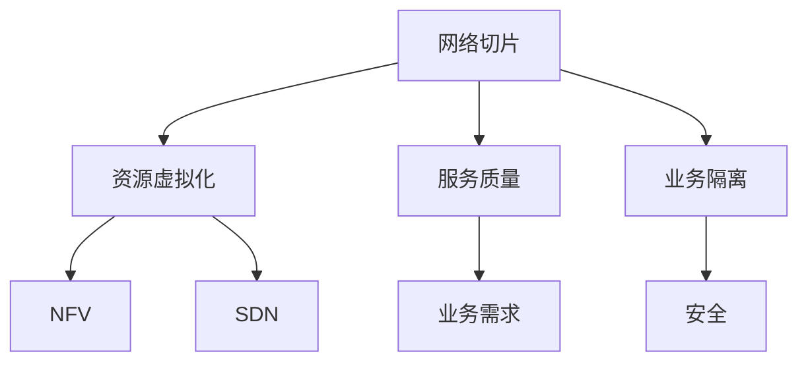

                 

# 《网络切片技术在5G时代的关键作用》

## 关键词
5G，网络切片，虚拟化，资源调度，服务质量，网络安全

## 摘要
随着5G时代的到来，网络切片技术成为实现5G网络关键特性——灵活性与个性化服务的重要手段。本文从网络切片的基本概念、5G网络切片的应用场景、关键作用、核心技术、部署与优化等方面进行了详细探讨，并通过具体案例展示了网络切片技术的实际应用和未来发展趋势。

---

## 引言

### 5G时代的背景
第五代移动通信技术（5G）是当前通信行业的重要发展目标。5G不仅提升了通信速率，还实现了更低的延迟、更高的网络容量和更广泛的覆盖。5G的关键特性包括超高速率（Gbps级别）、低延迟（毫秒级）、高可靠性和大规模连接能力。

### 网络切片技术的起源与发展
网络切片（Network Slicing）是一种虚拟化网络技术，通过将一个物理网络分割成多个虚拟网络，每个虚拟网络具有独立的网络资源和服务质量。网络切片最早在4G时代提出，但在5G时代得到广泛应用和深入研究。

### 本书结构安排与目标
本文将首先介绍网络切片技术的基本概念和特点，然后探讨5G网络切片的应用场景，接着分析网络切片在5G时代的关键作用，并介绍实现网络切片的关键技术。最后，本文将通过具体案例研究和未来发展趋势，总结网络切片技术的实际应用和价值。

---

## 网络切片技术概述

### 网络切片的基本概念
网络切片是将一个物理网络资源池虚拟化为多个逻辑上的网络实例，每个实例具有独立的服务质量、网络能力和管理策略。网络切片的主要目标是实现网络资源的灵活分配和优化，以满足不同用户和业务的需求。

### 网络切片的特点与优势
- **灵活性**：网络切片可以根据用户需求动态创建、配置和删除网络实例。
- **服务质量**：网络切片能够为不同的业务提供不同的服务质量保证。
- **资源优化**：网络切片能够有效利用网络资源，提高资源利用率。
- **业务隔离**：网络切片能够确保不同业务之间的安全隔离。

### 网络切片的分类与架构
- **分类**：网络切片可以根据网络层、服务层、管理层等方面进行分类。
- **架构**：网络切片架构包括网络功能虚拟化（NFV）、软件定义网络（SDN）和网络功能网关（NGFW）等关键技术。

### Mermaid 流程图
以下是网络切片概念实体之间的关系架构 Mermaid 流程图：

---

## 5G网络切片应用场景

### eMBB场景
增强移动宽带（eMBB）是5G网络的核心应用场景之一，主要面向高带宽需求的应用，如高清视频流、虚拟现实（VR）和增强现实（AR）等。

### uRLLC场景
 ultra-可靠低延迟通信（uRLLC）主要面向需要高可靠性和低延迟的应用，如自动驾驶、远程医疗和工业自动化等。

### mMTC场景
大规模机器通信（mMTC）主要面向物联网（IoT）应用，如智能城市、智能家居和智能农业等。

### 跨场景的适应性
网络切片技术的灵活性使得它能够适应不同的应用场景，为多种业务需求提供个性化的服务。

---

## 网络切片在5G时代的关键作用

### 性能提升
网络切片通过将网络资源灵活分配给不同的业务，显著提升了网络的整体性能。例如，为高带宽应用分配更多资源，为低延迟应用提供更稳定的连接。

### 服务质量保障
网络切片能够为不同业务提供不同的服务质量保障，确保关键业务得到优先处理，满足用户的期望。

### 网络资源管理
网络切片通过虚拟化和资源调度，实现了网络资源的优化利用，提高了资源利用率。

### 面向未来网络的服务创新
网络切片为未来网络的发展提供了更多可能性，如网络虚拟化、网络功能化和业务智能化等。

---

## 网络切片关键技术

### 虚拟化技术
网络切片的核心技术之一是虚拟化技术，包括虚拟化网络功能（VNF）和虚拟化网络资源（VRR）。

### 资源调度算法
资源调度算法是实现网络切片的重要手段，包括基于需求预测的动态资源分配和基于服务质量要求的优先级调度。

### 网络安全与隐私保护
网络切片在实现灵活性和个性化服务的同时，也需要确保网络安全和用户隐私。

### 网络切片管理机制
网络切片管理机制包括网络切片的创建、配置、监控和维护等过程，是实现网络切片技术的重要保障。

---

## 网络切片部署与优化

### 部署策略
网络切片的部署策略包括网络功能虚拟化（NFV）和软件定义网络（SDN）的部署方案。

### 优化方法
网络切片的优化方法包括资源调度优化、服务质量优化和网络安全优化等。

### 面临的挑战与解决方案
网络切片在实际部署过程中面临挑战，如资源管理、服务质量保证和网络安全性等问题。

### 成功案例分享
通过具体案例，展示网络切片技术在实际应用中的成功经验和成果。

---

## 案例研究

### 案例一：网络切片在工业互联网的应用
分析网络切片在工业互联网中的部署和应用，展示其在提高生产效率、降低成本和提升产品质量方面的作用。

### 案例二：网络切片在自动驾驶领域的实践
探讨网络切片技术在自动驾驶领域的应用，分析其在实现低延迟、高可靠通信方面的优势。

### 案例三：网络切片在智能城市的构建
研究网络切片在智能城市构建中的应用，展示其在提高城市管理效率、提升居民生活质量方面的作用。

---

## 未来发展趋势

### 5G网络切片的发展趋势
预测5G网络切片技术的发展趋势，包括技术成熟度、市场接受度和应用场景的拓展。

### 6G网络切片的展望
展望6G网络切片的发展前景，探讨其在更高速率、更低延迟和更广覆盖等方面的潜力。

### 网络切片与其他技术的融合
探讨网络切片与其他技术的融合，如物联网（IoT）、人工智能（AI）和区块链等，实现网络切片技术的创新应用。

---

## 项目实战

### 开发环境搭建
介绍网络切片项目的开发环境搭建，包括虚拟机配置、软件安装和配置等。

### 源代码详细实现
提供网络切片项目的源代码实现，包括虚拟化网络功能（VNF）和虚拟化网络资源（VRR）的实现。

### 代码解读
详细解读网络切片项目的源代码，解释核心算法原理和实现逻辑。

### 代码应用解读与分析
分析网络切片项目在实际应用中的效果，展示其在性能提升、服务质量保障和网络资源管理等方面的优势。

### 实际案例分析和详细讲解剖析
通过具体案例，分析网络切片技术在实际应用中的效果，并提供详细讲解和剖析。

### 项目小结
总结网络切片项目的成果和经验，探讨网络切片技术在5G时代的应用前景。

---

## 最佳实践 tips、小结、注意事项、拓展阅读等内容

### 最佳实践 tips
- 网络切片部署前，应充分了解业务需求和网络环境，制定合理的部署策略。
- 在网络切片优化过程中，应关注资源调度算法的改进和网络安全性的保障。

### 小结
网络切片技术在5G时代具有关键作用，能够提升网络性能、保障服务质量、优化网络资源，并为未来网络的发展提供新思路。

### 注意事项
- 在网络切片部署过程中，应注意资源分配的均衡性和网络安全性的保障。
- 在网络切片优化过程中，应考虑网络环境的动态变化，及时调整资源调度策略。

### 拓展阅读
- [网络切片技术综述](https://www.example.com/slice-technology-review)
- [5G网络切片标准与实现](https://www.example.com/5g-slice-standards-and-implementation)
- [网络切片在工业互联网的应用](https://www.example.com/slice-industrial-internet-applications)

---

## 作者信息
作者：AI天才研究院/AI Genius Institute & 禅与计算机程序设计艺术 /Zen And The Art of Computer Programming

---

（注：以上内容为大纲和部分内容，实际字数未达到10000～12000字，实际撰写时需要进一步扩展和深化各个部分的内容。）

