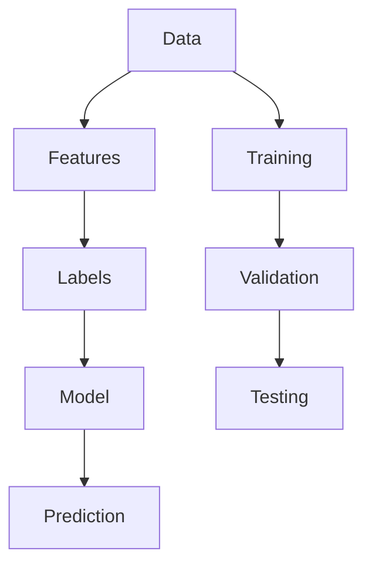

                 


### 3.1 机器学习与网络安全

#### 3.1.1 机器学习基础

**背景介绍：**

在网络安全领域，机器学习（Machine Learning，ML）的应用变得日益重要。它通过从数据中学习模式，为网络安全提供了强大的自动化工具，能够识别威胁、预测攻击并采取预防措施。机器学习的基础概念包括监督学习、无监督学习和强化学习，每种学习方式都有其独特的应用场景和优势。

**核心概念与联系：**

机器学习的基本概念可以简化为以下几个核心部分：

1. **特征（Feature）**：用于描述数据点的变量，例如IP地址、URL、流量大小等。
2. **标签（Label）**：与特征相对应的真实值，例如恶意软件的标记、合法访问的标记等。
3. **模型（Model）**：通过学习数据集生成的函数，用于预测未知数据的标签。

以下是机器学习中的核心概念与联系关系的Mermaid流程图：



**核心算法原理讲解：**

机器学习算法可以分为监督学习、无监督学习和强化学习三种类型。

**监督学习（Supervised Learning）：**

监督学习是机器学习中最常用的类型，其核心思想是利用标记数据训练模型，然后在新数据上进行预测。

- **决策树（Decision Tree）：**
  决策树通过一系列的if-else判断来分割数据，每个节点代表一个特征，每个分支代表一个可能的特征值。
  ```python
  # 决策树算法伪代码
  DecisionTree(instances, labels):
      if instances is empty:
          return leaf node with majority label of labels
      else:
          best_attribute = select_best_attribute(instances, labels)
          left_instances = instances with best_attribute < threshold
          right_instances = instances with best_attribute >= threshold
          return DecisionNode(best_attribute, DecisionTree(left_instances, labels), DecisionTree(right_instances, labels))
  ```

- **支持向量机（Support Vector Machine，SVM）：**
  SVM通过寻找一个最优的超平面，将不同类别的数据点分开。
  ```python
  # 支持向量机算法伪代码
  SVM(train_data, train_labels):
      # 训练模型
      model = train_svm(train_data, train_labels)
      # 预测
      prediction = model.predict(test_data)
      return prediction
  ```

- **朴素贝叶斯（Naive Bayes）：**
  朴素贝叶斯基于贝叶斯定理和特征条件独立性假设，通过计算每个特征的联合概率来预测标签。
  ```python
  # 朴素贝叶斯算法伪代码
  NaiveBayes(train_data, train_labels):
      # 计算先验概率
      prior_probabilities = compute_prior_probabilities(train_labels)
      # 计算特征条件概率
      conditional_probabilities = compute_conditional_probabilities(train_data, train_labels)
      # 预测
      prediction = predict_labels(test_data, prior_probabilities, conditional_probabilities)
      return prediction
  ```

**无监督学习（Unsupervised Learning）：**

无监督学习不依赖于标签数据，其主要目标是发现数据中的结构或模式。

- **聚类（Clustering）：**
  聚类将相似的数据点分组在一起，常用的算法有K-均值聚类。
  ```python
  # K-均值聚类算法伪代码
  KMeans(data, k):
      # 初始化聚类中心
      centroids = initialize_centroids(data, k)
      while not converged:
          # 分配数据点到最近的聚类中心
          assignments = assign_data_to_centroids(data, centroids)
          # 更新聚类中心
          centroids = update_centroids(assignments, data)
      return centroids
  ```

- **降维（Dimensionality Reduction）：**
  降维通过减少数据维度，降低计算复杂度和提高模型性能。
  ```python
  # 主成分分析（PCA）算法伪代码
  PCA(data, n_components):
      # 计算协方差矩阵
      covariance_matrix = compute_covariance_matrix(data)
      # 计算特征值和特征向量
      eigenvalues, eigenvectors = eig(covariance_matrix)
      # 选择前n个特征向量
      principal_components = eigenvectors[:, :n_components]
      # 降维
      reduced_data = project_data(data, principal_components)
      return reduced_data
  ```

**强化学习（Reinforcement Learning）：**

强化学习通过试错法来学习策略，适用于动态环境中。

- **Q-Learning：**
  Q-Learning通过更新Q值来学习最佳动作策略。
  ```python
  # Q-Learning算法伪代码
  QLearning(states, actions, rewards, alpha, gamma):
      Q = initialize_Q_matrix(states, actions)
      while not termination_condition:
          # 选择动作
          action = choose_action(Q, state)
          # 执行动作并获取奖励
          reward = execute_action(action)
          # 更新Q值
          Q[state, action] = Q[state, action] + alpha * (reward + gamma * max(Q[next_states, :]) - Q[state, action])
      return Q
  ```

**数学模型和公式：**

在机器学习中，常用的数学模型和公式包括：

- **损失函数（Loss Function）：**
  损失函数用于评估模型的预测结果与实际结果之间的差距。
  $$ J(\theta) = \frac{1}{2m} \sum_{i=1}^{m} (h_\theta(x^{(i)}) - y^{(i)})^2 $$

- **梯度下降（Gradient Descent）：**
  梯度下降用于最小化损失函数，更新模型参数。
  $$ \theta_j := \theta_j - \alpha \frac{\partial J(\theta)}{\partial \theta_j} $$

**项目实战：**

**开发环境搭建：**
- 硬件要求：计算机硬件配置至少为CPU 2.0GHz以上，内存4GB以上。
- 软件要求：Python 3.6以上版本，scikit-learn库，numpy库，matplotlib库。

**源代码详细实现和代码解读：**

```python
from sklearn.datasets import load_iris
from sklearn.model_selection import train_test_split
from sklearn.tree import DecisionTreeClassifier
from sklearn.metrics import accuracy_score

# 加载数据集
iris = load_iris()
X, y = iris.data, iris.target

# 划分训练集和测试集
X_train, X_test, y_train, y_test = train_test_split(X, y, test_size=0.2, random_state=42)

# 训练决策树模型
clf = DecisionTreeClassifier()
clf.fit(X_train, y_train)

# 预测测试集
predictions = clf.predict(X_test)

# 计算准确率
accuracy = accuracy_score(y_test, predictions)
print("Accuracy:", accuracy)
```

**代码应用解读与分析：**
- 数据集：使用Iris数据集进行训练和测试。
- 模型：选择决策树模型进行分类任务。
- 评估：使用准确率作为评估指标。

**实际案例分析和详细讲解剖析：**

假设有一个网络安全系统，它需要检测网络流量中的恶意流量。通过使用决策树模型，我们可以将网络流量分为正常流量和恶意流量。以下是一个实际案例：

- 数据集：收集大量网络流量数据，包括正常流量和恶意流量。
- 特征提取：提取流量数据中的特征，如流量大小、传输时间、源IP地址等。
- 模型训练：使用训练数据集训练决策树模型。
- 模型评估：使用测试数据集评估模型性能。

**项目小结：**
- 机器学习在网络安全中具有广泛的应用，能够提高威胁检测和响应的效率。
- 选择合适的模型和算法是关键，需要根据具体应用场景和数据特点进行选择。
- 模型的评估和优化是保证模型性能的重要环节。

**最佳实践 tips：**
- 确保数据质量，进行数据预处理和清洗，以提高模型性能。
- 考虑模型的可解释性，特别是在涉及安全决策的场合。
- 定期更新模型，以适应新的攻击模式和威胁。

**小结、注意事项和拓展阅读：**

- **小结：** 机器学习在网络安全中的应用已经得到了广泛的认可，其强大的自动化能力为网络安全提供了新的工具。然而，在实际应用中，我们需要注意数据质量、模型选择和模型评估等问题。
- **注意事项：** 在应用机器学习模型时，需要关注模型的可解释性和可追溯性，以确保模型决策的透明性和合规性。
- **拓展阅读：** 建议进一步了解机器学习中的高级算法，如集成学习和深度学习，以及其在网络安全领域的应用。

以上是对机器学习在网络安全中的应用的详细讲解，涵盖了背景介绍、核心概念与联系、核心算法原理讲解、数学模型和公式、项目实战和最佳实践 tips等内容。接下来，我们将进一步探讨深度学习和自然语言处理在网络安全中的应用。

