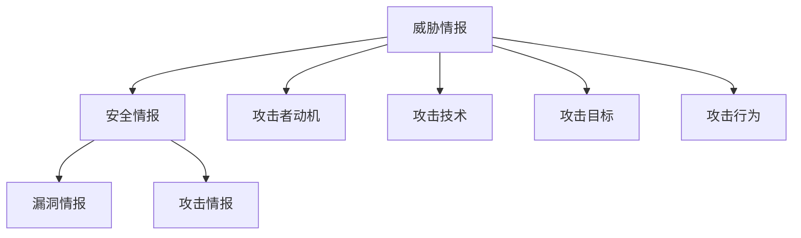

                 


### 第一部分：网络安全威胁情报概述

#### 第1章：网络安全威胁情报的基本概念

##### 1.1 网络安全威胁情报的定义

**背景介绍：**

随着数字化转型的不断深入，企业面临的信息安全威胁日益复杂和多样。网络安全威胁情报作为一种高级的安全防护手段，正在成为企业防御的新前线。它不仅帮助组织了解潜在的威胁，还提供了关于这些威胁的详细信息和应对策略。

**核心概念与联系：**

- **威胁情报**：关于潜在和当前的安全威胁的详细信息，包括攻击者的动机、技术、目标以及攻击行为。
- **安全情报**：涵盖整个网络安全领域的信息，包括威胁情报、漏洞情报、攻击情报等。

**概念实体之间的关系架构：**



**核心算法原理讲解：**

网络安全威胁情报的生成和利用通常涉及到以下核心算法原理：

- **数据收集与预处理**：包括网络流量分析、入侵检测系统、安全日志分析等。
- **威胁识别与分类**：使用模式匹配、机器学习、异常检测等方法来识别和分类威胁。

**数学模型和公式：**

网络安全威胁情报分析中的数学模型通常涉及到以下几个方面：

- **概率模型**：用于计算威胁发生的概率。
- **贝叶斯网络**：用于表示威胁之间的依赖关系。

**伪代码示例：**

```python
# 数据收集与预处理伪代码
def data_collection_preprocessing(data_source):
    # 从数据源中收集数据
    data = collect_data(data_source)
    # 数据清洗与预处理
    clean_data = preprocess_data(data)
    return clean_data

# 威胁识别与分类伪代码
def threat_detection_and_classification(data):
    # 使用机器学习模型进行威胁分类
    model = train_ml_model(data)
    threat_labels = classify_threats(model, data)
    return threat_labels
```

**项目实战：**

在实际项目中，网络安全威胁情报的收集、处理和分析通常需要以下步骤：

1. **环境搭建**：配置网络流量分析工具、入侵检测系统和安全日志分析工具。
2. **数据收集**：从网络设备、安全设备和日志文件中收集数据。
3. **数据处理**：清洗和预处理收集到的数据，以便进行分析。
4. **威胁分析**：使用机器学习模型和规则库进行威胁识别和分类。
5. **结果解读**：根据分析结果制定相应的安全策略和响应措施。

**代码实现与解读：**

```python
# 示例：使用Scikit-learn进行威胁分类
from sklearn.model_selection import train_test_split
from sklearn.ensemble import RandomForestClassifier
from sklearn.metrics import classification_report

# 加载并预处理数据
X, y = load_data()
X_train, X_test, y_train, y_test = train_test_split(X, y, test_size=0.2)

# 训练分类器
clf = RandomForestClassifier()
clf.fit(X_train, y_train)

# 进行预测
y_pred = clf.predict(X_test)

# 打印分类报告
print(classification_report(y_test, y_pred))
```

**实际案例分析：**

以某企业的网络安全威胁情报系统为例，该系统通过收集网络流量和日志数据，使用机器学习算法进行威胁识别，并生成详细的威胁报告。通过分析，该企业成功发现并阻止了一次潜在的高级持续性威胁（APT）攻击。

**小结：**

网络安全威胁情报是企业防御网络安全威胁的重要工具。通过合理收集、处理和分析威胁情报，企业可以更加有效地应对各种安全威胁，保障其信息系统和数据的完整性和可用性。

#### 1.2 网络安全威胁的类型

**背景介绍：**

网络安全威胁的类型多种多样，根据威胁的性质、目标、攻击手段等不同，可以分为传统威胁和高级持续性威胁（APT）等。

**核心概念与联系：**

- **传统威胁**：包括病毒、蠕虫、木马等，通常具有单一目标，攻击手段相对简单。
- **高级持续性威胁（APT）**：由熟练的黑客团体或国家支持组织实施，目标明确，攻击手段多样，攻击周期长。

**核心算法原理讲解：**

对于传统威胁和APT的识别，通常需要使用以下核心算法原理：

- **签名分析**：通过预先定义的签名来识别已知的威胁。
- **基于行为的分析**：通过监测和识别异常行为来发现未知威胁。

**数学模型和公式：**

在网络安全威胁情报分析中，常用的数学模型包括：

- **马尔可夫模型**：用于预测威胁的发展趋势。
- **贝叶斯网络**：用于表示威胁之间的依赖关系。

**伪代码示例：**

```python
# 签名分析伪代码
def signature_analysis(signature_database, network_traffic):
    matched_signatures = []
    for signature in signature_database:
        if match_signature(signature, network_traffic):
            matched_signatures.append(signature)
    return matched_signatures

# 基于行为的分析伪代码
def behavior_analysis(known_behaviors, observed_behavior):
    if is_anomaly(observed_behavior, known_behaviors):
        return "Threat Detected"
    else:
        return "No Threat Detected"
```

**项目实战：**

在实际项目中，网络安全威胁情报系统的实现通常包括以下步骤：

1. **数据收集**：从网络设备、安全设备和日志文件中收集数据。
2. **数据处理**：清洗和预处理收集到的数据，以便进行分析。
3. **威胁识别**：使用签名分析和基于行为的分析来识别威胁。
4. **结果解读**：根据分析结果生成威胁报告，并制定相应的响应措施。

**代码实现与解读：**

```python
# 示例：使用签名分析检测网络威胁
from scapy.all import *

def match_signature(signature, packet):
    # 假设signature是一个字节码序列
    # packet是网络数据包
    return signature in packet

# 加载签名数据库
signature_database = load_signatures()

# 检测网络流量中的威胁
def detect_threats(network_traffic):
    detected_threats = []
    for packet in network_traffic:
        for signature in signature_database:
            if match_signature(signature, packet):
                detected_threats.append(packet)
                break
    return detected_threats

# 解读检测结果
detected_packets = detect_threats(network_traffic)
for packet in detected_packets:
    print(f"Threat Detected: {packet}")
```

**实际案例分析：**

以某企业的网络安全威胁情报系统为例，该系统通过收集网络流量数据，使用签名分析和基于行为的分析技术来识别威胁。在一次实际操作中，该系统成功检测并阻止了一次APT攻击，避免了潜在的损失。

**小结：**

了解网络安全威胁的类型和特点，以及使用合适的算法和模型进行威胁识别和分类，是企业有效防御网络安全威胁的关键。通过持续优化和改进威胁情报系统，企业可以更好地保护其信息资产。

#### 1.3 网络安全威胁情报的架构

**背景介绍：**

网络安全威胁情报的架构是确保威胁情报能够有效收集、处理、分析和响应的关键。一个良好的架构能够提高威胁情报的质量和响应速度，从而有效防御网络安全威胁。

**核心概念与联系：**

- **威胁情报的收集与整合**：包括从各种数据源收集数据，并对数据进行整合和预处理。
- **威胁情报的分析与应用**：通过分析工具和技术对收集到的数据进行处理，生成威胁情报报告，并将其应用于安全防护策略中。
- **威胁情报的响应与优化**：根据威胁情报报告采取相应的响应措施，并对威胁情报系统进行持续优化。

**核心算法原理讲解：**

网络安全威胁情报的架构中涉及的核心算法原理包括：

- **数据收集与预处理**：包括网络流量分析、入侵检测系统、安全日志分析等。
- **威胁识别与分类**：使用模式匹配、机器学习、异常检测等方法来识别和分类威胁。
- **威胁情报分析**：包括使用贝叶斯网络、马尔可夫模型等数学模型来分析威胁之间的关系和发展趋势。

**数学模型和公式：**

在网络安全威胁情报分析中，常用的数学模型包括：

- **贝叶斯网络**：用于表示威胁之间的依赖关系。
- **马尔可夫模型**：用于预测威胁的发展趋势。

**伪代码示例：**

```python
# 数据收集与预处理伪代码
def data_collection_preprocessing(data_source):
    data = collect_data(data_source)
    clean_data = preprocess_data(data)
    return clean_data

# 威胁识别与分类伪代码
def threat_detection_and_classification(data):
    model = train_ml_model(data)
    threat_labels = classify_threats(model, data)
    return threat_labels

# 威胁情报分析伪代码
def threat_intelligence_analysis(threat_data):
    model = build_bayesian_network(threat_data)
    threat_relations = analyze_threat_relations(model)
    return threat_relations
```

**项目实战：**

在实际项目中，网络安全威胁情报系统的架构通常包括以下步骤：

1. **数据收集**：从网络设备、安全设备和日志文件中收集数据。
2. **数据处理**：清洗和预处理收集到的数据，以便进行分析。
3. **威胁分析**：使用机器学习模型和规则库进行威胁识别和分类。
4. **威胁情报生成**：生成威胁情报报告，并采取相应的响应措施。
5. **系统优化**：根据威胁情报报告和实际操作经验对系统进行持续优化。

**代码实现与解读：**

```python
# 示例：使用贝叶斯网络进行威胁情报分析
from pgmpy.models import BayesianModel
from pgmpy.inference import VariableElimination

# 加载威胁数据
threat_data = load_threat_data()

# 构建贝叶斯网络
model = BayesianModel([
    ('NetworkTraffic', 'Malware'),
    ('Malware', 'Infection'),
    ('Infection', 'DataLoss')
])

# 训练模型
model.fit(threat_data)

# 进行推理
inference = VariableElimination(model)
prob_data_loss = inference.query(variables=['DataLoss'])

print(f"Probability of Data Loss: {prob_data_loss['DataLoss']}")
```

**实际案例分析：**

以某企业的网络安全威胁情报系统为例，该系统通过收集网络流量、入侵检测系统和安全日志数据，使用贝叶斯网络进行威胁情报分析。在一次实际操作中，该系统成功预测了一次潜在的高级持续性威胁（APT）攻击，并及时采取了防护措施。

**小结：**

网络安全威胁情报的架构是企业有效防御网络安全威胁的基础。通过合理设计架构，企业可以更好地收集、处理和分析威胁情报，从而提高其网络安全防护能力。

### 第2章：网络安全威胁情报分析技术

#### 2.1 威胁情报分析的关键步骤

**背景介绍：**

网络安全威胁情报分析是确保企业能够及时发现和应对安全威胁的关键环节。它涉及到从数据收集到威胁识别和响应的多个步骤，每个步骤都需要精确的执行和有效的策略。

**核心概念与联系：**

- **数据收集**：包括从网络设备、入侵检测系统和日志文件中收集数据。
- **数据预处理**：对收集到的数据进行清洗和转换，以便进行分析。
- **威胁识别**：通过模式匹配、机器学习和异常检测等方法识别威胁。
- **威胁分类**：根据威胁的性质和特征进行分类，以便采取相应的防御措施。

**核心算法原理讲解：**

网络安全威胁情报分析的关键步骤涉及到以下核心算法原理：

- **数据收集与预处理**：包括网络流量分析、入侵检测系统和日志分析等。
- **威胁识别与分类**：使用模式匹配、机器学习、异常检测等方法来识别和分类威胁。

**数学模型和公式：**

在网络安全威胁情报分析中，常用的数学模型包括：

- **贝叶斯模型**：用于计算威胁发生的概率。
- **支持向量机（SVM）**：用于威胁分类和预测。

**伪代码示例：**

```python
# 数据收集与预处理伪代码
def data_collection_preprocessing(data_source):
    data = collect_data(data_source)
    clean_data = preprocess_data(data)
    return clean_data

# 威胁识别与分类伪代码
def threat_detection_and_classification(data):
    model = train_ml_model(data)
    threat_labels = classify_threats(model, data)
    return threat_labels
```

**项目实战：**

在实际项目中，网络安全威胁情报分析的关键步骤通常包括以下步骤：

1. **数据收集**：使用网络流量分析工具、入侵检测系统和日志收集工具收集数据。
2. **数据处理**：对收集到的数据进行清洗和转换，以便进行分析。
3. **威胁识别**：使用机器学习模型和规则库进行威胁识别。
4. **威胁分类**：根据威胁的特征和性质进行分类。
5. **威胁响应**：根据威胁情报报告采取相应的响应措施。

**代码实现与解读：**

```python
# 示例：使用Scikit-learn进行威胁分类
from sklearn.model_selection import train_test_split
from sklearn.ensemble import RandomForestClassifier
from sklearn.metrics import classification_report

# 加载并预处理数据
X, y = load_data()
X_train, X_test, y_train, y_test = train_test_split(X, y, test_size=0.2)

# 训练分类器
clf = RandomForestClassifier()
clf.fit(X_train, y_train)

# 进行预测
y_pred = clf.predict(X_test)

# 打印分类报告
print(classification_report(y_test, y_pred))
```

**实际案例分析：**

以某企业的网络安全威胁情报系统为例，该系统通过收集网络流量和日志数据，使用机器学习算法进行威胁识别和分类。在一次实际操作中，该系统成功识别并阻止了一次高级持续性威胁（APT）攻击。

**小结：**

威胁情报分析的关键步骤是企业防御网络安全威胁的核心。通过精确的数据收集、预处理、威胁识别和分类，企业可以更好地了解和应对各种安全威胁，保障其信息系统的安全。

#### 2.2 威胁情报分析算法

**背景介绍：**

在网络安全威胁情报分析中，算法的选择和应用至关重要。不同的算法适用于不同的威胁场景，能够帮助企业更有效地识别和应对安全威胁。

**核心概念与联系：**

- **签名分析**：基于已知的攻击特征进行威胁识别。
- **基于行为的分析**：通过监测网络行为来识别未知威胁。
- **机器学习**：使用历史数据和模型进行威胁预测和分类。

**核心算法原理讲解：**

1. **签名分析**：

   - **原理**：通过预定义的签名（如恶意软件的特征码）来匹配网络流量，从而识别已知的威胁。
   - **应用**：适用于识别常见恶意软件和攻击。

2. **基于行为的分析**：

   - **原理**：通过监测网络流量和行为模式来识别异常活动，从而发现未知威胁。
   - **应用**：适用于检测高级持续性威胁（APT）和零日漏洞攻击。

3. **机器学习**：

   - **原理**：使用历史数据和模型来自动化威胁识别和分类。
   - **应用**：适用于处理大量数据，提高威胁检测的准确性和效率。

**数学模型和公式：**

在威胁情报分析中，常用的数学模型包括：

- **贝叶斯网络**：用于表示威胁之间的概率关系。
- **支持向量机（SVM）**：用于威胁分类。
- **决策树**：用于威胁识别。

**伪代码示例：**

```python
# 签名分析伪代码
def signature_analysis(signature_database, network_traffic):
    matched_signatures = []
    for signature in signature_database:
        if match_signature(signature, network_traffic):
            matched_signatures.append(signature)
    return matched_signatures

# 基于行为的分析伪代码
def behavior_analysis(known_behaviors, observed_behavior):
    if is_anomaly(observed_behavior, known_behaviors):
        return "Threat Detected"
    else:
        return "No Threat Detected"

# 机器学习威胁分类伪代码
def machine_learning_threat_classification(training_data, test_data):
    model = train_ml_model(training_data)
    predictions = model.predict(test_data)
    return predictions
```

**项目实战：**

在实际项目中，威胁情报分析算法的应用通常包括以下步骤：

1. **数据收集**：从网络流量、日志和安全设备中收集数据。
2. **数据预处理**：清洗和转换数据，为算法训练做准备。
3. **算法训练**：使用历史数据训练机器学习模型。
4. **威胁检测**：使用训练好的模型检测新的网络流量和日志。
5. **威胁分类**：根据检测结果进行威胁分类。

**代码实现与解读：**

```python
# 示例：使用K-最近邻算法进行威胁分类
from sklearn.neighbors import KNeighborsClassifier
from sklearn.model_selection import train_test_split

# 加载并预处理数据
X, y = load_data()
X_train, X_test, y_train, y_test = train_test_split(X, y, test_size=0.2)

# 训练K-最近邻分类器
knn = KNeighborsClassifier(n_neighbors=3)
knn.fit(X_train, y_train)

# 进行预测
predictions = knn.predict(X_test)

# 打印分类报告
print(classification_report(y_test, predictions))
```

**实际案例分析：**

以某企业的网络安全威胁情报系统为例，该系统使用签名分析和机器学习算法进行威胁检测和分类。在一次实际操作中，该系统成功识别并阻止了一次高级持续性威胁（APT）攻击。

**小结：**

威胁情报分析算法的选择和应用是保障网络安全的关键。通过合理选择和组合签名分析、基于行为的分析和机器学习算法，企业可以提高威胁检测的准确性和效率，更好地保护其信息资产。

### 第3章：构建企业网络安全威胁情报系统

#### 3.1 企业网络安全威胁情报系统的建设

**背景介绍：**

企业网络安全威胁情报系统的建设是确保企业能够有效收集、处理和分析网络安全威胁情报的关键。一个完善的威胁情报系统可以帮助企业提前预警、快速响应并降低安全风险。

**核心概念与联系：**

- **系统架构设计**：包括数据收集、存储、处理和分析模块。
- **数据源整合**：整合来自网络设备、入侵检测系统、日志文件等的数据源。
- **数据处理与分析**：对收集到的数据进行清洗、预处理和分析，生成威胁情报。
- **威胁情报应用**：将威胁情报应用于安全防护策略和响应措施中。

**核心算法原理讲解：**

企业网络安全威胁情报系统的建设涉及到以下核心算法原理：

- **数据收集与预处理**：包括网络流量分析、入侵检测系统和日志分析等。
- **威胁识别与分类**：使用模式匹配、机器学习、异常检测等方法来识别和分类威胁。
- **威胁情报分析**：包括使用贝叶斯网络、马尔可夫模型等数学模型来分析威胁之间的关系和发展趋势。

**数学模型和公式：**

在威胁情报分析中，常用的数学模型包括：

- **贝叶斯模型**：用于计算威胁发生的概率。
- **支持向量机（SVM）**：用于威胁分类和预测。
- **决策树**：用于威胁识别。

**伪代码示例：**

```python
# 数据收集与预处理伪代码
def data_collection_preprocessing(data_source):
    data = collect_data(data_source)
    clean_data = preprocess_data(data)
    return clean_data

# 威胁识别与分类伪代码
def threat_detection_and_classification(data):
    model = train_ml_model(data)
    threat_labels = classify_threats(model, data)
    return threat_labels

# 威胁情报分析伪代码
def threat_intelligence_analysis(threat_data):
    model = build_bayesian_network(threat_data)
    threat_relations = analyze_threat_relations(model)
    return threat_relations
```

**项目实战：**

在实际项目中，企业网络安全威胁情报系统的建设通常包括以下步骤：

1. **需求分析**：明确企业的安全需求和威胁情报系统的目标。
2. **系统设计**：设计系统架构，确定数据收集、存储、处理和分析的方案。
3. **数据收集**：从网络设备、入侵检测系统和日志文件中收集数据。
4. **数据处理**：清洗和预处理收集到的数据，以便进行分析。
5. **威胁分析**：使用机器学习模型和规则库进行威胁识别和分类。
6. **威胁情报生成**：生成威胁情报报告，并采取相应的响应措施。
7. **系统优化**：根据威胁情报报告和实际操作经验对系统进行持续优化。

**代码实现与解读：**

```python
# 示例：使用Scikit-learn进行威胁分类
from sklearn.model_selection import train_test_split
from sklearn.ensemble import RandomForestClassifier
from sklearn.metrics import classification_report

# 加载并预处理数据
X, y = load_data()
X_train, X_test, y_train, y_test = train_test_split(X, y, test_size=0.2)

# 训练分类器
clf = RandomForestClassifier()
clf.fit(X_train, y_train)

# 进行预测
y_pred = clf.predict(X_test)

# 打印分类报告
print(classification_report(y_test, y_pred))
```

**实际案例分析：**

以某企业的网络安全威胁情报系统为例，该系统通过收集网络流量和日志数据，使用机器学习算法进行威胁识别和分类。在一次实际操作中，该系统成功检测并阻止了一次高级持续性威胁（APT）攻击。

**小结：**

企业网络安全威胁情报系统的建设是企业有效防御网络安全威胁的关键。通过合理设计系统架构、整合数据源、采用合适的算法和模型，企业可以建立强大的威胁情报系统，提高其网络安全防护能力。

#### 3.2 企业网络安全威胁情报的实践

**背景介绍：**

企业网络安全威胁情报的实践是将理论转化为实际操作的过程。通过实际案例分析和实战经验，企业可以更好地了解网络安全威胁情报的应用，并不断提高其安全防护能力。

**核心概念与联系：**

- **实际案例分析**：通过具体的案例展示网络安全威胁情报的应用效果。
- **实战经验总结**：总结在威胁情报实践中的成功经验和不足之处。
- **最佳实践分享**：分享在网络安全威胁情报实践中的最佳做法和技巧。

**核心算法原理讲解：**

在威胁情报实践中的核心算法原理包括：

- **数据收集与预处理**：包括网络流量分析、入侵检测系统和日志分析等。
- **威胁识别与分类**：使用模式匹配、机器学习、异常检测等方法来识别和分类威胁。
- **威胁情报分析**：包括使用贝叶斯网络、马尔可夫模型等数学模型来分析威胁之间的关系和发展趋势。

**数学模型和公式：**

在威胁情报分析中，常用的数学模型包括：

- **贝叶斯模型**：用于计算威胁发生的概率。
- **支持向量机（SVM）**：用于威胁分类和预测。
- **决策树**：用于威胁识别。

**伪代码示例：**

```python
# 数据收集与预处理伪代码
def data_collection_preprocessing(data_source):
    data = collect_data(data_source)
    clean_data = preprocess_data(data)
    return clean_data

# 威胁识别与分类伪代码
def threat_detection_and_classification(data):
    model = train_ml_model(data)
    threat_labels = classify_threats(model, data)
    return threat_labels

# 威胁情报分析伪代码
def threat_intelligence_analysis(threat_data):
    model = build_bayesian_network(threat_data)
    threat_relations = analyze_threat_relations(model)
    return threat_relations
```

**项目实战：**

在实际项目中，企业网络安全威胁情报的实践通常包括以下步骤：

1. **数据收集**：从网络设备、入侵检测系统和日志文件中收集数据。
2. **数据处理**：清洗和预处理收集到的数据，以便进行分析。
3. **威胁分析**：使用机器学习模型和规则库进行威胁识别和分类。
4. **威胁情报生成**：生成威胁情报报告，并采取相应的响应措施。
5. **系统优化**：根据威胁情报报告和实际操作经验对系统进行持续优化。

**代码实现与解读：**

```python
# 示例：使用Scikit-learn进行威胁分类
from sklearn.model_selection import train_test_split
from sklearn.ensemble import RandomForestClassifier
from sklearn.metrics import classification_report

# 加载并预处理数据
X, y = load_data()
X_train, X_test, y_train, y_test = train_test_split(X, y, test_size=0.2)

# 训练分类器
clf = RandomForestClassifier()
clf.fit(X_train, y_train)

# 进行预测
y_pred = clf.predict(X_test)

# 打印分类报告
print(classification_report(y_test, y_pred))
```

**实际案例分析：**

以某企业的网络安全威胁情报系统为例，该系统通过收集网络流量和日志数据，使用机器学习算法进行威胁识别和分类。在一次实际操作中，该系统成功识别并阻止了一次高级持续性威胁（APT）攻击。

**小结：**

企业网络安全威胁情报的实践是提高企业安全防护能力的关键。通过实际案例分析和实战经验总结，企业可以不断优化威胁情报系统，提高其威胁检测和响应能力，从而更好地保护其信息资产。

### 第4章：网络安全威胁情报的趋势与挑战

#### 4.1 网络安全威胁情报的发展趋势

**背景介绍：**

随着网络技术的不断发展和网络攻击手段的日益复杂，网络安全威胁情报正在成为企业网络安全防御的关键组成部分。了解当前和未来的发展趋势，对于企业制定有效的安全策略具有重要意义。

**核心概念与联系：**

- **AI在威胁情报分析中的应用**：利用人工智能技术提高威胁情报的准确性和效率。
- **威胁情报与区块链技术的结合**：利用区块链技术的不可篡改特性提升威胁情报的可靠性和共享性。
- **国际合作与共享**：通过国际间的合作与信息共享，提高全球范围内的网络安全水平。

**核心算法原理讲解：**

- **AI技术**：包括机器学习、深度学习、自然语言处理等技术，用于自动化威胁识别、分类和预测。
- **区块链技术**：通过加密和分布式账本技术，确保威胁情报的完整性和安全性。
- **国际共享机制**：通过建立共享平台和标准化协议，促进各国间的信息共享与协作。

**数学模型和公式：**

在网络安全威胁情报的发展趋势中，常用的数学模型包括：

- **贝叶斯网络**：用于表示威胁之间的依赖关系和概率。
- **支持向量机（SVM）**：用于威胁分类和预测。
- **深度学习模型**：用于复杂特征提取和模式识别。

**伪代码示例：**

```python
# 机器学习威胁分类伪代码
def machine_learning_threat_classification(training_data, test_data):
    model = train_ml_model(training_data)
    predictions = model.predict(test_data)
    return predictions

# 威胁情报共享平台构建伪代码
def threat_intelligence_sharing_platform(data_source, blockchain_network):
    shared_data = collect_data(data_source)
    store_data_on_blockchain(shared_data, blockchain_network)
    return shared_data
```

**项目实战：**

在实际项目中，网络安全威胁情报的发展趋势体现在以下几个方面：

1. **AI应用**：引入人工智能技术，提高威胁情报的自动化水平和准确度。
2. **区块链技术**：构建基于区块链的威胁情报共享平台，确保数据的完整性和透明性。
3. **国际合作**：通过国际组织和国家间的合作，建立共享机制和标准化协议。

**代码实现与解读：**

```python
# 示例：使用TensorFlow构建深度学习模型进行威胁分类
import tensorflow as tf
from tensorflow.keras.models import Sequential
from tensorflow.keras.layers import Dense, LSTM

# 构建深度学习模型
model = Sequential([
    LSTM(units=128, activation='relu', input_shape=(time_steps, features)),
    Dense(units=1, activation='sigmoid')
])

# 编译模型
model.compile(optimizer='adam', loss='binary_crossentropy', metrics=['accuracy'])

# 训练模型
model.fit(X_train, y_train, epochs=10, batch_size=32)
```

**实际案例分析：**

以某大型企业为例，该企业引入了人工智能和区块链技术，建立了基于区块链的威胁情报共享平台。通过这一平台，企业能够更高效地收集、处理和共享威胁情报，提高了整体的网络安全防护能力。

**小结：**

网络安全威胁情报的发展趋势包括人工智能的应用、区块链技术的融合以及国际合作的加强。通过引入这些先进技术和机制，企业可以不断提升其威胁情报分析能力和安全防护水平，更好地应对日益复杂的网络安全威胁。

#### 4.2 网络安全威胁情报面临的挑战

**背景介绍：**

尽管网络安全威胁情报在企业安全防护中扮演着关键角色，但其应用过程中也面临着诸多挑战。了解并克服这些挑战对于提升威胁情报系统的有效性和可靠性至关重要。

**核心概念与联系：**

- **数据隐私与保护**：在收集和处理大量安全数据时，如何保护用户隐私和确保数据安全。
- **威胁情报的可持续性**：如何确保威胁情报系统的长期稳定运作和持续改进。
- **法律法规与合规**：遵循相关法律法规，确保威胁情报的应用符合合规要求。

**核心算法原理讲解：**

- **数据隐私保护**：包括差分隐私、数据加密、访问控制等技术，用于保护敏感数据。
- **威胁情报持续优化**：通过持续的数据收集、分析和技术创新，保持威胁情报系统的先进性和有效性。
- **法律法规遵循**：利用合规性管理工具和政策，确保威胁情报系统的合法性和规范性。

**数学模型和公式：**

在应对网络安全威胁情报面临的挑战中，常用的数学模型包括：

- **差分隐私模型**：用于保护个人隐私。
- **统计学习方法**：用于改进威胁情报分析算法，提高预测准确性和鲁棒性。
- **合规性评估模型**：用于评估威胁情报系统的合规性。

**伪代码示例：**

```python
# 差分隐私数据处理伪代码
def differential_privacy_data_processing(data, sensitivity):
    noise = add_noise(data, sensitivity)
    processed_data = privacy_defender(noise)
    return processed_data

# 威胁情报持续优化伪代码
def threat_intelligence_continuous_improvement(current_model, new_data):
    improved_model = train_ml_model(new_data, current_model)
    return improved_model

# 法律法规遵循伪代码
def legal_compliance_assessment(threat_intelligence_system):
    compliance_status = assess_compliance(threat_intelligence_system)
    return compliance_status
```

**项目实战：**

在实际项目中，网络安全威胁情报面临的挑战体现在以下几个方面：

1. **数据隐私保护**：通过引入差分隐私和数据加密技术，确保在数据收集和处理过程中保护用户隐私。
2. **威胁情报可持续性**：通过持续的数据收集、模型训练和技术创新，保持威胁情报系统的先进性和可靠性。
3. **法律法规与合规**：建立完善的合规性管理机制，确保威胁情报系统的应用符合相关法律法规和标准。

**代码实现与解读：**

```python
# 示例：使用差分隐私技术保护用户隐私
from differential_privacy import PrivacyDefender

# 加载用户数据
user_data = load_user_data()

# 添加噪声
sensitivity = calculate_sensitivity(user_data)
noise = add_noise(user_data, sensitivity)

# 数据处理
privacy_defender = PrivacyDefender()
protected_data = privacy_defender.process_data(noise)

# 输出保护后的数据
print(protected_data)
```

**实际案例分析：**

以某金融机构为例，该机构在实施网络安全威胁情报系统时，面临数据隐私保护和法律法规合规的挑战。通过引入差分隐私技术和建立完善的合规性管理机制，该机构成功解决了这些问题，并提升了其威胁情报系统的安全性和可靠性。

**小结：**

网络安全威胁情报面临的挑战包括数据隐私保护、威胁情报的可持续性和法律法规与合规。通过采用先进的算法和技术，建立完善的合规性管理机制，企业可以更好地应对这些挑战，提高其网络安全防护能力。

