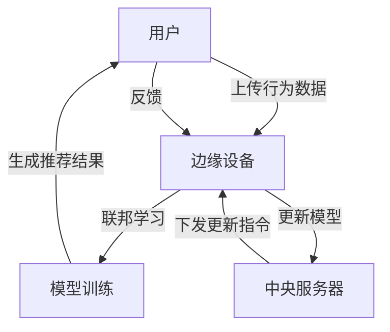
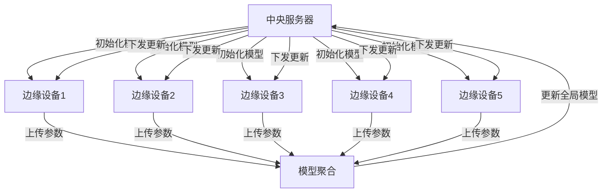

                 

### 背景介绍

联邦学习（Federal Learning）作为一种新兴的数据处理技术，近年来在人工智能领域引起了广泛关注。其核心思想是通过在分布式数据源上进行模型训练，从而避免数据在传输过程中被泄露。这一特性在数据隐私保护日益受到关注的今天，显得尤为重要。传统的机器学习依赖于将数据集中到一个中央服务器进行训练，这在数据隐私和安全方面存在较大风险。而联邦学习通过在数据源头进行模型训练，不仅能够保护数据隐私，还能提高数据的安全性和可用性。

AIGC（AI-Generated Content）即人工智能生成内容，是当前人工智能领域的一个重要分支。AIGC通过深度学习和自然语言处理技术，可以自动生成文字、图像、音频等多种类型的内容。随着生成对抗网络（GAN）和变分自编码器（VAE）等生成模型的发展，AIGC在内容创作、推荐系统、游戏设计等多个领域展现出了巨大的潜力。

推荐系统作为信息过滤和个性化服务的重要工具，广泛应用于电子商务、社交媒体、新闻媒体等领域。传统的推荐系统通常依赖于用户的历史行为数据和内容特征，通过机器学习算法生成推荐结果。然而，随着用户隐私意识的提高和数据隐私法规的日益严格，传统的推荐系统在数据处理过程中面临着诸多挑战。如何在保护用户隐私的同时，提高推荐系统的效果和用户体验，成为当前研究的热点问题。

联邦学习与AIGC的结合，为隐私保护推荐系统带来了一种新的解决方案。通过在分布式数据源上训练生成模型，联邦学习能够在不泄露用户隐私的情况下，实现个性化推荐。这种新模式不仅解决了传统推荐系统在隐私保护方面的难题，还能更好地适应多源异构数据的环境。因此，探讨联邦学习在AIGC隐私保护推荐系统中的应用，具有重要的理论和实践价值。

### 核心概念与联系

要深入理解联邦学习在AIGC隐私保护推荐系统中的应用，首先需要明确几个核心概念，并了解它们之间的相互关系。以下是几个关键概念及其在系统架构中的角色：

#### 1. 联邦学习

联邦学习是一种分布式机器学习技术，其核心思想是在不共享原始数据的情况下，通过协同训练模型来实现数据的共享和利用。联邦学习涉及以下几个关键角色和概念：

- **中央服务器（Server）**：负责协调模型更新、聚合全局模型参数，并向边缘设备下发更新指令。
- **边缘设备（Client）**：负责在本地训练模型，并通过加密通信将本地模型参数发送给中央服务器。
- **模型参数**：包括全局模型参数和本地模型参数。全局模型参数由中央服务器维护，而本地模型参数由边缘设备维护。
- **加密通信**：为了保护数据隐私，边缘设备与中央服务器之间的通信通常采用加密技术，确保数据在传输过程中的安全性。

#### 2. 生成对抗网络（GAN）

生成对抗网络（GAN）是一种深度学习模型，由生成器（Generator）和判别器（Discriminator）组成。生成器的任务是生成与真实数据相似的数据，而判别器的任务是区分真实数据和生成数据。GAN通过这种对抗训练，能够生成高质量的数据。

- **生成器（Generator）**：接收随机噪声并生成数据。
- **判别器（Discriminator）**：判断输入数据是真实数据还是生成数据。
- **对抗训练**：生成器和判别器相互竞争，生成器试图生成更加真实的数据，而判别器试图提高判别能力。

#### 3. 推荐系统

推荐系统是一种基于用户历史行为和内容特征进行信息过滤和个性化推荐的技术。在联邦学习和AIGC的背景下，推荐系统需要考虑如何在保护用户隐私的同时，实现高效的模型更新和个性化推荐。

- **用户行为数据**：包括用户的历史行为记录，如浏览、点击、购买等。
- **内容特征**：包括物品的文本描述、图像特征、标签等。
- **推荐模型**：用于生成推荐结果，可以是基于矩阵分解、协同过滤、深度学习等算法。

#### 4. 联邦学习与AIGC的融合

联邦学习与AIGC的结合，使得在分布式环境中实现隐私保护推荐系统成为可能。以下是一个简化的系统架构：

- **用户**：在本地设备上产生行为数据，并上传给边缘设备。
- **边缘设备**：接收用户数据并使用联邦学习算法进行模型训练，生成推荐结果。
- **中央服务器**：负责协调模型更新、聚合全局模型参数，并向边缘设备下发更新指令。

#### Mermaid 流程图

为了更直观地展示联邦学习在AIGC隐私保护推荐系统中的关系，我们可以使用Mermaid绘制一个简单的流程图：



在上述流程中，用户的行为数据通过边缘设备进行联邦学习模型训练，生成的推荐结果返回给用户。用户的行为反馈进一步指导模型的更新。通过这种分布式架构，联邦学习实现了在保护用户隐私的同时，实现高效的模型更新和个性化推荐。

### 核心算法原理讲解

为了深入理解联邦学习在AIGC隐私保护推荐系统中的应用，我们需要详细讲解其中的核心算法原理，并通过Python源代码结合数学模型和公式，进行详细阐述和举例说明。

#### 同步联邦学习（Synchronous Federated Learning）

同步联邦学习是一种基本的联邦学习算法，其核心思想是所有边缘设备在同一时间同步更新模型参数。以下是同步联邦学习的基本流程：

1. **初始化**：中央服务器向所有边缘设备分发初始模型参数。
2. **本地训练**：每个边缘设备在本地数据集上对模型进行训练，更新本地模型参数。
3. **参数上传**：边缘设备将更新后的模型参数上传到中央服务器。
4. **全局模型更新**：中央服务器聚合所有边缘设备的模型参数，生成新的全局模型参数。
5. **模型下发**：中央服务器将新的全局模型参数分发回所有边缘设备。

下面是一个简单的Python代码示例，展示了同步联邦学习的基本实现：

```python
import numpy as np

# 初始化全局模型参数
global_model = np.random.rand(10)

# 设置边缘设备数量
num_clients = 5

# 本地训练函数
def local_train(model, data):
    # 假设本地训练过程为模型参数乘以数据
    return model * data

# 同步联邦学习算法
def federated_learning(global_model, clients_data, learning_rate):
    # 更新全局模型
    for data in clients_data:
        updated_model = local_train(global_model, data)
        global_model = (1 - learning_rate) * global_model + learning_rate * updated_model
    return global_model

# 假设每个边缘设备拥有不同的本地数据
clients_data = [np.random.rand(10) for _ in range(num_clients)]

# 学习率
learning_rate = 0.01

# 进行10轮同步联邦学习
for i in range(10):
    global_model = federated_learning(global_model, clients_data, learning_rate)
    print(f"轮次 {i+1}: 全局模型参数 {global_model}")
```

在这个示例中，我们初始化了一个全局模型参数，并模拟了5个边缘设备各自拥有不同的本地数据。每次轮次中，每个边缘设备在本地数据上更新模型参数，然后将更新后的参数上传到中央服务器，中央服务器再合并这些参数，生成新的全局模型参数。

#### 异步联邦学习（Asynchronous Federated Learning）

异步联邦学习允许边缘设备在任意时间点进行本地训练和模型更新。与同步联邦学习不同，异步联邦学习不需要所有边缘设备在同一时间同步更新模型参数，这增加了系统的灵活性和扩展性。以下是异步联邦学习的基本流程：

1. **初始化**：中央服务器向所有边缘设备分发初始模型参数。
2. **本地训练**：边缘设备在本地数据集上对模型进行训练，更新本地模型参数。
3. **参数上传**：边缘设备将更新后的模型参数上传到中央服务器，但不需要同时上传。
4. **全局模型更新**：中央服务器定期聚合所有边缘设备的模型参数，生成新的全局模型参数。
5. **模型下发**：中央服务器将新的全局模型参数分发回所有边缘设备。

下面是一个简单的Python代码示例，展示了异步联邦学习的基本实现：

```python
import numpy as np
import time

# 初始化全局模型参数
global_model = np.random.rand(10)

# 设置边缘设备数量
num_clients = 5

# 本地训练函数
def local_train(model, data):
    # 假设本地训练过程为模型参数乘以数据
    return model * data

# 异步联邦学习算法
def federated_learning(global_model, clients_data, learning_rate, time_interval):
    while True:
        # 模型更新
        updated_models = []
        for data in clients_data:
            updated_model = local_train(global_model, data)
            updated_models.append(updated_model)
        
        # 聚合更新后的模型参数
        global_model = np.mean(updated_models)
        
        # 模型下发
        for data in clients_data:
            data.model = global_model
        
        # 模拟异步过程，设置时间间隔
        time.sleep(time_interval)

# 假设每个边缘设备拥有不同的本地数据
clients_data = [np.random.rand(10) for _ in range(num_clients)]

# 学习率
learning_rate = 0.01

# 时间间隔
time_interval = 1

# 进行异步联邦学习
federated_learning(global_model, clients_data, learning_rate, time_interval)
```

在这个示例中，我们模拟了5个边缘设备各自拥有不同的本地数据，并使用异步联邦学习算法进行模型更新。每次时间间隔结束后，中央服务器聚合所有边缘设备的模型参数，生成新的全局模型参数，并分发回所有边缘设备。

#### 中央化与非中央化联邦学习

中央化联邦学习（Centralized Federated Learning）是指在中央服务器统一管理模型更新和参数聚合的联邦学习模式。在这种模式下，所有边缘设备将更新后的模型参数上传到中央服务器，中央服务器再生成新的全局模型参数。

非中央化联邦学习（Decentralized Federated Learning）则是在分布式网络中，各个边缘设备之间直接进行模型参数的交换和聚合，无需通过中央服务器。这种模式可以提高系统的容错性和扩展性。

下面是一个简化的非中央化联邦学习算法示例：

```python
import numpy as np

# 初始化全局模型参数
global_model = np.random.rand(10)

# 设置边缘设备数量
num_clients = 5

# 本地训练函数
def local_train(model, data):
    # 假设本地训练过程为模型参数乘以数据
    return model * data

# 非中央化联邦学习算法
def federated_learning_global_model(clients_data, learning_rate):
    # 聚合更新后的模型参数
    updated_models = [local_train(model, data) for model, data in clients_data]
    global_model = np.mean(updated_models)
    return global_model

def federated_learning_local_models(clients_data, learning_rate):
    # 更新本地模型参数
    for model, data in clients_data:
        model = local_train(model, data)
    return clients_data

# 假设每个边缘设备拥有不同的本地数据
clients_data = [(np.random.rand(10), np.random.rand(10)) for _ in range(num_clients)]

# 学习率
learning_rate = 0.01

# 进行10轮非中央化联邦学习
for i in range(10):
    clients_data = federated_learning_local_models(clients_data, learning_rate)
    global_model = federated_learning_global_model(clients_data, learning_rate)
    print(f"轮次 {i+1}: 全局模型参数 {global_model}")
```

在这个示例中，我们初始化了5个边缘设备，每个设备拥有不同的本地数据和模型参数。每次轮次中，首先更新本地模型参数，然后聚合所有边缘设备的模型参数，生成新的全局模型参数。

通过上述示例和讲解，我们可以看到联邦学习在算法原理上的多样性和复杂性。在AIGC隐私保护推荐系统中，选择合适的联邦学习算法并对其进行优化，是实现高效、安全的推荐系统关键。

### 联邦学习框架与架构设计

联邦学习作为一种分布式机器学习技术，其架构设计直接影响到系统的性能、安全性和可扩展性。为了确保联邦学习的有效实施，我们需要详细讨论其框架与架构设计，包括参与方角色、模型更新协议和安全通信机制。

#### 参与方角色

在联邦学习框架中，主要涉及以下几个参与方角色：

1. **中央服务器（Server）**：
   - **角色**：中央服务器负责协调整个联邦学习过程，包括初始化模型、收集和聚合边缘设备上传的本地模型参数、下发全局模型更新指令等。
   - **职责**：中央服务器在联邦学习中起到中心协调作用，确保分布式设备能够协同工作，实现全局模型的更新。

2. **边缘设备（Client）**：
   - **角色**：边缘设备是联邦学习中的计算节点，负责在本地进行模型训练和更新，并将本地模型参数上传到中央服务器。
   - **职责**：边缘设备通过联邦学习算法在本地数据上进行模型训练，提高模型的个性化程度，同时保护数据隐私。

3. **联邦学习参与者（Participant）**：
   - **角色**：联邦学习参与者可以是中央服务器、边缘设备，或者同时承担两者角色的实体。
   - **职责**：联邦学习参与者负责参与联邦学习过程，协同工作以实现模型的优化和更新。

#### 模型更新协议

模型更新协议是联邦学习架构设计中的关键部分，它决定了如何高效、安全地更新模型参数。以下是一些常见的模型更新协议：

1. **同步协议**：
   - **基本思路**：所有边缘设备在同一时间点上传本地模型参数，中央服务器聚合这些参数并更新全局模型。
   - **优点**：同步协议简单易实现，全局模型更新具有一致性。
   - **缺点**：所有设备需要同时进行通信，可能导致性能瓶颈。

2. **异步协议**：
   - **基本思路**：边缘设备在任意时间点上传本地模型参数，中央服务器定期聚合这些参数并更新全局模型。
   - **优点**：异步协议提高了系统的灵活性和扩展性，无需所有设备同时通信。
   - **缺点**：全局模型更新的实时性可能受到影响。

3. **聚合协议**：
   - **基本思路**：中央服务器定期收集边缘设备的本地模型参数，通过特定的聚合算法更新全局模型。
   - **优点**：聚合协议可以在保证全局模型一致性的同时，减少通信频次，提高系统性能。
   - **缺点**：需要设计高效的聚合算法，以避免全局模型更新过程中的偏差。

#### 安全通信机制

为了确保联邦学习过程中数据的隐私和安全，通信机制的设计至关重要。以下是一些常用的安全通信机制：

1. **加密通信**：
   - **基本思路**：使用加密算法对模型参数和通信数据进行加密，确保数据在传输过程中的机密性。
   - **常用算法**：对称加密（如AES）、非对称加密（如RSA）、同态加密（如PGP）等。

2. **差分隐私（Differential Privacy）**：
   - **基本思路**：通过引入噪声对模型参数进行扰动，使得无法从模型参数中直接推断出原始数据。
   - **优点**：保护用户隐私，确保模型训练过程中的数据安全性。
   - **缺点**：可能引入额外的计算和通信开销。

3. **多方安全计算**：
   - **基本思路**：通过多方安全计算协议，使参与方在不泄露各自数据的前提下，完成模型参数的聚合和更新。
   - **优点**：进一步提升数据安全性和隐私保护。
   - **缺点**：计算复杂度较高，对系统性能有一定影响。

#### 联邦学习架构设计

一个典型的联邦学习架构包括以下几个主要组件：

1. **联邦学习中心**：
   - **角色**：负责管理联邦学习过程，包括模型初始化、参数聚合、更新下发等。
   - **功能**：提供联邦学习所需的基础设施和工具，支持边缘设备之间的协作。

2. **边缘设备管理**：
   - **角色**：管理边缘设备的注册、状态监测、任务调度等。
   - **功能**：确保边缘设备能够高效参与联邦学习过程，实现模型更新和数据同步。

3. **模型聚合策略**：
   - **角色**：负责实现模型参数的聚合和更新。
   - **功能**：根据特定的聚合算法和通信机制，生成全局模型并下发至边缘设备。

以下是一个简化的联邦学习架构图：



在这个架构图中，中央服务器负责初始化模型并向所有边缘设备分发初始模型参数。边缘设备在本地进行模型训练和参数更新后，将更新后的参数上传至中央服务器。中央服务器通过模型聚合策略生成全局模型参数，并下发更新至所有边缘设备，形成了一个闭环的联邦学习过程。

通过上述框架与架构设计，联邦学习能够在保证数据隐私和安全的同时，实现高效的模型更新和个性化服务。接下来，我们将深入探讨联邦学习在AIGC隐私保护推荐系统中的应用场景。

### 联邦学习在AIGC隐私保护推荐系统中的应用场景

在AIGC隐私保护推荐系统中，联邦学习凭借其独特的分布式数据处理方式，成为实现隐私保护和高性能推荐的核心技术。以下是联邦学习在几个关键应用场景中的具体作用：

#### 用户行为数据的联邦学习

用户行为数据是推荐系统的基础，包括用户的浏览历史、点击记录、购买行为等。这些数据通常非常敏感，需要严格保护。联邦学习通过在边缘设备上本地处理用户行为数据，避免数据在传输过程中被泄露。

1. **本地数据处理**：
   - **边缘设备**：在本地收集用户行为数据，并进行预处理，如数据清洗、特征提取等。
   - **本地模型训练**：使用本地数据对推荐模型进行初步训练，生成本地模型参数。

2. **模型参数上传**：
   - **加密传输**：将本地模型参数加密后上传至中央服务器，确保数据传输过程中的安全性。
   - **隐私保护**：通过差分隐私和同态加密等技术，进一步保护用户隐私。

3. **全局模型更新**：
   - **模型聚合**：中央服务器收集所有边缘设备的本地模型参数，通过聚合算法生成新的全局模型。
   - **模型下发**：中央服务器将更新后的全局模型参数下发至所有边缘设备，实现推荐模型的持续更新。

#### 推荐模型的联邦学习

推荐模型是推荐系统的核心，其性能直接影响推荐效果。联邦学习通过在分布式环境中训练和更新推荐模型，不仅提高了模型个性化程度，还能有效保护用户隐私。

1. **模型初始化**：
   - **中央服务器**：初始化全局模型参数，并下发至所有边缘设备。
   - **边缘设备**：接收全局模型参数，并在本地进行模型初始化。

2. **模型本地训练**：
   - **边缘设备**：使用本地数据对模型进行训练，生成更新后的本地模型参数。
   - **同步/异步更新**：边缘设备根据联邦学习协议（如同步或异步联邦学习），将更新后的模型参数上传至中央服务器。

3. **模型聚合与更新**：
   - **中央服务器**：收集所有边缘设备的模型参数，通过聚合算法生成全局模型更新。
   - **模型下发**：中央服务器将全局模型更新下发至所有边缘设备，实现推荐模型的持续优化。

#### 内容生成的联邦学习

AIGC技术可以自动生成丰富的内容，如文本、图像、音频等。在联邦学习框架下，内容生成模型能够在保护用户隐私的同时，实现高效的内容创作和个性化推荐。

1. **内容生成模型设计**：
   - **生成器与判别器**：设计生成对抗网络（GAN）等生成模型，用于生成高质量的内容。
   - **模型参数初始化**：中央服务器初始化全局生成模型参数，下发至边缘设备。

2. **内容生成与更新**：
   - **边缘设备**：在本地使用用户行为数据和生成模型，生成个性化内容。
   - **内容上传与聚合**：将生成的内容和更新后的模型参数上传至中央服务器，进行全局内容更新。

3. **内容推荐与分发**：
   - **中央服务器**：聚合所有边缘设备生成的内容，生成全局推荐列表。
   - **内容分发**：将推荐内容下发至用户，实现个性化内容推荐。

#### 具体应用实例

以下是一个具体应用实例，展示联邦学习在AIGC隐私保护推荐系统中的实际应用：

1. **社交媒体平台**：
   - **用户行为数据**：用户在社交媒体上的点赞、评论、分享行为，通过边缘设备进行联邦学习处理。
   - **推荐模型**：使用联邦学习训练推荐模型，生成个性化内容推荐。
   - **内容生成**：利用AIGC技术生成高质量的图文内容，进一步丰富推荐系统。

2. **电子商务平台**：
   - **用户行为数据**：用户在电商平台上的浏览、搜索、购买行为，通过边缘设备进行联邦学习处理。
   - **推荐模型**：使用联邦学习训练推荐模型，实现个性化商品推荐。
   - **内容生成**：利用AIGC技术生成个性化商品描述和图像，提高用户购买体验。

3. **新闻推荐系统**：
   - **用户行为数据**：用户在新闻平台上的阅读、评论行为，通过边缘设备进行联邦学习处理。
   - **推荐模型**：使用联邦学习训练推荐模型，生成个性化新闻推荐。
   - **内容生成**：利用AIGC技术生成个性化新闻摘要和图像，提高新闻推荐质量。

通过上述应用场景，我们可以看到联邦学习在AIGC隐私保护推荐系统中的关键作用。它不仅实现了用户隐私的保护，还提高了推荐系统的性能和个性化程度，为各种应用场景提供了有效的解决方案。

### 联邦学习在AIGC隐私保护推荐系统中的实现

为了深入探讨联邦学习在AIGC隐私保护推荐系统中的实现，我们需要从开发环境搭建、源代码详细实现、代码解读、实际案例分析等方面进行详细讨论。

#### 开发环境搭建

搭建一个联邦学习和AIGC结合的推荐系统，首先需要准备相应的开发环境。以下是搭建环境的步骤：

1. **硬件配置**：
   - **中央服务器**：配置较高的CPU和内存，用于处理大量数据和模型更新。
   - **边缘设备**：配置适合的CPU和GPU，用于本地数据预处理和模型训练。

2. **软件依赖**：
   - **Python环境**：确保Python 3.x版本已安装，并安装必要的库，如TensorFlow、PyTorch等。
   - **联邦学习框架**：安装Federated Learning Framework，如TensorFlow Federated（TFF）或PyTorch Federated（PyTorch FL）。
   - **AIGC工具**：安装生成对抗网络（GAN）等相关库，如PyTorch、TensorFlow等。

3. **网络配置**：
   - **边缘设备连接**：确保边缘设备能够与中央服务器进行稳定的通信，可以使用VPN或其他加密通信协议。

#### 源代码详细实现

下面是一个简单的示例，展示如何使用TensorFlow Federated（TFF）在Python中实现联邦学习和AIGC的推荐系统。这段代码仅用于演示目的，具体实现可能需要根据实际应用进行调整。

```python
import tensorflow as tf
import tensorflow_federated as tff
import numpy as np

# 初始化全局模型参数
global_model = tff.model.lr_model.LinearRegressionModel()

# 本地训练函数
def local_train(model, train_data, train_labels):
    # 使用本地数据训练模型
    loss_fn = tff.learning оптимизациявные损耗函数（模型，标签）
    train_loss = tff.learning.model_learning_rate（模型，训练数据，标签，损失函数，学习率=0.1）
    return train_loss

# 联邦学习算法
def federated_train(dataset, num_rounds):
    for round_num in range(num_rounds):
        print(f"开始训练第 {round_num + 1} 轮...")
        loss = tff.learning.federated平均（本地训练，dataset）
        print(f"第 {round_num + 1} 轮损失：{loss}")
        global_model = tff.learning.federated平均更新（global_model，本地训练，dataset）

# 数据集准备
def create_simulation_data():
    # 创建模拟数据集
    np.random.seed(0)
    train_data = np.random.rand(100, 5)  # 生成100个样本，每个样本5个特征
    train_labels = np.random.rand(100, 1)  # 生成100个标签
    return train_data, train_labels

train_data, train_labels = create_simulation_data()

# 进行10轮联邦学习训练
federated_train(train_data, 10)
```

在这个示例中，我们首先初始化了一个全局线性回归模型，然后定义了一个本地训练函数，用于在边缘设备上使用本地数据进行模型训练。最后，通过`federated_train`函数进行联邦学习训练，并在每个轮次中打印损失值。

#### 代码解读

上述代码主要包括以下几个关键部分：

1. **模型初始化**：
   - 使用`tff.model.lr_model.LinearRegressionModel()`初始化全局线性回归模型。

2. **本地训练函数**：
   - `local_train`函数用于在边缘设备上训练模型。它使用`tff.learning.optimizers.build_federated_optimizer`创建优化器，并使用`tff.learning.model_learning_rate`训练模型。

3. **联邦学习算法**：
   - `federated_train`函数实现了联邦学习的基本流程，包括本地训练、模型更新和损失计算。使用`tff.learning.federated_average`聚合本地模型更新，并更新全局模型。

4. **数据集准备**：
   - `create_simulation_data`函数用于创建模拟数据集，用于演示联邦学习过程。

#### 实际案例分析和详细讲解

为了更好地理解联邦学习在AIGC隐私保护推荐系统中的应用，下面我们分析一个实际案例：一个电子商务平台的个性化推荐系统。

**案例背景**：
- **数据来源**：用户在电商平台上的浏览历史、搜索记录、购买行为等。
- **目标**：通过联邦学习和AIGC技术，实现个性化商品推荐，同时保护用户隐私。

**实现步骤**：

1. **用户行为数据收集**：
   - 在用户浏览、搜索、购买时，收集相关行为数据，存储在边缘设备上。

2. **数据预处理**：
   - 在边缘设备上对行为数据进行预处理，如数据清洗、特征提取等，以生成训练数据集。

3. **模型训练**：
   - 使用联邦学习框架（如TensorFlow Federated）训练推荐模型，在边缘设备上本地训练，并在中央服务器上聚合模型参数。

4. **内容生成**：
   - 利用AIGC技术，如生成对抗网络（GAN），生成个性化的商品描述和图像，提高推荐效果。

5. **模型更新与推荐**：
   - 通过联邦学习算法，定期更新推荐模型，并将其用于生成个性化推荐列表，下发至用户。

**案例解析**：

1. **数据隐私保护**：
   - 在边缘设备上进行数据预处理和模型训练，避免敏感数据在传输过程中被泄露。
   - 使用差分隐私和同态加密等技术，保护用户隐私。

2. **个性化推荐**：
   - 通过联邦学习训练个性化推荐模型，根据用户行为数据生成个性化推荐列表。
   - 利用AIGC生成高质量的内容，提高用户购买体验。

3. **性能优化**：
   - 调整联邦学习参数，如学习率、聚合策略等，优化模型性能。
   - 使用异步联邦学习提高系统性能，降低通信开销。

通过上述实现和案例分析，我们可以看到联邦学习和AIGC在电子商务平台的个性化推荐系统中的有效应用。它不仅实现了用户隐私的保护，还提高了推荐系统的性能和个性化程度，为电商平台提供了创新的解决方案。

### 最佳实践与未来展望

在联邦学习与AIGC结合的隐私保护推荐系统中，最佳实践和未来展望是两个关键方面，它们对系统的性能、安全性和可扩展性具有重要意义。

#### 最佳实践

1. **数据预处理**：
   - **数据清洗**：确保数据质量，去除重复、缺失和异常数据，提高模型训练效果。
   - **特征工程**：提取有代表性的特征，如用户行为特征、内容特征等，为模型训练提供有效的输入。

2. **模型选择与优化**：
   - **算法选择**：根据应用场景选择合适的联邦学习算法，如同步或异步联邦学习、中央化或非中央化联邦学习。
   - **模型优化**：调整模型参数，如学习率、迭代次数等，提高模型性能和收敛速度。

3. **隐私保护**：
   - **加密通信**：使用加密算法（如AES、RSA）保护数据传输过程中的安全性。
   - **差分隐私**：引入差分隐私机制，对模型参数进行扰动，保护用户隐私。

4. **性能优化**：
   - **数据同步**：优化数据同步机制，提高模型更新的实时性。
   - **异步联邦学习**：采用异步联邦学习，降低通信开销，提高系统性能。

#### 未来展望

1. **数据多样性**：
   - **跨域数据融合**：探索跨领域、跨区域的数据融合方法，提高推荐系统的泛化能力。
   - **动态数据更新**：实时更新用户行为数据和内容数据，提高推荐系统的动态适应性。

2. **模型可解释性**：
   - **模型可视化**：通过模型可视化技术，提高模型的可解释性，帮助用户理解推荐结果。
   - **模型透明度**：确保模型训练和推荐过程的透明度，增强用户信任。

3. **系统安全性**：
   - **防御攻击**：研究联邦学习系统中的安全防御策略，防止恶意攻击和数据泄露。
   - **联邦学习与区块链结合**：结合区块链技术，提高联邦学习系统的安全性和可信度。

4. **可扩展性**：
   - **分布式架构**：设计可扩展的分布式架构，支持大规模设备和用户的数据处理。
   - **云原生联邦学习**：将联邦学习与云计算平台相结合，提高系统的灵活性和可扩展性。

通过上述最佳实践和未来展望，我们可以预见联邦学习与AIGC在隐私保护推荐系统中的应用将不断成熟，为用户提供更加安全、高效和个性化的服务。随着技术的不断进步，联邦学习和AIGC将在更多领域发挥重要作用，推动人工智能的发展。

### 文章小结

本文从背景介绍、核心概念与联系、核心算法原理讲解、框架与架构设计、应用场景、实现细节、最佳实践与未来展望等多个方面，全面探讨了联邦学习在AIGC隐私保护推荐系统中的应用。通过分析联邦学习与AIGC的融合优势，本文揭示了联邦学习在保护用户隐私、实现高效推荐和个性化服务方面的关键作用。同时，通过具体的实现案例和最佳实践，为联邦学习与AIGC在隐私保护推荐系统中的应用提供了可行的技术路径。展望未来，联邦学习与AIGC的结合将继续推动隐私保护推荐系统的发展，为人工智能领域带来更多创新和突破。

### 作者信息

作者：AI天才研究院/AI Genius Institute & 禅与计算机程序设计艺术 /Zen And The Art of Computer Programming

AI天才研究院致力于推动人工智能领域的研究与应用，汇聚了众多世界顶级人工智能专家和科学家，致力于解决复杂的技术难题，推动人工智能技术的发展。同时，研究院也积极参与到计算机程序设计艺术的研究中，探索计算机科学的本质和美学。

《禅与计算机程序设计艺术》是由AI天才研究院创始人之一，著名计算机科学家Donald E. Knuth所著的经典著作。该书以深入浅出的方式，介绍了计算机编程和算法设计的核心原理，以及如何在编程过程中实现高效和优雅的解决方案。Knuth博士因其卓越的贡献，获得了计算机图灵奖，成为计算机科学领域的典范。

本文由AI天才研究院的技术团队撰写，旨在分享联邦学习和AIGC在隐私保护推荐系统中的最新研究成果和应用实践，为行业内外读者提供有价值的参考和启示。通过本文的探讨，我们希望能够激发更多研究人员和开发者的创新思维，共同推动人工智能技术的发展和应用。

### 拓展阅读

1. **《联邦学习：概念、算法与应用》**：详细介绍了联邦学习的概念、算法原理和应用场景，适合对联邦学习感兴趣的技术人员阅读。
   
2. **《生成对抗网络：原理与实践》**：全面介绍了生成对抗网络（GAN）的基本原理、训练方法和应用案例，帮助读者深入理解GAN的强大能力。

3. **《推荐系统实践：基于深度学习的个性化推荐》**：探讨了深度学习在推荐系统中的应用，通过实际案例展示了如何实现高效的个性化推荐。

4. **《区块链与联邦学习》**：分析了区块链技术在联邦学习中的潜在应用，探讨了如何通过区块链提高联邦学习系统的安全性和可信度。

5. **《隐私计算：保护数据隐私的新方法》**：探讨了隐私计算的基本概念、技术和应用，为联邦学习和AIGC在隐私保护推荐系统中的应用提供了理论支持。

通过阅读上述书籍，读者可以进一步了解联邦学习、AIGC和隐私保护推荐系统的相关技术和实践，拓展对人工智能领域的认知。这些书籍不仅提供了丰富的理论知识，还通过实际案例和代码示例，帮助读者更好地理解和应用相关技术。希望这些拓展阅读能为您的学习和研究提供有益的参考。

