                 

作者：AI天才研究院/AI Genius Institute & 禅与计算机程序设计艺术 /Zen And The Art of Computer Programming

# 《脑机接口伦理：企业采用神经增强技术的考量》

关键词：脑机接口、神经增强技术、伦理考量、企业战略、风险与挑战

摘要：
本文深入探讨了脑机接口（Brain-Computer Interface, BCI）与神经增强技术（Neuro-enhancement Technologies）在企业发展中的应用及其伦理考量。首先，我们介绍了脑机接口与神经增强技术的基本概念、原理及其在商业领域的应用场景。随后，文章分析了企业采用这些技术的策略、面临的伦理问题以及潜在风险。通过具体的案例研究和项目实战，我们进一步探讨了如何平衡技术创新与伦理责任，为企业在这一领域的发展提供了实践指导和战略建议。

## 第一部分：脑机接口与神经增强技术概述

### 1.1 脑机接口的定义与原理

脑机接口（Brain-Computer Interface, BCI）是一种直接连接大脑和外部设备的技术，它通过解读大脑活动来控制计算机、机器人或其他电子设备。BCI技术利用电生理学方法，如脑电图（EEG）、功能性磁共振成像（fMRI）和脑磁图（MEG），来捕捉大脑信号，并将其转换为可操作的指令。

#### 核心概念与联系

为了更好地理解BCI技术的原理，我们可以通过以下Mermaid流程图来展示核心概念和它们之间的关系：

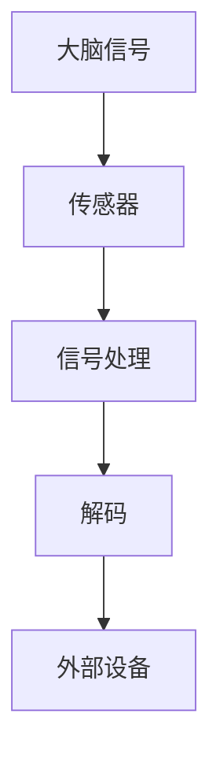

在这个流程图中，大脑信号首先通过传感器（如EEG）被捕捉到，然后经过信号处理单元进行预处理和增强，最终解码为外部设备（如计算机、机器人）可以识别的控制信号。

### 1.2 神经增强技术的定义与原理

神经增强技术（Neuro-enhancement Technologies）是指通过药物、设备或生物技术手段增强大脑的认知功能、记忆能力或其他神经活动。这类技术可以包括神经递质调节、大脑植入物、虚拟现实训练等。

#### 核心概念与联系

神经增强技术的核心概念可以通过以下Mermaid流程图来展示：

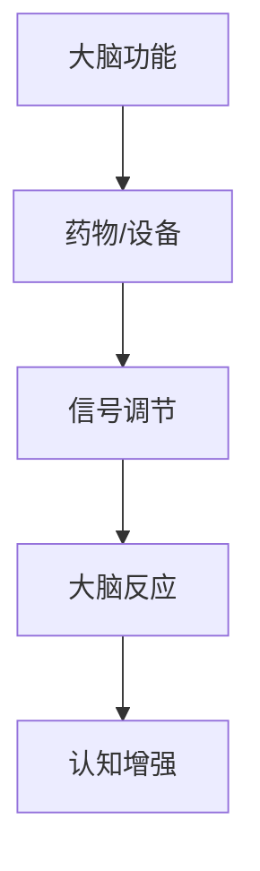

在这个流程图中，药物或设备通过调节大脑信号（如神经递质），改善大脑的反应和认知功能，从而实现神经增强。

### 1.3 脑机接口技术的分类与应用场景

脑机接口技术可以根据其工作原理和应用场景进行分类。以下是一些常见的BCI技术及其应用场景：

#### 分类与示例

1. **基于EEG的BCI**
   - 应用场景：脑波控制的游戏、轮椅、智能家居等。
   
2. **基于fMRI的BCI**
   - 应用场景：高级神经信号解码，如大脑控制轮椅、机器人手臂等。

3. **基于MEG的BCI**
   - 应用场景：实时脑信号监测，如脑波音乐演奏、智能眼镜等。

### 1.4 神经增强技术的分类与应用场景

神经增强技术可以根据其增强的神经活动类型进行分类。以下是一些常见的神经增强技术及其应用场景：

#### 分类与示例

1. **认知神经增强**
   - 应用场景：提高学习效率、增强记忆能力、改善注意力。

2. **运动神经增强**
   - 应用场景：增强运动技能、改善肌肉功能、提高运动表现。

3. **情感神经增强**
   - 应用场景：缓解焦虑、改善情绪、提高幸福感。

通过以上对脑机接口和神经增强技术的基本概述，我们为后续章节的深入探讨奠定了基础。在接下来的内容中，我们将详细分析企业采用这些技术的策略、伦理考量以及面临的挑战。----------------------------------------------------------------

## 第二部分：脑机接口技术的伦理考量

### 2.1 隐私保护

脑机接口技术的核心在于捕捉和解读大脑活动，这无疑引发了对隐私保护的重大关注。在个人数据采集、存储和处理过程中，如何确保用户隐私不受侵犯，是BCI技术广泛应用前必须解决的问题。

#### 核心概念与联系

隐私保护的核心概念可以通过以下Mermaid流程图来展示：

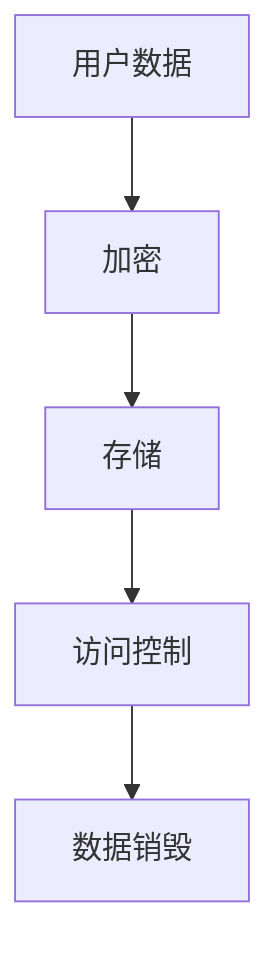

在这个流程图中，用户数据首先通过加密手段进行保护，然后存储在安全的数据库中，通过访问控制机制确保只有授权人员可以访问，并在不再需要时进行数据销毁。

### 2.2 道德伦理

脑机接口技术的伦理考量不仅涉及隐私保护，还包括道德伦理问题。例如，使用BCI技术进行神经增强可能带来的社会不平等、人类尊严问题等，都是需要认真思考的。

#### 核心概念与联系

道德伦理的核心概念可以通过以下Mermaid流程图来展示：

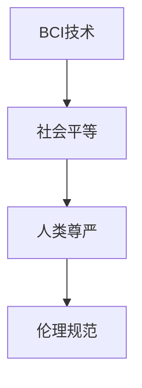

在这个流程图中，BCI技术需要考虑到如何确保技术的应用不会导致社会不平等，如何尊重和保护人类尊严，并遵循相应的伦理规范。

### 2.3 劳动力市场影响

脑机接口技术的应用将对劳动力市场产生深远的影响。一方面，它可能提高工作效率，减少劳动力成本；另一方面，它也可能导致某些岗位的失业风险，引发社会不稳定。

#### 核心概念与联系

劳动力市场影响的核心概念可以通过以下Mermaid流程图来展示：

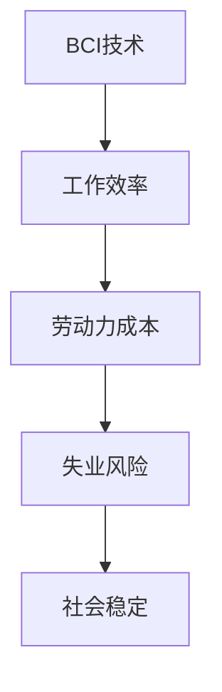

在这个流程图中，BCI技术通过提高工作效率和降低劳动力成本，对劳动力市场产生积极影响，但也可能引发失业风险，进而影响社会稳定。

### 2.4 人类尊严与平等

脑机接口技术的应用可能会对人类尊严和平等原则构成挑战。例如，神经增强技术的使用可能会导致认知能力的差异，从而引发社会不平等问题。

#### 核心概念与联系

人类尊严与平等的核心概念可以通过以下Mermaid流程图来展示：

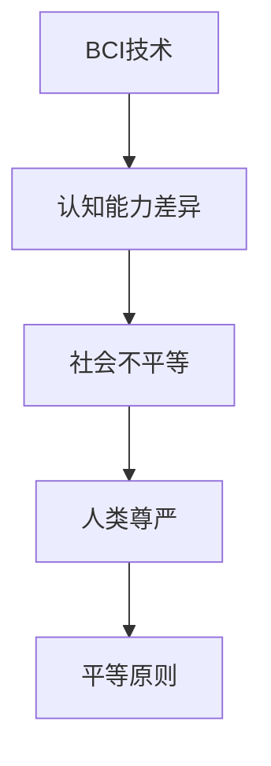

在这个流程图中，BCI技术通过改善认知能力，可能导致人类尊严和社会平等的挑战，需要通过相应的伦理和法律框架来规范。

### 2.5 社会责任与伦理规范

企业采用脑机接口技术时，必须承担社会责任，并遵循伦理规范。这包括确保技术的安全性和可靠性，尊重用户隐私，以及积极应对潜在的社会伦理挑战。

#### 核心概念与联系

社会责任与伦理规范的核心概念可以通过以下Mermaid流程图来展示：

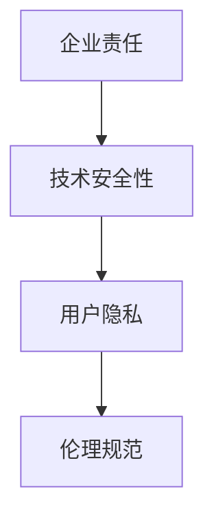

在这个流程图中，企业需要确保其技术的安全性和隐私保护，并遵循相应的伦理规范，以履行其社会责任。

通过以上对脑机接口技术的伦理考量，我们可以看到，这些技术的应用不仅带来了技术进步，也带来了诸多伦理和社会问题。在接下来的章节中，我们将进一步探讨企业采用神经增强技术的策略和风险。----------------------------------------------------------------

## 第三部分：企业采用神经增强技术的策略与风险

### 3.1 战略规划与执行

企业在考虑采用神经增强技术时，需要进行详细的战略规划。这包括明确技术目标、确定实施计划、制定资源分配策略和风险管理计划。

#### 核心概念与联系

战略规划与执行的核心概念可以通过以下Mermaid流程图来展示：

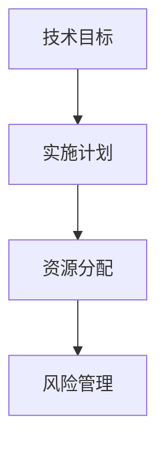

在这个流程图中，企业需要明确技术目标，制定详细的实施计划，合理分配资源，并建立有效的风险管理机制。

### 3.2 技术采纳模式

企业采用神经增强技术时，可以选择不同的技术采纳模式。例如，自主研发、合作伙伴关系、外部采购等。

#### 核心概念与联系

技术采纳模式的核心概念可以通过以下Mermaid流程图来展示：

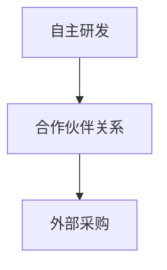

在这个流程图中，企业可以根据自身的技术能力和资源情况，选择适合的技术采纳模式。

### 3.3 市场与竞争分析

企业在采用神经增强技术时，需要对其市场环境和竞争格局进行深入分析。这包括市场规模、增长趋势、主要竞争对手及其产品特点等。

#### 核心概念与联系

市场与竞争分析的核心概念可以通过以下Mermaid流程图来展示：

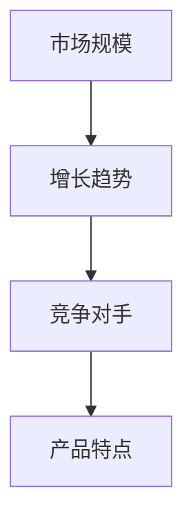

在这个流程图中，企业需要分析市场规模和增长趋势，了解主要竞争对手及其产品特点，以便制定有效的市场竞争策略。

### 3.4 风险管理与应对

企业在采用神经增强技术时，可能面临多种风险，如技术风险、市场风险、法律风险等。有效的风险管理策略是确保技术成功应用的关键。

#### 核心概念与联系

风险管理与应对的核心概念可以通过以下Mermaid流程图来展示：

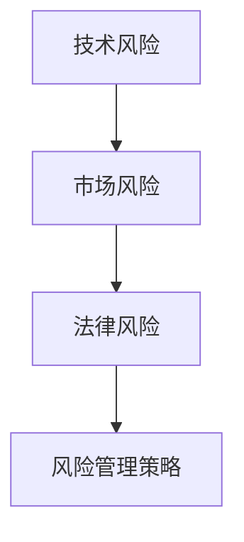

在这个流程图中，企业需要识别和评估各种风险，并制定相应的风险管理策略，以应对潜在的风险挑战。

### 3.5 优化策略与实践

为了最大化神经增强技术的应用效果，企业可以采取一系列优化策略，如技术创新、流程优化、人员培训等。

#### 核心概念与联系

优化策略与实践的核心概念可以通过以下Mermaid流程图来展示：

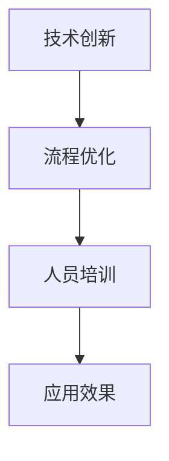

在这个流程图中，企业可以通过技术创新、流程优化和人员培训，不断提升神经增强技术的应用效果。

通过以上对企业采用神经增强技术策略与风险的详细分析，我们可以看到，企业需要在战略规划、市场分析、风险管理和优化实践等方面进行全面考虑，以确保神经增强技术的成功应用。在接下来的章节中，我们将探讨脑机接口与神经增强技术的未来发展趋势。----------------------------------------------------------------

## 第四部分：脑机接口与神经增强技术的未来发展趋势

### 4.1 技术创新方向

脑机接口与神经增强技术的未来发展趋势将集中在以下几个方向：

#### 4.1.1 更高的数据精度

随着传感器技术和信号处理算法的进步，未来的脑机接口技术将能够捕捉到更加精细的大脑活动信号，提高数据精度。

#### 4.1.2 更强的实时性

通过改进信号传输和处理技术，未来的脑机接口技术将实现更快的响应时间，满足实时交互的需求。

#### 4.1.3 更广泛的应用领域

脑机接口技术将不仅限于医疗康复，还将扩展到教育、娱乐、工业控制等多个领域。

### 4.2 行业政策与法规演变

随着脑机接口与神经增强技术的快速发展，各国政府和国际组织将加强对这些技术的监管，以保障公共安全和伦理道德。

#### 4.2.1 法规制定

未来可能出台一系列法律法规，规范脑机接口与神经增强技术的研发、应用和推广。

#### 4.2.2 伦理审查

在技术应用的各个环节，将引入严格的伦理审查机制，确保技术的应用不会侵犯个人隐私和尊严。

### 4.3 社会影响与挑战

脑机接口与神经增强技术的广泛应用将对社会产生深远影响，带来一系列挑战：

#### 4.3.1 社会公平

技术的应用可能导致认知能力的差异，引发社会不平等问题，需要制定相应的政策来促进社会公平。

#### 4.3.2 道德伦理

技术的快速发展带来了诸多道德伦理问题，如隐私保护、人类尊严等，需要全社会共同关注和探讨。

### 4.4 发展趋势与展望

脑机接口与神经增强技术在未来将持续发展，有望实现以下突破：

#### 4.4.1 更高的集成度

通过集成多种技术手段，实现脑机接口与神经增强技术的高效集成，提升应用效果。

#### 4.4.2 更广泛的人机协同

脑机接口技术将实现更高级的人机协同，使人类与机器共同完成任务，提高工作效率。

通过以上对脑机接口与神经增强技术未来发展趋势的探讨，我们可以预见，这些技术将在未来带来深刻的社会变革，同时也需要全社会共同努力，确保技术发展的同时，兼顾伦理道德和社会责任。----------------------------------------------------------------

## 附录：相关法规、政策及案例研究

### 附录1：法律法规概述

本章节将概述与脑机接口与神经增强技术相关的法律法规，包括数据隐私保护、医疗设备监管、伦理审查等方面的规定。具体内容将包括：

- 各国数据隐私保护法规的概述，如《欧盟通用数据保护条例》（GDPR）。
- 医疗设备监管法规，如《美国食品药品监督管理局》（FDA）对脑机接口设备的规定。
- 伦理审查的相关法规，如《生物伦理学审查指南》等。

### 附录2：政策文件分析

本章节将对各国和地区关于脑机接口与神经增强技术的政策文件进行分析，包括：

- 政府发布的战略规划，如《美国国家神经疾病与中风研究院》的《脑计划》。
- 研究资助政策，如欧盟的《地平线2020》计划。
- 税收优惠和产业支持政策，如中国的《新一代人工智能发展规划》。

### 附录3：国内外案例研究

本章节将通过具体案例研究，探讨脑机接口与神经增强技术的实际应用和挑战。案例将包括：

- 医疗康复领域的应用案例，如使用脑机接口技术帮助瘫痪患者恢复行动能力。
- 教育领域的应用案例，如利用神经增强技术提升学生的学习效果。
- 工业控制领域的应用案例，如利用脑机接口技术提高工业自动化效率。
- 道德伦理案例分析，探讨技术应用中遇到的伦理挑战和解决方案。

通过附录部分的相关法规、政策及案例研究，读者可以更全面地了解脑机接口与神经增强技术在实际应用中的法律、政策和社会影响，为后续的研究和实践提供参考。----------------------------------------------------------------

## 结论

脑机接口与神经增强技术的快速发展为我们带来了前所未有的机遇，同时也伴随着诸多伦理和社会挑战。本文通过详细的章节内容，深入探讨了脑机接口与神经增强技术的基本概念、伦理考量、企业策略与风险、未来发展趋势以及相关法规和政策。

我们强调，企业在采用这些技术时，必须全面考虑其战略规划、市场分析、风险管理以及社会责任。同时，伦理考量贯穿于整个技术生命周期，从研发到应用，都需要严格遵守相关的法律法规和伦理规范。

展望未来，脑机接口与神经增强技术有望在多个领域实现突破，为社会带来积极影响。但我们也需要关注技术发展可能带来的社会不平等和道德伦理问题，确保技术在造福人类的同时，符合社会价值和伦理原则。

最后，感谢读者对本文的关注，我们期待与您一起探讨脑机接口与神经增强技术的未来，共同推动技术的健康、可持续发展。希望本文能为您提供有益的启示和思考。

## 拓展阅读

- 《脑机接口：技术与伦理》（作者：约翰·多伊尔）- 探讨了脑机接口技术的伦理问题。
- 《神经增强：技术、应用与伦理》（作者：玛丽亚·卡斯特罗）- 分析了神经增强技术的伦理挑战。
- 《人工智能与伦理：从伦理学到实践》（作者：彼得·麦克尼科尔）- 探讨了人工智能领域的伦理问题。
- 《欧盟通用数据保护条例》（GDPR）- 欧盟关于数据隐私保护的法规。
- 《美国食品药品监督管理局》（FDA）关于医疗设备的监管规定。

通过阅读这些资料，您可以进一步了解脑机接口与神经增强技术的伦理考量以及相关法规政策。

