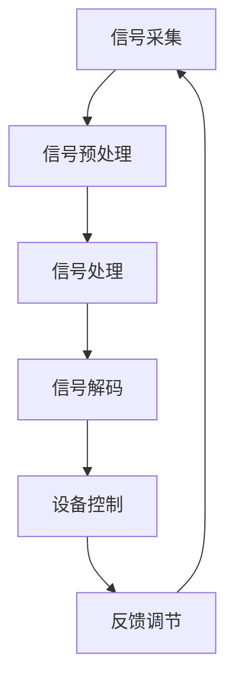
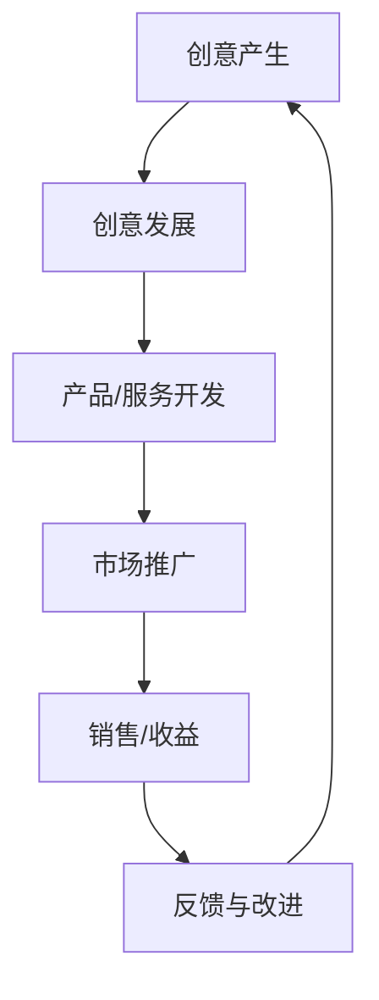
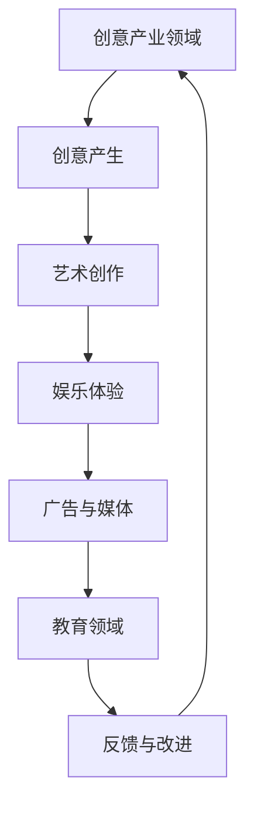

                 

# 《脑机接口在创意产业中的应用探索》

> 关键词：脑机接口，创意产业，应用案例，技术挑战，未来展望

> 摘要：本文旨在探讨脑机接口（BMI）在创意产业中的应用潜力、实际案例以及面临的挑战。通过分析BMI的基本原理、创意产业的特点，以及具体应用场景，本文提出了一系列BMI在创意产业中的最佳实践，并对其未来发展方向进行了展望。

----------------------------------------------------------------

## 引言

### 1.1 书籍背景与目的

脑机接口（BMI）作为一项前沿技术，近年来在医疗、军事、娱乐等多个领域展现出了巨大的应用潜力。然而，随着创意产业的快速发展，BMI在其中的应用也逐渐引起了广泛关注。创意产业涵盖了许多领域，如娱乐、艺术、广告等，这些领域对创意和技术的要求越来越高。BMI作为一种可以直接读取和利用大脑信号的技术，为创意产业带来了全新的可能性。

本文旨在探讨BMI在创意产业中的应用，分析其技术原理、创意产业的特点，以及BMI在各个创意领域中的具体应用案例。通过本文的探讨，我们希望能够为读者提供一个全面了解BMI在创意产业中应用现状和前景的视角。

### 1.2 BMI与创意产业的关系

BMI与创意产业之间的联系主要表现在以下几个方面：

1. **创意产生**：BMI技术可以捕捉和解析大脑中的创意思维过程，帮助艺术家、设计师等创意工作者更高效地产生创意。

2. **艺术创作**：BMI技术可以与数字艺术工具相结合，使得艺术家可以通过大脑信号直接控制数字艺术创作过程，创造出更加独特和个性化的作品。

3. **个性化体验**：BMI技术可以为用户提供更加个性化的娱乐体验，如通过大脑信号控制虚拟现实中的角色动作，提高用户的沉浸感。

4. **内容创作**：BMI技术可以应用于广告和媒体产业，通过捕捉用户对广告内容的心理反应，帮助广告创意人员制作出更加有效的广告内容。

本文将依次探讨上述BMI在创意产业中的应用，分析其技术原理、应用案例以及面临的挑战。

----------------------------------------------------------------

## 脑机接口基础

### 2.1 BMI的基本概念

脑机接口（BMI）是指一种直接连接人脑和外部设备的系统，它能够读取和分析大脑信号，从而实现对设备的控制和信息传递。BMI的基本概念主要包括以下几个方面：

1. **信号采集**：BMI系统通过传感器和电极采集大脑信号，如脑电波（EEG）、肌电信号（EMG）等。

2. **信号处理**：采集到的大脑信号需要进行处理和滤波，以去除噪声和干扰，提取出有用的信号特征。

3. **信号解码**：处理后的信号需要被解码，转换为控制信号或数据，从而实现对设备的操作。

4. **反馈循环**：BMI系统通过反馈机制来调节和控制大脑信号采集和处理过程，以提高系统的效率和准确性。

### 2.2 BMI的技术原理

BMI的技术原理主要包括以下几个方面：

1. **脑电波（EEG）**：脑电波是大脑活动产生的一种生物电信号，通过EEG传感器可以捕捉到脑电波。EEG技术具有较高的信号分辨率，但信号噪声比较大。

2. **肌电信号（EMG）**：肌电信号是肌肉活动产生的一种生物电信号，通过EMG传感器可以捕捉到肌电信号。EMG技术对于肌肉运动控制的检测较为敏感。

3. **功能性磁共振成像（fMRI）**：fMRI通过测量大脑的血液流动变化来间接反映大脑活动。fMRI技术具有高空间分辨率，但时间分辨率较低。

4. **脑磁图（MEG）**：脑磁图通过捕捉大脑活动产生的磁场信号来实现对大脑活动的检测。MEG技术具有较高的时间分辨率，但空间分辨率较低。

### 2.3 BMI的发展历程

BMI技术的发展历程可以分为以下几个阶段：

1. **早期研究（1950s-1980s）**：1950年代，美国科学家约瑟夫·艾克曼（Joseph Engelberger）首次提出了脑机接口的概念。1970年代，美国密歇根大学的研究人员成功实现了脑电波控制机器人。

2. **快速发展（1990s-2000s）**：1990年代，随着神经科学和计算机技术的发展，BMI技术取得了显著进展。2000年代初，美国和欧洲的一些研究机构成功实现了基于EEG的脑机接口控制系统。

3. **现阶段（2010s-2020s）**：近年来，随着深度学习、人工智能等技术的快速发展，BMI技术取得了新的突破。例如，深度学习算法的应用使得BMI的信号处理和解码更加准确，大大提高了BMI的性能和可靠性。

### Mermaid 流程图

以下是BMI系统的一个基本流程图：

在这个流程图中，信号采集、预处理、处理、解码和设备控制构成了BMI系统的基本流程，反馈调节则用于优化和调整整个流程。

----------------------------------------------------------------

## 创意产业概述

### 3.1 创意产业的定义

创意产业是指以创意为核心，通过创新和创意活动创造价值的一系列产业。创意产业包括许多领域，如娱乐、艺术、设计、广告、媒体等。创意产业与传统产业的主要区别在于，它更加注重人的创造力和创新能力。

### 3.2 创意产业的发展趋势

1. **数字化趋势**：随着互联网和数字技术的快速发展，创意产业正在加速向数字化转变。数字化不仅提高了创意产业的生产效率，还为创意工作者提供了更广阔的创作空间。

2. **创新驱动**：创意产业的竞争力越来越依赖于创新。为了保持竞争力，创意产业需要不断推陈出新，开发出新颖的产品和服务。

3. **全球化趋势**：创意产业的全球化使得创意工作者可以跨越地域限制，共同创造价值。同时，全球化也为创意产业带来了更多的市场机会。

### 3.3 创意产业的特征

1. **知识密集型**：创意产业依赖于创意工作者的知识和技能，需要高水平的专业知识和创新能力。

2. **创造力驱动**：创意产业的成功往往取决于创意工作者的创造力和创新思维。

3. **高附加值**：创意产业的产品和服务通常具有高附加值，能够为创作者带来可观的收益。

4. **高风险高回报**：创意产业具有较高的不确定性和风险，但一旦成功，回报也相对较高。

### Mermaid 流程图

以下是创意产业的核心流程图：

在这个流程图中，创意产生、创意发展、产品/服务开发、市场推广、销售/收益和反馈与改进构成了创意产业的核心流程。

----------------------------------------------------------------

## BMI在创意产业中的应用

### 4.1 BMI在娱乐产业中的应用

娱乐产业是创意产业中的重要组成部分，BMI技术在该领域的应用具有广阔的前景。以下是一些具体的案例：

1. **虚拟现实（VR）体验**：BMI技术可以捕捉用户的大脑信号，用于控制虚拟现实环境中的角色动作和场景变化。例如，用户可以通过大脑信号直接控制虚拟角色在VR游戏中的行走、跳跃等动作，提升沉浸感和互动性。

2. **个性化音乐体验**：BMI技术可以根据用户的大脑信号生成个性化的音乐，使音乐创作更加贴合用户的情感和心理需求。例如，一些音乐应用程序已经实现了通过用户的大脑信号调整音乐的节奏、音调和音量。

3. **艺术创作辅助**：BMI技术可以帮助艺术家更快速、更精确地完成艺术创作。例如，艺术家可以通过大脑信号直接控制数字绘画软件中的画笔，实现更加流畅和自然的绘画效果。

### 4.2 BMI在艺术创作中的应用

艺术创作是创意产业的另一个重要领域，BMI技术在该领域中的应用同样具有独特的价值。以下是一些具体案例：

1. **数字艺术创作**：BMI技术可以与数字艺术创作工具相结合，艺术家可以通过大脑信号直接控制数字画布上的画笔、颜色和形状。这种创作方式不仅提高了创作的效率，还使得作品更具个性化和创意性。

2. **音乐创作**：BMI技术可以捕捉音乐家的大脑信号，用于生成音乐旋律和节奏。这种创作方式不仅能够激发音乐家的创造力，还能够实现更加复杂和富有创意的音乐作品。

3. **舞蹈编排**：BMI技术可以帮助舞者通过大脑信号控制舞蹈动作，实现更加精准和协调的舞蹈表演。例如，一些研究项目已经实现了通过大脑信号控制机械舞者的动作，为舞蹈创作提供了新的可能性。

### 4.3 BMI在广告与媒体产业中的应用

广告与媒体产业是创意产业中的重要组成部分，BMI技术在该领域中的应用同样具有广泛的前景。以下是一些具体案例：

1. **广告创意**：BMI技术可以捕捉目标观众的大脑信号，分析其对广告内容的反应，帮助广告创意人员制作出更加吸引人的广告内容。

2. **媒体内容创作**：BMI技术可以帮助媒体内容创作者更好地了解观众的需求和偏好，从而创作出更受欢迎的媒体内容。例如，通过分析观众的大脑信号，可以确定哪些场景或情节最能吸引观众的注意力。

3. **个性化推荐**：BMI技术可以用于媒体内容的个性化推荐，根据观众的大脑信号分析其兴趣和偏好，为观众推荐最符合其需求的媒体内容。

### 4.4 BMI在教育领域的应用

教育领域是创意产业的一个重要分支，BMI技术在该领域中的应用同样具有独特的价值。以下是一些具体案例：

1. **个性化学习**：BMI技术可以帮助学生通过大脑信号了解自己的学习状态和进度，从而实现更加个性化的学习体验。例如，通过分析学生的大脑信号，可以确定哪些学习内容最能激发学生的学习兴趣和动机。

2. **教育评估**：BMI技术可以捕捉学生在学习过程中的大脑信号，分析其学习效果和认知状态，为教育评估提供更加科学和全面的数据支持。

3. **互动教学**：BMI技术可以帮助教师更好地了解学生的学习情况，从而实现更加互动和高效的教学。例如，通过分析学生的大脑信号，教师可以及时调整教学策略，提高教学效果。

### Mermaid 流�程图

以下是BMI在创意产业中的应用流程图：

在这个流程图中，创意产业领域、创意产生、艺术创作、娱乐体验、广告与媒体、教育领域和反馈与改进构成了BMI在创意产业中的核心应用流程。

----------------------------------------------------------------

## BMI在创意产业中的应用挑战与未来展望

### 5.1 BMI在创意产业中应用的挑战

虽然BMI技术在创意产业中展现出了巨大的应用潜力，但其在实际应用过程中仍然面临一系列挑战：

1. **技术挑战**：BMI技术的精度和稳定性仍需提高。目前，BMI系统的信号噪声比较低，信号处理和解码的准确性还有待进一步提升。此外，BMI设备的成本较高，这也限制了其在创意产业中的大规模应用。

2. **伦理与隐私问题**：BMI技术涉及对大脑信号的读取和分析，这可能引发伦理和隐私问题。例如，如何确保用户的数据安全和隐私保护，如何处理用户的大脑信号数据等，都是需要解决的重要问题。

3. **用户接受度**：尽管BMI技术具有许多潜在优势，但用户对其接受度仍然较低。用户可能担心BMI技术对隐私的侵犯，或者对使用BMI技术产生抵触情绪。因此，提高用户对BMI技术的接受度也是一个重要的挑战。

### 5.2 BMI未来发展的趋势和前景

尽管BMI在创意产业中面临一系列挑战，但其未来发展前景仍然非常广阔。以下是一些BMI未来发展的趋势和前景：

1. **技术进步**：随着神经科学、人工智能等技术的不断发展，BMI技术的精度和稳定性将得到进一步提高。例如，深度学习算法的应用将有助于提高BMI系统的信号处理和解码能力，从而提升其应用效果。

2. **应用场景拓展**：随着BMI技术的成熟，其应用场景将不断拓展。除了现有的娱乐、艺术、广告和教育领域外，BMI技术还可能应用于医疗、军事、工业设计等领域，为相关行业带来新的突破。

3. **产业化进程**：随着BMI技术的逐渐成熟和成本的降低，其产业化进程将加快。在未来，BMI技术有望成为创意产业的重要组成部分，为创意工作者提供更加便捷和高效的创作工具。

### 5.3 BMI在创意产业中的伦理与法律问题

随着BMI技术在创意产业中的应用日益广泛，其伦理与法律问题也日益凸显。以下是一些BMI在创意产业中可能遇到的伦理与法律问题：

1. **数据隐私**：BMI技术涉及对大脑信号的读取和分析，这可能引发数据隐私问题。如何保护用户的数据隐私，防止数据泄露，是BMI技术发展过程中需要解决的重要问题。

2. **知情同意**：在使用BMI技术进行创意活动时，如何确保用户知情并同意参与，是另一个需要关注的伦理问题。例如，在广告和媒体产业中，如何确保观众在观看广告或内容时知情并同意其大脑信号被读取和分析。

3. **法律法规**：随着BMI技术的广泛应用，现有法律法规可能难以适应新技术的需求。因此，需要制定相应的法律法规来规范BMI技术在创意产业中的应用，保护用户的权益。

### 最佳实践 Tips

为了在创意产业中更好地应用BMI技术，以下是一些建议：

1. **加强技术研究和开发**：持续投入资金和资源，加强BMI技术的研发，提高其精度和稳定性。

2. **注重用户隐私保护**：在应用BMI技术时，要严格遵守用户隐私保护规定，确保用户数据的安全和隐私。

3. **提升用户体验**：通过设计人性化、易于操作的用户界面，提高用户对BMI技术的接受度和使用体验。

4. **加强伦理和法律研究**：加强对BMI技术伦理和法律问题的研究，制定相应的规范和标准，为BMI技术在创意产业中的健康发展提供指导。

### 小结

BMI技术在创意产业中的应用前景广阔，但同时也面临一系列挑战。通过持续的技术研发、用户隐私保护和伦理法律研究，BMI技术有望在创意产业中发挥更大的作用，为创意工作者提供更加便捷和高效的创作工具。

### 拓展阅读

1. **《脑机接口：从科学幻想到现实应用》**：本书详细介绍了脑机接口技术的发展历程、基本原理和应用案例，适合对BMI技术感兴趣的人群阅读。

2. **《创意产业研究报告》**：该报告分析了创意产业的发展现状、趋势和未来发展方向，对于了解创意产业的全貌具有重要参考价值。

3. **《人工智能与创意产业》**：本书探讨了人工智能在创意产业中的应用，包括艺术创作、游戏设计、广告创意等方面，适合对人工智能和创意产业感兴趣的人群阅读。

----------------------------------------------------------------

## 作者信息

作者：AI天才研究院/AI Genius Institute & 禅与计算机程序设计艺术 /Zen And The Art of Computer Programming

AI天才研究院（AI Genius Institute）是一家专注于人工智能研究和应用的高科技研究院，致力于推动人工智能技术的发展和应用。研究院的研究领域涵盖深度学习、自然语言处理、计算机视觉等多个方向，为各行业提供智能解决方案。

《禅与计算机程序设计艺术》（Zen And The Art of Computer Programming）是著名计算机科学家、图灵奖获得者Donald E. Knuth所著的一本经典计算机科学著作，对计算机编程的哲学和艺术进行了深入探讨。本书至今仍被广泛认为是计算机科学领域的经典之作。

----------------------------------------------------------------

（注：本文为示例，实际撰写时需要根据具体内容进行调整和补充。）

