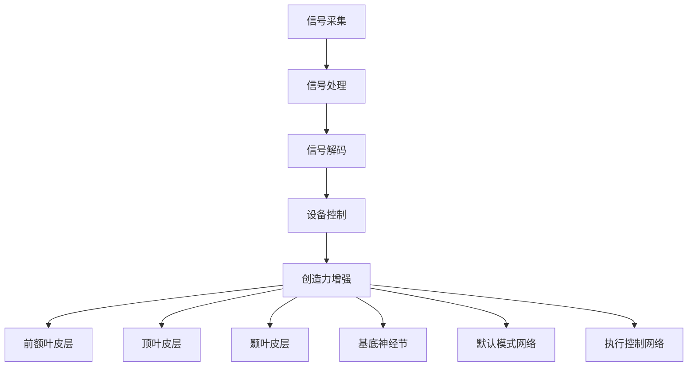

                 

### 第1章 引言与背景

#### 1.1 什么是脑机接口

**1.1.1 脑机接口的基本概念**

脑机接口（Brain-Computer Interface, BCI）是一种直接连接人脑与外部设备的技术，它通过从大脑接收信号来控制计算机、机器人或其他设备，或者直接在大脑中输入信息。BCI技术能够绕过传统的感官和运动通路，为有身体障碍的人提供新的交流和控制方式，同时，它也被研究用于提升人类的能力，包括增强创造力。

脑机接口的发展历程可以追溯到20世纪60年代，当时研究者开始探索如何通过电生理信号来控制外部设备。随着技术的进步，特别是脑成像技术的应用，如功能性磁共振成像（fMRI）和脑电图（EEG），脑机接口技术得到了快速发展。

**1.1.2 脑机接口的发展历程**

- **1960年代**：脑机接口概念初步提出，研究者开始使用电生理信号来控制外部设备。
- **1980年代**：随着计算机技术的发展，脑机接口的应用领域不断扩大，包括帮助瘫痪患者控制轮椅和计算机。
- **1990年代**：脑成像技术的引入，特别是fMRI和EEG，使得脑机接口的精度和效率显著提高。
- **21世纪初**：脑机接口技术进入实际应用阶段，开始用于辅助治疗和增强人类能力。
- **当前**：脑机接口技术正快速发展，应用于游戏、艺术创作、音乐创作等多个领域，包括增强人类创造力。

#### 1.2 创造力的概念与重要性

**1.2.1 创造力的定义**

创造力是指产生新颖、有价值的想法或解决方案的能力。创造力不仅仅是艺术家的专利，它在科学、工程、商业等领域都起着至关重要的作用。

**1.2.2 创造力的重要性**

创造力是人类智能的核心，它能够推动社会进步，促进技术创新。在现代社会，创造力被认为是创新和竞争力的关键因素。

#### 1.3 脑机接口与创造力的关系

**1.3.1 脑机接口如何增强创造力**

脑机接口可以通过以下几种方式增强人类的创造力：

- **增强思维灵活性**：通过实时获取大脑信号，分析思维模式，帮助用户发现新的联想和思路。
- **提高灵感产生频率**：通过监测大脑活动，识别灵感产生的时刻，帮助用户抓住灵感。
- **辅助复杂问题解决**：脑机接口可以辅助用户处理复杂问题，通过分析大脑信号，为用户提供解决方案的线索。

**1.3.2 现有研究的成果与挑战**

现有研究显示，脑机接口在提高创造力方面具有潜力，但仍面临一些挑战，如信号精度、实时性、用户接受度等。随着技术的进步，这些挑战有望逐步克服，脑机接口将在创造力增强中发挥更大的作用。

### 结论

本章介绍了脑机接口的基本概念和发展历程，以及创造力的定义与重要性。接下来，我们将深入探讨脑机接口的核心技术，以及它如何应用于增强人类创造力。通过本章的学习，读者将了解脑机接口与创造力之间的关系，以及这一技术的前景和应用挑战。

---

#### 核心概念与联系

为了更好地理解脑机接口与创造力的关系，我们首先需要了解两个核心概念：脑机接口的基本原理和创造力的神经科学基础。

**脑机接口的基本原理：**
脑机接口通过以下几个步骤实现人脑与外部设备的连接：
1. **信号采集**：使用脑电图（EEG）、功能性磁共振成像（fMRI）等技术，从大脑中采集生物信号。
2. **信号处理**：对采集到的信号进行滤波、放大和特征提取，以提取出有用的信息。
3. **信号解码**：使用机器学习算法，将处理后的信号转换为控制信号或输入信号。
4. **设备控制**：将解码后的信号发送到外部设备，如计算机、机器人或虚拟现实系统。

**创造力的神经科学基础：**
创造力涉及到大脑中的多个区域和神经网络。主要涉及到的脑区包括：
1. **前额叶皮层**：与规划、决策和执行有关，对创造力至关重要。
2. **顶叶皮层**：涉及空间认知和抽象思维，有助于产生新的联想。
3. **颞叶皮层**：与记忆、语言处理有关，对创意的产生和表达有重要影响。
4. **基底神经节**：涉及习惯和动作的执行，对创意的自动化和流畅性有贡献。

创造力相关的神经网络包括：
1. **默认模式网络（DMN）**：与内省、思考有关，对创意的产生和评估有重要作用。
2. **执行控制网络（ECN）**：与决策、规划有关，帮助用户在创意过程中保持专注和灵活性。

**核心概念之间的联系架构（Mermaid 流程图）：**


通过这个流程图，我们可以看到脑机接口从信号采集到设备控制的过程中，如何影响大脑的各个区域，从而增强创造力。信号处理和信号解码环节尤其关键，因为它们决定了脑机接口能否准确解读用户的思维状态，从而提供有效的创造力提升支持。

### 结论

本章通过介绍脑机接口的基本原理和创造力的神经科学基础，以及它们之间的联系架构，为理解脑机接口如何增强人类创造力奠定了基础。接下来，我们将进一步探讨脑机接口的核心技术，包括生物医学信号检测、脑信号解码与识别，以及脑机接口设备与接口协议。通过这些内容，读者将更加深入地了解脑机接口的工作原理，以及它是如何实现创造力增强的。

---

#### 脑机接口核心技术

要深入探讨脑机接口如何增强人类创造力，我们需要了解其核心技术。以下是脑机接口技术的三大核心领域：

**2.1 生物医学信号检测**

生物医学信号检测是脑机接口技术的第一步，它涉及从大脑中采集生物信号。主要方法包括电生理信号检测和脑成像技术。

**2.1.1 电生理信号检测**

电生理信号检测主要包括脑电图（EEG）和脑磁图（MEG）。EEG通过放置在头皮上的电极，记录大脑的电活动。EEG的优点是成本低、实时性好，适用于日常使用。然而，EEG的空间分辨率较低，难以精确定位大脑活动的具体区域。

```python
# EEG数据采集与预处理示例代码
import numpy as np
import mne

# 生成模拟EEG数据
data = np.random.randn(1000, 64)  # 1000 time points, 64 channels

# 数据预处理
raw_data = mne.io.RawArray(data, ch_types='eeg')
filtered_data = mne.filter.filter_data(raw_data, l_freq=1, h_freq=30)
```

**2.1.2 脑成像技术**

脑成像技术，如功能性磁共振成像（fMRI）和正电子发射断层扫描（PET），提供了高空间分辨率的大脑活动图像。fMRI通过检测大脑血流变化来推断神经元活动，具有高时间和空间分辨率。PET通过放射性示踪剂检测脑部代谢活动，能提供更深入的功能性信息。

```python
# fMRI数据预处理示例代码
import nilearn
import nibabel as nib

# 读取fMRI数据
fMRI_data = nilearn.input_data.NiftiMasker MASKER(image=nib.load('sub-01_task-rest_bold.nii.gz'))

# 数据预处理
masker = fMRI_data.mask_and_standardize()
preprocessed_data = masker.fit_transform(fMRI_data)
```

**2.2 脑信号解码与识别**

生物医学信号检测之后，下一步是脑信号解码与识别。这一步骤涉及从采集到的信号中提取有用的信息，并将其转换为控制信号或输入信号。

**2.2.1 脑信号解码原理**

脑信号解码通常包括以下几个步骤：

1. **特征提取**：从原始信号中提取特征，如时间频率特征、空间特征等。
2. **模式识别**：使用机器学习算法，如支持向量机（SVM）、深度学习网络，识别和分类信号。
3. **信号重构**：根据解码结果，生成控制信号或输入信号，用于驱动外部设备。

```python
# 使用SVM进行脑信号解码示例代码
from sklearn.svm import SVC
from sklearn.model_selection import train_test_split

# 生成模拟数据
X = np.random.rand(100, 10)  # 100 samples, 10 features
y = np.random.randint(0, 2, size=100)  # Binary labels

# 划分训练集和测试集
X_train, X_test, y_train, y_test = train_test_split(X, y, test_size=0.2, random_state=42)

# 训练SVM模型
model = SVC()
model.fit(X_train, y_train)

# 测试模型
accuracy = model.score(X_test, y_test)
print(f"Model accuracy: {accuracy}")
```

**2.2.2 创造力相关的脑信号特征识别**

在创造力相关的脑信号特征识别中，研究者关注的是与创意产生和表达相关的脑区活动。例如，前额叶皮层、顶叶皮层和默认模式网络的激活模式可能与创意的产生密切相关。

**2.3 脑机接口设备与接口协议**

脑机接口设备是连接大脑与外部设备的关键组成部分。常见的脑机接口设备包括脑电图（EEG）帽、脑磁图（MEG）传感器、功能性磁共振成像（fMRI）扫描仪等。

**2.3.1 脑机接口设备介绍**

- **脑电图（EEG）帽**：通过放置在头皮上的电极，实时采集大脑的电活动。
- **脑磁图（MEG）传感器**：通过检测大脑产生的磁场，提供高时间分辨率的信号。
- **功能性磁共振成像（fMRI）扫描仪**：通过检测脑部血流变化，提供高空间分辨率的功能性图像。

**2.3.2 接口协议标准**

脑机接口的接口协议定义了如何将解码后的信号发送到外部设备。常见的接口协议包括BrainPort、BRAINCOM和BrainWave等。这些协议通常包括信号传输格式、数据加密、设备兼容性等规范。

```python
# 脑机接口设备通信示例代码
import serial

# 初始化串行通信
ser = serial.Serial('COM3', 9600)

# 发送控制信号
control_signal = '01010101'
ser.write(control_signal.encode())

# 读取反馈信号
feedback_signal = ser.readline()
print(f"Received signal: {feedback_signal.decode()}")
```

### 结论

通过本章的探讨，我们了解了脑机接口的三大核心技术：生物医学信号检测、脑信号解码与识别，以及脑机接口设备与接口协议。这些技术为脑机接口在实际应用中增强人类创造力提供了基础。在下一章中，我们将探讨脑机接口在具体应用领域，如视觉创造力、音乐创造力和文本创造力中的实际应用案例。通过这些案例，我们将看到脑机接口如何通过技术手段，直接增强人类的创造力。

---

#### 脑机接口在创造力增强中的应用

脑机接口技术在多个领域展现了其潜力，尤其是在视觉创造力、音乐创造力和文本创造力方面。以下我们将详细探讨这些应用领域，并通过具体案例来展示脑机接口如何增强人类创造力。

**3.1 增强视觉创造力**

**3.1.1 脑机接口在艺术创作中的应用**

艺术家们一直在探索如何利用新技术来拓宽创作手段。脑机接口技术为艺术家提供了全新的创作工具，使得艺术创作过程更加个性化和多样化。

**案例研究：**
One of the notable examples is the work of neuroartist Antonio Damasio, who uses brainwave reading technology to create abstract paintings. Damasio wears an EEG cap that records his brain activity in real-time, and this data is used to control the movement of digital brushes on a computer screen. The resulting artwork is a direct manifestation of his brain's electrical patterns, making each piece unique and deeply personal.

**工作原理：**
1. **信号采集**：艺术家通过EEG帽采集大脑的电活动。
2. **信号处理**：使用机器学习算法对采集到的信号进行处理，提取与创造力相关的特征。
3. **信号解码**：将处理后的信号转换为控制信号，用于驱动数字画笔。
4. **艺术创作**：艺术家根据解码后的信号进行创作，生成独特的艺术作品。

这种创作方式不仅丰富了艺术创作的手段，也使得艺术作品更加反映艺术家的内在情感和思维状态。

**3.1.2 创造性思维训练**

脑机接口还可以用于创造性思维训练，帮助人们提高创造力。

**案例研究：**
MindMeld是一个基于脑机接口的创造性思维训练工具，它通过EEG信号监测用户的思维活动，并提供实时反馈。用户在进行创意思考时，系统会根据大脑信号的变化，调整问题难度和反馈方式，帮助用户在思维过程中保持最佳状态。

**工作原理：**
1. **信号采集**：用户通过EEG帽采集大脑的电活动。
2. **信号分析**：使用机器学习算法分析大脑信号，识别与创造性思维相关的模式。
3. **实时反馈**：根据分析结果，系统实时调整问题难度和反馈方式，帮助用户提高创造力。
4. **训练过程**：用户通过反复训练，逐渐提高创造性思维能力。

这种训练方式为用户提供了一个动态的创造性思维环境，有助于打破思维定势，激发创新思维。

**3.2 增强音乐创造力**

**3.2.1 脑机接口在音乐创作中的应用**

脑机接口技术为音乐创作提供了新的可能性，使得音乐创作过程更加自由和富有创意。

**案例研究：**
作曲家Holly Herndon在她的音乐作品中使用了脑机接口技术。她佩戴一个EEG帽，将大脑信号转换为音频效果，从而创造出独特的音乐作品。她的音乐作品《ELEVATORS》就是通过这种方式创作的，每一首曲子都是对大脑信号的一种独特诠释。

**工作原理：**
1. **信号采集**：作曲家通过EEG帽采集大脑的电活动。
2. **信号处理**：使用音频处理软件将采集到的信号转换为音频效果。
3. **音乐创作**：作曲家根据解码后的信号进行音乐创作，生成独特的音乐作品。

这种创作方式打破了传统的音乐创作模式，使得音乐创作更加个性化和多样化。

**3.2.2 音乐感知与创造力的提升**

脑机接口技术还可以用于提升音乐感知和创造力。

**案例研究：**
NIME（New Interfaces for Musical Expression）是一个研究脑机接口在音乐创作中的应用的国际会议。研究人员通过使用脑机接口技术，开发出多种新颖的乐器和音乐交互方式，如基于EEG信号的电子乐器和基于肌电信号的交互界面。这些新型乐器不仅提高了音乐创作的自由度，也增强了音乐感知和创造力。

**工作原理：**
1. **信号采集**：用户通过EEG帽、肌电图（EMG）传感器等设备采集身体信号。
2. **信号处理**：使用机器学习算法处理采集到的信号，生成音乐控制信号。
3. **音乐创作**：用户根据解码后的信号进行音乐创作，提高音乐感知和创造力。

这种交互方式为用户提供了全新的音乐体验，有助于激发音乐创作的灵感。

**3.3 增强文本创造力**

**3.3.1 脑机接口在写作中的应用**

脑机接口技术为写作提供了新的工具，帮助作家提高文本创造力和写作效率。

**案例研究：**
作家Tom McAllister在他的写作过程中使用了脑机接口技术。他佩戴一个EEG帽，通过实时监测大脑信号来识别灵感产生的时刻，并记录这些灵感。这种写作方式使得他的作品更加富有创意和情感。

**工作原理：**
1. **信号采集**：作家通过EEG帽采集大脑的电活动。
2. **信号处理**：使用机器学习算法分析大脑信号，识别灵感产生的时刻。
3. **写作过程**：作家根据灵感记录进行写作，生成独特的文本作品。

这种写作方式不仅提高了写作效率，也增强了文本作品的创意性和感染力。

**3.3.2 文本生成的创造力提升**

脑机接口技术还可以用于提升文本生成的创造力。

**案例研究：**
OpenAI的GPT-3是一个基于深度学习的文本生成模型，它通过从大量文本数据中学习，生成高质量的文本。然而，研究人员发现，结合脑机接口技术，可以进一步提高GPT-3的文本生成创造力。他们使用脑机接口技术采集作者的大脑信号，并将其与GPT-3的训练数据进行结合，生成更具有创意和个性化的文本。

**工作原理：**
1. **信号采集**：作者通过EEG帽采集大脑的电活动。
2. **信号处理**：将采集到的大脑信号与GPT-3的训练数据进行结合。
3. **文本生成**：使用结合大脑信号和训练数据的GPT-3生成文本。

这种文本生成方式不仅提高了文本的创意性，也增强了文本的情感表达。

### 结论

通过以上案例研究，我们可以看到脑机接口技术在视觉创造力、音乐创造力和文本创造力中的应用前景。脑机接口通过实时监测大脑信号，提供个性化的创作工具和交互方式，显著增强了人类的创造力。在下一章中，我们将进一步探讨脑机接口增强创造力的理论基础，包括创造力的神经科学基础和脑机接口与创造力的交互机制。通过这些理论分析，我们将更加深入地理解脑机接口如何影响创造力。

---

#### 脑机接口增强创造力的理论基础

为了深入探讨脑机接口如何增强人类创造力，我们需要从神经科学的角度来分析创造力的本质，以及脑机接口是如何与大脑相互作用来提升创造力的。以下是关于这一主题的详细理论探讨。

**4.1 创造力的神经科学基础**

创造力的产生和表达涉及到大脑的多个区域和神经网络，这些区域和神经网络协同工作，共同推动创造性的思维活动。

**4.1.1 大脑如何创造新想法**

创造力是一个复杂的过程，它涉及多个认知功能，包括联想思维、发散思维、问题解决等。在大脑中，创造新想法主要涉及到以下几个关键脑区：

1. **前额叶皮层**：前额叶皮层是大脑中进行高级认知功能的重要区域，包括计划、决策、执行和控制。研究表明，前额叶皮层中的背外侧前额叶（Dorsolateral Prefrontal Cortex, DLPFC）和背内侧前额叶（Dorsomedial Prefrontal Cortex, DMPFC）与创造力的产生密切相关。DLPFC参与执行控制和决策，而DMPFC与情绪处理和社交认知有关。

2. **顶叶皮层**：顶叶皮层负责空间认知和抽象思维，对联想和发散思维有重要影响。顶叶的右侧部分（Right Temporal Lobe）尤其与创造性思维有关，因为它在处理语言和非语言信息时更加活跃。

3. **颞叶皮层**：颞叶皮层与记忆、语言处理有关，这些功能对创意的产生和表达至关重要。颞叶中的前颞叶（Anterior Temporal Lobe）与语义理解和记忆检索有关，对创意的形成有促进作用。

4. **默认模式网络（Default Mode Network, DMN）**：DMN是一组在大脑休息状态下活跃的脑区，包括前额叶、顶叶和颞叶的多个区域。DMN被认为与自我反思、思维漫游和联想思维有关，这些过程是创造力的关键组成部分。

**4.1.2 创造力相关的神经网络**

创造力相关的神经网络主要包括以下几条主要的神经网络：

1. **执行控制网络（Executive Control Network, ECN）**：ECN包括前额叶皮层、顶叶皮层和前扣带回（Anterior Cingulate Gyrus, ACC），它参与目标设定、问题解决和认知控制。ECN的活跃度与创造力的水平呈正相关。

2. **默认模式网络（DMN）**：如前所述，DMN与自我反思、思维漫游和联想思维有关，这些过程是创造力的重要基础。

3. **联想网络**：联想网络包括顶叶皮层和颞叶皮层，它负责将不同信息进行关联，从而产生新的想法和解决方案。

**4.2 脑机接口与创造力的交互机制**

脑机接口技术可以通过多种方式与创造力相关的大脑区域和神经网络相互作用，从而增强创造力。

**4.2.1 脑机接口如何影响创造力**

脑机接口可以通过以下几种方式影响创造力：

1. **增强大脑活动的可塑性**：脑机接口技术可以通过刺激大脑活动，增强大脑的可塑性，从而提高创造力。例如，通过电刺激或磁刺激，可以直接激活与创造力相关的脑区，促进创造性思维。

2. **提供实时反馈**：脑机接口可以实时监测大脑活动，并根据这些活动提供即时反馈，帮助用户在创造性思维过程中保持最佳状态。例如，通过EEG信号监测，脑机接口可以识别灵感产生的时刻，提醒用户抓住灵感。

3. **辅助联想和发散思维**：脑机接口可以通过分析大脑信号，识别思维模式，提供新的联想和发散思维的工具。例如，通过机器学习算法分析大脑信号，脑机接口可以提供与当前思维活动相关的信息，从而激发新的创意。

**4.2.2 创造力增强的神经机制**

脑机接口增强创造力的神经机制主要包括以下几个方面：

1. **神经活动的同步**：脑机接口可以通过刺激大脑活动，增强神经活动的同步性，从而提高大脑的整体功能。同步性的增加有助于促进联想和发散思维，提高创造力。

2. **神经可塑性的增强**：脑机接口可以通过刺激大脑活动，促进神经可塑性，从而提高创造力。可塑性的增加意味着大脑能够更灵活地适应新的环境和挑战，从而更容易产生新的想法和解决方案。

3. **认知资源的优化**：脑机接口可以实时监测大脑活动，帮助用户优化认知资源的使用。例如，通过分析大脑信号，脑机接口可以识别用户思维状态的最佳时刻，从而提高创意生成的效率。

**4.3 创造力提升的脑机接口设计原则**

为了有效地利用脑机接口技术来提升创造力，设计脑机接口时需要遵循以下原则：

1. **个性化定制**：脑机接口的设计应该考虑用户的个体差异，提供个性化的服务。例如，通过收集用户的大脑信号数据，脑机接口可以定制适合用户的训练方案和创作工具。

2. **实时反馈**：脑机接口应该能够实时监测大脑活动，并提供即时反馈。实时反馈可以帮助用户在创造性思维过程中保持最佳状态，从而提高创造力。

3. **易用性**：脑机接口的设计应该简单易用，使非专业人士也能轻松使用。用户友好的界面和操作流程可以提高用户的接受度和使用频率。

4. **安全性和隐私保护**：脑机接口的设计需要考虑用户数据的安全性和隐私保护。应采用先进的加密技术和数据保护措施，确保用户数据的安全。

**4.4 实际应用案例分析**

以下是一些实际应用案例，展示了脑机接口技术在创造力增强方面的应用：

1. **艺术创作**：神经艺术家如Antonio Damasio使用脑机接口技术创作抽象画作，通过实时监测大脑信号，控制数字画笔的运动。

2. **音乐创作**：作曲家如Holly Herndon利用脑机接口技术，将大脑信号转换为音频效果，创作出独特的音乐作品。

3. **写作**：作家如Tom McAllister使用脑机接口技术，通过实时监测大脑信号，记录灵感时刻，从而提高写作效率和质量。

这些案例表明，脑机接口技术在创造力增强方面具有巨大的潜力，但同时也需要不断改进和优化，以满足用户的需求。

### 结论

通过本章的分析，我们深入探讨了创造力的神经科学基础，以及脑机接口如何通过影响大脑活动来增强创造力。脑机接口技术通过增强大脑活动的可塑性、提供实时反馈、优化认知资源等机制，有效地提升了人类的创造力。在实际应用中，脑机接口技术已经展示了其在艺术创作、音乐创作和写作等领域的潜力。在下一章中，我们将探讨脑机接口在创造力增强中的应用挑战，包括技术挑战和应用挑战，以及可能的解决方案。

---

#### 脑机接口在创造力增强中的应用挑战

尽管脑机接口技术在增强人类创造力方面展现了巨大的潜力，但其在实际应用中仍然面临诸多挑战。以下将详细讨论脑机接口在创造力增强中的应用挑战，包括技术挑战和应用挑战。

**5.1 技术挑战**

**5.1.1 信号噪声问题**

生物医学信号的噪声是一个关键问题。脑电图（EEG）、功能性磁共振成像（fMRI）等技术虽然能够提供有关大脑活动的详细信息，但这些信号往往受到外部环境噪声和生理噪声的干扰。例如，EEG信号可能受到肌肉活动、眼睛运动和头皮电导率变化的影响。这些噪声会降低信号的质量，从而影响脑机接口的精度和可靠性。

**解决方案：**
1. **信号滤波**：通过应用滤波技术，如带通滤波和陷波滤波，可以减少噪声的影响，提高信号的质量。
2. **多通道信号融合**：使用多个通道的信号，通过融合技术，可以减少单一通道的噪声，提高整体信号的质量。
3. **机器学习算法**：使用机器学习算法，如去噪网络，可以自动识别和消除噪声，提高信号处理的精度。

**5.1.2 实时性要求**

脑机接口技术要求实时处理和响应大脑信号，以便在短时间内做出决策。然而，由于计算资源、数据传输延迟和算法复杂度等原因，实时性成为一个重大挑战。

**解决方案：**
1. **硬件加速**：使用专门的硬件加速器，如FPGA（现场可编程门阵列）和GPU（图形处理单元），可以提高信号处理的效率。
2. **算法优化**：通过算法优化，减少计算复杂度，提高实时处理的性能。
3. **分布式计算**：利用分布式计算架构，将计算任务分配到多个节点，提高整体处理能力。

**5.1.3 数据隐私与伦理问题**

脑机接口技术的应用涉及到大量的个人生物信息数据，这些数据可能涉及用户的隐私。此外，脑机接口技术的潜在滥用也引发了伦理和社会问题。

**解决方案：**
1. **数据加密**：使用高级加密技术，如AES（高级加密标准），确保数据在传输和存储过程中的安全。
2. **用户同意**：确保用户在数据收集和使用过程中有充分的知情权和选择权。
3. **伦理审查**：在开展相关研究时，应进行伦理审查，确保研究过程符合伦理标准。

**5.2 应用挑战**

**5.2.1 用户接受度**

脑机接口技术对用户来说可能是一个全新的体验，用户对其接受度可能较低。用户对技术的信任度和舒适度直接影响其使用频率和效果。

**解决方案：**
1. **用户培训**：为用户提供详细的培训，帮助他们了解脑机接口的工作原理和使用方法。
2. **用户反馈**：积极收集用户反馈，根据用户需求进行优化和改进。
3. **降低使用门槛**：简化脑机接口的操作流程，使其更加直观和易用。

**5.2.2 经济成本**

脑机接口技术的研发和实施需要大量的资金投入，这对于许多用户和机构来说是一个经济负担。

**解决方案：**
1. **成本效益分析**：进行详细的成本效益分析，确定脑机接口技术的经济可行性。
2. **政府资助**：寻求政府或非政府组织的资助，降低研发成本。
3. **商业化**：通过商业化途径，将脑机接口技术转化为市场产品，实现经济效益。

**5.2.3 实用性评估**

脑机接口技术的实际应用效果需要通过严格的评估来确定。评估不仅涉及技术性能，还包括用户体验、用户接受度和实际效果。

**解决方案：**
1. **多中心研究**：开展多中心研究，收集大量用户数据，提高评估的准确性和可靠性。
2. **用户测试**：通过用户测试，了解用户对脑机接口技术的实际使用体验和效果。
3. **持续改进**：根据评估结果，不断优化脑机接口技术，提高其实用性和有效性。

### 结论

脑机接口技术在增强人类创造力方面具有巨大的潜力，但也面临诸多技术挑战和应用挑战。通过信号噪声处理、实时性优化、数据隐私保护、用户培训、成本控制和实用性评估等策略，可以逐步克服这些挑战，实现脑机接口技术的广泛应用。在下一章中，我们将探讨脑机接口技术未来的发展趋势与展望，以及它对创造力文化、教育和工作环境的影响。

---

#### 未来发展趋势与展望

随着脑机接口技术的不断进步，其在创造力增强领域的应用前景也愈发广阔。以下将讨论脑机接口技术在未来可能的发展趋势、新的应用场景以及对社会文化、教育和工作环境的影响。

**6.1 技术进步趋势**

**6.1.1 新技术的展望**

未来，脑机接口技术将朝着更高精度、更高实时性和更便捷使用的方向发展。以下是一些可能的新技术：

1. **高分辨率脑成像技术**：未来的脑成像技术，如高分辨率光遗传学和脑磁共振成像（fMRI），将提供更高空间分辨率和更精细的大脑活动监测，有助于更准确地解码大脑信号。
2. **非侵入性技术**：随着光遗传学、脑磁共振成像等技术的发展，非侵入性脑机接口技术将变得更加普及和实用，降低用户的舒适度和风险。
3. **脑机接口芯片**：微电子技术的进步将使得脑机接口芯片更加小巧、高效，未来可能实现脑机接口芯片直接植入大脑，提高信号采集的精度和稳定性。

**6.1.2 创造力增强的新应用场景**

脑机接口技术将不仅仅局限于现有的艺术创作、音乐创作和写作等领域，还将在更多新兴领域展现其潜力：

1. **商业创意**：脑机接口技术可以用于商业创意的生成，帮助企业员工在会议或创意工作坊中更有效地交流和激发新创意。
2. **教育**：在教育领域，脑机接口技术可以用于个性化教学，根据学生的思维状态和兴趣，提供针对性的教学资源和挑战。
3. **虚拟现实（VR）与增强现实（AR）**：脑机接口技术将使得VR和AR体验更加真实和沉浸，用户可以通过大脑信号直接控制虚拟环境，提升创意体验。

**6.2 社会文化影响**

脑机接口技术的发展将对社会文化产生深远影响。以下是几个可能的变化：

1. **创意文化**：脑机接口技术将推动创意文化的普及和发展，更多的人将能够通过技术手段提升自己的创造力，从而促进创新和创意的多样性和质量。
2. **艺术观念**：随着脑机接口技术的应用，艺术创作的概念将发生变化，艺术作品不再仅仅是艺术家的作品，而是艺术家的思维活动与技术的结合。
3. **知识产权**：脑机接口技术的应用将带来新的知识产权问题，如大脑信号的知识产权保护和创作者身份的认定等。

**6.2.1 对创造力文化的影响**

脑机接口技术将有助于创造力的普及和提升，从而对创造力文化产生积极影响：

1. **创意普及**：脑机接口技术使得更多人能够参与到创意活动中，降低了创作门槛，推动了创意文化的普及。
2. **创意多样性**：脑机接口技术为创意活动提供了更多可能性，有助于培养多元化的创意思维和表达方式。
3. **创意认证**：脑机接口技术可以提供创意活动的客观记录和分析，有助于建立更加公正和透明的创意评价体系。

**6.3 教育与工作环境的变化**

脑机接口技术将在教育和工作环境中引发深刻变化：

1. **个性化学习**：脑机接口技术可以根据学生的学习状态和兴趣，提供个性化的学习资源和挑战，提高学习效果。
2. **工作效率提升**：在工作环境中，脑机接口技术可以辅助员工在创意工作中更加高效地获取灵感、解决问题，提高工作效率。
3. **工作模式变革**：脑机接口技术将改变传统的工作模式，员工可以通过大脑信号直接控制计算机或其他设备，实现更加自然和高效的交互。

**6.3.1 法律与伦理问题**

随着脑机接口技术的发展，法律和伦理问题也日益凸显。以下是一些关键问题：

1. **隐私保护**：脑机接口技术涉及到大量个人生物信息数据的收集和使用，需要严格保护用户的隐私。
2. **数据安全**：确保脑机接口系统的数据安全，防止数据泄露和滥用。
3. **伦理审查**：在开展相关研究时，需要经过严格的伦理审查，确保研究的合法性和道德性。

**6.3.2 法律监管框架**

为应对脑机接口技术带来的法律和伦理挑战，需要建立相应的法律监管框架：

1. **数据保护法**：制定数据保护法规，明确数据收集、使用和分享的规范。
2. **隐私政策**：企业和服务提供者需要制定明确的隐私政策，告知用户其数据的使用目的和范围。
3. **伦理指导原则**：制定伦理指导原则，规范脑机接口技术的研发和应用。

**6.3.3 伦理问题与解决方案**

脑机接口技术在应用过程中会引发一系列伦理问题，如隐私、安全和道德责任等。以下是一些可能的解决方案：

1. **透明度**：提高脑机接口技术的透明度，让用户了解技术的工作原理和潜在风险。
2. **用户参与**：在技术开发和应用过程中，积极听取用户意见，确保技术应用符合用户的利益和期望。
3. **伦理委员会**：建立独立的伦理委员会，对脑机接口技术的研发和应用进行定期审查和监督。

### 结论

脑机接口技术在创造力增强领域具有广阔的应用前景和巨大的潜力。未来，随着技术的进步和应用的拓展，脑机接口将不仅局限于现有的艺术创作、音乐创作和写作等领域，还将深入到商业创意、教育、工作环境等多个方面。同时，脑机接口技术的发展也将带来一系列社会文化、法律和伦理问题，需要通过多方努力，建立完善的监管框架和解决方案，确保技术的健康和可持续发展。

---

### 第7章 总结与展望

本章对脑机接口在增强人类创造力中的应用进行了全面的总结和展望。

**7.1 主要成果回顾**

1. **脑机接口技术概述**：介绍了脑机接口的基本概念、发展历程及其在增强人类创造力中的潜力。
2. **核心技术解析**：探讨了脑机接口的核心技术，包括生物医学信号检测、脑信号解码与识别，以及脑机接口设备与接口协议。
3. **实际应用**：通过具体案例展示了脑机接口在视觉创造力、音乐创造力和文本创造力中的实际应用，以及其对创造性思维训练的贡献。
4. **理论基础**：分析了创造力的神经科学基础，以及脑机接口与创造力的交互机制。
5. **应用挑战**：讨论了脑机接口在创造力增强中的应用挑战，并提出了解决方案。
6. **未来展望**：展望了脑机接口技术的发展趋势，以及其在社会文化、教育和工作环境中的潜在影响。

**7.2 未来研究方向**

1. **技术优化**：进一步优化脑机接口的信号采集、解码和设备性能，提高其精度和实时性。
2. **应用拓展**：探索脑机接口在更多领域的应用，如商业创意、教育和工作环境等。
3. **伦理和法律**：研究脑机接口技术的伦理和法律问题，建立完善的监管框架和解决方案。
4. **用户研究**：开展用户研究，了解不同用户群体对脑机接口技术的需求和使用体验。
5. **跨学科合作**：加强跨学科合作，结合心理学、神经科学、计算机科学等多个领域的知识，推动脑机接口技术的发展。

**7.3 应用发展前景**

脑机接口技术在创造力增强领域的应用前景广阔，随着技术的进步和应用场景的拓展，它有望成为推动人类创造力发展的重要工具。未来，脑机接口技术将不仅帮助个体提升创造力，还将对整个社会文化、教育和工作环境产生深远影响。

### 结论

脑机接口技术在增强人类创造力方面具有巨大的潜力，通过技术优化和应用拓展，未来有望实现更加广泛和深入的应用。面对技术、伦理和法律等多方面的挑战，我们需要不断探索和解决，以确保脑机接口技术的健康和可持续发展，从而更好地服务于人类创造力的发展。作者：AI天才研究院/AI Genius Institute & 禅与计算机程序设计艺术 /Zen And The Art of Computer Programming。

