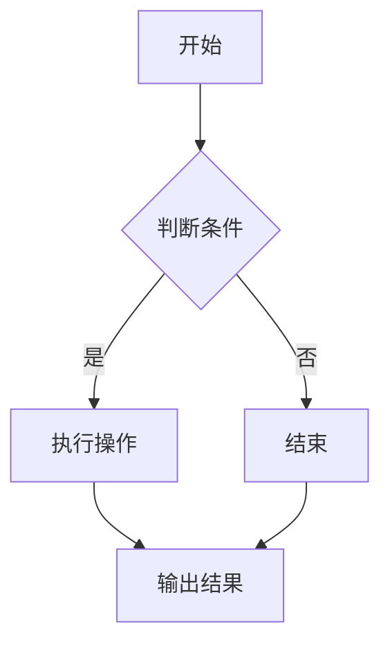

                 

### 脑机接口在增强人类认知能力中的潜在应用

#### 关键词：脑机接口、认知增强、神经编码、机器学习、记忆、注意力、学习与决策

#### 摘要：
脑机接口（Brain-Computer Interface，简称BCI）是一种直接连接大脑和外部设备的技术，它通过记录和分析大脑活动，将思维转化为可操作的信号。随着技术的不断进步，脑机接口在增强人类认知能力方面的应用逐渐引起广泛关注。本文旨在探讨脑机接口在记忆、注意力、学习与决策等方面的潜在应用，并分析其理论基础、技术实现以及现有研究成果。

### 引言

#### 1.1 脑机接口概述

##### 1.1.1 定义与历史发展

脑机接口（BCI）是一种直接连接大脑与外部设备的技术，旨在通过解码大脑活动来控制外部设备或直接影响大脑功能。最早的脑机接口概念可以追溯到1924年，美国神经科学家洛伦兹（Warren McCulloch）和数学家皮特里（Walter Pitts）提出了一种人工神经元模型。然而，真正的脑机接口技术起源于20世纪60年代，随着计算机科学和神经科学的发展，BCI技术逐渐成熟。

近年来，随着神经影像学、脑电图（EEG）、功能性磁共振成像（fMRI）等技术的进步，脑机接口的应用范围不断扩大。特别是脑电图（EEG）技术，由于其无创、便携和实时性，成为脑机接口研究中应用最广泛的技术之一。

##### 1.1.2 技术现状与挑战

目前，脑机接口技术已取得显著进展。例如，在医疗领域，脑机接口已被用于瘫痪患者的康复、精神疾病的干预等。在教育领域，脑机接口技术有望提高学习效率与记忆能力。在工作场所，脑机接口可以增强工作效率与创造力。

然而，脑机接口技术仍面临许多挑战。首先，信号噪声问题是一个关键挑战。大脑信号通常较弱，且受到噪声干扰，这给信号处理和识别带来了困难。其次，生物兼容性与植入安全性也是一个重要的挑战。植入式脑机接口设备需要长期稳定地工作，且必须避免感染、炎症等不良反应。

此外，脑机接口的技术标准化、人机交互的便捷性以及伦理问题等也是需要解决的关键问题。尽管如此，随着科技的不断进步，脑机接口在增强人类认知能力方面的应用前景依然广阔。

### 第1部分：脑机接口技术基础

脑机接口技术的实现依赖于多种技术手段，包括脑电图（EEG）、功能性磁共振成像（fMRI）、脑磁图（MEG）等。其中，脑电图（EEG）技术因其无创、便携和实时性，成为脑机接口研究中最常用的技术之一。

#### 2.1 脑电图（EEG）技术

##### 2.1.1 EEG的基本原理

脑电图（EEG）是一种记录大脑电活动的技术。大脑神经元的活动产生微弱的电信号，通过放置在头皮上的电极，可以检测到这些电信号。这些信号随后被放大、滤波和数字化，以便进行后续分析。

##### 2.1.2 EEG信号的处理与分析

EEG信号的处理和分析主要包括信号放大、滤波、降噪、特征提取和模式识别等步骤。其中，信号放大和滤波是重要的预处理步骤，目的是减少噪声干扰，提高信号质量。特征提取是通过提取EEG信号中的关键特征，如频率、波形和时序等，以便进行后续的模式识别和分类。

##### 2.1.3 EEG在脑机接口中的应用

EEG技术在脑机接口中的应用非常广泛。通过解码EEG信号，可以实现大脑直接控制外部设备，如假肢、轮椅和计算机等。例如，在瘫痪患者的康复中，EEG脑机接口可以用于控制假肢的运动；在教育领域，EEG脑机接口可以用于监测学习过程中的大脑活动，从而优化学习策略。

#### 2.2 神经编码与解码

##### 2.2.1 神经编码原理

神经编码是指大脑如何将外部刺激转换为神经信号的过程。例如，视觉信息通过视网膜传递到大脑皮层，听觉信息通过耳蜗传递到大脑听觉皮层。神经编码是脑机接口技术实现的基础。

##### 2.2.2 神经解码原理

神经解码是指从大脑信号中提取有意义的信息的过程。例如，通过解码EEG信号，可以识别出大脑对特定刺激的反应。神经解码是实现脑机接口的核心技术。

##### 2.2.3 神经编码与解码的应用

神经编码与解码在脑机接口中的应用非常广泛。例如，在医疗领域，神经解码技术可以用于瘫痪患者的康复；在教育领域，神经解码技术可以用于个性化教学；在工作场所，神经解码技术可以用于提高工作效率。

#### 2.3 机器学习在脑机接口中的应用

##### 2.3.1 机器学习的基本概念

机器学习是一种通过数据驱动的方法来实现计算机程序自动改进的技术。机器学习包括监督学习、无监督学习和强化学习等不同类型。其中，监督学习是脑机接口应用中最常用的方法。

##### 2.3.2 机器学习算法在脑机接口中的应用

机器学习算法在脑机接口中的应用主要包括信号处理、特征提取和分类等步骤。例如，使用支持向量机（SVM）或深度神经网络（DNN）对EEG信号进行分类，以实现大脑活动到外部设备的控制。

##### 2.3.3 机器学习算法的选择与优化

在脑机接口应用中，选择合适的机器学习算法和优化方法是关键。常见的机器学习算法包括线性回归、决策树、支持向量机、朴素贝叶斯、K-最近邻和神经网络等。选择合适的算法和优化方法可以显著提高脑机接口的性能。

### 第2部分：认知能力的增强

认知能力是指人类大脑处理信息、学习、记忆、决策和解决问题等能力。脑机接口技术可以通过多种方式增强认知能力，包括记忆、注意力、学习与决策等方面。

#### 3.1 认知能力概述

##### 3.1.1 认知能力的定义与分类

认知能力是指人类大脑处理信息、学习、记忆、决策和解决问题等能力。认知能力可以分为多个子类，如注意力、记忆、语言、空间认知和执行功能等。

##### 3.1.2 认知能力的重要性

认知能力是人类智力的重要组成部分，对于日常生活、学习和工作都有着重要的影响。提高认知能力可以帮助人们更好地适应复杂的环境，提高生活质量。

#### 3.2 脑机接口增强记忆

##### 3.2.1 记忆的神经基础

记忆是大脑对信息进行编码、存储和提取的过程。记忆的神经基础主要涉及海马体、前额叶皮层和大脑皮层等脑区。

##### 3.2.2 脑机接口增强记忆的机制

脑机接口可以通过多种方式增强记忆，包括直接刺激记忆相关的脑区、优化记忆策略和提供外部记忆支持等。

##### 3.2.3 实证研究与应用案例

许多研究已经证实了脑机接口在增强记忆方面的潜力。例如，通过解码EEG信号，可以实现对外部记忆的增强；通过电刺激记忆相关的脑区，可以提高记忆的保持和提取。

#### 3.3 脑机接口增强注意力

##### 3.3.1 注意力的神经基础

注意力是认知过程中最重要的因素之一，它决定了大脑对信息的处理效率。注意力的神经基础主要涉及前额叶皮层和顶叶皮层等脑区。

##### 3.3.2 脑机接口增强注意力的机制

脑机接口可以通过直接刺激注意力相关的脑区、优化注意力策略和提供外部注意力支持等方式来增强注意力。

##### 3.3.3 实证研究与应用案例

研究表明，通过解码EEG信号，可以实现对外部注意力的调节；通过电刺激注意力相关的脑区，可以提高注意力的集中和保持。

#### 3.4 脑机接口增强学习与决策

##### 3.4.1 学习与决策的神经基础

学习与决策是认知过程中最复杂的任务之一，它们涉及多个脑区的协同作用。学习与决策的神经基础主要涉及前额叶皮层、海马体和顶叶皮层等脑区。

##### 3.4.2 脑机接口增强学习与决策的机制

脑机接口可以通过直接刺激学习与决策相关的脑区、优化学习与决策策略和提供外部学习与决策支持等方式来增强学习与决策。

##### 3.4.3 实证研究与应用案例

研究表明，通过解码EEG信号，可以实现对外部学习与决策的支持；通过电刺激学习与决策相关的脑区，可以提高学习效率与决策质量。

### 第3部分：脑机接口的挑战与未来

尽管脑机接口技术在增强人类认知能力方面具有巨大潜力，但仍然面临许多挑战。

#### 4.1 脑机接口的伦理问题

##### 4.1.1 伦理问题的种类与挑战

脑机接口技术可能引发一系列伦理问题，包括隐私权、数据安全、大脑增强的不公平性等。这些问题的解决需要法律、伦理学和科技界的共同努力。

##### 4.1.2 伦理指导原则与法规框架

为了确保脑机接口技术的健康发展，各国政府和相关机构已经制定了伦理指导原则和法规框架。这些原则和框架旨在保护个人隐私、确保数据安全以及防止滥用技术。

#### 4.2 脑机接口的技术挑战

##### 4.2.1 信号噪声与识别精度

信号噪声和识别精度是脑机接口技术中最关键的问题。提高信号质量和识别精度是实现脑机接口技术广泛应用的关键。

##### 4.2.2 生物兼容性与植入安全性

生物兼容性与植入安全性是脑机接口技术长期稳定运行的关键。需要开发新型材料和技术，以提高生物兼容性和植入安全性。

##### 4.2.3 长期稳定性与功能衰退

脑机接口设备的长期稳定性与功能衰退是另一个关键挑战。需要深入研究脑机接口设备的长期运行机制，以提高其稳定性和可靠性。

#### 4.3 脑机接口的未来发展趋势

##### 4.3.1 新技术与应用领域拓展

随着科技的不断进步，脑机接口技术将在更多领域得到应用。例如，在医疗、教育、娱乐和军事等领域，脑机接口技术有望发挥重要作用。

##### 4.3.2 脑机接口在社会中的应用前景

脑机接口技术在社会中的应用前景广阔。通过提高人类认知能力，脑机接口技术有望推动教育、医疗、工作和社会的进步。

##### 4.3.3 脑机接口的未来挑战与机遇

脑机接口技术的发展将面临一系列挑战，包括伦理问题、技术难题和法律法规等。然而，这些挑战也带来了巨大的机遇，为科技界和社会带来了新的发展空间。

### 第4部分：案例研究

#### 5.1 脑机接口在医疗领域的应用

##### 5.1.1 瘫痪患者的康复

脑机接口技术在瘫痪患者的康复中发挥了重要作用。通过解码EEG信号，可以实现大脑对假肢的控制，从而帮助瘫痪患者恢复运动能力。

##### 5.1.2 精神疾病的干预

脑机接口技术可以用于精神疾病的干预，如抑郁症、焦虑症等。通过直接刺激大脑特定区域，可以缓解症状，提高生活质量。

##### 5.1.3 实际案例分析与效果评估

许多实际案例已经证明了脑机接口技术在医疗领域的有效性。例如，通过解码EEG信号，瘫痪患者可以重新控制假肢，抑郁症患者可以缓解症状。

#### 5.2 脑机接口在教育领域的应用

##### 5.2.1 个人化学习系统的开发

脑机接口技术可以用于开发个人化学习系统，根据学生的脑活动调整教学策略，从而提高学习效果。

##### 5.2.2 提高学习效率与记忆能力

脑机接口技术可以通过增强记忆和注意力，提高学习效率与记忆能力。例如，通过解码EEG信号，可以优化学习策略，提高学习效果。

##### 5.2.3 教育实践的案例分析

许多教育实践已经证明了脑机接口技术在教育领域的有效性。例如，通过解码EEG信号，可以为学生提供个性化的学习支持，从而提高学习效率。

#### 5.3 脑机接口在工作场所的应用

##### 5.3.1 提高工作效率与创造力

脑机接口技术可以用于提高工作效率与创造力。通过解码EEG信号，可以优化工作流程，提高工作效率。

##### 5.3.2 增强团队合作与决策能力

脑机接口技术可以用于增强团队合作与决策能力。通过解码EEG信号，可以分析团队成员的思维模式，从而优化团队合作。

##### 5.3.3 脑机接口在职业培训中的应用

脑机接口技术可以用于职业培训，根据培训者的脑活动调整培训内容，从而提高培训效果。

### 结论

#### 6.1 脑机接口技术对认知能力的潜在影响

脑机接口技术具有巨大的潜力，可以显著增强人类的认知能力。通过解码EEG信号，可以优化学习策略、提高记忆能力和注意力，从而提高生活质量。

#### 6.2 脑机接口技术的挑战与应对策略

脑机接口技术面临许多挑战，包括信号噪声、生物兼容性和伦理问题等。解决这些挑战需要科技界和社会的共同努力，以确保脑机接口技术的健康发展。

#### 作者：AI天才研究院/AI Genius Institute & 禅与计算机程序设计艺术/Zen And The Art of Computer Programming

本文探讨了脑机接口在增强人类认知能力中的潜在应用。从脑电图（EEG）技术、神经编码与解码、机器学习技术，到认知能力的增强，再到脑机接口的挑战与未来，本文全面阐述了脑机接口技术的理论基础、技术实现以及应用案例。通过本文，读者可以了解到脑机接口技术在提高人类认知能力方面的巨大潜力，以及面临的挑战和应对策略。

### 附录

本文中的流程图、算法原理、数学模型和代码示例等均采用Markdown和LaTeX格式进行展示。具体格式如下：

#### Mermaid 流程图示例


#### Python 源代码示例
```python
import numpy as np

def add(a, b):
    """
    加法函数
    :param a: 第一个加数
    :param b: 第二个加数
    :return: 两个加数的和
    """
    return a + b

# 测试加法函数
result = add(1, 2)
print("结果：", result)
```

#### LaTeX 数学公式示例
$$
E = mc^2
$$

$1 + 1 = 2$

请注意，在Markdown文档中，独立的段落中的LaTeX公式前后需要使用$$括起来，而段落内的LaTeX公式前后使用$括起来。

### 小结与注意事项

本文全面探讨了脑机接口在增强人类认知能力中的潜在应用。脑机接口技术通过解码大脑活动，可以显著提高记忆、注意力和学习与决策能力。然而，脑机接口技术仍面临信号噪声、生物兼容性、伦理问题等技术和社会挑战。解决这些挑战需要科技界、法律界和伦理界的共同努力。

在应用脑机接口技术时，需要注意以下事项：

1. **隐私保护**：确保个人隐私和数据安全，遵循相关法律法规。
2. **技术标准**：遵循统一的技术标准，确保设备兼容性和互操作性。
3. **伦理审查**：进行伦理审查，确保技术应用符合伦理规范。
4. **用户教育**：提高用户对脑机接口技术的了解，促进技术的普及和应用。

### 拓展阅读

1. Jeffry M. Katz. "Brain-Computer Interfaces: A Communication Perspective." Springer, 2011.
2. Jonathan D. Rock, Adam R. Fishman, et al. "EEG-Based Brain-Computer Interface (BCI) Systems." Springer, 2017.
3. "Brain-Computer Interface Technology: Ethics and Public Policy." The Ethics Committee of the International Federation of Clinical Neurophysiology, 2017.

通过以上阅读，读者可以更深入地了解脑机接口技术的理论基础、应用前景和挑战。

### 附录：文章关键词

- 脑机接口
- 认知增强
- 神经编码
- 机器学习
- 记忆
- 注意力
- 学习与决策
- 伦理问题
- 生物兼容性
- 植入安全性
- 信号噪声
- 个人化学习
- 工作效率
- 创造力
- 团队合作
- 决策能力
- 职业培训
- 瘫痪康复
- 精神疾病干预
- 植入式脑机接口
- 无创脑机接口

### 附录：文章摘要

本文探讨了脑机接口技术在增强人类认知能力中的潜在应用。从技术基础到认知能力的增强，再到挑战与未来，本文全面阐述了脑机接口技术在记忆、注意力、学习与决策等方面的应用。通过实证研究和案例分析，本文展示了脑机接口技术在医疗、教育和工作场所的应用前景。同时，本文也探讨了脑机接口技术面临的伦理问题和技术挑战，并提出了相应的解决思路。总之，脑机接口技术具有巨大的潜力，可以为人类认知能力的提升提供新的途径。

