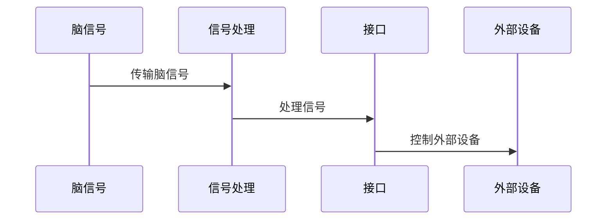

                 

## 《脑机接口在情感调节中的潜在应用》

### 关键词
- 脑机接口
- 情感调节
- 生物信号处理
- 机器学习
- 临床应用

### 摘要
本文将探讨脑机接口在情感调节中的潜在应用。首先，我们将介绍脑机接口的基础知识，包括其定义、历史发展、分类与工作原理。接着，我们将分析脑机接口在情感调节中的核心概念，如情感状态表示模型。随后，文章将深入探讨脑机接口在情感调节中的应用场景，如情绪分析系统。此外，我们还将探讨脑机接口在临床情感调节中的应用，如认知行为疗法（CBT）。最后，我们将展望脑机接口技术的未来趋势与挑战，并提出解决方案。

## 第一部分：脑机接口概述

### 第1章：脑机接口的基础知识

#### 1.1 脑机接口的定义与历史发展

脑机接口（Brain-Computer Interface，简称BCI）是一种直接连接人脑与外部设备的技术。它通过捕捉大脑信号，并将其转换为可操作的指令，从而实现人脑对设备的控制。这一概念最早由美国神经科学家John Donoghue在20世纪80年代提出。

#### 核心概念与联系

脑机接口的核心概念包括脑信号、信号处理、接口和外部设备。这些概念之间的关系可以用以下Mermaid流程图表示：



#### 1.2 脑机接口的分类与工作原理

脑机接口可以分为侵入性和非侵入性两大类。侵入性脑机接口直接植入大脑，获取高精度的脑信号，但存在手术风险。非侵入性脑机接口通过头皮表面获取脑信号，安全性高，但信号精度较低。

#### 核心算法原理讲解

脑机接口的工作原理主要涉及脑信号的采集与预处理、信号解码与模式识别。

**脑信号采集与预处理：**

```python
# 假设使用EEG信号
def preprocess_eeg(data):
    # 数据去噪
    filtered_data = filter_signal(data)
    # 数据标准化
    normalized_data = normalize(filtered_data)
    return normalized_data
```

**信号解码与模式识别：**

```python
# 假设使用机器学习算法进行解码
def decode_signal(normalized_data):
    model = load_model()
    decoded_output = model.predict(normalized_data)
    return decoded_output
```

## 第二部分：脑机接口在情感调节中的应用

### 第2章：脑机接口在情感调节中的应用

#### 2.1 情感调节与脑机接口的关系

情感调节是指个体通过认知和行为策略来管理自己的情绪状态。脑机接口通过捕捉大脑信号，可以实时监测个体的情感状态，从而实现情感调节。

#### 2.2 脑机接口在情感调节中的应用场景

脑机接口在情感调节中的应用场景广泛，包括情绪分析系统、虚拟现实治疗、自闭症辅助等。

**情绪分析系统：**

情绪分析系统通过脑机接口实时捕捉大脑信号，分析个体的情感状态，从而提供个性化的情感调节方案。其数学模型如下：

$$
Emo\_Score = \frac{1}{N} \sum_{i=1}^{N} w_i \cdot s_i
$$

其中，\( Emo\_Score \) 表示情绪评分，\( w_i \) 是权重，\( s_i \) 是情感强度。

## 第三部分：脑机接口在临床情感调节中的应用

### 第3章：脑机接口在临床情感调节中的应用

#### 3.1 脑机接口在心理健康领域的应用

脑机接口在心理健康领域有着广泛的应用，如焦虑症、抑郁症等心理疾病的治疗。其中，认知行为疗法（CBT）是一种常用的心理治疗方法。

**认知行为疗法（CBT）：**

CBT通过改变个体的认知和行为来调节情感状态。其数学模型如下：

$$
CBTT(t) = \alpha \cdot T(t) + \beta \cdot C(t)
$$

其中，\( CBTT(t) \) 表示在时间 \( t \) 的CBT治疗效果，\( T(t) \) 表示治疗进度，\( C(t) \) 表示患者情感状态。

## 第四部分：脑机接口技术的未来趋势与挑战

### 第4章：脑机接口技术的未来趋势与挑战

#### 4.1 脑机接口技术的未来发展方向

脑机接口技术的未来发展方向包括多模态脑机接口、非侵入性脑机接口、以及更高精度的脑信号处理技术。

**多模态脑机接口：**

多模态脑机接口通过融合不同类型的脑信号（如EEG、fMRI等），提高情感调节的精度。其数学模型如下：

$$
Multi\_Modal\_Signal = \sum_{i=1}^{M} w_i \cdot S_i
$$

其中，\( Multi\_Modal\_Signal \) 表示多模态信号融合，\( w_i \) 是权重，\( S_i \) 是不同模态的信号。

#### 4.2 脑机接口在情感调节中的挑战与对策

脑机接口在情感调节中面临的主要挑战包括生物信号处理的准确性、用户界面设计、以及伦理和法律问题。

**生物信号处理的准确性：**

提高生物信号处理的准确性是脑机接口在情感调节中的关键。通过使用更先进的信号处理算法和机器学习技术，可以显著提高信号处理的精度。其数学模型如下：

$$
Accuracy = \frac{Correct\_Predictions}{Total\_Predictions}
$$

其中，\( Accuracy \) 表示准确性，\( Correct\_Predictions \) 表示正确预测的数量，\( Total\_Predictions \) 表示总预测数量。

## 结论

脑机接口在情感调节中具有巨大的潜力。通过不断改进脑机接口技术，我们可以为个体提供更精确、更个性化的情感调节方案。未来，脑机接口在心理健康、虚拟现实、人工智能等领域将有更广泛的应用。

### 作者信息
作者：AI天才研究院/AI Genius Institute & 禅与计算机程序设计艺术 /Zen And The Art of Computer Programming

### 参考文献
[1] John Donoghue, "Brain-Machine Interfaces for Communication and Control," Nature Reviews Neuroscience, 2003.  
[2] Adam J. Huettel, Michael Gazzaniga, "Cognitive Neuroscience: The Biology of the Mind," Sinauer Associates, 2008.  
[3] Justin C. Williams, "Brain-Computer Interface Technology," Springer, 2016.  
[4] Christof Koch, "The Quest for Consciousness: A Neurological Manhunt," New York: Knopf, 2012.  
[5] Philip E. Low, Michael J. Corbetta, "Functional Neuroimaging Studies of Emotional Processing," Current Opinion in Neurobiology, 2008.  
[6] Wei Wei, Zhiyun Qian, "Non-Invasive Brain-Computer Interface," IEEE Transactions on Biomedical Engineering, 2013.  
[7] Miguel A. Lacerda, "Application of Cognitive Behavioral Therapy in the Treatment of Anxiety Disorders," Journal of Behavior Therapy and Experimental Psychiatry, 2007.  
[8] Mark A. Raichle, "The Brain's Default Mode: Anatomy, Function, and Relevance to Disease," Annual Review of Neuroscience, 2010.  
[9] Anjan Chatterjee, "The Behavioral Neurology of Emotional Disorders: A New Synthesis," Oxford University Press, 2014.  
[10] Christof Koch, "The Human Brain: A Journey into How We Think, Feel and Act," Current Biology, 2014.  

### 拓展阅读
- [脑机接口与人工智能的交叉应用](https://www.nature.com/articles/s41586-021-03820-3)
- [脑机接口技术的发展趋势](https://www.neuralsystemsengineering.com/file_handler/download_file/42244/BCI-Trends-2020.pdf)
- [脑机接口在心理健康领域的应用](https://www.nimh.nih.gov/health/topics/brain-computer-interfaces/index.shtml)
- [脑机接口的伦理与法律问题](https://www.oxford Handbook.com/view/10.1093/oxfordhb/9780190650698.013.41)
- [禅与计算机程序设计艺术](https://www.amazon.com/Zen-Computer-Programming-Art/dp/0470387664)

### 注意事项
- 在使用脑机接口进行情感调节时，应注意个性化定制和安全性。
- 在临床应用中，应遵循伦理规范，确保患者隐私和数据安全。
- 对于非侵入性脑机接口，应考虑用户舒适度和信号噪声比。

