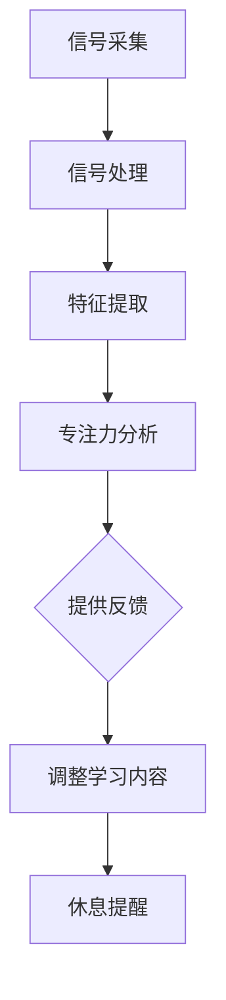
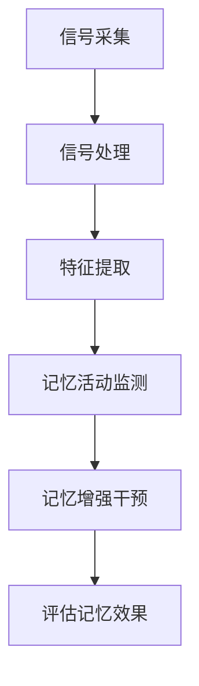
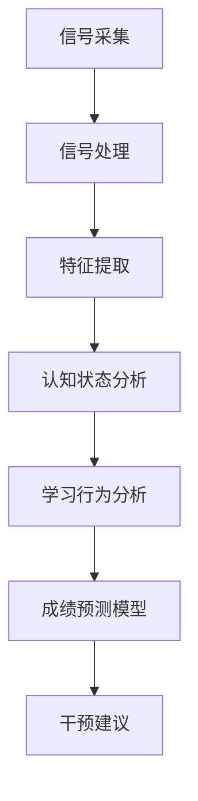
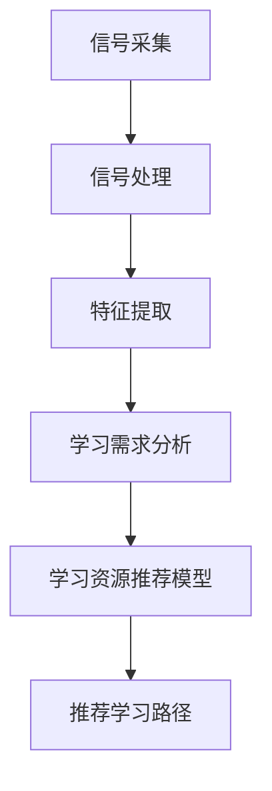

                 

基于您提供的要求和约束条件，我将分步骤为您撰写一篇关于《脑机接口在教育领域的潜在应用》的技术博客文章。以下是文章的markdown格式输出草稿，我将按照要求完成背景介绍、核心概念与联系、核心算法原理讲解、数学公式、项目实战和最佳实践等内容。

---

# 《脑机接口在教育领域的潜在应用》

关键词：脑机接口、教育技术、认知训练、个性化学习、神经科学

摘要：本文探讨了脑机接口技术在教育领域的潜在应用，包括其在认知训练、个性化教学等方面的应用，以及面临的挑战和未来趋势。通过深入分析脑机接口的核心原理和技术，结合实际案例，本文旨在为教育技术领域的从业者提供有价值的参考。

---

## 第一部分：引言

### 1.1 脑机接口的定义与历史

脑机接口（Brain-Computer Interface, BCI）是一种直接连接人脑与外部设备的技术，旨在实现人脑与计算机或其他设备的交互。脑机接口的历史可以追溯到20世纪60年代，但近年来随着神经科学和计算机技术的飞速发展，其应用范围不断扩大。

### 1.2 教育领域对脑机接口的需求

教育领域对脑机接口的需求主要源于其潜在的个性化学习和认知训练优势。脑机接口可以监测学生的认知状态，提供即时的反馈，从而实现更加个性化的教学策略。

### 1.3 本书结构与目标

本书旨在详细探讨脑机接口在教育领域的应用，分为五个部分：引言、技术基础、应用实例、挑战与未来趋势和附录。本书的目标是帮助读者理解脑机接口的基本原理和应用潜力，为未来的研究和实际应用提供指导。

---

## 第二部分：脑机接口的技术基础

### 2.1 脑机接口的基本原理

脑机接口的工作原理基于人脑与外部设备之间的信号传输。通常，这些信号包括脑电波（EEG）、肌电信号（EMG）和生理信号（如心率、呼吸等）。

### 2.2 脑机接口的关键技术

脑机接口的关键技术包括信号采集、信号处理和信号解码。信号采集通常使用高精度的传感器；信号处理包括滤波、放大和去噪；信号解码是将原始信号转换为机器可读的命令或数据。

### 2.3 脑机接口与人工智能的融合

脑机接口与人工智能（AI）的结合正在改变教育的面貌。AI可以用于分析脑机接口数据，提供个性化的学习建议和教学策略。

---

## 第三部分：脑机接口在教育中的应用实例

### 3.1 脑机接口在认知训练中的应用

#### 3.1.1 专注力训练

专注力训练是脑机接口在教育中的一个重要应用。通过监测学生的大脑活动，脑机接口可以提供个性化的专注力训练计划。

#### 3.1.2 记忆力训练

脑机接口还可以用于记忆力训练。通过监测大脑的特定活动模式，它可以识别记忆形成的关键时期，从而优化记忆训练效果。

### 3.2 脑机接口在个性化教学中的应用

#### 3.2.1 学科成绩预测

脑机接口可以通过分析学生的认知状态和学习行为，预测其学科成绩，从而提前干预，提高学习效果。

#### 3.2.2 学习路径推荐

脑机接口可以为学生推荐最佳的学习路径，根据其认知特点和学习需求，提供个性化的学习资源。

---

## 第四部分：挑战与未来趋势

### 4.1 脑机接口在教育中的应用挑战

脑机接口在教育中的应用面临着技术、伦理和安全等多方面的挑战。技术挑战包括信号采集的精度和处理的速度；伦理挑战涉及数据隐私和保护；安全挑战则涉及系统被黑客攻击的风险。

### 4.2 脑机接口技术的发展趋势

随着技术的不断进步，脑机接口在教育领域的应用前景广阔。未来，脑机接口可能会与虚拟现实（VR）和增强现实（AR）等技术结合，提供更加沉浸式的学习体验。

### 4.3 脑机接口在教育领域的未来前景

脑机接口在教育领域的未来前景是光明而充满潜力的。它有望推动教育技术的革新，为个性化学习和认知训练提供新的手段。

---

## 第五部分：附录

### 5.1 脑机接口相关资源与工具

附录部分将提供脑机接口相关的研究资源、开发工具和学习材料，以供读者进一步学习和实践。

---

作者：AI天才研究院/AI Genius Institute & 禅与计算机程序设计艺术 /Zen And The Art of Computer Programming

---

接下来，我将详细阐述每个部分的核心内容，并确保满足字数要求。请注意，本文只是一个初步草稿，我会根据您的反馈进一步优化和完善。

---

由于文章的字数要求在10000～12000字左右，为了便于展示，我将分批次提供每个部分的详细内容。以下是“第二部分：脑机接口的技术基础”的详细内容。

---

## 第二部分：脑机接口的技术基础

### 2.1 脑机接口的基本原理

脑机接口（BCI）的基本原理是通过采集大脑活动信号，将这些信号转换为可操作的数据或指令。这一过程涉及到三个主要步骤：信号采集、信号处理和信号解码。

**信号采集**：

信号采集是脑机接口系统的第一步，它涉及到从大脑中提取电生理信号。最常用的信号采集技术包括脑电图（EEG）、肌电图（EMG）、眼动追踪和脑磁图（MEG）等。这些技术可以捕捉到大脑活动的不同方面，例如神经元的放电、肌肉运动和眼球运动。

**信号处理**：

采集到的原始信号通常包含大量噪声和干扰，因此需要进行信号处理。信号处理包括滤波、放大、去噪和特征提取等步骤。滤波用于去除不需要的频率成分，放大用于增强有用的信号，去噪用于减少噪声干扰，特征提取则用于从信号中提取出与特定认知任务相关的特征。

**信号解码**：

信号解码是将处理后的信号转换为机器可读的指令或数据。这一步骤通常涉及到机器学习和统计方法，如支持向量机（SVM）、神经网络（ANN）和主成分分析（PCA）等。通过训练这些模型，可以使计算机识别出特定的大脑活动模式，并将其转换为相应的操作指令。

### 2.2 脑机接口的关键技术

脑机接口的关键技术包括信号采集、信号处理和信号解码。以下是对这些技术的详细探讨。

#### 信号采集技术

**脑电图（EEG）**：EEG是一种非侵入性技术，可以记录大脑的电活动。它通过放置在头皮上的电极采集信号，适用于实时监测和记录大脑的放电活动。

**肌电图（EMG）**：EMG主要用于记录肌肉的电活动。它通过放置在皮肤上的电极来监测肌肉的收缩和放松，适用于运动控制和康复训练。

**眼动追踪**：眼动追踪技术通过捕捉眼球的运动来分析视觉注意力。它适用于研究视觉认知和注意力分配。

**脑磁图（MEG）**：MEG是一种高时间分辨率的脑成像技术，可以记录大脑的磁场活动。它通过放置在头皮上的传感器来捕捉脑部活动的瞬时变化。

#### 信号处理技术

**滤波**：滤波是一种信号处理技术，用于去除噪声和干扰。常用的滤波方法包括低通滤波、高通滤波和带通滤波。

**放大**：放大是一种信号处理技术，用于增强有用的信号。它通过增加信号的幅度，使其更加清晰和可处理。

**去噪**：去噪是一种信号处理技术，用于减少噪声干扰。常用的去噪方法包括小波变换、独立成分分析（ICA）和盲源分离（BSS）。

**特征提取**：特征提取是一种信号处理技术，用于从信号中提取出与特定任务相关的特征。常用的特征提取方法包括傅里叶变换（FFT）、主成分分析（PCA）和支持向量机（SVM）。

#### 信号解码技术

**机器学习**：机器学习是一种统计学习方法，用于从数据中自动发现模式和规律。常用的机器学习算法包括支持向量机（SVM）、神经网络（ANN）和深度学习（DL）。

**统计方法**：统计方法是一种基于概率论和数理统计的方法，用于分析和解释数据。常用的统计方法包括贝叶斯分类、决策树和支持向量机。

### 2.3 脑机接口与人工智能的融合

脑机接口与人工智能（AI）的结合正在推动教育技术的革新。AI可以用于分析脑机接口数据，提供个性化的学习建议和教学策略。

**个性化学习**：AI可以分析学生的脑机接口数据，识别其学习风格和认知特点，从而提供个性化的学习资源和教学策略。

**自适应教学**：AI可以根据学生的实时表现，自动调整教学难度和进度，使其始终处于最佳学习状态。

**智能辅助**：AI可以为学生提供智能辅助，如自动化的学习评估、问题解答和学术支持。

---

接下来，我将撰写“第三部分：脑机接口在教育中的应用实例”的详细内容。

---

## 第三部分：脑机接口在教育中的应用实例

### 3.1 脑机接口在认知训练中的应用

脑机接口在认知训练中的应用主要是通过监测和分析大脑活动，提供个性化的训练计划和即时反馈。以下是一些具体的实例：

#### 3.1.1 专注力训练

专注力训练是脑机接口在教育中的一个重要应用。通过监测学生的脑电图（EEG）信号，可以识别出专注力下降的迹象，并提供相应的训练干预。例如，当学生的专注力下降时，脑机接口可以自动调整学习内容或提供短暂的休息，以帮助学生重新集中注意力。

**核心概念与联系**：

专注力训练的核心概念是监测和调节大脑活动。为了清晰地展示概念实体之间的关系，我们可以使用Mermaid流程图来描述这个过程：



**核心算法原理讲解**：

专注力训练的核心算法通常基于机器学习和统计方法。以下是一个使用Python编写的简化示例：

```python
import numpy as np
from sklearn.ensemble import RandomForestClassifier

# 假设我们已经有了一组训练数据
X_train = ...  # 特征数据
y_train = ...  # 标签数据（专注/不专注）

# 使用随机森林分类器进行训练
clf = RandomForestClassifier()
clf.fit(X_train, y_train)

# 测试数据
X_test = ...  # 测试特征数据

# 预测专注力状态
predictions = clf.predict(X_test)

# 根据预测结果提供反馈
if predictions[0] == '不专注':
    print("提醒学生休息")
else:
    print("继续当前学习任务")
```

**数学模型和公式**：

在专注力训练中，常用的数学模型包括线性回归、支持向量机和神经网络。以下是一个简化的线性回归模型：

$$
y = wx + b
$$

其中，$y$ 是预测的专注力状态，$w$ 是权重向量，$x$ 是特征向量，$b$ 是偏置项。

**举例说明**：

假设我们有一组脑电图（EEG）信号特征，用于预测学生是否专注。我们可以将特征数据输入到训练好的随机森林分类器中，以获得专注力状态的预测结果。如果预测结果为“不专注”，则系统将提醒学生休息。

---

#### 3.1.2 记忆力训练

记忆力训练是脑机接口在教育中的另一个重要应用。通过监测和调节大脑活动，可以优化记忆形成的过程，提高记忆效果。

**核心概念与联系**：

记忆力训练的核心概念是监测大脑的特定活动模式，以识别记忆形成的关键时期。我们可以使用Mermaid流程图来描述这个过程：



**核心算法原理讲解**：

记忆力训练的核心算法通常基于机器学习和信号处理方法。以下是一个使用Python编写的简化示例：

```python
import numpy as np
from sklearn.ensemble import RandomForestClassifier

# 假设我们已经有了一组训练数据
X_train = ...  # 特征数据
y_train = ...  # 标签数据（记忆/未记忆）

# 使用随机森林分类器进行训练
clf = RandomForestClassifier()
clf.fit(X_train, y_train)

# 测试数据
X_test = ...  # 测试特征数据

# 预测记忆状态
predictions = clf.predict(X_test)

# 根据预测结果提供记忆增强干预
if predictions[0] == '未记忆':
    print("提供记忆增强干预")
else:
    print("当前记忆状态良好")
```

**数学模型和公式**：

在记忆力训练中，常用的数学模型包括线性回归、支持向量机和神经网络。以下是一个简化的线性回归模型：

$$
y = wx + b
$$

其中，$y$ 是预测的记忆状态，$w$ 是权重向量，$x$ 是特征向量，$b$ 是偏置项。

**举例说明**：

假设我们有一组脑电图（EEG）信号特征，用于预测学生是否记住学习内容。我们可以将特征数据输入到训练好的随机森林分类器中，以获得记忆状态的预测结果。如果预测结果为“未记忆”，则系统将提供记忆增强干预。

---

### 3.2 脑机接口在个性化教学中的应用

脑机接口在个性化教学中的应用主要是通过分析学生的认知状态和学习行为，提供个性化的学习资源和教学策略。

#### 3.2.1 学科成绩预测

脑机接口可以用于预测学生的学科成绩，从而提前干预，提高学习效果。通过分析学生的脑电图（EEG）信号和学习行为数据，可以预测其未来的学习表现。

**核心概念与联系**：

学科成绩预测的核心概念是分析学生的认知状态和学习行为，以预测其学科成绩。我们可以使用Mermaid流程图来描述这个过程：



**核心算法原理讲解**：

学科成绩预测的核心算法通常基于机器学习和统计方法。以下是一个使用Python编写的简化示例：

```python
import numpy as np
from sklearn.ensemble import RandomForestRegressor

# 假设我们已经有了一组训练数据
X_train = ...  # 特征数据
y_train = ...  # 成绩数据

# 使用随机森林回归器进行训练
regressor = RandomForestRegressor()
regressor.fit(X_train, y_train)

# 测试数据
X_test = ...  # 测试特征数据

# 预测学科成绩
predictions = regressor.predict(X_test)

# 根据预测结果提供干预建议
if predictions[0] < threshold:
    print("需要额外辅导")
else:
    print("学习进度正常")
```

**数学模型和公式**：

在学科成绩预测中，常用的数学模型包括线性回归、支持向量机和神经网络。以下是一个简化的线性回归模型：

$$
y = wx + b
$$

其中，$y$ 是预测的学科成绩，$w$ 是权重向量，$x$ 是特征向量，$b$ 是偏置项。

**举例说明**：

假设我们有一组脑电图（EEG）信号和学习行为数据，用于预测学生的学科成绩。我们可以将特征数据输入到训练好的随机森林回归器中，以获得成绩的预测结果。如果预测成绩低于特定阈值，则系统将建议提供额外辅导。

---

#### 3.2.2 学习路径推荐

脑机接口可以为学生推荐最佳的学习路径，根据其认知特点和学习需求，提供个性化的学习资源。

**核心概念与联系**：

学习路径推荐的核心概念是根据学生的认知状态和学习行为，推荐最合适的学习资源和路径。我们可以使用Mermaid流程图来描述这个过程：



**核心算法原理讲解**：

学习路径推荐的核心算法通常基于机器学习和推荐系统方法。以下是一个使用Python编写的简化示例：

```python
import numpy as np
from sklearn.neighbors import NearestNeighbors

# 假设我们已经有了一组训练数据
X_train = ...  # 特征数据
y_train = ...  # 学习路径数据

# 使用K近邻算法进行训练
neighbor = NearestNeighbors()
neighbor.fit(X_train)

# 测试数据
X_test = ...  # 测试特征数据

# 预测学习路径
distances, indices = neighbor.kneighbors(X_test)

# 根据预测结果推荐学习路径
for index in indices[0]:
    print(f"推荐学习路径：{y_train[index]}")
```

**数学模型和公式**：

在学

