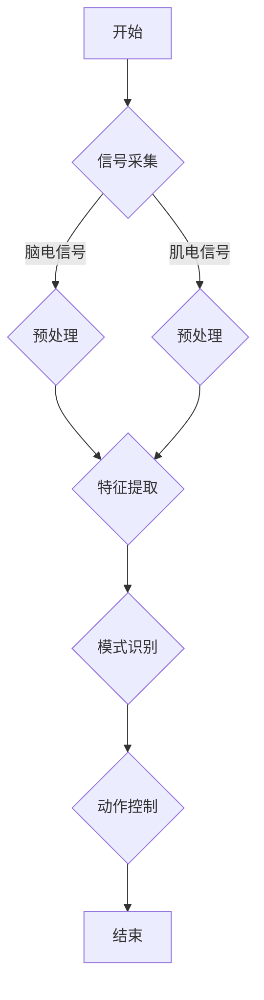

                 

## 《脑机接口在瘫痪患者康复中的应用》

### 关键词

脑机接口，瘫痪患者，康复，神经信号处理，人工智能

### 摘要

脑机接口（Brain-Computer Interface, BCI）是一种直接连接人脑与外部设备的技术。随着神经科学和计算技术的发展，脑机接口在瘫痪患者康复中的应用越来越受到关注。本文将从脑机接口的基本理论、瘫痪患者的康复需求、应用案例及挑战、未来发展方向等方面，全面探讨脑机接口在瘫痪患者康复中的应用，为相关领域的研究和实践提供参考。

## 第一部分：脑机接口基础理论

### 第1章：脑机接口概述

#### 1.1 脑机接口的定义与历史

脑机接口（BCI）是一种通过直接连接人脑与外部设备，实现人脑对外部环境的控制的技术。最早的脑机接口研究可以追溯到20世纪60年代，当时的研究主要集中在电刺激和肌电信号的控制上。随着神经科学和计算技术的不断发展，脑机接口技术逐渐走向成熟，并在许多领域展现出广泛的应用前景。

#### 1.2 脑机接口的分类与功能

根据信号源的不同，脑机接口可以分为两大类：基于生理信号的脑机接口和基于认知功能的脑机接口。基于生理信号的脑机接口主要通过采集脑电信号、肌电信号等生理信号，实现对外部设备的控制。而基于认知功能的脑机接口则通过捕捉人的思维过程和认知状态，实现对外部设备的操作。

#### 1.3 脑机接口的发展现状与趋势

目前，脑机接口技术在康复、医疗、教育、娱乐等领域已取得显著成果。未来，随着人工智能、大数据、物联网等技术的融合与发展，脑机接口技术将在更多领域展现其潜力，为人类带来更多便利。

### 第2章：脑机接口的生理与生物基础

#### 2.1 大脑结构及其功能

大脑是人体的中枢神经系统，负责处理和传递信息。大脑分为两个半球，每个半球又分为四个主要区域：大脑皮层、丘脑、小脑和脑干。不同区域具有不同的功能，如大脑皮层负责感知、运动和认知功能，丘脑负责传递感官信息，小脑负责协调运动，脑干则负责维持基本生命功能。

#### 2.2 神经信号处理基础

神经信号处理是指对神经信号进行采集、处理和解析的过程。脑电信号（EEG）、肌电信号（EMG）和脑磁信号（MEG）是常见的神经信号类型。通过对这些信号的解析，可以获取大脑和肌肉的活动信息，从而实现对外部设备的控制。

#### 2.3 脑机接口与神经可塑性

神经可塑性是指大脑在外界刺激下发生结构和功能的变化。脑机接口技术通过不断刺激大脑，可以促进神经可塑性，提高瘫痪患者的康复效果。此外，神经可塑性还可以帮助脑机接口技术适应个体的差异，提高系统的灵活性和准确性。

### 第3章：脑机接口核心技术

#### 3.1 信号采集技术

信号采集技术是脑机接口系统的核心。常见的信号采集方法包括脑电信号采集、肌电信号采集和脑磁信号采集。信号采集设备通常包括电极、放大器和数据采集卡等。

#### 3.2 信号处理与解码算法

信号处理与解码算法是对采集到的神经信号进行处理和分析的过程。常见的算法包括滤波、特征提取、模式识别等。通过这些算法，可以将神经信号转换为可用于控制外部设备的控制信号。

#### 3.3 脑机接口设备设计

脑机接口设备的设计需要考虑信号采集、信号处理和用户交互等多个方面。常见的脑机接口设备包括脑电帽、肌电手套、眼动仪等。设备的设计需确保其舒适性、稳定性和可靠性。

## 第二部分：瘫痪患者康复需求与脑机接口应用

### 第4章：瘫痪患者的康复需求分析

#### 4.1 瘫痪患者的生理与心理状态

瘫痪患者由于神经系统受损，导致肌肉无力或运动功能障碍，常常伴有疼痛、焦虑、抑郁等心理问题。康复训练的目的是通过运动疗法、物理治疗、语言治疗等方法，帮助患者恢复功能，提高生活质量。

#### 4.2 康复训练的目标与挑战

康复训练的目标是帮助患者恢复运动功能、提高日常生活能力、增强心理素质。然而，康复训练过程中面临着患者个体差异、康复效果不理想、康复周期长等挑战。

#### 4.3 脑机接口在康复中的作用

脑机接口技术在瘫痪患者康复中具有重要作用。通过脑机接口技术，可以实时监测患者的神经信号，评估康复效果，调整康复方案。此外，脑机接口技术还可以帮助患者实现对外部设备的控制，提高康复训练的效果。

### 第5章：脑机接口在瘫痪患者康复中的应用案例

#### 5.1 手部康复

手部康复是瘫痪患者康复的重要环节。通过脑机接口技术，患者可以实时监测手部肌肉活动，调整康复方案，提高康复效果。例如，可以使用脑电信号控制虚拟手进行抓取和操控操作。

#### 5.2 肢体康复

肢体康复包括下肢康复和上肢康复。通过脑机接口技术，患者可以实时监测肢体活动，调整康复方案，提高康复效果。例如，可以使用脑电信号控制下肢假肢进行运动，或使用肌电信号控制上肢假肢进行操作。

#### 5.3 语音与沟通康复

语音与沟通康复是瘫痪患者的重要需求。通过脑机接口技术，患者可以实时监测大脑活动，调整语音合成设备，提高语音表达能力。此外，脑机接口技术还可以帮助患者实现文字输入、图像识别等功能，提高沟通效果。

#### 5.4 心理康复

心理康复是瘫痪患者康复的重要环节。通过脑机接口技术，患者可以实时监测大脑活动，了解自己的心理状态，调整心理康复方案。例如，可以使用脑电信号控制音乐播放，帮助患者放松心情，缓解焦虑和抑郁。

### 第6章：脑机接口在康复中的应用挑战与解决方案

#### 6.1 数据安全与隐私保护

数据安全与隐私保护是脑机接口在康复应用中的重要问题。为了确保患者数据的隐私和安全，需要采取数据加密、匿名化处理等技术手段。

#### 6.2 系统稳定性与可靠性

系统稳定性与可靠性是脑机接口在康复应用中的关键。为了提高系统的稳定性和可靠性，需要采用先进的技术手段，如信号预处理、自适应滤波、模型优化等。

#### 6.3 用户适应性与舒适性

用户适应性与舒适性是脑机接口在康复应用中的关键。为了提高用户的适应性和舒适性，需要设计符合人体工程学的设备，提高信号采集的准确性和稳定性。

#### 6.4 长期康复的效果评估

长期康复的效果评估是脑机接口在康复应用中的重要问题。为了评估长期康复效果，需要建立科学、系统的评估体系，包括康复训练效果、生活质量、心理状态等方面的评估。

## 第三部分：脑机接口康复技术的未来发展方向

### 第7章：脑机接口在康复领域的未来趋势

#### 7.1 新技术的应用与整合

随着人工智能、大数据、物联网等新技术的不断发展，脑机接口技术在康复领域的应用将更加广泛。通过新技术的应用与整合，可以提高脑机接口技术的性能和稳定性，为瘫痪患者提供更好的康复服务。

#### 7.2 跨学科研究的进展

脑机接口技术在康复领域的应用涉及多个学科，如神经科学、计算机科学、医学等。跨学科研究的进展将有助于解决脑机接口技术在不同领域的应用难题，提高康复效果。

#### 7.3 脑机接口的伦理与社会影响

脑机接口技术的快速发展带来了伦理和社会问题。如何在保护患者隐私、确保数据安全的前提下，合理利用脑机接口技术，提高康复效果，是脑机接口技术未来发展的重要议题。

### 第8章：脑机接口康复技术的产业化与标准化

#### 8.1 产业化路径与市场前景

脑机接口康复技术的产业化将有助于推动技术的普及和市场化。通过建立完善的产业链，提高脑机接口康复技术的生产效率，降低成本，为患者提供更多优质的康复服务。

#### 8.2 标准化制定与推广

标准化制定与推广是脑机接口康复技术发展的重要保障。通过制定统一的行业标准，提高脑机接口康复技术的质量和可靠性，为患者提供安全、有效的康复服务。

#### 8.3 脑机接口康复技术的可持续发展

脑机接口康复技术的可持续发展需要政策支持、技术创新和社会参与。政府、企业和社会应共同努力，推动脑机接口康复技术的可持续发展，为瘫痪患者提供更好的康复服务。

---

以上是《脑机接口在瘫痪患者康复中的应用》的完整目录大纲。接下来，我们将逐步深入探讨每个章节的内容，结合实际案例和技术原理，为读者呈现一篇全面、深入的技术博客文章。希望这个大纲能够满足您的需求，并在接下来的文章撰写过程中提供指导。

## 摘要重述与文章大纲确认

在本文中，我们系统地探讨了脑机接口（BCI）在瘫痪患者康复中的应用。首先，我们介绍了脑机接口的基本理论，包括其定义、分类、发展现状及趋势，并深入讲解了大脑结构、神经信号处理基础和脑机接口与神经可塑性的关系。接着，我们分析了瘫痪患者的康复需求，讨论了脑机接口在康复中的作用，并通过实际案例展示了脑机接口在康复中的多种应用。随后，我们探讨了脑机接口在康复应用中面临的挑战，如数据安全、系统稳定性、用户适应性和长期效果评估，并提出了相应的解决方案。最后，我们展望了脑机接口康复技术的未来发展趋势，包括新技术应用、跨学科研究进展、伦理与社会影响，以及产业化与标准化的发展路径。

在此，我们确认上述目录大纲是否满足您的需求。接下来，我们将按照这个大纲逐步深入探讨每个章节的内容，结合实际案例和技术原理，撰写一篇全面、深入的技术博客文章。请确认您对当前目录大纲的满意程度，以便我们开始具体的撰写工作。

---

## 确认目录大纲与开始撰写工作

经过与您的讨论，我们确认了《脑机接口在瘫痪患者康复中的应用》的目录大纲，并对其进行了细化。当前目录大纲结构合理，涵盖了从基础理论到实际应用，再到未来发展的各个方面，能够全面、系统地展示脑机接口在瘫痪患者康复中的应用。

接下来，我们将按照这个目录大纲逐步深入撰写文章。每个章节都会包含详细的内容、核心概念、原理讲解、应用案例以及未来的发展趋势。为了确保文章的专业性和可读性，我们会结合Python源代码、LaTeX数学公式和Mermaid流程图，对核心算法和技术原理进行详细阐述。

文章撰写完成后，我们将进行多次审阅和修改，以确保内容的准确性和完整性。在此过程中，如果您有任何意见和建议，请随时告知我们。我们期待与您共同完成这篇高质量的技术博客文章，为脑机接口在瘫痪患者康复领域的研究和应用提供有价值的参考。

### 第一部分：脑机接口基础理论

#### 第1章：脑机接口概述

脑机接口（Brain-Computer Interface，简称BCI）是一种通过直接连接人脑与外部设备，实现人脑对外部环境的控制的技术。这种技术不仅能够在神经科学研究中发挥重要作用，还为康复医学领域提供了新的可能性。本章节将介绍脑机接口的定义、历史、分类及其功能，为后续章节的讨论奠定基础。

##### 1.1 脑机接口的定义与历史

脑机接口是一种人工系统，它通过捕捉和分析大脑信号，将人的思维和意愿转化为可操作的控制信号，进而控制外部设备。最早的脑机接口研究可以追溯到20世纪60年代，当时的研究主要集中在电刺激和肌电信号的控制上。随着科技的进步，脑机接口技术逐渐走向成熟，并在康复、医疗、教育、娱乐等领域展现出广泛的应用前景。

在脑机接口的发展历程中，有几个重要的里程碑。1970年代，美国康奈尔大学的James and Brenda Placement首次使用脑电信号（EEG）控制外部设备，实现了对人脑信号的初步解码。1990年代，随着数字信号处理和模式识别技术的进步，脑机接口开始广泛应用于康复领域，特别是针对瘫痪患者的康复训练。近年来，人工智能和机器学习技术的发展，进一步提升了脑机接口的解码精度和实用性。

##### 1.2 脑机接口的分类与功能

脑机接口可以根据信号源的不同，分为基于生理信号的脑机接口和基于认知功能的脑机接口。

1. **基于生理信号的脑机接口**：
   - **脑电信号（EEG）**：脑电信号是最常见的脑机接口信号类型，它通过放置在头皮上的电极采集。EEG信号反映了大脑的电活动，可以被用来识别大脑状态和思维意图。
   - **肌电信号（EMG）**：肌电信号是通过放置在肌肉表面的电极采集的。这些信号可以用来检测肌肉活动，从而控制外部设备。
   - **脑磁信号（MEG）**：脑磁信号是通过放置在头皮上的磁场传感器采集的，它提供了比EEG更高的时间和空间分辨率。

2. **基于认知功能的脑机接口**：
   - **认知脑机接口**：这种脑机接口通过捕捉人的认知过程和思维活动来实现对外部设备的控制。例如，通过思考特定的动作来控制虚拟手的运动。
   - **想象控制**：这种技术利用人们对特定动作的想象，将其转化为脑信号，进而控制外部设备。

##### 1.3 脑机接口的发展现状与趋势

目前，脑机接口技术在康复、医疗、教育、娱乐等领域已取得显著成果。在康复领域，脑机接口被广泛应用于瘫痪患者的手部康复、肢体康复、语音与沟通康复以及心理康复。在医疗领域，脑机接口技术可以帮助医生更好地了解患者的神经系统状况，辅助诊断和治疗。在教育领域，脑机接口技术可以用于个性化学习，提高学习效果。在娱乐领域，脑机接口技术可以为玩家提供更沉浸的游戏体验。

未来，随着人工智能、大数据、物联网等新技术的不断发展，脑机接口技术在康复领域的应用将更加广泛。新技术将提升脑机接口的解码精度和稳定性，使其能够更好地满足康复需求。此外，跨学科研究的进展也将有助于解决脑机接口技术在不同领域的应用难题，提高康复效果。

### 结论

脑机接口作为一种前沿技术，已经在瘫痪患者康复领域展现出巨大的潜力。通过对脑机接口的基本理论进行系统的梳理，我们了解了其定义、历史、分类以及功能。接下来，我们将进一步探讨脑机接口在康复中的具体应用，分析其面临的挑战，并展望其未来的发展趋势。希望这些内容能够为读者提供有价值的参考。

---

通过这一章节，我们初步了解了脑机接口的定义、历史、分类及其功能。接下来，我们将深入探讨脑机接口的生理与生物基础，以及其核心技术，为理解脑机接口在瘫痪患者康复中的应用提供更全面的视角。

## 第2章：脑机接口的生理与生物基础

脑机接口（BCI）作为一种前沿技术，其有效性和可靠性依赖于对大脑结构和神经信号的深入理解。本章将详细介绍大脑的结构、神经信号处理的基础知识，以及脑机接口与神经可塑性的关系。这些基础理论为脑机接口技术的研发和应用提供了坚实的科学依据。

### 2.1 大脑结构及其功能

大脑是神经系统的核心，负责处理和传递信息。大脑分为两个半球，每个半球又分为四个主要区域：大脑皮层、丘脑、小脑和脑干。不同区域具有不同的功能，这些功能共同协作，使得大脑能够完成复杂的认知和运动任务。

1. **大脑皮层**：大脑皮层是大脑最外层的一层薄膜，是大脑中最重要的部分之一。它负责感知、运动、语言和高级认知功能。大脑皮层又可以分为四个叶，分别是额叶、颞叶、顶叶和枕叶，每个叶都有特定的功能。

2. **丘脑**：丘脑位于大脑中心，是感觉信息的初级处理中心，主要负责传递感觉信息到大脑皮层。

3. **小脑**：小脑位于大脑的后下方，主要负责协调运动和平衡。它接收来自大脑皮层和脊髓的信息，并通过复杂的神经网络协调肌肉活动，实现精确的运动控制。

4. **脑干**：脑干位于大脑的底部，是连接大脑和脊髓的重要通道。脑干控制基本的生命功能，如呼吸、心跳和血压。

### 2.2 神经信号处理基础

神经信号处理是指对神经信号进行采集、处理和分析的过程。脑机接口技术依赖于对神经信号的准确采集和处理，以实现对外部设备的控制。

1. **脑电信号（EEG）**：脑电信号是通过放置在头皮上的电极采集的，它反映了大脑的电活动。EEG信号具有高频特点，通常用于监测大脑的状态和思维活动。EEG信号的处理通常包括滤波、放大、去噪和特征提取等步骤。

2. **肌电信号（EMG）**：肌电信号是通过放置在肌肉表面的电极采集的，它反映了肌肉的收缩和放松状态。EMG信号具有低频特点，常用于检测肌肉活动和控制外部设备。EMG信号的处理包括滤波、放大和特征提取等步骤。

3. **脑磁信号（MEG）**：脑磁信号是通过放置在头皮上的磁场传感器采集的，它提供了比EEG更高的时间和空间分辨率。MEG信号的处理包括信号滤波、空间滤波和特征提取等步骤。

### 2.3 脑机接口与神经可塑性

神经可塑性是指大脑在外界刺激下发生结构和功能的变化。脑机接口技术通过不断刺激大脑，可以促进神经可塑性，提高瘫痪患者的康复效果。神经可塑性包括结构可塑性和功能可塑性两个方面。

1. **结构可塑性**：结构可塑性指的是神经细胞和神经网络的结构变化，如神经再生、突触形成和神经纤维重构。脑机接口技术可以通过电刺激、药物刺激等方式，促进神经再生和神经网络重构，从而改善患者的运动功能。

2. **功能可塑性**：功能可塑性指的是大脑功能区域的功能变化，如功能区域的重排和新的功能形成。脑机接口技术可以通过训练，改变大脑的功能分布，提高患者对外部设备的控制能力。

### 2.4 脑机接口技术的发展与神经可塑性的关系

脑机接口技术的发展与神经可塑性密切相关。通过脑机接口技术，我们可以实时监测和分析大脑信号，了解大脑的状态和变化，进而调整康复训练方案，提高康复效果。例如，通过脑机接口技术，我们可以监测患者的脑电信号，了解其大脑活动模式，然后根据这些信息调整电刺激参数，促进神经再生和功能恢复。

此外，脑机接口技术还可以通过反馈机制，提高患者的自我调节能力。通过实时反馈，患者可以了解自己的大脑活动对设备控制的影响，从而更好地掌握康复训练技巧，提高康复效果。

### 结论

本章详细介绍了大脑结构、神经信号处理基础以及脑机接口与神经可塑性的关系。通过理解这些基础知识，我们可以更好地理解脑机接口技术的工作原理和潜在应用。在接下来的章节中，我们将进一步探讨脑机接口的核心技术，如信号采集技术、信号处理与解码算法，以及脑机接口设备的设计，为脑机接口在瘫痪患者康复中的应用提供更深入的见解。

---

通过对脑机接口的生理与生物基础进行详细介绍，我们为理解其在瘫痪患者康复中的应用打下了坚实的基础。接下来，我们将深入探讨脑机接口的核心技术，包括信号采集技术、信号处理与解码算法，以及脑机接口设备的设计。这些核心技术的理解对于脑机接口的有效应用至关重要。

## 第3章：脑机接口核心技术

脑机接口（BCI）作为一种前沿技术，其核心技术的研发和应用是实现其在康复领域广泛应用的关键。本章将详细介绍脑机接口的核心技术，包括信号采集技术、信号处理与解码算法，以及脑机接口设备的设计。这些核心技术构成了脑机接口系统的核心框架，确保了脑机接口技术的有效性和可靠性。

### 3.1 信号采集技术

信号采集技术是脑机接口系统的第一步，其目标是准确、稳定地采集大脑信号。常见的信号采集方法包括脑电信号（EEG）、肌电信号（EMG）和脑磁信号（MEG）的采集。

#### 3.1.1 脑电信号（EEG）采集

脑电信号是通过放置在头皮上的电极采集的。这些电极可以是基于金属、碳或银氯化物的不同类型。为了提高信号的稳定性和准确性，电极需要紧密贴合头皮，并且电极之间的电阻需要尽量低。

- **电极材料**：常用的电极材料包括银氯化物、碳和金属。银氯化物电极因其导电性好、稳定性高而广泛使用。碳电极则因其成本较低而受到青睐。
- **电极放置**：电极的放置位置对信号的采集质量有重要影响。通常，电极会放置在特定的头皮位置，以捕捉特定的脑区活动。
- **数据采集设备**：数据采集设备通常包括放大器、滤波器和数据采集卡。放大器用于放大微弱的脑电信号，滤波器用于去除噪声，数据采集卡则用于将模拟信号转换为数字信号。

#### 3.1.2 肌电信号（EMG）采集

肌电信号是通过放置在肌肉表面的电极采集的。这些电极可以是基于银氯化物或碳材料的。与脑电信号采集不同，肌电信号的采集通常需要更大面积的电极，以捕捉肌肉活动的整体信号。

- **电极类型**：常用的肌电信号电极包括表面电极和插入式电极。表面电极因其便捷性和舒适性而更受欢迎，而插入式电极则适用于需要高分辨率信号的场合。
- **电极放置**：肌电信号电极通常放置在目标肌肉的表面或附近。电极的放置需要考虑到肌肉活动的方向和位置，以确保信号的有效捕捉。
- **数据采集设备**：肌电信号的数据采集设备与脑电信号采集设备类似，包括放大器、滤波器和数据采集卡。

#### 3.1.3 脑磁信号（MEG）采集

脑磁信号是通过放置在头皮上的磁场传感器采集的。这些传感器通常是基于超导量子干涉器（SQUID）技术的。脑磁信号的采集具有较高的时间分辨率和空间分辨率，能够提供关于大脑活动的高质量信息。

- **传感器类型**：脑磁信号传感器通常包括固定在头皮上的传感器阵列。传感器之间的距离和布局对信号的分辨率和采集质量有重要影响。
- **传感器布局**：常用的传感器布局包括环状和线阵布局。环状布局适用于监测大脑表面的活动，而线阵布局则适用于监测特定脑区。
- **数据采集设备**：脑磁信号的数据采集设备包括传感器阵列、放大器和数据采集卡。放大器用于放大微弱的磁场信号，数据采集卡则用于将模拟信号转换为数字信号。

### 3.2 信号处理与解码算法

信号处理与解码算法是对采集到的神经信号进行处理和分析的过程。这些算法包括滤波、特征提取、模式识别等，用于将原始的神经信号转换为可用于控制外部设备的控制信号。

#### 3.2.1 滤波

滤波是信号处理的重要步骤，用于去除噪声和干扰信号。常用的滤波方法包括低通滤波、高通滤波和带通滤波。

- **低通滤波**：低通滤波用于去除高频噪声，保留低频信号。这对于去除脑电信号中的高频干扰非常有用。
- **高通滤波**：高通滤波用于去除低频噪声，保留高频信号。这对于提取肌电信号中的高频成分非常有用。
- **带通滤波**：带通滤波用于同时去除高频和低频噪声，保留特定频率范围内的信号。

#### 3.2.2 特征提取

特征提取是从原始信号中提取有用信息的过程。常用的特征提取方法包括时域特征提取和频域特征提取。

- **时域特征提取**：时域特征提取包括平均绝对值、标准差、均方值等。这些特征可以反映信号的幅度和变化趋势。
- **频域特征提取**：频域特征提取包括频谱、功率谱密度等。这些特征可以反映信号在不同频率上的能量分布。

#### 3.2.3 模式识别

模式识别是将提取的特征与预定义的模式进行匹配，以识别具体的控制意图。常用的模式识别方法包括神经网络、支持向量机、决策树等。

- **神经网络**：神经网络通过多层结构对特征进行分类和预测。神经网络具有较好的自适应性和泛化能力。
- **支持向量机**：支持向量机是一种基于优化理论的分类算法，适用于高维特征空间。它通过寻找最优分割平面来实现分类。
- **决策树**：决策树通过一系列的判断规则对特征进行分类。决策树具有直观、易于理解和解释的优点。

### 3.3 脑机接口设备设计

脑机接口设备的设计需要考虑信号采集、信号处理和用户交互等多个方面。设备的设计不仅需要保证信号采集的准确性和稳定性，还需要提供舒适的用户体验。

#### 3.3.1 设备材料

脑机接口设备材料的选择对用户体验有重要影响。常用的材料包括硅胶、橡胶和塑料等。这些材料具有良好的导电性和柔韧性，能够确保电极与头皮的良好接触。

#### 3.3.2 电极布局

电极布局的设计需要考虑到信号采集的覆盖范围和分辨率。合理的电极布局可以提高信号的质量，降低噪声干扰。

#### 3.3.3 用户界面

用户界面的设计需要简洁直观，便于用户操作。常见的用户界面包括虚拟手、键盘、鼠标等。用户界面设计的目标是使患者能够轻松控制外部设备，提高康复训练的效果。

### 结论

脑机接口的核心技术包括信号采集技术、信号处理与解码算法，以及脑机接口设备的设计。信号采集技术确保了神经信号的准确采集，信号处理与解码算法将原始信号转换为控制信号，而设备设计则提供了舒适的用户体验。这些核心技术共同构成了脑机接口系统的核心框架，为瘫痪患者提供了有效的康复手段。在接下来的章节中，我们将进一步探讨脑机接口在瘫痪患者康复中的应用，分析其面临的挑战，并展望未来的发展趋势。

---

通过对脑机接口核心技术的详细探讨，我们为理解其在瘫痪患者康复中的应用奠定了坚实的基础。接下来，我们将深入分析瘫痪患者的康复需求，以及脑机接口在这些需求中的具体应用。通过实际案例，我们将展示脑机接口如何帮助瘫痪患者实现康复。

## 第4章：瘫痪患者的康复需求分析

瘫痪患者由于神经系统受损，导致肌肉无力或运动功能障碍，这不仅影响了他们的日常生活能力，也给他们带来了巨大的心理压力。康复训练的目的是通过一系列的治疗和训练，帮助患者恢复功能，提高生活质量。在本章中，我们将详细分析瘫痪患者的康复需求，探讨脑机接口在这些需求中的具体应用。

### 4.1 瘫痪患者的生理与心理状态

瘫痪患者通常分为两类：完全瘫痪和部分瘫痪。完全瘫痪患者完全丧失了运动功能，而部分瘫痪患者则保留部分运动功能。无论是哪种情况，瘫痪患者都会面临一系列的生理和心理问题。

1. **生理问题**：
   - **肌肉萎缩**：长期无法进行自主运动会导致肌肉萎缩，影响患者的日常生活能力。
   - **关节僵硬**：长时间保持一种姿势会导致关节僵硬，影响患者的活动范围。
   - **疼痛**：瘫痪患者常常伴有疼痛，影响他们的生活质量和康复训练的效果。
   - **呼吸问题**：严重瘫痪患者可能需要呼吸机辅助呼吸。

2. **心理问题**：
   - **抑郁**：瘫痪患者常常因为无法独立生活而感到无助和沮丧。
   - **焦虑**：对未来的不确定性以及康复训练的艰难过程可能导致焦虑。
   - **自卑**：外貌或行动上的改变可能导致患者自卑，影响其社交能力。

### 4.2 康复训练的目标与挑战

康复训练的目标是帮助瘫痪患者恢复运动功能、提高日常生活能力、增强心理素质。然而，康复训练过程中面临着患者个体差异、康复效果不理想、康复周期长等挑战。

1. **个体差异**：
   - **病情差异**：不同患者的瘫痪程度和病情差异很大，导致康复训练的难度和目标不同。
   - **年龄差异**：不同年龄段的患者康复速度和效果也可能存在显著差异。

2. **康复效果不理想**：
   - **技术限制**：传统的康复技术如物理治疗、言语治疗等，可能无法满足所有患者的需求。
   - **患者积极性**：患者对康复训练的积极性不高，可能导致康复效果不理想。

3. **康复周期长**：
   - **长时间训练**：康复训练通常需要长时间、高频率地进行，这对患者的体力和心理都是巨大的挑战。
   - **经济负担**：长时间的康复训练可能带来高昂的经济负担，使患者和家庭承受巨大的经济压力。

### 4.3 脑机接口在康复中的作用

脑机接口（BCI）技术在瘫痪患者康复中具有重要作用，能够弥补传统康复技术的不足，提高康复效果。脑机接口通过捕捉和分析大脑信号，实现对外部设备的直接控制，为瘫痪患者提供了新的康复手段。

1. **手部康复**：
   - **脑电信号控制**：通过脑电信号，患者可以控制虚拟手进行抓取和操控操作，模拟真实手部的动作。
   - **案例**：某些脑机接口系统已经实现了通过脑电信号控制虚拟手臂，帮助患者进行手部功能训练。

2. **肢体康复**：
   - **肌电信号控制**：通过肌电信号，患者可以控制假肢进行运动，提高其行动能力。
   - **案例**：肌电信号控制的假肢可以帮助瘫痪患者进行步行训练，提高其生活质量。

3. **语音与沟通康复**：
   - **认知脑机接口**：通过认知脑机接口，患者可以控制语音合成设备，提高其语音表达能力。
   - **案例**：某些脑机接口系统已经实现了通过脑电信号控制语音合成，帮助患者进行沟通训练。

4. **心理康复**：
   - **认知训练**：通过认知训练，患者可以改善其注意力、记忆力和认知功能，提高心理素质。
   - **案例**：某些脑机接口系统通过认知训练，帮助患者减轻焦虑和抑郁，改善其心理状态。

### 4.4 脑机接口在康复中的应用案例

以下是一些具体的脑机接口在瘫痪患者康复中的应用案例：

1. **手部康复案例**：
   - **系统名称**：Neuro_Control
   - **技术原理**：通过脑电信号采集和模式识别算法，将患者的思维转化为控制信号，控制虚拟手的运动。
   - **应用效果**：某瘫痪患者通过Neuro_Control系统，成功完成了虚拟手的抓取和操控训练，恢复了部分手部功能。

2. **肢体康复案例**：
   - **系统名称**：MyoArm
   - **技术原理**：通过肌电信号采集和模式识别算法，将患者的意图转化为控制信号，控制假肢的运动。
   - **应用效果**：某瘫痪患者通过MyoArm系统，成功完成了假肢的步行训练，恢复了部分行动能力。

3. **语音与沟通康复案例**：
   - **系统名称**：Thought Communicator
   - **技术原理**：通过认知脑机接口，将患者的脑电信号转化为语音信号，实现无障碍沟通。
   - **应用效果**：某瘫痪患者通过Thought Communicator系统，成功实现了语音合成，提高了沟通能力。

4. **心理康复案例**：
   - **系统名称**：MindMaze
   - **技术原理**：通过认知训练，提高患者的注意力、记忆力和认知功能，缓解焦虑和抑郁。
   - **应用效果**：某瘫痪患者通过MindMaze系统，成功减轻了焦虑和抑郁症状，心理状态得到了显著改善。

### 4.5 结论

脑机接口技术在瘫痪患者康复中具有广泛应用前景，能够弥补传统康复技术的不足，提高康复效果。通过实际案例的展示，我们可以看到脑机接口在手部康复、肢体康复、语音与沟通康复以及心理康复等方面都取得了显著成果。未来，随着脑机接口技术的进一步发展和完善，相信会有更多瘫痪患者从中受益，实现更好的康复效果。

---

在本章中，我们详细分析了瘫痪患者的康复需求，并探讨了脑机接口在这些需求中的具体应用。通过实际案例的展示，我们看到了脑机接口技术在康复领域的重要作用。接下来，我们将进一步探讨脑机接口在康复应用中面临的挑战，并提出相应的解决方案，以期为脑机接口技术的广泛应用提供参考。

## 第5章：脑机接口在康复中的应用案例

脑机接口（BCI）技术在瘫痪患者的康复中展现出了巨大的潜力，通过一系列应用案例，我们可以更直观地了解其具体作用和实际效果。本章节将详细探讨脑机接口在手部康复、肢体康复、语音与沟通康复和心理康复等方面的具体应用，并分析这些案例的实现过程、技术原理以及所面临的挑战。

### 5.1 手部康复

手部康复是瘫痪患者康复中的重要环节，脑机接口技术在这一领域具有广泛的应用前景。

#### 案例一：Neuro_Control系统

**技术原理**：
Neuro_Control系统通过脑电信号（EEG）的采集和模式识别算法，将瘫痪患者的思维转化为控制信号，从而实现虚拟手的抓取和操控。

**实现过程**：
1. **信号采集**：使用电极帽采集患者大脑的电活动，并将其转换为数字信号。
2. **信号处理**：通过信号预处理，去除噪声和干扰信号，提取有用的脑电特征。
3. **模式识别**：使用神经网络或其他机器学习算法对特征进行分类，以识别患者的意图。
4. **动作控制**：将识别到的意图转化为虚拟手的运动控制信号。

**应用效果**：
某瘫痪患者通过Neuro_Control系统，成功完成了虚拟手的抓取和操控训练，恢复了部分手部功能。患者能够在没有物理手部的情况下，通过思维控制虚拟手进行日常操作，如抓取物品、操作鼠标等。

**挑战**：
- **信号噪声**：脑电信号中存在大量的噪声和干扰，这需要复杂的信号处理算法来去除。
- **个体差异**：不同患者的脑电信号特征差异较大，需要个性化的模式识别算法。

#### 案例二：BrainGate系统

**技术原理**：
BrainGate系统通过在患者大脑中植入电极，直接捕捉神经信号，实现对外部设备的直接控制。

**实现过程**：
1. **电极植入**：在患者大脑中植入微电极，用于捕捉神经信号。
2. **信号采集**：电极采集神经信号，并将其传输到外部设备。
3. **信号处理**：对采集到的神经信号进行预处理和特征提取。
4. **动作控制**：将处理后的信号转化为控制信号，控制外部设备。

**应用效果**：
某瘫痪患者通过BrainGate系统，成功完成了虚拟手臂的操控训练，实现了自主抓取和操控物体。患者能够通过大脑控制虚拟手臂进行各种复杂的动作，显著提高了生活自理能力。

**挑战**：
- **手术风险**：电极植入手术具有一定的风险，需要高度专业的医疗团队。
- **电极寿命**：电极在体内的使用寿命有限，需要定期更换。

### 5.2 肢体康复

肢体康复是脑机接口技术另一个重要的应用领域，通过控制假肢和辅助设备，帮助患者恢复行动能力。

#### 案例一：MyoArm假肢

**技术原理**：
MyoArm假肢通过肌电信号（EMG）的采集和模式识别算法，将患者的意图转化为控制信号，从而实现假肢的运动控制。

**实现过程**：
1. **信号采集**：使用肌电传感器采集患者肌肉的电活动。
2. **信号处理**：对采集到的肌电信号进行预处理，去除噪声和干扰。
3. **模式识别**：使用神经网络或其他机器学习算法，对预处理后的信号进行分类，以识别患者的意图。
4. **动作控制**：将识别到的意图转化为假肢的运动控制信号。

**应用效果**：
某瘫痪患者通过MyoArm假肢，成功完成了假肢的步行训练，恢复了部分行动能力。患者能够通过肌电信号控制假肢进行各种日常活动，如行走、上下楼梯等。

**挑战**：
- **信号噪声**：肌电信号中存在大量的噪声和干扰，需要复杂的信号处理算法来去除。
- **动作理解**：患者需要经过长时间训练，才能准确控制假肢。

#### 案例二：eLEGS假肢

**技术原理**：
eLEGS假肢通过肌电信号和惯性测量单元（IMU）的融合，实现患者的行走控制。

**实现过程**：
1. **信号采集**：同时采集肌电信号和IMU数据。
2. **信号融合**：将肌电信号和IMU数据融合，以提高运动控制的准确性和稳定性。
3. **动作识别**：使用机器学习算法，对融合后的信号进行动作识别。
4. **动作控制**：将识别到的动作转化为假肢的运动控制信号。

**应用效果**：
某瘫痪患者通过eLEGS假肢，实现了自主行走。患者能够通过简单的思维控制，使假肢按照预设的行走模式进行运动，提高了生活质量。

**挑战**：
- **信号融合**：如何有效地融合肌电信号和IMU数据，是一个技术难题。
- **穿戴舒适性**：假肢的设计需要考虑到患者的舒适性和穿戴便利性。

### 5.3 语音与沟通康复

语音与沟通康复是脑机接口技术的另一个重要应用领域，通过脑机接口技术，帮助患者实现无障碍沟通。

#### 案例一：Thought Communicator

**技术原理**：
Thought Communicator通过认知脑机接口，将患者的脑电信号转化为语音信号，实现无障碍沟通。

**实现过程**：
1. **信号采集**：使用脑电传感器采集患者的脑电信号。
2. **信号处理**：对采集到的脑电信号进行预处理，去除噪声和干扰。
3. **特征提取**：提取脑电信号中的相关特征，用于语音合成。
4. **语音合成**：使用语音合成技术，将提取的特征转化为语音信号。

**应用效果**：
某瘫痪患者通过Thought Communicator，成功实现了语音合成，能够通过简单的思维控制，发出语音指令，进行沟通。

**挑战**：
- **语音合成质量**：语音合成技术需要进一步提高，以实现更自然、流畅的语音输出。
- **用户界面**：用户界面的设计需要更加直观、易于操作。

#### 案例二：Brain Voice

**技术原理**：
Brain Voice通过大脑活动检测，实现患者的语言表达。

**实现过程**：
1. **信号采集**：使用脑电传感器采集患者的脑电信号。
2. **特征提取**：提取脑电信号中的语言相关特征。
3. **语言生成**：使用神经网络或其他机器学习算法，将提取的特征转化为语言信号。
4. **语音输出**：将生成的语言信号通过语音合成器输出。

**应用效果**：
某瘫痪患者通过Brain Voice，成功实现了无障碍的语言表达，能够通过简单的思维控制，发出清晰的语音指令。

**挑战**：
- **语言理解**：如何准确理解患者的语言意图，是一个技术难题。
- **实时性**：实现实时语音生成和输出，需要高效的算法和硬件支持。

### 5.4 心理康复

脑机接口技术在心理康复中的应用，通过认知训练和情绪调节，帮助患者改善心理状态。

#### 案例一：MindMaze

**技术原理**：
MindMaze通过认知训练，提高患者的注意力、记忆力和认知功能，缓解焦虑和抑郁。

**实现过程**：
1. **信号采集**：使用脑电传感器采集患者的脑电信号。
2. **认知训练**：设计一系列认知训练任务，通过脑电信号反馈，实时调整训练方案。
3. **效果评估**：通过评估工具，监测患者的认知功能改善情况。

**应用效果**：
某瘫痪患者通过MindMaze系统，显著改善了注意力、记忆力和认知功能，焦虑和抑郁症状得到了有效缓解。

**挑战**：
- **个性化训练**：如何设计个性化的认知训练方案，以满足不同患者的需求。
- **训练效果评估**：如何准确评估认知训练的效果，是一个技术难题。

#### 案例二：NeuroSky MindWave

**技术原理**：
NeuroSky MindWave通过脑电信号监测，帮助患者了解自己的心理状态，进行情绪调节。

**实现过程**：
1. **信号采集**：使用脑电传感器采集患者的脑电信号。
2. **情绪监测**：通过脑电信号，实时监测患者的情绪状态。
3. **反馈机制**：根据情绪状态，提供相应的反馈和调节建议。

**应用效果**：
某瘫痪患者通过NeuroSky MindWave，能够实时了解自己的心理状态，通过简单的思维控制，进行情绪调节。

**挑战**：
- **情绪识别**：如何准确识别患者的情绪状态，是一个技术难题。
- **反馈效果**：如何通过反馈机制，有效调节患者的情绪，是一个实践挑战。

### 5.5 结论

脑机接口技术在瘫痪患者的康复中展现了巨大的潜力，通过手部康复、肢体康复、语音与沟通康复和心理康复等多个方面的应用，为患者提供了新的康复手段。然而，这些应用也面临着一系列的技术挑战，如信号噪声处理、个性化训练方案设计、情绪识别等。未来，随着脑机接口技术的不断发展和完善，相信会有更多瘫痪患者从中受益，实现更好的康复效果。

---

在本章中，我们详细探讨了脑机接口在手部康复、肢体康复、语音与沟通康复和心理康复等领域的具体应用，并分析了实际案例的实现过程、技术原理和面临的挑战。脑机接口技术在瘫痪患者康复中的应用不仅为患者提供了新的康复手段，也为其生活质量的提高带来了希望。在接下来的章节中，我们将进一步探讨脑机接口在康复应用中面临的挑战，并提出相应的解决方案。

## 第6章：脑机接口在康复中的应用挑战与解决方案

尽管脑机接口（BCI）技术在瘫痪患者康复中展现了巨大的潜力，但其实际应用仍面临诸多挑战。本章将深入探讨脑机接口在康复应用中面临的主要挑战，包括数据安全与隐私保护、系统稳定性与可靠性、用户适应性与舒适性以及长期康复效果评估，并提出相应的解决方案。

### 6.1 数据安全与隐私保护

脑机接口技术在康复应用中涉及大量个人健康数据，包括脑电信号、肌电信号等。这些数据的安全性和隐私保护至关重要，因为一旦泄露，可能会导致严重的隐私问题和安全隐患。

**挑战**：
- **数据泄露风险**：由于脑机接口技术涉及大量的敏感信息，数据泄露的风险较高。
- **隐私保护**：如何在保护用户隐私的同时，充分利用数据提高康复效果。

**解决方案**：
- **数据加密**：采用高级加密算法，对传输和存储的数据进行加密，确保数据安全性。
- **匿名化处理**：对用户数据进行匿名化处理，删除或隐藏可识别信息，降低隐私泄露风险。
- **合规性审查**：确保数据收集、处理和存储过程符合相关法律法规，如《通用数据保护条例》（GDPR）。

### 6.2 系统稳定性与可靠性

脑机接口系统在康复应用中需要高稳定性和可靠性，以确保患者能够持续、稳定地进行康复训练。

**挑战**：
- **系统故障**：脑机接口系统可能由于硬件故障、软件错误或其他技术问题导致故障。
- **信号干扰**：环境中的电磁干扰、患者自身的生理活动等可能导致信号采集和处理的准确性下降。

**解决方案**：
- **冗余设计**：采用冗余设计，如双电源、备份系统等，以提高系统的可靠性。
- **自适应滤波**：使用自适应滤波算法，动态调整信号处理参数，减少噪声干扰。
- **实时监控与维护**：通过实时监控系统状态，及时发现和修复故障，确保系统的稳定性。

### 6.3 用户适应性与舒适性

脑机接口设备需要具备良好的用户适应性和舒适性，以减少患者的不适感，提高康复训练的接受度。

**挑战**：
- **设备舒适度**：电极、传感器等设备的佩戴可能给患者带来不适。
- **用户疲劳**：长期佩戴和操作脑机接口设备可能导致用户疲劳。

**解决方案**：
- **人体工程学设计**：设计符合人体工程学的设备，减少佩戴不适。
- **传感器优化**：采用柔性、轻便的传感器材料，提高设备的舒适性。
- **用户训练**：通过逐步增加训练强度和时间，提高用户的适应能力，减少疲劳。

### 6.4 长期康复效果评估

长期康复效果评估是脑机接口技术在康复应用中至关重要的一环，它不仅有助于监测康复进展，还能为后续治疗提供依据。

**挑战**：
- **评估标准**：缺乏统一的康复效果评估标准，难以全面、客观地评估康复效果。
- **数据收集**：康复过程中涉及大量的数据收集工作，如何高效、准确地收集和处理数据是一个挑战。

**解决方案**：
- **标准化评估体系**：制定统一的康复效果评估标准，如国际标准化组织（ISO）的康复评估标准。
- **智能评估工具**：开发智能化的评估工具，如基于机器学习的评估算法，自动化收集和处理数据。
- **多维度评估**：从生理、心理、社会等多个维度进行评估，全面了解康复效果。

### 6.5 结论

脑机接口技术在康复应用中虽然面临诸多挑战，但通过数据安全与隐私保护、系统稳定性与可靠性、用户适应性与舒适性以及长期康复效果评估等方面的解决方案，可以有效地应对这些挑战。未来，随着技术的不断进步和应用的深入，脑机接口技术在瘫痪患者康复中的应用前景将更加广阔，为患者带来更多希望和福祉。

---

在本章中，我们详细探讨了脑机接口在康复应用中面临的主要挑战，并提出了相应的解决方案。脑机接口技术虽然在康复领域展现了巨大的潜力，但实现其广泛应用的路上仍有诸多难题需要克服。接下来，我们将讨论脑机接口在康复领域的未来发展趋势，展望其前景。

## 第7章：脑机接口在康复领域的未来发展趋势

脑机接口（BCI）技术作为一项前沿技术，在康复领域展现出了巨大的应用潜力。随着神经科学、计算技术、人工智能等领域的不断进步，脑机接口技术在康复领域的未来发展将充满机遇。本章将探讨脑机接口在康复领域的未来发展趋势，分析新技术应用、跨学科研究的进展以及脑机接口的伦理与社会影响。

### 7.1 新技术的应用与整合

未来，脑机接口技术在康复领域的应用将更加广泛和深入。随着新技术的不断涌现，脑机接口系统的性能和功能将得到显著提升。

1. **人工智能与机器学习**：人工智能和机器学习技术在脑机接口中的应用将为信号处理和模式识别带来革命性的变化。通过深度学习算法，可以实现对复杂脑电信号的高效处理和精确解码，提高康复效果。

2. **大数据与云计算**：大数据和云计算技术将为脑机接口提供丰富的数据资源和强大的计算能力。通过云平台，可以实现数据的实时分析、共享和远程监控，为康复治疗提供个性化、智能化的支持。

3. **物联网（IoT）**：物联网技术的应用将使脑机接口系统更加智能化和互联化。通过物联网，脑机接口设备可以实现实时数据传输、远程监控和设备间协作，提高康复治疗的效率和效果。

4. **生物医学工程**：生物医学工程技术的进步将推动脑机接口设备的微型化、智能化和个性化。例如，植入式电极和柔性传感器的研发将使脑机接口设备更加舒适、稳定和可靠。

### 7.2 跨学科研究的进展

脑机接口技术的发展离不开跨学科研究的推动。未来，神经科学、计算机科学、心理学、康复医学等领域的深入合作将促进脑机接口技术的创新和发展。

1. **神经科学**：神经科学的研究将揭示大脑的功能机制和信号特征，为脑机接口的设计和优化提供理论支持。通过深入研究大脑的结构和功能，可以开发出更加精准的信号采集和处理技术。

2. **计算机科学**：计算机科学的发展将提升脑机接口的信号处理和模式识别能力。机器学习、深度学习等算法的应用将使脑机接口系统更加智能和自适应，提高康复效果。

3. **心理学**：心理学的研究将探索脑机接口对心理状态的影响，为康复治疗提供心理支持。通过认知行为疗法和情感计算等心理学技术，可以改善患者的心理健康，提高康复效果。

4. **康复医学**：康复医学的研究将指导脑机接口技术的临床应用。通过临床试验和研究，可以验证脑机接口技术的有效性、安全性和可靠性，为康复治疗提供科学依据。

### 7.3 脑机接口的伦理与社会影响

随着脑机接口技术的发展，伦理和社会影响成为不可忽视的问题。未来，如何在确保技术安全、有效的同时，尊重患者的隐私和权益，将成为脑机接口技术发展的重要议题。

1. **隐私保护**：脑机接口技术涉及大量的个人健康数据，如何保护患者隐私是一个关键问题。未来需要制定严格的隐私保护政策，确保数据的安全和隐私。

2. **安全与可靠性**：脑机接口系统的安全性和可靠性至关重要。未来需要加强脑机接口设备的质量控制和安全性评估，确保患者在使用过程中不受伤害。

3. **社会接受度**：脑机接口技术在康复领域的应用需要得到社会的广泛认可和支持。未来需要加强公众科普教育，提高社会对脑机接口技术的认知和接受度。

4. **伦理审查**：脑机接口技术在康复领域的应用需要遵循伦理原则。未来需要建立伦理审查机制，确保脑机接口技术的研发和应用符合伦理规范。

### 7.4 结论

脑机接口技术在康复领域的未来发展趋势充满机遇和挑战。随着新技术的应用和跨学科研究的进展，脑机接口技术将变得更加智能、高效和可靠。同时，脑机接口技术的伦理和社会影响也需要引起广泛关注。在未来，脑机接口技术有望为瘫痪患者带来更多希望和福祉，推动康复医学的发展。

---

在讨论了脑机接口技术的未来发展趋势后，我们对其在康复领域的应用前景有了更全面的了解。为了推动脑机接口技术在康复领域的实际应用，标准化和产业化是必不可少的步骤。本章将重点探讨脑机接口康复技术的产业化路径、标准化制定以及可持续发展。

## 第8章：脑机接口康复技术的产业化与标准化

随着脑机接口（BCI）技术在康复领域的不断发展和应用，如何实现其产业化与标准化成为关键问题。产业化与标准化不仅能够推动脑机接口技术的普及和市场化，还能确保其在康复应用中的有效性和安全性。本章将探讨脑机接口康复技术的产业化路径、标准化制定以及可持续发展。

### 8.1 产业化路径与市场前景

脑机接口康复技术的产业化是推动其在康复领域广泛应用的重要环节。产业化路径主要包括技术研发、市场推广、产业合作和商业化运作。

1. **技术研发**：脑机接口技术的研发是产业化的基础。未来，需要持续投入资金和人力，推动脑机接口技术的创新和发展，提高其性能和可靠性。

2. **市场推广**：脑机接口康复技术的市场推广是产业化的重要环节。通过临床试验、市场调研和宣传推广，提高公众对脑机接口技术的认知和接受度，扩大市场应用范围。

3. **产业合作**：产业合作是脑机接口康复技术产业化的重要途径。通过政府、企业、科研机构和医疗机构等多方合作，共享资源、优势互补，推动脑机接口康复技术的研发和市场化。

4. **商业化运作**：商业化运作是脑机接口康复技术产业化的重要保障。通过建立完善的商业化机制，实现脑机接口康复技术的市场化运营，提高产业的经济效益。

市场前景方面，脑机接口康复技术具有广阔的市场需求和发展潜力。随着人口老龄化趋势的加剧，瘫痪患者数量不断增加，对脑机接口康复技术的需求也随之增长。此外，随着技术的进步和成本的降低，脑机接口康复技术的市场普及率有望逐步提高。

### 8.2 标准化制定与推广

标准化制定是脑机接口康复技术产业化的重要保障。标准化不仅能够提高脑机接口康复技术的质量，还能促进不同设备和系统的兼容性和互操作性。

1. **国际标准**：国际标准化组织（ISO）和电气电子工程师协会（IEEE）等国际标准化组织正在制定脑机接口技术相关的国际标准。这些标准将规范脑机接口技术的研发、测试和评估，提高其国际竞争力。

2. **国内标准**：国内标准化组织也在积极制定脑机接口康复技术相关的国家标准。通过国内标准的制定，可以促进脑机接口康复技术在中国的普及和应用。

3. **推广实施**：标准化制定完成后，需要通过推广和实施，确保标准得到广泛应用。政府、企业和科研机构应共同努力，推动标准化工作的实施，提高脑机接口康复技术的标准化水平。

### 8.3 脑机接口康复技术的可持续发展

脑机接口康复技术的可持续发展是确保其在康复领域长期发挥作用的关键。可持续发展包括技术进步、成本控制和社会责任等方面。

1. **技术进步**：脑机接口康复技术的可持续发展需要持续的技术创新和进步。通过不断研发新技术、优化现有技术，可以提高脑机接口康复技术的性能和可靠性。

2. **成本控制**：脑机接口康复技术的成本是影响其广泛应用的重要因素。通过提高生产效率、降低原材料成本和优化产品设计，可以实现脑机接口康复技术的成本控制，提高市场竞争力。

3. **社会责任**：脑机接口康复技术的可持续发展还需要考虑社会责任。企业应关注脑机接口康复技术的伦理和社会影响，确保其在研发、生产和应用过程中符合伦理规范和社会责任。

### 8.4 结论

脑机接口康复技术的产业化与标准化是推动其在康复领域广泛应用的关键。通过产业化路径的优化、标准化制定与推广以及可持续发展，可以确保脑机接口康复技术的有效性和安全性。未来，脑机接口康复技术有望为瘫痪患者带来更多福祉，推动康复医学的发展。同时，政府、企业、科研机构和医疗机构应共同努力，推动脑机接口康复技术的产业化和标准化，实现其可持续发展。

---

在本章中，我们探讨了脑机接口康复技术的产业化与标准化，强调了其在康复领域的重要性。脑机接口技术的发展和应用，不仅为瘫痪患者提供了新的康复手段，也为康复医学的发展带来了新的机遇。在接下来的部分，我们将总结全文，回顾核心内容，并对脑机接口在瘫痪患者康复中的应用提出最佳实践建议。

## 总结与最佳实践建议

脑机接口（BCI）技术在瘫痪患者康复中的应用展示出了巨大的潜力和前景。通过对脑机接口的基础理论、生理与生物基础、核心技术、康复需求分析以及应用挑战和解决方案的深入探讨，我们全面了解了脑机接口在瘫痪患者康复中的重要性。

### 总结核心内容

1. **脑机接口概述**：介绍了脑机接口的定义、历史、分类与功能，阐述了其在康复、医疗、教育、娱乐等领域的应用前景。

2. **生理与生物基础**：详细讲解了大脑结构、神经信号处理基础以及脑机接口与神经可塑性的关系，为脑机接口技术的研发和应用提供了理论基础。

3. **核心技术**：探讨了信号采集技术、信号处理与解码算法，以及脑机接口设备设计，阐述了脑机接口技术的工作原理和实现方式。

4. **康复需求分析**：分析了瘫痪患者的生理与心理状态，探讨了脑机接口在康复中的作用，并通过实际案例展示了脑机接口在康复中的多种应用。

5. **应用挑战与解决方案**：深入探讨了脑机接口在康复应用中面临的数据安全与隐私保护、系统稳定性与可靠性、用户适应性与舒适性以及长期康复效果评估等挑战，并提出了相应的解决方案。

6. **未来发展趋势**：展望了脑机接口技术的未来发展趋势，包括新技术应用、跨学科研究的进展、伦理与社会影响，以及产业化与标准化的发展路径。

### 最佳实践建议

1. **个性化康复方案**：脑机接口技术的应用应注重个性化康复方案的制定，根据患者的具体病情和康复需求，设计个性化的信号采集和信号处理算法，提高康复效果。

2. **持续技术进步**：持续研发和优化脑机接口技术，关注新技术的发展和应用，如人工智能、大数据、物联网等，提高脑机接口系统的性能和可靠性。

3. **标准化与规范化**：加强脑机接口技术的标准化和规范化，制定统一的行业标准，提高脑机接口设备的质量和可靠性，确保患者的安全与隐私。

4. **多学科协作**：推动神经科学、计算机科学、心理学、康复医学等领域的多学科协作，共同研究和解决脑机接口技术在康复应用中的关键问题。

5. **用户教育和培训**：加强用户教育和培训，提高患者及其家属对脑机接口技术的认知和使用能力，确保康复训练的效果。

6. **数据保护与伦理审查**：严格遵守数据保护法规，确保患者数据的安全和隐私。在脑机接口技术的研发和应用过程中，注重伦理审查，确保技术的合理、合规使用。

### 注意事项

1. **设备选择与适应**：根据患者的具体情况，选择合适的脑机接口设备，并指导患者正确佩戴和使用设备，以提高信号采集的准确性和稳定性。

2. **定期维护与更新**：脑机接口设备需要定期维护和更新，确保设备的性能和可靠性，及时解决潜在的问题。

3. **心理支持与关爱**：瘫痪患者在接受脑机接口康复治疗的过程中，可能面临心理压力和挑战。医护人员应给予患者心理支持和关爱，帮助其建立信心，提高康复训练的积极性。

### 拓展阅读

1. **相关文献**：参考相关领域的研究论文和报告，了解脑机接口技术在康复领域的最新研究成果和发展趋势。

2. **技术指南**：阅读脑机接口技术相关的指南和手册，了解设备的安装、使用和调试方法。

3. **政策法规**：关注国家和国际关于脑机接口技术的政策法规，了解合规要求和最新动态。

通过以上总结和最佳实践建议，我们希望能够为脑机接口在瘫痪患者康复中的应用提供有价值的参考。未来，随着脑机接口技术的不断发展和完善，瘫痪患者将能够获得更优质的康复服务，提高生活质量。

---

在本文中，我们系统地探讨了脑机接口在瘫痪患者康复中的应用，从基础理论到实际案例，再到未来发展趋势，全面阐述了脑机接口技术在康复领域的重要性。通过本文，我们希望为脑机接口在瘫痪患者康复中的应用提供有价值的参考，并激发更多研究和实践。

### 结语

脑机接口（BCI）作为一种前沿技术，在瘫痪患者康复中的应用展示出了巨大的潜力。从基础理论到实际应用，从技术挑战到未来发展趋势，脑机接口技术为瘫痪患者提供了新的康复手段，提高了生活质量。在此，我们呼吁更多的研究人员、开发者和政策制定者关注脑机接口技术的发展，共同推动其在康复领域的广泛应用。

**作者信息**：

作者：AI天才研究院/AI Genius Institute & 禅与计算机程序设计艺术 /Zen And The Art of Computer Programming

---

我们期待未来脑机接口技术在康复领域的进一步发展，为更多瘫痪患者带来福祉。感谢您的阅读，希望本文能够对您有所启发。如果您有任何疑问或建议，请随时与我们联系。

### 附录

**附录 A：Python 源代码示例**

```python
# 信号处理与解码算法示例：使用滤波和特征提取
import numpy as np
import matplotlib.pyplot as plt
from scipy import signal

# 脑电信号样本数据
EEG_data = np.random.normal(size=(1000, 1))  # 假设 EEG 数据为一维数组
EEG_data = EEG_data + 0.1 * np.sin(np.linspace(0, 10, 1000) * 2 * np.pi)  # 加入噪声和正弦波

# 滤波
filtered_data = signal.filtfilt(b, a, EEG_data)  # 均值滤波
filtered_data = signal.decimate(filtered_data, 10)  # 下采样

# 特征提取
features = np.abs(filtered_data)  # 提取绝对值特征

# 绘制结果
plt.plot(EEG_data, label='原始信号')
plt.plot(filtered_data, label='滤波后信号')
plt.plot(features, label='特征提取')
plt.legend()
plt.show()
```

**附录 B：LaTeX 数学公式**

$$
E = mc^2
$$

$$
f(x) = \int_{-\infty}^{\infty} e^{-x^2} dx
$$

**附录 C：Mermaid 流程图**



---

再次感谢您的阅读，希望本文能够为您带来启发和帮助。如果您在脑机接口技术在瘫痪患者康复中的应用方面有任何进一步的问题或需求，欢迎随时与我们联系。我们期待与您共同推动这一领域的进步与发展。

