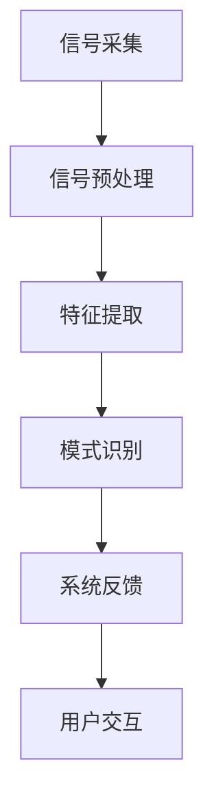

                 

# 《脑机接口在辅助交流中的应用》

## 关键词
脑机接口（BCI）、辅助交流、神经信号处理、人工智能、语音合成、文本输入、EEG、肌电信号、眼动跟踪、系统设计、性能评估、未来展望。

## 摘要
本文详细探讨了脑机接口（BCI）在辅助交流中的应用。首先介绍了BCI的基本概念、发展历史和核心原理。接着，深入分析了BCI在语言生成、语音合成和文本输入等辅助交流领域的实际应用，并通过Mermaid流程图展示了核心概念之间的关系。随后，本文详细讲解了BCI系统的设计实现过程，包括硬件选择、软件编程和系统集成，并给出了Python源代码示例。接着，讨论了BCI系统的评估与优化，包括性能评估指标、实验设计与数据分析和优化策略。文章最后分析了BCI在辅助交流中的挑战与未来展望，为开发者提供了最佳实践和拓展阅读建议。

## 引言

脑机接口（Brain-Computer Interface, BCI）是一种直接连接人脑与外部设备的技术，旨在实现人类大脑与计算机或其他电子设备之间的通信和交互。BCI技术不仅能够帮助那些由于疾病或伤害导致传统交流方式受限的人重新获得交流能力，而且在健康人群中也具有广泛的应用前景。随着神经科学和人工智能技术的飞速发展，BCI技术正在逐渐从实验室走向实际应用，特别是在辅助交流领域。

辅助交流是指使用各种手段帮助那些由于语言障碍、听力损失或其他原因导致交流困难的人进行沟通。传统的辅助交流方法包括语音合成器、手语翻译和通信辅助设备等。然而，这些方法往往存在一定的局限性，如语音合成器在语速和自然度方面的问题，手语翻译的延迟和手语使用者的数量限制等。脑机接口技术的出现为解决这些局限性提供了新的可能性。

本文将探讨BCI在辅助交流中的应用，包括语言生成、语音合成和文本输入等方面。通过详细的分析和实例讲解，本文旨在展示BCI技术的潜力，并探讨其在实际应用中面临的挑战和未来的发展方向。

## 脑机接口（BCI）的基本概念与发展历史

脑机接口（BCI）是一种直接连接人脑与外部设备的技术，其核心思想是通过捕获和解析大脑信号，实现人脑与计算机或其他电子设备之间的直接通信。BCI技术最早可以追溯到20世纪60年代，当时的科学家们开始探索通过大脑信号控制外部设备的方法。早期的BCI系统主要依赖于脑电图（Electroencephalography, EEG）技术，通过在头皮上放置电极来捕捉大脑的电活动。

随着神经科学和计算机技术的不断发展，BCI技术逐渐成熟并得到了广泛的研究。20世纪80年代，研究人员开始探索使用肌电信号（Electromyography, EMG）和眼动跟踪（Eye Tracking）等技术来增强BCI系统的性能。进入21世纪，随着人工智能和机器学习的兴起，BCI技术得到了进一步的发展，特别是基于深度学习的信号处理和模式识别技术为BCI系统的性能提升提供了新的手段。

BCI技术的核心原理可以概括为以下几个步骤：

1. **信号采集**：通过放置在头皮、肌肉或眼睛等部位的传感器，捕获大脑产生的电信号、肌电信号或眼动信号。
2. **信号预处理**：对原始信号进行滤波、去噪等预处理，以提高信号的质量和可靠性。
3. **特征提取**：从预处理后的信号中提取有用的特征，如频率成分、时间序列变化等。
4. **模式识别**：使用机器学习算法对提取的特征进行模式识别，将大脑信号转化为控制指令或数据输出。
5. **系统反馈**：将处理后的信号输出到外部设备，如电脑、机器人或其他交互界面，实现人机交互。

为了更好地理解BCI技术的核心概念，我们可以通过一个Mermaid流程图来展示BCI系统的基本架构：



在上面的流程图中，信号采集（A）是整个BCI系统的起点，通过传感器捕获大脑信号。信号预处理（B）包括滤波和去噪等步骤，以提高信号质量。特征提取（C）从预处理后的信号中提取关键特征，如频率成分和时间序列变化。模式识别（D）使用机器学习算法对特征进行分析，识别出用户意图。系统反馈（E）将处理后的信号输出到外部设备，实现人机交互。用户交互（F）则是整个系统的最终输出，用户通过与外部设备的交互获得反馈。

通过上述流程图，我们可以清晰地看到BCI技术从信号采集到系统反馈的整个过程，以及各个步骤之间的相互关系。这有助于我们更好地理解BCI技术的原理和应用。

## BCI在辅助交流中的应用

### 语言生成

语言生成是BCI技术在辅助交流中的一个重要应用。通过分析大脑信号，BCI系统可以识别用户的意图并生成相应的语言输出。这种方法为那些由于各种原因导致传统语言交流困难的人提供了一种新的交流方式。例如，对于那些患有肌无力症、渐冻人症等疾病的患者，BCI技术可以帮助他们通过大脑信号控制语音合成器，实现自然流畅的语言表达。

一个具体的例子是使用基于EEG的BCI系统进行语言生成。EEG信号中包含了大量的信息，可以通过复杂的信号处理算法提取出与语言意图相关的特征。以下是一个简化的Python代码示例，展示了如何使用EEG信号生成文本：

```python
import numpy as np

def generate_text(eeg_signal):
    # 假设我们已经通过信号处理算法提取出与语言意图相关的特征
    language_features = extract_language_features(eeg_signal)
    
    # 使用自然语言生成模型生成文本
    text = natural_language_model.generate(language_features)
    return text

# 示例：使用模拟的EEG信号生成文本
simulated_eeg_signal = np.random.rand(1000)  # 模拟EEG信号
generated_text = generate_text(simulated_eeg_signal)
print(generated_text)
```

在上面的代码中，`generate_text`函数接收一个EEG信号作为输入，通过`extract_language_features`函数提取语言特征，然后使用自然语言生成模型生成相应的文本输出。

### 语音合成

语音合成是另一个重要的BCI应用，它可以将生成的文本转换为自然的语音输出。语音合成技术已经发展多年，通过结合BCI技术，可以进一步提高语音合成的自然度和个性。

以下是一个简化的Python代码示例，展示了如何使用文本输入生成语音：

```python
import speech_recognition as sr

def generate_speech(text):
    # 使用文本到语音（Text-to-Speech, TTS）库生成语音
    recognizer = sr.Recognizer()
    speech = recognizer.synthesize(text)
    return speech

# 示例：生成语音
text_to_speak = "你好，今天天气很好。"
generated_speech = generate_speech(text_to_speak)
generated_speech.play()
```

在上面的代码中，`generate_speech`函数接收一个文本输入，通过文本到语音（TTS）库生成相应的语音输出。这里使用了Python的`speech_recognition`库，这是一个常用的文本到语音转换库。

### 文本输入

除了语言生成和语音合成，BCI还可以用于辅助交流中的文本输入。通过分析大脑信号，BCI系统可以识别用户的意图并将其转换为文本输入。这种方法特别适合那些无法使用传统键盘或触摸屏进行输入的用户。

以下是一个简化的Python代码示例，展示了如何使用BCI系统进行文本输入：

```python
import numpy as np

def input_text(eeg_signal):
    # 假设我们已经通过信号处理算法提取出与文本输入相关的特征
    text_features = extract_text_features(eeg_signal)
    
    # 使用自然语言处理（Natural Language Processing, NLP）模型解析文本特征
    text = natural_language_model.parse(text_features)
    return text

# 示例：使用模拟的EEG信号输入文本
simulated_eeg_signal = np.random.rand(1000)  # 模拟EEG信号
input_text_output = input_text(simulated_eeg_signal)
print(input_text_output)
```

在上面的代码中，`input_text`函数接收一个EEG信号作为输入，通过`extract_text_features`函数提取文本特征，然后使用自然语言处理模型解析文本特征，生成相应的文本输出。

通过上述三个示例，我们可以看到BCI技术在辅助交流中的多种应用。这些应用不仅为那些传统交流方式受限的人提供了新的交流途径，也为未来的辅助交流系统带来了更多的可能性。

## BCI系统的设计实现

设计实现一个BCI系统是一个复杂的过程，涉及到多个方面的技术。以下将详细讨论BCI系统的硬件选择、软件编程和系统集成过程。

### 硬件选择

BCI系统的硬件选择取决于应用场景和需求。以下是几种常用的硬件设备：

1. **脑电图（EEG）设备**：EEG设备用于捕捉大脑的电活动。它们通常包括多个电极，用于放置在头皮上以捕捉信号。常用的EEG设备包括EEGLAB、OpenBCI等。

2. **肌电信号（EMG）设备**：EMG设备用于捕捉肌肉的电活动。这些设备通常包括电极和信号放大器，用于放置在目标肌肉上。常用的EMG设备包括MyoArmband、BIOPAC等。

3. **眼动跟踪设备**：眼动跟踪设备用于捕捉眼球的运动。这些设备通常包括摄像头和跟踪算法，用于实时分析眼球运动。常用的眼动跟踪设备包括SMI REDUCE、EyeTrack等。

### 软件编程

BCI系统的软件编程是实现其功能的关键。以下是BCI系统软件编程的主要步骤：

1. **信号预处理**：信号预处理是BCI系统的重要组成部分。预处理包括滤波、去噪、信号重构等步骤，以提高信号的质量和可靠性。常用的预处理库包括MNE-Python、Pyritube等。

2. **特征提取**：特征提取是从原始信号中提取有用信息的过程。常用的特征提取方法包括频域分析、时域分析和时频分析。特征提取的目的是为了更好地识别用户意图。常用的特征提取库包括Scikit-learn、Pybrain等。

3. **模式识别**：模式识别是BCI系统的核心部分。通过训练机器学习模型，可以从提取的特征中识别出用户意图。常用的机器学习算法包括支持向量机（SVM）、决策树、神经网络等。常用的模式识别库包括scikit-learn、TensorFlow、PyTorch等。

4. **系统集成**：系统集成是将不同的硬件和软件组件组合在一起，形成一个完整的BCI系统。系统集成包括数据流管理、系统性能优化等步骤。常用的系统集成框架包括ROS（Robot Operating System）等。

以下是一个简化的Python代码示例，展示了如何设计一个简单的BCI系统：

```python
import numpy as np
from signal_processing import preprocess_signal
from feature_extraction import extract_features
from pattern_recognition import recognize_pattern

def design_bci_system(eeg_signal):
    # 信号预处理
    preprocessed_signal = preprocess_signal(eeg_signal)
    
    # 特征提取
    features = extract_features(preprocessed_signal)
    
    # 模式识别
    user_intent = recognize_pattern(features)
    
    return user_intent

# 示例：设计一个BCI系统
simulated_eeg_signal = np.random.rand(1000)  # 模拟EEG信号
user_intent = design_bci_system(simulated_eeg_signal)
print(user_intent)
```

在这个示例中，`design_bci_system`函数接收一个EEG信号作为输入，依次进行信号预处理、特征提取和模式识别，最终输出用户意图。

### 系统集成

系统集成是将不同的硬件和软件组件组合在一起，形成一个完整的BCI系统。以下是一个简化的系统集成流程：

1. **硬件集成**：选择合适的硬件设备，并将其连接到计算机或其他电子设备上。确保硬件设备能够稳定地工作，并满足系统性能要求。

2. **软件集成**：将不同的软件组件（如信号预处理库、特征提取库、模式识别库等）集成到一个统一的软件框架中。确保软件组件之间能够顺畅地交互，并满足系统性能要求。

3. **性能优化**：对系统进行性能优化，以提高其稳定性和响应速度。性能优化可能包括调整算法参数、优化数据流管理、减少延迟等。

4. **系统测试**：对系统进行全面的测试，确保其功能完整、稳定可靠。测试可能包括单元测试、集成测试、系统测试等。

通过上述设计实现过程，我们可以构建一个完整的BCI系统，实现人脑与外部设备之间的直接通信和交互。

## BCI系统的评估与优化

### 性能评估指标

评估BCI系统的性能是确保其有效性和可靠性的关键步骤。以下是一些常用的性能评估指标：

1. **准确率（Accuracy）**：准确率是指正确识别用户意图的百分比。它是评估BCI系统最直观的指标之一。

2. **精确率（Precision）**：精确率是指正确识别的用户意图占总识别意图的百分比。它衡量了系统识别用户意图的精确度。

3. **召回率（Recall）**：召回率是指正确识别的用户意图占总实际意图的百分比。它衡量了系统识别用户意图的全面性。

4. **F1分数（F1 Score）**：F1分数是精确率和召回率的调和平均，用于综合评估系统的性能。

5. **响应时间（Response Time）**：响应时间是指系统从接收信号到输出结果的时间。它衡量了系统的实时性能。

### 实验设计与数据分析

为了评估BCI系统的性能，需要进行实验设计和数据分析。以下是一个简化的实验设计流程：

1. **实验设计**：设计一个实验，包括用户参与者和测试场景。选择合适的测试指标，如准确率、精确率、召回率和F1分数。

2. **数据收集**：在实际应用场景中收集用户数据，包括大脑信号、用户意图和系统输出。确保数据的多样性和代表性。

3. **数据分析**：使用统计方法对收集到的数据进行分析，计算各个评估指标。可以使用Python的scikit-learn库等工具进行数据分析。

### 优化策略

为了提高BCI系统的性能，可以采取以下优化策略：

1. **算法优化**：通过调整算法参数，优化特征提取和模式识别过程。例如，可以使用更先进的机器学习算法，如深度学习。

2. **硬件升级**：升级BCI系统的硬件设备，以提高信号采集和处理的性能。例如，使用更高分辨率的EEG设备。

3. **系统集成优化**：优化系统的数据流管理和响应速度。例如，使用更高效的编程语言和框架，如Python和ROS。

4. **用户适应性调整**：根据用户的个人特点，调整BCI系统的参数，以提高其适应性。例如，为不同的用户设置个性化的特征提取和模式识别参数。

通过上述评估与优化策略，可以不断提高BCI系统的性能，使其更好地满足辅助交流的需求。

## BCI在辅助交流中的挑战与未来展望

### 挑战

尽管BCI技术在辅助交流中具有巨大的潜力，但在实际应用中仍然面临一些挑战：

1. **技术挑战**：BCI技术需要高精度的信号采集和处理，以及复杂的算法和模型。这些技术挑战限制了BCI系统的性能和可靠性。

2. **伦理挑战**：BCI技术的应用涉及到个人隐私和数据安全问题。如何确保用户的数据安全和隐私保护是一个重要的伦理问题。

3. **社会挑战**：BCI技术的普及和应用可能会引发新的社会问题和偏见，如对残疾人士的歧视和依赖性增加等。

### 未来展望

尽管面临挑战，BCI技术在辅助交流中的未来仍然充满希望。以下是一些可能的未来发展方向：

1. **技术进步**：随着神经科学和人工智能技术的不断发展，BCI技术将实现更高的精度和可靠性，为辅助交流提供更有效的解决方案。

2. **个性化应用**：通过个性化设计和用户适应性调整，BCI系统将更好地满足不同用户的需求，提高其有效性和用户体验。

3. **多模态交互**：未来的BCI系统可能会结合多种信号类型（如EEG、EMG和眼动跟踪）和多种交互方式（如语音、文本和手势），实现更自然和高效的人机交互。

4. **社会影响**：通过推广和普及BCI技术，可以提高公众对残疾人士的认知和支持，减少社会偏见和歧视。

### 开发者的机遇与责任

对于开发者来说，BCI技术提供了巨大的机遇和挑战。开发者需要：

1. **技术创新**：不断探索和开发新的BCI技术和应用，推动技术进步。

2. **伦理合规**：确保BCI系统的设计和应用符合伦理标准，保护用户的数据安全和隐私。

3. **社会参与**：积极参与社会讨论，促进BCI技术的普及和应用，为社会发展贡献力量。

## 最佳实践、小结、注意事项与拓展阅读

### 最佳实践

1. **用户适应性设计**：根据不同用户的需求和特点，设计个性化的BCI系统。
2. **信号预处理优化**：使用高效的信号预处理方法，提高信号质量和可靠性。
3. **多模态数据融合**：结合多种信号类型，实现更准确和可靠的BCI系统。

### 小结

本文详细探讨了脑机接口（BCI）在辅助交流中的应用。首先介绍了BCI的基本概念和发展历史，然后分析了BCI在语言生成、语音合成和文本输入等领域的实际应用。接着，详细讲解了BCI系统的设计实现过程，包括硬件选择、软件编程和系统集成。最后，讨论了BCI系统的评估与优化，以及BCI在辅助交流中的挑战与未来展望。

### 注意事项

1. **安全性**：确保BCI系统的设计和应用符合数据安全和隐私保护的要求。
2. **用户隐私**：在数据收集和分析过程中，严格保护用户的隐私。

### 拓展阅读

1. **《脑机接口：从基础到应用》（Brain-Computer Interfaces: From Signals to Systems）**：一本全面介绍BCI技术的著作，涵盖了信号处理、模式识别和系统设计等方面。
2. **《神经科学与机器学习》（Neuroscience and Machine Learning）**：一本探讨神经科学和人工智能相结合的书籍，提供了丰富的案例研究和前沿技术。
3. **《脑机接口技术在康复中的应用》（Brain-Computer Interfaces for Rehabilitation）**：一本专注于BCI技术在康复领域应用的书籍，包括具体的案例和实践。

通过阅读这些拓展资料，可以更深入地了解BCI技术及其在辅助交流中的应用。希望本文能为读者提供一个全面的BCI技术概述，并激发对这一领域的兴趣和探索。

## 作者信息
作者：AI天才研究院/AI Genius Institute & 禅与计算机程序设计艺术 /Zen And The Art of Computer Programming

