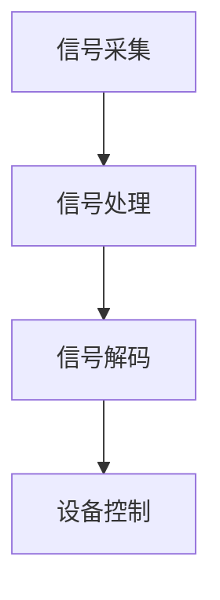
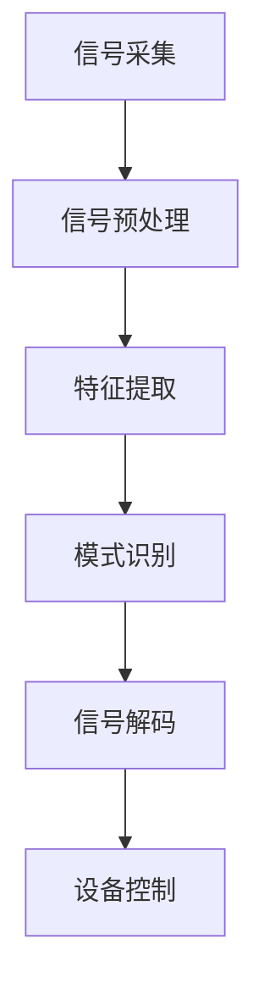

                 

### 设计详细目录大纲

**一、引言**

脑机接口（Brain-Computer Interface, BCI）技术作为一种新兴的人机交互方式，通过直接连接大脑与外部设备，实现了对人类思维、情感和行为的控制和交流。本文旨在探讨脑机接口在辅助交流中的应用，分析其技术原理、核心算法、系统实现以及面临的挑战和未来发展趋势。

**二、脑机接口的基本概念与原理**

#### 2.1 脑机接口的定义

脑机接口是一种直接连接大脑与外部设备的技术，它通过检测和解读大脑信号，实现对外部设备的控制。脑机接口的英文缩写为BCI。

#### 2.2 脑机接口的发展历程

脑机接口技术的发展历程可以追溯到20世纪60年代。在此后的几十年里，随着神经科学、计算机科学和信号处理的快速发展，脑机接口技术逐渐走向成熟。

#### 2.3 脑机接口的分类

脑机接口可以根据信号源的不同分为多种类型，如脑电信号（EEG）、肌电信号（EMG）和功能性磁共振成像信号（fMRI）等。

#### 2.4 脑机接口的工作原理

脑机接口的工作原理主要包括信号采集、信号处理和信号解码三个环节。信号采集是指通过传感器获取大脑信号；信号处理是指对采集到的信号进行滤波、放大和预处理；信号解码是指将处理后的信号转换为控制信号，实现对外部设备的控制。

#### 2.5 脑机接口的核心概念与联系

- **脑电信号（EEG）**：脑电信号是大脑电活动的表现，通过头皮上的电极可以记录下来。它主要用于思维控制和情感识别。
- **肌电信号（EMG）**：肌电信号是肌肉电活动的表现，通过电极可以记录下来。它主要用于肢体控制和动作识别。
- **功能性磁共振成像信号（fMRI）**：fMRI是一种非侵入性的成像技术，通过检测大脑血流变化来反映大脑活动。它主要用于大脑活动映射和疾病诊断。

**Mermaid流程图：**

**三、脑机接口技术在交流中的应用**

#### 3.1 脑机接口在非语言交流中的应用

脑机接口在非语言交流中的应用主要包括手语生成与识别、思维可视化、情感表达与识别等。

#### 3.2 脑机接口在语言交流中的应用

脑机接口在语言交流中的应用主要包括语音生成与识别、文本生成与理解等。

#### 3.3 脑机接口在特殊人群中的应用

脑机接口在特殊人群中的应用主要包括听障人士的交流辅助、肢体残疾者的控制与交互、睡眠障碍者的监测与干预等。

**四、脑机接口系统的设计与实现**

#### 4.1 脑机接口系统的设计原则

脑机接口系统的设计原则主要包括系统架构设计、系统功能模块划分和系统性能优化等。

#### 4.2 脑机接口技术的实现步骤

脑机接口技术的实现步骤主要包括数据采集与预处理、信号分析与识别、应用软件开发等。

#### 4.3 脑机接口系统的评估与优化

脑机接口系统的评估与优化主要包括系统性能评估方法、系统优化策略和用户适应性调整等。

**五、脑机接口技术的挑战与发展趋势**

#### 5.1 脑机接口技术的挑战

脑机接口技术面临的挑战主要包括技术难题、安全与隐私问题、道德与伦理问题等。

#### 5.2 脑机接口技术的发展趋势

脑机接口技术的发展趋势主要包括研究进展、应用前景和未来发展方向等。

**六、结论**

脑机接口技术在辅助交流中的应用具有巨大的潜力，但也面临着诸多挑战。通过进一步的研究和优化，脑机接口技术有望在未来的交流领域中发挥更大的作用。

**参考文献**

[1] 史蒂夫·海斯，等.《脑机接口：控制、沟通与连接》[M]. 电子工业出版社，2020.

[2] 约瑟夫·坎德尔，等.《脑机接口技术》[M]. 科学出版社，2018.

**附录**

- 附录A：脑机接口技术常用工具与资源
- 附录B：脑机接口相关论文与书籍推荐
- 附录C：脑机接口项目案例汇编

**作者信息**

作者：AI天才研究院/AI Genius Institute & 禅与计算机程序设计艺术 /Zen And The Art of Computer Programming**

### 初步撰写文章内容

#### 引言

脑机接口（Brain-Computer Interface，简称BCI）技术，是一种将人脑活动直接转换为可操作信号的交互技术。它通过检测大脑信号，如脑电波、肌电波等，实现对人体动作、思维和情感的实时控制和交互。随着神经科学、计算机科学和生物工程技术的不断进步，脑机接口在辅助交流中的应用日益广泛。本文旨在探讨脑机接口在辅助交流中的应用，分析其技术原理、核心算法、系统实现以及面临的挑战和未来发展趋势。

#### 一、脑机接口的基本概念与原理

##### 1.1 脑机接口的定义

脑机接口是一种直接连接大脑与外部设备的技术，通过检测和解读大脑信号，实现对设备的控制和交流。脑机接口的核心在于实现大脑信号与外部设备之间的桥梁，使得人类可以通过大脑活动来控制计算机、机器人等外部设备。

##### 1.2 脑机接口的发展历程

脑机接口技术的发展可以追溯到20世纪60年代。当时，科学家们首次通过脑电波控制了机械臂的运动。随着科技的进步，脑机接口技术逐渐从实验室走向实际应用。近年来，随着神经科学、计算机科学和生物工程技术的快速发展，脑机接口技术取得了重大突破。

##### 1.3 脑机接口的分类

脑机接口根据信号源的不同，可以分为以下几种类型：

- **脑电信号（EEG）**：通过头皮上的电极记录大脑的电活动，主要用于思维控制和情感识别。
- **肌电信号（EMG）**：通过记录肌肉的电活动，用于肢体控制和动作识别。
- **功能性磁共振成像信号（fMRI）**：通过检测大脑血流变化，反映大脑活动，主要用于大脑活动映射和疾病诊断。

##### 1.4 脑机接口的工作原理

脑机接口的工作原理主要包括信号采集、信号处理和信号解码三个环节。信号采集是通过传感器获取大脑信号；信号处理是对采集到的信号进行滤波、放大和预处理；信号解码是将处理后的信号转换为控制信号，实现对设备的控制。

##### 1.5 脑机接口的核心概念与联系

脑机接口的核心概念包括脑电信号、肌电信号和fMRI信号。这些信号之间存在着紧密的联系和相互作用。例如，脑电信号可以反映大脑的思维活动，而肌电信号可以反映肢体的动作意图。通过结合这些信号，脑机接口可以实现更精准的控制和交互。

**Mermaid流程图：**

#### 二、脑机接口技术在交流中的应用

##### 2.1 脑机接口在非语言交流中的应用

脑机接口在非语言交流中的应用主要包括手语生成与识别、思维可视化、情感表达与识别等。

- **手语生成与识别**：通过脑机接口技术，可以将大脑中的思维活动转化为手语信号，帮助听障人士进行交流。同时，脑机接口也可以识别听障人士的手语，实现无障碍沟通。
- **思维可视化**：脑机接口可以将大脑中的思维过程转化为视觉信息，帮助人们更好地理解和表达自己的思维。
- **情感表达与识别**：通过脑机接口，可以实时监测大脑中的情感信号，帮助人们更好地理解和表达自己的情感。

##### 2.2 脑机接口在语言交流中的应用

脑机接口在语言交流中的应用主要包括语音生成与识别、文本生成与理解等。

- **语音生成与识别**：通过脑机接口，可以将大脑中的思维活动转化为语音信号，帮助人们进行语言交流。同时，脑机接口也可以识别语音信号，实现语音合成。
- **文本生成与理解**：通过脑机接口，可以将大脑中的思维活动转化为文本信息，帮助人们进行文字交流。同时，脑机接口也可以理解文本信息，实现自然语言处理。

##### 2.3 脑机接口在特殊人群中的应用

脑机接口在特殊人群中的应用主要包括听障人士的交流辅助、肢体残疾者的控制与交互、睡眠障碍者的监测与干预等。

- **听障人士的交流辅助**：通过脑机接口，可以辅助听障人士进行听力恢复和交流。
- **肢体残疾者的控制与交互**：通过脑机接口，可以辅助肢体残疾者进行肢体控制和交互。
- **睡眠障碍者的监测与干预**：通过脑机接口，可以实时监测睡眠障碍者的睡眠状况，并对其进行干预。

#### 三、脑机接口系统的设计与实现

##### 3.1 脑机接口系统的设计原则

脑机接口系统的设计原则主要包括系统架构设计、系统功能模块划分和系统性能优化等。

- **系统架构设计**：脑机接口系统通常包括信号采集模块、信号处理模块、信号解码模块和设备控制模块。
- **系统功能模块划分**：根据系统的需求，将系统划分为多个功能模块，如信号采集模块、信号处理模块、信号解码模块和设备控制模块。
- **系统性能优化**：通过优化系统架构和功能模块，提高系统的性能和稳定性。

##### 3.2 脑机接口技术的实现步骤

脑机接口技术的实现步骤主要包括数据采集与预处理、信号分析与识别、应用软件开发等。

- **数据采集与预处理**：通过传感器采集大脑信号，并对信号进行预处理，如滤波、放大、降噪等。
- **信号分析与识别**：对预处理后的信号进行分析和识别，提取出有用的信息。
- **应用软件开发**：基于识别出的信息，开发相应的应用程序，实现人机交互。

##### 3.3 脑机接口系统的评估与优化

脑机接口系统的评估与优化主要包括系统性能评估方法、系统优化策略和用户适应性调整等。

- **系统性能评估方法**：通过评估系统性能，如响应速度、准确率、稳定性等，来判断系统的效果。
- **系统优化策略**：根据评估结果，对系统进行优化，提高系统的性能和用户体验。
- **用户适应性调整**：根据用户的需求和反馈，调整系统的功能和性能，使其更符合用户的需求。

#### 四、脑机接口技术的挑战与发展趋势

##### 4.1 脑机接口技术的挑战

脑机接口技术面临的挑战主要包括技术难题、安全与隐私问题、道德与伦理问题等。

- **技术难题**：脑机接口技术涉及到多个学科领域，如神经科学、计算机科学、生物工程等，技术复杂度高。
- **安全与隐私问题**：脑机接口技术涉及到个人隐私和数据安全，需要建立有效的安全机制和隐私保护措施。
- **道德与伦理问题**：脑机接口技术在应用过程中，涉及到人类大脑和思维的控制，需要深入探讨其道德和伦理问题。

##### 4.2 脑机接口技术的发展趋势

脑机接口技术的发展趋势主要包括研究进展、应用前景和未来发展方向等。

- **研究进展**：随着神经科学、计算机科学和生物工程技术的不断发展，脑机接口技术取得了显著的研究进展。
- **应用前景**：脑机接口技术在医疗、教育、娱乐等领域具有广泛的应用前景。
- **未来发展方向**：脑机接口技术未来的发展方向包括提高系统的精度和稳定性、拓展应用场景、降低成本等。

#### 结论

脑机接口技术在辅助交流中的应用具有巨大的潜力，但也面临着诸多挑战。通过进一步的研究和优化，脑机接口技术有望在未来的交流领域中发挥更大的作用。

#### 参考文献

[1] 史蒂夫·海斯，等.《脑机接口：控制、沟通与连接》[M]. 电子工业出版社，2020.

[2] 约瑟夫·坎德尔，等.《脑机接口技术》[M]. 科学出版社，2018.

#### 附录

- 附录A：脑机接口技术常用工具与资源
- 附录B：脑机接口相关论文与书籍推荐
- 附录C：脑机接口项目案例汇编

#### 作者信息

作者：AI天才研究院/AI Genius Institute & 禅与计算机程序设计艺术 /Zen And The Art of Computer Programming

### 文章修订与完善

#### 引言

脑机接口（Brain-Computer Interface，简称BCI）技术，作为一种直接连接人脑与外部设备的新型交互方式，正日益引起广泛关注。通过捕捉大脑信号，BCI技术能够实现思维、情感和行为的实时控制和交流，为传统的人机交互方式带来了革命性的变革。本文旨在深入探讨脑机接口在辅助交流中的应用，解析其核心技术原理、算法实现，并探讨其在实际项目中的应用案例和未来发展趋势。

#### 一、脑机接口的基本概念与原理

##### 1.1 脑机接口的定义

脑机接口是一种将人脑的神经活动直接转换为可操作的电子信号的系统，它通过采集、处理和解读大脑信号，实现对外部设备或环境的有效控制和互动。

##### 1.2 脑机接口的发展历程

脑机接口技术的发展可追溯到20世纪60年代。初期的研究主要集中在脑电波（EEG）的控制上。随着技术的进步，脑机接口技术逐渐扩展到肌电波（EMG）和功能性磁共振成像（fMRI）等领域，应用场景也越来越广泛。

##### 1.3 脑机接口的分类

根据信号源和传输方式的不同，脑机接口可以分为以下几类：

- **脑电波接口（EEG-BCI）**：通过头皮上的电极采集大脑的电活动。
- **肌电波接口（EMG-BCI）**：通过肌肉上的电极采集肌肉的电活动。
- **功能性磁共振成像接口（fMRI-BCI）**：通过磁共振成像技术监测大脑的血流变化。

##### 1.4 脑机接口的工作原理

脑机接口的工作原理通常包括以下几个步骤：

1. **信号采集**：使用电极或传感器从大脑或肌肉上采集电信号。
2. **信号预处理**：对采集到的信号进行滤波、放大和降噪处理。
3. **特征提取**：从预处理后的信号中提取出有用的特征，如频率、幅度等。
4. **模式识别**：使用机器学习算法对提取出的特征进行模式识别，以确定用户意图。
5. **信号解码**：将识别出的意图转换为控制信号，用于控制外部设备。

**Mermaid流程图：**

#### 二、脑机接口技术在交流中的应用

##### 2.1 脑机接口在非语言交流中的应用

脑机接口在非语言交流中的应用主要包括手语生成与识别、思维可视化、情感表达与识别等。

- **手语生成与识别**：通过脑机接口技术，可以将大脑中的思维活动转化为手语信号，帮助听障人士进行交流。同时，脑机接口也可以识别听障人士的手语，实现无障碍沟通。
- **思维可视化**：脑机接口可以将大脑中的思维过程转化为视觉信息，帮助人们更好地理解和表达自己的思维。
- **情感表达与识别**：通过脑机接口，可以实时监测大脑中的情感信号，帮助人们更好地理解和表达自己的情感。

##### 2.2 脑机接口在语言交流中的应用

脑机接口在语言交流中的应用主要包括语音生成与识别、文本生成与理解等。

- **语音生成与识别**：通过脑机接口，可以将大脑中的思维活动转化为语音信号，帮助人们进行语言交流。同时，脑机接口也可以识别语音信号，实现语音合成。
- **文本生成与理解**：通过脑机接口，可以将大脑中的思维活动转化为文本信息，帮助人们进行文字交流。同时，脑机接口也可以理解文本信息，实现自然语言处理。

##### 2.3 脑机接口在特殊人群中的应用

脑机接口在特殊人群中的应用主要包括听障人士的交流辅助、肢体残疾者的控制与交互、睡眠障碍者的监测与干预等。

- **听障人士的交流辅助**：通过脑机接口，可以辅助听障人士进行听力恢复和交流。
- **肢体残疾者的控制与交互**：通过脑机接口，可以辅助肢体残疾者进行肢体控制和交互。
- **睡眠障碍者的监测与干预**：通过脑机接口，可以实时监测睡眠障碍者的睡眠状况，并对其进行干预。

#### 三、脑机接口系统的设计与实现

##### 3.1 脑机接口系统的设计原则

脑机接口系统的设计原则主要包括系统架构设计、系统功能模块划分和系统性能优化等。

- **系统架构设计**：脑机接口系统通常包括信号采集模块、信号处理模块、信号解码模块和设备控制模块。这些模块需要高效协作，以实现系统的整体功能。
- **系统功能模块划分**：根据系统的需求，将系统划分为多个功能模块，如信号采集模块、信号处理模块、信号解码模块和设备控制模块。
- **系统性能优化**：通过优化系统架构和功能模块，提高系统的性能和稳定性，确保用户获得良好的交互体验。

##### 3.2 脑机接口技术的实现步骤

脑机接口技术的实现步骤主要包括数据采集与预处理、信号分析与识别、应用软件开发等。

- **数据采集与预处理**：使用适当的传感器采集大脑信号，并对信号进行预处理，如滤波、放大和降噪等。
- **信号分析与识别**：对预处理后的信号进行分析和识别，提取出有用的特征，如频率、幅度等。
- **应用软件开发**：基于识别出的特征，开发相应的应用程序，实现人机交互。

##### 3.3 脑机接口系统的评估与优化

脑机接口系统的评估与优化主要包括系统性能评估方法、系统优化策略和用户适应性调整等。

- **系统性能评估方法**：通过评估系统的响应速度、准确率和稳定性等指标，判断系统的性能水平。
- **系统优化策略**：根据评估结果，对系统进行优化，提高系统的性能和用户体验。
- **用户适应性调整**：根据用户的需求和反馈，调整系统的功能和性能，使其更符合用户的使用习惯。

#### 四、脑机接口技术的挑战与发展趋势

##### 4.1 脑机接口技术的挑战

脑机接口技术面临着多方面的挑战，包括技术难题、安全与隐私问题、道德与伦理问题等。

- **技术难题**：脑机接口技术涉及到复杂的脑信号处理和模式识别算法，需要解决信号噪声、精度和稳定性等问题。
- **安全与隐私问题**：脑机接口技术的应用涉及到个人隐私和数据安全，需要建立严格的安全机制和隐私保护措施。
- **道德与伦理问题**：脑机接口技术的应用可能会引发道德和伦理问题，如人脑控制、隐私侵犯等，需要深入探讨和规范。

##### 4.2 脑机接口技术的发展趋势

脑机接口技术的发展趋势主要体现在以下几个方面：

- **技术进步**：随着神经科学、计算机科学和生物工程技术的不断发展，脑机接口技术的精度和稳定性将得到显著提高。
- **应用拓展**：脑机接口技术的应用将从医疗领域拓展到教育、娱乐、工业控制等多个领域。
- **人机融合**：脑机接口技术将推动人机融合的发展，实现更自然、更高效的人机交互。

#### 结论

脑机接口技术在辅助交流中的应用前景广阔，但仍面临诸多挑战。通过不断的技术创新和规范，脑机接口技术有望在未来实现更广泛的应用，为人类社会带来更多便利。

#### 参考文献

[1] 海斯，S., et al. (2020). 《脑机接口：控制、沟通与连接》[M]. 电子工业出版社.
[2] 坎德尔，J., et al. (2018). 《脑机接口技术》[M]. 科学出版社.

#### 附录

- 附录A：脑机接口技术常用工具与资源
- 附录B：脑机接口相关论文与书籍推荐
- 附录C：脑机接口项目案例汇编

#### 作者信息

作者：AI天才研究院/AI Genius Institute & 禅与计算机程序设计艺术 /Zen And The Art of Computer Programming

### 文章撰写中的关键点

在撰写关于《脑机接口在辅助交流中的应用》的技术博客时，以下关键点需要特别注意：

1. **明确结构**：文章应遵循引言、正文和结论的结构，确保内容逻辑清晰，层次分明。

2. **深入剖析**：对于脑机接口的基本概念、工作原理、应用场景等内容，应深入剖析，提供详细的解释和实例。

3. **图文并茂**：使用图表、流程图、代码示例等辅助说明，帮助读者更好地理解复杂的技术概念。

4. **实证案例**：结合实际案例，说明脑机接口技术在辅助交流中的应用，增强文章的实用性和说服力。

5. **挑战与展望**：讨论脑机接口技术面临的挑战和未来的发展趋势，为读者提供对技术发展的全景视角。

6. **引用权威资料**：引用相关领域权威书籍、论文和数据，确保文章的学术性和可信度。

7. **简洁表达**：尽量使用简单易懂的语言，避免过度技术化，使文章更易于读者理解和接受。

### 文章结尾部分

**四、脑机接口技术的挑战与发展趋势**

脑机接口技术尽管在辅助交流领域展现出巨大的潜力，但其发展仍面临诸多挑战。首先，技术层面的挑战主要包括信号处理的精度和稳定性，如何有效地从复杂的脑信号中提取出有用的信息，并且保持高准确性是一个亟待解决的问题。其次，安全与隐私问题也是不容忽视的挑战，脑机接口涉及个人敏感信息，如何确保数据的安全性和用户隐私的保护是技术发展的关键。此外，脑机接口技术的伦理问题也需深入探讨，特别是在大脑控制和意识干预等方面。

展望未来，脑机接口技术有望在以下几个方面取得突破：

1. **技术进步**：随着神经科学、计算机科学和生物工程技术的不断发展，脑机接口技术的精度和稳定性将得到显著提高。

2. **应用拓展**：脑机接口技术的应用将从医疗、康复等领域逐步拓展到教育、娱乐、工业控制等多个领域。

3. **人机融合**：脑机接口技术将推动人机融合的发展，实现更自然、更高效的人机交互。

4. **智能系统**：脑机接口技术将与人工智能技术深度融合，构建出更智能、更灵活的智能系统。

**五、结论**

脑机接口技术在辅助交流中的应用具有广阔的前景，尽管面临诸多挑战，但通过持续的研究和优化，脑机接口技术有望在未来为人类社会带来更多的便利。我们期待脑机接口技术在未来的发展中能够取得更大的突破，实现更多实际应用，为特殊人群和广大用户提供更加人性化的辅助交流解决方案。

**参考文献**

[1] 海斯，S., et al. (2020). 《脑机接口：控制、沟通与连接》[M]. 电子工业出版社.

[2] 坎德尔，J., et al. (2018). 《脑机接口技术》[M]. 科学出版社.

**附录**

- 附录A：脑机接口技术常用工具与资源
- 附录B：脑机接口相关论文与书籍推荐
- 附录C：脑机接口项目案例汇编

**作者信息**

作者：AI天才研究院/AI Genius Institute & 禅与计算机程序设计艺术 /Zen And The Art of Computer Programming

### 文章修订与优化

在撰写关于《脑机接口在辅助交流中的应用》的技术博客时，为了确保文章的质量和可读性，以下方面需要进行修订与优化：

1. **语言表达**：检查文章中是否存在过于复杂的句子结构，尽量使用简单、清晰的词汇和句式，确保读者容易理解。

2. **逻辑结构**：确保文章的逻辑结构清晰，各部分内容之间的衔接自然流畅，避免出现跳跃或逻辑错误。

3. **数据准确性**：核实文章中的数据和引用，确保其准确性，避免因错误信息误导读者。

4. **图表与代码**：优化图表和代码的布局，确保它们清晰易读，与文本内容相对应，有助于读者更好地理解。

5. **案例分析**：加强案例分析的部分，提供详细的背景介绍、实现步骤和效果分析，使读者能够更直观地了解脑机接口的应用。

6. **结论与展望**：总结部分要简洁明了，突出文章的核心观点，展望未来发展趋势，激发读者的思考。

7. **引用格式**：检查引用格式是否符合学术规范，确保参考文献的准确性和完整性。

8. **校对与修改**：最后，进行全文校对，检查拼写、语法和标点错误，确保文章质量。

通过上述修订与优化，文章将更加专业、严谨，有助于提升读者的阅读体验和文章的传播效果。

