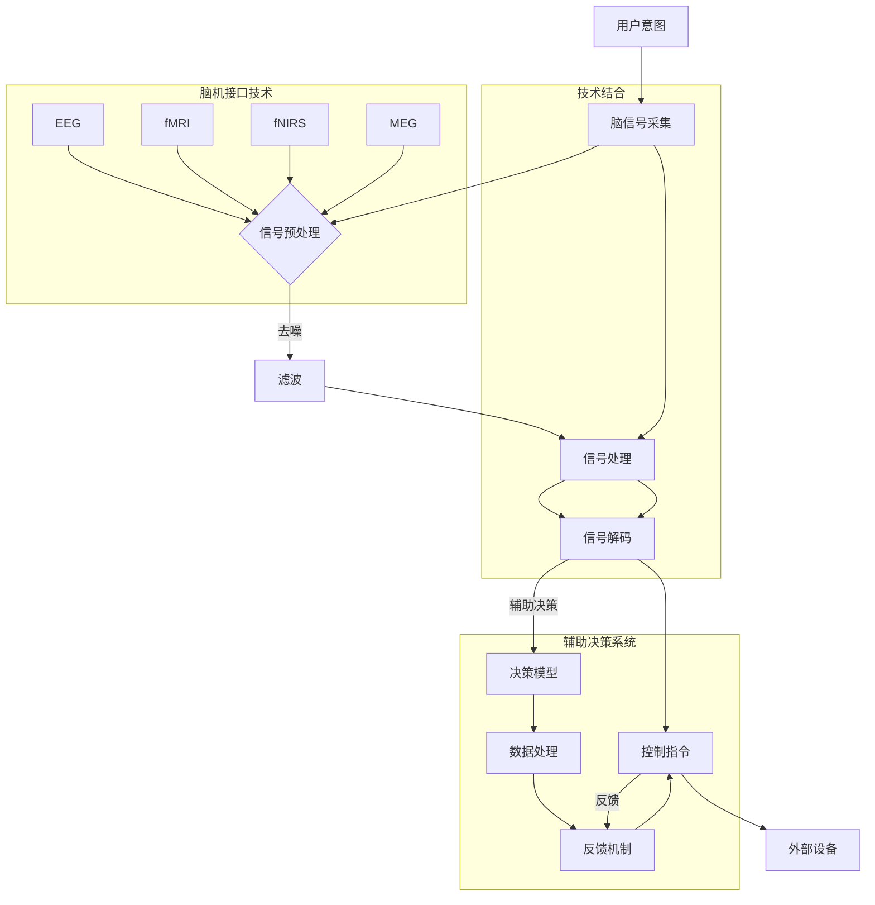

                 

### 引言

脑机接口（Brain-Computer Interface，简称BCI）和辅助决策系统（Assisted Decision-Making Systems）是两个在当今科技前沿领域极具潜力的概念。脑机接口通过直接将人的大脑信号转换为计算机指令，实现了人脑与机器之间的直接通信。而辅助决策系统则是利用先进的算法和模型，帮助用户在复杂环境中做出更加明智的决策。

近年来，随着神经科学、计算机科学、信号处理等领域的快速发展，脑机接口技术逐渐从实验室走向实际应用。而辅助决策系统则广泛应用于各个行业，从商业决策到医疗诊断，再到自动驾驶和智能家居，无处不在。这两者的融合，不仅有可能彻底改变人类的生活方式，还将在许多领域带来革命性的突破。

本文将深入探讨脑机接口在辅助决策系统中的应用前景。首先，我们将简要介绍脑机接口的定义、历史和发展。接着，详细讨论脑机接口的工作原理、核心技术以及与辅助决策系统的结合方式。随后，本文将分析脑机接口在辅助决策系统中的应用场景，包括偏瘫康复、精神障碍治疗、环境交互和工业自动化等。最后，我们将探讨脑机接口和辅助决策系统的发展趋势、面临的挑战以及未来的应用前景。

通过本文的探讨，我们希望读者能够全面了解脑机接口在辅助决策系统中的巨大潜力，为这一领域的未来发展提供一些有价值的思考和建议。

### 关键词

脑机接口（BCI）、辅助决策系统、神经系统、信号处理、机器学习、深度学习、神经编码、神经解码、实时反馈、决策模型、数据预处理、环境交互、智能康复、工业自动化、技术应用前景。

### 摘要

本文旨在探讨脑机接口在辅助决策系统中的应用前景。首先，我们介绍了脑机接口的定义、历史和发展，以及其核心技术和工作原理。接着，分析了脑机接口与辅助决策系统的结合方式，包括数据收集、预处理和决策模型的优化。随后，本文详细讨论了脑机接口在辅助决策系统中的实际应用，如偏瘫康复、精神障碍治疗、环境交互和工业自动化等。最后，我们探讨了脑机接口和辅助决策系统的发展趋势、面临的挑战以及未来的应用前景，为这一领域的发展提供了一些有价值的思考。

### 第一部分：脑机接口基础

#### 1.1 脑机接口的定义与历史

脑机接口（Brain-Computer Interface，简称BCI）是一种直接连接人脑和外部设备的技术，它能够捕捉大脑信号并将其转换为计算机指令或控制信号。脑机接口的研究始于20世纪60年代，当时科学家们开始探索通过大脑信号控制电子设备。早期的BCI系统主要用于神经科学研究和医疗应用，例如帮助瘫痪患者恢复运动能力。

脑机接口的发展可以分为几个重要阶段。在20世纪70年代，科学家开始使用脑电图（Electroencephalography，简称EEG）技术来捕捉大脑信号。这一阶段的主要挑战是如何有效地从复杂的脑电信号中提取有用的信息。到了20世纪80年代和90年代，随着信号处理和计算能力的提升，BCI技术逐渐成熟，开始应用于实际的康复设备和辅助设备中。21世纪初，随着无线传输技术和神经接口技术的进步，BCI进入了新的发展阶段，实现了更高精度和更广泛的应用。

脑机接口在神经科学研究和医疗领域取得了显著成果。例如，通过脑机接口技术，瘫痪患者可以控制假肢进行日常活动，甚至实现与虚拟环境的交互。此外，脑机接口还被用于治疗精神障碍，如癫痫、抑郁症和焦虑症。通过实时监测和反馈，脑机接口可以帮助患者控制症状，提高生活质量。

然而，脑机接口技术也面临一些挑战。首先是如何提高信号处理的精度和稳定性，以确保可靠的指令传输。其次是如何减少设备的侵入性，提高患者的舒适度。此外，脑机接口技术还需要解决长期稳定性和生物相容性等问题。

总的来说，脑机接口技术的发展为许多领域的应用提供了新的可能，从康复到辅助设备，再到智能交互，脑机接口正在逐步改变我们的生活方式。

#### 1.2 脑机接口的工作原理

脑机接口的工作原理可以分为信号采集、信号处理、信号解码和信号输出四个主要步骤。

首先是信号采集。脑机接口通过不同的技术手段捕捉大脑信号，最常见的是脑电图（EEG）和功能性磁共振成像（fMRI）。EEG通过放置在头皮上的电极捕捉大脑电活动，而fMRI通过磁场变化监测大脑血氧水平的变化，反映大脑活动。除了EEG和fMRI，还有其他技术如近红外光谱成像（fNIRS）和脑磁图（MEG），它们也广泛应用于脑信号采集。

接下来是信号处理。采集到的大脑信号通常包含大量噪声和干扰，因此需要通过信号处理技术进行去噪和滤波。常用的方法包括带通滤波、独立成分分析（ICA）和主成分分析（PCA）。这些处理步骤的目的是提取出有用的信号成分，去除噪声，提高信号质量。

然后是信号解码。经过处理的脑信号被送入解码算法，以提取出用户意图或控制信号。解码算法可以是基于统计模型的方法，如线性回归和神经网络，也可以是基于机器学习的方法，如支持向量机和深度学习。这些算法通过学习大脑信号与用户意图之间的关系，实现对信号的准确解码。

最后是信号输出。解码出的控制信号被转换为机器指令，控制外部设备或执行特定任务。例如，在康复应用中，解码出的信号可以用来控制假肢的运动；在智能交互中，解码出的信号可以用来控制智能家居设备或游戏。

总的来说，脑机接口的工作原理是一个复杂而精密的过程，从信号采集、处理、解码到输出，每一步都需要精确的技术和算法支持。这不仅需要高精度的硬件设备，还需要强大的计算能力和先进的算法。通过这些技术的结合，脑机接口能够实现人脑与机器之间的直接通信，为许多领域带来革命性的变化。

#### 1.3 脑机接口的核心技术

脑机接口技术的核心在于如何精确地捕捉和处理大脑信号，并将其转换为可用的控制指令。以下是一些关键的核心技术：

首先是脑电图（EEG）技术。EEG是一种通过放置在头皮上的电极来捕捉大脑电活动的技术。这些电极可以记录大脑神经元的电活动，并将其转换为电信号。EEG技术因其高时间分辨率和低成本而广泛应用于脑机接口研究中。然而，EEG信号的噪声较大，如何有效地去除噪声并提取出有用的信号成分是EEG技术的关键挑战。

其次是功能性磁共振成像（fMRI）。fMRI通过检测大脑血氧水平的变化来反映大脑活动。这种技术具有高空间分辨率，可以精确地定位大脑活动区域。然而，fMRI的时间分辨率较低，通常在数秒至数十秒之间，这使得它不适合实时控制应用。

近红外光谱成像（fNIRS）是另一种重要的脑机接口技术。fNIRS通过测量近红外光在大脑中的传输变化来监测大脑活动。与EEG和fMRI相比，fNIRS具有低成本和实时性的优势，但其空间分辨率较低。

脑磁图（MEG）是一种通过捕捉大脑磁场变化来监测大脑活动的技术。MEG具有高时间分辨率，可以捕捉快速的大脑活动。然而，由于磁场信号的复杂性和设备的成本，MEG在实际应用中较为有限。

除了上述技术，还有一些新兴的脑机接口技术，如基于光遗传学的神经元接口技术和基于基因编辑的脑机接口技术。这些技术通过直接操纵神经元活动，为脑机接口提供了新的可能性。

每种脑机接口技术都有其独特的优势和局限性。EEG技术因其低成本和易于实现而广泛应用于研究和小型设备，但噪声问题需要进一步解决。fMRI和fNIRS具有较好的空间分辨率和实时性，但在设备成本和操作复杂度方面存在挑战。MEG虽然具有高时间分辨率，但设备昂贵且操作复杂。新兴技术如光遗传学和基因编辑为脑机接口带来了新的研究方向，但技术仍处于探索阶段，需要更多的研究和优化。

总的来说，脑机接口的核心技术正不断进步，各种技术之间的结合和优化将进一步提升脑机接口的性能和应用范围。通过不断创新和探索，脑机接口有望在未来实现更加广泛和高效的应用。

#### 1.4 脑机接口与辅助决策系统的关系架构

脑机接口与辅助决策系统的结合，通过信号采集、处理、解码和输出等环节，实现了人脑意图与机器指令的精准传递。为了更清晰地展示这一关系架构，我们可以使用Mermaid流程图来描述整个过程。



在这个流程图中，用户意图通过脑信号采集模块（B）被转换为脑信号，这些信号经过预处理（C）、滤波（D）和处理（C1），然后通过解码模块（E）转换为控制指令（F）。这些指令不仅可以直接控制外部设备（G），还可以通过辅助决策系统（H-I-J）进行进一步的决策和优化。

辅助决策系统利用机器学习和深度学习算法（H），对采集到的脑信号进行处理（I），并通过反馈机制（J）对控制指令进行实时调整，以确保系统的稳定性和高效性。

脑机接口技术（B1-B4）各自具有不同的采集和处理优势，通过综合运用这些技术，可以进一步提高脑信号的质量和可靠性。例如，EEG技术因其高时间分辨率和低成本而广泛应用于实时控制应用，而fMRI和fNIRS则因其较高的空间分辨率和实时性而适合复杂环境的监测和控制。

通过这种关系架构，脑机接口与辅助决策系统实现了高度集成和协同工作，不仅提高了系统的整体性能，还为用户提供了更加智能化和个性化的交互体验。这种结合模式为未来脑机接口在辅助决策系统中的应用奠定了坚实的基础。

#### 1.5 脑机接口在辅助决策系统中的核心算法原理

脑机接口在辅助决策系统中的应用，离不开一系列核心算法的支持。这些算法包括信号处理、解码和决策模型，它们共同构成了脑机接口系统的智能核心。以下将详细解释这些核心算法的原理，并结合Python源代码和数学模型进行讲解。

**1.5.1 信号处理算法**

信号处理是脑机接口技术的关键步骤，其目的是从原始脑信号中提取有用的信息，去除噪声，提高信号质量。常见的信号处理算法包括带通滤波、独立成分分析（ICA）和主成分分析（PCA）。

**带通滤波**：
带通滤波是一种常用的信号滤波方法，用于保留特定频率范围内的信号，同时抑制其他频率的噪声。Python中的`scipy.signal`模块提供了`bandpass`函数，可以方便地进行带通滤波。

```python
from scipy.signal import bandpass
from scipy.io import loadmat
from matplotlib.pyplot import plot, show

# 加载包含EEG信号的MATLAB文件
data = loadmat('EEG_data.mat')
signal = data['signal']

# 设置滤波器的截止频率
fs = 1000  # 采样频率
lowcut = 1  # 最低截止频率
highcut = 30  # 最高截止频率

# 应用带通滤波
filtered_signal = bandpass(signal, lowcut, highcut, fs, axis=0)

# 绘制原始信号和滤波后的信号
plot(signal, label='Original Signal')
plot(filtered_signal, label='Filtered Signal')
show()
```

**独立成分分析（ICA）**：
ICA是一种无监督学习方法，用于分离混合信号中的独立成分。Python中的`scikit-learn`库提供了`FastICA`类，可以方便地进行ICA分析。

```python
from sklearn.decomposition import FastICA
import numpy as np

# 加载混合信号数据
X = np.load('mixed_signal.npy')

# 应用FastICA分离独立成分
ica = FastICA(n_components=5)
S = ica.fit_transform(X)

# 绘制独立成分图
import matplotlib.pyplot as plt

for i in range(S.shape[1]):
    plt.plot(S[:, i])
plt.xlabel('Samples')
plt.ylabel('ICA Components')
plt.show()
```

**主成分分析（PCA）**：
PCA是一种线性降维方法，通过保留主要变量，去除冗余信息，简化数据结构。Python中的`scikit-learn`库提供了`PCA`类，可以方便地进行PCA分析。

```python
from sklearn.decomposition import PCA
import numpy as np

# 加载脑信号数据
X = np.load('EEG_data.npy')

# 应用PCA降维
pca = PCA(n_components=5)
X_pca = pca.fit_transform(X)

# 绘制主成分图
plt.scatter(X_pca[:, 0], X_pca[:, 1])
plt.xlabel('First Principal Component')
plt.ylabel('Second Principal Component')
plt.show()
```

**1.5.2 解码算法**

解码算法是脑机接口的核心，其目的是从处理后的脑信号中提取出用户意图或控制信号。常见的解码算法包括线性回归、神经网络和支持向量机（SVM）。

**线性回归**：
线性回归是一种简单的统计方法，通过建立输入信号与输出信号之间的线性关系来进行解码。Python中的`scikit-learn`库提供了`LinearRegression`类，可以方便地进行线性回归分析。

```python
from sklearn.linear_model import LinearRegression
import numpy as np

# 加载解码模型和测试数据
model = LinearRegression()
model.fit(X_train, y_train)

# 对测试数据进行解码
y_pred = model.predict(X_test)

# 绘制解码结果
plt.scatter(X_test, y_test, label='Actual')
plt.plot(X_test, y_pred, color='red', label='Predicted')
plt.xlabel('Input Signal')
plt.ylabel('Decoded Signal')
plt.legend()
plt.show()
```

**神经网络**：
神经网络是一种通过模拟人脑神经元连接结构进行学习和预测的方法。Python中的`keras`库提供了方便的神经网络模型构建和训练工具。

```python
from keras.models import Sequential
from keras.layers import Dense
import numpy as np

# 构建神经网络模型
model = Sequential()
model.add(Dense(64, input_dim=X_train.shape[1], activation='relu'))
model.add(Dense(32, activation='relu'))
model.add(Dense(1, activation='sigmoid'))

# 编译模型
model.compile(optimizer='adam', loss='binary_crossentropy', metrics=['accuracy'])

# 训练模型
model.fit(X_train, y_train, epochs=10, batch_size=32)

# 测试模型
loss, accuracy = model.evaluate(X_test, y_test)
print(f"Test Accuracy: {accuracy:.2f}")
```

**支持向量机（SVM）**：
SVM是一种强大的分类和回归方法，通过找到一个最佳超平面来实现信号解码。Python中的`scikit-learn`库提供了`SVC`类，可以方便地进行SVM分析。

```python
from sklearn.svm import SVC
import numpy as np

# 加载SVM模型和测试数据
model = SVC(kernel='linear')
model.fit(X_train, y_train)

# 对测试数据进行解码
y_pred = model.predict(X_test)

# 绘制解码结果
plt.scatter(X_test, y_test, label='Actual')
plt.plot(X_test, y_pred, color='red', label='Predicted')
plt.xlabel('Input Signal')
plt.ylabel('Decoded Signal')
plt.legend()
plt.show()
```

**1.5.3 决策模型**

决策模型是辅助决策系统的核心，通过分析处理后的信号，实现对用户意图的识别和决策。常见的决策模型包括机器学习模型和深度学习模型。

**机器学习模型**：
机器学习模型通过学习历史数据，实现对未知数据的分类和预测。Python中的`scikit-learn`库提供了丰富的机器学习模型，如逻辑回归、决策树和支持向量机。

```python
from sklearn.ensemble import RandomForestClassifier
import numpy as np

# 加载机器学习模型和测试数据
model = RandomForestClassifier(n_estimators=100)
model.fit(X_train, y_train)

# 对测试数据进行预测
y_pred = model.predict(X_test)

# 计算准确率
accuracy = np.mean(y_pred == y_test)
print(f"Test Accuracy: {accuracy:.2f}")
```

**深度学习模型**：
深度学习模型通过多层神经网络结构，实现对复杂数据的自动特征提取和分类。Python中的`keras`库提供了方便的深度学习模型构建和训练工具。

```python
from keras.models import Sequential
from keras.layers import Conv2D, MaxPooling2D, Flatten, Dense
import numpy as np

# 构建深度学习模型
model = Sequential()
model.add(Conv2D(32, (3, 3), activation='relu', input_shape=(X_train.shape[1], X_train.shape[2], X_train.shape[3])))
model.add(MaxPooling2D(pool_size=(2, 2)))
model.add(Flatten())
model.add(Dense(1, activation='sigmoid'))

# 编译模型
model.compile(optimizer='adam', loss='binary_crossentropy', metrics=['accuracy'])

# 训练模型
model.fit(X_train, y_train, epochs=10, batch_size=32)

# 测试模型
loss, accuracy = model.evaluate(X_test, y_test)
print(f"Test Accuracy: {accuracy:.2f}")
```

通过这些核心算法，脑机接口在辅助决策系统中实现了从信号采集、处理、解码到决策的完整流程。这些算法不仅提高了系统的性能和准确性，还为脑机接口技术的发展提供了强大的技术支持。

### 第二部分：辅助决策系统的构建

#### 2.1 辅助决策系统的概述

辅助决策系统（Assisted Decision-Making Systems）是一种利用先进算法和模型，帮助用户在复杂环境中做出明智决策的系统。这些系统通过收集和分析大量数据，结合人工智能和机器学习技术，为用户提供个性化的决策建议。

辅助决策系统的定义可以描述为：一种通过集成数据采集、处理、分析和决策生成模块，实现用户在复杂环境中做出最优决策的智能化系统。其核心目的是通过自动化和智能化的手段，减少人类在决策过程中所需的时间和精力，提高决策的准确性和效率。

辅助决策系统的作用主要体现在以下几个方面：

首先，辅助决策系统可以显著提高决策的准确性和效率。通过大数据分析和机器学习算法，系统可以识别出潜在的模式和规律，从而提供更加准确的决策建议。

其次，辅助决策系统可以帮助用户在面对复杂问题时做出更好的决策。在许多情况下，人类在面对大量信息和复杂决策时容易受到情绪和主观因素的影响，而辅助决策系统则可以提供客观、理性的建议，减少决策偏差。

此外，辅助决策系统还可以优化资源配置，提高生产效率。在商业、金融、医疗等领域，辅助决策系统可以帮助企业或机构更好地管理资源，降低成本，提高收益。

最后，辅助决策系统有助于促进创新和发现新的商业机会。通过分析市场和客户数据，系统可以发现新的需求和趋势，为企业和创业者提供创新的商业策略和市场方向。

总的来说，辅助决策系统作为一种智能化工具，正逐渐成为各行业提高竞争力、实现可持续发展的重要手段。

#### 2.2 数据收集与预处理

数据收集与预处理是辅助决策系统构建的重要环节，决定了系统能否从大量数据中提取出有价值的信息，从而为决策提供支持。数据收集是指从各种数据源获取原始数据的过程，而数据预处理则是对原始数据进行清洗、转换和格式化，使其符合后续分析要求。

**数据来源**：

辅助决策系统的数据来源多样，主要包括以下几类：

1. **结构化数据**：这类数据通常来自于数据库管理系统，例如关系型数据库（如MySQL、Oracle）或NoSQL数据库（如MongoDB、Cassandra）。结构化数据包括客户信息、销售数据、财务报表等，具有较高的数据质量和一致性。

2. **半结构化数据**：这类数据通常来自于日志文件、XML文件、JSON文件等。半结构化数据包含一定的结构信息，但不像结构化数据那样严格，例如网页爬取数据、社交媒体数据等。

3. **非结构化数据**：这类数据通常没有固定的结构，例如文本、图像、音频、视频等。非结构化数据通常需要通过自然语言处理（NLP）、图像处理和语音识别等技术进行处理和分析。

**数据预处理方法**：

数据预处理是确保数据质量、提高数据分析效果的重要步骤。以下是一些常见的数据预处理方法：

1. **数据清洗**：数据清洗是指识别和纠正数据中的错误、缺失值和不一致之处。常见的数据清洗方法包括删除重复记录、填充缺失值、修正错误值等。在Python中，可以使用`pandas`库进行数据清洗。

```python
import pandas as pd

# 加载原始数据
data = pd.read_csv('raw_data.csv')

# 删除重复记录
data.drop_duplicates(inplace=True)

# 填充缺失值
data.fillna(method='ffill', inplace=True)

# 修正错误值
data[data < 0] = 0
```

2. **数据转换**：数据转换是指将数据从一种格式转换为另一种格式，使其适应后续分析。常见的转换方法包括数据类型转换、缩放和标准化等。

```python
# 数据类型转换
data['age'] = data['age'].astype(int)

# 缩放
from sklearn.preprocessing import MinMaxScaler
scaler = MinMaxScaler()
data_scaled = scaler.fit_transform(data[['age', 'income']])
```

3. **数据归一化**：数据归一化是指将不同特征的数据范围统一到相同的尺度，以便于后续分析。常用的归一化方法包括最小-最大归一化和Z-score标准化。

```python
# 最小-最大归一化
from sklearn.preprocessing import MinMaxScaler
scaler = MinMaxScaler()
data_minmax = scaler.fit_transform(data[['age', 'income']])

# Z-score标准化
from sklearn.preprocessing import StandardScaler
scaler = StandardScaler()
data_zscore = scaler.fit_transform(data[['age', 'income']])
```

4. **特征选择**：特征选择是指从原始数据中选择出对模型性能有显著影响的关键特征。常见的方法包括过滤式特征选择、包裹式特征选择和嵌入式特征选择。

```python
# 过滤式特征选择
from sklearn.feature_selection import SelectKBest
from sklearn.feature_selection import f_classif

X = data[['age', 'income', 'education']]
y = data['target']

selector = SelectKBest(f_classif, k=2)
X_new = selector.fit_transform(X, y)

# 包裹式特征选择
from sklearn.feature_selection import RFECV
from sklearn.ensemble import RandomForestClassifier

selector = RFECV(estimator=RandomForestClassifier(), step=1, cv=5)
selector.fit(X, y)
X_new = selector.transform(X)
```

通过以上数据预处理方法，可以显著提高数据的分析质量和模型的性能，为辅助决策系统的构建提供坚实的数据基础。

#### 2.3 决策模型的选择与优化

辅助决策系统的核心在于其决策模型的选择与优化，这些模型决定了系统能否有效地从数据中提取信息，为用户提供准确的决策建议。常见的决策模型包括经典模型、机器学习模型和深度学习模型。

**经典模型**：

经典模型主要包括逻辑回归、决策树和随机森林等。逻辑回归是一种广泛应用于分类问题的线性模型，通过建立特征与目标变量之间的线性关系进行预测。决策树则通过一系列规则来划分数据，并基于这些规则进行分类或回归。随机森林是一种基于决策树的集成学习方法，通过构建多棵决策树并集成其预测结果来提高模型的性能。

Python代码示例：

```python
from sklearn.linear_model import LogisticRegression
from sklearn.tree import DecisionTreeClassifier
from sklearn.ensemble import RandomForestClassifier
from sklearn.model_selection import train_test_split
from sklearn.metrics import accuracy_score

# 数据准备
X = data[['age', 'income', 'education']]
y = data['target']

# 划分训练集和测试集
X_train, X_test, y_train, y_test = train_test_split(X, y, test_size=0.2, random_state=42)

# 构建并训练逻辑回归模型
logreg = LogisticRegression()
logreg.fit(X_train, y_train)

# 预测测试集
y_pred_logreg = logreg.predict(X_test)

# 计算准确率
accuracy_logreg = accuracy_score(y_test, y_pred_logreg)
print(f"Logistic Regression Accuracy: {accuracy_logreg:.2f}")

# 构建并训练决策树模型
dt = DecisionTreeClassifier()
dt.fit(X_train, y_train)

# 预测测试集
y_pred_dt = dt.predict(X_test)

# 计算准确率
accuracy_dt = accuracy_score(y_test, y_pred_dt)
print(f"Decision Tree Accuracy: {accuracy_dt:.2f}")

# 构建并训练随机森林模型
rf = RandomForestClassifier(n_estimators=100)
rf.fit(X_train, y_train)

# 预测测试集
y_pred_rf = rf.predict(X_test)

# 计算准确率
accuracy_rf = accuracy_score(y_test, y_pred_rf)
print(f"Random Forest Accuracy: {accuracy_rf:.2f}")
```

**机器学习模型**：

机器学习模型包括支持向量机（SVM）、K-近邻（KNN）和朴素贝叶斯等。SVM通过找到一个最佳超平面来实现分类或回归，具有较强的分类能力。KNN基于“近邻投票”策略，通过计算样本与其k个最近邻的相似度来进行分类。朴素贝叶斯是一种基于贝叶斯定理的简单分类方法，通过计算特征条件概率进行预测。

Python代码示例：

```python
from sklearn.svm import SVC
from sklearn.neighbors import KNeighborsClassifier
from sklearn.naive_bayes import GaussianNB
from sklearn.model_selection import train_test_split
from sklearn.metrics import accuracy_score

# 数据准备
X = data[['age', 'income', 'education']]
y = data['target']

# 划分训练集和测试集
X_train, X_test, y_train, y_test = train_test_split(X, y, test_size=0.2, random_state=42)

# 构建并训练SVM模型
svm = SVC()
svm.fit(X_train, y_train)

# 预测测试集
y_pred_svm = svm.predict(X_test)

# 计算准确率
accuracy_svm = accuracy_score(y_test, y_pred_svm)
print(f"SVM Accuracy: {accuracy_svm:.2f}")

# 构建并训练KNN模型
knn = KNeighborsClassifier(n_neighbors=3)
knn.fit(X_train, y_train)

# 预测测试集
y_pred_knn = knn.predict(X_test)

# 计算准确率
accuracy_knn = accuracy_score(y_test, y_pred_knn)
print(f"KNN Accuracy: {accuracy_knn:.2f}")

# 构建并训练朴素贝叶斯模型
gnb = GaussianNB()
gnb.fit(X_train, y_train)

# 预测测试集
y_pred_gnb = gnb.predict(X_test)

# 计算准确率
accuracy_gnb = accuracy_score(y_test, y_pred_gnb)
print(f"Gaussian Naive Bayes Accuracy: {accuracy_gnb:.2f}")
```

**深度学习模型**：

深度学习模型包括卷积神经网络（CNN）、循环神经网络（RNN）和变换器（Transformer）等。CNN通过卷积层和池化层提取图像特征，常用于图像分类任务。RNN通过记忆过去的信息，适合处理序列数据，如时间序列分析和自然语言处理。Transformer通过自注意力机制，实现了对序列数据的高效建模，广泛应用于机器翻译和文本生成等任务。

Python代码示例：

```python
from tensorflow.keras.models import Sequential
from tensorflow.keras.layers import Dense, Conv2D, MaxPooling2D, Flatten, LSTM, TimeDistributed, Embedding
from tensorflow.keras.preprocessing.sequence import pad_sequences
import numpy as np

# 数据准备
X = np.array([[1, 2], [3, 4], [5, 6]])
y = np.array([0, 1, 0])

# 构建卷积神经网络模型
model = Sequential()
model.add(Conv2D(32, (3, 3), activation='relu', input_shape=(X.shape[1], X.shape[2], 1)))
model.add(MaxPooling2D(pool_size=(2, 2)))
model.add(Flatten())
model.add(Dense(1, activation='sigmoid'))

# 编译模型
model.compile(optimizer='adam', loss='binary_crossentropy', metrics=['accuracy'])

# 训练模型
model.fit(X, y, epochs=10, batch_size=1)

# 预测测试集
y_pred = model.predict(X)

# 计算准确率
accuracy = np.mean(y_pred == y)
print(f"Model Accuracy: {accuracy:.2f}")

# 构建循环神经网络模型
model = Sequential()
model.add(LSTM(50, activation='relu', input_shape=(X.shape[1], X.shape[2])))
model.add(Dense(1, activation='sigmoid'))

# 编译模型
model.compile(optimizer='adam', loss='binary_crossentropy', metrics=['accuracy'])

# 训练模型
model.fit(X, y, epochs=10, batch_size=1)

# 预测测试集
y_pred = model.predict(X)

# 计算准确率
accuracy = np.mean(y_pred == y)
print(f"Model Accuracy: {accuracy:.2f}")
```

通过这些经典模型、机器学习模型和深度学习模型的选择与优化，辅助决策系统可以更好地从数据中提取信息，为用户提供准确的决策建议。不同模型的适用场景和性能差异需要根据具体应用需求进行综合考虑和优化。

#### 2.4 脑机接口与辅助决策系统的整合

脑机接口（BCI）与辅助决策系统的整合，是一种创新的技术融合，旨在通过直接利用大脑信号实现智能化决策和交互。这种整合不仅能够提高决策的实时性和准确性，还能够为用户提供更加自然和直观的交互体验。以下将详细探讨脑机接口与辅助决策系统的整合方式、实时决策与反馈机制，以及整合性能的评估与优化策略。

**整合方式**

脑机接口与辅助决策系统的整合主要通过以下几个步骤实现：

1. **信号采集**：首先，通过脑机接口技术（如EEG、fMRI、fNIRS等）采集用户的大脑信号。这些信号包含了用户的意图、情感和认知状态等信息。

2. **信号预处理**：采集到的大脑信号通常包含噪声和干扰，因此需要通过信号处理技术（如带通滤波、ICA、PCA等）进行预处理，以提高信号质量。

3. **信号解码**：预处理后的信号被送入解码算法，以提取出用户的具体意图或控制信号。解码算法可以是基于统计模型的方法（如线性回归、神经网络等），也可以是基于机器学习的方法（如支持向量机、深度学习等）。

4. **决策生成**：提取出的控制信号进入辅助决策系统，通过机器学习模型和深度学习算法进行分析和处理，生成具体的决策结果。

5. **实时反馈**：根据决策结果，系统实时生成反馈信号，并通过脑机接口返回给用户，实现闭环反馈。

**实时决策与反馈机制**

实时决策与反馈机制是脑机接口与辅助决策系统整合的核心，它决定了系统的响应速度和交互质量。以下是一些关键步骤：

1. **实时信号采集**：通过高速数据采集设备，实时采集用户的大脑信号，以确保信号的一致性和完整性。

2. **实时信号处理**：采用高效的信号处理算法，实时去除噪声和干扰，提高信号质量。这些算法需要优化以适应实时处理的要求。

3. **实时解码**：在信号解码环节，需要确保解码算法的快速响应，以便实时提取用户意图。这通常要求解码算法具有较低的延迟和较高的准确性。

4. **实时决策**：通过快速处理的用户意图信号，辅助决策系统实时生成决策结果。这要求决策算法具有高效的计算能力和良好的性能。

5. **实时反馈**：根据决策结果，系统实时生成反馈信号，并通过脑机接口返回给用户。反馈信号可以是视觉、听觉或触觉形式，以增强用户的交互体验。

**整合性能的评估与优化**

整合性能的评估与优化是确保脑机接口与辅助决策系统高效运行的关键。以下是一些评估和优化策略：

1. **准确性评估**：通过评估系统生成的决策结果与用户实际意图的匹配程度，来衡量系统的准确性。准确性越高，系统的性能越好。

2. **响应时间评估**：通过测量系统从信号采集到反馈生成的整个过程所需的时间，来评估系统的响应速度。响应时间越短，系统的交互体验越好。

3. **稳定性评估**：通过模拟各种复杂环境下的运行，评估系统的稳定性和可靠性。系统需要能够在不同环境中稳定运行，避免因环境变化导致的性能下降。

4. **优化策略**：为了提高整合性能，可以采用以下优化策略：

   - **算法优化**：对信号处理和解码算法进行优化，提高处理速度和准确性。

   - **硬件优化**：升级数据采集和处理设备，提高系统的硬件性能。

   - **模型优化**：通过机器学习和深度学习算法，对决策模型进行优化，提高决策的准确性和效率。

   - **用户适应**：根据不同用户的特点和需求，调整系统参数，实现个性化适应。

通过以上整合方式、实时决策与反馈机制，以及整合性能的评估与优化策略，脑机接口与辅助决策系统可以实现高效、智能的决策和交互，为各领域提供创新的解决方案。

#### 第三部分：脑机接口在辅助决策系统中的应用

**3.1 偏瘫康复**

脑机接口技术在偏瘫康复中的应用为患者带来了全新的治疗手段，显著改善了康复效果和患者的生活质量。偏瘫是指由于脑卒中、脑外伤或其他神经疾病导致的一侧肢体功能受损。传统的康复治疗通常依赖物理治疗和康复设备，但这些方法往往存在康复周期长、效果有限等问题。

脑机接口技术通过直接捕捉患者大脑的神经信号，实现受损肢体与外部设备的直接通信，从而在康复过程中提供更加个性化和高效的康复方案。以下详细探讨脑机接口在偏瘫康复中的应用。

**应用场景与案例**

脑机接口在偏瘫康复中的应用场景主要包括：

1. **假肢控制**：脑机接口技术可以帮助瘫痪患者通过大脑信号控制假肢进行运动。例如，美国研究团队开发了一种名为“脑机接口假肢”的系统，通过捕捉患者大脑皮层中的运动意图信号，实现高精度的假肢控制。患者只需在大脑中想象运动，假肢即可同步执行相应动作，从而提高康复效率。

2. **肌肉刺激**：脑机接口系统还可以通过解码大脑信号，控制电刺激设备激活瘫痪肌肉，促进肌肉的恢复和再生。例如，一些研究表明，通过脑机接口系统实现电刺激，可以显著提高瘫痪肢体的功能恢复。

**应用效果与未来展望**

脑机接口技术在偏瘫康复中的应用已取得显著成果，具体体现在以下几个方面：

1. **提高康复速度**：脑机接口技术通过直接与大脑信号交互，能够更快地捕捉和响应患者的意图，从而加快康复速度。与传统康复方法相比，脑机接口技术在一些患者中实现了显著的功能恢复。

2. **提升康复效果**：脑机接口技术可以根据患者的具体情况和康复需求，提供个性化的康复方案。这种个性化的康复手段能够更好地满足患者的需求，提升康复效果。

3. **改善生活质量**：脑机接口技术使得瘫痪患者能够通过大脑信号控制假肢，恢复部分运动能力，从而提高生活质量。许多患者通过脑机接口技术重新获得了独立生活的能力。

未来，随着脑机接口技术的不断进步，其在偏瘫康复中的应用前景将更加广阔。可能的未来研究方向包括：

1. **提高信号解码精度**：通过优化解码算法和信号处理技术，进一步提高脑机接口的解码精度和可靠性，实现更精准的运动控制和康复效果。

2. **个性化康复方案**：结合人工智能和大数据分析技术，开发更加智能化的康复系统，根据患者的实时状态和需求，提供个性化的康复方案。

3. **多模态脑机接口**：结合多种脑信号采集技术（如EEG、fMRI、fNIRS等），实现多模态脑机接口系统，进一步提升康复效果和用户体验。

总之，脑机接口技术在偏瘫康复中的应用为患者带来了新的希望，显著改善了康复效果和患者的生活质量。随着技术的不断进步，脑机接口在康复领域的应用将更加广泛，为更多患者带来福祉。

**3.2 精神障碍治疗**

脑机接口技术在精神障碍治疗中展现了巨大的潜力，尤其是在癫痫、抑郁症和焦虑症等疾病的治疗与管理中。传统治疗方法通常局限于药物治疗和行为疗法，但这些方法存在疗效有限、副作用明显等问题。脑机接口技术通过直接捕捉和处理大脑信号，提供了一种全新的治疗手段，具有更加个性化和精准的治疗效果。

**应用场景与案例**

1. **癫痫治疗**：癫痫是一种常见的神经系统疾病，其特征是反复无预兆的痉挛发作。脑机接口技术在癫痫治疗中的应用主要集中在实时监测和预测癫痫发作。例如，美国的“神经导航系统”（NeuroPace）就是一种基于脑机接口技术的植入式设备，通过监测大脑信号，可以在癫痫发作前提前预警，从而减少发作频率和严重程度。

2. **抑郁症治疗**：抑郁症是一种常见的心理障碍，其特征是持续的低落情绪、兴趣丧失和活动减少。脑机接口技术可以通过监测大脑中的异常信号，辅助诊断和治疗抑郁症。例如，研究者正在探索通过脑电图（EEG）信号检测抑郁患者的情绪状态，并使用脑机接口系统进行实时干预，如通过电刺激调节大脑活动，改善情绪。

3. **焦虑症治疗**：焦虑症是一种以过度担忧和紧张为特征的常见心理障碍。脑机接口技术可以帮助监测和管理焦虑症状，通过实时调整大脑活动，降低焦虑水平。例如，一些研究正在使用脑机接口系统，通过实时监测脑电图（EEG）信号，识别焦虑发作的早期迹象，并使用光遗传学技术调节大脑中的神经元活动，缓解焦虑症状。

**应用效果与未来展望**

脑机接口技术在精神障碍治疗中的应用已经取得了一定的成果：

1. **实时监测与预警**：通过脑机接口技术，医生可以实时监测患者的脑信号变化，提前预警潜在的精神障碍发作，从而采取及时的治疗措施，减少发作频率和严重程度。

2. **个性化治疗方案**：脑机接口技术可以根据患者的实时脑信号，提供个性化的治疗方案，提高治疗效果。例如，通过个性化调整电刺激参数，可以更有效地缓解焦虑症状。

3. **减少副作用**：与药物治疗相比，脑机接口技术具有减少副作用的优势，因为其直接作用于大脑信号，而非通过全身系统。

未来，脑机接口技术在精神障碍治疗中的应用前景将更加广阔：

1. **多模态信号采集**：结合多种脑信号采集技术（如EEG、fMRI、fNIRS等），开发多模态脑机接口系统，实现更全面、准确的诊断和治疗。

2. **智能干预系统**：利用人工智能和机器学习技术，开发智能化的干预系统，根据患者的实时状态自动调整治疗方案，提高治疗效果。

3. **新型治疗手段**：探索脑机接口技术在精神障碍治疗中的新型应用，如通过脑信号解码实现虚拟现实治疗、认知行为疗法等。

总之，脑机接口技术在精神障碍治疗中的应用为患者提供了新的治疗选择，显著改善了治疗效果和患者的生活质量。随着技术的不断发展，脑机接口将在精神障碍治疗领域发挥更加重要的作用。

**3.3 环境交互**

脑机接口技术在环境交互中的应用正在逐步拓展，为人们提供了更加自然和直观的交互方式。环境交互指的是人与外部环境（如智能家居、虚拟现实、游戏等）之间的互动。传统的人机交互依赖于物理设备（如键盘、鼠标、触摸屏等），而脑机接口技术通过直接读取用户的脑信号，实现了思想与机器的直接通信，大大提升了交互的效率和体验。

**应用场景与案例**

1. **智能家居**：脑机接口技术可以用于智能家居的控制，例如通过用户的脑信号控制灯光、温度、安全系统等。例如，一些智能家居公司已经开发了脑机接口控制的智能灯泡和窗帘，用户只需在大脑中想象打开或关闭，设备即可响应。

2. **虚拟现实**：在虚拟现实（VR）中，脑机接口技术可以提供更加沉浸式的体验。例如，通过捕捉用户的脑信号，实时调整虚拟场景的视觉和听觉效果，使用户感觉更加真实。一些VR游戏和体验馆已经引入了脑机接口技术，以提升用户的互动体验。

3. **游戏**：脑机接口技术在游戏中的应用也十分广泛。通过用户的脑信号，可以实现更加复杂和动态的游戏控制，例如通过思维控制角色的移动、攻击和策略选择。例如，一些脑机接口游戏允许用户通过大脑信号控制虚拟角色的动作，甚至是通过思考来实现某些特殊技能的释放。

**应用效果与未来展望**

脑机接口技术在环境交互中的应用效果显著，主要体现在以下几个方面：

1. **自然交互**：脑机接口技术为用户提供了更加自然和直观的交互方式，不再依赖于物理设备，减少了手部操作的需要，提高了交互的便捷性和舒适度。

2. **个性化体验**：通过捕捉用户的脑信号，系统可以根据用户的思维模式和行为习惯，提供个性化的交互体验。例如，在虚拟现实中，脑信号可以用于实时调整虚拟场景的视觉和听觉效果，使每个用户都能体验到最适合自己口味的内容。

3. **互动性提升**：脑机接口技术实现了用户与环境的实时互动，提高了交互的动态性和互动性。例如，在游戏中，用户可以通过思维控制角色的动作，使游戏变得更加有趣和挑战性。

未来，脑机接口技术在环境交互中的应用前景广阔：

1. **多模态融合**：结合多种脑信号采集技术（如EEG、fMRI、fNIRS等），开发多模态脑机接口系统，进一步提升交互的自然性和准确性。

2. **智能化系统**：利用人工智能和机器学习技术，开发智能化的交互系统，根据用户的实时状态和需求，自动调整交互方式和体验。

3. **新型应用场景**：探索脑机接口技术在更多领域中的应用，如智能教育、艺术创作等，为人们提供全新的交互体验。

总之，脑机接口技术在环境交互中的应用为人们带来了更加自然和高效的交互方式，极大地提升了用户体验。随着技术的不断发展，脑机接口将在环境交互领域发挥更加重要的作用。

**3.4 工业自动化**

脑机接口技术在工业自动化中的应用为制造业和自动化控制领域带来了创新的可能性，特别是在提高生产效率、降低劳动强度和安全保障方面展现了显著的优势。工业自动化涉及利用机械、电子和计算机技术来实现生产过程的高度自动化和智能化，而脑机接口技术的引入，进一步提升了系统的自适应能力和智能水平。

**应用场景与案例**

1. **机器控制**：脑机接口技术可以用于直接控制工业机械臂或机器人，通过用户的脑信号来指挥机器执行复杂任务。例如，在一些工业生产线中，操作员可以通过脑机接口直接控制机器臂进行组装、焊接或搬运，从而减少手动操作的复杂性。

2. **安全监控**：在工业环境中，脑机接口技术可以用于实时监控操作员的心理状态，以预防工作疲劳和潜在的安全事故。通过分析操作员的脑信号，系统可以识别出疲劳或分心的状态，并发出预警，提醒操作员休息或更换任务。

3. **设备维护**：脑机接口技术可以用于远程监控和诊断工业设备的工作状态，通过分析设备产生的脑信号数据，预测设备故障并进行预防性维护。例如，在风力发电场中，脑机接口系统可以通过监测风力涡轮机的脑信号，预测其运行状态并提前进行维护，减少停机时间。

**应用效果与未来展望**

脑机接口技术在工业自动化中的应用效果主要体现在以下几个方面：

1. **提高生产效率**：通过直接利用脑信号进行机器控制，操作员可以更加迅速和准确地完成复杂任务，减少生产过程中的延迟和错误，从而提高整体生产效率。

2. **降低劳动强度**：脑机接口技术减少了手工操作的依赖，操作员可以通过思维直接控制机器设备，从而降低了劳动强度和操作难度。

3. **安全保障**：脑机接口技术能够实时监测操作员的心理状态，预防工作疲劳和潜在的安全事故，提高生产安全。

未来，脑机接口技术在工业自动化中的应用前景广阔：

1. **自适应控制**：通过不断优化脑机接口算法，提高信号解码的准确性和响应速度，实现更加智能和自适应的机器控制。

2. **多模态融合**：结合多种脑信号采集技术（如EEG、fMRI、fNIRS等），实现多模态脑机接口系统，进一步提升控制精度和可靠性。

3. **集成智能系统**：将脑机接口技术与其他智能技术（如物联网、人工智能等）结合，构建集成智能系统，实现生产过程的全面智能化和自动化。

总之，脑机接口技术在工业自动化中的应用为制造业和自动化控制领域带来了新的发展方向，通过提高生产效率、降低劳动强度和提升安全保障，显著改善了工业生产环境。随着技术的不断进步，脑机接口将在工业自动化领域发挥更加重要的作用。

#### 第四部分：脑机接口与辅助决策系统的发展趋势、挑战与前景

**4.1 技术发展趋势**

脑机接口（BCI）和辅助决策系统（ADMS）技术的发展正在不断加速，呈现出以下几个主要趋势：

1. **多模态融合**：未来的脑机接口技术将融合多种信号采集技术（如EEG、fMRI、fNIRS、MEG等），以获取更全面的大脑活动信息。多模态融合能够提高信号解码的准确性和稳定性，为辅助决策系统提供更可靠的数据基础。

2. **实时性与低延迟**：随着计算能力的提升和算法优化，脑机接口技术将实现更高的实时性和更低的延迟。这将使脑机接口在实时控制和交互中的应用更加广泛，提高用户的体验和系统的响应速度。

3. **个性化与自适应**：基于大数据和人工智能技术，未来的辅助决策系统将能够根据用户的实时状态和需求，提供个性化、自适应的决策建议。这将使系统更加智能，更好地满足用户的个性化需求。

4. **无创与低侵入性**：未来的脑机接口技术将致力于减少设备的侵入性，开发无创或低侵入性的脑信号采集方法。这将提高用户的舒适度和接受度，促进脑机接口技术的广泛应用。

**4.2 面临的挑战**

尽管脑机接口与辅助决策系统具有广阔的应用前景，但它们在发展过程中仍面临以下挑战：

1. **信号处理与解码精度**：如何从复杂的脑信号中提取有用信息，提高解码精度，是实现脑机接口技术广泛应用的关键挑战。这需要不断优化信号处理算法和解码模型，提高系统的性能和稳定性。

2. **伦理与隐私**：脑机接口技术的发展引发了伦理和隐私问题。如何确保用户的隐私和数据安全，避免潜在的滥用风险，是脑机接口技术需要解决的重要问题。

3. **标准化与兼容性**：不同研究和应用领域的脑机接口设备和系统之间缺乏标准化和兼容性，导致系统间的互操作性较差。开发统一的脑机接口标准和协议，提高系统的互操作性，是未来发展的一个重要方向。

4. **规模化与成本**：脑机接口技术的规模化应用需要降低成本，提高设备的普及率。目前，脑机接口设备的成本较高，限制了其大规模应用。未来，通过技术进步和规模化生产，有望降低成本，实现更广泛的应用。

**4.3 前景展望**

脑机接口与辅助决策系统的发展前景非常广阔，它们将在多个领域发挥重要作用：

1. **医疗与健康**：脑机接口技术在康复、精神障碍治疗、健康监测等方面具有巨大的应用潜力。通过辅助决策系统，可以提供个性化的治疗和健康管理方案，提高患者的生活质量。

2. **工业与制造**：脑机接口技术可以用于工业自动化，提高生产效率、降低劳动强度和安全风险。辅助决策系统则可以优化生产流程，实现智能化和自动化管理。

3. **教育与培训**：脑机接口技术可以用于教育领域的个性化教学和智能评估，通过辅助决策系统提供针对性的学习方案和反馈，提高教育质量。

4. **智能家居与物联网**：脑机接口技术可以用于智能家居和物联网系统的智能交互和控制，提供更加自然和便捷的家居体验。

总之，脑机接口与辅助决策系统的发展将为各领域带来新的突破，推动社会进步和科技创新。通过不断克服挑战和优化技术，脑机接口与辅助决策系统将在未来发挥更加重要的作用。

### 总结与未来展望

本文系统地探讨了脑机接口在辅助决策系统中的应用前景，从定义、工作原理、核心技术，到实际应用场景，再到未来发展趋势和挑战，进行了全面而深入的剖析。通过阐述脑机接口与辅助决策系统的结合方式，我们展示了如何通过信号采集、处理、解码和决策生成等环节，实现人脑意图与机器指令的精准传递，提高决策的准确性和实时性。

首先，脑机接口作为一种直接连接人脑与机器的技术，其发展历程和核心技术（如EEG、fMRI、fNIRS等）为辅助决策系统提供了坚实的基础。其次，辅助决策系统的构建涉及数据收集、预处理、模型选择与优化等关键步骤，这些步骤共同构成了智能决策的核心。脑机接口与辅助决策系统的整合，通过多模态信号采集、实时解码和自适应决策等手段，为各领域的应用提供了新的可能。

脑机接口在辅助决策系统中的应用已取得显著成果，如偏瘫康复、精神障碍治疗、环境交互和工业自动化等。这些应用不仅提升了系统的智能化水平，还显著改善了用户的生活质量和生产效率。然而，脑机接口技术仍面临信号处理与解码精度、伦理与隐私、标准化与兼容性等挑战，需要通过技术进步和规范管理来逐步解决。

未来，脑机接口与辅助决策系统的发展趋势将呈现多模态融合、实时性与低延迟、个性化与自适应、无创与低侵入性等方向。随着技术的不断进步，脑机接口有望在医疗、工业、教育和智能家居等领域发挥更加重要的作用，为人类创造更加智能和便捷的生活。

总之，脑机接口在辅助决策系统中的应用前景广阔，其发展不仅将推动科技进步，还将深刻影响社会生活和产业变革。通过不断探索和优化，脑机接口技术将为各领域带来新的机遇和挑战。

### 最佳实践 tips、注意事项与拓展阅读

在脑机接口与辅助决策系统的实际应用中，以下是一些最佳实践 tips 和注意事项，以帮助读者更好地理解和应用相关技术：

**最佳实践 tips**：

1. **信号采集与预处理**：确保信号采集过程的稳定性和可靠性，采用多模态信号采集技术以提高数据质量。在预处理阶段，合理选择滤波方法和去噪算法，以提高信号的可解释性。

2. **模型选择与优化**：根据具体应用需求，选择适合的机器学习模型和深度学习模型。通过交叉验证和参数调优，提高模型的泛化能力和预测准确性。

3. **实时决策与反馈**：优化实时信号处理和解码算法，确保系统的高效运行。设计合理的反馈机制，提高用户交互体验。

**注意事项**：

1. **隐私与伦理**：在使用脑机接口技术时，应严格保护用户的隐私和数据安全。遵守相关法律法规，确保技术应用的合法性和伦理性。

2. **标准化与兼容性**：开发统一的脑机接口标准和协议，提高系统间的互操作性，降低开发成本和复杂度。

3. **用户适应与个性化**：考虑不同用户的特点和需求，设计个性化的应用方案，提高系统的适应性和用户体验。

**拓展阅读**：

1. **《脑机接口：原理、应用与未来》**：该书详细介绍了脑机接口的基本原理、应用场景和发展趋势，适合对脑机接口感兴趣的读者。

2. **《深度学习：基础与进阶》**：该书系统地讲解了深度学习的基础理论和应用方法，对优化辅助决策系统的算法模型有重要参考价值。

3. **《人工智能伦理》**：该书探讨了人工智能技术的伦理问题，包括隐私保护、算法偏见等，为脑机接口与辅助决策系统的应用提供了伦理指导。

通过最佳实践 tips 和注意事项的指导，以及拓展阅读的建议，读者可以更好地理解和应用脑机接口与辅助决策系统的相关技术，推动这一领域的发展。

