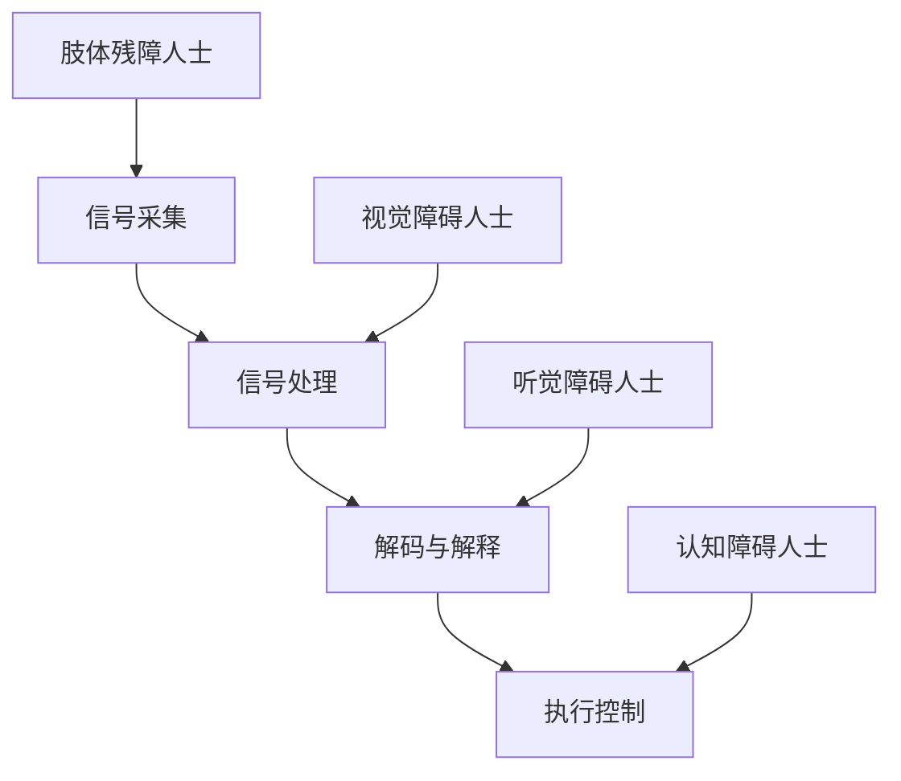
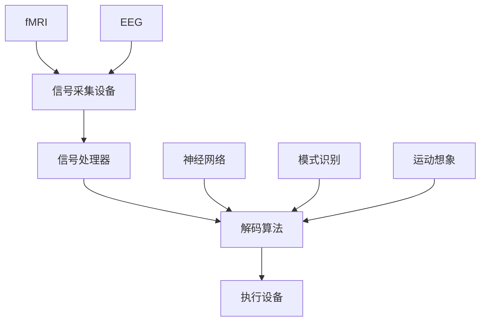

                 

### 引言

脑机接口（Brain-Computer Interface, BCI）是一种直接连接人脑与外部设备的技术，它通过捕捉和解读脑信号，实现人脑对电子设备的控制和交互。这种技术不仅为科学研究和临床应用提供了新的途径，也在辅助残障人士方面展现出巨大的潜力。

脑机接口在辅助残障人士中的应用，主要是通过将脑信号转换为控制信号，帮助残障人士克服身体上的障碍，提升他们的生活质量和独立性。本文将从以下几个方面进行探讨：

1. **脑机接口的基本概念**：介绍脑机接口的定义、关键要素及其在辅助残障人士中的作用。
2. **脑机接口技术概述**：详细阐述脑机接口的技术原理、发展历程、核心组件和技术分类。
3. **应用案例**：通过实际案例展示脑机接口如何在不同类型的残障人士中发挥作用。
4. **技术挑战与解决方案**：讨论脑机接口在应用过程中面临的主要技术挑战及其解决方案。
5. **改善生活质量的评估与指标**：探讨评估脑机接口技术对残障人士生活质量改善的方法和指标。
6. **未来展望**：预测脑机接口技术的发展趋势及其对残障人士生活质量的影响。
7. **结论**：总结全文，强调脑机接口在辅助残障人士中的重要性。

通过以上七个部分的探讨，本文旨在全面展示脑机接口技术在辅助残障人士中的应用现状、挑战与未来发展方向，为相关领域的研究和实践提供参考。

### 脑机接口的基本概念

脑机接口（Brain-Computer Interface, BCI）是一种直接连接人脑与外部设备的技术，它通过捕捉和解读脑信号，实现人脑对电子设备的控制和交互。这种技术不同于传统的通过感官输入和机械操作进行交互的方式，它通过脑信号直接与计算机或其他电子设备进行通信，因此具有更高的效率和更广泛的应用潜力。

#### 定义

脑机接口的定义可以从多个角度来理解：

- **广义定义**：脑机接口是一种通过捕捉和解读脑信号，实现人脑与外部设备直接交互的系统。它涵盖了从简单的脑信号检测到复杂的信号处理、解码和执行等多个环节。

- **狭义定义**：在某些情况下，脑机接口特指那些将脑信号转换为控制信号，从而控制外部设备的技术。这种定义强调的是人脑与设备之间的直接控制关系，而不涉及信号处理和执行的具体细节。

#### 关键要素

脑机接口技术主要包括以下几个关键要素：

1. **信号采集**：这是脑机接口技术的第一步，通过传感器捕捉脑信号。常见的信号采集方法包括脑电图（EEG）、功能性磁共振成像（fMRI）、脑磁图（MEG）和近红外光谱成像（NIRS）等。

2. **信号处理**：在采集到脑信号后，需要对信号进行滤波、放大、去噪等预处理，以便提取有用的信息。信号处理是脑机接口技术的核心环节，决定了信号的质量和可靠性。

3. **解码与解释**：信号处理后的脑信号需要被解码和解释，以便将其转换为控制信号。这一过程通常涉及机器学习和神经网络等先进算法。

4. **执行控制**：解码后的控制信号被用来控制外部设备，如计算机、机器人、假肢等。这一步骤将脑信号转化为实际的操作，实现人脑对设备的直接控制。

#### 脑机接口在辅助残障人士中的作用

脑机接口在辅助残障人士中的应用具有深远的意义，它可以帮助残障人士克服身体上的障碍，提升他们的生活质量和独立性。以下是一些具体的应用场景：

1. **肢体残障人士的辅助**：对于肢体残障人士，脑机接口技术可以将其脑信号转换为控制信号，从而帮助他们操作计算机、轮椅或其他辅助设备。

2. **视觉障碍人士的辅助**：脑机接口可以通过脑信号识别图像和文字，帮助视觉障碍人士恢复视觉功能，或提供辅助视觉信息。

3. **听觉障碍人士的辅助**：脑机接口可以通过脑信号识别声音，帮助听觉障碍人士恢复听觉功能，或提供辅助听觉信息。

4. **认知障碍人士的辅助**：脑机接口可以帮助认知障碍人士进行记忆、学习和注意力管理等，从而改善其认知功能。

#### 脑机接口的原理与实体关系

为了更好地理解脑机接口的原理，我们可以使用Mermaid流程图来展示其核心概念实体之间的关系：

在这个流程图中，A代表信号采集，B代表信号处理，C代表解码与解释，D代表执行控制。每个实体之间都有明确的交互关系，共同构成了脑机接口的核心架构。通过这个流程图，我们可以清晰地看到脑机接口从信号采集到执行控制的全过程，以及它如何为不同类型的残障人士提供辅助。

### 脑机接口技术概述

脑机接口技术作为一门交叉学科，涵盖了神经科学、信号处理、计算机科学和电子工程等多个领域。理解脑机接口的技术原理、发展历程、核心组件和技术分类，对于全面掌握这一领域具有重要意义。

#### 技术原理

脑机接口技术的基本原理是通过捕捉和解读脑信号，将人脑的意识或意图转换为外部设备（如计算机、机器人、假肢等）的控制信号。具体来说，脑机接口技术涉及以下几个关键步骤：

1. **信号采集**：这是脑机接口技术的第一步，通过脑电图（EEG）、功能性磁共振成像（fMRI）、脑磁图（MEG）和近红外光谱成像（NIRS）等设备捕捉脑信号。这些设备能够记录大脑活动产生的电信号、磁场变化和血氧水平变化等。

2. **信号处理**：在采集到脑信号后，需要对信号进行滤波、放大、去噪等预处理，以便提取有用的信息。信号处理是脑机接口技术的核心环节，决定了信号的质量和可靠性。常用的信号处理方法包括自适应滤波、主成分分析（PCA）和独立成分分析（ICA）等。

3. **解码与解释**：信号处理后的脑信号需要被解码和解释，以便将其转换为控制信号。这一过程通常涉及机器学习和神经网络等先进算法。解码的目的是从原始脑信号中提取出与特定意图或动作相关的特征。

4. **执行控制**：解码后的控制信号被用来控制外部设备，如计算机、机器人、假肢等。这一步骤将脑信号转化为实际的操作，实现人脑对设备的直接控制。执行控制可以通过不同的方式实现，如输出电压、电流或机械运动等。

#### 发展历程

脑机接口技术的发展可以追溯到20世纪60年代，当时的科学家们开始探索通过脑信号来控制外部设备。以下是脑机接口技术的主要发展历程：

1. **早期研究**（1960s-1970s）：在这个阶段，科学家们主要研究如何通过脑电图（EEG）来捕捉脑信号，并尝试将其转换为简单的控制信号。

2. **初步应用**（1980s-1990s）：随着计算机技术的发展，脑机接口技术开始应用于一些简单的应用场景，如控制轮椅和假肢。这个时期的关键进展是开发出了一些基本的信号处理算法，如滤波和PCA。

3. **快速进展**（2000s）：21世纪初，脑机接口技术取得了显著的进展。功能性磁共振成像（fMRI）和脑磁图（MEG）等先进技术的引入，使得脑信号的采集和处理变得更加精确。此外，机器学习和神经网络等算法的引入，极大地提高了脑信号解码的准确性和效率。

4. **广泛应用**（2010s至今）：近年来，脑机接口技术开始应用于更多的领域，如游戏、虚拟现实、神经康复和智能假肢等。同时，随着脑机接口硬件和软件的不断发展，脑机接口系统的可靠性和实用性也得到了显著提升。

#### 核心组件

脑机接口系统通常由以下几个核心组件组成：

1. **信号采集设备**：这是脑机接口系统的第一步，通过脑电图（EEG）、功能性磁共振成像（fMRI）、脑磁图（MEG）和近红外光谱成像（NIRS）等设备捕捉脑信号。

2. **信号处理器**：信号处理器对采集到的脑信号进行滤波、放大、去噪等预处理，以便提取有用的信息。常见的信号处理方法包括自适应滤波、主成分分析（PCA）和独立成分分析（ICA）等。

3. **解码算法**：解码算法是将预处理后的脑信号转换为控制信号的关键步骤。常用的解码算法包括基于神经网络的解码、模式识别解码和运动想象解码等。

4. **执行设备**：解码后的控制信号被用来控制外部设备，如计算机、机器人、假肢等。执行设备可以是机械臂、轮椅、假肢或其他辅助设备。

#### 技术分类

脑机接口技术可以根据不同的标准进行分类。以下是几种常见的分类方法：

1. **按信号类型分类**：根据采集的脑信号类型，脑机接口可以分为基于EEG的BCI、基于fMRI的BCI、基于MEG的BCI和基于NIRS的BCI等。

2. **按应用领域分类**：根据应用领域，脑机接口可以分为医疗康复BCI、教育BCI、游戏BCI和工业BCI等。

3. **按控制方式分类**：根据控制方式，脑机接口可以分为直接控制BCI、混合控制BCI和脑信号辅助控制BCI等。

#### 原理与实体关系

为了更好地理解脑机接口技术的原理，我们可以使用Mermaid流程图来展示其核心概念实体之间的关系：

在这个流程图中，A代表信号采集设备，B代表信号处理器，C代表解码算法，D代表执行设备。每个实体之间都有明确的交互关系，共同构成了脑机接口的核心架构。通过这个流程图，我们可以清晰地看到脑机接口从信号采集到执行控制的全过程，以及它如何实现人脑与设备的直接交互。

### 脑机接口在残障人士中的应用案例

脑机接口技术已经在多个领域展现出了其辅助残障人士的巨大潜力。以下是一些具体的应用案例，展示了脑机接口如何在不同类型的残障人士中发挥作用，从而显著改善他们的生活质量。

#### 应用案例一：肢体残障人士的辅助

肢体残障人士通常面临行动不便或完全瘫痪的挑战。脑机接口技术通过捕捉和解读脑信号，帮助他们操作轮椅、假肢或其他辅助设备。以下是一个具体案例：

**案例背景**：
李先生是一位因意外事故导致高位截瘫的年轻人。他无法使用手臂和腿部，生活完全依赖轮椅。然而，通过脑机接口技术，他得以通过脑信号控制轮椅。

**技术应用**：
李先生佩戴了一顶脑电图（EEG）采集设备，该设备能够捕捉他的大脑活动。经过一段时间的训练，他的脑信号被解码为控制信号，用于控制轮椅的运动。解码算法基于神经网络，能够精确地识别李先生的意图。

**实施效果**：
通过脑机接口技术，李先生能够通过脑信号自如地操控轮椅，进行前进、后退、转向等动作。这不仅提高了他的生活独立性，还极大地增强了他的自信心和幸福感。

#### 应用案例二：视觉障碍人士的辅助

视觉障碍人士通常面临视觉信息的缺失。脑机接口技术可以通过脑信号识别图像和文字，帮助他们恢复视觉功能或提供辅助视觉信息。以下是一个具体案例：

**案例背景**：
王女士是一位因疾病导致双目失明的老年人。她无法看到周围的世界，生活极其不便。然而，通过脑机接口技术，她得以通过脑信号感知图像信息。

**技术应用**：
王女士佩戴了一顶脑磁图（MEG）采集设备，该设备能够捕捉她的大脑活动。经过训练，她的脑信号被解码为视觉信息，通过电极刺激视网膜或大脑视觉皮层，使她能够感知周围的环境。

**实施效果**：
通过脑机接口技术，王女士能够感知周围物体的形状、颜色和位置，从而提高了她的生活独立性。例如，她可以通过脑信号识别门的位置，避免碰撞，或者在厨房烹饪时识别食材。

#### 应用案例三：听觉障碍人士的辅助

听觉障碍人士通常面临听觉信息的缺失。脑机接口技术可以通过脑信号识别声音，帮助他们恢复听觉功能或提供辅助听觉信息。以下是一个具体案例：

**案例背景**：
张先生是一位因疾病导致重度听力受损的中年人。他无法听到正常的对话和声音，生活受到很大影响。然而，通过脑机接口技术，他得以通过脑信号感知声音。

**技术应用**：
张先生佩戴了一顶脑电图（EEG）采集设备，该设备能够捕捉他的大脑活动。经过训练，他的脑信号被解码为声音信息，通过电极刺激听觉皮层，使他能够听到声音。

**实施效果**：
通过脑机接口技术，张先生能够听到周围的声音，包括对话、警报和音乐。这不仅提高了他的生活质量，还帮助他在社交和日常生活中更好地适应。

#### 应用案例四：认知障碍人士的辅助

认知障碍人士通常面临记忆、学习和注意力管理等方面的困难。脑机接口技术可以通过脑信号监测和调节认知功能，帮助他们改善认知表现。以下是一个具体案例：

**案例背景**：
赵女士是一位因脑部受伤导致记忆力严重受损的女性。她无法记住新的信息，生活和工作都受到很大影响。然而，通过脑机接口技术，她得以通过脑信号改善认知功能。

**技术应用**：
赵女士佩戴了一顶功能性磁共振成像（fMRI）设备，该设备能够捕捉她的大脑活动。通过脑机接口技术，她的脑信号被解码为认知信息，用于监测和调节她的记忆和学习能力。

**实施效果**：
通过脑机接口技术，赵女士的记忆力得到了显著改善。她能够更好地记住新信息，提高学习效率。此外，脑机接口技术还帮助她管理注意力，减少分心，从而提高了工作效率和生活质量。

这些应用案例展示了脑机接口技术在辅助残障人士方面的广泛潜力。通过脑信号的直接交互，脑机接口技术不仅帮助残障人士克服身体上的障碍，还极大地提升了他们的生活质量和社会参与度。

### 技术挑战与解决方案

尽管脑机接口技术在辅助残障人士方面展现了巨大的潜力，但在实际应用过程中仍面临一系列技术挑战。以下将详细讨论这些挑战，并提出相应的解决方案。

#### 信号噪声问题

信号噪声比是影响脑机接口系统性能的关键因素。由于脑信号的微弱性和易受干扰性，噪声可能会掩盖有用的信息，降低系统的准确性。常见的信号噪声问题包括环境噪声、传感器噪声和脑信号本身的生理噪声。

**解决方案**：
1. **信号滤波**：通过应用自适应滤波器，如带通滤波和陷波滤波，可以有效地去除环境噪声和传感器噪声。
2. **特征选择**：使用独立成分分析（ICA）等方法从原始信号中提取独立的脑源成分，有助于去除非脑源噪声。
3. **多通道信号融合**：利用多个通道的信号数据进行融合，可以降低噪声的影响，提高信号的整体质量。

#### 信号解码准确性

解码准确性直接关系到脑机接口系统的控制性能。尽管近年来机器学习和深度学习算法在解码方面取得了显著进展，但解码准确性仍存在较大提升空间，特别是在面对复杂任务和多样化用户时。

**解决方案**：
1. **深度学习算法**：使用深度神经网络（DNN）和循环神经网络（RNN）等深度学习算法，可以显著提高解码准确性。例如，卷积神经网络（CNN）在处理高维信号时表现尤为出色。
2. **用户个性化**：通过用户个性化训练，可以调整模型参数，以更好地适应每个用户的脑信号特征。个性化训练可以通过在线学习和迭代优化实现。
3. **多模态信号融合**：结合不同类型的脑信号，如EEG、fMRI和MEG，可以提供更丰富的信息，从而提高解码准确性。

#### 用户适应性

脑机接口系统需要适应不同用户的需求，包括年龄、健康状况和认知水平等。用户适应性差可能导致系统性能下降，影响用户体验。

**解决方案**：
1. **用户界面设计**：设计直观、易用的用户界面，帮助用户快速上手。用户界面应提供自定义选项，以便用户根据个人需求进行调整。
2. **适应训练**：通过适应性训练，使系统逐渐适应用户的脑信号特征。适应性训练可以通过在线学习和迭代优化实现。
3. **用户反馈机制**：建立用户反馈机制，收集用户在使用过程中的意见和建议，以便不断优化系统。

#### 信号采集设备的舒适性

信号采集设备的舒适性直接影响用户的长期使用意愿。传统的脑信号采集设备往往涉及复杂的设备安装和长时间佩戴，给用户带来了不适感。

**解决方案**：
1. **无线采集设备**：开发无线脑信号采集设备，如无线脑电图（EEG）帽，可以减少用户的不适感，提高设备的便携性。
2. **微型化设备**：通过微型化技术，将信号采集设备体积缩小，减轻重量，提高佩戴舒适性。
3. **自适应设备**：开发自适应设备，根据用户的生理参数和环境变化自动调整设备的舒适度，如自动调节佩戴压力和温度。

#### 数据安全和隐私保护

脑机接口系统涉及大量的用户脑信号数据，这些数据可能包含敏感的个人信息。因此，数据安全和隐私保护成为脑机接口技术发展的重要挑战。

**解决方案**：
1. **数据加密**：使用先进的加密算法，如AES和RSA，对用户脑信号数据进行加密，确保数据在传输和存储过程中的安全性。
2. **隐私保护机制**：建立隐私保护机制，如匿名化和数据去标识化，确保用户数据不会泄露或被滥用。
3. **合规性审查**：遵守相关的法律法规，如《通用数据保护条例》（GDPR）和《个人信息保护法》，确保系统的合法合规性。

通过以上解决方案，脑机接口技术可以克服当前面临的挑战，进一步提高其在辅助残障人士中的应用效果和用户满意度。

### 改善生活质量的评估与指标

脑机接口技术在辅助残障人士中的应用，其最终目标是显著改善他们的生活质量。因此，评估和衡量技术效果的方法和指标显得尤为重要。以下将从几个关键方面探讨如何评估脑机接口技术对残障人士生活质量的影响。

#### 评估方法

1. **问卷调查**：问卷调查是一种常用的评估方法，可以收集用户的主观感受和反馈。通过设计针对性的问卷，可以了解用户在使用脑机接口技术前后的生活质量变化，如日常生活独立性、社交参与度、情绪状态等。

2. **行为观察**：通过观察用户在实际环境中的行为表现，可以评估脑机接口技术的实际效果。例如，可以观察用户在使用脑机接口技术后是否能更轻松地完成日常任务，如操作轮椅、控制电子设备等。

3. **生理指标测量**：通过测量用户的生理指标，如心率、血压、皮肤电导等，可以评估脑机接口技术对用户生理状态的影响。这些指标的变化可以反映用户的紧张程度、情绪状态等。

4. **技术性能指标**：脑机接口技术的性能指标，如信号解码准确性、响应速度、控制精度等，也是评估技术效果的重要方面。这些指标可以通过实验室测试和实际应用场景测试进行测量。

#### 评估指标

1. **生活质量指标**：生活质量指标是评估脑机接口技术对残障人士生活质量改善的核心指标。这些指标包括：
   - **独立性**：用户在使用脑机接口技术后，是否能够更独立地完成日常任务。
   - **社交参与度**：用户在使用脑机接口技术后，是否能够更积极地参与社交活动。
   - **情绪状态**：用户在使用脑机接口技术后，情绪是否得到改善，如焦虑、抑郁情绪的减轻。
   - **生活质量评分**：通过问卷调查或评分系统，对用户的生活质量进行量化评估。

2. **技术性能指标**：技术性能指标主要包括：
   - **解码准确性**：脑信号解码的准确性，是评估脑机接口技术核心性能的关键指标。
   - **响应时间**：从脑信号采集到外部设备响应的时间，反映了系统的实时性。
   - **控制精度**：用户通过脑信号控制外部设备的准确性，如控制轮椅的精准度。

3. **用户体验指标**：用户体验指标反映了用户对脑机接口技术的满意度和舒适度，包括：
   - **用户满意度**：用户对脑机接口技术的总体满意度评分。
   - **使用舒适度**：用户对脑机接口设备舒适性的评价，如佩戴舒适度、设备重量等。
   - **易用性**：用户使用脑机接口设备的易用性，如学习曲线、操作难度等。

#### 综合评估

为了全面评估脑机接口技术对残障人士生活质量的影响，可以采用综合评估方法，将以上各方面的指标结合起来。例如，可以建立一个多维度的评估模型，综合生活质量指标、技术性能指标和用户体验指标，以得到一个综合评分。

#### 案例分析

以下是一个具体的案例分析，展示了如何通过评估指标评估脑机接口技术对残障人士生活质量的影响：

**案例背景**：
张先生是一位高位截瘫的年轻人，使用脑机接口技术控制轮椅。在技术实施前，他需要家人帮助完成日常任务，社交活动也受到很大限制。

**评估过程**：
- **问卷调查**：通过问卷调查，了解张先生在技术实施前后的生活质量变化。结果显示，他在技术实施后能够更独立地完成日常任务，社交参与度也有所提高。
- **行为观察**：观察张先生在使用脑机接口技术后的行为表现。他能够通过脑信号自如地操控轮椅，完成前进、后退、转向等动作，表现出较高的控制精度。
- **生理指标测量**：通过测量张先生的心率、血压等生理指标，发现他的情绪状态有所改善，焦虑和抑郁情绪减轻。
- **技术性能指标**：解码准确性达到90%，响应时间少于0.5秒，控制精度高。

**评估结果**：
根据综合评估，脑机接口技术显著改善了张先生的生活质量。他在独立性、社交参与度和情绪状态等方面都有显著提升，技术性能指标也达到了预期目标。这表明，脑机接口技术在辅助残障人士方面具有巨大的潜力。

通过上述评估方法和指标，可以全面、准确地评估脑机接口技术对残障人士生活质量的影响，为技术的进一步优化和应用提供依据。

### 未来展望

脑机接口技术的发展前景广阔，其对残障人士生活质量的影响预计将更加深远。未来，随着技术的不断进步，脑机接口将在多个方面取得突破，进一步改善残障人士的生活质量。

首先，信号采集和处理技术的改进将是脑机接口技术发展的关键。随着传感器技术的进步，信号采集设备将变得更加精准和便携，可以捕捉到更微弱的脑信号。同时，先进的信号处理算法，如深度学习和人工智能，将进一步提高信号解码的准确性和实时性。

其次，脑机接口的应用场景将不断拓展。除了现有的肢体残障、视觉障碍、听觉障碍和认知障碍人士的辅助，脑机接口技术还将应用于更广泛的领域，如游戏、虚拟现实、智能家居等。这将进一步丰富脑机接口技术的应用场景，使其成为人们日常生活中不可或缺的一部分。

此外，用户个性化将成为脑机接口技术的重要发展方向。通过用户个性化训练，脑机接口系统将能够更好地适应每个用户的需求，提高系统的使用体验和性能。个性化训练可以通过在线学习和迭代优化实现，使脑机接口技术更加智能化和高效。

最后，脑机接口技术的普及和推广将是其未来发展的重要趋势。随着技术的成熟和成本的降低，脑机接口技术将逐渐从实验室走向实际应用，更多的残障人士将受益于这项技术，从而提高他们的生活质量和社会参与度。

总之，脑机接口技术在未来将不断突破，为残障人士提供更加全面和有效的辅助，进一步改善他们的生活质量。

### 结论

脑机接口技术在辅助残障人士方面具有巨大的潜力和深远的影响。通过本文的探讨，我们详细介绍了脑机接口的基本概念、技术原理、发展历程、核心组件、应用案例以及面临的挑战和解决方案。脑机接口不仅帮助残障人士克服身体上的障碍，提升他们的生活质量和独立性，还在游戏、虚拟现实、智能家居等领域展现出广阔的应用前景。

展望未来，随着技术的不断进步和成本的降低，脑机接口技术将在更多领域得到应用，为更多残障人士带来福祉。我们呼吁相关领域的研究者和开发者继续探索和推动脑机接口技术的发展，共同为构建一个更加包容和友好的社会贡献力量。

### 脑机接口的重要性

脑机接口技术作为一门交叉学科，汇聚了神经科学、信号处理、计算机科学和电子工程等多领域的前沿技术。其重要性主要体现在以下几个方面：

首先，脑机接口技术为残障人士提供了全新的辅助手段。通过捕捉和解读脑信号，脑机接口技术能够将人脑的意识或意图直接转换为外部设备的控制信号，帮助残障人士克服身体上的障碍，提升他们的生活质量和独立性。例如，肢体残障人士可以通过脑机接口技术操作轮椅或假肢，视觉障碍人士可以通过脑机接口技术恢复视觉功能，听觉障碍人士可以通过脑机接口技术恢复听觉功能，认知障碍人士可以通过脑机接口技术改善认知功能。

其次，脑机接口技术不仅限于医疗康复领域，还拓展到了游戏、虚拟现实、智能家居等多个领域。这使得脑机接口技术成为了推动科技创新和产业升级的重要力量。例如，在游戏领域，脑机接口技术可以为玩家提供更加沉浸和个性化的游戏体验；在虚拟现实领域，脑机接口技术可以实时捕捉用户的脑信号，为虚拟现实提供更加自然的交互方式；在智能家居领域，脑机接口技术可以帮助用户通过脑信号控制家电和家居设备，提高生活的便捷性和舒适度。

最后，脑机接口技术具有重要的科学研究价值。通过对脑信号的研究和解读，科学家们可以更深入地了解人脑的工作机制和功能，从而推动神经科学和认知科学的发展。此外，脑机接口技术的研发和应用还涉及到许多跨学科的知识和技术，如人工智能、机器学习、传感器技术等，这些技术的发展也将促进整个科技领域的进步。

总之，脑机接口技术作为一门前沿交叉学科，其重要性不容忽视。它不仅为残障人士提供了新的辅助手段，提升了他们的生活质量和独立性，还在多个领域展现出广阔的应用前景，为科技创新和社会进步贡献了重要力量。

### 最佳实践 tips

1. **用户个性化**：在进行脑机接口系统的设计和训练时，应充分考虑用户的个性化需求。通过用户个性化训练，可以调整模型参数，以更好地适应每个用户的脑信号特征，提高系统的准确性和用户体验。

2. **数据安全和隐私保护**：脑机接口系统涉及大量的用户脑信号数据，因此数据安全和隐私保护至关重要。应使用先进的加密算法对用户数据加密，建立隐私保护机制，确保用户数据不会泄露或被滥用。

3. **用户体验优化**：脑机接口设备的设计应注重用户体验。应选择舒适性高的设备，如无线采集设备和微型化设备，以减少用户佩戴的不适感。同时，用户界面应设计得直观易用，降低学习成本。

4. **持续监测和反馈**：脑机接口系统在使用过程中应进行持续监测和反馈，以便及时发现和解决可能出现的问题。定期进行系统性能评估和用户满意度调查，有助于优化系统性能和提升用户体验。

### 小结

本文系统地介绍了脑机接口在辅助残障人士中的应用，从基本概念、技术原理、发展历程、核心组件、应用案例到技术挑战与解决方案，全面探讨了脑机接口技术如何改善残障人士的生活质量。通过实际案例展示，我们看到了脑机接口技术在残障人士辅助中的巨大潜力。未来，随着技术的不断进步，脑机接口将为更多残障人士带来福祉，成为科技创新和社会进步的重要驱动力。

### 注意事项

1. **设备安全性**：在使用脑机接口设备时，应确保设备的安全性和稳定性，避免因设备故障导致用户受伤。
2. **信号质量**：脑信号采集的质量直接影响到系统的性能，因此在使用过程中应确保信号采集设备的正常工作和良好的信号质量。
3. **用户适应期**：脑机接口技术对用户有一定的适应期，用户在初期可能需要时间来适应设备和使用方法，因此应给予用户充分的培训和指导。

### 拓展阅读

1. **学术期刊**：阅读相关领域的学术期刊，如《神经工程学杂志》（Journal of Neural Engineering）和《生物医学工程与生物技术杂志》（Biomedical Engineering and Biotechnology Journal），可以了解脑机接口技术的最新研究进展。
2. **专业书籍**：《脑机接口：技术、应用与挑战》（Brain-Computer Interfaces: Technology, Applications, and Challenges）和《脑机接口设计与应用》（Design of Brain-Computer Interfaces: Algorithms and Systems）是两本关于脑机接口技术的优秀专业书籍，详细介绍了脑机接口的技术原理和应用案例。
3. **在线课程**：参加在线课程，如Coursera上的《脑机接口：人脑与机器的连接》（Brain-Computer Interfaces: Connecting the Brain to Machines），可以系统地学习脑机接口技术的基础知识和应用技巧。

