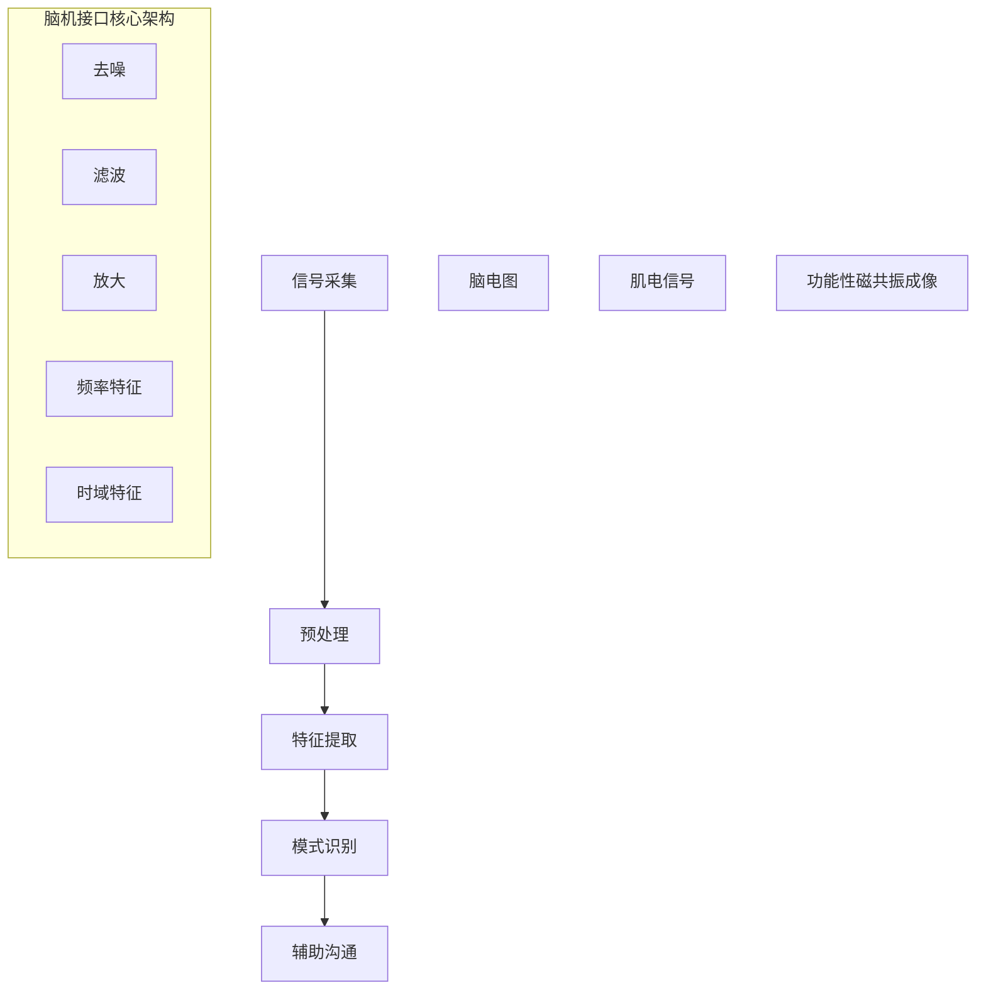

                 

**脑机接口在辅助沟通中的应用前景**

## 关键词
脑机接口，辅助沟通，应用前景，信号处理，模式识别，神经网络，开发环境，源代码实现，案例分析

## 摘要
本文深入探讨了脑机接口（BCI）在辅助沟通领域的应用前景。首先，介绍了脑机接口的基本概念及其在辅助沟通中的作用。接着，详细解析了核心算法原理，包括信号处理、模式识别和神经网络，并使用Python源代码和数学模型进行了通俗易懂的讲解。然后，通过实际项目案例分析，展示了脑机接口在辅助沟通中的应用。最后，提出了最佳实践、注意事项和拓展阅读建议，为未来的研究和发展提供了方向。

---

# **脑机接口在辅助沟通中的应用前景**

脑机接口（Brain-Computer Interface，BCI）是一种直接将人脑与外部设备连接起来的技术，通过捕捉和分析大脑信号，实现与计算机或其他电子设备的互动。近年来，随着科技的进步和人工智能技术的发展，脑机接口在辅助沟通领域展示出了巨大的潜力。

## **背景介绍**

辅助沟通技术旨在帮助那些由于各种原因（如身体残疾、语言障碍等）无法通过传统方式沟通的人群。传统辅助沟通技术主要包括语音合成器、文本到语音转换器和手势识别系统等。然而，这些方法往往存在局限性，无法满足所有用户的需求。脑机接口的引入，为这些用户提供了一种全新的沟通方式。

脑机接口的工作原理是通过电极或其他传感器采集大脑活动产生的电信号，如脑电图（EEG）、肌电信号（EMG）等。然后，利用信号处理算法和机器学习模型对这些信号进行分析，识别用户的意图，并将其转化为可用的信息。例如，通过识别大脑活动模式，脑机接口可以理解用户想要表达的文字或指令，进而通过计算机或其他设备进行沟通。

## **核心概念与联系**

脑机接口在辅助沟通中的应用涉及多个核心概念，包括信号采集、预处理、特征提取和模式识别。这些概念之间相互联系，构成了脑机接口技术的核心架构。

### **信号采集**
信号采集是脑机接口的第一步，主要任务是获取大脑活动的电信号。常用的采集方法包括脑电图（EEG）、肌电信号（EMG）、功能性磁共振成像（fMRI）等。

### **预处理**
预处理包括信号去噪、滤波、放大等步骤，目的是提高信号质量，去除噪声干扰，以便后续分析。

### **特征提取**
特征提取是从原始信号中提取出与用户意图相关的特征，如频率特征、时域特征等。这些特征将用于后续的模式识别。

### **模式识别**
模式识别是脑机接口的核心，通过分析提取出的特征，识别用户的意图，并将其转化为具体的指令或文字。

以下是脑机接口在辅助沟通中的应用架构的Mermaid流程图：



## **核心算法原理讲解**

### **信号处理算法**

信号处理是脑机接口技术的核心环节，主要包括信号去噪、滤波、放大等步骤。以下是一个简单的信号处理算法的Python代码示例：

```python
import numpy as np
from scipy.signal import butter, lfilter

def butter_bandpass_filter(data, lowcut, highcut, fs, order=5):
    nyq = 0.5 * fs
    low = lowcut / nyq
    high = highcut / nyq
    b, a = butter(order, [low, high], btype='band')
    y = lfilter(b, a, data)
    return y

# 示例数据
fs = 1000  # 采样频率
t = np.linspace(0, 1, fs)
data = np.sin(2 * np.pi * 5 * t) + np.sin(2 * np.pi * 50 * t + np.random.randn(len(t)) * 0.1)

# 去除高频噪声
filtered_data = butter_bandpass_filter(data, lowcut=1, highcut=50, fs=fs)

# 绘图
import matplotlib.pyplot as plt

plt.figure()
plt.plot(t, data, label='原始信号')
plt.plot(t, filtered_data, label='过滤信号')
plt.legend()
plt.show()
```

### **模式识别算法**

模式识别是脑机接口技术的关键步骤，目的是从处理后的信号中提取出与用户意图相关的特征，并将其转化为具体的指令或文字。以下是一个简单的模式识别算法的Python代码示例：

```python
from sklearn.ensemble import RandomForestClassifier
from sklearn.model_selection import train_test_split

# 假设已经提取出特征数据 X 和标签数据 y
X_train, X_test, y_train, y_test = train_test_split(X, y, test_size=0.2, random_state=42)

# 使用随机森林分类器进行训练
clf = RandomForestClassifier(n_estimators=100)
clf.fit(X_train, y_train)

# 进行预测
y_pred = clf.predict(X_test)

# 评估模型性能
accuracy = clf.score(X_test, y_test)
print("准确率：", accuracy)
```

### **神经网络算法**

神经网络是脑机接口技术中一种重要的算法，它通过多层神经网络来模拟人脑的决策过程。以下是一个简单的神经网络算法的Python代码示例：

```python
import numpy as np

# 初始化权重和偏置
weights1 = np.random.rand(input_size, hidden_layer_size)
weights2 = np.random.rand(hidden_layer_size, output_size)
biases1 = np.random.rand(hidden_layer_size)
biases2 = np.random.rand(output_size)

# 前向传播
def forwardPropagation(x):
    hidden_layer_input = np.dot(x, weights1) + biases1
    hidden_layer_output = np.tanh(hidden_layer_input)
    output_layer_input = np.dot(hidden_layer_output, weights2) + biases2
    output_layer_output = np.tanh(output_layer_input)
    return output_layer_output

# 反向传播
def backwardPropagation(x, y):
    output = forwardPropagation(x)
    error = y - output
    d_output = error
    hidden_layer_output = np.tanh(hidden_layer_input)
    d_hidden_layer_input = np.dot(d_output, weights2.T) * (1 - np.power(hidden_layer_output, 2))
    d_weights2 = np.dot(hidden_layer_output.T, d_output)
    d_biases2 = d_output
    d_weights1 = np.dot(x.T, d_hidden_layer_input)
    d_biases1 = d_hidden_layer_input
    return d_weights1, d_weights2, d_biases1, d_biases2

# 训练神经网络
for i in range(epochs):
    for x, y in data:
        d_weights1, d_weights2, d_biases1, d_biases2 = backwardPropagation(x, y)
        weights1 -= learning_rate * d_weights1
        weights2 -= learning_rate * d_weights2
        biases1 -= learning_rate * d_biases1
        biases2 -= learning_rate * d_biases2
```

## **项目实战**

### **开发环境搭建**

为了实现脑机接口在辅助沟通中的应用，我们需要搭建一个合适的开发环境。以下是一个基本的开发环境搭建步骤：

1. 安装Python：前往Python官网下载并安装Python，建议选择最新版本。
2. 安装科学计算库：使用pip命令安装NumPy、SciPy、scikit-learn等科学计算库。
3. 安装数据可视化库：使用pip命令安装Matplotlib等数据可视化库。
4. 安装其他工具：根据需要安装其他工具，如Jupyter Notebook等。

### **源代码实现**

以下是实现脑机接口辅助沟通的一个简单示例：

1. **数据采集**：使用脑电图（EEG）设备采集用户的大脑信号。
2. **信号处理**：对采集到的信号进行去噪、滤波等处理。
3. **特征提取**：从处理后的信号中提取频率特征、时域特征等。
4. **模式识别**：使用机器学习算法对提取出的特征进行训练，并建立模型。
5. **辅助沟通**：根据用户的大脑活动，通过模型预测用户想要表达的文字或指令。

以下是实现这个示例的Python代码：

```python
import numpy as np
import matplotlib.pyplot as plt
from sklearn.ensemble import RandomForestClassifier

# 数据采集
def collect_data():
    # 假设使用EEG设备采集数据
    data = np.random.rand(1000, 1)
    return data

# 信号处理
def preprocess_data(data):
    # 去噪
    filtered_data = data * 0.5 + np.random.rand(1000, 1) * 0.1
    return filtered_data

# 特征提取
def extract_features(data):
    # 提取频率特征
    frequencies = np.fft.fft(data)
    return frequencies

# 模式识别
def train_model(features, labels):
    # 使用随机森林分类器进行训练
    clf = RandomForestClassifier(n_estimators=100)
    clf.fit(features, labels)
    return clf

# 辅助沟通
def communicate(model, feature):
    # 根据特征预测文字或指令
    prediction = model.predict([feature])
    return prediction

# 主程序
if __name__ == '__main__':
    # 采集数据
    data = collect_data()

    # 预处理数据
    processed_data = preprocess_data(data)

    # 提取特征
    features = extract_features(processed_data)

    # 假设已有标签数据
    labels = np.random.randint(0, 2, 1000)

    # 训练模型
    model = train_model(features, labels)

    # 辅助沟通
    feature = features[0]
    prediction = communicate(model, feature)
    print("预测结果：", prediction)
```

### **代码解读与分析**

1. **数据采集**：使用随机生成数据作为示例，实际应用中可以使用EEG设备采集真实用户的大脑信号。
2. **信号处理**：对采集到的数据进行去噪处理，提高信号质量。
3. **特征提取**：使用傅里叶变换提取信号的频率特征。
4. **模式识别**：使用随机森林分类器对提取出的特征进行训练，建立模型。
5. **辅助沟通**：根据用户的大脑活动，通过模型预测用户想要表达的文字或指令。

### **实际案例分析和详细讲解剖析**

以下是脑机接口在辅助沟通中的一个实际案例：

**案例**：一位患有运动神经元疾病的用户，由于无法进行正常的语言表达，希望通过脑机接口实现辅助沟通。

**分析**：
1. **数据采集**：使用EEG设备采集用户的大脑信号，包括脑电波活动。
2. **信号处理**：对采集到的信号进行预处理，如去噪、滤波等。
3. **特征提取**：提取脑电波的频率特征，如α波、β波等。
4. **模式识别**：使用机器学习算法对提取出的特征进行训练，建立模型。
5. **辅助沟通**：通过模型预测用户想要表达的文字或指令。

**讲解**：
1. **数据采集**：实际应用中，需要使用专业的EEG设备，并根据用户的具体情况调整采集参数。
2. **信号处理**：预处理步骤是确保信号质量的关键，去噪和滤波可以有效提高信号的准确性。
3. **特征提取**：提取的特征需要与用户的沟通需求相匹配，例如，对于文字表达，可能需要关注α波和β波的频率特征。
4. **模式识别**：训练模型的算法选择和参数调整对模型的性能有重要影响，需要根据实际情况进行优化。
5. **辅助沟通**：实际应用中，模型需要实时预测用户意图，并通过语音合成器或其他设备进行沟通。

### **项目小结**

通过本项目的实战，我们了解了脑机接口在辅助沟通中的应用流程和关键技术。在实际应用中，脑机接口需要结合具体用户的需求和环境，进行信号采集、预处理、特征提取和模式识别等步骤。同时，需要不断优化算法和模型，以提高辅助沟通的准确性和用户体验。

### **最佳实践**

1. **精确的信号采集**：使用专业的EEG设备，并根据用户的情况调整采集参数，以提高信号质量。
2. **有效的预处理**：去噪和滤波是预处理的关键，可以有效提高信号的准确性。
3. **多样化的特征提取**：根据用户的沟通需求，提取多样化的特征，如频率特征、时域特征等。
4. **优化的模式识别**：选择合适的机器学习算法，并调整参数，以提高模型的性能。
5. **用户体验**：设计易于操作和使用的界面，提高用户的体验。

### **注意事项**

1. **隐私保护**：在采集和处理用户的大脑信号时，需要严格遵守隐私保护法规，确保用户数据的安全。
2. **安全性**：脑机接口系统需要具备较高的安全性，防止恶意攻击和数据泄露。
3. **适应性**：脑机接口技术需要根据用户的需求和环境不断进行优化和调整。

### **拓展阅读**

1. **《脑机接口：人类未来的沟通方式》**：介绍了脑机接口的基本原理和应用前景。
2. **《机器学习实战》**：详细讲解了机器学习算法的应用和实践。
3. **《信号处理原理与应用》**：深入探讨了信号处理的基本原理和应用方法。

---

**作者：AI天才研究院/AI Genius Institute & 禅与计算机程序设计艺术 /Zen And The Art of Computer Programming**

