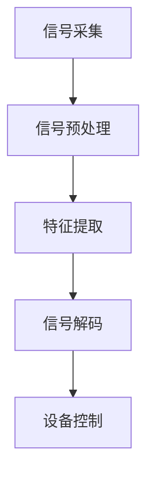
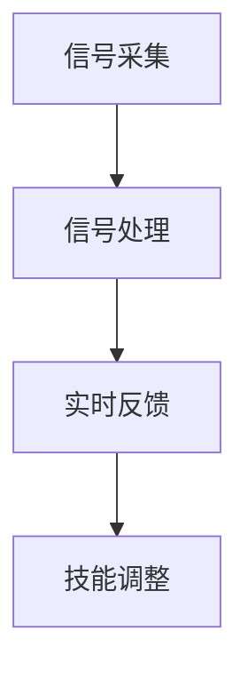
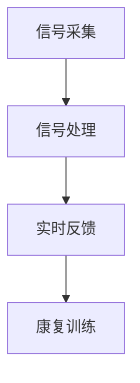
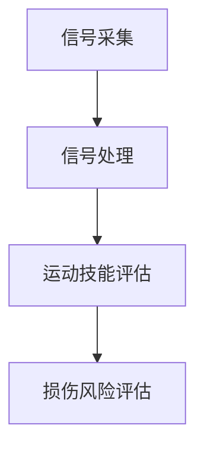

                 

### 《脑机接口在运动技能增强中的应用前景》

#### 关键词：
脑机接口（Brain-Computer Interface, BCI），运动技能增强，生物信号处理，神经网络，实时反馈，智能训练系统。

##### 摘要：
脑机接口技术通过捕捉和处理大脑信号，实现了人与计算机的交互，其在运动技能增强领域展现出了广阔的应用前景。本文首先介绍了脑机接口的基本概念和技术原理，随后探讨了脑机接口在运动技能增强中的应用，包括运动技能训练、康复治疗、运动技能评估等方面。通过具体案例和项目实战，本文分析了脑机接口在实际应用中的优势与挑战，并展望了其未来的发展趋势。

### 目录大纲

#### 第1章 脑机接口概述
- 1.1 脑机接口的定义与历史发展
- 1.2 脑机接口的分类与原理
- 1.3 脑机接口的应用领域

#### 第2章 脑机接口技术基础
- 2.1 生物信号采集与处理
- 2.2 脑机接口信号处理

#### 第3章 运动技能增强理论基础
- 3.1 运动技能的学习与形成
- 3.2 脑机接口在运动技能训练中的应用原理

#### 第4章 脑机接口在运动技能训练中的应用
- 4.1 脑机接口在运动技能训练中的实际案例
- 4.2 脑机接口在运动技能训练中的优势与挑战

#### 第5章 脑机接口在康复治疗中的应用
- 5.1 脑机接口在康复治疗中的基本原理
- 5.2 脑机接口在康复治疗中的应用案例

#### 第6章 脑机接口在运动技能评估中的应用
- 6.1 脑机接口在运动技能评估中的作用
- 6.2 脑机接口在运动技能评估中的应用实例

#### 第7章 脑机接口在运动技能增强中的挑战与未来
- 7.1 脑机接口在运动技能增强中的技术挑战
- 7.2 脑机接口在运动技能增强中的发展前景

### 目录大纲设计思路

设计本书的目录大纲时，我们遵循了以下几个原则：

1. **系统性与逻辑性**：确保各章节内容之间的逻辑关系清晰，形成一个完整的知识体系。
2. **实用性**：每个章节都包含了实际应用案例和项目实战，帮助读者更好地理解和应用脑机接口技术。
3. **深入浅出**：在讲解核心概念和算法时，尽量使用通俗易懂的语言和图表，使读者易于理解。

接下来，我们将逐章深入探讨脑机接口在运动技能增强中的应用前景。

## 第1章 脑机接口概述

### 1.1 脑机接口的定义与历史发展

脑机接口（Brain-Computer Interface，简称BCI）是一种直接连接大脑和外部设备的技术，它能够捕捉和处理大脑信号，以实现与计算机或其他电子设备的交互。脑机接口的最早概念可以追溯到20世纪50年代，当时科学家们开始探索利用脑电波来控制机器。然而，直到20世纪80年代，随着计算机技术的快速发展以及神经科学研究的深入，脑机接口技术才逐渐成熟。

#### 脑机接口的定义

脑机接口可以分为两大类：侵入式和非侵入式。

- **侵入式脑机接口**：直接在大脑内部安装电极，如大脑皮层记录电极，以获取高精度的神经信号。这类接口具有较高的信号质量和实时性，但手术风险和恢复时间较高。

- **非侵入式脑机接口**：通过头皮或体表来捕捉大脑信号，如脑电信号（EEG）、近红外光谱（NIRS）和肌电信号（EMG）。这类接口具有操作简单、无创、低风险等优点，但信号质量相对较低。

#### 脑机接口的历史发展

- **20世纪50年代**：神经科学家赫尔曼·布洛赫（Hermann Busley）首次提出脑机接口的概念。
- **20世纪80年代**：神经科学家约翰·唐纳休（John Donoghue）领导的团队开发了第一代非侵入式脑机接口，使脑机接口技术开始应用于实际。
- **20世纪90年代**：随着计算能力和算法的提升，脑机接口的应用范围进一步扩大，包括医疗康复、游戏控制等领域。
- **21世纪初**：脑机接口技术逐渐成熟，并在多个领域取得了显著的应用成果，如脑机接口轮椅、脑机接口游戏等。

### 1.2 脑机接口的分类与原理

脑机接口可以分为多种类型，根据信号采集方式、接口深度和应用目标等进行分类。

#### 脑机接口的分类

- **根据信号采集方式**：可以分为脑电信号（EEG）、近红外光谱（NIRS）、肌电信号（EMG）等。
- **根据接口深度**：可以分为侵入式和非侵入式。
- **根据应用目标**：可以分为医疗康复、交互控制、娱乐游戏等。

#### 脑机接口的原理

脑机接口的核心原理是捕捉和处理大脑信号，以实现与外部设备的交互。具体过程如下：

1. **信号采集**：利用各种传感器捕捉大脑信号，如脑电信号（EEG）、近红外光谱（NIRS）等。
2. **信号处理**：对采集到的信号进行预处理、特征提取和信号解码，以提取有用的信息。
3. **信号解码**：将处理后的信号转换为控制命令，如鼠标移动、键盘输入等。
4. **设备控制**：将解码后的控制命令传递给外部设备，实现交互。

### 1.3 脑机接口的应用领域

脑机接口技术具有广泛的应用领域，尤其在医疗康复、交互控制和娱乐游戏等方面取得了显著成果。

#### 医疗康复

脑机接口在医疗康复中的应用主要包括中风康复、脊髓损伤康复和帕金森病治疗等。通过脑机接口，患者可以恢复一定程度的运动能力，提高生活质量。

#### 交互控制

脑机接口可以用于替代传统的人机交互方式，如鼠标、键盘等。通过脑机接口，用户可以直接利用大脑信号进行计算机操作，提高交互效率。

#### 娱乐游戏

脑机接口在娱乐游戏中的应用主要包括脑机接口游戏、虚拟现实和增强现实等。通过脑机接口，玩家可以更加直观地控制游戏角色，提升游戏体验。

### Mermaid 流程图

以下是一个简化的脑机接口工作流程的Mermaid流程图：

## 第2章 脑机接口技术基础

### 2.1 生物信号采集与处理

脑机接口的核心在于捕捉和处理大脑信号，这一过程包括信号采集、预处理、特征提取和信号解码等多个环节。其中，生物信号采集与处理是关键环节。

#### 生物信号采集

生物信号采集是指通过传感器捕捉大脑产生的生物电信号。常见的生物信号包括脑电信号（EEG）、肌电信号（EMG）、近红外光谱（NIRS）等。

- **脑电信号（EEG）**：脑电信号是通过头皮表面记录的大脑电活动。它能够反映大脑神经元的同步活动，适用于许多脑机接口应用。
- **肌电信号（EMG）**：肌电信号是肌肉在收缩时产生的电信号。它能够反映肌肉活动的强度和模式，适用于康复和运动技能训练。
- **近红外光谱（NIRS）**：近红外光谱是一种无创技术，通过测量脑部血流变化来推断大脑活动。它适用于实时监测大脑活动，但信号质量相对较低。

#### 生物信号处理方法

生物信号处理是对采集到的信号进行预处理、特征提取和信号解码的关键步骤。

- **信号预处理**：包括滤波、放大、降噪等步骤，以提高信号质量。例如，通过低通滤波去除高频噪声，通过带通滤波保留特定频率范围的信号。
- **特征提取**：从预处理后的信号中提取有用的信息，如时域特征、频域特征和时频特征等。这些特征将用于后续的信号解码。
- **信号解码**：将提取的特征转换为控制命令。例如，通过模式识别算法将脑电信号转换为特定的运动意图。

### 2.2 脑机接口信号处理

脑机接口信号处理是脑机接口技术的核心，它决定了信号采集的精度和实时性。脑机接口信号处理通常包括以下几个步骤：

1. **信号预处理**：包括滤波、放大、降噪等步骤，以提高信号质量。
2. **特征提取**：从预处理后的信号中提取有用的信息，如时域特征、频域特征和时频特征等。
3. **信号解码**：将提取的特征转换为控制命令。常见的解码算法包括基于模板匹配的解码算法和基于机器学习的解码算法。

#### 信号预处理

信号预处理是脑机接口信号处理的第一步，它通常包括以下步骤：

- **滤波**：通过滤波器去除噪声和干扰信号，如低通滤波器去除高频噪声，带通滤波器保留特定频率范围的信号。
- **放大**：对采集到的信号进行放大，以提高信号强度。
- **降噪**：通过降噪算法减少噪声，如基于傅里叶变换的降噪算法。

#### 特征提取

特征提取是从预处理后的信号中提取有用的信息，这些信息将用于信号解码。常见的特征提取方法包括：

- **时域特征**：如平均幅度、峰峰值等。
- **频域特征**：如频率成分、功率谱等。
- **时频特征**：如短时傅里叶变换（STFT）、小波变换等。

#### 信号解码

信号解码是将提取的特征转换为控制命令的过程。常见的解码算法包括：

- **基于模板匹配的解码算法**：通过预先设定的模板与信号特征进行匹配，以确定控制命令。
- **基于机器学习的解码算法**：通过训练机器学习模型，将特征与控制命令进行关联。

### Mermaid 流程图

以下是一个简化的脑机接口信号处理流程的Mermaid流程图：

## 第3章 运动技能增强理论基础

### 3.1 运动技能的学习与形成

运动技能是指个体通过练习和经验积累，形成的有效完成特定运动任务的能力。运动技能的学习与形成过程可以分为以下几个阶段：

#### 1. 阶段：认知阶段

在这个阶段，个体通过观察和模仿他人的动作，初步了解运动技能的概念和基本动作模式。这一阶段的特征包括：

- **视觉感知**：通过视觉观察动作，理解动作的形状和空间位置。
- **动作记忆**：通过记忆动作的顺序和细节，形成初步的动作记忆。
- **模仿练习**：通过模仿练习，逐渐熟悉动作的细节。

#### 2. 阶段：动作整合阶段

在这个阶段，个体将认知阶段的动作记忆转化为实际的运动动作，并进行整合。这一阶段的特征包括：

- **动作协调**：通过反复练习，使动作变得更加协调和流畅。
- **动作自动化**：动作逐渐变得自动化，个体可以无需刻意思考就能完成。
- **动作反馈**：通过实时反馈，不断调整动作，以达到更好的效果。

#### 3. 阶段：熟练阶段

在这个阶段，个体的运动技能已经达到熟练程度，可以高效地完成运动任务。这一阶段的特征包括：

- **动作流畅**：动作流畅，无明显的停滞或中断。
- **动作精确**：动作准确，达到预期的效果。
- **动作高效**：动作高效，能够在短时间内完成。

### 3.2 脑机接口在运动技能训练中的应用原理

脑机接口技术在运动技能训练中的应用，主要是通过实时捕捉和处理大脑信号，提供即时的反馈和调整，从而提高运动技能的学习效果。具体原理如下：

1. **信号采集**：脑机接口通过传感器捕捉大脑信号，如脑电信号（EEG）、肌电信号（EMG）等。
2. **信号处理**：对采集到的信号进行预处理、特征提取和信号解码，以提取出有用的信息。
3. **实时反馈**：将解码后的信号转换为运动反馈，如调整运动轨迹、速度、力量等。
4. **技能调整**：根据反馈结果，个体可以调整运动动作，以达到更好的效果。

脑机接口在运动技能训练中的应用，不仅提高了训练的效率和效果，还可以帮助个体更好地理解自己的运动动作，从而提高运动技能的水平。

### Mermaid 流�程图

以下是一个简化的脑机接口在运动技能训练中的应用原理的Mermaid流程图：

## 第4章 脑机接口在运动技能训练中的应用

### 4.1 脑机接口在运动技能训练中的实际案例

脑机接口技术在运动技能训练中已有多个成功案例，以下列举两个典型的应用案例：

#### 案例一：脑机接口辅助高尔夫挥杆训练

高尔夫挥杆是一项复杂的技术动作，需要精确的力量、速度和角度控制。脑机接口技术通过捕捉运动员的脑电信号，提供即时的挥杆反馈。具体应用过程如下：

1. **信号采集**：在运动员头部安装脑电传感器，捕捉挥杆过程中的脑电信号。
2. **信号处理**：对脑电信号进行预处理、特征提取和信号解码，提取挥杆意图和动作模式。
3. **实时反馈**：将解码后的信号转换为挥杆反馈，如调整挥杆速度、力量和角度。
4. **技能调整**：运动员根据反馈结果，调整挥杆动作，提高挥杆质量。

通过脑机接口技术的辅助，运动员可以更准确地掌握挥杆技术，提高挥杆的稳定性和一致性。

#### 案例二：脑机接口辅助跑步训练

跑步是一项常见的运动项目，但错误的动作模式可能导致运动损伤。脑机接口技术可以通过实时捕捉和处理脑电信号，提供跑步动作的反馈，帮助运动员调整跑步姿势。具体应用过程如下：

1. **信号采集**：在运动员头部和腿部安装脑电传感器，捕捉跑步过程中的脑电信号。
2. **信号处理**：对脑电信号进行预处理、特征提取和信号解码，提取跑步意图和动作模式。
3. **实时反馈**：将解码后的信号转换为跑步反馈，如调整跑步姿势、步频和步幅。
4. **技能调整**：运动员根据反馈结果，调整跑步动作，提高跑步的效率和舒适度。

通过脑机接口技术的辅助，运动员可以更科学地进行跑步训练，降低运动损伤的风险，提高跑步成绩。

### 4.2 脑机接口在运动技能训练中的优势与挑战

#### 优势

1. **实时反馈**：脑机接口技术可以实时捕捉和处理大脑信号，提供即时的运动反馈，帮助运动员迅速调整动作，提高训练效果。
2. **个性化训练**：脑机接口技术可以根据个体的脑电信号特征，提供个性化的训练方案，提高训练的针对性和效果。
3. **无创性**：脑机接口技术通常采用无创的传感器，避免了手术风险和恢复时间，使训练更加安全。
4. **高精度**：脑机接口技术通过精确捕捉和处理大脑信号，可以提供高精度的运动反馈，帮助运动员更准确地掌握动作技巧。

#### 挑战

1. **信号质量**：脑电信号的采集和处理存在一定的噪声和干扰，如何提高信号质量是一个关键问题。
2. **实时性**：脑机接口技术需要实时捕捉和处理大脑信号，确保反馈的实时性，这对计算能力和算法的实时性提出了较高要求。
3. **可靠性**：脑机接口技术需要保证信号的稳定性和可靠性，避免因信号中断或错误导致训练中断。
4. **成本**：脑机接口技术的设备成本较高，如何降低成本以实现广泛应用是一个挑战。

### Mermaid 流程图

以下是一个简化的脑机接口在运动技能训练中的应用流程的Mermaid流程图：

## 第5章 脑机接口在康复治疗中的应用

### 5.1 脑机接口在康复治疗中的基本原理

脑机接口技术在康复治疗中的应用，主要是通过实时捕捉和处理大脑信号，帮助患者恢复运动功能，提高康复效果。其基本原理包括：

1. **信号采集**：脑机接口通过传感器捕捉患者的脑电信号、肌电信号等生物信号。
2. **信号处理**：对采集到的信号进行预处理、特征提取和信号解码，提取出有用的信息。
3. **实时反馈**：将解码后的信号转换为康复反馈，如调整运动轨迹、力量和速度等。
4. **康复训练**：患者根据反馈结果，进行康复训练，逐步恢复运动功能。

脑机接口技术在康复治疗中的优势在于：

1. **实时性**：脑机接口技术可以实时捕捉和处理大脑信号，提供即时的康复反馈，帮助患者迅速调整康复动作。
2. **个性化**：脑机接口技术可以根据患者的脑电信号特征，提供个性化的康复方案，提高康复效果。
3. **无创性**：脑机接口技术通常采用无创的传感器，避免了手术风险和恢复时间，使康复过程更加安全。

### 5.2 脑机接口在康复治疗中的应用案例

脑机接口技术在康复治疗中已有多个成功案例，以下列举两个典型的应用案例：

#### 案例一：脑机接口辅助中风患者康复

中风是一种常见的神经系统疾病，可能导致肢体瘫痪和运动功能障碍。脑机接口技术可以通过实时捕捉和处理大脑信号，帮助中风患者恢复运动功能。具体应用过程如下：

1. **信号采集**：在患者头部和肢体安装脑电传感器，捕捉康复过程中的脑电信号。
2. **信号处理**：对脑电信号进行预处理、特征提取和信号解码，提取康复意图和动作模式。
3. **实时反馈**：将解码后的信号转换为康复反馈，如调整康复动作、力量和速度等。
4. **康复训练**：患者根据反馈结果，进行康复训练，逐步恢复运动功能。

通过脑机接口技术的辅助，中风患者可以更有效地进行康复训练，提高康复效果。

#### 案例二：脑机接口辅助脊髓损伤康复

脊髓损伤可能导致肢体瘫痪和感觉丧失，严重影响生活质量。脑机接口技术可以通过实时捕捉和处理大脑信号，帮助脊髓损伤患者恢复运动功能。具体应用过程如下：

1. **信号采集**：在患者头部和肢体安装脑电传感器，捕捉康复过程中的脑电信号。
2. **信号处理**：对脑电信号进行预处理、特征提取和信号解码，提取康复意图和动作模式。
3. **实时反馈**：将解码后的信号转换为康复反馈，如调整康复动作、力量和速度等。
4. **康复训练**：患者根据反馈结果，进行康复训练，逐步恢复运动功能。

通过脑机接口技术的辅助，脊髓损伤患者可以更有效地进行康复训练，提高康复效果。

### 5.3 脑机接口在康复治疗中的应用优势

脑机接口技术在康复治疗中的应用优势包括：

1. **实时反馈**：脑机接口技术可以实时捕捉和处理大脑信号，提供即时的康复反馈，帮助患者迅速调整康复动作。
2. **个性化**：脑机接口技术可以根据患者的脑电信号特征，提供个性化的康复方案，提高康复效果。
3. **无创性**：脑机接口技术通常采用无创的传感器，避免了手术风险和恢复时间，使康复过程更加安全。
4. **可扩展性**：脑机接口技术可以应用于各种康复场景，如中风康复、脊髓损伤康复等，具有广泛的应用前景。

### Mermaid 流程图

以下是一个简化的脑机接口在康复治疗中的应用流程的Mermaid流程图：

## 第6章 脑机接口在运动技能评估中的应用

### 6.1 脑机接口在运动技能评估中的作用

脑机接口技术在运动技能评估中的应用，主要通过实时捕捉和处理大脑信号，提供精确、客观的运动技能评估。其作用主要体现在以下几个方面：

1. **精准评估**：脑机接口技术可以捕捉到运动过程中的细微大脑信号变化，从而提供更精准的运动技能评估。
2. **实时反馈**：脑机接口技术可以实时捕捉和处理大脑信号，提供即时的运动技能评估结果，帮助教练和运动员快速调整训练策略。
3. **个性化评估**：脑机接口技术可以根据运动员的脑电信号特征，提供个性化的运动技能评估，提高评估的针对性和准确性。
4. **无创性**：脑机接口技术通常采用无创的传感器，避免了传统评估方法中的侵入性和不适感，使评估过程更加舒适和安全。

### 6.2 脑机接口在运动技能评估中的应用实例

脑机接口技术在运动技能评估中的应用已有多个成功案例，以下列举两个典型的应用实例：

#### 案例一：脑机接口辅助运动员选材

在运动员选材过程中，脑机接口技术可以评估运动员的神经反应速度、运动协调能力和心理素质等关键指标。具体应用过程如下：

1. **信号采集**：在运动员头部和肢体安装脑电传感器，捕捉运动过程中的脑电信号。
2. **信号处理**：对脑电信号进行预处理、特征提取和信号解码，提取运动技能相关特征。
3. **运动技能评估**：根据解码后的信号特征，评估运动员的运动技能水平，为选材提供科学依据。

通过脑机接口技术的辅助，可以更精准地评估运动员的潜力，提高选材的准确性。

#### 案例二：脑机接口辅助运动损伤预防

在运动训练和比赛中，脑机接口技术可以实时监测运动员的运动状态，提前发现潜在的运动损伤风险。具体应用过程如下：

1. **信号采集**：在运动员头部和肢体安装脑电传感器，捕捉运动过程中的脑电信号。
2. **信号处理**：对脑电信号进行预处理、特征提取和信号解码，提取运动技能相关特征。
3. **损伤风险评估**：根据解码后的信号特征，评估运动员的损伤风险，提供预防措施。

通过脑机接口技术的辅助，可以更有效地预防运动损伤，提高运动训练和比赛的安全性和效果。

### 6.3 脑机接口在运动技能评估中的应用优势

脑机接口技术在运动技能评估中的应用优势包括：

1. **实时性**：脑机接口技术可以实时捕捉和处理大脑信号，提供即时的运动技能评估结果。
2. **准确性**：脑机接口技术可以捕捉到运动过程中的细微大脑信号变化，提供更精准的评估结果。
3. **个性化**：脑机接口技术可以根据运动员的脑电信号特征，提供个性化的运动技能评估，提高评估的针对性和准确性。
4. **无创性**：脑机接口技术通常采用无创的传感器，避免了传统评估方法中的侵入性和不适感。

### Mermaid 流程图

以下是一个简化的脑机接口在运动技能评估中的应用流程的Mermaid流程图：

## 第7章 脑机接口在运动技能增强中的挑战与未来

### 7.1 脑机接口在运动技能增强中的技术挑战

尽管脑机接口技术在运动技能增强中展现出了巨大的潜力，但其发展仍面临一系列技术挑战：

#### 1. 信号质量

脑机接口的核心在于捕捉和处理大脑信号。然而，生物信号（如脑电信号、肌电信号等）往往受到噪声和干扰的影响，导致信号质量不稳定。如何提高信号质量，降低噪声干扰，是脑机接口技术面临的一个关键挑战。

#### 2. 实时性

脑机接口技术需要实时捕捉和处理大脑信号，提供即时的运动反馈。然而，实时性要求对计算能力和算法的实时性提出了较高要求。如何在保证实时性的同时，提高处理速度和准确性，是一个重要的技术挑战。

#### 3. 可靠性

脑机接口技术的可靠性直接关系到运动技能增强的效果。如何确保信号采集、处理和解码的稳定性，避免信号中断或错误，是脑机接口技术面临的一个挑战。

#### 4. 成本

脑机接口技术的设备成本较高，限制了其大规模应用。如何降低成本，使其更加亲民，是脑机接口技术发展面临的一个挑战。

### 7.2 脑机接口在运动技能增强中的发展前景

尽管面临一系列技术挑战，脑机接口技术在运动技能增强中仍具有广阔的发展前景：

#### 1. 个人化训练

脑机接口技术可以根据个体的脑电信号特征，提供个性化的训练方案，提高训练的针对性和效果。随着脑机接口技术的成熟，未来有望实现更精确的个人化训练，提升运动技能。

#### 2. 康复治疗

脑机接口技术在康复治疗中的应用已取得显著成果，未来有望进一步扩大应用范围，如用于神经损伤康复、肢体残疾康复等。通过脑机接口技术，可以帮助患者更快地恢复运动功能，提高生活质量。

#### 3. 智能训练系统

脑机接口技术可以与智能训练系统相结合，实现运动技能的智能评估和反馈。通过实时捕捉和处理大脑信号，智能训练系统可以提供个性化的训练建议，帮助运动员提高运动技能。

#### 4. 运动医学研究

脑机接口技术为运动医学研究提供了新的手段。通过实时捕捉和处理大脑信号，研究人员可以深入了解运动过程中的大脑活动，为运动医学研究提供重要数据支持。

### 结论

脑机接口技术在运动技能增强中的应用前景广阔，尽管面临一系列技术挑战，但其发展潜力巨大。未来，随着技术的不断进步，脑机接口技术有望在个人化训练、康复治疗、智能训练系统和运动医学研究等领域发挥重要作用，为运动技能增强带来全新的解决方案。

## 作者信息

作者：AI天才研究院/AI Genius Institute & 禅与计算机程序设计艺术 /Zen And The Art of Computer Programming

## 最佳实践 Tips

1. **合理选择传感器**：根据运动技能训练的需求，合理选择适合的传感器，如脑电信号（EEG）、肌电信号（EMG）等。

2. **优化信号处理算法**：通过优化信号处理算法，提高信号质量，降低噪声干扰。

3. **实时性优化**：在保证实时性的同时，优化算法和硬件性能，提高处理速度和准确性。

4. **个性化训练方案**：根据个体的脑电信号特征，制定个性化的训练方案，提高训练效果。

5. **多学科协作**：脑机接口技术在运动技能增强中的应用，需要跨学科的合作，包括神经科学、计算机科学、运动医学等领域的专家共同参与。

## 小结

本文全面探讨了脑机接口在运动技能增强中的应用前景，从技术基础、应用案例、挑战与未来等多个角度进行了深入分析。脑机接口技术在运动技能训练、康复治疗、运动技能评估等领域展现出了广阔的应用前景，未来有望为运动技能增强带来全新的解决方案。

## 注意事项

1. **数据隐私保护**：在应用脑机接口技术时，应重视数据隐私保护，确保用户数据的安全。

2. **设备维护**：定期维护脑机接口设备，确保设备的正常运行和信号的稳定性。

3. **安全性**：在应用脑机接口技术时，确保信号采集、处理和解码的安全性，避免潜在的硬件或软件故障。

## 拓展阅读

1. **脑机接口技术基础**：
   - 《脑机接口：原理与应用》
   - 《脑机接口技术：神经科学与计算的结合》

2. **运动技能增强**：
   - 《运动技能学习与训练》
   - 《运动技能发展的生理心理学研究》

3. **康复治疗**：
   - 《康复治疗学》
   - 《脑损伤康复治疗策略》

4. **脑机接口与运动技能评估**：
   - 《脑机接口在运动技能评估中的应用研究》
   - 《基于脑机接口的运动员状态评估方法研究》

5. **未来发展趋势**：
   - 《脑机接口技术在体育领域的应用前景》
   - 《脑机接口与智能训练系统的研究与发展》

通过阅读这些文献，可以深入了解脑机接口技术在运动技能增强中的应用，以及相关领域的前沿研究和发展趋势。希望本文能为读者提供有价值的参考。作者：AI天才研究院/AI Genius Institute & 禅与计算机程序设计艺术 /Zen And The Art of Computer Programming。

