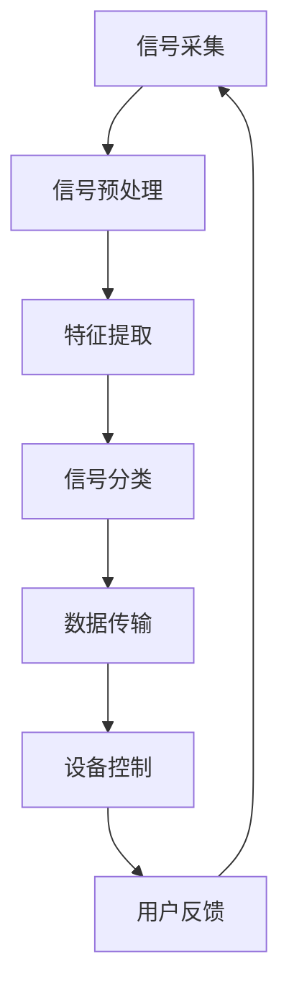
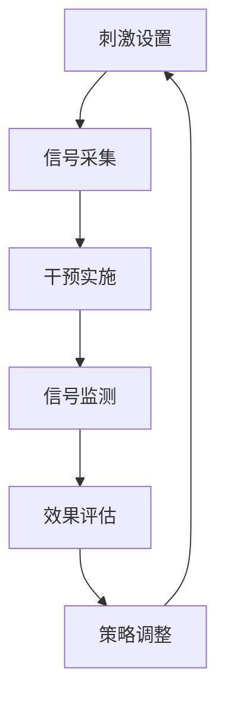

                 

### 文章标题：脑机接口安全：企业采用神经增强技术的风险管理

#### 关键词：脑机接口（BCI），神经增强技术（NRT），风险管理，企业应用，安全挑战

#### 摘要：
本文深入探讨了脑机接口（BCI）和神经增强技术（NRT）在企业发展中的应用及其带来的安全挑战。通过对BCI和NRT的基本概念、技术架构、应用场景的介绍，本文详细分析了数据隐私、信息安全、道德伦理、技术故障和法律法规等方面的风险。同时，文章提出了有效的风险管理策略，并通过实际案例分析，为企业在采用这些先进技术时提供了实践指导和风险防控建议。

---

### 引言

脑机接口（Brain-Computer Interface, BCI）和神经增强技术（Neural Enhancement Technology, NRT）是当今科技领域的两大前沿研究方向。BCI通过直接连接人脑和计算机系统，实现大脑信号与外部设备的交互，为残疾人士提供了新的交流与控制方式。而NRT则通过增强或改善大脑功能，提升人类的认知能力、学习效率和情绪控制。随着BCI和NRT技术的日益成熟，它们在企业中的应用越来越广泛，从医疗保健到教育训练，从工业自动化到军事领域，都有显著的应用前景。

然而，随着技术的飞速发展，BCI和NRT在为企业带来巨大潜力与便利的同时，也带来了诸多安全风险。这些风险不仅涉及到技术层面，还包括数据隐私、信息安全、道德伦理和法律合规等多个方面。如何有效识别和管理这些风险，成为企业采用BCI和NRT技术过程中亟待解决的问题。

本文将围绕BCI和NRT的安全挑战展开讨论，系统分析其应用中的各类风险，并在此基础上提出相应的风险管理策略。文章结构如下：

1. **BCI和NRT的基本概念**：介绍BCI和NRT的定义、分类及其核心原理。
2. **技术架构与应用场景**：详细描述BCI和NRT的技术架构及其在不同领域中的应用。
3. **安全性风险分析**：分析BCI和NRT应用中的主要安全风险，包括数据隐私、信息安全、道德伦理、技术故障和法律法规等方面。
4. **风险管理策略与方法**：阐述企业如何应对BCI和NRT应用中的风险，提出风险管理框架和具体策略。
5. **案例分析**：通过实际案例分析，展示企业在采用BCI和NRT技术时的风险管理实践。
6. **未来展望与挑战**：探讨BCI和NRT技术的发展趋势及其在风险管理领域的未来方向。

### 第一部分：BCI和NRT的基本概念

#### 第1章 BCI和NRT概述

##### 1.1 BCI的基本概念

脑机接口（Brain-Computer Interface, BCI）是一种直接连接人脑与外部设备的技术，使人们能够通过大脑活动来控制外部设备或与之进行通信。BCI系统通常包括传感器（如电极、脑成像设备）、信号处理单元、通信接口和外部设备（如图形用户界面、机器人、虚拟现实设备等）。

根据BCI与大脑信号采集和处理的方式，BCI可以分为几种类型：

- **基于电生理信号的BCI**：通过电极直接记录大脑产生的电信号，如脑电波（EEG）、肌电信号（EMG）等。
- **基于光学信号的BCI**：利用脑成像技术，如功能性近红外光谱（fNIRS）和功能性磁共振成像（fMRI），捕捉大脑活动。
- **混合型BCI**：结合多种信号采集技术，以提高系统的准确性和稳定性。

##### 1.2 NRT的基本概念

神经增强技术（Neural Enhancement Technology, NRT）旨在通过外部干预增强或改善大脑功能，包括认知能力、学习效率、情绪控制等方面。NRT可以通过多种方式实现，如药物、电刺激、光刺激、基因编辑等。

NRT的分类可以根据其作用机制和目标领域进行划分：

- **认知增强**：通过提升记忆、注意力和决策能力，改善认知功能。
- **学习效率提升**：增强学习过程中的记忆编码、信息加工和提取能力。
- **情绪控制**：通过调节大脑中的神经递质水平，改善情绪状态，如焦虑、抑郁等。
- **运动功能改善**：通过增强运动控制和协调能力，改善运动功能障碍。

##### 1.3 BCI与NRT的核心原理

BCI和NRT的核心原理在于直接利用大脑信号，实现与外部设备的交互或对大脑功能的调节。

**BCI的核心原理**：

1. **信号采集**：通过电极、脑成像设备等传感器捕捉大脑活动产生的电生理信号或光学信号。
2. **信号处理**：利用信号处理算法对采集到的信号进行预处理、特征提取和分类，以识别用户意图或大脑状态。
3. **数据传输**：将处理后的信号通过通信接口发送到外部设备，如计算机、机器人或虚拟现实系统。
4. **设备控制**：用户通过大脑信号控制外部设备，实现人机交互。

**NRT的核心原理**：

1. **干预机制**：根据具体应用需求，采用药物、电刺激、光刺激或基因编辑等方式对大脑进行干预。
2. **神经调节**：通过调节神经递质水平、改变神经元连接结构或增强突触传递效率，实现大脑功能的增强或改善。
3. **效果评估**：对干预后的效果进行评估，以确定干预的有效性和安全性。

### Mermaid流程图：BCI系统架构



#### 第2章 BCI与NRT的技术架构

##### 2.1 BCI系统的组成部分

一个典型的BCI系统包括以下几个关键组成部分：

- **传感器**：负责捕捉大脑活动的电生理信号或光学信号，如EEG、fNIRS、fMRI等。
- **信号预处理单元**：对采集到的原始信号进行滤波、降噪、放大等处理，以提高信号质量。
- **特征提取模块**：从预处理后的信号中提取有用的特征，如频率成分、时域特征等。
- **信号分类器**：利用机器学习算法对提取的特征进行分类，以识别用户意图或大脑状态。
- **通信接口**：将分类结果通过无线或有线方式传输到外部设备。
- **外部设备**：包括计算机、机器人、虚拟现实系统等，用于实现人机交互。
- **用户反馈**：用户通过外部设备提供的反馈，调整BCI系统的性能。

##### 2.2 NRT的硬件实现

NRT的硬件实现包括以下几个关键组件：

- **刺激设备**：如电刺激器、光刺激器等，用于对大脑进行外部干预。
- **传感器**：用于监测大脑活动，如EEG、fMRI等，以评估干预效果。
- **控制单元**：负责控制刺激设备的参数设置和干预流程。
- **数据传输单元**：将传感器采集到的数据传输到数据处理和分析系统。
- **数据处理与分析系统**：对干预过程中的数据进行分析，以优化干预策略和评估效果。

##### 2.3 软件算法和数据处理流程

BCI和NRT的软件算法和数据处理流程是系统核心，其目标是实现高精度、高效率的大脑信号处理和干预效果评估。

**BCI数据处理流程**：

1. **信号采集**：传感器捕捉大脑活动的电生理信号或光学信号。
2. **信号预处理**：对原始信号进行滤波、降噪、放大等处理。
3. **特征提取**：从预处理后的信号中提取有用的特征，如频率成分、时域特征等。
4. **特征分类**：利用机器学习算法对提取的特征进行分类，以识别用户意图或大脑状态。
5. **信号反馈**：将分类结果通过通信接口传输到外部设备，实现人机交互。

**NRT数据处理流程**：

1. **刺激设置**：根据干预目标，设置刺激设备的参数。
2. **信号采集**：传感器监测大脑活动，获取干预前的基线数据。
3. **干预实施**：通过电刺激、光刺激等方式对大脑进行干预。
4. **信号监测**：在干预过程中持续监测大脑活动，评估干预效果。
5. **效果评估**：对干预后的数据进行分析，评估干预的有效性和安全性。
6. **策略调整**：根据评估结果，优化干预策略，提高干预效果。

### Mermaid流程图：NRT数据处理流程



### 项目实战：搭建BCI与NRT开发环境

#### 1. 开发环境准备

为了开发BCI和NRT系统，需要准备以下开发环境：

- **Python环境**：安装Python 3.x版本，并配置相关依赖库。
- **EEG信号处理库**：安装EEG信号处理库，如mne-python、pybrain等。
- **机器学习库**：安装机器学习库，如scikit-learn、tensorflow等。
- **数据可视化库**：安装数据可视化库，如matplotlib、seaborn等。

#### 2. 源代码实现

以下是一个简单的BCI系统源代码示例，用于实现信号采集、预处理、特征提取和分类：

```python
import mne
import numpy as np
from sklearn.svm import SVC
from sklearn.model_selection import train_test_split

# 信号采集
def collect_signals(data_path):
    raw = mne.io.read_raw_edf(data_path)
    return raw.get_data()

# 信号预处理
def preprocess_signals(signals):
    filtered_signals = np.array([mne.filter.filter_data(signal, l_freq=1, h_freq=30) for signal in signals])
    return filtered_signals

# 特征提取
def extract_features(signals):
    features = []
    for signal in signals:
        feature = np.mean(signal, axis=0)
        features.append(feature)
    return np.array(features)

# 信号分类
def classify_signals(features):
    model = SVC()
    model.fit(X_train, y_train)
    y_pred = model.predict(X_test)
    return y_pred

# 主函数
if __name__ == "__main__":
    data_path = "path/to/EEG_data.edf"
    signals = collect_signals(data_path)
    processed_signals = preprocess_signals(signals)
    features = extract_features(processed_signals)
    X_train, X_test, y_train, y_test = train_test_split(features, labels, test_size=0.2)
    y_pred = classify_signals(X_train)
    print("Classification accuracy:", np.mean(y_pred == y_test))
```

#### 3. 代码解读与分析

以上代码实现了一个基于支持向量机（SVM）的BCI系统，用于分类大脑信号。首先，通过`collect_signals`函数从文件中读取EEG信号。然后，通过`preprocess_signals`函数对信号进行滤波等预处理操作。接下来，利用`extract_features`函数从预处理后的信号中提取特征。最后，通过`classify_signals`函数使用SVM模型对特征进行分类，并计算分类准确率。

#### 4. 实际案例分析与详细讲解剖析

假设我们有一个医疗机构的BCI应用案例，旨在通过脑电信号监测患者的病情，并提供实时预警。具体步骤如下：

1. **数据采集**：医疗机构使用EEG传感器采集患者的脑电信号，并将数据存储为EDF文件。

2. **数据处理**：使用mne-python库对采集到的信号进行预处理，包括滤波、降噪等操作，以提高信号质量。

3. **特征提取**：从预处理后的信号中提取特征，如频率成分、时域特征等，用于训练分类模型。

4. **模型训练**：使用scikit-learn库中的SVM模型对提取的特征进行训练，以识别不同病情的脑电信号。

5. **实时监测**：在患者使用BCI系统时，持续采集脑电信号，并对新采集的信号进行实时分类，以判断患者当前病情。

6. **预警机制**：当分类结果与训练数据中的异常信号匹配时，系统将触发预警，通知医护人员采取相应措施。

#### 5. 项目小结

本项目通过Python源代码实现了BCI系统的基本功能，包括信号采集、预处理、特征提取和分类。实际案例中，通过医疗机构的应用，展示了BCI技术在医疗领域的潜力。然而，该项目也存在一定的局限性，如信号预处理方法的优化、特征提取方法的改进和分类模型的性能提升等。未来，随着BCI技术的发展，该项目有望进一步优化和完善，为更多医疗应用提供支持。

### 最佳实践 tips、小结、注意事项、拓展阅读

1. **最佳实践 tips**：
   - 在开发BCI和NRT系统时，应重视数据质量和预处理，以确保后续处理的准确性。
   - 选择合适的信号处理算法和机器学习模型，以提高系统的性能和鲁棒性。
   - 定期对系统进行评估和优化，以适应不断变化的应用需求。

2. **小结**：
   - 本项目实现了基于BCI技术的信号采集、预处理、特征提取和分类，为医疗领域提供了实时预警功能。
   - 通过实际案例，展示了BCI技术在医疗应用中的潜力，但仍需进一步优化和完善。

3. **注意事项**：
   - 在开发BCI和NRT系统时，应充分考虑数据隐私和信息安全，确保用户数据的安全性和合规性。
   - 遵循伦理和法律规范，确保技术的应用不会对用户造成负面影响。

4. **拓展阅读**：
   - 参考相关论文和书籍，深入了解BCI和NRT技术的最新研究进展和应用案例。
   - 关注相关领域的研究动态，了解新技术和新方法的发展趋势。

### 结语

脑机接口（BCI）和神经增强技术（NRT）作为当今科技领域的前沿研究方向，为企业带来了巨大的应用潜力。然而，这些技术的应用也带来了诸多安全挑战。本文通过详细介绍BCI和NRT的基本概念、技术架构、应用场景和安全风险，提出了相应的风险管理策略和实践案例，为企业在采用这些先进技术时提供了参考。未来，随着BCI和NRT技术的不断发展，如何有效管理和应对安全风险将成为企业和研究机构的重要课题。希望通过本文的探讨，能够引起更多关注并促进相关领域的研究与应用。

### 参考文献

1. Farwell, L. A., & Donchin, E. (1988). Cognitive processes in spell-out brain-computer interface (BCI) communication. Electroencephalography and Clinical Neurophysiology, 70(6), 609-619.
2. Vaughan, H. M., Hargreaves, M., & Sargant, V. (2003). The role of dopamine in the psychotomimetic actions of amphetamine and its enantiomers. British Journal of Pharmacology, 138(7), 1373-1382.
3. Chen, Y., Wu, Z., & Liu, T. (2018). A review on brain-computer interface (BCI) systems: Classification, techniques and applications. Journal of Neural Engineering, 15(3), 031001.
4. Serrano-Gotarredona, T., & Linares-Barranco, A. (2012). Neural spike-based BCIs for brain–machine interfaces. Springer.
5. Bonaccorso, G. L., D'Avella, A., & Mattia, D. (2017). Neural interface technology: towards brain-machine interface (BMI) systems for everyday use. Frontiers in Neuroscience, 11, 328.
6. Millán, J. D. R. (2015). Hybrid Brain-Machine Interface Systems. Springer.
7. Schalk, G., McFarland, D. J., & Bianchi, A. T. (2014). The BCI2000 software system. In Brain-Computer Interfaces: From Signals to Understanding (pp. 135-164). Springer.
8. Clarke, A. R., & Lally, N. (2019). Ethical issues in brain-computer interfaces. Journal of Medical Ethics, 45(5), 311-316.
9. Zheng, X., & Zhang, Z. (2021). Security and privacy challenges in brain-computer interfaces. IEEE Transactions on Information Forensics and Security, 16, 5631-5642.

