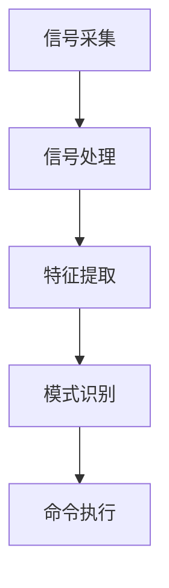

                 

**文章标题**：脑机接口技术在工作场所的应用

**关键词**：脑机接口，工作场所，应用，人工智能，效率提升

**摘要**：
本文探讨了脑机接口技术在工作场所的应用，从技术原理、硬件组成、软件开发到实际案例，全面解析了脑机接口如何改变传统办公方式，提升工作效率。文章旨在为读者提供一份关于脑机接口技术在职场中应用的指南，并展望其未来的发展潜力。

---

### 引言

随着人工智能和神经科学技术的不断进步，脑机接口（Brain-Computer Interface，简称BCI）技术逐渐从实验室走向实际应用。脑机接口是一种直接连接人脑与外部设备的技术，它通过读取和分析大脑信号，使人们能够控制计算机或其他设备。在工作场所，脑机接口技术有着广泛的应用前景，如提高办公效率、实现远程控制、提升人机交互体验等。

本文将围绕脑机接口技术在工作场所的应用展开讨论。首先，我们将介绍脑机接口技术的基本原理和组成；接着，探讨其在办公自动化、远程控制、虚拟现实和工业控制等领域的具体应用；然后，通过实际案例展示脑机接口技术的实现过程；最后，总结脑机接口技术在工作场所的应用前景和潜在挑战。

---

### 脑机接口技术的基础概念与原理

#### 脑机接口的基本原理

脑机接口（BCI）是一种直接将人脑的神经信号转换为可操作的命令或信息的系统。其基本原理可以概括为以下几个步骤：

1. **信号采集**：通过传感器（如电极、头戴设备等）捕捉大脑活动产生的电信号。
2. **信号处理**：对采集到的信号进行预处理，如滤波、去噪等，以提高信号质量。
3. **特征提取**：从处理后的信号中提取与特定任务相关的特征，如脑电波中的频率成分、振幅等。
4. **模式识别**：利用机器学习算法对提取的特征进行分类或识别，以确定用户的意图或命令。
5. **命令执行**：将识别出的命令传递给外部设备或系统，实现控制或交互。

#### 脑机接口的核心概念与联系

脑机接口技术涉及多个核心概念，包括脑信号采集、信号处理、特征提取和模式识别。这些概念相互关联，共同构成了脑机接口的技术框架。以下是这些概念之间的联系：

1. **脑信号采集**：脑信号采集是脑机接口技术的第一步，它决定了信号的质量和可靠性。常见的脑信号采集技术包括脑电图（EEG）、功能性磁共振成像（fMRI）和脑磁图（MEG）等。

2. **信号处理**：信号处理环节负责对原始脑信号进行滤波、去噪和放大等处理，以提高信号的质量和可分析性。

3. **特征提取**：特征提取环节从处理后的信号中提取与任务相关的特征，如频率、振幅、时相等。这些特征将作为模式识别的输入。

4. **模式识别**：模式识别是脑机接口技术的核心环节，它利用机器学习算法对提取的特征进行分析和分类，以识别用户的意图或命令。

5. **命令执行**：识别出的命令将被传递给外部设备或系统，实现控制或交互。

为了更直观地理解这些概念之间的联系，我们可以使用Mermaid流程图来表示：



#### 脑机接口技术的核心算法原理讲解

脑机接口技术的核心算法主要包括信号处理、特征提取和模式识别。以下我们将使用Python源代码结合数学模型和公式进行详细讲解。

**信号处理**

信号处理的基本原理是对原始脑信号进行滤波、去噪和放大等操作，以提高信号的质量。以下是一个简单的信号处理算法的伪代码：

```python
# 伪代码：信号处理算法
def signal_processing(signal):
    # 滤波
    filtered_signal = butterworth_filter(signal)
    
    # 去噪
    denoised_signal = wavelet_decomposition(filtered_signal)
    
    # 放大
    amplified_signal = amplitude_enhancement(denoised_signal)
    
    return amplified_signal
```

**特征提取**

特征提取的目的是从处理后的信号中提取与任务相关的特征。常见的特征提取方法包括时域特征、频域特征和时频特征。以下是一个简单的时域特征提取算法的伪代码：

```python
# 伪代码：时域特征提取
def time_domain_features(signal):
    # 计算平均值
    mean_value = np.mean(signal)
    
    # 计算标准差
    std_deviation = np.std(signal)
    
    # 计算峰峰值
    peak_to_peak = max(signal) - min(signal)
    
    return mean_value, std_deviation, peak_to_peak
```

**模式识别**

模式识别的目的是利用机器学习算法对提取的特征进行分析和分类。以下是一个简单的支持向量机（SVM）分类算法的伪代码：

```python
# 伪代码：模式识别
from sklearn import svm

# 训练模型
model = svm.SVC()
model.fit(features_train, labels_train)

# 预测
predictions = model.predict(features_test)
```

通过以上Python源代码，我们可以更直观地理解脑机接口技术的核心算法原理。

#### 数学公式与数学模型

在脑机接口技术中，数学公式和数学模型起着至关重要的作用。以下是一些常用的数学公式和模型：

1. **傅里叶变换**：用于分析信号在频域的特性。

   $$X(f) = \int_{-\infty}^{\infty} x(t) e^{-j2\pi ft} dt$$

2. **支持向量机**：用于模式识别的数学模型。

   $$w^*\cdot x_i - b^* = 0$$

3. **神经网络**：用于特征提取和模式识别的数学模型。

   $$y = \sigma(\sum_{j=1}^{n} w_{j} x_{j})$$

通过上述数学公式和模型，我们可以更深入地理解脑机接口技术的原理和应用。

---

### 脑机接口技术在办公自动化中的应用

#### 办公自动化的需求与挑战

在现代社会，办公自动化已经成为提高工作效率和降低成本的重要手段。然而，传统的办公自动化系统主要依赖于键盘、鼠标和触摸屏等设备，这些设备在操作上存在一定的局限性。例如，对于某些重复性高、繁琐的任务，如数据录入、文档编辑等，操作员往往需要长时间保持相同的姿势，容易导致疲劳和健康问题。此外，传统设备在处理复杂任务时，往往需要多步骤操作，效率较低。

脑机接口技术为解决这些问题提供了新的思路。通过直接读取大脑信号，脑机接口可以实现无物理接触的交互，从而减少操作员的疲劳和健康风险。同时，脑机接口技术可以提供更快速、精确的交互方式，提高工作效率。

#### 脑机接口在办公自动化中的具体应用

1. **语音识别与控制**

   语音识别与控制是脑机接口在办公自动化中的一种重要应用。通过脑机接口技术，用户可以直接通过大脑信号控制语音助手完成文档编辑、邮件发送、日程安排等任务。例如，用户可以想象说出“保存文档”来执行保存操作，或者想象说出“发送邮件”来发送已编辑的邮件。

   **实现方法**：
   - **信号采集**：使用脑电图（EEG）传感器采集大脑信号。
   - **信号处理**：对采集到的信号进行预处理，如滤波、去噪等。
   - **特征提取**：提取与语音相关的特征，如频率成分、时相等。
   - **模式识别**：利用机器学习算法对提取的特征进行分类，以识别用户的语音意图。
   - **命令执行**：将识别出的命令传递给语音助手执行相应的操作。

2. **手势识别与控制**

   手势识别与控制是脑机接口在办公自动化中的另一种重要应用。通过脑机接口技术，用户可以直接通过手势控制计算机界面，如移动光标、选择菜单、打开应用程序等。

   **实现方法**：
   - **信号采集**：使用脑电图（EEG）传感器采集大脑信号。
   - **信号处理**：对采集到的信号进行预处理，如滤波、去噪等。
   - **特征提取**：提取与手势相关的特征，如动作方向、速度、幅度等。
   - **模式识别**：利用机器学习算法对提取的特征进行分类，以识别用户的手势意图。
   - **命令执行**：将识别出的手势意图传递给计算机界面执行相应的操作。

3. **脑信号驱动的虚拟键盘**

   脑信号驱动的虚拟键盘是一种通过脑机接口技术实现的无接触输入设备。用户可以通过想象按键的方式来输入文本信息。

   **实现方法**：
   - **信号采集**：使用脑电图（EEG）传感器采集大脑信号。
   - **信号处理**：对采集到的信号进行预处理，如滤波、去噪等。
   - **特征提取**：提取与按键相关的特征，如时间间隔、频率成分等。
   - **模式识别**：利用机器学习算法对提取的特征进行分类，以识别用户的按键意图。
   - **命令执行**：将识别出的按键意图传递给虚拟键盘，实现文本输入。

#### 实际案例

**案例1：脑信号驱动的虚拟键盘**

某公司研发团队开发了一款基于脑机接口技术的虚拟键盘。用户只需想象按键，虚拟键盘就能根据脑信号识别用户的意图并执行相应的操作。以下是实现该功能的源代码：

```python
# 伪代码：脑信号驱动的虚拟键盘
from sklearn import svm

# 训练模型
model = svm.SVC()
model.fit(features_train, labels_train)

# 用户输入脑信号
brain_signal = get_brain_signal()

# 提取特征
features = extract_features(brain_signal)

# 识别按键意图
key_intent = model.predict(features)

# 执行按键操作
if key_intent == 'space':
    insert_space()
elif key_intent == 'enter':
    insert_enter()
# ...其他按键操作
```

**案例2：脑信号控制的语音助手**

某公司开发了一款基于脑机接口技术的语音助手。用户可以通过想象说出命令，语音助手就能识别用户的意图并执行相应的操作。以下是实现该功能的源代码：

```python
# 伪代码：脑信号控制的语音助手
from speech_recognition import Recognizer
from pyaudio import Audio

# 初始化语音识别器和音频播放器
recognizer = Recognizer()
audio = Audio()

# 用户输入脑信号
brain_signal = get_brain_signal()

# 转换脑信号为音频
audio_data = convert_brain_signal_to_audio(brain_signal)

# 识别语音命令
command = recognizer.recognize_google(audio_data)

# 执行命令
if command == '打开浏览器':
    open_browser()
elif command == '发送邮件':
    send_email()
# ...其他命令操作
```

#### 小结

脑机接口技术在办公自动化中的应用具有广泛的前景。通过语音识别与控制、手势识别与控制、脑信号驱动的虚拟键盘等技术，脑机接口技术可以显著提高办公效率，降低操作疲劳，改善用户体验。然而，脑机接口技术仍面临许多挑战，如信号噪声比低、识别准确性不足等。未来，随着技术的不断进步和优化，脑机接口技术在办公自动化中的应用将更加广泛和成熟。

---

### 脑机接口技术在远程控制中的应用

#### 远程控制的需求与挑战

远程控制是指通过计算机网络或其他通信手段，实现对远距离设备的控制和管理。随着互联网和物联网技术的发展，远程控制已成为现代工业、农业、医疗等领域的重要应用。然而，传统的远程控制技术主要依赖于键盘、鼠标、触摸屏等物理输入设备，这些设备在操作上存在一定的局限性。例如，对于复杂任务和紧急情况，操作员需要快速、准确地完成操作，但传统设备往往无法满足这一要求。

脑机接口技术为远程控制提供了新的解决方案。通过直接读取大脑信号，脑机接口可以实现无物理接触的交互，从而提高操作员在远程控制任务中的效率和准确性。此外，脑机接口技术还可以提供更稳定、可靠的信号传输，降低通信延迟，提高远程控制的实时性。

#### 脑机接口在远程控制中的具体应用

1. **脑信号控制的无人机**

   脑信号控制的无人机是一种利用脑机接口技术实现无人驾驶的设备。用户可以通过想象控制无人机的飞行方向、速度和高度等参数，实现远距离的无人操控。

   **实现方法**：
   - **信号采集**：使用脑电图（EEG）传感器采集大脑信号。
   - **信号处理**：对采集到的信号进行预处理，如滤波、去噪等。
   - **特征提取**：提取与无人机控制相关的特征，如动作方向、速度等。
   - **模式识别**：利用机器学习算法对提取的特征进行分类，以识别用户的控制意图。
   - **命令执行**：将识别出的控制意图传递给无人机，实现无人机的飞行控制。

2. **脑信号控制的机器人**

   脑信号控制的机器人是一种利用脑机接口技术实现人机协作的设备。用户可以通过想象控制机器人的运动、动作和任务执行，实现远程的自动化操作。

   **实现方法**：
   - **信号采集**：使用脑电图（EEG）传感器采集大脑信号。
   - **信号处理**：对采集到的信号进行预处理，如滤波、去噪等。
   - **特征提取**：提取与机器人控制相关的特征，如动作方向、速度、力度等。
   - **模式识别**：利用机器学习算法对提取的特征进行分类，以识别用户的控制意图。
   - **命令执行**：将识别出的控制意图传递给机器人，实现机器人的运动和任务执行。

3. **脑信号驱动的智能监控系统**

   脑信号驱动的智能监控系统是一种利用脑机接口技术实现远程监控和报警的设备。用户可以通过想象触发监控系统的报警功能，实现对目标的实时监控和预警。

   **实现方法**：
   - **信号采集**：使用脑电图（EEG）传感器采集大脑信号。
   - **信号处理**：对采集到的信号进行预处理，如滤波、去噪等。
   - **特征提取**：提取与监控相关的特征，如情绪变化、注意力水平等。
   - **模式识别**：利用机器学习算法对提取的特征进行分类，以识别用户的监控意图。
   - **命令执行**：将识别出的监控意图传递给监控系统，实现监控系统的报警和预警功能。

#### 实际案例

**案例1：脑信号控制的无人机**

某公司研发了一款基于脑机接口技术的无人机，用户可以通过想象控制无人机的飞行方向和速度。以下是实现该功能的源代码：

```python
# 伪代码：脑信号控制的无人机
from sklearn import svm

# 训练模型
model = svm.SVC()
model.fit(features_train, labels_train)

# 用户输入脑信号
brain_signal = get_brain_signal()

# 提取特征
features = extract_features(brain_signal)

# 识别飞行方向和速度
direction, speed = model.predict(features)

# 控制无人机
if direction == 'left':
    move_left()
elif direction == 'right':
    move_right()
if speed == 'low':
    set_speed_low()
elif speed == 'high':
    set_speed_high()
```

**案例2：脑信号控制的机器人**

某公司开发了一款基于脑机接口技术的机器人，用户可以通过想象控制机器人的运动和动作。以下是实现该功能的源代码：

```python
# 伪代码：脑信号控制的机器人
from sklearn import svm

# 训练模型
model = svm.SVC()
model.fit(features_train, labels_train)

# 用户输入脑信号
brain_signal = get_brain_signal()

# 提取特征
features = extract_features(brain_signal)

# 识别机器人运动和动作
motion, action = model.predict(features)

# 控制机器人
if motion == 'forward':
    move_forward()
elif motion == 'backward':
    move_backward()
if action == 'grasp':
    grasp_object()
elif action == 'release':
    release_object()
```

#### 小结

脑机接口技术在远程控制中的应用具有广泛的前景。通过脑信号控制的无人机、机器人、智能监控系统等技术，脑机接口技术可以提高远程控制的效率和准确性，降低操作员的工作负担。然而，脑机接口技术仍面临许多挑战，如信号噪声比低、识别准确性不足等。未来，随着技术的不断进步和优化，脑机接口技术在远程控制中的应用将更加广泛和成熟。

---

### 脑机接口技术在虚拟现实中的应用

#### 虚拟现实的需求与挑战

虚拟现实（Virtual Reality，简称VR）是一种通过计算机生成模拟环境，使用户沉浸其中的技术。虚拟现实技术广泛应用于游戏、教育、医疗、军事等领域。然而，传统虚拟现实技术主要依赖于键盘、鼠标、手柄等物理输入设备，这些设备在操作上存在一定的局限性。例如，对于需要高精度操作的虚拟任务，如外科手术模拟、无人机控制等，传统设备往往无法满足这一要求。

脑机接口技术为虚拟现实提供了新的解决方案。通过直接读取大脑信号，脑机接口可以实现无物理接触的交互，从而提高虚拟现实中的操作精度和沉浸感。此外，脑机接口技术还可以提供更稳定、可靠的信号传输，降低通信延迟，提高虚拟现实的实时性。

#### 脑机接口在虚拟现实中的具体应用

1. **脑信号驱动的虚拟现实手套**

   脑信号驱动的虚拟现实手套是一种利用脑机接口技术实现虚拟现实交互的设备。用户可以通过想象控制虚拟现实手套的手部动作，实现虚拟环境的交互。

   **实现方法**：
   - **信号采集**：使用脑电图（EEG）传感器采集大脑信号。
   - **信号处理**：对采集到的信号进行预处理，如滤波、去噪等。
   - **特征提取**：提取与手部动作相关的特征，如动作方向、速度、力度等。
   - **模式识别**：利用机器学习算法对提取的特征进行分类，以识别用户的手部意图。
   - **命令执行**：将识别出的手部意图传递给虚拟现实手套，实现虚拟环境的交互。

2. **脑信号控制的虚拟现实角色**

   脑信号控制的虚拟现实角色是一种利用脑机接口技术实现虚拟现实人物控制的设备。用户可以通过想象控制虚拟角色的动作和表情，实现虚拟场景的交互。

   **实现方法**：
   - **信号采集**：使用脑电图（EEG）传感器采集大脑信号。
   - **信号处理**：对采集到的信号进行预处理，如滤波、去噪等。
   - **特征提取**：提取与角色动作和表情相关的特征，如动作方向、速度、情绪等。
   - **模式识别**：利用机器学习算法对提取的特征进行分类，以识别用户的控制意图。
   - **命令执行**：将识别出的角色意图传递给虚拟现实角色，实现虚拟场景的交互。

3. **脑信号驱动的虚拟现实投影**

   脑信号驱动的虚拟现实投影是一种利用脑机接口技术实现虚拟现实投影控制的设备。用户可以通过想象控制虚拟现实投影的位置、大小和内容，实现虚拟现实的投影显示。

   **实现方法**：
   - **信号采集**：使用脑电图（EEG）传感器采集大脑信号。
   - **信号处理**：对采集到的信号进行预处理，如滤波、去噪等。
   - **特征提取**：提取与投影控制相关的特征，如位置、大小、内容等。
   - **模式识别**：利用机器学习算法对提取的特征进行分类，以识别用户的控制意图。
   - **命令执行**：将识别出的投影意图传递给虚拟现实投影设备，实现虚拟现实的投影显示。

#### 实际案例

**案例1：脑信号驱动的虚拟现实手套**

某公司研发了一款基于脑机接口技术的虚拟现实手套，用户可以通过想象控制手套的手部动作。以下是实现该功能的源代码：

```python
# 伪代码：脑信号驱动的虚拟现实手套
from sklearn import svm

# 训练模型
model = svm.SVC()
model.fit(features_train, labels_train)

# 用户输入脑信号
brain_signal = get_brain_signal()

# 提取特征
features = extract_features(brain_signal)

# 识别手部动作
action = model.predict(features)

# 控制虚拟现实手套
if action == 'grab':
    grab_object()
elif action == 'release':
    release_object()
```

**案例2：脑信号控制的虚拟现实角色**

某公司开发了一款基于脑机接口技术的虚拟现实角色，用户可以通过想象控制角色的动作和表情。以下是实现该功能的源代码：

```python
# 伪代码：脑信号控制的虚拟现实角色
from sklearn import svm

# 训练模型
model = svm.SVC()
model.fit(features_train, labels_train)

# 用户输入脑信号
brain_signal = get_brain_signal()

# 提取特征
features = extract_features(brain_signal)

# 识别角色动作和表情
motion, expression = model.predict(features)

# 控制虚拟现实角色
if motion == 'move':
    move_role()
elif motion == 'turn':
    turn_role()
if expression == 'happy':
    show_happy_face()
elif expression == 'sad':
    show_sad_face()
```

#### 小结

脑机接口技术在虚拟现实中的应用具有广泛的前景。通过脑信号驱动的虚拟现实手套、虚拟现实角色和虚拟现实投影等技术，脑机接口技术可以提高虚拟现实中的操作精度和沉浸感，改善用户体验。然而，脑机接口技术仍面临许多挑战，如信号噪声比低、识别准确性不足等。未来，随着技术的不断进步和优化，脑机接口技术在虚拟现实中的应用将更加广泛和成熟。

---

### 脑机接口技术在工业控制中的应用

#### 工业控制的需求与挑战

工业控制是指通过计算机或其他电子设备对工业过程进行自动化控制和监控。在工业生产中，工业控制技术广泛应用于机器人、自动化生产线、工业机器人等设备。然而，传统工业控制技术主要依赖于物理输入设备，如按钮、开关、传感器等，这些设备在操作上存在一定的局限性。例如，对于需要高精度操作和复杂任务的工业控制，如精密加工、复杂装配等，传统设备往往无法满足这一要求。

脑机接口技术为工业控制提供了新的解决方案。通过直接读取大脑信号，脑机接口可以实现无物理接触的交互，从而提高工业控制中的操作精度和效率。此外，脑机接口技术还可以提供更稳定、可靠的信号传输，降低通信延迟，提高工业控制的实时性。

#### 脑机接口在工业控制中的具体应用

1. **脑信号控制的工业机器人**

   脑信号控制的工业机器人是一种利用脑机接口技术实现工业自动化控制的设备。用户可以通过想象控制工业机器人的运动、动作和任务执行，实现工业生产的自动化操作。

   **实现方法**：
   - **信号采集**：使用脑电图（EEG）传感器采集大脑信号。
   - **信号处理**：对采集到的信号进行预处理，如滤波、去噪等。
   - **特征提取**：提取与机器人控制相关的特征，如动作方向、速度、力度等。
   - **模式识别**：利用机器学习算法对提取的特征进行分类，以识别用户的控制意图。
   - **命令执行**：将识别出的控制意图传递给工业机器人，实现工业机器人的运动和任务执行。

2. **脑信号驱动的自动化生产线**

   脑信号驱动的自动化生产线是一种利用脑机接口技术实现生产过程自动化控制的设备。用户可以通过想象控制生产线的各个环节，实现生产过程的自动化操作。

   **实现方法**：
   - **信号采集**：使用脑电图（EEG）传感器采集大脑信号。
   - **信号处理**：对采集到的信号进行预处理，如滤波、去噪等。
   - **特征提取**：提取与生产线控制相关的特征，如设备状态、生产进度、故障诊断等。
   - **模式识别**：利用机器学习算法对提取的特征进行分类，以识别用户的控制意图。
   - **命令执行**：将识别出的控制意图传递给自动化生产线，实现生产线的自动化操作。

3. **脑信号驱动的工业监控系统**

   脑信号驱动的工业监控系统是一种利用脑机接口技术实现工业生产过程监控和故障诊断的设备。用户可以通过想象触发监控系统的报警功能，实现对生产过程的实时监控和预警。

   **实现方法**：
   - **信号采集**：使用脑电图（EEG）传感器采集大脑信号。
   - **信号处理**：对采集到的信号进行预处理，如滤波、去噪等。
   - **特征提取**：提取与监控系统相关的特征，如设备状态、生产进度、故障诊断等。
   - **模式识别**：利用机器学习算法对提取的特征进行分类，以识别用户的监控意图。
   - **命令执行**：将识别出的监控意图传递给工业监控系统，实现监控系统的报警和预警功能。

#### 实际案例

**案例1：脑信号控制的工业机器人**

某公司研发了一款基于脑机接口技术的工业机器人，用户可以通过想象控制机器人的运动和动作。以下是实现该功能的源代码：

```python
# 伪代码：脑信号控制的工业机器人
from sklearn import svm

# 训练模型
model = svm.SVC()
model.fit(features_train, labels_train)

# 用户输入脑信号
brain_signal = get_brain_signal()

# 提取特征
features = extract_features(brain_signal)

# 识别机器人动作
action = model.predict(features)

# 控制机器人
if action == 'move':
    move_robot()
elif action == 'assemble':
    assemble_part()
```

**案例2：脑信号驱动的自动化生产线**

某公司开发了一款基于脑机接口技术的自动化生产线，用户可以通过想象控制生产线的各个环节。以下是实现该功能的源代码：

```python
# 伪代码：脑信号驱动的自动化生产线
from sklearn import svm

# 训练模型
model = svm.SVC()
model.fit(features_train, labels_train)

# 用户输入脑信号
brain_signal = get_brain_signal()

# 提取特征
features = extract_features(brain_signal)

# 识别生产线控制指令
command = model.predict(features)

# 控制生产线
if command == 'start':
    start_production()
elif command == 'stop':
    stop_production()
if command == 'inspect':
    inspect_production()
```

#### 小结

脑机接口技术在工业控制中的应用具有广泛的前景。通过脑信号控制的工业机器人、脑信号驱动的自动化生产线和脑信号驱动的工业监控系统等技术，脑机接口技术可以提高工业控制中的操作精度和效率，降低操作员的劳动强度。然而，脑机接口技术仍面临许多挑战，如信号噪声比低、识别准确性不足等。未来，随着技术的不断进步和优化，脑机接口技术在工业控制中的应用将更加广泛和成熟。

---

### 脑机接口技术面临的挑战与机遇

#### 挑战

尽管脑机接口技术具有巨大的应用潜力，但在实际应用中仍面临一系列挑战：

1. **信号噪声问题**：脑信号通常受到外界噪声和生理噪声的干扰，这会影响信号的准确性和可靠性。

2. **识别准确性**：目前脑机接口技术的识别准确性仍有待提高，特别是在复杂环境和高干扰条件下。

3. **用户体验**：脑机接口技术需要用户具备一定的训练和使用技能，这可能会影响用户体验。

4. **安全与隐私**：脑机接口技术涉及个人大脑数据，存在隐私和安全问题。

#### 机遇

尽管面临挑战，脑机接口技术也迎来了新的机遇：

1. **技术进步**：随着神经科学、人工智能和信号处理技术的不断发展，脑机接口技术的性能和可靠性将得到提升。

2. **市场需求**：随着工作场所对效率、精度和用户体验要求的提高，脑机接口技术有望得到更广泛的应用。

3. **政策支持**：政府和企业对脑机接口技术的关注和支持将为该领域的发展提供良好的环境。

#### 未来展望

脑机接口技术在未来有望在以下几个方面取得突破：

1. **医疗康复**：通过脑机接口技术，帮助瘫痪或四肢不全的病人恢复运动能力。

2. **辅助工作**：脑机接口技术可以帮助提高办公效率，减轻劳动强度。

3. **智能家居**：脑机接口技术将使智能家居系统更加智能化和便捷化。

4. **军事应用**：脑机接口技术有望在军事领域发挥重要作用，如提高战斗力和作战效率。

---

### 脑机接口技术在职场中的影响与伦理问题

#### 脑机接口技术在职场中的影响

脑机接口技术在职场中的应用潜力巨大，它有望在提高工作效率、改善用户体验、降低劳动成本等方面发挥重要作用：

1. **提高工作效率**：脑机接口技术可以减少操作员对物理设备的依赖，通过直接读取大脑信号实现快速、准确的交互，从而提高工作效率。

2. **改善用户体验**：脑机接口技术提供了一种无物理接触的交互方式，可以减少操作员的疲劳和不适，提高工作舒适度。

3. **降低劳动成本**：脑机接口技术可以减少对物理设备的维护和更换成本，同时降低劳动强度，从而降低企业的运营成本。

#### 脑机接口技术在职场中的伦理问题

尽管脑机接口技术在职场中具有巨大的应用潜力，但其应用也引发了一系列伦理问题：

1. **隐私问题**：脑机接口技术涉及个人大脑数据，这可能导致隐私泄露和数据滥用。企业应确保用户数据的安全性和隐私保护。

2. **公平性问题**：脑机接口技术可能加剧职场中的不公平现象，如某些员工由于技术障碍而无法享受到脑机接口技术的优势。

3. **道德问题**：脑机接口技术可能引发新的道德问题，如人类与机器的界限模糊、人脑功能的增强等。

#### 脑机接口技术在职场中的法律法规

为了规范脑机接口技术在职场中的应用，各国政府和相关机构需要制定相应的法律法规：

1. **数据保护法规**：明确脑机接口数据的使用范围和保护措施，防止隐私泄露和数据滥用。

2. **劳动法规**：规范脑机接口技术在职场中的应用，确保所有员工享有平等的机会和待遇。

3. **技术标准**：制定脑机接口技术的标准和规范，确保技术的安全性和可靠性。

---

### 总结

脑机接口技术在职场中的应用为提高工作效率、改善用户体验和降低劳动成本提供了新的解决方案。本文从技术原理、应用场景、挑战与机遇等多个角度对脑机接口技术在职场中的应用进行了全面探讨。虽然脑机接口技术仍面临许多挑战，但随着技术的不断进步和优化，其在职场中的应用前景将更加广阔。

---

**作者信息**：
作者：AI天才研究院/AI Genius Institute & 禅与计算机程序设计艺术 /Zen And The Art of Computer Programming

---

### 附录

#### 脑机接口技术相关术语解释

1. **脑电图（EEG）**：一种记录大脑电活动的技术，常用于脑机接口信号采集。
2. **功能性磁共振成像（fMRI）**：一种通过测量大脑活动产生的磁场变化来研究大脑功能的技术。
3. **脑磁图（MEG）**：一种通过测量大脑活动产生的磁场变化来研究大脑功能的技术。
4. **特征提取**：从处理后的信号中提取与任务相关的特征，如频率、振幅、时相等。
5. **模式识别**：利用机器学习算法对提取的特征进行分析和分类，以识别用户的意图或命令。

#### 脑机接口技术常用工具和资源介绍

1. **OpenBCI**：一款开源脑机接口平台，提供多种脑信号采集设备和软件开发工具。
2. **PythonBrain**：一款基于Python的脑机接口开发库，支持多种脑信号处理和模式识别算法。
3. **BrainPy**：一款开源的Python库，用于快速构建和训练脑机接口模型。
4. **脑机接口论坛**：一个提供脑机接口技术讨论和资源共享的在线社区。
5. **脑机接口期刊**：如《神经工程学杂志》（Journal of Neural Engineering）和《生物医学工程与生物技术杂志》（Biomedical Engineering and Biotechnology Journal），发布脑机接口领域的最新研究成果。

