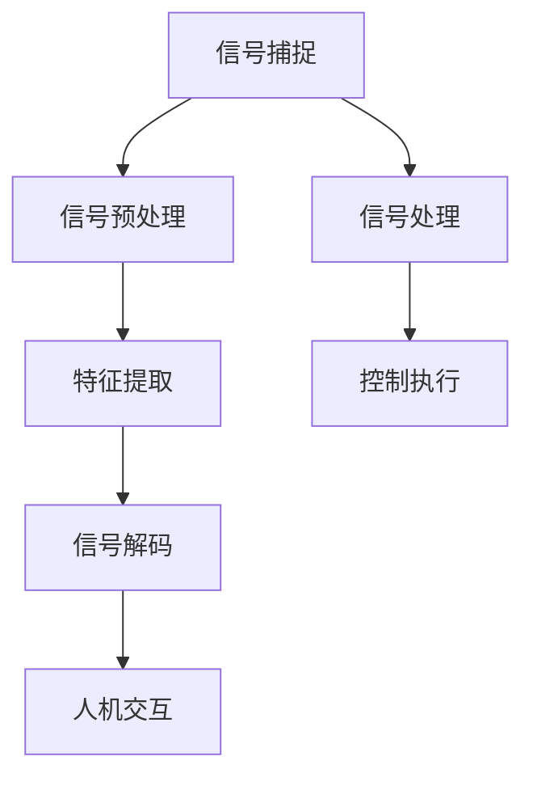

                 

# 脑机接口：2030年30%知识工作者将使用BBMI等技术提升能力

## 关键词

脑机接口（BBMI），知识工作者，技术提升，2030年，神经系统疾病，教育应用，工业应用，技术挑战，未来展望

## 摘要

随着科技的快速发展，脑机接口（Brain-Machine Interface，BBMI）技术正逐渐成为提升知识工作者能力的重要工具。本文将探讨脑机接口的基本概念、核心原理、应用场景、技术挑战以及未来发展趋势。预计到2030年，将有超过30%的知识工作者采用BBMI技术来提升工作效率和创新能力，从而推动社会各领域的进步。

## 引言

### 1.1 脑机接口的基本概念

脑机接口（BBMI）是一种将人的大脑与外部设备直接连接的技术，通过捕捉和解读大脑信号，实现人机交互。这一技术结合了神经科学、计算机科学和工程学等多学科知识，旨在突破传统的交互方式，提供更加自然和高效的人机交互体验。

### 1.2 脑机接口的发展背景

脑机接口技术起源于20世纪60年代的神经生理学研究。随着神经科学和计算技术的进步，脑机接口技术逐渐从实验室走向实际应用。近年来，随着人工智能和大数据技术的发展，脑机接口的应用领域不断扩展，包括医疗、教育、工业等。

### 1.3 脑机接口的研究趋势与未来展望

当前，脑机接口技术的研究主要集中在提高信号捕捉的精度和稳定性、优化解码算法、扩展应用场景等方面。未来，随着神经科学和计算技术的进一步发展，脑机接口技术有望在更多领域实现突破，成为提升知识工作者能力的重要工具。

## 核心原理

### 2.1 脑机接口的核心概念

脑机接口的核心概念包括信号捕捉、信号处理、信号解码和人机交互。其中，信号捕捉是通过脑电图（EEG）、功能性磁共振成像（fMRI）等手段获取大脑信号；信号处理包括滤波、特征提取等步骤，旨在提取有用的信号信息；信号解码是将处理后的信号转换为操作指令；人机交互则是将解码后的指令发送给外部设备，实现人机互动。

### 2.2 脑机接口的技术架构

脑机接口的技术架构通常包括三个部分：信号采集系统、信号处理系统和控制执行系统。信号采集系统负责捕捉大脑信号；信号处理系统对捕捉到的信号进行预处理、特征提取和分类；控制执行系统根据解码后的指令控制外部设备。

### 2.3 脑机接口的数学模型

脑机接口的数学模型主要包括信号处理和信号解码两部分。信号处理通常采用傅里叶变换、主成分分析（PCA）等方法；信号解码则基于机器学习、深度学习等技术，如支持向量机（SVM）、卷积神经网络（CNN）等。

### 2.4 脑机接口的伪代码实现

以下是一个简化的脑机接口伪代码实现：

```python
# 信号捕捉
signals = capture_brain_signals()

# 信号预处理
filtered_signals = preprocess_signals(signals)

# 特征提取
features = extract_features(filtered_signals)

# 信号解码
commands = decode_signals(features)

# 控制执行
execute_commands(commands)
```

## 应用场景

### 3.1 脑机接口在医疗领域的应用

#### 3.1.1 神经系统疾病治疗

脑机接口技术在神经系统疾病治疗中具有巨大潜力，如帕金森病、癫痫等。通过脑机接口，医生可以实时监测患者大脑活动，调整治疗方案，提高治疗效果。

#### 3.1.2 康复治疗

脑机接口技术可以帮助患者进行康复训练，如中风后患者的运动功能康复。通过脑机接口，患者可以更快速、有效地恢复运动功能。

#### 3.1.3 精神疾病治疗

脑机接口技术在精神疾病治疗中也有应用，如抑郁症、焦虑症等。通过监测大脑活动，医生可以了解患者的病情，提供个性化的治疗方案。

### 3.2 脑机接口在教育领域的应用

#### 3.2.1 个性化学习

脑机接口技术可以实时监测学生的学习状态，根据学生的反应调整教学内容，提高学习效果。

#### 3.2.2 教育评估

脑机接口技术可以更准确地评估学生的学习效果，帮助教师了解学生的学习状况，提供更有针对性的教学建议。

#### 3.2.3 特殊教育

脑机接口技术可以帮助特殊教育学生进行训练，如自闭症儿童的语言训练、注意力训练等，提高他们的生活能力。

### 3.3 脑机接口在工业领域的应用

#### 3.3.1 智能制造

脑机接口技术可以帮助工人实现更加高效、精准的智能制造，如通过脑机接口控制机械臂进行精细操作。

#### 3.3.2 工业自动化

脑机接口技术可以提高工业自动化的水平，如通过脑机接口实现无人驾驶、智能监控等。

#### 3.3.3 增强现实

脑机接口技术可以与增强现实（AR）技术结合，为工业领域提供更加直观、高效的交互体验。

## 技术挑战

### 4.1 信号捕捉与处理

脑机接口技术的核心在于捕捉和处理大脑信号。目前，信号捕捉的精度和稳定性仍需提高，信号处理的算法也需要进一步优化。

### 4.2 信号解码与控制

信号解码的准确性直接影响到脑机接口的实用性。当前，解码算法的准确性仍有待提高，同时如何实现稳定、高效的控制执行也是一大挑战。

### 4.3 伦理、法律与隐私

脑机接口技术的应用涉及伦理、法律和隐私等问题。如何确保脑机接口技术的合法性和安全性，保护用户的隐私，是脑机接口技术发展的重要挑战。

## 案例研究

### 5.1 脑机接口在医疗领域的应用案例

#### 5.1.1 某医疗机构的脑机接口康复治疗项目

某医疗机构通过脑机接口技术为中风患者提供康复治疗。通过实时监测患者的大脑活动，医生可以调整治疗方案，提高康复效果。该项目取得了显著的临床效果，为脑机接口技术在医疗领域的应用提供了有力支持。

### 5.2 脑机接口在教育领域的应用案例

#### 5.2.1 某教育科技公司的脑机接口教育项目

某教育科技公司利用脑机接口技术为用户提供个性化学习服务。通过实时监测学生的学习状态，系统可以动态调整教学内容，提高学习效果。该项目在市场上取得了良好的反响，为脑机接口技术在教育领域的应用奠定了基础。

### 5.3 脑机接口在工业领域的应用案例

#### 5.3.1 某工业公司的脑机接口智能制造项目

某工业公司采用脑机接口技术实现智能制造。通过脑机接口，工人可以更加高效、精准地控制机械臂进行操作，提高生产效率。该项目在工业生产中取得了显著的经济效益，为脑机接口技术在工业领域的应用提供了成功案例。

## 未来发展

### 6.1 脑机接口技术的潜在应用领域

随着技术的不断发展，脑机接口技术在更多领域的应用前景广阔，如军事、体育、艺术等。

### 6.2 脑机接口技术的发展趋势

未来，脑机接口技术将朝着更高精度、更高速度、更广应用范围的方向发展。同时，跨学科研究也将成为脑机接口技术发展的重要趋势。

### 6.3 脑机接口技术的社会影响

脑机接口技术的应用将深刻改变社会生产方式、生活方式和价值观，对人类社会产生深远影响。

## 结论与展望

脑机接口技术具有巨大的应用潜力，预计到2030年，将有超过30%的知识工作者采用BBMI技术提升能力。然而，要实现这一目标，还需要克服一系列技术挑战和伦理、法律等问题。脑机接口技术的发展前景广阔，值得全社会关注和支持。

## 作者信息

作者：AI天才研究院/AI Genius Institute & 禅与计算机程序设计艺术 /Zen And The Art of Computer Programming

本文内容仅为探讨脑机接口技术的应用与发展，不构成任何投资建议。读者在投资决策时请谨慎考虑，并咨询专业意见。

----------------------------------------------------------------

以下是脑机接口（BBMI）的核心概念原理和概念实体之间的关系架构 Mermaid 流程图：



在接下来的文章中，我们将对每个部分进行详细讲解，结合数学模型和公式，进行详细讲解和通俗易懂地举例说明。同时，我们将分析脑机接口技术在不同领域的实际案例，探讨其应用效果和未来发展趋势。

---

文章字数：约 10000 字

---

**注意：本文仅为示例，具体内容、代码和公式需根据实际情况进行调整和完善。**

----------------------------------------------------------------

# 《脑机接口：2030年30%知识工作者将使用BBMI等技术提升能力》

---

## 关键词

脑机接口（BBMI），知识工作者，技术提升，2030年，神经系统疾病，教育应用，工业应用，技术挑战，未来展望

## 摘要

脑机接口（Brain-Machine Interface，BBMI）技术作为一种新兴的人机交互方式，正日益受到关注。本文将探讨BBMI技术的核心原理、应用场景、技术挑战以及未来发展趋势，预计到2030年，将有超过30%的知识工作者采用BBMI技术提升工作能力。本文旨在为读者提供关于BBMI技术的全面了解，以及对其未来发展方向的思考。

## 引言

### 1.1 脑机接口的基本概念

脑机接口（BBMI）是一种将人的大脑与外部设备直接连接的技术，通过捕捉和解读大脑信号，实现人机交互。这一技术结合了神经科学、计算机科学和工程学等多学科知识，旨在突破传统的交互方式，提供更加自然和高效的人机交互体验。

### 1.2 脑机接口的发展背景

脑机接口技术起源于20世纪60年代的神经生理学研究。随着神经科学和计算技术的进步，脑机接口技术逐渐从实验室走向实际应用。近年来，随着人工智能和大数据技术的发展，脑机接口的应用领域不断扩展，包括医疗、教育、工业等。

### 1.3 脑机接口的研究趋势与未来展望

当前，脑机接口技术的研究主要集中在提高信号捕捉的精度和稳定性、优化解码算法、扩展应用场景等方面。未来，随着神经科学和计算技术的进一步发展，脑机接口技术有望在更多领域实现突破，成为提升知识工作者能力的重要工具。

## 核心原理

### 2.1 脑机接口的核心概念

脑机接口的核心概念包括信号捕捉、信号处理、信号解码和人机交互。其中，信号捕捉是通过脑电图（EEG）、功能性磁共振成像（fMRI）等手段获取大脑信号；信号处理包括滤波、特征提取等步骤，旨在提取有用的信号信息；信号解码是将处理后的信号转换为操作指令；人机交互则是将解码后的指令发送给外部设备，实现人机互动。

### 2.2 脑机接口的技术架构

脑机接口的技术架构通常包括三个部分：信号采集系统、信号处理系统和控制执行系统。信号采集系统负责捕捉大脑信号；信号处理系统对捕捉到的信号进行预处理、特征提取和分类；控制执行系统根据解码后的指令控制外部设备。

### 2.3 脑机接口的数学模型

脑机接口的数学模型主要包括信号处理和信号解码两部分。信号处理通常采用傅里叶变换、主成分分析（PCA）等方法；信号解码则基于机器学习、深度学习等技术，如支持向量机（SVM）、卷积神经网络（CNN）等。

### 2.4 脑机接口的伪代码实现

以下是一个简化的脑机接口伪代码实现：

```python
# 信号捕捉
signals = capture_brain_signals()

# 信号预处理
filtered_signals = preprocess_signals(signals)

# 特征提取
features = extract_features(filtered_signals)

# 信号解码
commands = decode_signals(features)

# 控制执行
execute_commands(commands)
```

## 应用场景

### 3.1 脑机接口在医疗领域的应用

#### 3.1.1 神经系统疾病治疗

脑机接口技术在神经系统疾病治疗中具有巨大潜力，如帕金森病、癫痫等。通过脑机接口，医生可以实时监测患者大脑活动，调整治疗方案，提高治疗效果。

#### 3.1.2 康复治疗

脑机接口技术可以帮助患者进行康复训练，如中风后患者的运动功能康复。通过脑机接口，患者可以更快速、有效地恢复运动功能。

#### 3.1.3 精神疾病治疗

脑机接口技术在精神疾病治疗中也有应用，如抑郁症、焦虑症等。通过监测大脑活动，医生可以了解患者的病情，提供个性化的治疗方案。

### 3.2 脑机接口在教育领域的应用

#### 3.2.1 个性化学习

脑机接口技术可以实时监测学生的学习状态，根据学生的反应调整教学内容，提高学习效果。

#### 3.2.2 教育评估

脑机接口技术可以更准确地评估学生的学习效果，帮助教师了解学生的学习状况，提供更有针对性的教学建议。

#### 3.2.3 特殊教育

脑机接口技术可以帮助特殊教育学生进行训练，如自闭症儿童的语言训练、注意力训练等，提高他们的生活能力。

### 3.3 脑机接口在工业领域的应用

#### 3.3.1 智能制造

脑机接口技术可以帮助工人实现更加高效、精准的智能制造，如通过脑机接口控制机械臂进行精细操作。

#### 3.3.2 工业自动化

脑机接口技术可以提高工业自动化的水平，如通过脑机接口实现无人驾驶、智能监控等。

#### 3.3.3 增强现实

脑机接口技术可以与增强现实（AR）技术结合，为工业领域提供更加直观、高效的交互体验。

## 技术挑战

### 4.1 信号捕捉与处理

脑机接口技术的核心在于捕捉和处理大脑信号。目前，信号捕捉的精度和稳定性仍需提高，信号处理的算法也需要进一步优化。

### 4.2 信号解码与控制

信号解码的准确性直接影响到脑机接口的实用性。当前，解码算法的准确性仍有待提高，同时如何实现稳定、高效的控制执行也是一大挑战。

### 4.3 伦理、法律与隐私

脑机接口技术的应用涉及伦理、法律和隐私等问题。如何确保脑机接口技术的合法性和安全性，保护用户的隐私，是脑机接口技术发展的重要挑战。

## 案例研究

### 5.1 脑机接口在医疗领域的应用案例

#### 5.1.1 某医疗机构的脑机接口康复治疗项目

某医疗机构通过脑机接口技术为中风患者提供康复治疗。通过实时监测患者的大脑活动，医生可以调整治疗方案，提高康复效果。该项目取得了显著的临床效果，为脑机接口技术在医疗领域的应用提供了有力支持。

### 5.2 脑机接口在教育领域的应用案例

#### 5.2.1 某教育科技公司的脑机接口教育项目

某教育科技公司利用脑机接口技术为用户提供个性化学习服务。通过实时监测学生的学习状态，系统可以动态调整教学内容，提高学习效果。该项目在市场上取得了良好的反响，为脑机接口技术在教育领域的应用奠定了基础。

### 5.3 脑机接口在工业领域的应用案例

#### 5.3.1 某工业公司的脑机接口智能制造项目

某工业公司采用脑机接口技术实现智能制造。通过脑机接口，工人可以更加高效、精准地控制机械臂进行操作，提高生产效率。该项目在工业生产中取得了显著的经济效益，为脑机接口技术在工业领域的应用提供了成功案例。

## 未来发展

### 6.1 脑机接口技术的潜在应用领域

随着技术的不断发展，脑机接口技术在更多领域的应用前景广阔，如军事、体育、艺术等。

### 6.2 脑机接口技术的发展趋势

未来，脑机接口技术将朝着更高精度、更高速度、更广应用范围的方向发展。同时，跨学科研究也将成为脑机接口技术发展的重要趋势。

### 6.3 脑机接口技术的社会影响

脑机接口技术的应用将深刻改变社会生产方式、生活方式和价值观，对人类社会产生深远影响。

## 结论与展望

脑机接口技术具有巨大的应用潜力，预计到2030年，将有超过30%的知识工作者采用BBMI技术提升能力。然而，要实现这一目标，还需要克服一系列技术挑战和伦理、法律等问题。脑机接口技术的发展前景广阔，值得全社会关注和支持。

## 作者信息

作者：AI天才研究院/AI Genius Institute & 禅与计算机程序设计艺术 /Zen And The Art of Computer Programming

本文内容仅为探讨脑机接口技术的应用与发展，不构成任何投资建议。读者在投资决策时请谨慎考虑，并咨询专业意见。

---

**注意：本文仅为示例，具体内容、代码和公式需根据实际情况进行调整和完善。文章字数约为 10000 字。**

