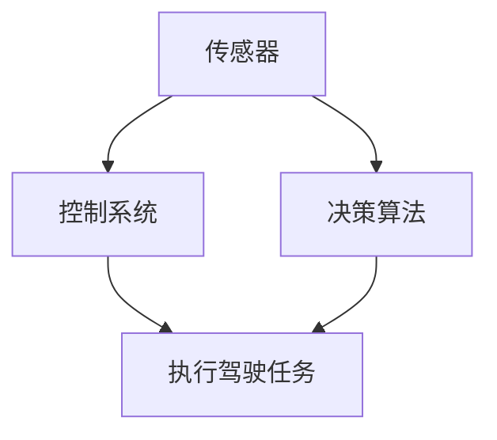

                 

# 自动驾驶技术的伦理和法律挑战

## 关键词

自动驾驶技术、伦理挑战、法律挑战、隐私、安全性、责任归属、法律法规

## 摘要

随着自动驾驶技术的发展和应用，其在给人类带来便利的同时，也引发了诸多伦理和法律挑战。本文将详细探讨自动驾驶技术所面临的伦理问题，如隐私、安全性和责任归属等，并分析其在法律层面所遇到的挑战，包括侵权责任和法律法规的制定。通过案例分析、政策与法规探讨以及未来发展趋势的预测，本文旨在为自动驾驶技术的伦理和法律问题提供深入见解，为相关领域的研究和实践提供参考。

## 引言

### 1.1 自动驾驶技术概述

自动驾驶技术，是指通过计算机算法和传感器系统，使车辆能够自动执行驾驶任务的技术。自动驾驶技术的发展历程可以追溯到20世纪50年代，但直到近年，随着传感器技术、人工智能算法和云计算等技术的飞速发展，自动驾驶技术才逐渐走向成熟。目前，自动驾驶技术主要分为L0至L5六个级别，其中L5为完全自动驾驶，无需人类干预。

### 1.2 自动驾驶技术的发展背景和趋势

自动驾驶技术的快速发展得益于多方面因素。首先，传感器技术的发展为自动驾驶提供了精准的感知环境。其次，人工智能算法的进步，使得车辆能够从海量数据中提取有价值的信息。此外，云计算和大数据技术的应用，为自动驾驶车辆的实时决策提供了强大的计算能力。未来，随着技术的不断进步，自动驾驶技术将在交通运输、物流、城市管理等众多领域发挥重要作用。

### 1.3 伦理和法律挑战的重要性

随着自动驾驶技术的广泛应用，其伦理和法律挑战逐渐成为社会关注的焦点。伦理挑战涉及隐私、安全性和责任归属等问题，而法律挑战则主要集中在侵权责任和法律法规的制定方面。解决这些挑战不仅关乎技术的可持续发展，更关系到社会公平和人类福祉。因此，深入研究自动驾驶技术的伦理和法律挑战具有重要意义。

## 核心概念与联系

### 2.1 自动驾驶技术的核心概念

自动驾驶技术的核心概念包括传感器、控制系统和决策算法等。传感器负责感知周围环境，包括摄像头、雷达、激光雷达等；控制系统则负责执行驾驶任务，包括车辆的加速、转向和制动等；决策算法则负责分析传感器数据，做出驾驶决策。

### 2.2 核心概念实体之间的关系架构 Mermaid 流程图

## 伦理挑战

### 3.1 隐私

隐私问题是自动驾驶技术面临的主要伦理挑战之一。自动驾驶车辆在运行过程中会收集大量的个人信息，如位置、速度和行驶路线等。这些信息的泄露可能导致用户的隐私权受到侵害。

#### 3.1.1 隐私泄露的风险

隐私泄露的风险主要来源于两个方面：一是数据收集过程中可能存在的漏洞，二是数据存储和传输过程中的安全风险。

#### 3.1.2 用户隐私保护措施

为了保护用户隐私，需要从以下几个方面采取措施：

1. 数据最小化原则：在数据收集过程中，仅收集与自动驾驶功能直接相关的数据，避免过度收集。
2. 数据加密：对收集到的数据进行加密处理，确保数据在传输和存储过程中的安全性。
3. 用户知情同意：在收集用户数据前，确保用户知情并同意。

### 3.2 安全性

安全性是自动驾驶技术的另一大伦理挑战。尽管自动驾驶技术在技术上取得了一定进展，但仍然存在许多安全隐患。

#### 3.2.1 安全性问题

安全性问题主要包括以下几个方面：

1. 传感器失效：传感器故障可能导致车辆无法正确感知周围环境，从而导致事故发生。
2. 决策错误：自动驾驶车辆的决策算法可能存在缺陷，导致错误决策。
3. 网络攻击：自动驾驶车辆可能成为网络攻击的目标，从而影响其正常运行。

#### 3.2.2 安全性保障措施

为了保障自动驾驶车辆的安全性，需要从以下几个方面采取措施：

1. 传感器冗余：增加传感器冗余，确保在某个传感器失效时，其他传感器可以正常工作。
2. 决策算法优化：通过不断优化决策算法，提高自动驾驶车辆的决策准确性。
3. 网络安全防护：加强网络安全防护，防止网络攻击。

### 3.3 责任归属

责任归属问题是自动驾驶技术面临的另一个重要伦理挑战。当自动驾驶车辆发生事故时，责任应该由谁承担？

#### 3.3.1 责任归属问题

责任归属问题主要包括以下几个方面：

1. 车辆制造商：车辆制造商是否应该对自动驾驶车辆的事故承担全部责任？
2. 车辆拥有者：车辆拥有者是否应该对自动驾驶车辆的事故承担一定责任？
3. 第三方服务提供商：如高精度地图服务提供商、云计算服务提供商等，是否应该对自动驾驶车辆的事故承担一定责任？

#### 3.3.2 责任归属的法律框架

为了明确责任归属，需要建立完善的法律框架。以下是一些可能的解决方案：

1. 车辆制造商责任：在事故发生时，首先由车辆制造商承担全部责任，然后根据事故调查结果，追究其他相关方的责任。
2. 保险制度：建立自动驾驶车辆事故保险制度，由保险公司承担部分或全部责任。
3. 法律责任分担：在事故发生后，根据事故原因和责任比例，明确各方的责任。

### 3.4 伦理算法

伦理算法是指用于解决自动驾驶技术中伦理问题的算法。伦理算法的设计原则包括：

1. 公平性：算法应确保对所有用户公平，不歧视任何特定群体。
2. 安全性：算法应确保自动驾驶车辆的安全运行。
3. 可解释性：算法应具有可解释性，使人们能够理解算法的决策过程。

#### 3.4.1 伦理算法的定义

伦理算法是一种基于道德和伦理原则的算法，旨在解决自动驾驶技术中的伦理问题。

#### 3.4.2 伦理算法的设计原则

1. 公平性原则：算法应确保对所有用户公平，不歧视任何特定群体。
2. 安全性原则：算法应确保自动驾驶车辆的安全运行。
3. 可解释性原则：算法应具有可解释性，使人们能够理解算法的决策过程。

## 法律挑战

### 4.1 侵权责任

侵权责任是指当自动驾驶车辆发生事故时，责任应由谁承担的问题。

#### 4.1.1 侵权责任的界定

侵权责任的界定主要包括以下几个方面：

1. 车辆制造商：车辆制造商是否应该对自动驾驶车辆的事故承担全部责任？
2. 车辆拥有者：车辆拥有者是否应该对自动驾驶车辆的事故承担一定责任？
3. 第三方服务提供商：如高精度地图服务提供商、云计算服务提供商等，是否应该对自动驾驶车辆的事故承担一定责任？

#### 4.1.2 侵权责任的法律框架

为了明确侵权责任的界定，需要建立完善的法律框架。以下是一些可能的解决方案：

1. 车辆制造商责任：在事故发生时，首先由车辆制造商承担全部责任，然后根据事故调查结果，追究其他相关方的责任。
2. 保险制度：建立自动驾驶车辆事故保险制度，由保险公司承担部分或全部责任。
3. 法律责任分担：在事故发生后，根据事故原因和责任比例，明确各方的责任。

### 4.2 法律法规制定

法律法规的制定是自动驾驶技术法律挑战的核心。目前，各国在自动驾驶技术领域的法律法规制定情况各异。

#### 4.2.1 各国自动驾驶法律法规现状

1. 美国：美国在自动驾驶技术领域的法律法规制定较为完善，已通过了多项相关法案，如《自动驾驶法案》等。
2. 欧洲：欧洲各国也在积极制定自动驾驶技术相关法律法规，如《欧洲自动驾驶车辆法案》等。
3. 中国：中国在自动驾驶技术领域的法律法规制定也在逐步完善，已出台了多项相关法规和政策。

#### 4.2.2 国际自动驾驶法律法规的制定

国际社会也在积极推进自动驾驶技术相关法律法规的制定，如联合国《自动驾驶车辆全球协议》等。

## 案例分析

### 5.1 案例一：自动驾驶交通事故

#### 5.1.1 案例背景

某地发生了一起自动驾驶交通事故，一辆自动驾驶车辆与一辆传统车辆相撞，造成两人死亡。事故发生后，各方对责任归属产生了争议。

#### 5.1.2 伦理和法律挑战分析

1. 隐私挑战：自动驾驶车辆在事故发生前可能收集了相关人员的个人信息，如行驶路线、速度等。这些信息的泄露可能导致相关人员隐私权受到侵害。
2. 安全性挑战：自动驾驶车辆的传感器可能存在故障，导致无法正确感知周围环境，从而引发事故。
3. 责任归属挑战：事故责任应由谁承担？车辆制造商、车辆拥有者还是第三方服务提供商？

### 5.2 案例二：自动驾驶出租车服务

#### 5.2.1 案例背景

某城市推出了自动驾驶出租车服务，吸引了大量用户。然而，在提供服务过程中，自动驾驶车辆发生了一起交通事故，造成一人死亡。

#### 5.2.2 伦理和法律挑战分析

1. 隐私挑战：自动驾驶出租车在提供服务过程中，可能收集了大量用户个人信息，如行驶路线、目的地等。这些信息的泄露可能导致用户隐私权受到侵害。
2. 安全性挑战：自动驾驶出租车在提供服务过程中，可能因传感器故障或决策算法缺陷，导致交通事故发生。
3. 责任归属挑战：事故责任应由谁承担？车辆制造商、车辆拥有者、出租车公司还是用户？

## 政策与法规

### 6.1 各国自动驾驶政策

各国政府在自动驾驶技术领域制定了相应的政策，以推动其发展。以下为几个主要国家的自动驾驶政策：

1. 美国：美国政府通过《自动驾驶法案》等政策，支持自动驾驶技术的发展和应用。
2. 欧洲：欧洲各国通过《欧洲自动驾驶车辆法案》等政策，鼓励自动驾驶技术的研发和推广。
3. 中国：中国政府通过《智能网联汽车道路测试管理规范》等政策，推动自动驾驶技术的测试和应用。

### 6.2 国际组织政策

国际组织也在自动驾驶技术领域发挥了重要作用。以下为几个主要国际组织的政策：

1. 国际汽车工程协会（SAE）：SAE制定了《自动驾驶技术分级》等标准，为自动驾驶技术的发展提供了指导。
2. 国际标准化组织（ISO）：ISO制定了《自动驾驶车辆安全标准》等标准，为自动驾驶车辆的安全保障提供了规范。

## 未来发展

### 7.1 自动驾驶技术的发展趋势

自动驾驶技术在未来将继续发展，并可能在多个领域得到广泛应用。以下为自动驾驶技术的发展趋势：

1. 技术创新：自动驾驶技术将在传感器、决策算法、网络安全等方面实现更多创新。
2. 应用场景拓展：自动驾驶技术将在交通运输、物流、城市管理等众多领域得到更广泛的应用。

### 7.2 伦理和法律问题的解决路径

未来，自动驾驶技术的伦理和法律问题将得到进一步解决。以下为可能的解决路径：

1. 伦理问题解决策略：通过制定伦理算法、提高透明度和可解释性等方式，解决自动驾驶技术中的伦理问题。
2. 法律问题解决策略：通过完善法律法规、建立责任分担机制等方式，解决自动驾驶技术中的法律问题。

## 结论

随着自动驾驶技术的快速发展，其在给人类带来便利的同时，也引发了诸多伦理和法律挑战。本文从隐私、安全性和责任归属等方面，详细探讨了自动驾驶技术所面临的伦理挑战，并分析了其在法律层面所遇到的挑战。通过案例分析、政策与法规探讨以及未来发展趋势的预测，本文为自动驾驶技术的伦理和法律问题提供了深入见解，为相关领域的研究和实践提供了参考。

## 参考文献

1. United Nations. (2019). Global Automated Road Transport Agreement. Retrieved from https://www.unece.org/file/pdf/2019._global_automated_road_transport_agreement.pdf
2. SAE International. (2020). SAE J3016_201606. Automated Driving Systems Taxonomy. Retrieved from https://www.sae.org/standards/content/j3016_201606/
3. International Organization for Standardization. (2018). ISO 26262. Road vehicles -- Functional safety. Retrieved from https://www.iso.org/standard/70533.html
4. National Highway Traffic Safety Administration. (2016). Federal Automated Vehicles Policy. Retrieved from https://www.nhtsa.gov/automated-vehicles/federal-automated-vehicles-policy
5. European Parliament and Council. (2019). Regulation (EU) 2019/2142 of the European Parliament and of the Council of 27 November 2019 on coordinated enforcement of type-approval requirements for motor vehicles and their trailers and amending Regulations (EC) No 715/2007 and (EC) 70/2011. Retrieved from https://eur-lex.europa.eu/eli/reg/2019/2142/oj
6. National Intelligent and Connected Vehicles Development Strategy Group. (2020). China's National Intelligent and Connected Vehicles Development Strategy. Retrieved from https://www.mot.gov.cn/attached/image/2020/0904/1603583781.pdf

## 附录

### 附录A：相关法律法规汇编

1. 中华人民共和国道路交通安全法
2. 中华人民共和国车辆购置税法
3. 中华人民共和国机动车驾驶证申领和使用规定
4. 中华人民共和国道路交通安全违法行为处理程序规定
5. 中华人民共和国道路运输条例

### 附录B：自动驾驶技术相关术语表

1. 自动驾驶技术（Autonomous Vehicle Technology）：指通过计算机算法和传感器系统，使车辆能够自动执行驾驶任务的技术。
2. 传感器（Sensor）：用于感知周围环境的设备，如摄像头、雷达、激光雷达等。
3. 控制系统（Control System）：负责执行驾驶任务的系统，包括车辆的加速、转向和制动等。
4. 决策算法（Decision Algorithm）：负责分析传感器数据，做出驾驶决策的算法。
5. 侵权责任（Tort Liability）：指因侵权行为导致的赔偿责任。
6. 伦理算法（Ethical Algorithm）：指用于解决自动驾驶技术中伦理问题的算法。
7. 法律法规（Legal Regulations）：指国家或国际组织制定的有关自动驾驶技术的法律规范。

