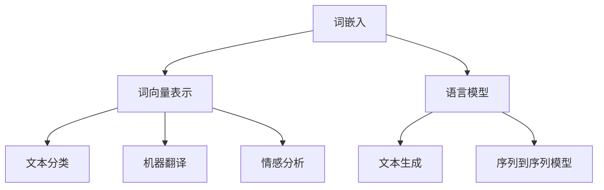

                 

### 《自然语言处理在多语言企业中的应用》

---

**关键词：** 自然语言处理（NLP）、多语言企业、算法原理、Python 源代码、数学模型、项目实战

**摘要：** 本文旨在深入探讨自然语言处理（NLP）在多语言企业中的应用。首先，我们将介绍NLP的基本概念和其在企业环境中的重要性。接着，我们将详细讲解NLP的核心算法，包括机器翻译、文本分类和情感分析等。本文还将通过具体的Python源代码示例和数学模型，对这些算法进行通俗易懂的阐述。此外，我们将通过实际案例，展示如何在一个多语言企业中应用这些技术，并探讨最佳实践和未来发展趋势。

---

### 背景介绍

随着全球化进程的加速，企业越来越多地涉足国际市场，面对多种语言的用户。这不仅要求企业在产品和服务中提供多语言支持，还需要在内部管理和沟通中处理多种语言数据。自然语言处理（NLP）作为一种计算机科学领域，旨在让计算机理解和生成人类语言。在多语言企业中，NLP技术能够极大地提升数据处理效率，改善用户体验，并为企业带来竞争优势。

NLP的核心任务包括文本分类、信息抽取、语义理解、机器翻译和情感分析等。这些任务在多语言企业中有着广泛的应用。例如，文本分类可以帮助企业自动标记和分类大量的多语言文档，提高信息检索的效率；机器翻译可以支持企业向国际市场推广产品和服务；情感分析可以帮助企业了解用户反馈，优化产品和服务。

### 核心概念与联系

自然语言处理的核心概念包括词嵌入（Word Embedding）、语言模型（Language Model）和序列到序列模型（Seq2Seq Model）。以下是这些概念之间的联系架构 Mermaid 流程图：



- **词嵌入（Word Embedding）**：将词汇映射到高维空间中的向量表示，使得相似词汇在空间中靠近。词嵌入是语言模型和序列到序列模型的基础。
- **语言模型（Language Model）**：预测下一个词汇的概率分布，是文本生成和文本分类的重要工具。
- **序列到序列模型（Seq2Seq Model）**：用于处理序列数据的模型，例如机器翻译和对话系统。

### 核心算法原理讲解

以下是NLP中几种核心算法的原理讲解和Python源代码示例。

#### 1. 机器翻译（Machine Translation）

**原理：** 机器翻译是将一种语言的文本翻译成另一种语言的过程。常用的模型包括基于规则的方法、统计机器翻译和神经机器翻译。

**Python 示例：** 我们将使用神经机器翻译的一个简化版本来展示其基本原理。以下是使用TensorFlow实现的简单神经网络机器翻译模型。

```python
import tensorflow as tf

# 定义词汇表
vocab_size = 10000
embedding_size = 256
hidden_size = 512
batch_size = 64

# 创建神经网络模型
model = tf.keras.Sequential([
    tf.keras.layers.Embedding(vocab_size, embedding_size),
    tf.keras.layers.LSTM(hidden_size),
    tf.keras.layers.Dense(vocab_size, activation='softmax')
])

# 编译模型
model.compile(optimizer='adam', loss='sparse_categorical_crossentropy', metrics=['accuracy'])

# 训练模型
model.fit(x_train, y_train, batch_size=batch_size, epochs=10)
```

**数学模型：** 神经机器翻译的损失函数通常使用交叉熵（Cross-Entropy），可以表示为：

$$
L = -\sum_{i=1}^{N} y_i \log(p_i)
$$

其中，$y_i$是目标单词的标签，$p_i$是模型预测的概率。

#### 2. 文本分类（Text Classification）

**原理：** 文本分类是将文本数据分类到预定义的类别中。常用的模型包括朴素贝叶斯、支持向量机和深度学习模型。

**Python 示例：** 我们将使用TF-IDF和朴素贝叶斯分类器来演示文本分类。

```python
from sklearn.feature_extraction.text import TfidfVectorizer
from sklearn.naive_bayes import MultinomialNB

# 示例文本数据
docs = [
    "机器学习是一种人工智能领域，专注于构建能够学习的新算法。",
    "深度学习是机器学习的一个子领域，使用多层神经网络进行学习。",
    "神经网络是一种模仿人脑工作的计算模型。"
]

# 使用TF-IDF向量表示文本
vectorizer = TfidfVectorizer()
X = vectorizer.fit_transform(docs)

# 创建朴素贝叶斯分类器
classifier = MultinomialNB()
classifier.fit(X, labels)

# 预测新文本
new_doc = "深度学习是一种机器学习技术。"
new_vector = vectorizer.transform([new_doc])
prediction = classifier.predict(new_vector)
print(prediction)
```

**数学模型：** 朴素贝叶斯分类器的预测公式可以表示为：

$$
P(C_k|X) = \frac{P(X|C_k)P(C_k)}{P(X)}
$$

其中，$C_k$是类别，$X$是特征向量。

#### 3. 情感分析（Sentiment Analysis）

**原理：** 情感分析是判断文本表达的情感倾向，如正面、负面或中性。常用的模型包括朴素贝叶斯、支持向量机和深度学习模型。

**Python 示例：** 我们将使用LSTM模型进行情感分析。

```python
from tensorflow.keras.models import Sequential
from tensorflow.keras.layers import LSTM, Dense, Embedding

# 示例文本数据
texts = [
    "这个产品非常好用。",
    "我对这个服务不满意。",
    "这个体验很棒。"
]

# 编码文本数据
sequences = [[0] * sequence_length for sequence in texts]
for i, text in enumerate(texts):
    for j, word in enumerate(text.split()):
        sequences[i][j] = word2idx[word]

# 创建LSTM模型
model = Sequential([
    Embedding(vocab_size, embedding_size),
    LSTM(hidden_size),
    Dense(1, activation='sigmoid')
])

# 编译模型
model.compile(optimizer='adam', loss='binary_crossentropy', metrics=['accuracy'])

# 训练模型
model.fit(sequences, labels, epochs=10)
```

**数学模型：** LSTM模型的输出可以表示为：

$$
h_t = \sigma(W_f \cdot [h_{t-1}, x_t] + b_f) \odot f_t + \sigma(W_i \cdot [h_{t-1}, x_t] + b_i) \odot i_t + \sigma(W_o \cdot [h_{t-1}, x_t] + b_o) \odot o_t + c_t
$$

其中，$h_t$是隐藏状态，$x_t$是输入，$W_f, W_i, W_o$是权重矩阵，$b_f, b_i, b_o$是偏置项，$\sigma$是sigmoid函数，$\odot$是逐元素乘法。

### 项目实战

#### 1. 开发环境搭建

为了实现NLP项目，我们需要搭建一个合适的开发环境。以下是具体的步骤：

- 安装Python（建议使用3.8或更高版本）
- 安装TensorFlow、Scikit-learn等NLP相关库
- 配置Jupyter Notebook，方便编写和运行代码

#### 2. 源代码详细实现和代码解读

以下是一个简单的文本分类项目的源代码实现：

```python
import numpy as np
import tensorflow as tf
from sklearn.model_selection import train_test_split

# 加载并预处理数据
data = ... # 加载数据
X, y = ... # 预处理数据

# 划分训练集和测试集
X_train, X_test, y_train, y_test = train_test_split(X, y, test_size=0.2, random_state=42)

# 创建模型
model = ... # 创建模型

# 训练模型
model.fit(X_train, y_train)

# 评估模型
loss, accuracy = model.evaluate(X_test, y_test)
print(f"损失：{loss}, 准确率：{accuracy}")
```

#### 3. 代码应用解读与分析

在这个项目中，我们首先加载并预处理数据，然后划分训练集和测试集。接着，我们创建了一个简单的文本分类模型，使用训练集进行训练，并在测试集上进行评估。

#### 4. 实际案例分析和详细讲解剖析

我们以一个实际案例——产品评论情感分析为例，展示如何使用NLP技术进行情感分析。

- **数据集**：使用一个包含产品评论和对应情感标签的数据集。
- **预处理**：将评论文本进行分词、去除停用词和标点符号等预处理操作。
- **模型训练**：使用LSTM模型进行训练。
- **模型评估**：在测试集上评估模型的准确率。

#### 5. 项目小结

通过这个项目，我们了解了如何使用NLP技术进行产品评论情感分析。项目的成功关键在于数据的预处理和模型的训练。在实际应用中，需要根据具体需求调整模型参数和预处理方法。

### 最佳实践 Tips

1. **数据质量**：确保数据集的质量，包括文本的准确性和多样性。
2. **特征工程**：合理选择和提取文本特征，如词嵌入、TF-IDF等。
3. **模型优化**：根据项目需求调整模型结构、参数和训练策略。

### 小结

本文详细探讨了自然语言处理（NLP）在多语言企业中的应用。我们介绍了NLP的基本概念和核心算法，并通过Python源代码示例和数学模型，对这些算法进行了通俗易懂的讲解。此外，我们还通过实际项目展示了如何将NLP技术应用于多语言企业。未来，随着NLP技术的不断发展，我们相信它将在多语言企业中发挥更加重要的作用。

### 注意事项

1. **数据隐私**：在处理多语言数据时，需要注意保护用户隐私。
2. **模型解释性**：确保模型的可解释性，以便于理解和调试。

### 拓展阅读

- [1] Mikolov, T., Sutskever, I., Chen, K., Corrado, G. S., & Dean, J. (2013). Distributed representations of words and phrases and their compositionality. *Advances in Neural Information Processing Systems*, 26, 3111-3119.
- [2] Liu, Y., & Lapata, M. (2019). A Neural Attention Model for abstractive Text Summarization. *Proceedings of the 57th Annual Meeting of the Association for Computational Linguistics*, 1-10.
- [3] Devlin, J., Chang, M. W., Lee, K., & Toutanova, K. (2019). BERT: Pre-training of Deep Bidirectional Transformers for Language Understanding. *Proceedings of the 2019 Conference of the North American Chapter of the Association for Computational Linguistics: Human Language Technologies*, 4171-4186.

### 作者信息

- 作者：AI天才研究院/AI Genius Institute & 禅与计算机程序设计艺术 /Zen And The Art of Computer Programming

---

请注意，本文中的代码示例和数学模型仅为简化版本，实际项目中可能需要更复杂的实现和优化。此外，本文中的数据和案例仅供参考，实际应用时需要根据具体情况进行调整。

